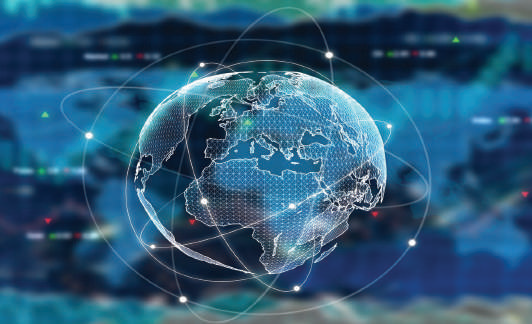
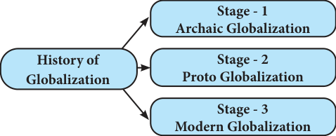
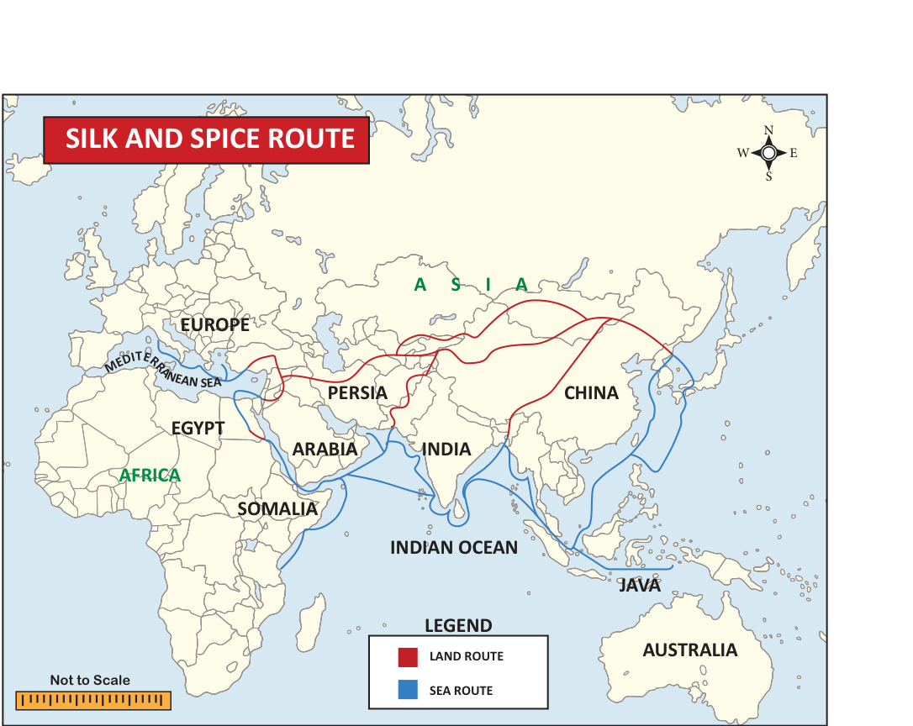
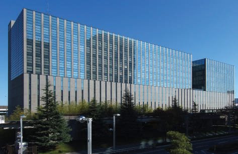
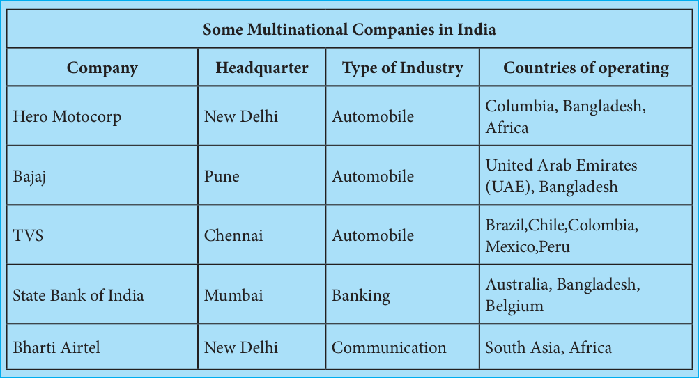
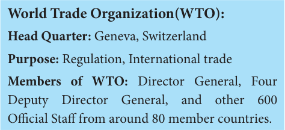
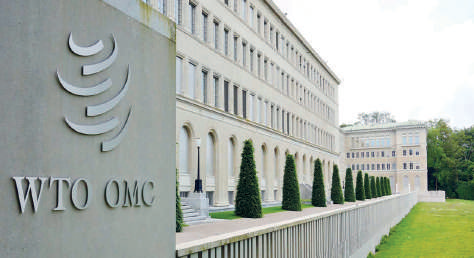

# Economics Unit 2: Globalization and Trade

## Learning Objectives

- To know the meaning and history of globalization.

- To know the trade and traders in South India from historical perspective.

- To know the evolution of growth of MNC.

- To know the fair trade practices and WTO.

- To understand the impact and challenges of globalization.

## Introduction

Liberalization, Privatization and Globalization (LPG) have become a much talked of subjects among politicians, economists and businessmen in present time.

## 2.1 Globalization

Globalization is the integration of a country with the world economy. Basically, globalization signifies a process of internationalization plus liberalization.

**Globalization**

## 2.2 History of Globalization

The term of ‘Globalization’ was introduced by Prof. Theodore Levitt. The historical background of globalization can be discussed on three stages.

### Archaic Globalization

Andre Gunder Frank argued that a form of globalization has been in existence since the rise of trade links between Sumer and Indus valley civilization in the third millennium BC (BCE). An early form of globalized economics and culture, known as Archaic globalization existed during the Hellenistic Age. An early form of globalization in the trade link between the Roman Empire, Parthian Empire and the Han Dynasty made the commercial links among these powers inspired the development of the Silk Road.

The Islamic Age was also an important early stage of globalization. The advent of the Mongol Empire, though destabilizing to the commercial

**Silk Route and Spice Route**

centers of the Middle East and China, greatly facilitated travel along the Silk Road. These pre-modern phase of global exchange are sometimes known as archaic globalization.

### Proto Globalization

The next phase is known as proto globalization. It was charterized by the rise of maritime European empires, in the 16th and 17th centuries, first by the Portuguese and Spanish Empires, Dutch and British empires. In the 17th century, globalization became private business phenomenon like British East India Company described as the first multinational company.

### Modern Globalization

The 19th century witnessed the advent of globalization approaching its modern form. Between the globalization in the 19th and in the 20th century there are significant differences. There are two main points one is the global trade in these centuries as well as the capital, investment and the economy and another one is the global trade in the 20th century that shows a higher share of trade in merchant production, a growth of the trade in services and the rise of production and trade by multinational firms.

## 2.3 Trade and Traders in South India-Historical Perspective

Southern Indian trade guilds were formed by merchants in order to organize and expand their trading activities. Trade guilds become channels through which Indian culture spread to other lands.

### Early Traders

In the year 1053 A.D. (C.E.), the Kalinga traders (Modern Odisha) brought red colored stone decorative objects for trade and also cotton textile to Southeast Asia at an early date.

### European Traders

This was due to the trading activities of the various European companies which came to India during this period. The discovery of a new all-sea route from Europe to India Via cape of Good Hope by Vasco da Gama had far-reaching repercussions on the civilized world.

### The Portuguese

The Portuguese under the leadership of Vasco da Gama landed at Calicut on May, 1498. Profits from goods brought by Vasco do Gama to Portugal were to 60 times cost of the entire expedition to India. The second trip of Vasco da Gama in 1502 led to the establishment of trading station at Calicut, Cochin and Cannanore. Cochin was the early capital of the Portuguese in India.

### The Dutch

The Dutch undertook several voyages from 1596 and formed the Dutch East India company (VOC) in 1602. In 1605, Admiral van der Hagen established Dutch Factory at Masulipatnam and Pettapoli (Nizamapatanam), Devanampatinam. In 1610, upon negotiating with the king of Chandragiri, found another facatory at Pulicut. Other commodities exported by the Dutch were indigo, and Bengal raw silk. Pulicut was the headquarters of the Dutch in India.

### The British

On 31st December, 1600, Queen Elizabeth granted charter to The East India Company. On the south-eastern coast, the English established at Masulipatnam in 1611 and near Pulical in 1626. The Sultan of Golconda granted the English the “Golden Fireman” in 1632 by which they were allowed to trade freely in their “Kingdom Ports”. In 1639, built a fortified factory in Madras which known as Fort St.George.

### The Danes

The Danes formed an East India company and arrived in India in 1616. The Danish settlements were established at Tranquebar ( in Tamil Nadu) in 1620 which was the headquarters of Danes in India. They failed to strengthen themselves, in India and in 1845 were forced to sell all their India settlements to the British.

### The French

The first French factory in India was established in 1668 by obtaining permission from the Sultan of Golconda. In 1693, the Dutch captured Pondicherry but was handed back to the French. In 1701, Pondicherry was the headquarters of the French.

## 2.4 Globalization in India

In India the period after 1980-81 was marked by severe balance of payment difficulties mainly due to hike in oil price and Gulf war in 1990-91 and hostilities in West Asia.

When the new government took over in June 1991. India had unprecedented balance of payment crisis.

With the downgrading of India’s credit rating by some international agencies, there was heavy flight of capital out of India.

Since India lost its credit worthiness in the international market, the government mortgaged 40 tons of gold to the Bank of England. Under these circumstances, the government for 1991-92 presented its budget in July 1991 with a series of policy changes which underlined globalization, liberalization and privatization. This has come to be called as India’s new economic policy. These policies were strengthened when India signed the Dunkel Draft in 1994.

### Reforms made to adopt Globalization:- (New Economic policy in India)

1. Abolition of Industrial licensing, except for a few industries.

2. Reduction in the number of industries reserved for public sector.

3. Fixation of a realistic exchange rate of rupee to exchange exports of Indian goods.

4. Foreign private sector by making rupee convertible on trade, on current account and by reducing import duties.

5. Foreign exchanges regulations were suitably amended

6. The Statutory Liquidity Ratio (SLR) was reduced to increase lending by RBI.

## 2.5 Multinational Corporation (MNC)

Multinational Corporation is a Corporate organization which owns or controls production of goods or services in at least one country other than its home country.

### Evolution of MNC

Like, the East India Company, which came to India as a trading company and then had network throughout the country to become politically dominant, these multinationals first start their activities in extractive industries or control raw materials in the host countries during 1920s and then slowly entered into the manufacturing and service sectors after 1950s. Most of the MNC’s at present belong to the four major exporting countries viz., USA, UK, France, Germany. However, the largest is American. 11 of the 15 largest multinationals are Americans.

### Growth of MNCs in India

A common form of MNC Participation in Indian industry is through entering into cooperation with Indian industrialist. Trends

**MNC Company**

of liberalization in the 1980s gave a substantial spurt to foreign collaborations. This would be clear from the fact that, a total of 12,760 foreign collaboration agreements were signed between 1948 and 1988. As a result of liberalized foreign investment policy (FIP) announced in 1991, there has a further spurt of foreign collaborations and increase flow of foreign direct investment.

### Reasons for the Growth of MNC

**1. Expansion of Market Territory.**

As the operations of large-sized firm expand, it seeks more and more extension of its activates beyond the physical boundaries of the country in which it is in corporate.

**2. Marketing Superiorities:**

A multinational firm enjoys a number of marketing superiorities over the national firms. It enjoys market reputation and faces less difficulty in selling its products and it adopt more effective advertising and sales promotion techniques.

**3. Financial Superiorities**

It has financial resources and high level of funds utilization. It has easier access of external capital markets. Because of its international reputation it is able to raise more international resources.

**Find and write the largest Multinational**

**Companies in India**

**4. Technological Superiorities:**

The main reason why MNCs have been encouraged by the underdeveloped countries to participate in their industrial development is on account of the technological superiorities which these firms posses as compared to national companies.

**5. Product innovations:**

MNCs have research and development engaged in the task of developing new products and superior designs of existing products.

Advantages of MNCs

1. Producing the same quality of goods at lower cost and without transaction cost

2. MNC reduce prices and increase the

Purchasing power of consumers world wide

3. MNC are able to take advantage of tax variation.

4. Spurring job growth in the local economies

Disadvantages of MNCs

1. They are a way for the corporations to develop a monopoly (for certain products)

2. They are also a detrimental effect on the environment.

3. The introduction of MNC into a host country’s economy may also lead to the downfall of smaller, local business.

4. MNC breach ethical standards, accusing them of evading ethical laws and leveraging their business agenda with capital.

## 2.6 Fair Trade Practices and World Trade Organization

Fair Trade is a way of doing business that ultimately aims to keep small farmers an active part of the world market place, and aims to empower consumer to make purchases that support their values.

- Raising and stabilizing the incomes of smallscale farmers, farm workers and artisans.

- More equitably distributing the economic gains, opportunities and risks associated with the production and sale of these goods.

- Increasing the organizational and commercial capacities of producer groups.

- Promoting labor rights and the right of workers to organize.

- Promoting safe and sustainable farming methods and working conditions.

Fair trade is about better prices, decent working conditions and fair terms of trade for farmers and workers.

### Principles of Fair Trade Organization

- Creating Opportunities for Economically

Disadvantaged producers.

- Transparency and Accountability .

- Fair trading practices and payment of a fair price.

- Ensuring no child labour and forced labour.

- Commitment to non-discrimination, gender equity and freedom of association.

- Providing capacity building and promoting fair building.

- Respect for the environment.

### GATT: (General Agreement on Tariffs and Trade)

GATT was signed by 23 countries in 1947. India was one of the founder members of GATT. The Director General of GATT, Arthur Dunkel, came up with a Draft Final Act, known as Dunkel Draft was approved and signed. GATT’s primary purpose was to increase International Trade by reducing various tariffs, quotas and subsidies while maintaining meaningful regulations.

**Rounds of GATT**

- First in Geneva (Switzerland) (1947)

- Second in Annecy (France) in 1949

- Third in Torquay (UK) in 1950 – 51

- Fourth, fifth, and Sixth in Geneva (Switzerland) in 1956, 1960-61, 1964 -67.

- Seventh in Tokyo (Japan) in 1973 – 79

- Eighth and final round at Punta del Este (Uruguay) in 1986 – 1994, known as ‘Uruguay Round’.

### World Trade Organization (WTO)

The signing of the Final Act of the Uruguay Round by member nations of GATT in April 1994 paved the way for setting up of the WTO. An agreement to this effect was signed by 104 members. The WTO Agreement came into force from January 1, 1995.

**World Trade Organization (WTO)**

### Objectives of W.T.O

- To set and enforce rules for international trade.

- To provide a forum for negotiating and monitoring further trade liberalization.

- To resolve trade disputes.

- Introduction at the sustainable development and environment can go together.

- To ensure that developing countries, secure a better share of growth in world Trade.

- To increase the transparency of decision making processes.

- To ensure full employment and broad increase in effective demand.

### Trade-Related Aspects of Intellectual Property Rights (TRIPs)

Intellectual Property Rights may be defined as “Information with a commercial Value” Under TRIPs Patent shall be available for any invention whether product or process in all fields of industrial technologies. TRIPS agreement covers seven areas of intellectual’s property rights.

## 2.7 Impact and Challenges of Globalization

### Positive Impact

- A better economy introduces rapid development of the capital market.

- Standard of living has increased.

- Globalization rapidly increase better trade so that more people are employed.

- Introduced new technologies and new scientific research patterns.

- Globalization increasing the GDP of a country.

- It helps to increase in free flow of goods and also to increase Foreign Direct Investment.

### Negative Impact

- Too much flow of capital amongst countries, introduces unfair and immoral distributors of Income.

- Another fear is losing national integrity.

Because of too much exchange of trade, independent domestic policies are lost.

- Rapid growth of the economy has required a major infrastructure and resource extraction.

This increases negative ecological and Social costs.

### SUMMARY

- Rapidly increases in exploitation of natural resources to earn foreign exchange.

- Environmental standards and regulations have been relaxed.

### Challenges of Globalization

- The benefits of globalization extend to all countries that will not happen automatically.

- The fear that globalization leads to instability in the developing world.

- The industrial world that increased global competition will lead in race to the bottom in wages, labour right, and employment practice.

- It leads to global imbalance.

- Globalization has led to an increase in activities such as child labor and slavery.

- People started consuming more junk food.

This caused, the degradation of health and spread of diseases.

- Globalization has led to environmental degradation.

- Globalization is the integration of country with the world economy.

- The three stages of Globalization : • Archiac Globalization • Proto Globalization

- Modern Globalization.

- LPG – Liberalization, Privatization, and Globalization

- Multi National Company is a corporate organization which owns or control production of goods and services in at least one country to other than its home country.

- MNC otherwise called Transnational Company(TNC) and Multinational Enterprises(MNE).

- GATT was signed by 23 countries in 1947. India was one of the founder members of GATT.

### GLOSSARY

| globalization | the process by which businesses or other organizations develop international influence or start operating on an international scale. | உலகமயமாக்கல் |
|---|---|---|
| archaic | of an early period of art or culture, especially the 7th–6th centuries BC in Greece. | தொன மையான |
| evolution | the gradual development of something | பரிணாம வளர்ச்சி |
| mortgaged | expose to future risk or constraint for the sake of immediate advantage. | அடமானம் வ க்கப்பட்ட |
| spurt | cause to gush out suddenly. | திடீர |
| detrimental | tending to cause harm | சீரழிவான |
| thriving | prosperous and growing; flourishing. | வெற்றிகரமான |

### EVALUATION

**I Choose the correct answer**

1. Who is the head of the World Trade Organisation (WTO) a) Ministerial conference b) Director General c) Deputy Director General d) None of these

2. Colonial advent in India a) Portuguese, Dutch, English, Danish,

French b) Dutch, English, Danish , French c) Portuguese , Danish, Dutch, French,

English d) Danish, Portuguese, French, English,

Dutch

3. GATT’s first round held in a) Tokyo b) Uruguay c) Torquay d) Geneva

4. India signed the Dunkel proposal in a) 1984 b) 1976 c) 1950 d) 1994

5. who granted the English “golden Fireman” in 1632 a) Jahangir b) Sultan of Golconda c) Akbar d) Aurangzeb

6. Foreign Investment policy (FIP) announced in a) June 1991 b) July 1991 c) July- Aug-1991 d) Aug 1991

**II Fill in the Blanks**

1. A better economy introduce rapid development of the ___________.

2. WTO agreement came into force from

___________.

3. The term globalization invented by

___________.

**III Match the following**

1. Multination corporation in India - 1947

2. MNC

- enforce international trade

3. GATT

- Minimize cost of production

4. WTO

- Infosys

**IV Give Short Answers**

1. What is globalization?

2. Write the types of globalization.

3. Write short note on Multinational corporation.

4. What are the reforms made to adopt globalization?

5. What is Fair trade ?

6. Write any two principles of Fair Trade Practices.

7. Write any two positive impact of Globalization.

**V Brief Answer**

1. Briefly explain the advantages and disadvantages of MNC.

2. Write about the World Trade Organisation.

3. Write the challenges of Globalization.

**VI Activity and Projects**

1. Teacher and students have to discuss about the globalization.

2. Students have to collect the images regarded to the globalization and make the album. (south Indian trade and traders images, and silk route map, spice route map, and kalinga trade map, etc)

3. Students have to collect the picture of various Multinational corporation companies in India and its products pictures.

### REFERENCE BOOKS

1. Dr. S. Shankaran [2007], “Indian Economy”

[Problem, Policies and Development]

2. Dutt and Sundharam's “Indian Economy”

3. History of Tamil Nadu [Social and Culture]

4. S.K. Misra and V.K. Puri “Indian Economy”
