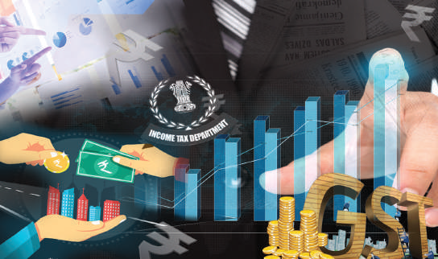
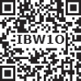
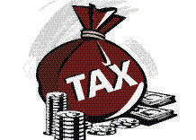
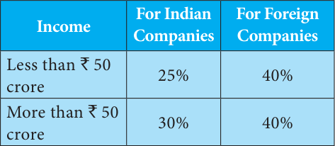
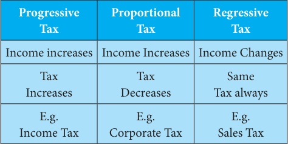
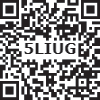
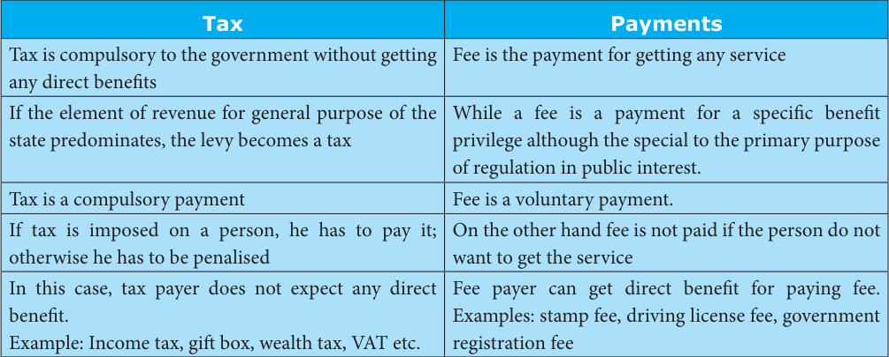
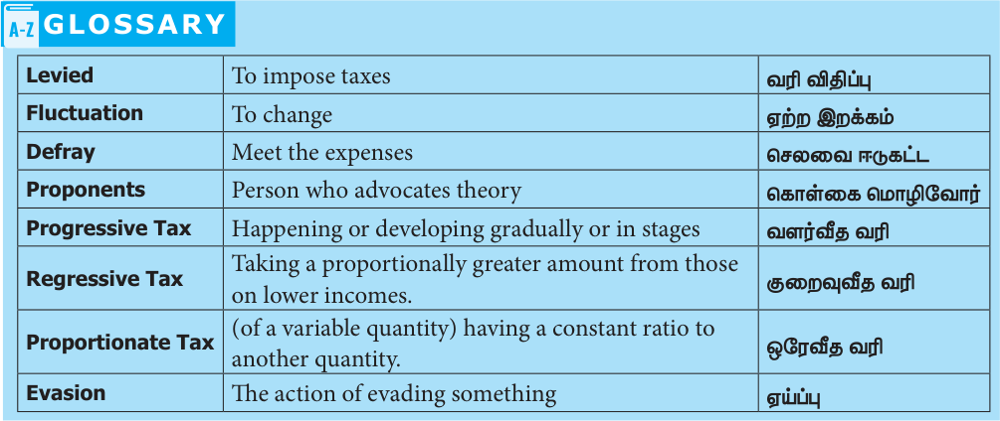
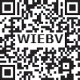

# Economics Unit 4: Government and Taxes

## Learning Objectives

- To understand the role of the government and development policies.

- To gain knowledge about tax and its types.

- To study how is tax levied.

- To gain insight into black money and tax evasion.

- To know the difference between the tax and other payments.

- To understand the taxes and its development.

## Introduction

Tax is levied by government for the development of the state’s economy. The revenue of the government depends upon direct and indirect taxes. Direct taxes are levied on income of the persons and the indirect taxes are levied on goods and services by which the government mobilises its “Financial Sources”.

## 4.1 Role of Government in Development Policies

1. Defence: This is an essential security function to protect our nation from our enemies. The Union Government is responsible for creating and maintaining defence forces.

2. Foreign policy: In today’s world, we need to maintain friendly relationships with all the other countries in the world. We should also maintain cordial economic relationships through exports and imports, sending and receiving investments and labour. This service is also provided by the Union government.

3. Conduct of periodic elections: India is a democratic country. We elect our representatives to the Parliament and state assemblies. Similarly the state governments conduct elections to local bodies within the state.

4. Law and order: Both the Union and State

Governments enact numerous laws to protect our rights, properties and to regulate our economy and society. To settle disputes, the Union government has a vibrant judicial system. State governments take the responsibility for administering the police force in respective states.

5. Public administration and provision of public goods: The government generally administers the economy and society through various departments, for example, revenue department, schools, hospitals, rural development and urban development. The local governments provide civic facilities like local roads, drainage, drinking water and waste collection and disposal.

6. Redistribution of income and poverty alleviation: Governments collect various taxes to finance the various activities mentioned earlier. The taxes are collected in a way that the high-income people can bring in more tax revenue to the government than the poor. The governments also spend money such that the poor are given some basic necessities of life like food, shelter, clothing education, healthcare and monthly income to the very poor persons. Thus collecting taxes and spending for the poor to reduce poverty.

7. Regulate the economy:

The Union Government, through the Reserve Bank of India, controls money supply and controls the interest rate, inflation and foreign exchange rate. The main objective is to remove too much of fluctuation in these rates. The Union Government also controls the economy through various other agencies such as Securities Exchange Board of India and Competition Commission of India. All the Governments in India run public sector enterprises to provide important goods and services at affordable rates to the people.

## 4.2 Tax

The origin of the word "tax" is from "taxation," which means an estimate.

Taxation is a means by which governments finance their expenditure by imposing charges on citizens and corporate entities. The main purpose of taxation is to accumulate funds for the functioning of the government machinery. Tax has come into forefront on account of the new concept called “welfare state”.

Taxes are compulsory payments to government without expectation of direct return (or) benefit to the tax payer. Prof. Seligman also defined a tax as “a compulsory contribution from a person to the government to defray the expenses incurred in the common interest of all, without reference to special benefits conferred”.

**Tax system**

Every type of tax has some advantages and some disadvantages. So we have a tax system, that is, a collection of variety of taxes. From Adam Smith, many economists have given lists of canons of taxation. It is important to recall those common among them for discussion here.

**1. Canon of Equity**

Since tax is a compulsory payment, all economists agree that equity is the cardinal principle in designing the tax system. The rich should pay more tax revenue to government than the poor, because rich has more ability than the poor to pay the tax.

**2. Canon of Certainty**

Government should announce in advance the tax system so that every tax payer will be able to calculate how much tax amount one may have to pay during a year to the government.

**3. Canons of Economy and Convenience**

If the tax is simple, then the cost of collecting taxes (tax payer cost + tax collector cost) will be very low. Further, tax should be collected from a person at the time he gets enough money to pay the tax. This is called canon of convenience. A convenient tax reduces the cost of collecting tax.

**4. Canons of Productivity and Elasticity**

Government should choose the taxes that can get enough tax revenue to it. It should choose a few taxes that can fetch more tax revenue, instead of lots of taxes. This is canon of productivity. Tax is paid by the people out of their incomes. Therefore, the tax system should be designed in such a way that the people automatically pay more tax revenue if their incomes grow. This is called canon of elasticity.

### Why taxes are imposed?

States and their functional equivalents throughout history have used money provided by taxation to carry out many functions. Some of these include expenditures on economic infrastructure

(transportation, sanitation, public safety, education, healthcare systems, to name a few), military, scientific research, culture and the arts, public works and public insurance and the operation of government itself. A government's ability to raise taxes is called its fiscal capacity.

When expenditures exceed tax revenue, a government accumulates debt. A portion of taxes may be used to service past debts. Governments also use taxes to fund welfare and public services. These services can include education systems, pensions for the elderly, unemployment benefits and public transportation. Energy, water and waste management systems are also common public utilities.

## 4.3 Types of Taxes

### Direct Taxes

A tax imposed on an individual or organisation, which is paid directly, is a direct tax. The burden of a direct tax cannot be shifted to others. J.S. Mill defines a direct tax as “one which is demanded from the very persons who it is intended or desired should pay it.” Some direct taxes are income tax, wealth tax and corporation tax.

In India, Income Tax was introduced for the first time in 1860 by Sir James Wilson in order to meet the losses sustained by the Government on account of the Mutiny of 1857.

**Income Tax**

Income tax is the most common and most important tax levied on an individual in India. It is charged directly based on the income of a person. The rate at which it is charged varies, depending on the level of income.

Students are asked to search a Income Tax website and know the Income Tax slab for current year.

**Corporate Tax**

This tax is levied on companies that exist as separate entities from their shareholders. It is charged on royalties, interest gains from sale of capital assets located in India and fees for a technical services and dividends.

Foreign companies are taxed on income that arises in India.

**Wealth Tax**

Wealth tax is charged on the benefits derived from property ownership. The same property will be taxed every year on its current market value. The tax is levied on the individuals and companies alike.

In India taxes are collected by all the three tiers of government. There are taxes that can be easily collected by the Union Government. In India almost all the direct taxes are collected by the Union Government. Taxes on goods and services are collected by both Union and State governments. The taxes on properties are collected by local governments.

In India, we collect more revenue through indirect taxes than through direct taxes. The major indirect taxes in India are customs duty and GST.

### Indirect Taxes

If the burden of the tax can be shifted to others, it is an indirect tax. The impact is on one person while the incidence is on the another person. Therefore, in the case of indirect taxes, the tax payer is not the tax bearer.

Some indirect taxes are stamp duty, entertainment tax, excise duty and goods and service tax (GST).

**Stamp Duty**

Stamp duty is a tax that is paid on official documents like marriage registration or documents related to a property and in some contractual agreements.

**Entertainment Tax**

Entertainment tax is a duty that is charged by the government on any source of entertainment provided. This tax can be charged on movie tickets, tickets to amusement parks, exhibitions and even sports events.

**Excise Duty**

An excise tax is any duty on manufactured goods levied at the movement of manufacture, rather than at sale. Excise is typically imposed in addition to an indirect tax such as a sales tax.

### Goods and Service Tax (GST)

The goods and service tax (GST) is one of the indirect taxes. The GST was passed in Parliament on 29 March 2017. The act came into effect on 1 July 2017. The motto is one nation, one market, one tax.

France was the first country to implement GST in 1954.

## 4.4 How Are Taxes Levied?

Tax is levied by the government progressively, proportionately as well as regressively.

**Progressive Tax**

Progressive tax rate is one in which the rate of taxation increases (multiplier) as the tax base increases (multiplicand). In the case of a progressive tax, when income increases, the tax rate also increases.

**Example:**

| Tax Base | Tax Rate | Amount of Tax |
|---|---|---|
| `10,000 | 10% | `1000 |
| `20,000 | 15% | `3000 |
| `30,000 | 25% | `7500 |

**Proportionate Taxes**

Tax levied on goods and service in a fixed portion is known as proportionate taxes. All tax payers contribute the same proportion of their incomes.

**Example:**

| Tax Base | Tax Rate | Amount of Tax |
|---|---|---|
| `10,000 | 10% | `1000 |
| `20,000 | 10% | `2000 |
| `30,000 | 10% | `3000 |

### Structure of Goods and Service Tax (GST)

State Goods and Service Tax (SGST): Intra state (within the state) VAT/sales tax, purchase tax, entertainment tax, luxury tax, lottery tax and state surcharge and cesses Central Goods and Service Tax (CGST): Intra state (within the state) Central Excise Duty , service tax, countervailing duty, additional duty of customs, surcharge, education and secondary/higher secondary cess Integrated Goods and Service Tax (IGST): Inter state (integrated GST)

There are four major GST rates: (5%, 12%, 18% and 28%) Almost all the necessities of life like vegetables and food grains are exempted from this tax.

**Regressive Taxes**

It implies that higher the rate of tax lower the income groups than in the case of higher income groups. It is a very opposite of progressive taxation.

## 4.5 Black Money

### Black Money

Black money is funds earned on the black market on which income and other taxes have not been paid. The unaccounted money that is concealed from the tax administrator is called black money.

### Causes of Black Money

Several sources of black money are identified as causes.

1. Shortage of goods

2. Licensing proceeding

3. Contribution of the industrial sector

4. Smuggling

5. Tax structure

## 4.6 Tax Evasion

Tax evasion is the illegal evasion of taxes by individuals, corporations and trusts. Tax evasion activities included

- Underreporting income

- Inflating deductions or expenses

- Hiding money

- Hiding interest in offshore accounts

### Tax evasion penalties

1 If a person willfully commits the act of tax evasion, he may face felony charges. Tax evasion penalties include imprisonment of up to five years and high amount as fines. 2 The defendant may also be ordered to pay for the costs of prosecution. 3 Tax evasion penalties can be harsh, depending on the severity of the crime.

## 4.7 Taxes and Development

The role of taxation in developing economies is as follows.

1. Resource Mobilisation: Taxation enables the government to mobilise a substantial amount of revenue. The tax revenue is generated by imposing direct taxes such as personal income tax and corporate tax and indirect taxes such as customs duty, excise duty, etc.

**2. Reduction Inequalities of**

Income: Taxation follows the principle of equity. The direct taxes are progressive in nature. Also certain indirect taxes, such as taxes on luxury goods, is also progressive in nature.

3. Social Welfare: Taxation generates social welfare. Social welfare is generated due to higher taxes on certain undesirable products like alcoholic products.

4. Foreign Exchange: Taxation encourages exports and restricts imports, Generally developing countries and even the developed countries do not impose taxes on export items.

5. Regional Development: Taxation plays an important role in regional development, Tax incentives such as tax holidays for setting up industries in backward regions, which induces business firms to set up industries in such regions.

6. Control of Inflation: Taxation can be used as an instrument for controlling inflation. Through taxation the government can control inflation by reducing the tax on the commodities.

### Difference between Tax and other Payments

### SUMMARY

- Direct Tax is a tax paid directly to the Union Government or to state or local governments, such as income tax and property tax.

- Income Tax is a tax paid by individuals and businesses based on earned and unearned income.

- Local Tax is a tax charged by a local government, such as a city or country.

### EXERCISE

**I Choose the correct answer**

1. The three levels of governments in India are a) Union, state and local b) Union, state and village c) Union, municipality and panchayat d) None of the above

2. In India, taxes are including a) Direct taxes b) Indirect taxes. c) Both (a) and (b) d) None of these

3. Which is the role of government and development policies? a) Defence b) Foreign policy c) Regulate the economy d) all of above

4. The most common and important tax levied on an individual in India is a) Service tax b) Excise duty. c) Income tax d) Central sales tax

5. Under which tax one nation, one uniform tax is ensured a) Value added tax (VAT) b) Income tax c) Goods and service tax d) Sales tax

6. Income tax was introduced in India for the first time in the year __________ .

a) 1860 b) 1870 c) 1880 d) 1850

7. __________ tax is charged on the benefits derived from property ownership.

a) Income tax b) Wealth tax c) Corporate tax d) Excise duty

8. What are identified as causes of black money?

a) Shortage of goods b) High tax rate c) Smuggling d) All of above

**II Fill in the blanks**

1. __________ is levied by government for the development of the state’s economy.

2. The origin of the word ‘tax’ is from the word

__________.

3. The burden of the __________ tax cannot be shifted to others.

4. The Goods and Service Tax act came into effect on __________.

5. The unaccounted money that is concealed from the tax administrator is called __________.

### III Choose the correct statement

1. Which of the following statement is correct about GST? (i) GST is the ‘one point tax’. (ii) This aims to replace all direct taxes levied on goods and services by the Central and State governments. (iii) It will be implemented from 1st July

2017 throughout the country.

(iv) It will unified the tax structure in India. a) (i) and (ii) are correct b) (ii), (iii) and (iv) are correct c) (i), (iii) and (iv) are correct d) All are correct

**IV Match the following**

1. Income Tax

- Value added tax

2. Excise duty

- 1 July 2017

3. VAT

- Smuggling

4. GST

- Direct tax

5. Black money

- Indirect tax

**V Give Short Answers**

1. Define tax.

2. Why we pay tax to the government?

3. What are the types of tax? Give examples.

4. Write short note on Goods and Service Tax.

5. What is progressive tax?

6. What is meant by black money?

7. What is tax evasion?

8. Write any two difference between tax and payments?

**VI Answer in detail**

1. Explain some direct and indirect taxes.

2. Write the structure of GST.

3. What is black money? Write the causes of black money.

**VII Activity and Projects**

1. Collect information about the local taxes

(water, electricity and house tax etc).

2. Students purchase some goods on the shop.

The teacher and students discuss those goods, maximum retail price, purchasing price or GST.

### REFERENCE BOOKS

1. Gaurav Aklani, Role of Taxation in

Developing Country in India.

2. Sankaran, Fiscal Economics.

3. Dr.U.K. Sudha Nayak, B.P. Tygai, and

Dr.H. Girija, Public Finance.

### INTERNET RESOURCES

1. World Bank Report in 2018

2. www.GST.in
