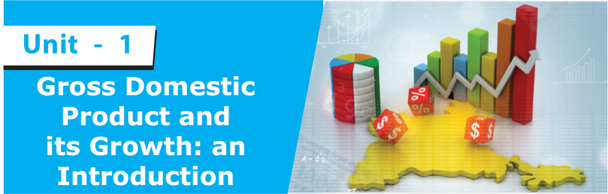
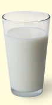
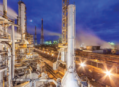
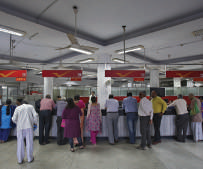
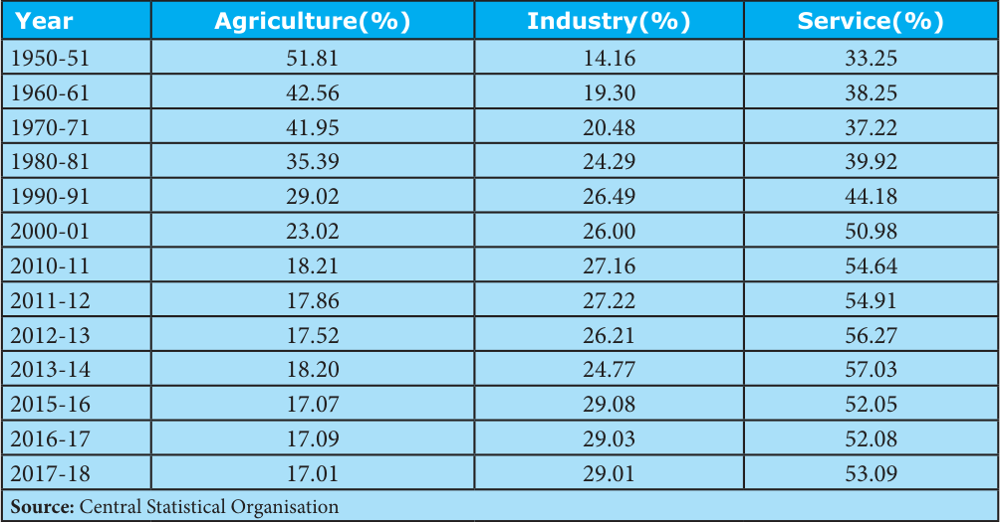
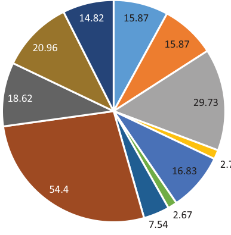
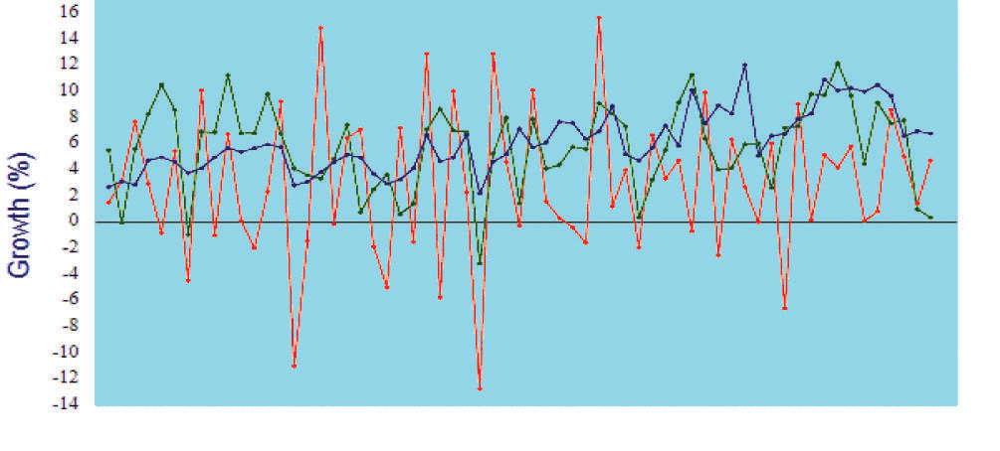
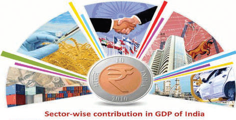
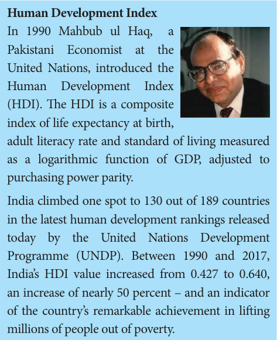

# Economics Unit 1: Gross Domestic Product and its Growth: an Introduction

## Learning Objectives

- To know about the meaning of Gross Domestic Product.

- To understand the basic various measures of National Income

- To Understand the composition of GDP.

- To know the contribution of different sectors in GDP.

- To know the economic growth and development and its differences.

- To know about development path based on GDP and employment.

- To understand the growth of GDP and Economic Policies.

## Introduction

To understand how the Indian Economy is doing, one has to understand what GDP is.

Imagine what happens in a hotel. You place an order for two Idlis and a cup of tea. Someone makes the idlis and tea and someone else serves you.

Idlis and tea are prepared. These are tangible, physical things you can touch and feel. Economists call such tangible items “goods”. These goods are not free but have to pay or to be paid.

Though you don’t realise it, in addition to these tangible things called goods, something else is being produced: the work done by the cooks and the people who serve the food. The activity of cooking and serving is not something you can feel and touch. Such activities are not tangible but are nevertheless crucial for you to enjoy the food. Economists call such activity “services”.

What happens everyday in a hotel at nationwide: Goods and services are produced and paid for and this what the GDP measures.

Server

Consumer

Goods

### DEFINITION OF GDP

The GDP is the market value of all the final goods and services produced in the country during a time period.

GDP = C + I + G + (X − M ) C = Consumption, I = Investment G = Government Expenditure

( X − M) = X = Exports − M = Imports Every part of the definition is important.

Goods and services: As you know by now, goods are tangible items but services are activities which are intangible .

Market value: This is the price at which goods and services are sold in the market.

Final goods and services: Economists Tyler Cowen and Alex Tabarrok say that “final goods and services” are the goods and services which will be used or consumed. The goods and services which will be used for producing other goods and services and will form a part of the goods and services produced are called “intermediate goods”.

Only the final goods are included in the GDP. Intermediate goods are not counted in calculating the GDP, because their value is included in the final goods. However, if the intermediate goods are included in the GDP it will result in what is called “double counting”.

For example, a cup of tea bought in a hotel is a final good because it is consumed and does not form a part of producing something else. So the market value of the cup of tea, being a final good, is included in the GDP. Sugar which is mixed in the tea is an intermediate good because it is used in making tea and forms a part of the tea served. Suppose the tea is priced ` 10 a cup, of which the value of sugar used is ` 2. So the price of the cup of tea includes the ` 2, that is price of the spoon of sugar. If this value of sugar is included in the GDP , it will be counted twice: as a spoon of sugar and again as a part of the cup of tea. This is “double counting” and to avoid it the intermediate goods like sugar are excluded from GDP.

## 1.1 National Income

‘National Income is a measure of the total money value of goods and services produced by an economy over a period of time, normally a year’. Commonly, National Income is called as Gross National Product(GNP) or National Dividend.

### Various terms associated with measuring of National Income

### 1. Gross National Product (GNP)

Gross National Product is the total value of goods and services produced and income received in a year by domestic residents of a country. It includes, profits earned from capital invested abroad.

GNP = C + I + G + (X–M) + NFIA)

C = Consumption

I = Investment

G = Government Expenditure

X-M = Export – Import

NFIA = Net Factor Income from Abroad)

### 2. Gross Domestic Product (GDP)

Gross Domestic Product (GDP) is the total value of output of goods and services produced by the factors of production within the geographical boundaries of the country.

### 3. Net National Product (NNP)

Net National Product (NNP) is arrived by making some adjustment with regard to depreciation that is we arrive the Net National Product (NNP) by deducting the value of depreciation from Gross National Product. (NNP = GNP − Depreciation)

### 4. Net Domestic Product (NDP)

Net Domestic Product (NDP) is a part of Gross Domestic Product. Net Domestic Product is obtained from the Gross Domestic Product by deducting the Quantum of tear and wear expenses (depreciation)

NDP = GDP − Depreciation

### 5. Per Capita Income (PCI)

Per Capita Income or output per person is an indicator that shows the living standard of people in a country. It is obtained by dividing the National Income by the population of a country.

Per Capita Income = National Income / Population

In

1867-68 for the first time Dadabhai Naoroji had ascertained the Per Capital Income in his book “Poverty and Un-British Rule of India”.

### 6. Personal Income (PI)

Personal income is the total money income received by individuals and households of a country from all possible sources before direct taxes.

### 7. Disposable Income (DI)

Disposable income means actual income which can be spent on consumption by individuals and families, thus, it can be expressed as DPI = PI − Direct Taxes

(From consumption approach DI = Consumption Expenditures + Savings )

## 1.2 Gross Domestic Product (GDP)

Produced in the country: GDP of India includes only the market value of goods and services produced in India. For example, the market value of apples produced in Kashmir are included in our GDP since Kashmir is in India. The market value of apples produced in California, even if they are sold in Indian markets, they are not included in our GDP, because California is in the U.S.

**Produced during a time period**

The GDP of a country measures the market value of goods and services produced only during the specified time period. The goods and services produced in earlier periods are not included.

The modern concept of GDP was first developed by Simon Kuznets for a US Congress report in 1934.

### Methods of GDP Calculating

1. Expenditure Approach: In this method, the GDP is measured by adding the expenditure on all the final goods and services produced in the country during a specified period. Y = C + I + G + (X − M)

2. The Income Approach: This method looks at GDP from the perspective of the earnings of the men and women who are involved in producing the goods and services. The income approach to measuring GDP (Y) is Y = wages + rent + interest + profit

3. Value-Added Approach: A cup of tea served to you in a hotel is a “final good”. The goods used to produce it are tea powder, milk, and sugar, are “intermediate goods” since they form a part of the final good, the cup of tea. One way to measure the market value of the cup of tea is to add the value produced by each intermediate good used to produce it. The sum of the value added by all the intermediate goods used in production equals to the total value of the final goods produced in the economy.

Value added method

Tea powder + Milk + Sugar = Tea

Value of intermediate goods = Value of final goods

### Importance of GDP

1. Study of Economic Growth.

2. Problems of inflation and deflation.

3. Comparison with developed countries of the world.

4. Estimate the purchasing power.

5. Study of Public Sector.

6. Guide to economic planning.

### Limitations of GDP

**1. Several important goods and services are**

left out of the GDP: The GDP includes only the goods and services sold in the market. The services provided by parents to their children is very important but it is not included in the GDP, because it is not sold in the market. Likewise, clean air, which is vital for a healthy life, has no market value and is left out of the GDP.

**2. GDP measures only quantity but not**

quality: In the 1970s schools and banks did not permit the use of ballpoint pens. This is because the ones available in India were of very poor quality. Since then, not only has there been a substantial increase in the quantity of ballpoint pens produced in India but their quality has also improved a lot. The improvement in quality of goods is very important but it is not captured by the GDP.

**3. GDP does not tell us about the way income**

is distributed in the country: The GDP of a country may be growing rapidly but income may be distributed so unequally that only a small percentage of people may be benefitting from it.

**4. The GDP does not tell us about the kind**

of life people are living: A high level of per capita real GDP can go hand-in-hand with very low health condition of people, an undemocratic political system, high pollution and suicide rate.

**Estimation of GDP**

The Central Statistical Organisation (CSO), under the Ministry of Statistical department keeps the records. Its processes involves conducting an annual survey of industries and compilation of various indexes like the Index of Industrial Production (IIP) Consumer Price Index (CPI) etc.

## 1.3 Composition of Gross Domestic Product (GDP)

Indian economy is broadly divided into three sector

1) Primary Sector: (Agricultural Sector)

Agricultural sector is known as primary sector, in which agricultural operations are undertaken. Agriculture based allied activities, production of raw materials such as cattle farm, fishing, mining, forestry, corn, coal, etc., are also undertaken.

**Forestry**

2) Secondary Sector: (Industrial Sector)

Industrial sector is secondary sectors in which the goods and commodities are produced by transforming the raw materials. Important industries are iron and steel industry, cotton textile, jute, sugar, cement, paper, petrochemical, automobile and other small scale industries.

**Industry**

3) Tertiary: (Service Sector)

Tertiary sector is known as service sector which includes Government, scientific research, transport communication, trade, Postal

Postal Department

Department, Banking,

Education, Entertainment, Healthcare and Information Technology, etc.

In the 20th century, economists began to suggest that, traditional tertiary services could be further distinguished from “quaternary” and “quinary” service sectors.

## 1.4 Contribution of different sectors in GDP of India

Services sector is the largest sector of India. Gross Value Added (GVA) at current prices for services sector is estimated at 92.26 lakh crore in 2018-19.

**Sector-wise Contribution in GDP of India**

| Year | Agriculture (%) | Industry (%) | Service (%) |
|---|---|---|---|
| 1950-51 | 51.81 | 14.16 | 33.25 |
| 1960-61 | 42.56 | 19.30 | 38.25 |
| 1970-71 | 41.95 | 20.48 | 37.22 |
| 1980-81 | 35.39 | 24.29 | 39.92 |
| 1990-91 | 29.02 | 26.49 | 44.18 |
| 2000-01 | 23.02 | 26.00 | 50.98 |
| 2010-11 | 18.21 | 27.16 | 54.64 |
| 2011-12 | 17.86 | 27.22 | 54.91 |
| 2012-13 | 17.52 | 26.21 | 56.27 |
| 2013-14 | 18.20 | 24.77 | 57.03 |
| 2015-16 | 17.07 | 29.08 | 52.05 |
| 2016-17 | 17.09 | 29.03 | 52.08 |
| 2017-18 | 17.01 | 29.01 | 53.09 |

**Source:** Central Statistical Organisation

Sector-wise contribu on of GDP (2018-19)

Percentage share (%)

Agriculture Sector

Agriculture Forestry & Fishing

Source: Statistics times.com.

Industrial sector

Mining & quarrying

Manufacturing

Electricity, gas, water supply& other u lity services

Construc on

Services Sector

Trade, hotels, transport, communica on and services related to broad cas ng

Financial, real estate & Prof Services Public administra ve, defense and other services

Note: The Diagram shows that Sector-wise contribution in GDP of India for the year 2018 - 2019.

## Sector - wise GDP Growth of India (1950-2018)

Services (Blue colour) Agriculture (Green colour)

Industry (Orange colour)

**1950**

**1960**

**1970**

**1980**

**1990**

**2000**

**2010**

**2018**

## Year

Source: Statistics times.com. Note: The chart Diagram shows that Sector-wise contribution in GDP of India for the year 1950-2018

India is 2nd largest producer of agricultural products. India accounts for 7.39 percent of total global agricultural output.

In Industrial sector, India's world rank is 6 and in Service sector, India's world rank is 8. Contribution of Agriculture sector in Indian economy is much higher than world's average (6.4%). Contribution of Industrial and Services sector is lower than world's average 30% for Industrial sector and 63% for Services sector.

Gross Value Added (GVA) is a measure of the value of goods and services produced by an industry in a given area of ​the economy.

GVA = GDP + subsidies - (direct, sales) taxes.

## 1.5 Economic Growth and Development

As per the economist Amartya

Sen, economic growth is one aspect of economic development. Also, United Nation see it like this “Economic development focuses not only on man’s materialistic need but it focuses on overall development or rise in its living standards.

### Economic Growth

The key parameters of economic growth in any economy are its Gross Domestic Product (GDP) and Gross National Product (GNP) which helps in measuring the actual size of an economy.

### Economic Development

Economic development projects a broader picture of an economy which takes into account an increase in production level or output of an economy along with an improvement in the living standard of its citizens. It focuses more on socioeconomic factors rather than the just quantitative increase in production. Economic development is a qualitative measure which measures improvement in technology, labour reforms, rising living standards, broader institutional changes in an economy.

Human development Index (HDI) is apt tool to measure the real development in an economy.

**Human Development Index**

In 1990 Mahbub ul Haq, a Pakistani Economist at the United Nations, introduced the Human Development Index (HDI). The HDI is a composite index of life expectancy at birth, adult literacy rate and standard of living measured as a logarithmic function of GDP, adjusted to purchasing power parity.

India climbed one spot to 130 out of 189 countries in the latest human development rankings released today by the United Nations Development Programme (UNDP). Between 1990 and 2017, India’s HDI value increased from 0.427 to 0.640, an increase of nearly 50 percent – and an indicator of the country’s remarkable achievement in lifting millions of people out of poverty.

## 1.6 Developmental Path based on GDP and Employment

In the development path of India, it first undertook the policy of closed trade. This was to give a thrust to domestic industries and reduce dependence on foreign products and companies. Trade and interaction with the outside world remained limited. This outlook continued till 1991, when India finally decided to open its borders to free trade and liberalized its economy by allowing foreign companies to enter the Indian economy.

A thrust was given to employment generation under the Five-Year plans. This was to make up for a rising population and lacking jobs to absorb the increased workforce size. Rural development was also given importance in India, for the important constituent it was of the Indian landscape.

Poverty alleviation came as a corollary of rural development and a part of the development path of India. India inherited a poverty-stricken economy from the British rule, which had destroyed its resource base completely.

**Differences between Economic Growth and Economic Development**

| Comparison between Economic Growth and Economic Development | Economic Growth | Economic Development |
|---|---|---|
| Definition / Meaning | It is the positive quantitative change in the output of an economy in a particular time period | It considers the rise in the output in an economy along with the advancement of HDI index, which considers a rise in living standards, advancement in technology and overall happiness index of a nation. |
| Concept | Economic growth is the “Narrower” concept | Economic development is the “Broader” concept |
| Nature of Approach | Quantitative in nature | Qualitative in nature |
| Scope | Rise in parameters like GDP, GNP, FDI, FII, etc. | Rise in life expectancy rate, infant, improvement in literacy rate, infant mortality rate and poverty rate etc. |
| Term / Tenure | Short, term in nature | Long-term in nature |
| Applicability | Developed nation | Developing economies |
| Measurement Techniques | Increase in national income | Increase in real national income, i.e., per capita income |
| Frequency of Occurrence | In a certain period of time | Continuous process |
| Government Aid | It is an automatic process so may not require government support/aid or intervention | Highly dependent on government intervention, as it includes widespread policies changes, so without government intervention it is not possible |

The public sector was given significant importance, Private companies and industries were subject to strict regulations and standards. It was believed that the government was the sole protector of the people and would work towards social welfare.

India has sustained rapid growth of GDP for most of the last two decades leading to rising per capita incomes and a reduction in absolute poverty. Per capita incomes have doubled in 12 years. In Per capita income, placing India comes just inside the Middle Income Country category.

Life expectancy at birth is 65 years and 44% of children under 5 are malnourished. The literacy rate for the population aged 15 years and above is only 63% compared to a 71% figure for lower middle income countries.

India has followed a different path of development from many other countries.

### Factors supporting development of India

A fast-growing population of working age is an important factor. There are 700 million Indians under the age of 35 and the demographics look good for India's growth in the next twenty years at least. India is experiencing demographic transition that has increased the share of the working-age population from 58 percent to 64 percent over the last two decades.

India has a strong legal system and many English-language speakers. This has been a key to attract inward investment from companies such as those specialising in Information Technology. For example witness the rapid emergence of Bangalore as a hub for global software businesses. External economies of scale have deepened their competitive advantages in many related industries.

## 1.7 Growth of GDP and Economic Policies

Many economic policies have been framed by the Government of India since independence for increasing rate of economic growth and economic development. The important economic policies are

**1. Agriculture policy**

Agricultural policy is the set of government decisions and actions relating to domestic agriculture and imports of foreign agricultural products. Some over arching themes include risk management and adjustment, economic stability , natural resources and environmental sustainability research and development, and market access for domestic commodities.

Some Agricultural policies are Price policy, land reform policy, Green Revolution, Irrigation policy, Food policy, Agricultural Labour Policy and Co-operative policy.

**2. Industrial Policy**

Industrial development is a very important aspect of any economy. It creates employment, promotes research and development, leads to modernization and ultimately makes the

**Gross National Happiness (GNH)**

The term Gross National Happiness was coined in 1972 during an interview by a British journalist for the Financial Times at Bombay airport when the then king of Bhutan, Jigme Singye Wangchuck, said "Gross National Happiness is more important than Gross National Product.

In 2011, The UN General Assembly passed Resolution "Happiness: towards a holistic approach to development" urging member nations to follow the example of Bhutan and measure happiness and well-being and calling happiness a "fundamental human goal."

The four pillars of GNH's are

1. Sustainable and equitable socio-economic development.

2. Environmental conservation.

3. Preservation and promotion of culture.

4. Good governance. The nine domains of GNH are psychological well-being, health, time use, education, cultural diversity and resilience, good governance, community vitality, ecological diversity and resilience, and living standards.

economy self-sufficient. In fact, industrial development even boosts other sectors of the economy like the agricultural sector (new farming technology) and the service sector. It is also closely related to the development of trade.

Several industrial policies have been enacted. Since 1948, Industrial policy on large scale industries, e.g., Textile Industry policy, Sugar Industry policy, Price policy of industrial growth, small scale industrial policy and Industrial Labour policy.

**3. New Economic Policy**

The economy of India had undergone policy in the beginning of the 1990s. This new model of economic reforms is commonly known as the LPG known as Liberalisation, Privatisation and Globalisation. These economic reforms had influenced the overall economic growth of the country in a significant manner.

### SUMMARY

- GDP is the value of all goods and services produced within an economy in a financial year.

- Indian economy is classified into three sectors; Agriculture, allied Industry and Service.

- Depreciation: The Monetary value of an asset decreases over time due to use, wear and tear or obsolescence.

- Income: The amount of monetary or other returns, either earned or unearned, accruing over a period of time.

- Gross Value Added (GVA): The measure of the value of goods and services produced in an area, industry or sector of an economy.

### GLOSSARY

| Term | Meaning |
|---|---|
| Depreciation | The process of losing value |
| Intermediate | Being between two other related things |
| Market Price | A price that is likely to be paid for something |
| Final Goods | A consumer good or final good is any commodity that is produced or consumed by the consumer to satisfy current wants or needs |
| Composition | the nature of something's ingredients or constituents; the way in which a whole or mixture is made up |
| Contribution | a gift or payment to a common fund or collection. |
| Staggering | continue in existence or operation uncertainly or precariously. |

### EVALUATION

**I Choose the correct answer**

1. GNP equals a) NNP adjusted for inflation b) GDP adjusted for inflation c) GDP plus net property income from abroad d) NNP plus net property income or abroad

2. National Income is a measure of a) Total value of money b) Total value of producer goods c) Total value of consumption goods d) Total value of goods and services

3. Primary sector consist of a) Agriculture b) Automobiles c) Trade d) Banking

4. ______ approach is the value added by each intermediate good is summed to estimate the value of the final good.

a) Expenditure approach b) Value added approach c) income approach d) National Income

5. Gross value added at current prices for services sector is estimated at ______ lakh crore in 2018-19.

a) 91.06 b) 92.26 c) 80.07 d) 98.29

6. India is ______ larger producer in agricultural product.

a) 1st b) 3rd c) 4th d) 2nd

7. India’s life expectancy at birth is ______ years.

a) 65 b) 60 c) 70 d) 55

8. Which one is a trade policy?.

a) irrigation policy b) import and export policy c) land-reform policy d) wage policy

**II Fill in the blanks**

1. _____ is the primary sector in India.

2. _____ is an indicator to show the living standard of people

3. Secondary sector otherwise called as _____.

**III Match the following**

1. Electricity/

– National Income /

Gas and Water

Population

2. Price policy

– Gross Domestic

Product

3. GST

– Industry Sector

4. Per capita income – Agriculture

5. C + I + G + (X-M) – Tax on goods and service

**IV Give short answer**

1. Defi ne National income.

2. What is meant by Gross domestic product?

3. Write the importance of Gross domestic product.

4. What is per capita income?.

5. Defi ne the value added approach with example.

6. Write the name of economic policies in

India.

7. Write a short note

1) Gross National Happiness(GNH) 2) Human Development Index(HDI)

**V Write in detail answer**

1. Briefl y explain various terms associated with measuring of national income.

2. What are the methods of calculating Gross

Domestic Product? and explain its.

3. Write any fi ve diff erences between the growth and development.

4. Explain the following the economic policies

1.Agricultural Policy 2.Industrial policy 3.New economic policy

**ICT CORNER**

**VI Activity and Project**

1. Students have to collect the Gross Domestic

Product data of Tamil Nadu and compare it with the other state of Karnataka and Kerala’s GDP.

2. Students have to collect the details of

Employment growth of Tamil Nadu.

### REFERENCE BOOKS

1. Sankaran Indian Economy (problems, policies, and development).

2. Ramesh Singh Indian Economy (10th

Edition).

3. Ministry of Statistics and Implementation

Planning Commission. Government of India.

### INTERNET RESOURCES

1. http://en.wikipedia.org

2. http://www.statisticstimes.com

## Steps

- 

Open the Browser and type the URL given below (or) Scan the QR Code.

- 

Click on ‘Real GDP Growth’ and select ‘India’ in Right side menu

- 

Drag the timeline button to see the GDP Growth of India

**Website URL:**

https://www.imf.org/external/datamapper/datasets/WEO/1
