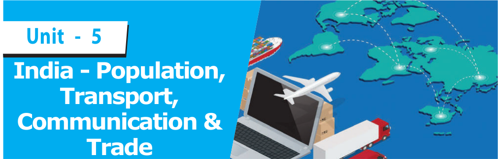
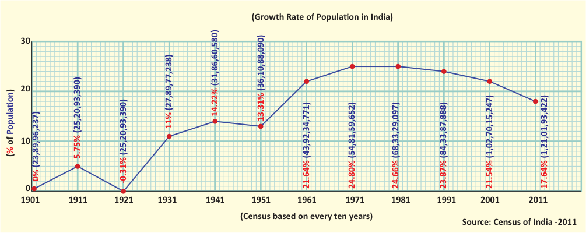
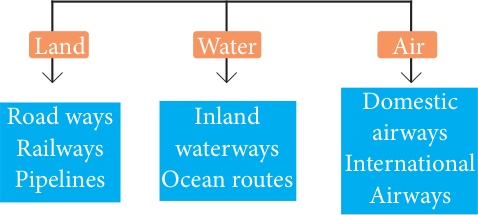
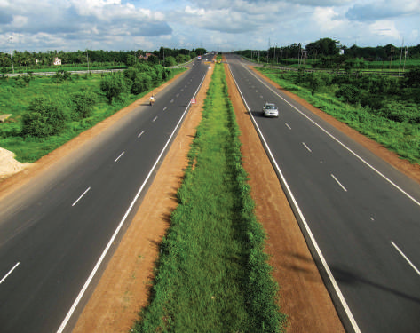
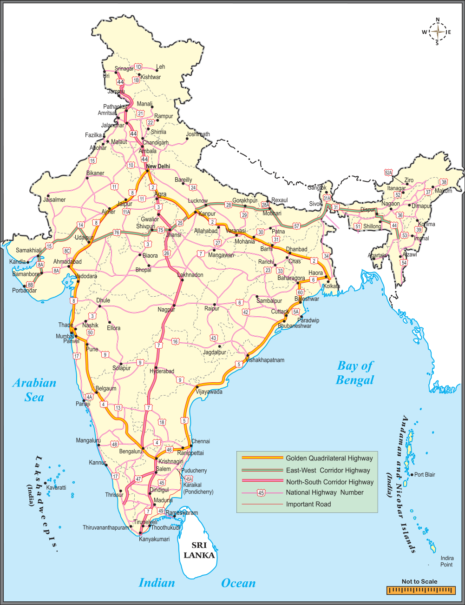
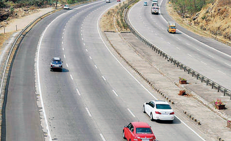
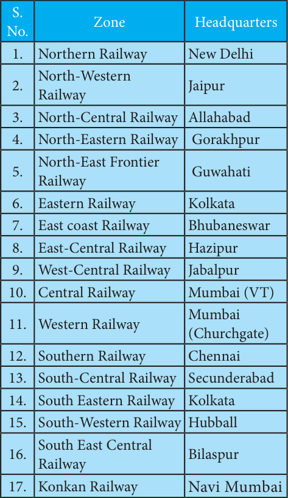
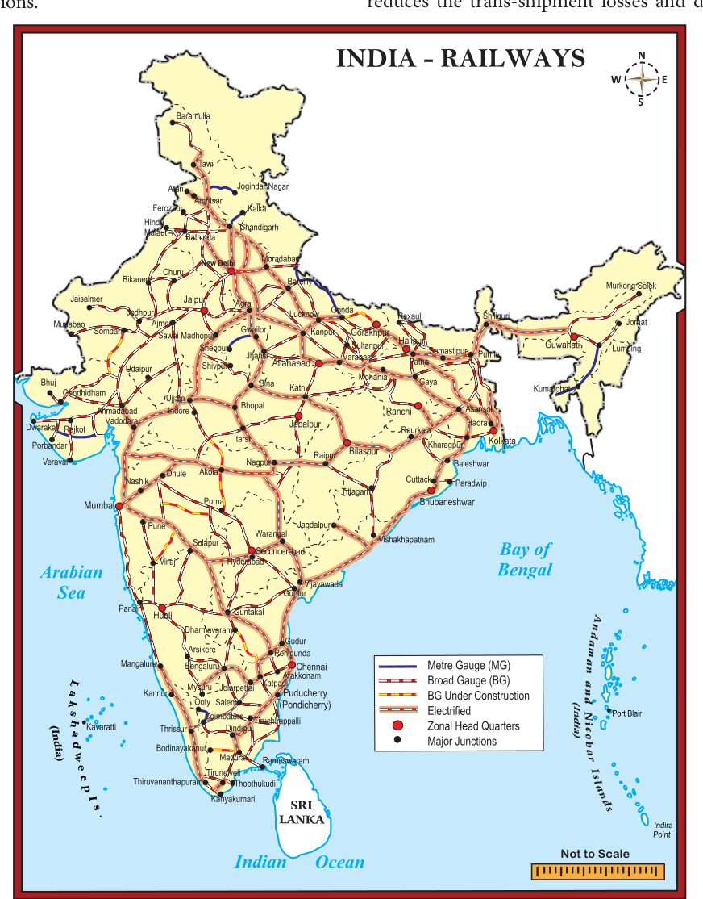
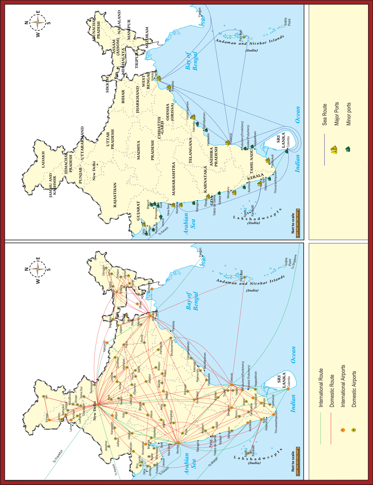
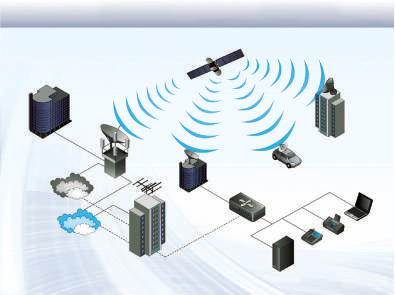

# Geography Unit 5: India - Population, Transport, Communication and Trade

## Learning Objectives

To understand the growth and distribution of population in India.

To know about the Human Development in India.

To learn the transport systems of India.

To understand the communication system of India.

To assess the nature of trade in India.

## Introduction

The study on human population is one of the most important aspects in geography of any region. The human population has many components but the most fundamental are its number, composition, distribution and density. Therefore, it is essential to study these components. The study on these aspects also would reveal the workforce of the country.

## 5.1 Population

The total number of people residing in a country at a specified period of time is called the 'Population' of that country. India is the most populous country in the world. India covers only 2.4 percent of the land area of the world, but is the home of about 17.5 percent of the world’s population. It shows that the proportion of population of India is far higher than the proportion of its area. Thus, a little more than one out of every six persons in the world is from India.

### Census

Population census is the total process of collecting, compiling, analysing or otherwise disseminating demographic, economic and social data pertaining, at a specific time, of all persons in a country or a well-defined part of a country. It happens in an interval of ten years. The data collected through the census are used for administration, planning, policy making as well as management and evaluation of various programmes by the government.

In India the first census was carried out in the year 1872. But the first complete and synchronous census was conducted in 1881 and the 2011 census represents the fifteenth census of India.

### Distribution and Density of Population

The term 'Population Distribution' refers to the way the people are spaced over the earth’s surface. The distribution of population in India is quite uneven, because of the vast variation in the availability of resources. Population is mostly concentrated in the regions of industrial centres and the good agricultural lands. On the other hand, the areas such as high mountains, arid lands, thickly forested areas and some remote corners are very thinly populated and some areas are even uninhabited. Terrain, climate, soil, water bodies, mineral resources, industries, transport and urbanization are the major factors which affect the distribution of population in our country.

Uttar Pradesh is the most populous state in the country with a population of 199.5 million followed by Maharashtra (112.3 million), Bihar (103.8 million) West Bengal (91.3 million) and the combined Andhra Pradesh and Telangana (84.6 million). These five states account for about half of the country’s population. Sikkim is the least populous state of India(0.61 million). Delhi with 16.75 million population tops among the Union territories.

The uneven distribution of population in the country is the result of several factors such as physical, socio-economic and historical ones. The physical factors include relief, climate, water, natural vegetation, minerals and energy resources. Socio-economic factors consists of the religion, culture, political issues, economy, human settlements, transport network, industrialization, urbanization, employment opportunity, etc.

### Density of Population

It is expressed as number of persons per sq km. According to 2011, the average density of population of India is 382 persons per sq.km. India is one of the most thickly populated ten countries of the world. The most densely populated state of India is Bihar and the state with least population density is Arunachal Pradesh. Among the union territories, Delhi is the densely populated one with 11,297 per sq.km, while Andaman and Nicobar Islands have the lowest density of population.

### Population Growth and Change

Population change refers to an increase or decrease of population of an area from one period to another period. Population growth is influenced by the birth rate, death rate and migration. These three make the changes in population.

Birth rate refers to the number of live births per thousand people in a year and the Death rate refers to the number of deaths per thousand people in a year. The rapid decline in death rate is the major cause of the rapid growth of population in India.

The following table shows the decadal growth rate of population from 1901 to 2011.

## 5.2 Migration

It is the movement of people across regions and territories. It can be internal (within a country) or international (between the countries). Internal migration does not change the size of population of a country but it influences the distribution of population in a nation. It plays an important role in changing the composition and distribution of population. In India, the mass migration is from rural to urban areas. Unemployment and under employment in the rural areas are the push factors and the employment opportunity and higher wages in the urban areas caused by the industrial development are the pull factors of migration in the country.

### Population Composition

Population composition refers to the characteristics such as age, sex, marital status, caste, religion, language, education, occupation etc. The study of composition of population helps us to understand the social, economic and demographic structure of population.

### Age composition

The age composition of population refers to the number of people in different age groups in a country. Population of a nation is generally grouped into three broad categories. In India, the children who has less than 15 years of age constitute 29.5% and the people above 60 years constitute 8.0%. So, the dependent population in India is 37.5%and the independent population (16-59 yrs) is 62.5%. It shows that our country has enormous manpower.

### Sex Ratio

Sex ratio is defined as the number of females per 1000 male population.

The sex ratio in our country is always unfavourable to females. Give reasons.

According to 2011 census, the sex ratio of the country is 940 females per 1000 males. This suggests that the size of female population is lower than males. It is 1084 in Kerala and 1038 in Puducherry. Among the states, Haryana has the lowest sex ratio of 879/1000. The lowest sex ratio is recorded in the union territory of Daman and Diu (618).

### Literacy Rate

The people who are able to read and write are known as literates. It is an important indicator of quality of people. The percentage of literate people to the total population is termed as literacy rate. There has been a steady improvement in the literacy levels in India. India’s literacy rate as per 2011 census is 74.04%. From this, the literacy rate of male is 82.14% and the female is 65.46%. It shows that still there is a vast gap (16.68%) between the male and female literacy rates. Kerala ranks first in the country with a literacy rate of 93.91% followed by union territory Lakshadweep with 92.28%. The lowest literacy rate is found in Bihar (63.82%). The lowest literacy rate is found in the union territory of Dadra Nagar Haveli (77.24%).

### Occupational Structure

The economically active part of a country’s population is enumerated during the census operations and stated as workers. Workers are placed under three fold categories in census record. They are main workers, marginal workers and non-workers. According to the Census of India, all those who had worked for the major part of the preceding year (at least 6 months or 183 days) are recorded as main workers. Those who worked for less than six months are recorded as marginal workers and the people who have not worked at all comes under non-workers.

### Population Dynamics

Human population dynamics is a field that tracks factors related to changes in the size of population and its characteristics. Predicting population changes is an important aspect of population studies.

### Problems of over Population

In India, growing pressure of Population on resource base, created many socio-economic, cultural, political, ecological and environmental problems. The Population problems vary in space and time and differ from region to region. Some of the major issues created by the overpopulation in our country are overcrowding, unemployment and under employment, low standard of living, malnutrition, mismanagement of natural and agricultural resources, unhealthy environment etc.

## 5.3 Urbanization

The process of society’s transformation from rural to urban is known as urbanization.

### Urbanization in India

The level of urbanization is measured in terms of percentage of urban population.

Goa is the most urbanized state. Himachal Pradesh is the least urbanized state. Among the Union territories, New Delhi is the most urbanized region followed by Chandigarh. Among the major states, Tamil Nadu continues to be the second most urbanized state with 48.4% percent of urban population followed by Kerala and Maharashtra.

### Impact of Urbanization

Urbanization and population concentration go hand – in – hand and are closely related to each other. Rural to urban migration leads to population explosion in urban areas. Metropolitan cities like Mumbai, Kolkata and New Delhi have more population than that can accommodate.

The following are the major problems of urbanization in India.

It creates urban sprawl.

It makes overcrowding in urban centres.

It leads to shortage of houses in urban areas.

It leads to the formation of slums.

It increases traffic congestion in cities.

It creates water scarcity in cities.

It creates drainage problem.

It poses the problem of solid waste management. It increases the rate of crime.

## 5.4 Transportation

Transport is a system in which passengers and goods are carried from one place to another. Transport system is considered as the lifeline of a country. Earlier man travelled on foot or used animals for transport. With the discovery of wheel, transport was made easier and gradually different means of transport were developed. There are three major means of transport in the world.

**Means of Transport**

### Roadways

Roads play an important role in carrying goods and passengers for short, medium and long distances. It is highly suitable for short distance services. It is comparatively easy and cheap to construct and maintain roads. Road transport system can establish easy contact between farms, factories and markets and can provide easy transport. Roads are the most universal mode of transport. Indian roads are cost efficient. It is used by all sections of people in the society.

In India the densest road network is found in the northern plains where it is relatively

Shershah Suri built the Shahi (Royal) road to strengthen and consolidate his empire from the Indus Valley to the Sonar Valley in Bengal. This road from Kolkata to Peshawar was renamed as Grand Trunk(GT) road during the British period. At present, it extends from Amristar to Kolkata.

easy to construct roads. In mountainous area, it is quite difficult to construct roads. Road density is the highest in Kerala and lowest in Jammu & Kashmir.

For the purpose of construction and maintenance, roads are classified into National Highways (NH), State Highways (SH), District Roads, Rural Roads (Village Roads), Border Roads and International Highways.

### 1. Classification of Roads in India a) National Highways (NH)

National Highways form the most important system of road transportation in India. These highways are running through length and breadth of the country connecting capitals of states, major ports, rail junctions, industrial and tourist centres. Ministry of Road Transport and Highways of India, is responsible for the development and maintenance of National Highways in India. The longest National highway is NH-44 which runs from Srinagar in Jammu & Kashmir to Kanniyakumari in Tamil Nadu covering a distance of 4112 km. The shortest national highway is NH-47A, which runs from Kundanoor to Kochi port (Willington Island) covering a distance of 6 km.

National Highways Authority of

India (NHAI) was established in 1995. It is an autonomous body under the Ministry of Surface Transport.

### b) State Highways

The state highways are usually roads that link important cities, towns and district headquarters within the state and connect them with national highways or highways of neighbouring states. These roads are administered and financed by state governments.

### c) District Roads

District Roads provide connectivity between the district and taluk headquarters with the state highways and national highways. District Roads are constructed and maintained by the Public Works Department of the states.

### d) Rural Roads (Village Roads)

These roads are vital for providing links in the rural areas. It links the different villages with their neighbouring towns. They are maintained by village panchayats.

### e) Border Roads

These are the roads of strategic importance in border areas. They are constructed and maintained by Border Roads Organization. It was established in 1960 for the development of the roads of strategic importance in the northern and northeastern border areas. Border Roads Organization has constructed world’s highest road joining Chandigarh and Leh in Ladakh. This road runs at an average altitude of 4,270 meters.

### f) Golden Quadrilateral

Golden Quadrilateral 5,846 km long road of 4/6 lanes connects, India’s four metropolitan cities: New Delhi-Kolkata-Chennai-Mumbai- New Delhi. This project was launched in 1999.

## Hots

What are the highlights and benefits of the Golden Quadrilateral Highways?

### g) North–South and East-West

### Corridors

North-South corridor aims at connecting Srinagar in Jammu & Kashmir with Kanniyakumari in Tamil Nadu (including Kochi-Salem spur) with 4,076 km long road.

The East-West corridor has been planned to connect Silchar in Assam with the port town of Porbandar in Gujarat with 3,640 km of road length. The two corridors intersect at Jhansi.

### h) Expressways

These are multi-lane good quality highways for high speed traffic. Some of the important expressways are; (i) Mumbai-Pune Road,

(ii) Kolkata-Dumdum Airport road (iii) Durgapur-Kolkata road and (iv) Yamuna expressway between Delhi and Agra.

**Mumbai-Pune Road**

### i) International Highways

These are the roads that link India with neighbouring countries for promoting harmonious relationship with them. These highways have been constructed with an aid from World Bank under an agreement with the Economic and Social Commission for Asia-Pacific (ESCAP). These roads connect important highways of India with those of the neighbouring countries such as Pakistan, Nepal, Bhutan, Bangladesh and Myanmar.

### Railways

Indian Railway system is the main artery of the country’s inland transport. Railways cater to the needs of large scale movement of traffic, both for freight and passenger, thereby contributing to economic growth. Railways are considered as the backbone of the surface transport system of India. It promotes national integration by bringing people together. It also promotes trade, tourism, education etc. Railways help in the commercialization of the agriculture sector by facilitating the bulky movement of perishable goods. Its role in transporting raw materials to industries and finished goods to markets is invaluable. Indian Railways network is the fourth largest in the world.

For operations and management, the Indian Railways is organized into 17 zones.

On the basis of width of the track, the Indian Railways fall under four categories.

1. Broad gauge (1.676 meter width)

2. Meter gauge (1 meter width)

3. Narrow gauge (0.762 meter width)

4. Light gauge (0.610 meter width)

- The first suburban railway was started in 1925 in Mumbai.

- Gatiman Express is the fastest operational train in India. This train connects New Delhi and Agra and touches 160 km/h.

### a) Metro Railways in India

There are 8 cities with metrorail connectivity in India. They are Kolkata (West Bengal), Chennai (Tamil Nadu), Delhi, Bengaluru (Karnataka), Gurgaon (Haryana), Mumbai (Maharashtra), Jaipur (Rajasthan) and Kochi (Kerala). The metro in Kolkata is the first one in India. It is also called as Mass Rapid Transit System (MRTS). As of November 2022, India has 810 km of operational metro lines and 381 stations.

### Pipeline Transport

Pipelines provided a very convenient mode of transport to connect oil and natural gas fields, refineries and to the markets. In the past, these were used to transport water to cities and industries. Now solids can also be transported through a pipeline when converted into slurry. The initial cost for laying pipeline is high but subsequent running cost is minimum. It can be laid through difficult terrain, as well as under water. It ensures steady supply of goods and reduces the trans-shipment losses and delays.

Oil field in Upper Assam to Kanpur, from Salaya in Gujarat to Jalandhar in Punjab and gas pipeline from the Hazira in Gujarat to Jagadispur in Uttar Pradesh.

### Waterways

A waterway is an important mode of transport for both passenger and cargo traffic in India. It is the oldest and also the cheapest means of transport and most suitable for carrying heavy and bulky materials from one country to another. It is a fuel-efficient and eco-friendly mode of transport. The water transport is of two types-

1. Inland Waterways

2. Ocean waterways(sea routes).

### a) Inland Waterways

India has an extensive network of inland waterways in the form of rivers, canals, lakes and backwaters. It depends upon the depth and width of the waterways and the continuity of the water flow. For the development, maintenance and regulation of national waterways in the country, the Inland waterways Authority was set up in 1986.

The major national waterways are:

### National Waterway 1

It extends between Haldia and Allahabad, measures 1620 km and includes the stretches of the Ganga-Bhagirathi-Hooghly River system.

### National Waterway 2

This waterway includes the stretch of the Brahmaputra river between Dhubri and Sadiya a distance of 891 km.

### National Waterway 3

This waterway extends between Kollam and Kottapuram in the state of Kerala. It is the first national waterway in the country with 24- hour navigation facilities along its entire stretch of 205 km.

### b) Oceanic Routes

Oceanic routes play an important role in the transport sector of India’s economy. About

95% of India’s foreign trade by volume and 70% by value moves through ocean routes.

Coastal shipping plays an important role in transport of bulk goods in India. Shipping is not only the most economical mode of transport, it is also an environment friendly mode. The sea and oceanic routes are mainly used for international trade and are connected through ports. There are 13 major and 200 minor or intermediate ports in India. The major ports are administered by the Central Government and minor ports are managed and administered by various state governments. The major ports on the east coast are Kolkata (including Haldia Dock), Paradip, Visakhapatnam, Chennai, Ennore and Tuticorin. The major ports on the west coast are Kandla, Mumbai, Nhava Seva (Jawaharlal Nehru Port), New Mangalore, Marmagao and Kochi.

India has four major shipyards.

1. Hindustan shipyard in Vishakhapatnam

2. Garden Reach workshop in Kolkata,

3. Mazagaon Dock in Mumbai

4. Kochi Shipyard in Kochi

India is the second largest ship owning country in Asia and ranks 16th in the World.

### Air Transport

Airways are the quickest, costliest, most modern and comfortable means of transport, Air transport facilitates connectivity on a national, regional and international scale. It has made accessibility easier by connecting difficult terrains like high mountains and sandy deserts. It carries passengers, freight and mail. Air transport plays a key role in times of emergency, as well as in the event of natural and man-made calamities like floods, epidemics and wars.

Air transport in India commenced on 18th February, 1918, when Henry Piquet carried a mail from Allahabad to Naini. In 1953, eight different airlines which were in operation in the country were nationalised.

**Domestic Airways**

fly within the boundaries of a country and International Airways connect major cities of the world. The Indian Air lines and Air India are the two airline services run by the government of India. Indian Air lines provides the domestic air services and Air India provides international air services. Presently, there are 19 designated international airports available in the country.

## Hots

Why is air travel preferred in the north eastern states?

### Pavan-Hans Helicopter Ltd

Pavan-Hans Helicopter Ltd has been providing Helicopter support services to the petroleum sector, including ONGC and Oil India Ltd. It is a public sector company based in New Delhi. Its operations are based at the Juhu Aerodrome in Vile Parle (West) Mumbai. Pavan-Hans is a Mini Ratna–I category public sector undertaking. It often provides services to various state governments particularly Northeast India and Inter Island, Ferry services in Andaman & Nicobar Islands, services to Lakshadweep Island, etc.

### Airports Authority of India (AAI)

Airports Authority of India (AAI) was constituted in 1995. It provides security to Indian Airports. AAI under the ministry of Civil Aviation is responsible for creating, upgrading, maintaining and managing civil aviation infrastructure in India.

## 5.5 Communication

Communication is a process that involves exchange of information, thoughts and ideas. Technology does wonders in communication fields. Communication is categorized in to personal and mass communications.

### Personal Communication

The exchange of information between the individuals is called personal communication. It includes postal services, telephone, mobile phone, short message services, fax, internet, e-mail etc. Personal Communication system enables the user to establish direct contact.

The Indian postal network is the largest in the world with 1,55,000 post offices. Of these more than 1,39,000 post offices are located in rural areas. The postal service was opened to the public in the country in 1837. The first Indian postal stamp was issued in 1852 in Karachi. Collecting and delivering mail is the primary function of the department of posts. It introduced the Quick Mail Service in 1975. The Quick Mail Service functions on the basis of the system of PIN (Postal Index Number) code which was introduced in 1972. The premium products include the Money order, e-money order, Speed Post, Express Parcel Post, Business Post, Media Post, Satellite Post, Retail Post, Greeting Post, Data Post, Speed Net and Speed Passport Services.

India has one of the largest telecommunication networks in Asia. Apart from the urban areas more than two-thirds of the villages in India have already been covered with Subscriber Trunk Dialing (STD) telephone facility, while International communication can be made through ISD (International Subscriber Dialing). There is an uniform rate of STD facilities all over India. Telephone is a form of oral communication. It is considered very essential for the growth of commerce. It is the most preferred form as it provides instant communication. Mobile phone, fax and internet are the other personal communication services used in the country.

### Mass Communication Systems

Mass Communication enables millions of people to get the information at the same time. It is a great way to provide education as well as entertainment. It helps in creating awareness among the people regarding various national policies and programmes. The Mass Communication Systems can provide the information to people in two methods. They are Print Media and Electronic Media.

Electronic Media: Radio broadcasting in India was started in 1923 by the Radio Club of Bombay. Since then it gained immense popularity and changed the social and cultural life of people. It was named as All India Radio (AIR) in 1936 and later it was renamed as Akashwani in 1957. It broadcasts a variety of programs related to information, education and entertainment. Special news bulletins are also broadcasted on special occasions like session of parliament and state legislatures.

Television broadcasting has emerged as the most effective audio-visual medium for disseminating information and educating the masses. Television network in India is known as Doordarshan (DD) which started Common National Program (CNP) services and it is extended to the backward and remote rural areas.

Internet (contraction of interconnected network) is the global system of interconnected computer networks that use the Internet protocol suite to link devices

**Social media**

worldwide.

are interactive computer-mediated technologies that facilitate the creation and sharing of information, ideas, career interests and other forms of expression via virtual communities and networks.

Print Media: Newspapers are the most common but powerful means of communication come under print media. India has many newspapers which carry information on local, national and international events to the people.

### Satellite Communication

The use of Satellite in getting a continuous and synoptic view of larger area has made this communication system very vital for the country. Satellite images are used for weather forecasting, monitoring of natural calamities, surveillance of border areas etc. The communication through satellites emerged as a new era in communication in our country after the establishment of Indian Space Research Organization (ISRO) in 1969.

Satellite Network

Satellite

Corporate Headquarters

Enterprise

Emergency

Teleport Internet

Response

Business Connuity

Data/Internet

PSTN

Router

Fax

Voice

Central

Office

Server

PSTN= public switched telephone network

Satellite system in India can be grouped into two

1. The Indian National Satellite System

(INSAT)

2. The Indian Remote Sensing Satellite System

(IRS).

The INSAT, established in 1983, is a multipurpose system for telecommunication, meteorological observation and for various other programs. The INSAT series are used for relaying signals to television, telephone, radio, mobile phone. It is also useful in weather detection, internet and military applications.

The INSAT series, GSAT series, KALPANA-1, HAMSAT, EDUSAT are the major communication satellite used for communication purpose. GSAT–7A is the recent launch (December 19, 2018) for communication programs. INSAT-1B launched on 30th August 1983 is the first communication satellite in INSAT series.

## 5.6 Trade

Trade is an important phenomenon that decides the economic growth of a country. Trade is an act (or) process of buying, selling or exchanging of goods and services. The primitive method of trade was known as the Barter system where goods were exchanged for goods. Later on, money was introduced as a medium of exchange in buying and selling of goods. The difference in value between the imports and exports is called balance of trade. The situation in which the value of exports exceeds the value of imports is termed as favourable balance of trade and the reverse position is termed as unfavourable balance of trade.

### Types of Trade

Trade in general, is of two types. They are

1. Internal trade

2. International trade The trade carried on within the domestic territory of a country is termed as Internal trade. It is also called as Domestic trade or Local trade. Land transport (roadways and railways) plays a major role in this trade. Local currency is used in internal trade. It helps to promote a balanced regional growth in the country.

Trade carried on between two or more countries is called International trade. It is also called as external trade or foreign trade. Export and Import are two components of International trade. Export means goods and services sold for foreign currency. Import means goods and services bought from overseas producers. Waterways and Airways play a vital role in this type of trade. Foreign currency is involved in international trade. The trade between

## SUMMARY

any two countries is called Bilateral trade. The trade between more than two countries is called

**Mutilateral Trade.**

### Exports

The major exports of India are tea, coffee marine products, ores and minerals, leather products, gems and jewels, sports goods, chemicals and related products, plastics and rubber articles, articles of stones, plaster, cement, asbestos, mica, glass ware, paper and related products, base metals, optical, medical and surgical instruments, electronic items, machinery, office equipments, textiles and allied products.

### Imports

The major imports are petroleum products, pearls, precious stones and semi-precious stones, gold and telecom instruments.

## Activity

Find out the countries which have trade relationship with India.

The total number of people residing in a country at a specified period of time is called the size of population of that country.

The growth of population is determined by the birth rate, death rate and migration of people.

The process of society’s transformation from rural to urban is known as urbanization.

Communication is classified into the personal and mass communications.

Trade is an exchange of goods and services. Internal and International trades are its types. Import and exports are the components of an International Trade.

### EXERCISE

**I Choose the correct**

**answer**

1. The scientific study of different aspects of population is called a) Cartography b) Demography c) Anthropology d) Epigraphy

2.  transport provides door to door services. a) Railways b) Roadways c) Airways d) Waterways.

3. The length of Golden Quadrilateral superhighways in India is a) 5846 km b) 5942 km c) 5630 km d) 5800 km

4. The

National Remote sensing Centre(NRSC) is located at .

a) Bengaluru b) Chennai c) Delhi d) Hyderabad

5. The transport useful in the inaccessible areas is a) Roadways b) Railways c) Airways d) Waterways

6. Which of the following is associated with helicopter service?

a) Air India b) Indian Airlines c) Vayudoot d) Pavan Hans

7. The major import item of India is a) Cement b) Jewells c) Tea d) Petroleum

**II Match the following**

1 Border Road

Organisation

- Satellite communication

2 INSAT

- Impact of Urbanization

3 Mazagaon Dock

- 1955

4 Urban sprawl

- Mumbai

5 NHAI

- 1960

- Hyderabad

**III Answer the following Questions briefly**

1. What is migration? State its types.

2. Write any four advantages of railways.

3. Write a note on Pipeline network transport in India

4. State the major Inland waterways of India

5. What is communication? What are its types?

6. Define “International trade”.

7. State the merits of Roadways.

**IV Distinguish between**

1. Personal communication and mass communication.

2. Print Media and Electronic Media.

3. Roadways and Railways.

4. Waterways and Airways.

5. Internal trade and International trade.

**V Answer the following in a paragraph**

1. What is urbanization? Explain its problem.

2. Explain the importances of satellite communication in India.

3. Classify and explain the roadways in

India.

**VI On the outline map of India mark the**

**following**

1. National Highway NH-44

2. Major seaports in India.

3. Major International Airports in India.

4. Densely populated state of India.

5. State of highest literacy in India

6. Railways zones of India.

### REFERENCE BOOKS

1. D.R. Khullar (2014) India, A comprehensive

Geography.

2. Surender Singh and Jitender Saroha (2014)

Geography of India, New Delhi: Access publishing

3. Census of India (2011) Provisional

Population Totals, “Urban Agglomerations and Cities”.

### INTERNET RESOURCES

1. www.Commerce,gov.in

2. www.konkan Railway.com

3. www.Community.data.gov.in
