# Civics Unit 5: India’s International Relations

## Learning Objectives

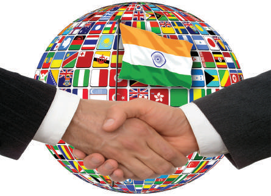

**After studying this lesson, students will be able to**

- Become familiar with our policies with the neighbouring countries.

- Understand the importance of India’s policy towards developed nations.

- Gain knowledge about India’s relationships with international organisations.

- Recognise the achievement of BRICS and OPEC.

- Imbibe the value of India’s position among world countries.

**A bad neighbour is a misfortune, as much as a good one is a great blessing.**

## Introduction

Independent India has been consistently fostering world peace and international cooperation. India abjured military alliances, but has been active in cooperating and co-ordinating with other nations for peace and economic development. As the first Prime Minister of India Jawaharlal Nehru stated “We can neither be absolutely dependent or independent, but we live in a world of interdependence.”

India would prefer a peaceful, wealthy neighbourhood responsive to its own needs and wishes. India has always been known as a peace-loving country and has strived hard to champion the cause of peace in the world. For the country to progress in an adequate manner, the maintenance of international relations has been regarded as an important area. Being a country with a huge population, India is surrounded by many neighbouring countries with whom she has tried to maintain friendly and good neighbourly relations.

– Hesiod

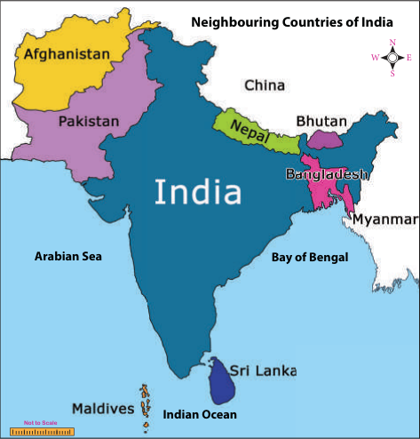

**Neighbouring Countries of India** (Not to Scale)

## 5.1 India and Its Neighbours

India’s position is unique in its neighbourhood. India’s neighbours had been a part of a homogenous culture prevailing in the Indian subcontinent for last five thousand years.

- India is a vast country with Pakistan and Afghanistan to the northwest

- China, Nepal, Bhutan to the north

- Bangladesh to the east

- Myanmar to the far east

- Sri Lanka (from southeast) and Maldives (from southwest) are two countries that lie close to India separated by the Indian Ocean. India has cordial historical, religious, economic, ethnic and linguistic relationship with all of these countries. Let us know about India’s relations with its neighbours.

The countries that share the most number of neighbours touching its borders are China and Russia.

### India and Afghanistan

Indo-Afghan relation was strengthened by the Strategic Partnership Agreement (SPA). SPA provides assistance to re-build Afghan’s infrastructure, institutions, agriculture, water, education, health and providing duty-free access to the Indian market. India helped Afghans in the construction of Salma Dam in the Herat Province. India announced 500 scholarships for the children of the martyrs of Afghan Security Forces in schools and colleges both in Afghanistan and in India. India is also supporting Afghanistan to improve its public health and small-scale industries. India is at the forefront of the promotion of investment in Afghanistan and a consortium of public and private Indian

From the Indus Civilisation, India and Afghanistan have a deep-rooted multi-faceted relationship. During the reign of Kanishka, a large number of Indian missionaries went to China, Central Asia and Afghanistan to preach their religion.

Khan Abdul Ghaffar Khan of Baluchistan (a border province in today’s Pakistan) was a prominent leader of the Indian Independence movement and active supporter of the Indian National Congress.

companies has been selected to make one of the biggest investments in the mining sector. To harness India’s sports potential, India has built Kandahar International Cricket Stadium. India’s Self Employed Women’s Association imparts training on sustainable livelihood and to be self-reliant. Thus, India is contributing proactively to the development of Afghanistan in the form of monetary aids and funds.

### India and Bangladesh

India was the first nation to acknowledge Bangladesh (the former East Pakistan) as an independent country. India and Bangladesh share the longest land boundary of 4096.7 kilometres. India has plans to implement the proposed rail connectivity between Agartala (India) and Akhaura (Bangladesh). Bangladesh has granted India road transit facility through its territories from Kolkata to Agartala via Dhaka under BBIN-MVA (Bangladesh, Bhutan, India, Nepal Motor Vehicle Agreement). The Farakka accord on sharing of Ganga waters signed in 1977 is a historic agreement. India and Bangladesh share 54 common rivers and a bilateral Joint River Commission is working to maximise benefits from common river systems. The Government of India provides grant assistance for project under ‘Aid to Bangladesh’ for the construction of buildings, laboratories, dispensaries and deep tube wells. In addition, scholarships are granted by ICCR (Indian Council for Cultural Relations) every year to students from Bangladesh and it has initiated a Tagore Chair in University of Dhaka. Both the countries jointly inaugurated the construction of 130-kilometre Bangladesh India Friendship Pipeline between Siliguri in West Bengal and Parbatipur (Bangladesh).

The Teen Bigha Corridor is a strip of land belonging to India on the West Bengal– Bangladesh border, which was leased to Bangladesh in 2011.

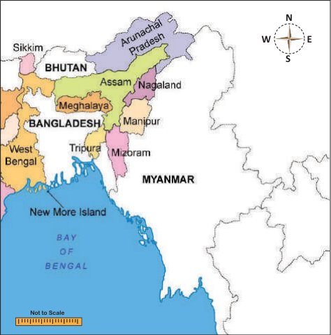

### India and Bhutan

Bhutan, a small Himalayan kingdom, popularly known as a land of thunderbolt, is one of the poorest countries in the world. The diplomatic relations between India and Bhutan were established in 1968 with the appointments of a resident representative of India in Thimphu. Bhutan is a landlocked nation. So it is highly dependent on India for access to sea. India is the principal contributor to the economic development of Bhutan. India declared the bilateral trade relation known as ‘Bharat to Bhutan’ (B2B). India provides scholarship to Bhutanese students to study in prestigious institutions of higher learning and offered help in setting up a digital library in Bhutan. The prestigious Nehru-Wangchuk

Scholarship is being awarded to deserving and talented Bhutanese nationals to undertake studies in selected premier Indian educational institutions. The hydel power sector represents one of the main indicators of bilateral co-operation between India and Bhutan. So far, Government of India has constructed three hydroelectric projects in Bhutan (Chukha, Kurichchu and Tala). India has helped Bhutan in developing that country’s infrastructure by establishing telecommunication and in the construction of hospitals, roads and bridges.

Guru Padmasambhava, a Buddhist saint who went to Bhutan from India, played an influential role in spreading Buddhism and cementing traditional ties between people of both nations.

### India and China

In terms of geographic and demographic dimension, skilled manpower and civilisational depth, China is the only country in the region which qualifies for comparison with India. China, being the manufacturing hub of the world, is strategically very important to India. India and China share similarity of view on many fronts like World Trade Organisation, international climate change talks and reforms of the World Bank. Shanghai Cooperation Organisation, which was China’s initiative, has granted the observer status to India, while SAARC had granted the observer status to China. Both sides have established more dialogue mechanisms covering diverse sectors.

Bilateral trade has registered enormous growth. India and China have signed an educational exchange programme. Under this agreement, scholarships are awarded to 25 students, by both sides, in recognised institutions of higher learning in each other’s country.

McMahon Line: This is the boundary line between India, China and east of Bhutan. It was determined 1914 at a conference of representatives of British India, Tibet and China. The Secretary of State for India (in British Cabinet), Arthur Henry McMahon, represented British India at the Conference.

### India and Maldives

Maldives is located south of Lakshadweep Islands in the Indian Ocean. The relationship with Maldives is important for India given its strategic location and geographical proximity. India and Maldives share ethnic, linguistic, cultural, religious and commercial links steeped in antiquity and enjoy cordial and multi-dimensional relations. Trade and tourism are being developed between the two countries. Both countries have agreed to strengthen cooperation to enhance maritime security in the Indian Ocean Region through coordinated patrolling and aerial surveillance and exchange of information.

### India and Myanmar

India’s second largest border is shared with Myanmar (known as Burma till 1989). Four North-Eastern Indian states – Arunachala Pradesh, Nagaland, Manipur and Mizoram – also share their borders with Myanmar. Myanmar is India’s gateway to South East Asia. India is building the Kaladan Multi-Model Transit Transport, a road-river-port cargo transport project to link Kolkata to Sittwe in Myanmar. A project aiming to connect Kolkata with Ho Chi Minh City on the South Sea for the formation of an economic zone will have a road pass through Myanmar, Cambodia and Vietnam and work on the first phase connecting Guwahati with Mandalay is currently underway. Myanmar is an important partner in our energy needs for petroleum and natural gas. Some of the Indian companies such as Essar, GAIL and ONGC Videsh Ltd. have invested in Myanmar’s energy sector.

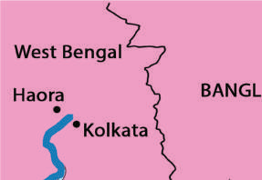

### India and Nepal

Nepal is a natural buff er between India and China. Being a small landlocked country, Nepal depends on India for economic support and transit facilities. India shares borders in fi ve Indian states – – Sikkim, West Bengal, Bihar, Uttar Pradesh and Uttarakhand – with Nepal. People residing in the border districts on both sides share deeper cultural bonds. Indian fi rms are the biggest investors in Nepal. India provides substantial fi nancial and technical development assistance with the focus on infrastructure, irrigation, health, energy projects and community development. India built the 204-kilometre long Mahendra Raj Marg to link Kathmandu and India. Nepal is endowed with fast-fl owing rivers and its terrain is ideal for hydroelectric power generation. India has taken up the work of 5600 MW Pancheshwar project, which remained stalled for 18 years aft er agreement. Nepali and Indian people visit each other’s country for religious pilgrimage. Pashupati and Janakpur are traditional centres in Nepal whereas Varanasi and the four Dhams (Badrinath, Puri, Dwaraka and Rameshwaram) are important pilgrimage destinations in India. Th e bond of friendship further increased when India included Nepalese language in the VIII

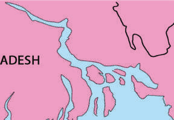

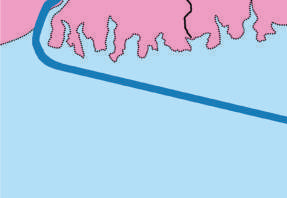

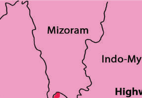

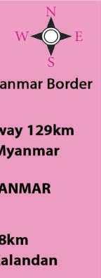

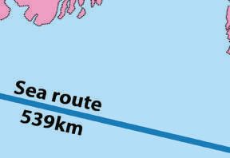

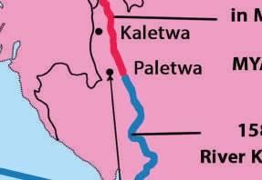

schedule of the Constitution. A joint hydropower project is being built on the Sharda River. This power plant helps both India and Nepal with respect to electricity production and irrigation facilities. From the environmental perspective, there are a number of tiger reserves along Indo- Nepal border. The governments of India and Nepal have signed three sister-city agreements for twinning of Kathmandu-Varanasi, Lumbini- Bodhgaya and Janakpur-Ayodhya.

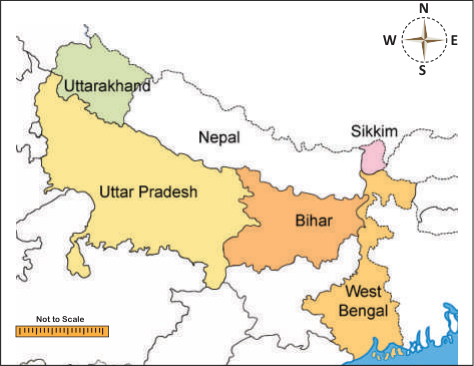

### India and Pakistan

Since the bifurcation of territory, which demarcated India and Pakistan in 1947, the two nations have had strained relations due to disagreements over a number of key issues. Terrorism remains our core concern in the relationship with Pakistan. Pakistan has been antagonistic when maintaining relations with India. But India has made extreme efforts to improve and stabilise relations with Pakistan. The cross-border firing between India and Pakistan and the terrorist attacks combined have taken its toll on the Kashmiris, who have suffered poor living standards and an erosion of human rights. Kashmir is the bone of contention

LoC (Line of Control) The Ceasefire line determined in 1949 was called the LoC after 1972. This is the boundary that came to be agreed between India and Pakistan under the Shimla Agreement of 1972. It was called Radcliffe Line at the time of partition in1947, (Radcliffe was the chairman of the border commission.) This is now called LoC.

between India and Pakistan, which has brought the two countries into an open clash many times. Cross-border terrorism is a major irritant. India tried to bring a positive change in the relationship of the two countries through bilateral agreements such as Shimla Agreement and Lahore Declaration.

### India and Sri Lanka

India has cultural, historical and religious ties with Sri Lanka. Separated by the narrow expanse of the Palk Strait, India and Sri Lanka have shared excellent trade relations committing to each other in both bilateral free trade agreements, as well as developing interactions through SAARC. The relationship between India and Sri Lanka can generally be termed as friendly, except for the brief spell in which the Tamil ethnic problem cast its shadow on the relations between the two countries. India and Sri Lanka has conventionally close to each other. India is among the top investors in Sri Lanka and its investments are in diverse areas including petroleum retail, IT, real estate, telecommunication and tourism. On the other hand, the Sri Lankan investments in India include Brandix (garment city in Vishakhapatnam), MAS Holdings, John Keels, Hayleys, apart from the other investments in the freight servicing and logistic sector. India offers scholarship slots annually to deserving Sri Lankan students. Sri Lanka is also a partner in Nalanda University Project of India.

Ashoka had sent his son Mahinda and daughter Sangamitra to Ceylon (Sri Lanka) for the propagation of Buddhism. Chola kings Rajaraja I and Rajendra I conquered the northern part of Ceylon.

## 5.2 India’s Relationships with Developed Countries

A developed country is a sovereign state that has a highly developed economy and advanced technological infrastructure relative to other less industrialised nations.

N

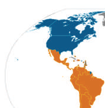

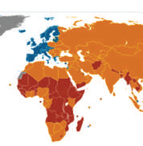

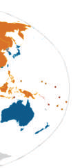

E W

S

Not to Scale developed countries developing countries least developed countries

India has been balancing the superpowers with great care and had been trying to reap the maximum benefit for its domestic development.

**a. USA**

India and the United States of America has signed a Communications Compatibility and Security Agreement (COMCASA) that will lead to a new generation of bilateral military partnership. It is valid for a period of 10 years. COMCASA gives India access to advanced communication technology used in U.S. defence equipment and allows real-time information sharing between the militaries of the two countries.

**b. European countries**

There has been a significant progress in all areas particularly the growing cooperation and exchanges include defence, counterterrorism, nuclear energy and space. French space launch pads are used by ISRO. India and France are cooperating on developing smart cities Chandigarh, Nagpur and Puducherry. India and France launched the International Solar Alliance, which brings together countries between Tropic of Cancer and Tropic of Capricorn for cooperation on solar energy.

**c. Australia**

India and Australia have built strategic trust over the years slowly yet steadily. Australia and India are committed to working together to enhance maritime co-operation with India’s bilateral naval exercise (AUSINDEX).

**d. Japan**

India decided to introduce the Japan’s Shinkansen system. It is a highest class of highspeed railway system with safety and accuracy. Delhi Metro is one of the most successful examples of Japanese co-operation. Mumbai– Ahmedabad High Speed Railway (MAHSR) is another area of co-operation. The Government of Japan has offered 20 seats per year to Indian nationals for a master’s degree course in the University of Japan for serving the Indian Railways.

In the manufacturing sector Japan announced its co-operation of training 30,000 Indian people in the Japan India Institute of Manufacturing (JIM) providing Japanese style manufacturing skills to enhance India’s manufacturing industry base and contribute to ‘Make in India’ and ‘Skill India’ initiatives.

In 2017, the first four JIMs were started in the states of Gujarat, Karnataka, Rajasthan and Tamil Nadu and JEC (two Japanese Endowed Courses in engineering colleges) was established in Andhra Pradesh.

Recent initiatives include the establishment of three India-Japan Joint Laboratories in the area of information and communication technology (Internet of Things, Artificial Intelligence and Big Data Analytics).

## 5.3 India and West Asia

West Asia includes Egypt, the Arabian Peninsula, Turkey and Iran. India and West Asia enjoy pre-historical ties. Trade relations were established between the civilisations of Mesopotamia and the Indus Valley.

West Asia stands as a region of considerable significance for India, economically as well as strategically. West Asia is gateway to landlocked and energy-rich Central Asia. With the advent of the new millennium, there has been extraordinary turnaround in the relationship between the Gulf Cooperation Council (GCC) countries and India.

A trilateral agreement called the Chabahar Agreement was signed between India, Afghanistan and Iran, which has led to the establishment of transit and transport corridor

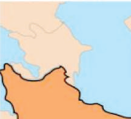

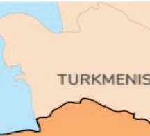

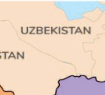

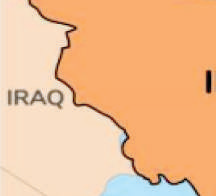

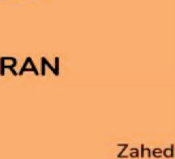

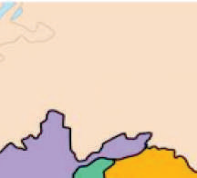

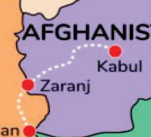

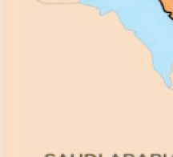

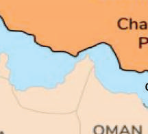

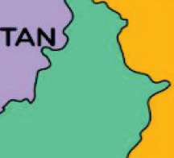

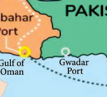

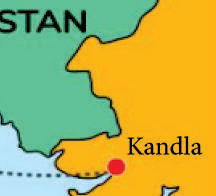

among three countries using Chabahar port. Th is port is seen as golden gateway for India to access landlocked markets of Afghanistan and Central Asia bypassing Pakistan.

One of the oldest maritime trading routes ran from ancient Sumeria via Bahrain to the Indus Civilisation called Meluha.

In medieval times, comments a noted scholar M.S. Agwani, “the Indian expertise in medicine, mathematics and astronomy was highly valued by Arab and Iranian scholars who eventually made it part of their own intellectual traditions.”

## 5.4 India and International Organisations

India is a potential superpower and has a growing international infl uence all around the world. Being a newly industrialised country, India has a great history of collaboration with several countries. It has acted as prominent member of several international organisations and has been a founding member of some. India is a member of formal groupings like UNO, NAM, SAARC, G20 and the Commonwealth.

India has been extending a helping hand to the UNO, in all her efforts in ending military conflicts, and in promoting peace and progress among the nations.

**BRICS**

Brazil, Russia, India, China and South Africa are leading emerging economies and political powers at the regional and international level. The BRICS organisation’s headquarters is in Shanghai, China. BRICS opened up a possibility for countries of the Global South to challenge the Global North. India is an active member and this collaboration paves way for India to build its global profile.

**Reason for the formation of BRICS**

To be an alternative to World Bank and IMF to challenge U.S. supremacy

To provide self-owned and selfmanaged organisations to carry out developmental and economical plans in its member nations

India is actively engaged in general economic diplomacy, which is evident in the country being part of several economic coalitions, as listed in the table below.

| Name of the global groupings | Name of the member countries | Objectives |
|---|---|---|
| IBSA | India, Brazil, South Africa | To focus on agriculture, education, energy, trade, culture and defence among others |
| BCIM | Bangladesh, China, India, Myanmar | To respond to threats such as natural disasters and data breaches and protect business interests |
| MGC (Mekong-Ganga Cooperation) | India, Cambodia, Laos PDR Myanmar, Thailand, Vietnam | To create necessary infrastructural facilities in the Ganga-Mekong basin |
| BIMSTEC (Bay of Bengal Initiative for Multi-Sectoral Technical and Economic Cooperation) | Bangladesh, India, Myanmar, Sri Lanka, Thailand, Bhutan and Nepal | To strengthen and improve the technological economic cooperation, international trade and foreign direct investment cooperation |
| RCEP (Regional Comprehensive Economic Partnership) | Australia, Brunei, Cambodia, China, India, Indonesia, Japan, Korea, Laos, Malaysia, Myanmar, New Zealand, Philippines, Singapore, Thailand, Vietnam | To achieve modern high- quality and mutually beneficial agreement that covers trade in goods, trade in service, investments, technical cooperation dispute settlement and other issues |
| EAS (East Asia Summit) | 10 ASEAN nations + 8 strategic partners including US, China, India, Japan | To promote peace and stability |
| GCC Gulf Cooperation Council | Bahrain, Kuwait, Oman, Qatar, Saudi Arabia, United Arab Emirates, India | To achieve unity based on their common objectives and their similar political and cultural identities |
| BBIN | Bangladesh, Bhutan, India, Nepal | For energy development |
| SCO (Shanghai cooperation organization) | India, Kazakhstan, China, Kyrgyzstan, Pakistan, Russia, Tajikistan and Uzbekistan | For security-related concerns, resolving border issues, intelligence sharing and countering terrorism |

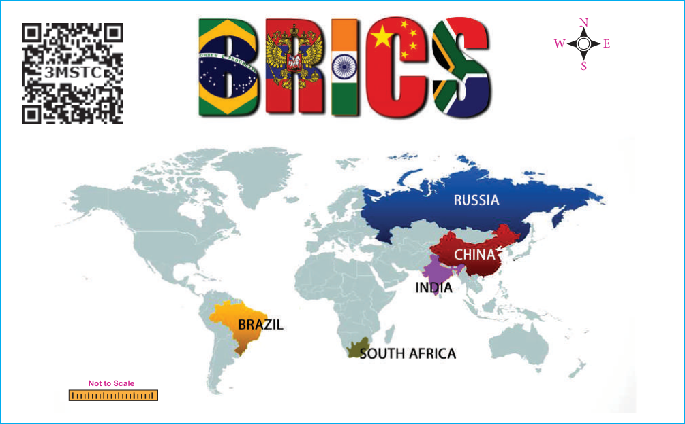

**Objectives of BRICS**

- To achieve regional development

- It acts as a bridge between developed and developing countries

- To contribute extensively to development of humanity

- To establish a more equitable and fair world

- Boost intra BRICS trade in their local currencies to increase trade cooperation and cope with the current international financial crisis

- To promote the technological information exchange among the member states

The acronym BRICS was coined by Jim O’Neill, a famous British economist. He predicted that by year 2050 Brazil, Russia, India and China would become bigger than the six most industrialised nations in dollar terms and would completely change the power dynamics of the last 300 years.

- To enhance inclusive economic growth that will lead to an increase in the creation of jobs, fight against poverty and accelerate the economic transformation of members.

**The Financial Architecture of BRICS**

The New Development Bank (NDB) is a multilateral development bank. Its primary focus is lending for infrastructure projects. It aims to contribute to development plans established nationally through projects that are socially, environmentally and economically sustainable. It gives priority to projects aimed at developing renewable energy sources.

The Contingent Reserve Arrangement (CRA) is a framework for providing protection against global liquidity pressures, which includes currency issues.

**BRICS Payment System**

At the 2015, BRICS Summit, ministers from the BRICS nations initiated consultations for a payment system that would be an alternative to the Society for Worldwide Interbank Financial Telecommunication (SWIFT) system.

**The factors that bolster co-operation among members**

First, the common need among developing countries to construct an economic order that reflects the current situation will drive the BRICS efforts. In this matter, the idea of NDB and CRA are defining changes and will have huge geo-economic and geopolitical impact.

Second, the BRICS alternative idea in the landscape of global governance will attract support from other countries.

Third, the expansion of BRICS interaction to other sector will make it more strong partnership.

**OPEC**

OPEC, the Organisation of the Petroleum Exporting Countries (a group of oil-producing nations), is an intergovernmental organisation founded in Baghdad, Iraq, and headquartered in Vienna, Austria. Iran, Iraq, Kuwait, Saudi Arabia and Venezuela are the OPEC’s Founder Members.

There are three categories of memberships: Founder Members, Full Members and Associate Members. OPEC membership is open to any country that exports crude oil and which shares the ideals of the organisation.

**OPEC’s Mission**

- To coordinate oil policies in its member countries

- Help stabilise oil markets

- To secure fair and stable income to petroleum producers

- An efficient, economic and regular supply of oil to consuming nations

- A fair return on capital to those investing in the petroleum industry

**How does OPEC help other countries?**

The OPEC Fund for International Development (OPID) is an institution that helps finance projects with low interest loans. It

**The OPEC LOGO**

It is the result of an international design competition held in 1969. An Austrian designer Svoboda won the competition with her design, which combined the different letters of the organisation’s name in a rounded design.

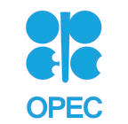

also provides grants to social and humanitarian projects.

OPEC has an Information Centre with over 20,000 volumes including books, reports, maps and conference proceedings related to petroleum, energy and the oil market. The Information Centre is open to the public and is often used by researchers and students.

**India’s Relationship With OPEC**

India is one of the biggest consumers of crude oil. OPEC obviously has vested interest in India’s economic growth. We import 86% of crude oil, 70% natural gas, 95% of cooking gas from OPEC countries. India has been identified as a great partner for OPEC mainly because of its high oil demand.

India doesn’t have enough oil reserves. India can’t produce oil. Devoid of necessary oil reserves India strongly focuses on agriculture, and industrial production.

**Conclusion**

Apart from economic and trade cooperation, India also aspires to have a warm relationship with its neighbours and extended neighbours in the field of education, health, fighting terrorism, disaster management, employment for its citizens, curbing organised crimes, technology development and so on.

### SUMMARY

- India has always been known as a peace – loving country and has strived hard to champion the cause of peace in the world.

- India has cordial, historical, religious, economic, ethnic and linguistic relationship with all its neighbouring countries.

- India supports its neighbours to improve public health, small scale industries, tele-communication, education and in the construction of roads and bridges.

- Government of India provides grant assistance for the construction of buildings, laboratories, dispensaries and deep tube wells to its neighbours.

- India is contributing proactively to the development of its neighbours in the form of monetary aids and funds.

- India has good relationship with the superpowers and tries to reap the maximum benefit for its domestic development.

- India extend its support to the UNO in all her efforts.

- India is an active member of BRICS and it paves way for India to build its global profile.

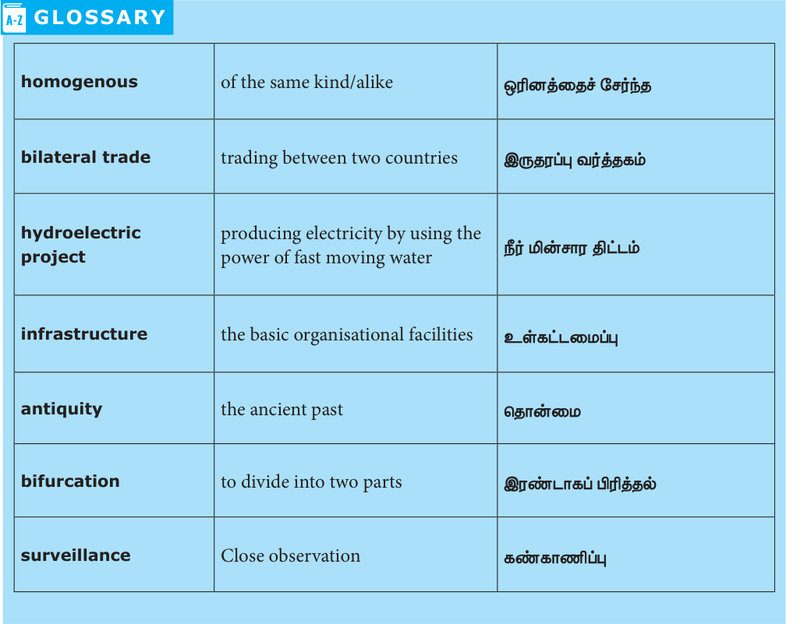

### GLOSSARY

| Term | Meaning |
|---|---|
| homogenous | of the same kind/alike |
| bilateral trade | trading between two countries |
| hydroelectric project | producing electricity by using the power of fast moving water |
| infrastructure | the basic organisational facilities |
| antiquity | the ancient past |
| bifurcation | to divide into two parts |
| surveillance | close observation |

### EXERCISE

**I Choose the correct answer**

1. McMahon Line is a border between a) India and Burma b) India and Nepal c) India and China d) India and Bhutan

2. India is not a member of which of the following

1) G20

2) ASEAN

3) SAARC

4) BRICS a) 2 only b) 2 and 4 c) 2, 4 and 1 d) 1, 2 and 3

3. OPEC is a) An international insurance Co.

b) An international sports club c) An Organisation of Oil Exporting

Countries d) An international company

4. With which country does India share its longest land border?

a) Bangladesh b) Myanmar c) Afghanistan d) China

5. Match the following and choose the correct answer form the codes given below.

i) Salma Dam

- 1. Bangladesh ii) Farakka accord

- 2. Nepal iii) Chukha hydroelectric project

- 3. Afghanistan iv) Sharda River project

- 4. Bhutan a) 3 1 4 2 b) 3 1 2 4 c) 3 4 1 2 d) 4 3 2 1

6. How many countries share its border with

India?

a) 5 b) 6 c) 7 d) 8

7. Which two island countries are India’s neighbours?

a) Sri Lanka and Andaman island b) Maldieves and Lakshadweep island c) Maldieves and Nicobar island d) Sri Lanka and Maldieves

8. Which Indian state is surrounded by three countries?

a) Arunachal Pradesh b) Meghalaya c) Mizoram d) Assam

9. How many Indian states have their boundary with Nepal?

a) Five b) Four c) Three d) Two

10. Who drew up the borders for independent

Pakistan?

a) Lord Mountbatten b) Sir Cyril Radcliffe c) Clement Atlee d) None of the above.

**II Fill in the blanks**

1. ____________ is a small Himalayan kingdom.

2. India’s gateway to South East Asia is

____________.

3. A strip of land ____________, belongs to India on West Bengal and Bangladesh border.

4. ____________ is known as the Land of thunderbolt.

**III Consider the following statement and**

**tick the appropriate answer**

1. The Kaladan transport project by India and

Myanmar consists of which of the following modes of transport?

1. Roads

2. Railways

3. Shipping

4. Inland water transport

Select the correct answer using the codes given below a) 1, 2 and 3 only b) 1, 3 and 4 only c) 2, 3 and 4 only d) 1, 2, 3 and 4

2. Assertion (A): India and France launched

International Solar Alliance.

Reason (R): It was done to bring together countries between Tropic of Cancer and Tropic of Capricorn for co-operation of solar energy.

a) A is correct and R is the correct explanation of A b) A is correct and R is not the correct explanation of A c) A is wrong and R is correct d) Both are wrong

**IV Match the following**

1. Brandix

- Vienna

2. COMCASA

- Japan

3. Shinkansen system - Shanghai

4. BRICS

- USA

5. OPEC

- Garment city in Vishakapatnam

**V Give short answers**

1. Name the neighbouring countries of India.

2. Write a short note on Strategic partnership

Agreement (SPA).

3. What do you know about Kaladan Multi –

Model Transit Transport?

4. What is the role of Japan India Institute of

Manufacturing (JIM)?

5. How do you assess the importance of

Chabahar agreement?

6. Mention the member countries of BRICS.

7. List out any five global groupings in which

India is a member.

**VI Answer in detail**

1. Trace the reason for the formation of BRICS and write its objectives.

2. Mention OPEC missions and how does it help other countries?

3. Highlight

India and International organisation with special reference to any three India’s global groupings.

**VII Project and activity**

1. Students can be asked to collect information form newspapers about India’s relation with world countries.

2. Group project involving students to prepare an album with pictures on India’s latest projects with its neighboring countries.

### REFERENCE BOOKS

1. V.K. Malhotra, International Relations,

Calcutta: Anmol publication

2. Prakash Chandra, International Relations

New Delhi: Vikas Publishing

3. Prakash Chandra, Theories of International

Relations: Aman publishing

4. Baldev Raj Nayar and Thazha Varkey Paul,

India in the world order: Searching for major-power status, Cambridge University Press (2003)

5. Deep Datta Ray, The making of modern

Indian Diplomacy; A critique of Eurocentrism, Oxford University Press, India (2015)

6. Jon C.W. Pevehouse, Joshna S. Goldstein,

International Relations, Pearson Education, Noida (2017)

7. Rajendra M. Abhyankar., Indian Diplomacy,

Oxford University Press, India (2018)

### INTERNET RESOURCES

1. https://en.wikipedia.org/wiki/Foreign_ relations_of_India#Europe

2. https://www.un.org/en/

3. https://mnoal.org/

4. https://brics.ibge.gov.br/
