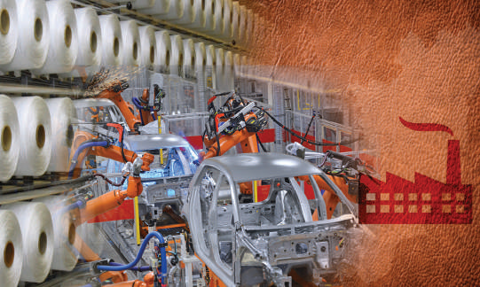
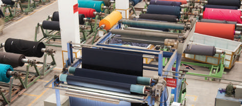
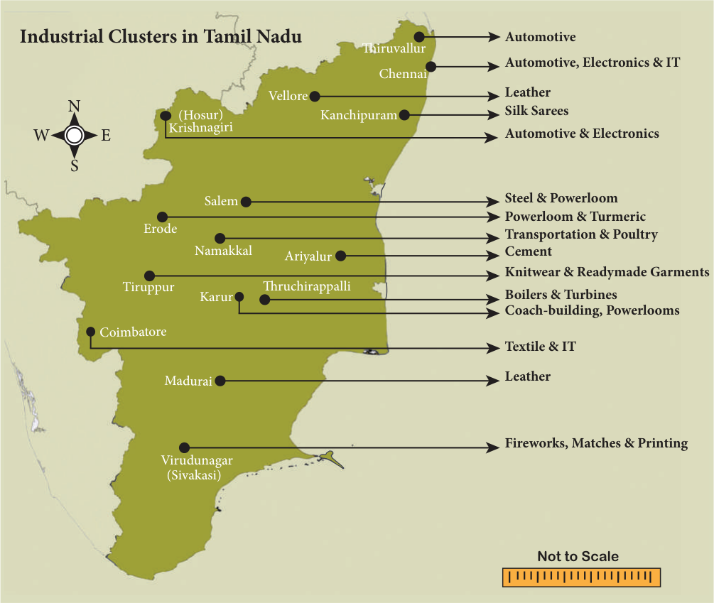
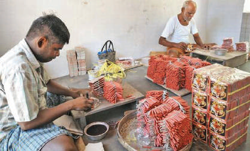
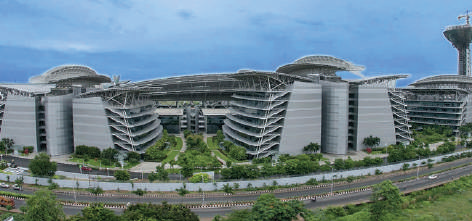

# Economics Unit 5: Industrial Clusters in Tamil Nadu

## Learning Objectives

- To know the historical development of Industrial Clusters in Tamil Nadu.

- To know the Tamil Nadu government policies and Industrial development Agencies.

- To understand the impact of Government policies.

- To know the role of the Entrepreneur.

## Introduction

Generally, “any human activity which is engaged in the conversion of raw materials into readily usable materials is called an industry”. Industrialisation refers to the process of using modern techniques of production to produce goods that are required by both consumers and other producers on a large scale. In this chapter, we will learn the nature of industrialisation of Tamil Nadu, importance of industrial clusters, how industrial clusters have developed in Tamil Nadu and the role of government initiatives in promoting industries.

## 5.1 Importance of Industrialisation

To understand importance of industries, we need to understand why the share of agriculture in an economy's income and employment decreases with development. First, demand for food remains constant with regard to income. Therefore, as an economy grows and incomes increase, consumers tend to spend a lesser share of their income on products from the agricultural sector.

Second, even the food that is consumed is subject to more transformation. Food products are taken over longer distances, processed and branded. This also requires that food products have to be preserved. As a result, the prices that farmers get tend to be much less compared to the prices at which consumers buy.

Third, there are limits to the ability of agriculture to absorb labour due to the declining marginal productivity of land. Wages too cannot therefore increase and as a result poverty levels may remain high, especially when more and more people continue to rely on agriculture for their livelihood.

Due to all these factors, there is a need for an economy’s production and employment base to diversify away from agriculture.

### What benefits does industrialisation bring to an economy?

As stated earlier, it is essential to produce inputs to other producers in an economy. Even agriculture requires inputs from industry such as fertilisers and tractors to increase productivity.

Second, a market exists for both producers and consumer goods. Even services like banking, transport and trade are dependent on production of industrial goods.

Third, by using modern methods of production, industries contribute to better productivity and hence lower the cost of production of all goods produced. It therefore, helps people to buy goods at a cheaper rate and helps create demand for more products.

Fourth, through such expansion of production, industrialisation helps to absorb the labour force coming out of agriculture. Employment generation is therefore an important objective of industrialisation.

Fifth, a related advantage of industrialisation is therefore technological change. Through use of modern techniques, industrialisation contributes to learning of such methods and their improvement. As a result labour productivity, i.e., output per unit of labour input increases, which can help workers earn higher wages.

Sixth, expanding incomes lead to more demand for goods and services.

## 5.2 Types of Industries

Industries can be classified on the basis of

(a) Users: If the output is consumed by the final consumer, it is called a consumer goods sector. If the output is consumed by another producer, it is called a capital goods sector. There are industries that produce raw materials for other industries such as cement and steel. Such industries are called basic goods industries.

(b) Type of Inputs Used: Industries are also classified based on the kind of raw material used such as agro-processing, textiles sector, rubber products, leather goods, etc.

(c) Ownership: Firms may be privately owned, publicly owned (by the government, central or state), jointly owned by the private and public sector, joint sector or cooperatively owned (cooperatives).

(d) Size: Firms may be large, small or medium based on their volume of output, sales or employment or on the basis of the amount of investments made. There are also micro or tiny enterprises that are smaller than even small firms.

The small sector is seen as important for two reasons. One, it is believed to generate more employment than the large-scale sector, which is likely to use more advanced and automated technologies and therefore may not generate enough employment. Second, the small scale sector allows for a larger number of entrepreneurs to emerge from less privileged backgrounds.

Based on experiences of industrialisation in different parts of the world, it is believed that when small firms specialising in one sector are geographically concentrated in specific locations, and linked to one another through production and learning, they tend to be equally if not more efficient than large scale enterprises. Such agglomerations of small firms are called industrial clusters.

## 5.3 Industrial Clusters

Industrial clusters are groups of firms in a defined geographic area that share common markets, technologies and skill requirements. The advantages of industrial clusters or districts were first observed by the famous economist Alfred Marshall in the 1920s when he tried to understand the working of clusters of small firms in the metal-working and textile regions in England. While the notion of an ‘industrial district’ was developed by Marshall, it was only after the success of small firms in Italy in the 1980s that it became popular. Policy-makers in developing countries like India began to promote them actively, as they realized that there several such small firm clusters in the country.

The following are the chief characteristics of a successful cluster.

- Geographical proximity of small and medium enterprises (SMEs)

- Sectoral specialisation

- Close inter-firm collaboration

- Inter-firm competition based on innovation

- A socio-cultural identity, which facilitates trust

- Multi-skilled workforce

- Active self-help organisations, and

- Supportive regional and municipal governments.

Firms are therefore expected to collaborate and compete with one another at the same time. By collaborating, they can expand their capacity and also learn from one another. Through competition, they are forced to become more efficient.

### How Do Clusters Originate?

Clusters may arise due to many factors. Certain clusters evolve over a long time in history when artisans settle in one locality and evolve over centuries. Handloom weaving clusters are one example of this development. Or else, in some sectors, when a large firm is established, a cluster of firms may emerge to take care of its input and service requirements. At times, governments may decide to encourage manufacturing using raw materials from a region, which may also lead to emergence of clusters.

## 5.4 Historical Development of Industrialisation in Tamil Nadu

There is a lot of evidence for presence of industrial activities such as textiles, shipbuilding, iron and steel making and pottery in precolonial Tamil Nadu. Given the vast coastline, the region has been involved in trade with both South-East and West Asia for several centuries. Colonial policies also contributed to the decline of the handloom weaving industry due to competition from machine-made imports from England. But some industries also developed during the colonial period.

### Industrialisation in the Colonial Period

There are two sets of factors that have contributed to the process. The introduction of cotton cultivation in Western and Southern Tamil Nadu by the colonial government led to the emergence of a large-scale textile sector in these parts.

Second, increase in trade during this period led to industrial development around two of the most active ports in the region, Chennai and Tuticorin. Match factories too emerged during the colonial period in the Sivakasi region, which later on became a major centre for fireworks production and printing. Port-related activity too contributed to the growth of the region. Leather production was also taking place in Dindigul, Vellore and Ambur areas.

In Western Tamil Nadu, the emergence of textiles industries also led to demand and starting of textile machinery industry in the region. This textile machinery industry in turn led to the rise of a number of small workshops for repair and producers of machinery components. Another major development in the western region is, the introduction of hydro-electric power in 1930s. Availability of electricity allowed for use of oil engines for drawing ground water. This led to both expansion of agriculture as well as increase in demand for oil engines. In turn, it led to emergence of workshops for servicing engines and also for addressing the demand for spare parts. Foundries began to be set up and agricultural machinery began to be produced.

### Post-Independence to Early 1990s

Soon after independence, several large enterprises were set up by both the central and state governments in different segments such as the Integral Coach Factory in Chennai to make railway coaches and the Bharat Heavy Electricals Limited (BHEL) in Tiruchirapalli to manufacture boilers and turbines. BHEL in turn led to the emergence of an industrial cluster of several small firms catering to its input requirements. Heavy Vehicles Factory was set up to manufacture tanks in Avadi on the outskirts of Chennai. Standard Motors too started manufacturing cars in Chennai. Ashok Motors (later Ashok Leyland) and Standard Motors together helped to form an automobile cluster in the Chennai region. The Avadi industrial estate was established in the 1950s to support the small and medium companies supplying to the large firms in this region. More hydro-electric power projects in the state were also initiated to increase the spread of electrification. The government played a major role in all these processes. The Salem Steel Plant was set up in 1973 to produce stainless steel.

The 1970s and 1980s saw the setting up of emergence of powerloom weaving clusters in the Coimbatore region, as well as expansion of cotton knitwear cluster in Tiruppur and home furnishings cluster in Karur. This period also saw more encouragement for the small and medium sector with setting up of industrial estates by the state government in different parts. The Hosur industrial cluster is a successful case of how such policy efforts to promote industrial estates helped to develop industries in a backward region.

### Industrialisation in Tamil Nadu – Liberalization Phase

The final phase of industrialisation is the post-reforms period since the early 1990s. The reforms made the state governments more responsible for resource mobilisation and they were forced to compete with each other to attract private investments for industrialisation. Incentives such as cheap land, tax concessions and subsidised but quality power were all offered to woo investors. Trade liberalisation and currency devaluation also helped open up export markets. This led to two major developments.

The important industries in the state that evolved over a much longer period include sugar, fertilizers, cement, agricultural implements, iron and steel, chemicals, transformers and paper.

Because of all these factors, Tamil Nadu at present has the largest number of factories among all states in India and also has the largest share of workforce employed in manufacturing. Importantly, it is more labour intensive compared to other industrially advanced states, such as Maharashtra and Gujarat. The major industries are automobiles, auto-components, light and heavy engineering, machinery, cotton, textiles, rubber, food products, transport equipment, chemicals, and leather and leather goods. Unlike other states, the industries are spread across all regions of the state (there are 27 clusters in 13 districts) with many of them being export oriented as well. The state has a well-developed network of roads, rail, air and major ports.

## 5.5 Major Industrial Clusters and Their Specialisation in Tamil Nadu

### Automotive Clusters

Chennai is nicknamed as "The Detroit of Asia", because of its large auto industry base. Chennai is home to large number of auto assembly and component making firms. While there were a few domestic firms like TVS, TI Cycles, Ashok Leyland and Standard Motors earlier, in the post-reform period, several MNC firms like Hyundai, Ford, Daimler-Benz and Renault-Nissan have opened factories in the region. This in turn has attracted a number of component suppliers from foreign countries. Many local firms too cater to component production for all these firms.

Hosur is another auto cluster with firms like TVS and Ashok Leyland having their factories there. Coimbatore region is also developing into an auto component cluster.

### Truck and Bus Body Building Industry Clusters

The Namakkal-Tiruchengode belt in Western Tamil Nadu is known for its truck body building industry. Karur is another major hub with more than 50 units. Many entrepreuners were previous employees in a big firm involved in body building who came out to set up their own units.

### Textile Clusters

Tamil Nadu is home to the largest textiles sector in the country. Because of the development of cotton textile industry since the colonial period, Coimbatore often referred as the "Manchester of South India". At present, most of the spinning mills have moved around the Coimbatore city. Tamil Nadu is the biggest producer of cotton yarn in the country.

Powerloom, however, is more widespread with Erode and Salem region too having a large number of power loom units.

Tiruppur is famous for clustering of a large number of firms producing cotton knitwear.

### Textile Industry

It accounts for nearly 80% of the country's cotton knitwear exports and generates employment in the range of over three lakh people since the late 1980s. It is also a major producer for the domestic market. Because of its success in the global market, it is seen as one of the most dynamic clusters in the Global South. While initially, most firms were run by local entrepreneurs, at present, some of the leading garment exporters in India have set up factories here.

**Industrial Clusters in Tamil Nadu** (Not to Scale)

| Cluster | Industry |
|---|---|
| Thiruvallur | Automotive |
| Chennai | Automotive, Electronics & IT |
| Vellore | Leather |
| Kanchipuram | Silk Sarees |
| Krishnagiri (Hosur) | Automotive & Electronics |
| Salem | Steel & Powerloom |
| Erode | Powerloom & Turmeric |
| Namakkal | Transportation & Poultry |
| Ariyalur | Cement |
| Tiruppur | Knitwear & Readymade Garments |
| Thruchirappalli | Boilers & Turbines |
| Karur | Coach-building, Powerlooms |
| Coimbatore | Textile & IT |
| Madurai | Leather |
| Virudunagar (Sivakasi) | Fireworks, Matches & Printing |

Apart from body building, Karur is a major centre of exports of home furnishings like table cloth, curtains, bed covers and towels. Bhavani and Kumarapalayam are again major centres of production of carpets, both for the domestic and the global markets.

Apart from such modern clusters, there are also traditional artisanal clusters such as Madurai and Kanchipuram that are famous for silk and cotton handloom sarees.

### Leather and Leather Goods Clusters

Tamil Nadu accounts for 60 percent of leather tanning capacity in India and 38 percent of all leather footwear, garments and components. Hundreds of leather and tannery facilities are located around Vellore and its nearby towns, such as Ranipet, Ambur and Vaniyambadi. The Vellore district is the top exporter of finished leather goods in the country. Chennai also has a large number of leather product making units involved in exports. There is another clustering of leather processing in Dindigul and Erode. The leather products sector too is a major employment generator.

### Fireworks, Matches and Printing Cluster

Sivakasi region, once famous for its match industry has now become a major centre for printing and fireworks in the country. It is believed to contribute to 90% of India’s fireworks production, 80% of safety matches and 60% of offset printing solutions. The offset printing industry has a high degree of specialisation among firms with several of them undertaking just one operation required for printing. All these industries have their origin in the colonial period and at present offer employment to a large number of workers.

### Fireworks Industry

### Electronics and Information Technology (IT) Clusters

After the economic reforms started in the early 1990s, the state has seen the entry of hardware and electronics manufacturers like Nokia, Foxconn, Motorola, Sony-Ericsson, Samsung and Dell making cellular handset devices, circuit boards and consumer electronics. They have all been set up in the Chennai region.

**Information Technology Specific Special Economic Zones :**

In order to make development more inclusive, Tier II cities such as Coimbatore, Madurai, Trichy, Tirunelveli, Hosur and Salem have been promoted as IT investment destinations apart from the Chennai region. To facilitate this, ELCOT has established ELCOSEZs (IT Specific Special Economic Zones) in the following eight locations:

- Chennai – Sholinganallur

- Coimbatore – Vilankurichi

- Madurai – Ilandhaikulam

- Madurai – Vadapalanji-Kinnimangalam

- Trichy – Navalpattu

- Tirunelveli – Gangaikondan

- Salem – Jagirammapalayam

- Hosur – Viswanathapuram

## 5.6 The Policy Factors that

### Helped the Industrialisation Process in Tamil Nadu

Policy factors can be divided into three aspects:

### Education

Industries require skilled human resources. Apart from a lot of attention to primary education to promote literacy and basic arithmetic skills, the state is known for its vast supply of technical human resources. It is home to one of the largest number of engineering colleges, polytechnics and industrial training centres in the country.

### Infrastructure

The widespread diffusion of electrification has contributed to the spread of industrialisation to smaller towns and villages in the state. Along with electrification, Tamil Nadu is known for its excellent transport infrastructure, especially minor roads that connect rural parts of the state to nearby towns and cities. A combination of public and private transport has also facilitated

### Special Economic Zones (SEZs)

rural-to-urban connectivity and therefore connect small producers to markets better.

### Industrial Promotion

Apart from investments in education and transport and energy infrastructure, active policy efforts were made to promote specific sectors and also industrialisation in specific regions. Policies to promote specific sectors like automobile, auto components, biotechnology and information and communication technology sectors have been formulated in the post reform period. In addition, the state has put in place several industrial promotion agencies for both large enterprises and the small and medium segments, as well as to provide supporting infrastructure.

### The following are some agencies that have played a key role in industrialization in the state

**SIPCOT (State Industries Promotion**

Corporation of Tamil Nadu) - was formed in the year 1971 to promote industrial growth in the state by setting up industrial estates.

A policy was introduced in April 2000 for the setting up of Special Economic Zones in the country with a view to a hassle-free environment for exports.

**Accordingly, the government has converted Export Processing Zones located at following places.**

| Nanguneri SEZ | – | A multi product SEZ, Thirunelveli |
|---|---|---|
| Ennore SEZ | – | Tehrmal power project, Vayalur |
| Coimbatore SEZ | – | IT Parks |
| Hosur SEZ | – | Auto Engineering, Electronics, Defence and Aerospace |
| Perambalur SEZ | – | Multi product SEZ |
| Autocity SEZ | – | Automobile/Auto Components, Tiruvallur |
| India-Singapore SEZ | – | IT & ITES, Electronic Hardware, Logistics and Warehousing – Thiruvallur District |
| Bio-Pharmaceuticals SEZ | – | Clinical Research Organisation, Poison Control Centre, Centre for Regenerative Medicine, Medicine Research |

### Madras Export Processing Zone (MEPZ)

MEPZ is a Special Economic Zone in Chennai. It is one of the seven export processing zones in the country setup the central government. It was established in 1984 to promote foreign direct investment, enhance foreign exchange earnings and create greater employment opportunities in the region. The MEPZ headquarters is located on GST Road in Tambaram, Chennai.

### SIPCOT

**TANSIDCO (Tamil Nadu Small Industries**

Development Corporation) - is a state-agency of the state of Tamil Nadu, established in the year 1970, to promote small-scale industries in the state. It gives subsidies and provide technical assistance for new firms in the small scale sector.

**TIDCO (Tamil Nadu Industrial**

Development Corporation), 1965 - is another government agency to promote industries in the state and to establish industrial estates.

**TIIC (Tamil Nadu Industrial Investment**

Corporation Ltd.), 1949- is intended to provide low-cost financial support for both setting up new units and also for expansion of existing units.

**TANSI (Tamil Nadu Small Industries**

Corporation Ltd.), 1965 - It is supposed to be the first industrial corporation operating in the domain for small enterprises.

### Issues with Industrialisation

Though Tamil Nadu has emerged as a relatively highly industrialised state in the country, the state faces a few issues in sustaining the process. To begin with, some clusters, especially chemicals, textiles and leather clusters, tend to generate a lot of polluting effluents that affect health. The effluents also pollute water bodies, into which effluents are let into and also adjoining agricultural lands. Second, employment generation potential has declined, because of use of frontier technologies because of the need to compete globally. Quality of employment also has suffered in recent years, as most workers are employed only temporarily.

**Startup India Scheme (Launched 16-Jan- 2016):**

Startup India Scheme is an initiative of the Indian Government, the primary objective of which is the promotion of startups, generation of employment and wealth creation.

**Standup India Scheme (Launched 5-April-2016):**

Standup India Scheme is to facilitate bank loans between `10 lakh and `1 crore to at least one Scheduled Caste (SC) or Scheduled Tribe (ST) borrower and one woman borrower per bank branch for setting up a greenfield enterprise.

## 5.7 Entrepreneur

Entrepreneur is an innovator of new ideas and business processes. He possesses management skills, strong team building abilities and essential leadership qualities to manage a business.

### Entrepreneurship

Entrepreneurship is a process of action of an entrepreneur who undertakes to establish his enterprise. It is the ability to create and build something.

### Role of an Entrepreneur

Entrepreneurs play a most important role in the economic growth and development of a country’s economy.

1. They promote development of industries and help to remove regional disparities by industrialising rural and backward areas.

2. They help the country to increase the

GDP and Per Capita Income.

3. They promote capital formation by mobilising the idle savings of the citizens and country’s export trade.

4. Entrepreneurs provide large-scale employment to artisans, technically qualified persons and professionals and try to maximise profits by innovations.

5. They enable the people to avail better quality goods at lower prices, which results in the improvement of their standard of living.

### SUMMARY

- Industrial clusters are groups of firms in a defined geographic area that share common markets, technologies and skill requirements.

- Clusters may arise due to many factors. Certain clusters evolve over a long time in history when artisans settle in one locality and evolve over centuries.

- The Coimbatore region also witnessed diversification from textiles to textile machinery, as well as agricultural machinery like electric motors and pumpsets for drawing ground water.

- Chennai is nicknamed as "The Detroit of Asia" because of its large auto industry base.

### GLOSSARY

| Agglomerations | a mass or collection of things | திரட்சிகள் |
|---|---|---|
| Industrial Clusters | Relating to or characterised by industry. | தொEொழில் உற் த்தி ெதா குப்புகள் |
| Emergence | the process of coming into existence | தோEோற் ம் |
| Diffusion | the spreading of something more widely | பப ரவல் |
| Artisanal | relating to or characteristic of an artisan | கைவினை சார்்த |

### EXERCISE

**I Choose the correct**

**answer**

1. ‘The Detroit of Asia’ is

___________.

a) Tuticorin b) Coimbatore c) Chennai d) Madurai

2. Pumpsets and motors are produced mostly in a) Salem b) Coimbatore c) Chennai d) Dharampuri

3. ___________ are an essential aspect of a nation’s development.

a) agriculture b) industry c) railway d) none of these

4. Tiruppur is known for a) Leather tanning b) Lock making c) Knitwear d) Agro-processing

5. A successful industrial cluster entirely created by the Tamil Nadu is a) Hosur b) Dindigul c) Kovilpatti d) Tirunelveli

**II Fill in the blanks**

1. Hundred of leather and tannery facilities are located around ___________ district in

Tamil Nadu.

2. Special Economic Zones policy was introduced in ___________.

**III Pick out odd one**

1. Which one of the following is not having leather factories?

a) Ranipet b) Dharmapuri c) Ambur d) Vaniyambadi

2. Which one of the following is not an industrial developing agency?

a) TIDCO b) SIDCO c) MEPZ d) SIPCOT

**IV Match the following**

1. Entrepreneur

- Export Processing Zone

2. MEPZ

- Coimbatore

3. TANSI

- Innovator

4. Manchester of South India - 1965

**V Write Short Answer**

1. Why are wages low in the agricultural sector?

2. What is meant by an industrial cluster?

3. What are the routes for cluster formation?

4. Mention any three industrial development agencies in Tamil Nadu.

5. What are the problems of industrialization currently in Tamil Nadu?

6. What is meant by entrepreneur?

7. What is entrepreneurship?

**VI Write Brief Answer**

1. What are the important characteristics of successful industrial clusters?

2. Write in detail about the types of policies adopted by the Tamil Nadu Government to industrialise.

3. Explain the role of entreprenuer?

**VII Case studies**

1. Choose a cluster in Tamil Nadu based on online research and write a note on it.

**VIII Activity and Project**

1. Write a note on a cluster or a fi rm near your school/home based on your observations.

**IX Life Skills**

1. Teacher and students discuss about the entrepreneurs and their activities and write an essay in the topic of “If you are like an Entrepreneur”.

### REFERENCE BOOKS

1. Role of Entrepreneurship in Economic Development, D.K. Sinha

2. Th e Productivity Analysis of Industrial Clusters in India - Department of Industries & Commerce (Government of Tamil Nadu)

3. State Industrial Profi le - Tamil Nadu

4. Indian Industrial Clusters - Keshab Das

### INTERNET RESOURCES

1. www.tn.gov.in

2. www.msmedi-chennai.gov.in

3. www.data.gov.in

## ICT CORNER

## Steps

- 

Open the Browser and type the URL given below.

- 

You can see the list of SIPCOT in Tamil Nadu. When you click anyone in the list, you will get the details of SIPCOT in new tab.

- 

For example, click on the minimum support price of paddy. You can see the yearwise minimum support price of paddy, wheat and coarsegrain.

- 

Likewise, you can view regionwise procurement also.

**Website URL:**

https://www.sipcot.com/guide_tour
