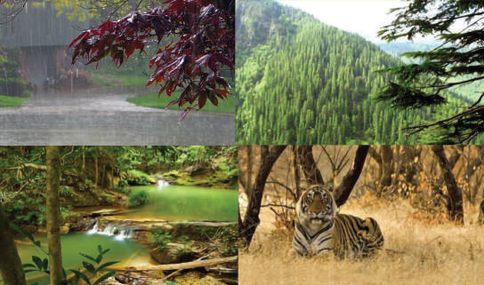
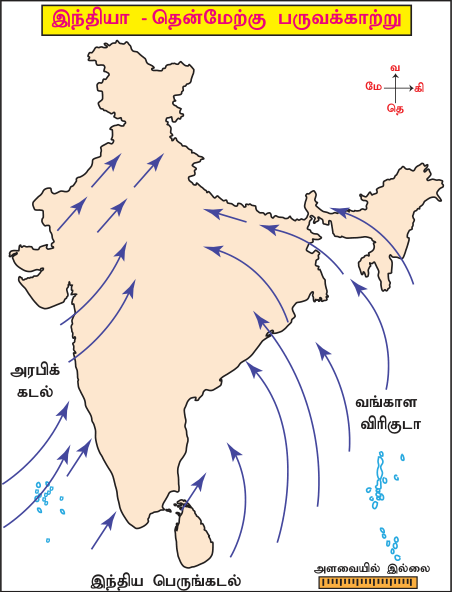
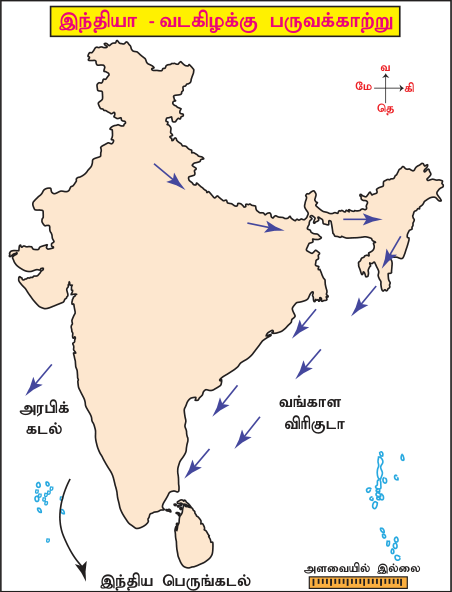
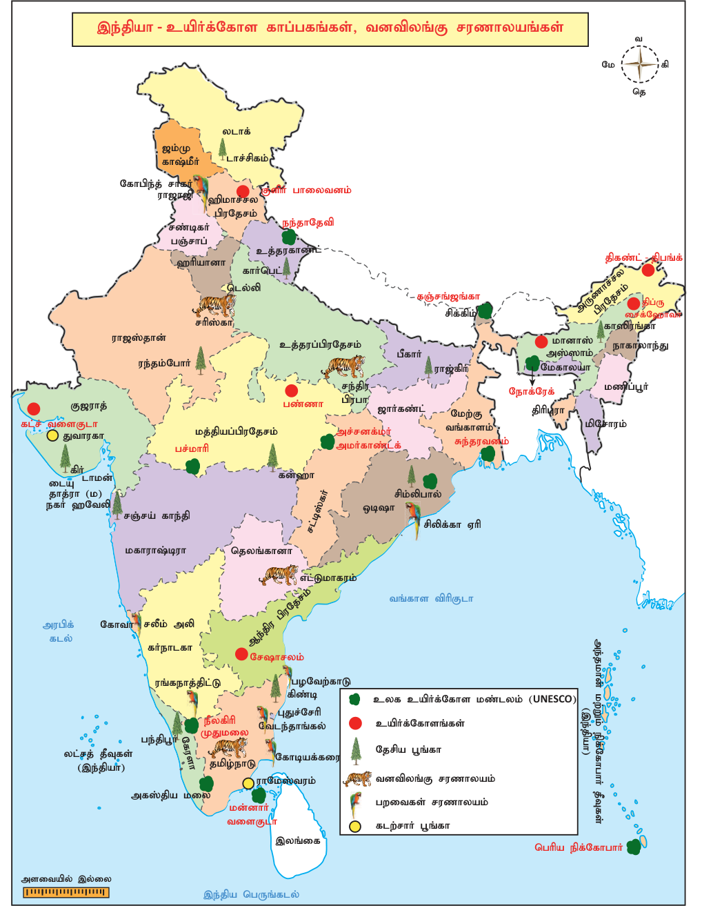

# புவியியல் அலகு 2: இந்தியா – காலநிலை மற்றும் இயற்கைத் தாவரங்கள்

## கற்றலின் நோக்கங்கள்

- இந்தியக் காலநிலையைக் கட்டுப்படுத்தும் காரணிகளை விவரித்தல்

- இந்திய பருவகாலங்களின் பண்புகளை புரிந்துகொள்ளுதல்

- இந்தியாவின் மழைப்பரவலைத் தெரிந்துகொள்ளுதல்

- இந்தியாவின் பல்வேறு இயற்கைத் தாவரவகைகள் மற்றும் வன உயிரினங்கள் பற்றிக் கற்றிதல்

## அறிமுகம்

நாம் கோடைக்காலத்தில் அதிகமாக தண்ணீரைப் பருகுகிறோம். ஆனால், குளிர் காலத்தில் அதே அளவு தண்ணீரைப் பருகுவதில்லை. வட இந்தியாவில் கோடைக்காலத்தில் மென்மையான பருத்தியாலான ஆடைகளையும் குளிர்காலத்தில் கம்பளி ஆடைகளையும் அணிகிறோம். தென்னிந்திய மக்கள் குளிர்காலத்தில் கம்பளி ஆடைகளை அணியாதது ஏன்? ஏனெனில், வட மற்றும் தென்னிந்தியாவில் தட்பவெப்பநிலை மாறுபடுவதே இதற்கு காரணமாகும்.

சமச்சீர் காலநிலை என்பது ’பிரிட்டிஷ் காலநிலை’ என்றும் அழைக்கப்படுகிறது. இக்காலநிலை அதிகவெப்பமுடையதாகவோ அல்லது மிகக்குளிருடையதாகவோ இருக்காது.

## 2.1 இந்தியக் காலநிலையைப் பாதிக்கும் காரணிகள்

அட்சங்கள் கடல் மட்டத்திலிருந்து உயரம், கடலிலிருந்து அமைந்துள்ள தொலைவு, பருவக்காற்று, நிலத்தோற்றம், ஜெட் காற்றுகள் போன்றவை இந்தியக் காலநிலையைப் பாதிக்கும் காரணிகளாகும்.

### அட்சங்கள்

இந்தியா 804’ வட அட்சம் முதல் 3706’ வட அட்சம் வரை அமைந்துள்ளது. 23030’ வட அட்சமான கடகரேகை நாட்டை இரு சமபாகங்களாக பிரிக்கிறது. கடகரேகைக்கு தெற்கே அமைந்துள்ள பகுதிகளில் ஆண்டு முழுவதும் அதிகவெப்பமும் மிகக் குளிரற்ற சூழலும் நிலவுகிறது. கடகரேகைக்கு வடக்கே உள்ள பகுதிகள் மித வெப்பக் காலநிலையைக் கொண்டுள்ளன.

உயரம் புவிப்பரப்பிலிருந்து உயரே செல்லச் செல்ல வளிமண்டலத்தில் ஒவ்வொரு 1000 மீட்டர் உயரத்திற்கும் 6.50C என்ற அளவில் வெப்பநிலை குறைகிறது. இதற்கு ”வெப்பக் குறைவு விகிதம்” என்று பெயர். எனவே , சமவெளிப் பகுதிகளைக் காட்டிலும் மலைப்பகுதிகள் குளிராக இருக்கும். உதகை தென்னிந்தியாவின் இதர மலை வாழிடங்கள் மற்றும் இமயமலையில் அமைந்துள்ள முசௌரி, சிம்லா போன்ற பகுதிகள் சமவெளிகளைவிட மிகவும் குளிராக உள்ளன.

கடல் மட்டத்திலிருந்து 6.7மீ உயரத்தில் அமைந்துள்ள சென்னையின் வெப்பநிலை 350Cஆக இருக்கும்பொழுது 2240மீ உயரமுள்ள உதகை வெப்பநிலையைக் கண்டறிக.

### கடலிலிருந்து அமைந்துள்ள தொலைவு

இந்தியாவின் பெரும்பகுதி குறிப்பாக தீபகற்ப இந்தியா கடலிலிருந்து வெகுதொலைவில் இல்லை. இதன் காரணமாக இப்பகுதி முழுவதும் நிலவும் காலநிலை கடல் சார் ஆதிக்கத்தை கொண்டுள்ளது. இப்பகுதியில் குளிர்காலம் குளிரற்று காணப்பட்டு வருடம் முழுவதும் சீரான வெப்பநிலையைக் கொண்டுள்ளது.

கடல்களின் ஆதிக்கமின்மை காரணமாக மத்திய மற்றும் வட இந்திய பகுதிகள் வெப்பநிலையில் பருவகால மாறுபாடுகளைக் கொண்டுள்ளன. இங்கு கோடையில் கடும் வெப்பமும் குளிர் காலத்தில் கடும் குளிரும் நிலவுகிறது. கொச்சி, கடற்கரை பகுதியில் அமைந்திருப்பதால் இதன் வருடாந்திர சராசரி வெப்பம் 300C அளவுக்கு மிகாமல் உள்ளது. மாறாக கடற்கரையிலிருந்து வெகு தொலைவில் அமைந்துள்ள புதுடில்லியின் வருடாந்திர சராசரி வெப்பம் 400C க்கும் அதிகமாக உள்ளது. கடற்கரை பகுதியில் காற்றில் ஈரப்பதம் மிகுந்து இருப்பதால் இவை அதிக மழை தரும் திறனைக் கொண்டுள்ளது. இதனால் கடற்கரைக்கு அருகிலுள்ள கொல்கத்தாவில் மழைப்பொழிவு 119 செ.மீ ஆகவும் உள் பகுதியில் அமைந்திருக்கும் பிகானேரில் (இராஜஸ்தான்) 24 செ.மீ க்கு குறைவாகவும் பதிவாகின்றது.

பருவக்கால காற்று இந்தியாவின் காலநிலையைப் பாதிக்கும் மிக முக்கிய காரணி பருவகால காற்றாகும். இவை பருவங்களுக்கேற்ப மாறி வீசும் காற்றுகளாகும். இந்தியா ஓர் ஆண்டின் கணிசமான காலத்தில் பருவக்காற்றுகளின் தாக்கத்திற்கு உள்ளாகிறது. இந்தியாவில் ஜூன் மாத மத்தியில் சூரியக் கதிர்கள் செங்குத்துக் விழுகின்றபொழுதிலும் கோடைக்காலம் மே மாத இறுதியில் முடிவடைகிறது. ஏனெனில் தென் மேற்குப் பருவக்காற்று தொடக்கத்தின் காரணமாக வெப்பநிலை குறைந்து இந்தியாவின் பல பகுதிகளுக்கு மிதமானது முதல் கனமழை வரை பொழிகிறது. இதேபோல் தென்கிழக்கு இந்தியாவின் காலநிலையும் வடகிழக்கு பருவக்காற்றின் ஆதிக்கத்திற்கு உட்படுகிறது.

வானிலை என்பது ஒரு குறிப்பிட்ட இடத்தில் உள்ள வளிமண்டலத்தின் தன்மையைக் குறிப்பதாகும்.

காலநிலை என்பது ஒரு குறிப்பிட்ட பகுதியின் சுமார் 30-35 ஆண்டு சராசரி வானிலையைக் குறிப்பதாகும்.

நிலத்தோற்றம் இந்தியாவின் நிலத்தோற்றம், காலநிலையின் முக்கியக் கூறுகளான வெப்பநிலை, வளிமண்டல அழுத்தம், காற்றின் திசை மற்றும் மழையளவை பெருமளவில் பாதிக்கின்றது. இமயமலை மத்திய ஆசியாவிலிருந்து வீசும் கடும் குளிர்க்காற்றை தடுத்து, இந்திய துணைக் கண்டத்தை வெப்பப் பகுதியாக வைத்திருக்கிறது. இதனால் குளிர் காலத்திலும் வடஇந்தியா வெப்ப மண்டல காலநிலையைக் கொண்டுள்ளது. தென்மேற்கு பருவக்காற்று காலங்களில் மேற்குத் தொடர்ச்சி மலைகளின் மேற்கு சரிவுப்பகுதி கன மழையைப் பெறுகிறது. மாறாக மகாராஷ்ட்ரா, கர்நாடகா, தெலங்கானா, ஆந்திரப்பிரதேசம் மற்றும் தமிழ்நாட்டின் பெரும் பகுதிகள் மேற்குத் தொடர்ச்சி மலைகளின் மழைமறைவுப் பகுதி அல்லது காற்று மோதாப்பக்கத்தில் அமைந்திருப்பதால் மிகக்குறைந்த அளவு மழையைப் பெறுகின்றன. இப்பருவத்தில் மேற்குக் கடற்கரையில் அமைந்துள்ள மங்களூர் 280 செ.மீ மழைப்பொழிவையும், மழைமறைவுப் பகுதியில் அமைந்துள்ள பெங்களூரு 50 செ.மீ மழைப்பொழிவையும் பெறுகின்றன.

ஜெட் காற்றோட்டங்கள் வளிமண்டலத்தின் உயர் அடுக்குகளில் குறுகிய பகுதிகளில் வேகமாக நகரும் காற்றுகளை ”ஜெட்காற்றுகள்” என்கிறோம். ஜெட் காற்றோட்ட கோட்பாட்டின் படி, துைண அயன மேலை காற்றோட்டம் வடபெரும் சமவெளிகளிலிருந்து திபெத்திய பீடபூமியை நோக்கி இடம்பெயர்வதால் தென்மேற்கு பருவக்காற்று உருவாகின்றது. கீழை ஜெட் காற்றோட்டங்கள் தென்மேற்கு மற்றும் பின்னடையும் பருவக்காற்று காலங்களில் வெப்பமண்டல தாழ்வழுத்தங்களை உருவாக்குகின்றன.

## 2.2 பருவக்காற்று

‘’மான்சூன்’’ என்ற சொல் ’’மௌசிம்’’ என்ற அரபுச் சொல்லிருந்து பெறப்பட்டது. இதன் பொருள் பருவகாலம் ஆகும். பருவ காலம் என்ற சொல் பல நூற்றாண்டுகளுக்கு முன்னர் அரபு மாலுமிகளால் இந்தியப்பெருங்கடல் கடற்கரைப் பகுதிகளில் குறிப்பாக அரபிக்கடலில் பருவங்களுக்கேற்ப மாறி வீசும் காற்றுகளை குறிப்பிடுவதற்கு பயன்படுத்தப்பட்டது. இக்காற்று கோ> ோடைக்காலத்தில் தென்மேற்கு திசையிலிருந்து வடகிழக்கு நோக்கியும், குளிர்காலத்தில் வடகிழக்கு திசையிலிருந்து தென்மேற்கு நோக்கியும் வீசுகிறது.

பருவக்காற்றின் தோற்றம் குறித்து வானிலை வல்லுநர்கள் பலக் கருத்துகளை உருவாக்கி உள்ளனர். இவற்றில் இயங்கு கோட்பாட்டின்படி, வடகோள உச்ச கோடையில் சூரியனின் செங்குத்துக்கதிர் கடக ரேகையின்மீது விழுகின்றது. இதனால் அனைத்து வளி அழுத்த மற்றும் காற்று மண்டலங்கள் வடக்கு நோக்கி இடம்பெயர்கின்றன. இச்சமயத்தில் இடை அயன குவிப்பு மண்டலம் (ITCZ) வடக்கு நோக்கி நகர்வதால் இந்தியாவின் பெரும் பகுதி தென் கிழக்கு வியாபாரக் காற்றின் ஆதிக்கத்திற்கு உள்ளாகின்றன. இக்காற்று பூமத்தியரேகையைக் கடக்கும் போது புவி சுழற்சியால் ஏற்படும் விசையின் காரணமாக வடகிழக்கு நோக்கி வீசுகிறது. இது தென்மேற்கிலிருந்து வீசுவதால் தென்மேற்கு பருவக்காற்றாக மாறுகிறது.

குளிர்பருவத்தில் வளியழுத்த மற்றும் காற்று மண்டலங்கள் தெற்குநோக்கி நகர்வதன்மூலம் வடகிழக்குப் பருவக்காற்று உருவாகின்றது. இவ்வாறு பருவங்களுக்கேற்றவாறு தங்களது திசைகளை மாற்றிக்கொண்டு வீசும் கோள் காற்றுகளைப் பருவக்காற்று என்கிறோம்.

பருவக்காலங்கள் வானிலை நிபுணர்கள் இந்திய காலநிலையில் நான்கு பருவங்களை அடையாளம் கண்டுள்ளனர். அவை.

1. குளிர்காலம்: ஜனவரி முதல் பிப்ரவரி வரை 2. கோடைக்காலம்: மார்ச் முதல் மே வரை 3. தென்மேற்குப் பருவக்காற்றுக் காலம் அல்லது மழைக்காலம்: ஜூன் முதல் செப்டம்பர் வரை 4. வடகிழக்குப் பருவக்காற்று காலம்: அக்டோபர் முதல் டிசம்பர் வரை

1. குளிர்காலம் இக்காலத்தில் சூரியனின் கதிர்கள் இந்தியாவிலிருந்து வெகுதொலைவிலுள்ள மகரரேகையின் மீது செங்குத்ததாக விழுகின்றன. இதனால் இந்தியப் பகுதி சாய்வான சூரியக்கதிர்களைப் பெறுகிறது. இதுவே , குறைந்த வெப்பத்திற்குக் காரணமாக உள்ளது. தெளிவான வானம், சிறந்த வானிலை, மென்மையான வடக்குக் காற்றுகள், குறைந்த ஈரப்பதம் மற்றும் மிகுந்த தினசரி பகல்நேர வெப்ப வேறுபாடுகள் ஆகியன இப்பருவத்தின் பண்புகளாகும். இப்பருவத்தில் வட இந்தியாவில் ஓர் உயர் அழுத்தம் உருவாகி காற்று வடமேற்கிலிருந்து சிந்து-கங்கை பள்ளத்தாக்குகள் வழியாக வீசுகிறது. தென்னிந்தியாவில் காற்றின் திசையானது கிழக்கிலிருந்து மேற்காக உள்ளது.

மேற்கு இமயமலை, தமிழ்நாடு, கேரளா ஆகிய பகுதிகள் இப்பருவத்தில் மழையைப் பெறுகின்றன.

இக்காலத்தில் மத்தியத் தரைக்கடல் பகுதியில் உருவாகும் மேற்கத்திய இடையூறுடன் தாழ்வழுத்தங்கள் வட இந்தியாவில் மழையைத் தருகின்றன. இக்காற்றை இந்தியாவிற்கு கொண்டுவருவதில் ஜெட் காற்றோட்டம் முக்கியப் பங்கு வகிக்கிறது. இக்காற்றானது பஞ்சாப், ஹரியானா, இமாச்சலப் பிரதேசத்தில் மழைப் பொழிவையும், ஜம்மு காஷ்மீரின் மலைப் பகுதிகளில் பனிப் பொழிவையும் தருகிறது. இம்மழை குளிர்கால கோதுமை பயிரிடலுக்கு மிகவும் பயனளிக்கிறது.

2. கோடைக்காலம் இப்பருவத்தில் சூரியனின் கதிர்கள் இந்திய தீபகற்பத்தின் மீது செங்குத்ததாக விழுகின்றன. எனவே , வெப்பநிலை தெற்கிலிருந்து வடக்கு நோக்கி அதிகரிக்கிறது. கோடைக்காலத்தின் முற்பகுதியில் நாடு முழுவதும் வெப்பமான வறண்ட வானிலை நிலவுகிறது. கோடைக்காலத்தின் மத்தியிலும், இறுதியிலும் நிலப்பகுதியில் இடியுடன் கூடிய ஆலங்கட்டி மழையின் ஆதிக்கத்திற்கு உட்படுகிறது.

இப்பருவத்தில் இந்தியா முழுவதும் வெப்பம் அதிகரிக்கின்றது. ஏப்ரல் மாத்தில் தென் இந்திய உட்பகுதிகளில் தின சராசரி வெப்பநிலை 300C - 350C ஆக பதிவாகிறது. மத்திய இந்திய நிலப்பகுதியின் பல பகுதிகளில் பகல் நேர உச்ச வெப்பநிலை 400C ஆக உள்ளது.

வளிமண்டல அழுத்த நிலையின் வேறுபாட்டால் அரபிக்கடல் மற்றும் வங்கக் கடல் பகுதிகளில் காற்றானது தென் மேற்கிலிருந்து வடகிழக்கு நோக்கி வீசுகிறது. இக்காற்றுகள் மே மாத்தில் மேற்குக் கடற்கரைப் பகுதிகளுக்கு முன் பருவகால மழையைத் தருகின்றன. “மாஞ்சாரல்” (Mango shower) என்ற இடியுடன் கூடிய மழையானது கேரளா மற்றும் கர்நாடக் கடற்கரைப் பகுதிகளில் விளையும் “மாங்காய்கள்” விரைவில் முதிர்வதற்கு உதவுகிறது.

ஏப்ரல் மற்றும் மே மாதங்களில் வடமேற்குத் திசையிலிருந்து வீசும் தலக்காற்று நார்வெஸ்டர் அல்லது கால்பைசாகி என்று அழைக்கப்படுகிறது. இக்காற்று கிழக்கு மற்றும் வடகிழக்கு பகுதிகளான பீகார், மேற்கு வங்காளம் மற்றும் அசாம் மாநிலங்களுக்கு இடியுடன் கூடிய குறுகியக் கால மழையைத் தருகிறது

3. தென்மேற்குப் பருவக்காற்றுக் காலம் (மழைக்காலம்)

இந்திய காலநிலையின் முக்கிய அம்சமாக தென்மேற்குப் பருவக்காற்று விளங்குகிறது.

பருவக்காற்று பொதுவாக ஜூன் முதல் வாரத்தில் இந்தியாவின் தென் பகுதியில் தொடங்கி கொங்கணக் கடற்கரைப் பகுதிக்கு ஜூன் இரண்டாவது வாரத்திலும் ஜூலை 15இல் அனைத்து இந்தியப் பகுதிகளுக்கும் முன்னேறுகிறது.

உலகளாவிய காலநிலை நிகழ்வான “எல்நினோ” தென்மேற்குப் பருவக்காற்றுக் காலத்தில் மிகப்பெரிய தாக்கத்தை ஏற்படுத்துகிறது. தென்மேற்குப் பருவக்காற்று தொடங்குவதற்கு முன் வட இந்தியாவின் வெப்பநிலையானது 460C வரை உயருகிறது. இப்பருவக்காற்றின் இடி மற்றும் மின்னலுடன் கூடிய தொடக்கம் (தென் இந்தியாவில்)’பருவமழை வெடிப்பு’ எனப்படுகிறது. இக்காற்று இந்தியாவின் தென் முனையை அடையும்பொழுது இரண்டு கிளைகளாகப் பிரிக்கிறது. இதன் ஒரு கிளை அரபிக்கடல் வழியாகவும் மற்றொரு கிளை வங்காள விரிகுடா வழியாகவும் வீசுகின்றன.

தென்மேற்குப் பருவக்காற்றின் அரபிக்கடல் கிளை மேற்குத் தொடர்ச்சி மலையின் மேற்குச் சரிவுகளில் மோதி பலத்த மழைப் பொழிவைத் தருகிறது. இக்கிளையானது வடக்கு நோக்கி நகர்ந்து இமயமலையால் தடுக்கப்பட்டு வட இந்தியா முழுவதும் கனமழையைத் தோற்றுவிக்கிறது. ஆரவல்லி மலைத் தொடர் இக்காற்று வீசும் திசைக்கு இணையாக அமைந்துள்ளதால் இராஜஸ்தான் மற்றும் வட இந்தியாவின் மேற்குப் பகுதிக்கு மழைப்பொழிவை தருவதில்லை. வங்காள விரிகுடாக் கிளை, வடகிழக்கு இந்தியா மற்றும் மியான்மரை நோக்கி வீசுகிறது. இது காசி, காரோ, ஜெயந்தியா குன்றுகளால் தடுக்கப்பட்டு மேகாலயாவில் உள்ள மௌசின்ராமில் (Mawsynram) மிகக் கனமழையைத் தருகிறது. பிறகு இக்காற்று கிழக்கிலிருந்து மேற்கு நோக்கி

நகரும்போது மழைப் பொழிவின் அளவு குறைந்து கொண்டே செல்கிறது.

இந்தியாவின் ஒட்டு மொத்த மழைப்பொழிவில் 75 சதவீத மழைப் பொழிவானது இப்பருவக்காற்றுக் காலத்தில் கிடைக்கிறது.

4. வடகிழக்குப் பருவக்காற்றுக் காலம் செப்டம்பர் மாத இறுதியில் அழுத்த மண்டலமானது புவியில் தெற்கு நோக்கி நகர ஆரம்பிப்பதால் தென்மேற்கு பருவக்காற்று பின்னடையும் பருவக்காற்றாக நிலப்பகுதியிலிருந்து வங்காளவிரிகுடா நோக்கி வீசுகிறது. பூமி சுழல்வதால் ஏற்படும் விசையின் (கொரியாலிஸ் விசை) காரணமாக காற்றின் திசை மாற்றப்பட்டு வடகிழக்கிலிருந்து வீசுகிறது. எனவே , இக்காற்று வடகிழக்குப் பருவக்காற்று என அழைக்கப்படுகிறது. இப்பருவக்காலம் இந்தியத் துணைக்கண்ட பகுதியில் வட கீழைக் காற்றுத் தொகுதி தோன்றுவதற்கு காரணமாக உள்ளது.

இப்பருவகாற்றின் மூலம் கேரளா, ஆந்திரா தமிழ்நாடு மற்றும் தென் கர்நாடகாவின் உட்பகுதிகள் நல்ல மழைப்பொழிவைப் பெறுகின்றன. இப்பகுதிகள் மொத்த மழைப்பொழிவில் சுமார் 35 சதவீத்தைப் பெறுகின்றன. வங்கக்கடலில் உருவாகும் புயலால் தமிழ்நாட்டின் பல பகுதிகளும் ஆந்திரா மற்றும் கர்நாடகாவின் சில பகுதிகளும் மழையைப் பெறுகின்றன .

கடற்கரைப் பிரதேசங்களில் கனமழையுடன் கூடிய பலத்த புயல் காற்று, பெரும் உயிர்சேத்தையும், பொருட்சேத்தையும் ஏற்படுத்துகிறது. இப்பருவத்தில் நாடு முழுவதும் பகல் நேர வெப்பநிலை வீழ்ச்சியடைகிறது.

உலகில் மிக அதிக அளவு மழை பெறும் (1141 செ.மீ) பகுதியான மௌசின்ராம் (Mawsynram) மேகாலயாவில் அமைந்துள்ளது.

## 2. 3 மழைப் பரவல்

இந்தியாவில் ஆண்டு சராசரி மழையளவு 118 செ.மீ இருப்பினும் நாட்டின் மழைப்பொழிவின் பரவல் சீரற்றுக் காணப்படுகிறது.

மேற்குக் கடற்கரை, அசாம், மேகாலயாவின் தென்பகுதி, திரிபுரா, நாகலாந்து, அருணாச்சலப்பிரதேசம் போன்ற பகுதிகள் 200 செ.மீட்டருக்கும் அதிகமான மழைப்பொழிவையும் பெறுகின்றன. இராஜஸ்தான் மாநிலம் முழுவதும், பஞ்சாப், ஹரியானா, உத்திரப்பிரதேச மாநிலத்தின் மேற்கு மற்றும் தென்மேற்குப் பகுதிகள், மத்தியப் பிரதேசத்தின் மேற்குப் பகுதி மேற்குத் தொடர்ச்சி மலையின் கிழக்குப் பகுதி தக்காணப் பீடபூமிப் பகுதி மற்றும் தமிழக கடற்கரையின் ஓர் குறுகியப்பகுதியை தவிர பிறப்பகுதிகள் 100 செ. மீட்டருக்கும் குறைவான மழைப்பொழிவைப் பெறுகின்றன. மற்ற பகுதிகள் 100 முதல் 200 செ.மீ வரையிலான மழைப்பொழிவைப் பெறுகின்றன.

## 2.4 இயற்கைத் தாவரங்கள்

இயற்கைத் தாவரம் என்பது நேரடியாகவோ மறைமுகமாகவோ மனித உதவியில்லாமல் இயற்கையாக வளரும் தாவர இனத்தை குறிக்கிறது. இவை இயற்கையான சூழலில் காணப்படுகின்றன. ஒரு பகுதியில் இயல்பாகவே நீண்ட காலமாக மனிதர்களின் தலையீடு இன்றி இயற்கையாக வளரும் மரங்கள், புதர்கள், செடிகள், கொடிகள் போன்ற அனைத்து தாவர உயிரினங்களையும் இயற்கைத் தாவரங்கள் என்கிறோம்.

காலநிலை, மண் வகைகள், மழைப்பொழிவு மற்றும் நிலத்தோற்றங்கள் ஆகியவை இயற்கைத் தாவரங்கள் பரவல் மற்றும் வளர்ச்சியைக் கட்டுப்படுத்துகின்றன.

மேற்கண்ட காரணிகளின் அடிப்படையில் இந்தியாவின் இயற்கைத் தாவரங்கள் பின்வருமாறு வகைப்படுத்தப்படுகின்றன.

### அயனமண்டல பசுமை மாறாக் காடுகள்

ஆண்டு மழைப்பொழிவு 200 செ.மீட்டருக்கு மேலும் ஆண்டு வெப்பநிலை 220Cக்கு அதிகமாகவும், சராசரி ஆண்டு ஈரப்பதம் 70 சதவீத்திற்கு மேலும் உள்ள பகுதிகளில் இவ்வகைக்காடுகள் காணப்படுகிறன. மேற்குத் தொடர்ச்சி மலை, கர்நாடகா, மகாராஷ்ட்ரா, அந்தமான் நிக்கோபார் தீவுகள், கேரளா, அசாம், மேற்கு வங்காளம், நாகலாந்து, திரிபுரா, மிசோரம், மணிப்பூர் மற்றும் மேகாலயா ஆகிய பகுதிகளில் இவ்வகைக் காடுகள் காணப்படுகிறன. ரப்பர், மகோனி, எபனி, ரோஸ் மரம், தென்னை, மூங்கில், சின்கோனா, சிடார் போன்ற மரங்கள் இங்குக் காணப்படுகின்றன. போக்குவரத்து வசதியின்மை காரணமாக இவை வியாபார ரீதியாக பெருமளவில் பயன்படுத்தப்படுவதில்லை.

### அயன மண்டல இலையுதிர்க் காடுகள்

இவ்வகைக் காடுகள் ஆண்டு சராசரி மழைப்பொழிவு அளவு சுமார் 100 செ.மீ முதல் 200 செ.மீ வரை உள்ள பகுதிகளில் காணப்படுகின்றன. இதனைப் பருவக்காலக்காடுகள் என்றும் அைழக்கலாம். இப்பகுதியில் ஆண்டு சராசரி வெப்பநிலை 270C ஆகவும் சராசரி ஒப்பு ஈரப்பதம் 60 முதல் 70 சதவீதமாகவும் உள்ளது. இக்காடுகளில் உள்ள மரங்கள் வசந்த காலத்திலும் கோடைக்காலத்தின் முற்பகுதியிலும் வறட்சியின் காரணமாக இலைகளை உதிர்த்து விடுகின்றன. இமயமலைக்கு அருகில் அமைந்துள்ள பஞ்சாப் முதல் அசாம் வரையிலான பகுதிகள், வடசமவெளிகள், பஞ்சாப், ஹரியானா, உத்திரப்பிரதேசம், பீகார், மேற்கு வங்காளம், மத்திய இந்தியா, ஜார்கண்ட், மத்தியப்பிரதேசம், சத்தீஸ்கர், தென் இந்தியா, மகாராஷ்ட்ரா, கர்நாடகா, தெலங்கானா, ஆந்திரப்பிரதேசம், கேரளா, தமிழ்நாடு போன்ற பகுதிகளில் இவ்வகைக் காடுகள் காணப்படுகின்றன. இங்கு தேக்கு மற்றும் சால் மிக முக்கிய மரங்களாகும்.இதைத் தவிர சந்தனமரம், ரோஸ்மரம், குசம், மாகு, பாலாங், ஆம்லா, மூங்கில், சிசம் மற்றும் படாக் ஆகியவை பொருளாதார முக்கியத்துவம் வாய்ந்த மரங்களாகும். இக்காடுகள் நறுமணத் திரவியங்கள், வார்னீஷ், சந்தன எண்ணெய் மற்றும் வாசனைத் திரவியங்களை அளிக்கின்றன.

### அயனமண்டல வறண்டக் காடுகள்

ஆண்டு மழைப்பொழிவு 50 செ.மீ முதல் 100 செ.மீ வரை உள்ள பகுதிகளில் அயனமண்டல வறண்ட காடுகள் காணப்படுகின்றன. அயனமண்டல வறண்ட காடுகள் ஓர் இடைநிலை வகைக் காடாகும்.

|  | இயா - இயைக தாவரக |  |
|---|---|---|
| A |  |  |
| பைமாறா காக இைல காக வறட காக மைல காக மாேரா காக |  |  |

கிழக்கு இராஜஸ்தான், ஹரியானா, பஞ்சாப், உத்திரப்பிரதேசத்தின் மேற்குப்பகுதி, மத்தியப்பிரதேசம், மகாராஷ்ட்ராவின் கிழக்குப்பகுதி, தெலங்கானா, மேற்குப் கர்நாடகா மற்றும் தமிழ்நாட்டின் கிழக்கு பகுதிகளில் இவ்வகைக் காடுகள் காணப்படுகின்றன. இலுப்பை (Mahua), ஆலமரம், ஆவாராம் பூ மரம் (Amaldas), பலா, மஞ்சக் கடம்பு (Haldu), கருவேலம் (Babool) மற்றும் மூங்கில் ஆகியவை முக்கிய மரவகைகளாகும்.

பாலைவன மற்றும் அரைப் பாலைவனத் தாவரங்கள்: இக்காடுகளை ”முட்புதர் காடுகள்” என்றும் அழைப்பர். இவை ஆண்டு சராசரி மழைப்பொழிவு 50 செ.மீட்டருக்கு குறைவாகவும், அதிக வெப்பமும் குறைவான ஈரப்பதமும் கொண்ட பகுதிகளில் காணப்படுகின்றன. இவ்வகைக் காடுகள் வடமேற்கு இந்தியப் பகுதிகளான மேற்கு இராஜஸ்தான், தென்மேற்கு ஹரியானா, வடக்கு குஜராத் மற்றும் தென்மேற்கு பஞ்சாப் ஆகிய பகுதிகளிலும், தக்காண பீடபூமியின் கர்நாடகா, மகராஷ்ட்டிரா மற்றும் ஆந்திரப்பிரதேசத்தின் வறண்ட பகுதிகளிலும் காணப்படுகின்றன. கருவேலம் (Babool), சீமைக் கருவேல மரம் (Kikar), ஈச்சமரம் போன்ற மரங்கள் இக்காடுகளில் வளர்கின்றன.

### அல்பைன்/இமயமலைக் காடுகள்

உயரம் மற்றும் மழையளவின் அடிப்படையில் இக்காடுகள் வகைப்படுத்தப்படுகின்றன.

i. வடகிழக்கு இந்திய மாநிலங்களில் உள்ள கிழக்கு இமயமலைச் சரிவுகளில் 1200-2400 மீ உயரம் உள்ள பகுதிகளில் காணப்படும் இக்காடுகளில் சால், ஓக், லாரஸ், அமுரா, செஸ்ட்நெட், சின்னமன் போன்ற மரங்கள் வளர்கின்றன. 2400- 3600 மீ உயரங்களில் ஓக், பிர்ச், சில்வர், பெர், பைன், ஸ்புரூஸ், ஜுனிப்பர் போன்ற மரங்கள் காணப்படுகின்றன.

II. ஜம்மு காஷ்மீர், இமாச்சலப்பிரதேசம், உத்தரகாண்ட் போன்ற மாநிலங்களில் மிதமான மழைப் பொழிவு உள்ள பகுதிகளில் சுமார் 900 மீட்டர் உயரமுள்ள பகுதிகளில் அரை பாலைவனத் தாவரங்களான சிறு புதர் செடிகள், சிறு மரங்கள் போன்றவை வளர்கின்றன. சுமார் 900 – 1800 மீ உயரம் உள்ள மலைகளில் சிர் எனப்படும் மரங்கள் அதிகமாகக் காணப்படுகின்றன. 1800 முதல் 3000 மீ உயரமுள்ள பகுதிகளில் மித வெப்ப மண்டல ஊசியிலைக் காடுகள் பரவியுள்ளன.

### அல்பைன் காடுகள்

சுமார் 2400 மீட்டருக்கு மேல் உள்ள இமயமலைகளின் உயரமான பகுதிகளில் இவ்வகைக் காடுகள் காணப்படுகின்றன. இவ்வகைக்காடுகள் ஊசியிலை மரங்களைக் கொண்டுள்ளன. ஓக், சில்வர் பிர், பைன் மற்றும் ஜுனிபர் மரங்கள் இக்காட்டின் முக்கிய மரவகைகளாகும். கிழக்கு இமயமலைப் பகுதியில் இவ்வகையான காடுகள் பரந்த அளவில் உள்ளன.

### மாங்குரோவ் காடுகள்

இக்காடுகள் டெல்டாக்கள், பொங்கு முகங்கள் மற்றும் கடற்கழிமுகப் பகுதிகளில் காணப்படுகின்றன. இவை ஓதங்களின் ஆதிக்கத்திற்கு உள்ளாவதால் சதுப்புநிலக்காடுகள் மற்றும் டெல்டா காடுகள் எனவும் அழைக்கப்படுகின்றன. கங்கை-பிரம்மப்புத்திரா டெல்டா பகுதிகளில் உலகின் மிகப் பெரிய சதுப்பு நிலக் காடுகள் உள்ளன. இவை ’’சுந்தரவனக் காடுகள்’’ எனவும் அழைக்கப்படுகின்றன. மகாநதி, கோதாவரி மற்றும் கிருஷ்ணா நதிகளின் டெல்டா பகுதிகளிலும் இவ்வகை ஓதக்காடுகள் காணப்படுகின்றன.

## 2. 5 வன உயிரினங்கள்

இயற்கைச் சூழ்நிலை அல்லது காடுகளை வாழிடமாகக் கொண்டு வாழும் விலங்குகள் வன உயிரினங்கள் எனப்படுகின்றன. வன உயிரினங்கள் இருபிரிவுகளை உள்ளடக்கியது. அவை முதுகெலும்புள்ளவை (மீன், இருவாழ்விகள், ஊர்வன, பறவைகள், பாலூட்டிகள்) மற்றும் முதுகெலும்பில்லாதவை (தேனீ, பட்டாம் பூச்சி, அந்திப்பூச்சி போன்றவை). இந்தியா அதிக வன உயிரினங்களையும், வன உயிரின வகைகளையும் கொண்ட நாடு. உலகிலுள்ள 1.5 மில்லியன் வகையான வன விலங்கு உயிரினங்களில் இந்தியாவில் மட்டும் 81,251க்கும் மேற்பட்ட வகையான வன விலங்கினங்கள் உள்ளன.

புலி, சிங்கம், சிறுத்தை, பனிச் சிறுத்தை, மலைப்பாம்பு, நரி, ஓநாய், கரடி, முதலை, காண்டாமிருகம், நீர்யானை, ஒட்டகம், வரிக்குதிரை, காட்டுநாய், குரங்கு, பாம்பு, மான் வகை, காட்டு எருமை வகை, வலிமைமிக்க யானை வகை போன்ற வனவிலங்குகளின் வாழிடமாக இந்தியா திகழ்கிறது. வேட்டையாடுதல், காடழிப்பு மற்றும் இதர மனித குறுக்கீடுகளினால் வன விலங்குகளின் வாழிடங்கள் அழிக்கப்பட்டு பல உயிரினங்கள் அழிவின் விளிம்பில் உள்ளன.

### இந்திய வனவிலங்கு வாரியம் 1952 (IBWL)

1952ஆம் ஆண்டு வன விலங்குகள் பாதுகாப்பு மற்றும் மேலாண்மைக் குறித்த பரிந்துரைகளை அரசாங்கத்திற்கு வழங்க நிறுவப்பட்ட அமைப்பு இதுவாகும்.

வனவிலங்குகளைப் பாதுகாக்கவும், வேட்டையாடுதல், கடத்துதல் மற்றும் சட்டவிரோத வணிகம் ஆகியவற்றைக் கட்டுப்படுத்தும் நோக்கத்துடனும் இந்திய அரசு 1972இல் வன விலங்குப் பாதுகாப்புச் சட்டத்தை இயற்றியது.

இந்திய வனவிலங்கின் செழுமைத் தன்மையையும், பன்மையையும் பாதுகாக்க 106 தேசியப் பூங்காக்கள் மற்றும் 573 வனவிலங்குகள் சரணாலயங்கள் உருவாக்கப்பட்டன.

### உயிர்கக்கோளப் பெட்டகம் அல்லது காப்பகங்கள்

உயிர்கக்கோளப் பெட்டகம் என்பது நிலம் மற்றும் கடலோர சுற்றுச் சூழலைப் பாதுகாக்க ஏற்படுத்தப்பட்ட ஒன்று. இந்திய அரசாங்கம் 18 உயிர்கக்கோளக் காப்பகங்களை ஏற்படுத்தியுள்ளது. இவற்றின் பணி இயற்கை வாழ்விடத்தின் பெரும் பகுதிகளைப் பாதுகாத்தல், ஒன்று அல்லது அதற்கு மேற்பட்ட தேசிய பூங்காக்களைப் பாதுகாத்தல் இவைகளின் பொருளாதார பயன்பாட்டு அண்மைப் பகுதிகளைப் பாதுகாத்தல் போன்றவற்றை உள்ளடக்கியது.

புலிகள் பாதுகாப்புத் திட்டம் 1973இல் தொடங்கப்பட்டது. புலிகளை பாதுகாக்கவும் அதன் எண்ணிக்கையை அதிகரிக்கும் நோக்கத்தோடும் புலிகள் பாதுகாப்பகங்கள் தொடங்கப்பட்டன.

### இந்தியாவின் உயிர்கக்கோளக் காப்பகங்கள்

இந்தியாவில் உள்ள 18 உயிர்கக்கோளக் காப்பகங்களில் 11 காப்பகங்கள் (மன்னார் வளைகுடா, நந்தா தேவி, நீலகிரி, நோக்ரேக், பச்மாரி, சிம்லிபால், சுந்தரவனம், அகத்திய மலை,

### பெரிய நிக்கோபார், கஞ்சன்ஜங்கா மற்றும்

### அமர்கண்டக்) யுனெஸ்கோவின் (UNESCO) மனித

### மற்றும் உயிர்கக்கோளக் காப்பகத் திட்டத்தின் கீழ்

செயல்படுகின்றன.

### பாடச்சுருக்கம்

- இந்திய காலநிலை அயனமண்டல பருவக்காற்றுக் காலநிலை என வரையறுக்கப்படுகிறது.

- இந்தியாவில் நான்கு பருவக்காலங்கள் உள்ளன. அவை குளிர்காலம், கோடைக்காலம், தென்மேற்கு பருவக்காற்றுக் காலம் மற்றும் வடகிழக்கு பருவக்காற்றுக் காலம்.

- மனிதனின் நேரடி அல்லது மறைமுகத் தலையீடின்றி இயற்கைச் சூழலில் வளரும் தாவர இனத்தை ”இயற்கைத் தாவரங்கள்” என்கிறோம்.

- இயற்கைத் தாவரங்கள், அயனமண்டல பசுமை மாறாக் காடுகள், அயனமண்டல இலையுதிர்க்காடுகள், அயனமண்டல வறண்ட காடுகள், பாலை மற்றும் அரைபாலைவனக் காடுகள், மலைக் காடுகள், ஆல்பைன் காடுகள் மற்றும் சதுப்புநிலக்காடுகள் என வகைப்படுத்தப்படுகின்றன.

- உயிர்கக்கோளக் காப்பகங்கள் என்பது நிலம் மற்றும் கடலோரப் பகுதிகளில் பாதுகாக்கப்பட்ட சுற்றுச்சூழல் மண்டலங்களாகும்.

### பயிற்சி

**I சரியான விடையைத் தெரிவு செய்க**

1. மேற்கத்திய இடையூறுகளால் மழைப்பொழிவைப் பெறும் பகுதி அ) தமிழ்நாடு ஆ) கேரளா இ) பஞ்சாப் ஈ) மத்தியப் பிரதேசம்

2. கேரளா மற்றும் கர்நாடக கடற்கரைப் பகுதிகளில் விளையும் மாங்காய்கள் விரைவில் முதிர்வதற்கு காற்றுகள் உதவுகின்றன.

அ) லூ ஆ) நார்வெஸ்டர்ஸ் இ) மாஞ்சாரல் ஈ) ஜெட் காற்றோட்டம்

3. ஒரே அளவு மழைபெறும் இடங்களை இணைக்கும் கோடு ஆகும்.

அ) சம மழைக்கோடுகள் ஆ) சம அழுத்தக் கோடுகள் இ) சமவெப்பக் கோடுகள் ஈ) அட்சக் கோடுகள்

4. இந்தியாவின் காலநிலை ஆக பெயரிடப்பட்டுள்ளது.

அ) அயன மண்டல ஈரக் காலநிலை ஆ) நிலநடுக்கோட்டுக் காலநிலை இ) அயனமண்டல பருவக்காற்றுக் காலநிலை ஈ) மித அயனமண்டலக் காலநிலை

5. பருவக்காற்றுக் காடுகள் என்றும் அழைக்கப்படுகின்றன.

அ) அயன மண்டல பசுமை மாறாக் காடுகள் ஆ) இலையுதிர்க் காடுகள் இ) மாங்குரோவ் காடுகள் ஈ) மலைக் காடுகள்

6. சேஷாசலம் உயிர்கக்கோளப் பெட்டகம் அமைந்துள்ள மாநிலம் அ) தமிழ்நாடு ஆ) ஆந்திரப் பிரதேசம் இ) மத்தியப் பிரதேசம் ஈ) கர்நாடகா

7. யுனெஸ்கோவின் (UNESCO) உயிர்கக்கோளப் பாதுகாப்பு பெட்டகத்தின் ஓர் அங்கமாக இல்லாதது .

அ) நீலகிரி ஆ) அகத்திய மலை இ) பெரிய நிக்கோபார் ஈ) கட்ச்

### II பொருத்துக

1. சுந்தரவனம் - பாலை மற்றும் அரைப்பாலைவனத் தாவரங்கள்

2. உயிர்பன்மைச் சிறப்புப் பகுதிகள் - அக்டோபர், டிசம்பர்

3. வடகிழக்குப் பருவக் காற்று - கடற்கரைக் காடுகள்

4. அயன மண்டல முட்புதர்க் காடுகள் - மேற்கு வங்காளம்

5. கடலோரக் காடுகள் - இமயமலைகள்

**III கீழ்க்காணும் வாக்கியங்களைக் கருத்தில் கொண்டு கொடுக்கப்பட்டுள்ளவற்றில் சரியான விடையைத் தெரிவு செய்யவும்**

1. கூற்று: இமய மலையானது ஒரு காலநிலை அரணாகச் செயல்படுகிறது.

காரணம்: இமயமலை மத்திய ஆசியாவிலிருந்து வீசும் குளிர்க்காற்றை தடுத்து இந்தியத் துணைக்கண்டத்தை மிதவெப்பமாக வைத்திருக்கிறது.

அ) கூற்று மற்றும் காரணம் இரண்டும் சரி, கூற்றுக்கான காரணம் சரி. ஆ) கூற்று மற்றும் காரணம் இரண்டும் சரி, கூற்றுக்கான காரணம் தவறு. இ) கூற்று சரி காரணம் தவறு. ஈ) கூற்று தவறு காரணம் சரி.

### IV பொருந்தாத விடையைத் தெரிவு செய்க

1. ஓதக்காடுகள் இதனைச் சுற்றிக் காணப்படுகிறது.

அ) பாலைவனம் ஆ) கங்கை பிரம்மபுத்ரா டெல்டா இ) கோதாவரி டெல்டா ஈ) மகாநதி டெல்டா 2. இந்தியாவின் காலநிலையைப் பாதிக்கும் காரணிகள் அ) அட்ச பரவல் ஆ) உயரம் இ) கடலிலிருந்து அமைந்துள்ள தூரம் ஈ) மண்

**V சுருக்கமாக விடையளிக்கவும்**

1. காலநிலையைப் பாதிக்கும் காரணிகளை பட்டியலிடுக.

2. ”வெப்பக் குறைவு விகிதம்” என்றால் என்ன?

3. ”ஜெட் காற்றோட்டங்கள்”’ என்றால் என்ன?

4. பருவக் காற்று குறித்து ஒரு சிறு குறிப்பு எழுதுக.

5. இந்தியாவின் நான்கு பருவக் காலங்களைக் குறிப்பிடுக..

6. ’பருவமழை வெடிப்பு’ என்றால் என்ன?

7. அதிக மழைபெறும் பகுதிகளைக் குறிப்பிடுக.

### மேற்கோள் நூல்கள்

1. Attri, S.D. and A.Tyagi, 2010. “Climate Profile of India”, India Meteorological Department, Ministry of Earth Sciences, Govt. of India, New Delhi.

2. Singh, S. and J.Saroha, 2014. “Geography of India”, Access Publishing India Pvt. Ltd. New Delhi.

3. Hussain, M. 2008. “Geography of India” Tata McGraw-Hill Publishing House Company Ltd. New Delhi.

4. Govt. of India, 2014. “India’s fifth National Report to the Convention on Biological Diversity” Ministry of Environment and Forests.

### இணையச் செயல்பாடு

செயல்முறை • கீழ்க்காணும் உரலி / விரைவுக் குறியீட்டைப் பயன்படுத்தி இச்செயல்பாட்டிற்கான இணையப் பக்கத்திற்குச் செல்லவும். • சுட்டியைப் பயன்படுத்தி இணைய பக்கத்தின் கீழே செல்லவும். பின்பு ‘Explore’ யை சொடுக்கவும். • பின்பு இடது பக்கத்தில் கொடுக்கப்பட்டுள்ள ‘ Climate’ சென்று ‘ Annual Rainfall’ யை தேர்ந்தெடுக்கவும்.

### உரலி: https://bhuvan-app1.nrsc.gov.in/mhrd_ncert/

8. இந்தியாவில் சதுப்புநிலக் காடுகள் காணப்படும் இடங்களைக் குறிப்பிடுக.

9. இந்தியாவில் உள்ள உயிர்கக்கோளக் காப்பகங்கள் ஏதேனும் ஐந்தினை எழுதுக. VI வேறுபடுத்துக

1. வானிலை மற்றும் காலநிலை.

2. அயன மண்டல பசுமை மாறாக் காடுகள் மற்றும் அயன மண்டல இலையுதிர்க் காடுகள்.

3. வடகிழக்குப் பருவக் காற்று மற்றும் தென்மேற்குப் பருவக்காற்று.

**VII காரணம் கண்டறிக**

1. இந்தியா அயன மண்டலப் பருவக்காற்றுக் காலைநிலையைப் பெற்றுள்ளது.

2. மலைப்பகுதிகள் சமவெளிகளை விட குளிரானவை.

**VIII விரிவான விடையளிக்கவும்**

1. தென்மேற்குப் பருவக் காற்று குறித்து எழுதுக.

2. இந்திய காடுகள் பற்றி விவரிக்கவும்.

### IX வரைபடப் பயிற்சி

இந்திய நிலவரைபடத்தில் கீழ்க்கண்ட இடங்களைக் குறிக்கவும். 1. தென்மேற்குப் பருவக்காற்று வீசும் திசை. 2. வடகிழக்குப் பருவக்காற்று வீசும் திசை. 3. அதிக மழை பெரும் பகுதிகள். 4. மலைக் காடுகள். 5. பன்னா உயிர்கக்கோளப் பெட்டகம். 6. அகத்தியர் மலை உயிர்கக்கோளப் பெட்டகம்.

