# வரலாறு அலகு 6: ஆங்கிலேய ஆட்சிக்கு எதிராக தமிழகத்தில் நிகழ்ந்த தொடக்ககால கிளர்ச்சிகள்

## கற்றலின் நோக்கங்கள்

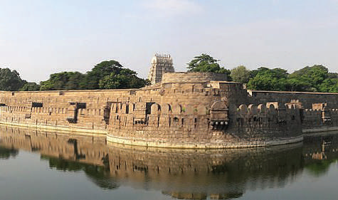

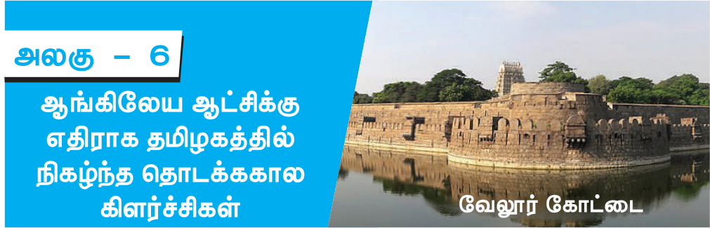

### கீழ்க் காண்பனவற்றோடு அறிமுகமாதல்

- பாளையக்கார் அமைப்பும், ஆங்கிலேயர்களுக்கு எதிரான பாளையக்கார்களின் புரட்சியும்

- வேலுநாச்சியார், பூலித்தேவர், கட்டபொம்மன், மருது சகோதரர்கள் போன்றோரின் ஆங்கிலேய எதிர்ப்புக் கிளர்ச்சிகள்

- தென்னிந்தியாவில் ஆங்கிலேயரின் அடக்குமுறைக்கு பதிலடியாக அமைந்த வேலூர் புரட்சி

## அறிமுகம்

பிரெஞ்சுப் படைகளையும், அதோடு தோழமை கொண்டிருந்த இந்திய ஆட்சியாளர்களையும் மூன்று கர்நாடகப் போர்களில் தோற்கடித்திருந்த கிழக்கிந்திய கம்பெனி தனது அதிகாரத்தையும், செல்வாக்கையும் விரிவாக்கி ஒருங்கிணைக்கத் தொடங்கியது. எனினும் உள்ளூர் ஆட்சியாளர்களும் நிலக்கிழார்களும் இதனை எதிர்த்தனர். நாடுபிடிக்கும் அவர்களின் நோக்கத்திற்கு முதல் எதிர்வினை திருநெல்வேலிப் பகுதியில் (தற்போதைய தென்காசி மாவட்டத்தின்) நெற்கட்டும்சலில் ஆட்சிபுரிந்து ந்த பூலித்தேவரிடமிருந்து வெளிப்பட்டது. இதைத்தொடர்ந்து வேலுநாச்சியார், வீரபாண்டிய கட்டபொம்மன், மருது சகோதரர்கள், தீரன் சின்னமலை போன்ற தமிழகத்தின் பிற பகுதிகளை ஆட்சிபுரிந்து வந்தோரும் எதிர்த்தனர். பாளையக்கார் போர் என அறியப்படும் இது 1806இல் நிகழ்ந்த வேலூர் புரட்சிக்கு இட்டுச் சென்றது. தமிழ்நாட்டில் பிரிட்டிஷாருக்கு எதிராகத் தோன்றிய இத்தொடக்ககால எதிர்ப்புப் பற்றி இப்பாடத்தில் காணலாம்.

## 6.1 ஆங்கிலேயருக்கு எதிரான மண்டல சக்திகளின் எதிர்ப்பு

### (அ) பாளையங்களும் பாளையக்காரர்களும்

பாளையம் என்ற சொல் ஒரு பகுதியையோ, ஓர் இராணுவமுகாமையோ அல்லது

ஒரு சிற்றரசையோ குறிப்பதாகும். பாளையக்கார்கள் (இவர்களை ஆங்கிலேயர்கள் ‘போலிகார்’ (Poligar) என்று குறிப்பிட்டனர்) என்ற தமிழ்சச்சொல் இறையாண்மை கொண்ட ஒரு பேரரசுக்குக் கப்பம்கட்டும் குறுநில அரசைக் குறிக்கிறது. இவ்வமைப்பின் கீழ் தனிநபர் ஒருவர் ஆற்றிய சீரிய இராணுவ சேவைக்காக அவரின் கட்டுப்பாட்டின்கீழ் பாளையம் கொடுக்கப்பட்டது. வாரங்கல்லை சார்ந்தபிரதாபருத்ரனின் ஆட்சிக்காலத்தில் காகதீய அரசில் இப்பாளையக்கார் முறை நடைமுறைப்படுத்தப்பட்டது. மதுரை நாயக்கராக 1529இல் பதவியேற்ற விஸ்வநாத நாயக்கர் அவர்தம் அமைச்சரான அரியநாதரின் உதவியோடு தமிழகத்தில் இம்முறையை அறிமுகப்படுத்தினார். பரம்பரை பரம்பரையாக 72 பாளையக்கார்கள் இருந்திருக்கக்கூடும்.

பாளையக்கார்களால் ரிவசூலிப்பதிலும், நிலப்பகுதிகளை நிர்வகிப்பதிலும், வழக்குகளை விசாரிப்பதிலும், சட்டம் ஒழுங்கைப் பாதுகாப்பதிலும் தன்னிச்சையாகச் செயல்பட முடிந்தது. அவர்களது காவல் காக்கும் கடமை படிக்கல் என்றும் அரசுக்கல் என்றும் அழைக்கப்பட்டது. பல்வேறு சந்தர்ப்பங்களில் நாயக்க ஆட்சியாளர்கள் தங்கள் அதிகாரத்தைத் தக்கவைத்துக்கொள்ள பாளையக்கார்கள் உதவிபுரிந்தனர். பாளையக்கார்களுக்கும், அரசர்களுக்கும் இடையேயான தனிப்பட்ட உறவு மற்றும் புரிதல் மதுரை நாயக்கர்களால் இம்முறை நிறுவப்பட்டதிலிருந்து இருநூறு ஆண்டுகளுக்கும் மேலாக அதாவது ஆங்கிலேயர் இந்நிலப்பகுதிகளைத் தங்கள் வசம் கொண்டு ரும்வரை நீடித்திருந்தது.

### கிழக்கு மற்றும் மேற்குப் பாளையங்கள்

நாயக்க மன்னர்களால் உருவாக்கப்பட்ட 72 பாளையங்களுள் கிழக்கு மற்றும் மேற்கு என்ற இரு தொகுதிகளாகப் பிரிக்கப்பட்டிருந்த பாளையங்களே முக்கியத்துவம் பெற்றவையாகக் கருதப்பட்டன. கிழக்கில் அமையப்பெற்ற பாளையங்கள் சாத்தூர், நாகலாபுரம், எட்டையபுரம் மற்றும் பாஞ்சாலங்குறிச்சி ஆகியனவும் மேற்கில் அமையப்பெற்ற முக்கியமான பாளையங்கள் ஊத்துமலை, தலைவன்கோட்டை, நடுவக்குறிச்சி, சிங்கம்பட்டி, சேத்தூர் ஆகியனவாகும்.

## 6.2 பாளையக்காரர்களின் புரட்சி

### அ) பூலித்தேவரின் புரட்சி (1755-1767)

கர்னல் ஹெரான் தலைமையிலான கம்பெனியின் படை ஒன்றை அழைத்துக் கொண்டு மார்ச் 1755இல் மாபூஸ்கான் (ஆற்காட்டு நவாபின் சகோதரர்) திருநெல்வேலிக்குச் சென்றார். மதுரை எளிதில் அவர்களது கையில் வீழ்ந்தது. அதன்பின் தொடர்ந்து கம்பெனிக்குக் கீழ்ப்படிய மறுத்துவந்த பூலித்தேவரை அடக்க கர்னல் ஹெரான் பணிக்கப்பட்டார். மேற்குப் பகுதியில் இருந்த பாளையக்கார்களிடம் பூலித்தேவர் மிகுந்த செல்வாக்குப் பெற்றிருந்தார். பீரங்கிகளின் தேவையும் துணைக்கலப்பொருட்கள் மற்றும் படைவீரர்களின் ஊதியம் உள்ளிட்ட காரணங்களினால் ஹெரான் தனது திட்டத்தைக் கைவிட்டு மதுரைக்கு பின்வாங்கினார். கம்பெனி நிருவாகம் அவரைத் திரும்ப அழைத்ததோடு நிரந்தரப் பணிநீக்கம் செய்தும் உத்தரவிட்டது.

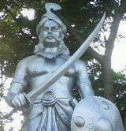

### பூலித்தேவர்

### பிரிட்டிஷ் எதிர்ப்பாளர்களின் கூட்டமைப்பும், நட்புக் கூட்டணியும்

நவாப் சந்தாசாகிப்பின் முகவர்களாக செயல்பட்டு வந்த மியானா, முடிமையா, நபீகான் கட்டாக் எனும் மூன்று பத்தாணிய அதிகாரிகள் மதுரை மற்றும் திருநெல்வேலிப் பகுதிகளில் பொறுப்புவகித்தனர். அவர்கள் ஆற்காட்டு நவாபான முகமது அலிக்கு எதிராக மேற்கு பாளையக்கார்களுக்கு ஆதரவளித்தனர். அவர்களோடு பூலித்தேவர் நெருக்கமான நட்புறவை ஏற்படுத்திக்கொண்டிருந்தார். மேலும், பூலித்தேவர் ஆங்கிலேயர்களுக்கு எதிராகப் போரிட பாளையக்கார்களின் கூட்டமைப்பு ஒன்றையும் ஏற்படுத்தினார். சிவகிரிப் பாளையக்கார் நீங்கலாகப் பிற மறவர் பாளையங்கள் யாவும் அவரை ஆதரித்தன. எட்டையபுரமும் பாஞ்சாலங்குறிச்சியும் கூட இக்கூட்டமைப்பில் இணையவில்லை. மேலும், ஆங்கிலேயர்கள் இராமநாதபுரம் மற்றும் புதுக்கோட்டை மன்னர்களின் ஆதரவைப் பெற்றனர். பூலித்தேவர் மைசூரின் ஹைதர் அலி மற்றும் பிரெஞ்சுக்கார்களது ஆதரவினைப் பெற முயன்றார். ஏற்கனவே மராத்தியர்களோடு கடுமையான மோதலில் ஈடுப்பட்டிருந்த ஹைதர் அலியால் பூலித்தேவருக்கு உதவ இயலவில்லை.

### களக்காடு போர்

நவாப் கூடுதல் படைகளை மாபூஸ்கானுக்கு அனுப்பி திருநெல்வேலிக்குச் செல்லும் படையை பலப்படுத்தினார். மேலும், கம்பெனியின் 1000 சிப்பாய்களோடு நவாபால் அனுப்பப்பட்ட 600க்கும் மேற்பட்ட படை வீரர்களையும் மாபூஸ்கான் பெற்றார். மேலும், அவருக்கு கர்நாடகப் பகுதியிலிருந்த குதிரைப் படை மற்றும் காலாட்படையின் ஆதரவும் இருந்தது. மாபூஸ்கான் களக்காடு பகுதியில் தனது படைகளை நிலைநிறுத்தும் முன்பாக திருவிதாங்கூரின் 2000 வீரர்கள் பூலித்தேவரின் படைகளோடு இணைந்தனர். களக்காட்டில் நடைபெற்ற போரில் மாபூஸ்கானின் படைகள் தோற்கடிக்கப்பட்டன.

### யூசுப்கானும் பூலித்தேவரும்

பூலித்தேவர் தலைமையில் ஒருங்கிணைக்கப்பட்ட பாளையக்கார்கள் எதிர்ப்பு திருநெல்வேலிப் பகுதியில் ஆங்கிலேயர் நேரடியாகத் தலையிடுவதற்கான வாய்ப்பை ஏற்படுத்திக் கொடுத்தது. திருவிதாங்கூர் மன்னரின் ஆதரவோடு 1756 முதல் 1763 வரையிலான காலத்தில் பூலித்தேவர் தலைமையிலான திருநெல்வேலி பாளையக்கார்கள் நவாபின் அதிகாரத்தை எதிர்ப்பதையே முழு நோக்கமாகக் கொண்டிருந்தனர். கம்பெனியாரால் அனுப்பப்பட்ட யூசுப்கான் (கான்சாகிப் என்றும் தமது மதமாற்றத்திற்கு முன்பு மருதநாயகம் என்றும் அழைக்கப்பட்டர்), திருச்சிராப்பள்ளியில் இருந்து தான் எதிர்பார்த்தபெரும்பீரங்கிகள் மற்றும் வெடிபொருட்கள் வந்துசேரும் வரை பூலித்தேவர் மீது தாக்குதல் தொடுக்க அவர் ஆயத்தமாகவில்லை. பிரெஞ்சுப் படைகளோடு ஒருபுறமும், ஹைதர் அலி மற்றும் மராத்தியரோடு மறுபுறமும் ஆங்கிலேயர் போரில் ஈடுபட்டுக் கொண்டிருந்ததால் பீரங்கிப்படைகள் செப்டம்பர் 1760இல் தான் ந்து சேர்ந்தன. யூசுப்கான் நெற்கட்டும்சலில் கோட்டையை முற்றுகையிடுவதற்காக நடத்திய இத்தாக்குதல் இரண்டு மாதங்கள் நீடித்தது. 1761 மே 16இல் பூலித்தேவரின் மூன்று முக்கியக் கோட்டைகள் (நெற்கட்டும்சல், வாசுதேவநல்லூர் மற்றும் பனையூர்) யூசுப்கானின் கட்டுப்பாட்டிற்குள் ந்தன.

இதற்கிடையே பாண்டிச்சேரியைக் கைப்பற்றிய ஆங்கிலேயர்கள் பிரெஞ்சுக்கார்களின் முக்கியத்துவத்தை முழுவதுமாக குறைத்திருந்தனர். இதன் விளைவாக பிரெஞ்சுக்கார்களின் உதவி கிடைக்காது என்றுணர்ந்த பாளையக்கார்களின் ஒற்றுமை உடையத் தொடங்கியது. இதையடுத்து திருவிதாங்கூர், சேத்தூர், ஊத்துமலை மற்றும் சுரண்டை ஆகிய பகுதிகள் எதிரணியினருக்கு தங்கள் ஆதரவை அளிக்கத் தொடங்கின. கம்பெனியின் நிர்வாகத்திற்கு முறையான தகவல் அளிக்காமல் பாளையக்கார்களோடு பேச்சுவார்த்தை நடத்திய யூசுப்கான் மீது நம்பிக்கை துரோகக் குற்றம் சுமத்தப்பட்டு 1764இல் தூக்கிலிடப்பட்டார்.

### பூலித்தேவரின் வீழ்ச்சி

கான்சாகிப் காலமானதைத் தொடர்ந்து, நாடிழந்த நிலையில் சுற்றிவந்த பூலித்தேவர் திரும்பிவந்து 1764இல் நெற்கட்டும்செவலை மீண்டும் கைப்பற்றினார். எனினும் 1767இல் கேப்டன் கேம்ப்பெல் என்பவரால் தோற்கடிக்கப்பட்டார். தப்பிச்சென்ற அவர் நாடிழந்த நிலையிலேயே காலமானார்.

ஒண்டிவீரன் : ஒண்டிவீரன் பூலித்தேவரின் படைப் பிரிவுகளில் ஒன்றனுக்குத் தலைமையேற்றிருந்தார். பூலித்தேவரோடு இணைந்து போரிட்ட அவர் கம்பெனிப் படைகளுக்கு பெரும் சேதங்களை ஏற்படுத்தினார். செவிவழிச் செய்தியின்படி ஒரு போரில் அவரது கை துண்டிக்கப்பட்டதாகவும், அதனால் பூலித்தேவர் பெரிதும் வருந்தியதாகவும் தெரிகிறது. ஆனால், ஒண்டிவீரன், எதிரியின் கோட்டையில் தான் நுழைந்து பல தலைகளைக் கொய்தமைக்காகத் தமக்கு கிடைத்தப் பரிசு என்று கூறியுள்ளார்.

### (ஆ) வேலுநாச்சியார் (1730-1796)

இராமநாதபுரத்தின் அரசர் செல்லமுத்து சேதுபதிக்கு 1730இல் அரசகுடும்பத்தின் ஒரே பெண் வாரிசாக வேலுநாச்சியார் பிறந்தார். மன்னருக்கு ஆண் வாரிசு இல்லை. அரச குடும்பத்தால் வளரி, சிலம்பம் போன்ற தற்காப்புக் கலைகளிலும், போர்க் கருவிகளைக் கையாளுவதற்கும் பயிற்சி அளிக்கப்பட்டு வளர்க்கப்பட்டார். மேலும், அவர் ஆங்கிலம், பிரெஞ்சு, உருது போன்ற மொழிகளில் ல்லமை பெற்றிருந்ததோடு குதிரையேற்றத்திலும், வில்வித்தையிலும் திறமையானவராக விளங்கினார்.

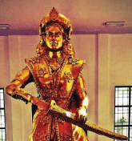

### வேலுநாச்சியார்

தனது 16வது யதில் வேலுநாச்சியார் சிவகங்கை மன்னரான முத்துவடுகநாதரை மணந்து வெள்ளச்சி நாச்சியார் என்ற பெண்மகவையும் பெற்றெடுத்தார். 1772இல் ஆற்காட்டு நவாபும் லெப்டினன்ட் கர்னல் பான் ஜோர் தலைமையிலான கம்பெனி படைகளும் இணைந்து காளையார்கோவில் அரண்மனையைத் தாக்கினர். இதனால் மூண்ட போரில் முத்துவடுகநாதர் கொல்லப்பட்டார். தன் மகளோடு தப்பிச்சென்ற வேலுநாச்சியார் கோபால நாயக்கரின் பாதுகாப்பில் திண்டுக்கல் அருகே உள்ள விருப்பாட்சியில் எட்டு ஆண்டுகள் வாழ்ந்தார்.

மறைந்துவாழ்ந்த காலத்தில் வேலுநாச்சியார் ஒரு படைப்பிரிவை உருவாக்கியதோடு கோபால நாயக்கர் மட்டுமல்லாமல் ஹைதர் அலியோடும் கூட்டணியை ஏற்படுத்திக்கொண்டார். வேலுநாச்சியாரின் சார்பில் ஹைதர் அலிக்கு, தளவாய் (இராணுவத் தலைவர்) தாண்டவராயனார் எழுதிய கடித்தில் ஆங்கிலேயரைத் தோற்கடிக்கும் பொருட்டு 5000 காலாட்படைகளும், 5000 குதிரைப் படைகளும் அனுப்பும்படி அவரிடம் கோரினார். வேலுநாச்சியார் உருது மொழியில் தனக்கு கிழக்கிந்திய கம்பெனியோடு இருந்த பிணக்குகளை கடித்தில் விவரித்திருந்தார்.

விருப்பாட்சியின் பாளையக்காரான கோபால நாயக்கர் : கோபால நாயக்கரைத் தலைவராகக் கொண்ட திண்டுக்கல் கூட்டமைப்பில் (Dindigul League) மணப்பாறையின் லெட்சுமி நாயக்கரும், தேவதானப்பட்டியின் பூஜை நாயக்கரும் இடம் பெற்றிருந்தனர். தனது நட்பை வெளிப்படுத்தும் விதமாக ஒரு நல்லுறவுக் குழுவை அனுப்பிவைத்த திப்பு சுல்தானால் கோபால நாயக்கர் ஈர்க்கப்பட்டார். கோயம்புத்தூரை மையமாகக்கொண்டு பிரிட்டிஷாரை எதிர்த்த அவர், பின்னாட்களில் கட்டபொம்மனின் சகோதரான ஊமைத்துரையோடு இணைந்தார். அவர் உள்ளூர் விவசாயிகளின் ஆதரவுடன் ஆனைமலையில் கடும் போர் புரிந்தார். ஆயினும் பிரிட்டிஷ் படைகளால் அவர் 1801இல் வெற்றிகொள்ளப்பட்டார்.

மேலும், தான் ஆங்கிலேயரோடு மோதுவதில் தீவிரமாக இருப்பதைத் தெளிவுபடுத்தினார். அவரது மனவுறுதியைப் பார்த்து வியந்த ஹைதர் அலி தனது திண்டுக்கல் கோட்டை படைத்தலைவரான சையதிடம் அவருக்கு வேண்டிய இராணுவஉதவிகளை வழங்குமாறு ஆணையிட்டார்.

வேலுநாச்சியார் பிரிட்டிஷாரின் ஆயுதங்கள் குவிக்கப்பட்டிருக்கும் இடத்தை அறிந்துகொள்ள உளவாளிகளை நியமித்தார். கோபால நாயக்கர் மற்றும் ஹைதர் அலியின் இராணுவ உதவியோடு அவர் சிவகங்கையை மீண்டும் கைப்பற்றினார். மருது சகோதரர்களின் உதவியினால் அவர் அரசியாக முடிசூட்டிக்கொண்டார். இந்திய நாட்டில் பிரிட்டிஷ் காலனியாதிக்க அதிகாரத்தை எதிர்த்தமுதல் பெண் ஆட்சியாளர் அல்லது அரசி என்ற பெருமை அவருக்கே உரித்தானதாகும்.

வேலுநாச்சியாரின் நம்பிக்கைக்குரிய தோழியாகத் திகழ்ந்த குயிலி, உடையாள் என்ற பெண்களின் படைப்பிரிவைத் தலைமையேற்று வழிநடத்தினார். உடையாள் என்பது குயிலி பற்றி உளவு கூறமறுத்ததால் கொல்லப்பட்ட மேய்த்தல் தொழில்புரிந்த பெண்ணின் பெயராகும். குயிலி தனக்குத்தானே நெருப்புவைத்துக்கொண்டு (1780) அப்படியே சென்று பிரிட்டிஷாரின் ஆயுதக்கிடங்கிலிருந்த அனைத்துத் தளவாடங்களையும் அழித்தார்.

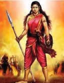

### குயிலி

### (இ) வீரபாண்டிய கட்டபொம்மனின் கலகம் (1790-1799)

தன் தந்தையாரான ஜெகவீரபாண்டிய கட்டபொம்மனின் இறப்பிற்குப் பின் பாஞ்சாலங்குறிச்சியின் பாளையக்காராக தனது முப்பதாது யதில் வீரபாண்டிய கட்டபொம்மன் பொறுப்பேற்றார். கம்பெனி நிருவாகிகளான ஜேம்ஸ் லண்டன் மற்றும் காலின் ஜாக்சன் என்போர் இவரை அமைதியை விரும்பும் மனம் கொண்டவராகவே கருதினர். எனினும் தொடர்ந்து நடந்த சம்பங்கள் கட்டபொம்மனுக்கும், கிழக்கிந்திய கம்பெனிக்கும் மோதல்போக்கை ஏற்படுத்தின. 1781இல் கம்பெனியாருடன் நவாப் ஏற்படுத்திக்கொண்ட உடன்படிக்கையின்படி, மைசூரின் திப்பு சுல்தானுடன் ஆற்காட்டு நவாப் போர்புரிந்து கொண்டிருந்தபோது,

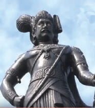

### கட்டபொம்மன்

கர்நாடகப்பகுதியில் ரி மேலாண்மையும், நிருவாகமும் கம்பெனியின் முழுக்கட்டுப்பாட்டின் கீழ் செல்லும்நிலை ஏற்பட்டது. சூலிக்கப்பட்ட ரியில் ஆறில் ஒரு பங்கு நவாபிற்கும் அவர் குடும்ப பராமரிப்பிற்கும் என ஒதுக்கப்பட்டது. இவ்வாறு பாஞ்சாலங்குறிச்சியிடமிருந்து ரி சூலிக்கும் உரிமையை கம்பெனி பெற்றிருந்தது. அனைத்துப் பாளையங்களிலிருந்தும் ரிகளை சூலிக்க கம்பெனி அதன் ஆட்சியர்களை நியமித்தது. ஆட்சியர்கள் பாளையக்கர்களை அவமானப்படுத்தியதோடு ரிகளை சூலிக்க படையினைப் பயன்படுத்தினர். இதுவேகட்டபொம்மனுக்கும் ஆங்கிலேயருக்கும் இடையே பெரும் பகை ஏற்பட அடிப்படையானது.

### ஜாக்சனோடு ஏற்பட்ட மோதல்

கட்டபொம்மனிடமிருந்து வசூலிக்க வேண்டிய நிலவரி நிலுவையானது 1798ஆம் ஆண்டு வாக்கில் 3310 பகோடாக்களாக இருந்தது. இவற்றை சூலிப்பதற்காக ஜாக்சன் என்ற கர்வமுள்ள ஆட்சியர் இராணுவத்தை அனுப்ப முனைந்தபோது மதராஸ் அரசாங்கம் அதற்கு அனுமதியளிக்க மறுத்தது. 1798 ஆகஸ்ட் 18இல் இராமநாதபுரத்தில் ந்து தன்னைச் சந்திக்குமாறு கட்டபொம்மனுக்கு அவர் ஆணை பிறப்பித்தார். ஆனால், கட்டபொம்மன் மேற்கொண்ட முயற்சி பலனளிக்காதோடு குற்றாலம் மற்றும் ஸ்ரீவில்லிப்புத்தூர் ஆகிய இடங்களிலும் ஜாக்சன் அவரைச் சந்திக்க மறுத்தார். இறுதியாக 1798 செப்டம்பர் 19 அன்று அனுமதியளித்தன்பேரில் கட்டபொம்மன் இராமநாதபுரத்தில் ஜாக்சனைச் சந்தித்தார். ஆணவத்தின் மொத்த உருவமாகத் திகழ்ந்தஜாக்சனின் முன்பு கட்டபொம்மன் மூன்று மணி நேரம் நிற்க வைக்கப்பட்டதாகச் சொல்லப்படுகிறது. ஆபத்தை உணர்ந்தகட்டபொம்மன் தன் அமைச்சரான சிவசுப்ரமணியனாருடன் தப்பிச்செல்ல முயன்றார். உடனடியாக ஊமைத்துரை தன் ஆட்களோடு கோட்டைக்குள் நுழைந்து கட்டபொம்மன் தப்ப உதவினார். இராமநாதபுரம் கோட்டை வாசலில் நடந்த மோதலில் லெப்டினென்ட் கிளார்க் உள்ளிட்ட சிலர் கொல்லப்பட்டனர். சிவசுப்ரமணியனார் கைது செய்யப்பட்டு சிறையிலடைக்கப்பட்டார்.

### மதராஸ் ஆட்சிக்குழுவின் முன்பாக ஆஜராதல்

பாஞ்சாலங்குறிச்சிக்குத் திரும்பிய கட்டபொம்மன் ஆட்சியர் ஜாக்சன் தன்னை எவ்வாறெல்லாம் அவமானப்படுத்தினார் என்பதை மதராஸ் ஆட்சிக்குழுவிற்குத் தெரியப்படுத்தினார்.

அக்குழு வில்லியம் ப்ரௌன், வில்லியம் ஓரம், ஜான் காஸாமேஜர் ஆகியோர் அடங்கிய குழுவின் முன்பாக ஆஜராகும்படி கட்டபொம்மனைப் பணித்தது. இதற்கிடையே சிவசுப்ரமணியனாரை சிறையிலிருந்து விடுவித்தும், கலெக்டர் ஜாக்ஸனைப் பணி இடைநீக்கம் செய்தும் ஆளுநர் எட்வர்ட் கிளைவ் உத்தரவிட்டார். குழுவின் முன்பாக 1798 டிசம்பர் 15 அன்று கட்டபொம்மன் ஆஜராகி இராமநாதபுரத்தில் நிகழ்ந்ற்றை விளக்கினார். கட்டபொம்மன் குற்றவாளி அல்லர் என்று குழு முடிவுசெய்தது. ஜாக்சன் நிரந்தரப் பணிநீக்கம் செய்யப்பட்டு அவரது இடத்தில் புதிய ஆட்சியராக S.R. லூஷிங்டன் என்பர் நியமிக்கப்பட்டார். கட்டபொம்மனும் நிலுவைத் தொகையில் 1080 பகோடாக்கள் நீங்கலாக பிற நிலுவைத் தொகையினைச் செலுத்தியிருந்தார்.

### கட்டபொம்மனும் பாளையக்காரர்களின் கூட்டமைப்பும்

இதற்கிடையே, திண்டுக்கல்லின் கோபால நாயக்கர், ஆனைமலையின் யதுல் நாயக்கர் போன்ற அருகாமையிலிருந்த பாளையங்களை உள்ளடக்கிய தென்னிந்தியக் கூட்டமைப்பை சிவகங்கையின் மருதுபாண்டியர் ஏற்படுத்தினார். மருதுபாண்டியர் அதன் தலைவராகச் செயல்பட்டார். திருச்சிராப்பள்ளி அறிக்கை தயாரிக்கப்பட்டது. இக்கூட்டமைப்பு கட்டபொம்மனின் ஆர்வத்தைத் தூண்டியது. மருது சகோதரர்களை கட்டபொம்மன் சந்திப்பதை ஆட்சியர் லூஷிங்டன் தடுக்க முயன்றார். ஆனால், மருது சகோதரர்களும், கட்டபொம்மனும் இணைந்து ஆங்கிலேயரை எதிர்ப்பது என்று முடிவெடுத்தார்கள். கட்டபொம்மன் தனது செல்வாக்கைப் பயன்படுத்தி சிவகிரி பாளையக்காரைத் தங்களோடு இணைக்க முயன்றார், அவர் அதற்கு மறுத்தார். அதனால் சிவகிரியை நோக்கி கட்டபொம்மன் முன்னேறினார். ஆனால் சிவகிரி பாளையத்தினர் கம்பெனிக்குக் கப்பம் கட்டிவந்தனர். அதனால் கட்டபொம்மனின் சிவகிரி நோக்கியப் படைநகர்வை தங்களுக்கு விடப்பட்ட சவாலாகவே கம்பெனியார் கருதினர். கம்பெனி தனது படைகளை திருநெல்வேலி நோக்கிச் செல்ல உத்தரவிட்டது.

### பாஞ்சாலங்குறிச்சி முற்றுகை

மே 1799இல் மதராஸில் இருந்த வெல்லெஸ்லி பிரபு திருச்சிராப்பள்ளி, தஞ்சாவூர் மற்றும் மதுரை ஆகிய பகுதிகளில் நிறுத்தி வைக்கப்பட்டிருந்த படைகளை திருநெல்வேலி நோக்கிச் செல்ல உத்தரவிட்டார். படைகளுக்கு மேஜர் பானெர்மென் தலைமையேற்றார். திருவிதாங்கூர் படைகளும் பிரிட்டிஷ் படைகளோடு இணைந்தன.

கட்டபொம்மனைச் சரணடையக் கோரிய நிபந்தனையொன்று 1799 செப்டம்பர் 1 அன்று ழங்கப்பட்டது. கட்டபொம்மனின் பிடிகொடுக்காத பதிலால் மேஜர் பானெர்மென் கோட்டையைத் தாக்கினார். பானெர்மென் செப்டம்பர் 5 அன்று முழுப் படைகளையும் பாஞ்சாலங்குறிச்சியில் கொண்டுவந்து நிறுத்தினார். அவர்கள் கோட்டையின் அனைத்துத் தொடர்புகளையும் துண்டித்தனர். பானெர்மென் இராமலிங்கரை தூதனுப்பி கட்டபொம்மனைச் சரணடையுமாறு கேட்டுக்கொண்டார். கட்டபொம்மன் மறுத்தார். கோட்டையின் இரகசியங்கள் அனைத்தையும் இராமலிங்கர் சேகரித்தார். அவரது அறிக்கையை அடிப்படையாகக் கொண்டு பானெர்மென் தாக்குதல் உத்திகளை டிவமைத்தார். கோலார்பட்டியில் நடைபெற்ற மோதலில் சிவசுப்ரமணியனார் கைது செய்யப்பட்டார்.

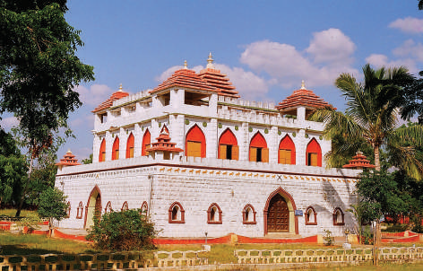

### பாஞ்சாலங்குறிச்சிக் கோட்டை

### கட்டபொம்மன் தூக்கிலிடப்படல்

கட்டபொம்மன் புதுக்கோட்டைக்கு தப்பிச் சென்றார். பிரிட்டிஷார் அவரது தலைக்கு ஒரு வெகுமதியை நிர்ணயித்தனர். எட்டையபுரம் மற்றும் புதுக்கோட்டை அரசர்களால் துரோகமிழைக்கப்பட்ட கட்டபொம்மன் இறுதியில் பிடிபட்டார். சிவசுப்ரமணியனார் நாகலாபுரத்தில் செப்டம்பர் 13 அன்று தூக்கிலிடப்பட்டார். பானெர்மென் விசாரணை என்ற பெயரில் ஒரு கேலிக்கூத்தை பாளையக்கார்களின் முன்பாக அக்டோபர் 16 அன்று அரங்கேற்றினார். விசாரணையின் போது கட்டபொம்மன் தன்மீது சுமத்தப்பட்ட அனைத்துக் குற்றச்சாட்டுகளையும் ஏற்றுக்கொண்டார். திருநெல்வேலிக்கு மிக அருகேயுள்ள கயத்தாறின் பழையகோட்டைக்கு முன்பாக இருந்த புளியமரத்தில் சகப் பாளையக்கார்களின் முன்னிலையில் கட்டபொம்மன் தூக்கிலிடப்பட்டார். இவ்வாறு போற்றுதலுக்குரியவராகத் திகழ்ந்தபாஞ்சாலங்குறிச்சியின் பாளையக்கார் கட்டபொம்மனின் வாழ்க்கை முடிவுற்றது. அவர் மீது புனையப்பட்ட நாட்டுப்புறப்பாடல்கள் பலவும் அவரது நினைவை மக்களிடையே உயிர்ப்புடன் தக்கவைத்துக் கொள்ள உதவுகின்றன.

### (ஈ) மருது சகோதரர்கள்

பெரிய மருது என்ற வெள்ள மருது (1748- 1801) மற்றும் அவரது தம்பியான சின்ன மருது (1753-1801) ஆகிய இருவரும் சிவகங்கையின் முத்துவடுகநாதரின் திறமையான படைத் தளபதிகளாவர். காளையார்கோவில் போரில் முத்துவடுகநாதர் இறந்தபின் வேலுநாச்சியாருக்கு அரசுரிமையை மீட்டுக்கொடுக்க மருது சகோதரர்கள் அரும்பாடுபட்டனர். பதினெட்டாம் நூற்றாண்டின் கடைசி ஆண்டுகளில் மருது சகோதரர்கள் பிரிட்டிஷாரை எதிர்க்கத் திட்டமிட்டனர். கட்டபொம்மனின் இறப்பிற்குப் பின்னர் அவரது சகோதரர் ஊமைத்துரையோடு இணைந்து பணியாற்றினர். அவர்கள் நவாபுக்குச் சொந்தமான களஞ்சியங்களைக் கொள்ளையிட்டதோடு கம்பெனியின் படைகளுக்குப் பெரும்சேத்தையும், அழிவையும் ஏற்படுத்தினர்.

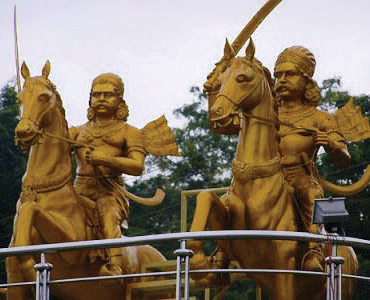

### மருது சகோதரர்கள்

### மருது சகோதரர்களின் கலகம் (1800-1801)

கட்டபொம்மனின் கலகம் 1799இல் ஒடுக்கப்பட்டபோதும், 1800இல் மீண்டும் கலகம் வெடித்தது. பிரிட்டிஷாரின் குறிப்புகளில் இது இரண்டது பாளையக்கார் போர் என்று குறிப்பிடப்படுகிறது. இப்போரானது சிவகங்கையின் மருது பாண்டியர், திண்டுக்கல்லின் கோபால நாயக்கர், மலபாரின் கேரள வர்மா, மைசூரின் கிருஷ்ணப்பா மற்றும் தூண்டாஜி ஆகியோர் அடங்கிய கூட்டமைப்பால் ழிநடத்தப்பட்டது. விருப்பாட்சியில் ஏப்ரல் 1800இல் சந்தித்த அவர்கள் கம்பெனியாருக்கு எதிராகக் கிளர்ந்தெழ முடிவெடுத்தார்கள். கோயம்புத்தூரில் ஜூன் 1800இல் ஏற்பட்ட எழுச்சி அதிவேகமாக இராமநாதபுரத்திற்கும், மதுரைக்கும் பரவியது.

நிலைமையைப் புரிந்துகொண்ட கம்பெனியார் மைசூரின் கிருஷ்ணப்பா மீதும், மலபாரின் கேரளர்மா மீதும் மேலும் சிலர் மீதும் போர் தொடுக்கப்போவதாக அறிவித்தார்கள். கோயம்புத்தூர், சத்தியமங்கலம் மற்றும் தாராபுரம் ஆகிய பகுதிகளின் பாளையக்கார்கள் பிடிக்கப்பட்டு தூக்கிலிடப்பட்டார்கள்.

கட்டபொம்மனின் சகோதரர்களான ஊமைத்துரையும், செவத்தையாவும் பிப்ரி 1801இல் பாளையங்கோட்டைச் சிறையிலிருந்து தப்பி கமுதியில் பதுங்கியிருப்பதை அறிந்த சின்ன மருது அவர்களைத் தமது தலைமையிடமான சிறுவயலுக்கு அழைத்துச் சென்றார். பாஞ்சாலங்குறிச்சி கோட்டை மிக குறைந்த காலத்தில் மீண்டும் கட்டி முடிக்கப்பட்டது. காலின் மெக்காலே தலைமையிலான பிரிட்டிஷ் படைகள் ஏப்ரலில் மீண்டும் கோட்டையை முற்றுகையிட்டதால் அவர்கள் மருது சகோதரர்களிடம் சிவகங்கையில் அடைக்கலம் கோரினர். தப்பியோடியவர்களை (ஊமைத்துரையும், செவத்தையாவும்) ஒப்படைக்கும்படி மருது சகோதரர்கள் லியுறுத்தப்பட்டனர். ஆனால், அவர்கள் மறுத்துவிட்டார்கள். இதையடுத்து கர்னல் அக்னியூவும், கர்னல் இன்னஸும் சிவகங்கையை நோக்கி படைநடத்திச் சென்றனர். மருது சகோதரர்கள் ஜூன் 1801இல் நாட்டின் விடுதலையை முன்னிறுத்திய ஒரு பிரகடனத்தை வெளியிட்டனர் இதுவே ‘திருச்சிராப்பள்ளி பேரறிக்கை’ என்றழைக்கப்படுகிறது.

### 1801ஆம் ஆண்டு பேரறிக்கை (திருச்சிராப்பள்ளி பேரறிக்கை)

பிரிட்டிஷாருக்கு எதிராக மண்டல, சாதி, சமய, இன வேறுபாடுகளைக் கடந்து நிற்பதற்காக முதலில் விடுக்கப்பட்ட அறைகூவலே 1801ஆம் ஆண்டின் பேரறிக்கை ஆகும். இப்பேரறிக்கை திருச்சியில் அமையப்பெற்ற நவாபின் கோட்டையின் முன்சுவரிலும், ஸ்ரீரங்கம் கோவிலின் சுற்றுச் சுவரிலும் ஒட்டப்பட்டது. ஆங்கிலேயருக்கு எதிராகச் செயல்பட விழைந்த தமிழகப் பாளையக்கார்கள் பலரும் ஒன்று திரண்டனர். சின்ன மருது ஏறத்தாழ 20,000 ஆட்களை ஆங்கிலேயர்களுக்கு எதிராகத் திரட்டினார். ங்காளம், சிலோன், மலேயா ஆகிய இடங்களில் நிறுத்தி வைக்கப்பட்டிருந்த பிரிட்டிஷ் படைகள் விரைந்து ந்தன. புதுக்கோட்டை, எட்டையபுரம் மற்றும் தஞ்சாவூரின் அரசர்கள் பிரிட்டிஷாருடன் கைகோர்த்தார்கள். ஆங்கிலேயரின் பிரித்தாளும் கொள்கை என்ற உத்தி விரைவில் பாளையக்கார்களின் படைகளில் பிரிவினையை ஏற்படுத்தியது.

### சிவகங்கையின் வீழ்ச்சி

ஆங்கிலேயர்கள் மே 1801இல் தஞ்சாவூரிலும் திருச்சியிலும் இருந்த கிளர்ச்சியாளர்களைத் தாக்கினார்கள். கிளர்ச்சியாளர்கள் பிரான்மலையிலும், காளையார் கோவிலிலும் தஞ்சம் புகுந்தனர். அவர்கள் பிரிட்டிஷ் படைகளால் மீண்டும் தோற்கடிக்கப்பட்டனர். இறுதியாக லுவான இராணுவமும், சிறப்பான தலைமையும் கொண்ட ஆங்கிலேய கம்பெனியே விஞ்சி நின்றது. கலகம் தோற்றதால் 1801இல் சிவகங்கை இணைக்கப்பட்டது. இராமநாதபுரத்திற்கு அருகே அமைந்துள்ள திருப்பத்தூர் கோட்டையில் 1801 அக்டோபர் 24 அன்று மருது சகோதரர்கள் தூக்கிலிடப்பட்டனர். ஊமைத்துரையும், செவத்தையாவும் பிடிக்கப்பட்டு 1801 நவம்பர் 16இல் பாஞ்சாலங்குறிச்சியில் தலை துண்டிக்கப்பட்டனர். கிளர்ச்சியாளர்களில் 73 பேர் பிடிக்கப்பட்டு மலேயாவின் பினாங்கிற்கு நாடு கடத்தப்பட்டார்கள். பாளையக்கார்கள் வீழ்ச்சியடைந்தாலும் அவர்களது வீரமும், தியாகமும் எதிர்காலச் சந்திகளை ஈர்ப்பதாக அமைந்தது. இதனால் மருது சகோதரர்களின் கலகம் 'தென்னிந்தியப் புரட்சி' என்று அழைக்கப்படுவதோடு தமிழக வரலாற்றில் தனித்துவம் பெற்றதாகவும் கருதப்படுகிறது. கர்நாடக உடன்படிக்கை, 1801

1799 மற்றும் 1800-1801ஆம் ஆண்டு பாளையக்கார்களின் கலகம் அடக்கப்பட்டதன் விளைவு தமிழகத்திலிருந்த அனைத்து உள்ளூர் குடித்தலைமையினரின் எண்ணங்களையும் நீர்த்துப்போகச்செய்தது. 1801 ஜூலை 31இல் ஏற்பட்ட கர்நாடக உடன்படிக்கையின் விதிகளின்படி, பிரிட்டிஷார் நேரடியாக தமிழகத்தின்மீது தங்கள் கட்டுப்பாட்டை ஏற்படுத்தியதோடு பாளையக்கார் முறையும் முடிவுக்கு ந்ததுடன் அனைத்துக் கோட்டைகளும் இடிக்கப்பட்டு அவர்களது படைகளும் கலைக்கப்பட்டன.

### (உ) தீரன் சின்னமலை (1756 -1805)

தீர்த்தகிரி என்று அழைக்கப்பட்ட தீரன் 1756இல் பிறந்தார். அவர் சிலம்பு, வில்வித்தை, குதிரையேற்றம் மட்டுமல்லாமல் நவீன போர் முறைகளையும் கற்றுத் தேர்ந்தார். கொங்குப்பகுதியில் குடும்ப மற்றும் நிலப்பிரச்சனைகளுக்குத் தீர்வு ழங்குதல் போன்ற செயல்களில் ஈடுபட்டுவந்தார். அப்பகுதி மைசூர் சுல்தானின் கட்டுப்பாட்டில் இருந்தது, திப்புவின் திவான் முகம்மது அலி என்பவரால்

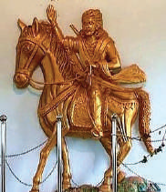

### தீரன் சின்னமலை

ரி சூலிக்கப்பட்டது. ஒரு முறை திவான் சூலிக்கப்பட்ட ரிப்பணத்தோடு மைசூருக்குத் திரும்பிக்கொண்டிருந்த போது, தீர்த்தகிரி அவரை வழிமறித்து வரிப்பணம் முழுவதையும் பறித்துக்கொண்டார். இவர் முகம்மது அலியிடம் சிவமலைக்கும், சென்னிமலைக்கு இடையே இருந்த ‘சின்னமலையே’ ரிப்பணத்தைப் பிடுங்கிக்கொண்டதாக சுல்தானுக்குப் போய்ச் சொல் என்று அறிவுறுத்தினார். அதன் பிறகே ‘தீரன் சின்னமலை’ என்று அவர் அழைக்கப்படலானார். அவமதிப்புக்குள்ளான திவான் சின்னமலையைத் தாக்க படை அனுப்பினார். இருபடைகளும் நொய்யல் ஆற்றங்கரையில் மோதிக்கொண்டன. அதில் சின்னமலையே வெற்றிபெற்றார்.

திப்புவின் இறப்பிற்குப் பிறகு ஒரு கோட்டையை எழுப்பிய தீரன் சின்னமலை அவ்விடத்தைவிட்டு வெளியேறாமல் ஆங்கிலேயரை எதிர்த்துப் போராடினார். எனவேஅவ்விடம் ‘ஓடாநிலை’ என்றழைக்கப்படுகிறது. அவர் பிடிபடாமலிருப்பதற்காக கொரில்லாப் போர் முறைகளைக் கையாண்டார். இறுதியாக அவரையும் அவர் சகோதரர்களையும் கைது செய்த ஆங்கிலேயர்கள் அவர்களை சங்ககிரியில் சிறைவைத்தனர். ஆங்கிலேய ஆட்சியை ஏற்க ற்புறுத்தப்பட்டபோது அவர்கள் அதற்கு இணங்க மறுத்தனர். அதனால் 1805 ஜூலை 31 அன்று சங்ககிரி கோட்டையின் உச்சியில் அவர்கள் தூக்கிலிடப்பட்டனர்.

## 6.3 வேலூர் புரட்சி 1806

தென்தமிழகத்தின் பாளையக்கார்கள் அனைவரையும் ஒடுக்குவதற்கு முன்பாகவேகிழக்கிந்திய கம்பெனி 1792இல் திப்புவோடு ஏற்பட்ட போரின் முடிவில் சேலம் மற்றும் திண்டுக்கல் ருவாய் மாவட்டங்களைப் பெற்றுக்கொண்டது. 1799இல் நடந்த ஆங்கிலேய-மைசூர் போரின் முடிவில் கோயம்புத்தூர் இணைக்கப்பட்டது. 1798ஆம் ஆண்டு தஞ்சாவூரின் அரசர் அப்பகுதியின் இறையாண்மை உரிமையை ஆங்கிலேயருக்கு விட்டுக்கொடுத்து அதே ஆண்டு கப்பம்கட்டும் நிலைக்கும் தள்ளப்பட்டார். கட்டபொம்மன் எதிர்ப்பு (1799), மருது சகோதரர்களின் எதிர்ப்பு (1801) ஆகியவற்றை ஒடுக்கியப் பின்பு, பிரிட்டிஷார் ஆற்காட்டு நவாபைவிசுவாசமற்றவர் என்று குற்றம்சுமத்தி அவர்மீது கட்டாயப்படுத்தி ஓர் ஒப்பந்த்தைத் திணித்தனர். 1801இல் ஏற்பட்ட இவ்வொப்பந்த்தின்படி, ஆற்காட்டு நவாப் வட ஆற்காடு, தென் ஆற்காடு, திருச்சிராப்பள்ளி, மதுரை மற்றும் திருநெல்வேலி ஆகிய மாவட்டங்களை அவற்றை நிர்வகிக்கும் அதிகாரத்தோடு ஒப்படைத்துவிட வேண்டும் என்றானது.

### (அ) இந்திய வீரர்களின் மனக்குறை

ஆனாலும் எதிர்ப்பு அடங்கிவிடவில்லை. வெளியேற்றப்பட்ட சிற்றரசர்களும், நிலச்சுவான்தார்களும் கம்பெனி அரசுக்கு எதிராக எதிர்காலத் திட்டம் குறித்து நிதானமாக சிந்தித்துக்கொண்டே இருந்தார்கள். இதன் விளைவாக வெளிப்பட்டதே 1806ஆம் ஆண்டு வேலூர் புரட்சியாகும். புரட்சியின் இறுதி நிகழ்வு அந்நிய ஆட்சியை தூக்கி எறிவதை நோக்கமாகக் கொண்டிருந்தது. பிரிட்டிஷாரின் இராணுவத்தில் சிப்பாயாகப் பணியாற்றியவர்களுக்கு குறைவான ஊதியமே வழங்கப்பட்டது. பதவி உயர்வுக்கான வாய்ப்புகள் குறைவாகவே இருப்பது ஆகியவற்றை நினைத்து கடுமையான கோபத்துடனேபணியாற்றிக் கொண்டிருந்தார்கள். தங்களின் சமூக மற்றும் சமய நம்பிக்கைகளுக்கு ஆங்கிலேய அதிகாரிகள் குறைவான மதிப்பளித்ததும், மேலும் அவர்களின் கோபத்தை வலுப்படுத்தியது. விவசாயப் பின்னணிகொண்ட வீரர்களின் வேளாண் சிக்கலும் அவர்களை மேலும் சிரமப்படுத்தியது. சோதனை அடிப்படையில் நடைமுறைப்படுத்தபட்ட நிலக்குத்தகை முறையில் ஒரு நிலையற்றதன்மைக் காணப்பட்டதாலும் 1805இல் பஞ்சம் ஏற்பட்டதாலும் பல சிப்பாய்களின் குடும்பங்கள் கடும் பொருளாதார நெருக்கடியைச் சந்தித்தன. திப்புவின் மகன்களும் அவர்தம் குடும்பத்தினரும் வேலூர் கோட்டையில் சிறைவைக்கப்பட்ட வேளையில் தங்கள் அதிருப்தியை வெளிப்படுத்தும் அந்த வாய்ப்பு கூடிவந்தது. புரட்சி ஏற்படுவதற்கான இயக்க சக்தியாக தலைமைத்தளபதி (Commander-in- Chief) சர் ஜான் கிரடாக் வெளியிட்ட புதிய இராணுவிதிமுறை அமைந்தது.

புதிய விதிமுறைகளின்படி, இந்திய வீரர்கள் சீருடையிலிருக்கும்போது சாதி அடையாளங்களையோ, காதணிகளையோ அணியக்கூடாது என்று கேட்டுக்கொள்ளப்பட்டனர். அவர்கள் தாடையை முழுமையாகச் சவரம் செய்யவும் மீசையை ஒரே பாணியில் வைத்துக்கொள்ளவும் அறிவுறுத்தப்பட்டார்கள். புதிய வகை தலைப்பாகை எரிகிற தீயில் எண்ணெய் சேர்ப்பது போலானது. மிகவும் ஆட்சேபனைக்குரிய செயலாகக் கருதப்பட்டது. தலைப்பாகையில் வைக்கப்படும் விலங்கு தோலினால் ஆன இலட்சினையாகும். புதிய தலைப்பாகையை அணிவதில் தங்களுக்கு உடன்பாடில்லை என்று இந்திய சிப்பாய்கள் போதுமான முன்னெச்சரிக்கை விடுத்தனர். ஆனால், கம்பெனி நிருவாகம் அதனை கவனத்தில் கொள்ளவில்லை.

### (ஆ) புரட்சி வெடித்தல்

1806 ஜூலை 10 அன்று அதிகாலையிலேயே முதல் மற்றும் இருபத்தி மூன்றாம் படைப்பிரிவுகளின் இந்திய சிப்பாய்கள் துப்பாக்கிகளின் முழக்கத்தோடு புரட்சியில் இறங்கினர். கோட்டைக் காவற்படையின் உயர் பொறுப்புவகித்த கர்னல் பேன்கோர்ட் என்பர்தான் முதல் பலியானார். அடுத்ததாக இருபத்தி மூன்றாம் படைப்பிரிவைச் சேர்ந்தகர்னல் மீக்காரஸ் கொல்லப்பட்டார். கோட்டையைக் கடந்து சென்றுகொண்டிருந்த மேஜர் ஆர்ம்ஸ்டட்ராங் துப்பாக்கிகளின் முழக்கத்தைக் கேட்டார். சூழலை விசாரித்தறிய முற்பட்ட அவரது உடல் தோட்டாக்களால் துளைக்கப்பட்டது. ஏறத்தாழ பன்னிரண்டுக்கும் அதிகமான அதிகாரிகள் அடுத்த ஒரு மணிநேரத்துக்குள் கொல்லப்பட்டார்கள். அவர்களில் லெப்டினென்ட் எல்லியும், லெப்டினென்ட் பாப்ஹாமும் பிரிட்டிஷ் மன்னரின் படைப்பிரிவைச் (Battalion) சேர்ந்ர்களார்.

### ஜில்லஸ்பியின் கொடுங்கோன்மை

கோட்டைக்கு வெளியேயிருந்த மேஜர் கூட்ஸ் ஆற்காட்டின் குதிரைப்படைத் தளபதியாக இருந்த கர்னல் ஜில்லஸ்பிக்கு தகவல் கொடுத்தார். கேப்டன் யங்கின் தலைமையிலான குதிரைப் படைப்பிரிவுடன் காலை 9 மணியளவில் கர்னல் ஜில்லஸ்பி கோட்டையை ந்தடைந்தார். இதற்கிடையே புரட்சிக்கார்கள் திப்புவின் மூத்த மகனான ஃபதே ஹைதரை புதிய மன்னராகப் பிரகடனம் செய்து மைசூர் சுல்தானின் புலி கொடியை கோட்டையில் ஏற்றியிருந்தனர். போர்விதிமுறைகள் எதையும் பொருட்படுத்தாத ஜில்லஸ்பி வீரர்களின் புரட்சியை வன்மையாக ஒடுக்கினார். நேரில் கண்ட ஒருவரின் வாக்குமூலப்படி, கோட்டையில் மட்டும் எண்ணூறு வீரர்கள் பிணமாகக் கிடந்ததாகப் பதிவு செய்யப்பட்டுள்ளது. திருச்சிராப்பள்ளியிலும், வேலூரிலும் அறுநூறு வீரர்கள் விசாரணையை எதிர்நோக்கி சிறையிலடைக்கப்பட்டார்கள்.

### இ) புரட்சியின் பின்விளைவுகள்

நீதிமன்ற விசாரணைக்குப்பின் குற்றவாளிகள் என்று நிரூபிக்கப்பட்ட ஆறு நபர்கள் பீரங்கியில் கட்டியநிலையில் சுடப்பட்டும், ஐந்து நபர்கள் துப்பாக்கியால் சுடப்பட்டும், எட்டு நபர்கள் தூக்கிலிடப்பட்டும் கொல்லப்பட்டார்கள். திப்புவின் மகன்களை கல்கத்தாவுக்கு அனுப்ப உத்தரவிடப்பட்டது. கலவரத்தை அடக்குவதில் ஈடுபட்ட அதிகாரிகளுக்குப் பரிசுத்தொகையும் பதவிஉயர்வும் வழங்கப்பட்டது. கர்னல் ஜில்லஸ்பிக்கு 7,000 பகோடாக்கள் வெகுமதியாக அளிக்கப்பட்டது. எனினும் தலைமைத் தளபதி ஜான் கிரடாக்கும், உதவித்

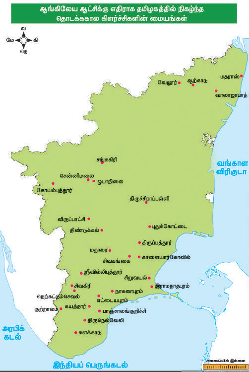

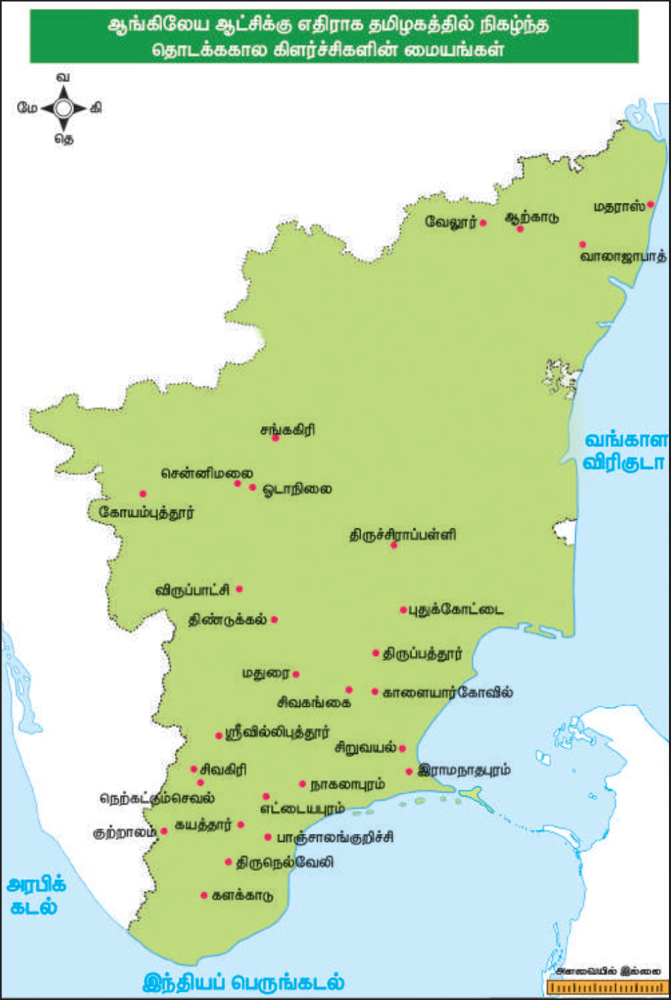

தளபதி (Adjutant General) அக்னியூவும், ஆளுநர் வில்லியம் பெண்டிங்கும் புரட்சி நடக்கக் காரணமானவர்கள் என்று கருதப்பட்டு அவர்களைப் பணிநீக்கம் செய்ததோடு, அர்கள் இங்கிலாந்துக்கு திருப்பியழைத்துக் கொள்ளப்பட்டார்கள். புதிய இராணுவ விதிமுறைகள் திரும்பப் பெறப்பட்டது.

### ஈ) புரட்சியைப் பற்றிய மதிப்பீடு

வெளியிலிருந்து உடனடியாக எந்தவொரு உதவியும் கிடைக்காத காரணத்தினாலேயே வேலூர் புரட்சி தோல்வியுற்றது. சமீபகால ஆய்வுகளின் வழியாக நாம் அறிந்துகொள்வது யாதெனில் புரட்சிக்கான ஏற்பாடுகளை 23ஆம் படைப்பிரிவின் 2ஆவது பட்டாளத்தைச் சேர்ந்தசுபேதார்களான ஷேக் ஆடமும், ஷேக் ஹமீதும்,

### பாடச்சுருக்கம்

- தமிழ்நாட்டினுடைய முக்கியமானப் பாளையக்கார்களைப் பற்றியும், அவர்கள் கிழக்கிந்திய கம்பெனியின் அதிகாரத்தை எதிர்த்துநின்று ஆற்றிய தீரச்செயல்கள் பற்றியும் விவாதிக்கப்பட்டுள்ளது.

- பூலித்தேவர், வேலுநாச்சியார், வீரபாண்டிய கட்டபொம்மன், ஆகியோரைத் தொடர்ந்து சிவகங்கையின் மருது சகோதரர்கள் மற்றும் தீரன் சின்னமலை ஆகியோர் பிரிட்டிஷாருக்கு எதிராகத் தொடுத்த போர்கள் பற்றியும் விளக்கமாகக் கூறப்பட்டுள்ளது.

- வேலூர் புரட்சிக்கான காரணங்கள் மற்றும் அது ஜில்லஸ்பியால் எவ்வாறு இரக்கமின்றி ஒடுக்கப்பட்டது என்ற தகவல்கள் விவரிக்கப்பட்டுள்ளன.

### கலைச்சொற்கள்

| பிறர் ஆதரவில் இருப்பர் | protege | dependent, a person who receives support from a patron |
|---|---|---|
| செல்வாக்கை வளர்த்தல், ஆக்கிரமிப்பு செய்தல் | aggrandisement | the act of elevating or raising one’s wealth, prestige and power |
| பணிய மறுக்கும் | defiant | resisting, disobedient |
| அமைதி | tranquillity | harmony, peace, free from disturbances |
| ஞ்சித்தல் | treachery | disloyalty, betrayal, breach of trust |
| பயமற்ற, துணிவுமிக்க | audacious | daring, fearless |
| இறுதி எச்சரிக்கை | ultimatum | a final dominating demand |
| கொடை | bounty | payment or reward – something given liberally |
| தொப்பியை அணிசெய்யும் குஞ்சம் | cockade | an ornament, especially a knot of ribbon worn on the hat |
| கவனம் | cognisance | notice, having knowledge of |
| தோற்கடி | trounce | crush, defeat |
| சிறைப்படுத்தல் | interned | imprisoned |

ஜமேதாரான ஷேக் ஹுஸைனும், 1ஆம் படைப்பிரிவின் 1ஆம் பட்டாளத்தைச் சேர்ந்தஇரு சுபேதார்களும், ஜமேதார் ஷேக் காஸிமும் சிறப்பாகச் செய்திருந்ததாகத் தெரிகிறது. 1857ஆம் ஆண்டு பெரும்கலகத்திற்கான அனைத்து முன்அறிகுறிகளையும், எச்சரிக்கைகளையும் வேலூர் புரட்சி கொண்டிருந்தது. ஒரே வித்தியாசம் என்னவென்றால், கலகத்தைத் தொடர்ந்து எந்த உள்நாட்டுக் கிளர்ச்சியும் ஏற்படவில்லை. 1806ஆம் ஆண்டு புரட்சியானது வேலூர் கோட்டையுடன் முடிந்துவிடவில்லை. பெல்லாரி, வாலாஜாபாத், ஹைதராபாத், பெங்களூரு, நந்திதுர்க்கம், சங்கரிதுர்க்கம் ஆகிய இடங்களிலும் எதிரொலித்தது.

### பயிற்சி

### I சரியான விடையைத்

### தெரிவு செய்யவும்

1. கிழக்கிந்திய கம்பெனியின் நாடுபிடிக்கும் ஆசையை எதிர்த்து நின்ற முதல் பாளையக்கார் யார்?

அ) மருது சகோதரர்கள் ஆ) பூலித்தேவர் இ) வேலுநாச்சியார் ஈ) வீரபாண்டிய கட்டபொம்மன்

2. சந்தா சாகிப்பின் மூன்று முகவர்களோடும் நெருங்கிய நட்பினை ஏற்படுத்திக் கொண்டர் யார்?

அ) வேலுநாச்சியார் ஆ) கட்டபொம்மன் இ) பூலித்தேவர் ஈ) ஊமைத்துரை

3. சிவசுப்ரமணியனார் எங்கு தூக்கிலிடப்பட்டார்?

அ) கயத்தாறு ஆ) நாகலாபுரம் இ) விருப்பாட்சி ஈ) பாஞ்சாலங்குறிச்சி

4. திருச்சிராப்பள்ளி பேரறிக்கையை வெளியிட்டர் யார்?

அ) மருது சகோதரர்கள் ஆ) பூலித்தேவர் இ) வீரபாண்டிய கட்டபொம்மன் ஈ) கோபால நாயக்கர்

5. வேலூர் புரட்சி எப்போது வெடித்தது?

அ) 1805 மே 24 ஆ) 1805 ஜூலை 10 இ) 1806 ஜூலை 10 ஈ) 1806 செப்டம்பர் 10

6. வேலூர் கோட்டையில் புதிய இராணுவிதிமுறைகளை அறிமுகப்படுத்தக் காரணமாயிருந்த தலைமை தளபதி யார்?

அ) கர்னல் பேன்கோர்ட் ஆ) மேஜர் ஆர்ம்ஸ்டட்ராங் இ) சர் ஜான் கிரடாக் ஈ) கர்னல் அக்னியூ

7. வேலூர் புரட்சிக்குப் பின் திப்பு சுல்தானின் மகன்கள் எங்கு அனுப்பப்பட்டார்கள்?

அ) கல்கத்தா ஆ) மும்பை இ) டெல்லி ஈ) மைசூர்

### II கோடிட்ட இடங்களை நிரப்புக

1. பாளையக்கார் முறை தமிழகத்தில் என்பவரால் அறிமுகப்படுத்தப்பட்டது.

2. வேலுநாச்சியாரும் அவரது மகளும் எட்டாண்டுகளாக பாதுகாப்பில் இருந்தனர்.

3. கட்டபொம்மனை சரணடையக் கோரும் தகவலைத் தெரிவிக்க பானெர்மென் என்பவரை அனுப்பிவைத்தார்.

4. கட்டபொம்மன் என்ற இடத்தில் தூக்கிலிடப்பட்டார்.

5. மருது சகோதரர்களின் புரட்சி பிரிட்டிஷ் குறிப்புகளில் என்று வகைப்படுத்தப்பட்டுள்ளது.

6. என்பர் புரட்சிக்கார்களால் வேலூர் கோட்டையின் புதிய சுல்தானாக அறிவிக்கப்பட்டார்.

### III சரியான கூற்றைத் தேர்வு செய்யவும்

1. (i) பாளையக்கார் முறை காகதீயப் பேரரசின் நடைமுறையில் இருந்தது

(ii) கான் சாகிப்பின் இறப்பிற்குப்பின் பூலித்தேவர் நெற்கட்டும்செவலை 1764இல் மீண்டும் கைப்பற்றினார்.

(iii) கம்பெனி நிருவாகத்திற்கு தகவல் அளிக்காமல் பாளையக்கார்களோடு பேச்சுவார்த்தையில் ஈடுபட்டதால் யூசுப் கான் துரோகி என்று குற்றம் சுமத்தப்பட்டு 1764இல் தூக்கிலிடப்பட்டார்.

(iv) ஒண்டிவீரன் கட்டபொம்மனின் படைப்பிரிவுகளில் ஒன்றைத் தலைமையேற்று வழிநடத்தினார்.

அ) (i), (ii) மற்றும் (iv) ஆகியவை சரி ஆ) (i), (ii) மற்றும் (iii) ஆகியவை சரி இ) (iii) மற்றும் (iv) மட்டும் சரி ஈ) (i) மற்றும் (iv) மட்டும் சரி

2. (i) கர்னல் கேம்ப்பெல் தலைமையின் கீழ் ஆங்கிலேயப் படைகள் மாபூஸ்கானின் படைகளோடு இணைந்து சென்றன.

(ii) காளையார்கோவில் போரில் முத்துவடுகநாதர் கொல்லப்பட்டப் பின் வேலுநாச்சியார் மீண்டும் அரியணையைப் பெறுவதற்கு மருது சகோதரர்கள் துணைபுரிந்தனர்.

(iii) திண்டுக்கல் கூட்டமைப்புக்கு கோபால நாயக்கர் தலைமையேற்று ழிநடத்தினார்.

(iv) காரன்வாலிஸ் மே 1799இல் கம்பெனிப் படைகளை திருநெல்வேலி நோக்கிச் செல்ல உத்தரவிட்டார்.

அ) (i) மற்றும் (ii) ஆகியவை சரி ஆ) (ii) மற்றும் (iii) ஆகியவை சரி இ) (ii), (iii) மற்றும் (iv) ஆகியவை சரி ஈ) (i) மற்றும் (iv) ஆகியவை சரி

3. கூற்று: பூலித்தேவர், ஹைதர் அலி மற்றும் பிரெஞ்சுக்கார்களின் உதவியைப் பெற முயன்றார்.

காரணம்: மராத்தியர்களோடு ஏற்கனவேதொடர் போர்களில் ஈடுபட்டுக் கொண்டிருந்ததால் ஹைதர் அலியால் பூலித்தேவருக்கு உதவ முடியாமல் போனது.

அ) கூற்று மற்றும் காரணம் ஆகியவை சரி எனினும் காரணம், கூற்றைச் சரியாக விளக்கவில்லை.

ஆ) கூற்று மற்றும் காரணம் ஆகிய இரண்டுமே தவறானவை.

இ) கூற்று மற்றும் காரணம் ஆகியவை சரி காரணம், கூற்றைச் சரியாகவேவிளக்குகிறது.

ஈ) கூற்று தவறானது காரணம் சரியானது

### IV பொருத்துக

1. தீர்த்தகிரி - வேலூர் புரட்சி

2. கோபால நாயக்கர் - இராமலிங்கனார்

3. பானெர்மென் - திண்டுக்கல்

4. சுபேதார் ஷேக் ஆதம் - ஓடாநிலை

### V சுருக்கமாக விடையளிக்கவும்

1. பாளையக்கார்களின் கடமைகள் யாவை?

2. கிழக்கு மற்றும் மேற்கில் அமையப்பெற்ற பாளையங்களைக் கண்டறிந்து எழுதுக.

3. களக்காடு போரின் முக்கியத்துவம் யாது?

4. கம்பெனியாருக்கும் கட்டபொம்மனுக்கும் இடையேசர்ச்சை ஏற்படக் காரணமாக விளங்கியது எது?

5. திருச்சிராப்பள்ளி பேரறிக்கையின் (1801) முக்கியக் கூறுகளைத் தருக.

### VI விரிவாக விடையளிக்கவும்

1. கிழக்கிந்திய கம்பெனியாரை எதிர்த்து கட்டபொம்மன் நடத்திய வீரதீரப் போர்கள் பற்றி ஒரு கட்டுரை வரைக

2. சிவகங்கையின் துன்பகரமான வீழ்ச்சிக்குக் காரணமானவற்றை ஆய்ந்து அதன் விளைவுகளை எடுத்தியம்புக.

3. வேலூரில் 1806இல் வெடித்த புரட்சியின் கூறுகளை விளக்குக.

### VII செயல்பாடுகள்

1. ஆசிரியர் மாணாக்கர்களை ஆங்கிலேய ஆட்சிக்கு எதிராகப் புரட்சியில் ஈடுபட்ட ஆரம்பகால தேசபக்த தலைவர்களின் படங்களை சேகரிக்கச் சொல்லாம். அவர்களது கற்பனைத்திறனைக் கொண்டு அத்தலைர்கள் உயிர்நீத்த போர்க்களத்தைப் படமாக வரையச் சொல்லாம்.

2. மாணவர்கள் ஜாக்சனுக்கும், கட்டபொம்மனுக்குமிடையேநடந்த உரையாடலை நாடக வடிவில் ஆசிரியரின் ழிகாட்டுதலோடு அரங்கேற்றலாம்.

### மேற்கோள் நூல்கள்

1. Burton Stein, Peasant State and Society in Medieval South India, New Delhi:Oxford University Press, 1980.

2. P.M. Lalitha, Palayakararss as Feudatories Under the Nayaks of Madurai, Chennai: Creative Enterprises, 2015.

3. K. Rajayyan, South Indian Rebellion, 1800–1801, Madurai, Ratna Publication, 2000 (Reprint).

4. K.A. Manikumar, Vellore Revolt 1806 (Chennai: Allied Publishers, 2007).

மேலும் வாசிக்கத்தக்க நூல்டாக்டர். கே.கே. பிள்ளை, தமிழக வரலாறு - மக்களும் பண்பாடும், தமிழ்நாடு பாடநூல் மற்றும் கல்வியியல் பணிகள் கழகம், சென்னை (ஆவணப் பதிப்பு: ஆகஸ்ட் - 2017)

