# பொருளியல் அலகு 3: உணவுப் பாதுகாப்பு மற்றும் ஊட்டச்சத்து

## கற்றலின் நோக்கங்கள்

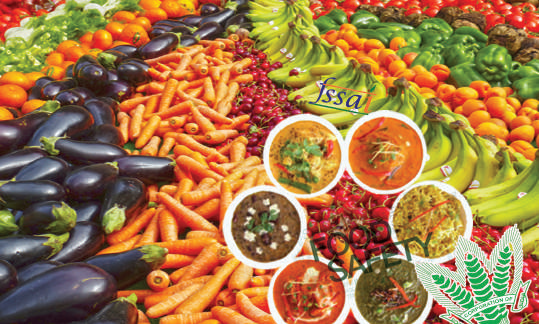

உணவுப் பாதுகாப்பின் வரையறை, பொருள் பற்றி படித்தல்உணவு தானியங்கள் கிடைத்தல் மற்றும் அணுகுதல் பற்றி அறிந்து கொள்ளுதல்வாங்கும் திறன் மற்றும் விவசாயக் கொள்கை பற்றி புரிந்து கொள்ளுதல்வறுமையின் பல பரிமாணத்தன்மை பற்றிய அறிவைப் பெறுதல்தமிழ்நாட்டில் ஊட்டச்சத்து, சுகாதார நிலை மற்றும் கொள்கைகள் பற்றி படித்தல்

## அறிமுகம்

மக்கள் வாழ்க்கையையும் வளர்ச்சியையும் பராமரிப்பதற்காக உண்ணுதல் மற்றும் பருகுதலுக்குப் பயன்படும் எந்த ஒரு பொருளும் உணவு என வரையறுக்கப்படுகிறது. உணவுப் பாதுகாப்பு என்பது ஒரு நபர் போதுமான அளவு சாப்பிடுவதையும் சுறுசுறுப்பாக இருப்பதையும் ஆரோக்கியமான வாழ்க்கை நடத்துவதையும் குறிக்கும்.

## 3.1 உணவுப் பாதுகாப்பு

ஐக்கிய நாடுகளின் உணவு மற்றும் வேளாண் அமைப்பு உணவுப் பாதுகாப்பினைப் பின்வருமாறு வரையறுக்கிறது.

"எல்லா மக்களும், எல்லா நேரங்களிலும், போதுமான, பாதுகாப்பான மற்றும் சத்தான உணவுக்கான உடல், சமூக மற்றும் பொருளாதார அணுகுமுறையை கொண்டிருக்கும் போது, அவர்களின் உணவுத் தேவைகளையும், சுறுசுறுப்பான மற்றும் ஆரோக்கியமான வாழ்க்கைக்கான உணவு விருப்பங்களையும் பூர்த்தி செய்வதில் உணவுப் பாதுகாப்பு இருக்கிறது." (FAO, 2009).

இந்த விரிவான வரையறை உணவு சத்துமிக்கதாக இருக்க வேண்டியதன் அவசியத்தை உணர்த்துவதோடு, அது பாதுகாப்புமிக்க ஊட்டச்சத்தினைப் பெற வேறு சில அம்சங்கள் தேவைப்படுவதையும் உணர்த்துகின்றது.

புகழ்மிக்க இந்திய வேளாண்மை விஞ்ஞானி முனைவர் எம்.எஸ். சுவாமிநாதனின் கருத்துப்படி, “சரிவிகித உணவு, பாதுகாப்பான குடிநீர், சுற்றுச்சூழல், சுகாதாரம், ஆரம்ப சுகாதார பராமரிப்பு மற்றும் ஆரம்பக் கல்வி ஆகியவற்றிற்கான உடல், பொருளாதார மற்றும் சமூக அணுகல்” என்பது ஊட்டச்சத்து பாதுகாப்பாகும்.

### உணவின் அடிப்படைக் கூறுகள் மற்றும்

### ஊட்டச்சத்து பாதுகாப்பு

உணவு மற்றும் ஊட்டச்சத்து பாதுகாப்பின் மூன்று அடிப்படைக் கூறுகள் : உணவு இருப்பு, அணுகல் மற்றும் உட்கொள்ளுதல் ஆகும்.

1. உணவு இருப்பு என்பது தேவையான அளவுகளில் உணவுப் பொருள்கள் சேமிப்பைக் குறிக்கும். இது உள்நாட்டு உற்பத்தி, இருப்பு மற்றும் இறக்குமதியில் மாற்றங்கள் பற்றிய ஒரு செயல்பாடாகும்.

2. உணவுக்கான அணுகல் என்பது முதன்மையாக வாங்கும் திறன் பற்றிய கூற்றாகும். எனவே , இது ஈட்டுதலுக்கான திறன்கள் மற்றும் வேலைவாய்ப்புகளுடன் நெருக்கமாக இணைக்கப்பட்டுள்ளது. திறன்களும், வாய்ப்புகளும் ஒருவரின் சொத்துகள் மற்றும் கல்வியுடன் தொடர்புடையது.

3. உணவினை உட்கொள்ளுதல் என்பது உட்கொள்ளும் உணவை உயிரியல் ரீதியாகப் பயன்படுத்துவதற்கான திறன் ஆகும்.

## 3.2 உணவு தானியங்களின் இருப்பு மற்றும் அணுகல்

ஒரு நாட்டில் உள்ள மக்களுக்கான உணவுப் பாதுகாப்பு என்பது கிடைக்கும் உணவின் அளவைப் பொறுத்தது மட்டுமல்லாமல், உணவுப் பொருள்களை வாங்க / அணுக மற்றும் ஆரோக்கியமான சூழலில் வாழ்வதற்கான மக்களின் திறனையும் சார்ந்துள்ளது. பிற வளர்ச்சியைப் போலவே , மக்களின் உணவுப் பாதுகாப்பும் ஒரு நாட்டின் ஒட்டு மொத்த வளர்ச்சி செயல்முறையுடன் தொடர்புடையது. சுதந்திரத்திற்கு பிறகு, இந்தியா ஒரு திட்டமிட்ட வளர்ச்சியினை பின்பற்ற முடிவு செய்தது.

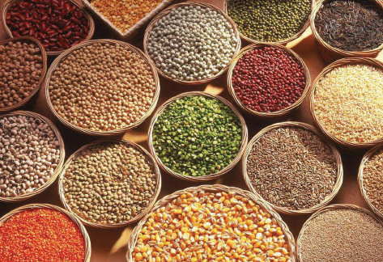

உணவு தானியங்கள்தொடக்ககாலத்தில் வேளாண்மையில் கவனம் செலுத்திய பின்னர், தொழில்மயமாக்கலுக்கு முன்னுரிமை அளிக்கப்பட்டது. இந்தியாவில் ஏற்பட்ட தொடர்ச்சியான வறட்சி, உணவு தானியங்களின் இறக்குமதியைச் சார்ந்திருக்க தள்ளப்பட்டது. இருப்பினும், அப்பொழுது இருந்த அந்நிய செலாவணி இருப்பானது, திறந்த சந்தைக் கொள்முதல் மற்றும் தானியங்களின் இறக்குமதிக்கு அனுமதிக்கவில்லை. பணக்கார நாடுகளிலிருந்து உணவு தானியங்களை சலுகை விலையில் இந்தியா கோர வேண்டியிருந்தது. 1960 களின் முற்பகுதியில் அமெரிக்கா தனது பொதுச் சட்டம் 480 (P.L. 480) திட்டத்தின் மூலம் இந்தியாவுக்கு உதவி செய்தது.

அதிக மக்கள் தொகையைக் கொண்ட வளர்ந்து வரும் ஒரு நாடு புரட்சிக்கு சாத்தியமான தேர்வாளராக கருதப்பட்டது. எனவே , அமெரிக்க நிருவாகம் மற்றும் ஃபோர்டு அறக்கட்டளை போன்ற மனிதநேய அமைப்புகள் உணவு உற்பத்தியை அதிகரிக்க கோதுமை மற்றும் அரிசியின் உயர் ரக விளைச்சல் வகைகளுக்கான (High Yielding Varieties) திட்டத்தை வகுத்து அறிமுகப்படுத்தியது. இந்த் திட்டம் நீர்ப்பாசனம் வசதியுள்ள இடங்களில் இருக்கும் இடத்தில், தேர்ந்தெடுக்கப்பட்ட மாவட்டங்களில் செயல்படுத்தப்பட்டது. திட்டங்களின் முடிவுகள் உறுதி செய்யப்பட்டதால், அதிக எண்ணிக்கையிலான மாவட்டங்களை உள்ளடக்கும் வகையில் இந்த் திட்டம் நீட்டிக்கப்பட்டது.

இவ்வாறு, பசுமைப்புரட்சியானது நாட்டில் தோன்றி உணவு தானிய உற்பத்தியில் தன்னிறைவு பெறவழிவகுத்தது. உயர் ரக விதைகளான (HYV) அரிசி மற்றும் கோதுமை போன்ற உணவு தானியங்கள் பயிரிடப்பட்ட பகுதியில் உற்பத்தியை அதிகரித்தது. மேலும், முக்கிய தானியப் பயிர்களின் விளைச்சலும் அதிகரித்தது. 1950களின் முற்பகுதியில் உணவு தானியங்களின் உற்பத்திப் பரப்பளவு 98 மில்லியன் ஹெக்டேர்களுக்கும் அதிகமாக இருந்தது. ஆனால், நாடு 54 மில்லியன் டன் உணவு தானியங்களை மட்டுமே உற்பத்தி செய்து கொண்டிருந்து. அப்போது சராசரியாக ஒரு ஹெக்டேருக்கு 547 கிலோ உணவு தானியங்கள் கிடைத்தன. உணவு நிலையை சீர் செய்ய ஏறத்தாழ 65 ஆண்டுகள் ஆனது. பின் உணவு தானிய சாகுபடியின் பரப்பளவு 122 மில்லியன் ஹெக்டேராக வளர்ந்து, உற்பத்தி ஐந்து மடங்காக அதிகரித்தது. சுதந்திர காலத்திற்கும் தற்போதைக்கும் இடையில் உணவு தானியங்களின் விளைச்சல் நான்கு மடங்காக அதிகரித்துள்ளது.

உணவு தானிய உற்பத்தியில் இந்த வளர்ச்சியானது ஒரு தொகுப்பாக செயல்படுத்தப்பட்ட HYV திட்டத்தால் சாத்தியமானது. மேலும், இத்திட்டம் ஏற்புத்தன்மையுடைய உரங்கள், அதிக விளைச்சல் தரும் நெல் மற்றும் கோதுமை வகைகளை அறிமுகப்படுத்துவதைத் தவிர, மானிய விலையில் ரசாயன உரங்கள் கிடைப்பதை உறுதி செய்தது. கூட்டுறவு வங்கிகள் மற்றும் கூட்டுறவு சங்கங்கள் மூலம் விவசாயிகளுக்கு மலிவான பண்ணைக் கடன் வழங்கப்பட்டது.

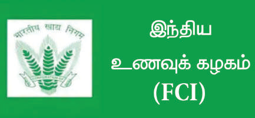

பயிர்களுக்கு குறைந்தபட்ச ஆதரவு விலை (Minimum Support Price) பருவ காலத்தின் தொடக்கத்தில் அறிவிக்கப்பட்டு, அறுவடை செய்யப்பட்ட தானியங்களை இந்திய உணவுக் கழகம் மூலம் அரசு கொள்முதல் செய்கிறது. இந்திய உணவுக் கழகம் மிகப் பெரிய சேமிப்புக் கிடங்கினை அமைத்து அறுவடை காலத்தில் உணவு தானியங்களைப் பெற்று இருப்பில் வைத்து அதனை ஆண்டு முழுவதும் வழங்குகிறது.

உணவு தானிய உற்பத்தியின் விரைவான அதிகரிப்புடன் பால், கோழி மற்றும் மீன் உற்பத்தியில் பொருத்தமான தொழில்நுட்பங்களைப் பயன்படுத்தியதன் விளைவாக, சுதந்திரத்திற்கும் 2000 ஆண்டின் இடைப் பட்ட காலத்தில் நாட்டில் பால் உற்பத்தி 8 மடங்கு, முட்டை உற்பத்தி 40 மடங்கு மற்றும் மீன் உற்பத்தி 13 மடங்கு அதிகரித்துள்ளது. இருப்பினும், இந்தியா பருப்பு வகைகள் மற்றும் எண்ணெய் வித்துகளின் உற்பத்தியில் தன்னிறைவு பெறுவதில் வெற்றி பெறவில்லை. எனவே , இந்தியா மக்களின் தேவைகளைப் பூர்த்தி செய்ய இறக்குமதியை நம்பியுள்ளது.

குறைந்தபட்ச ஆதரவு விலை (Minimum Support Price)

குறைந்தபட்ச ஆதரவு விலை என்பது அந்த பயிரின் சாகுபடியில் பல்வேறு செலவுகளை கருத்தில் கொண்டு ஒரு குறிப்பிட்ட பயிருக்கு ஒரு விலை, நிபுணர் குழுவால் நிர்ணயிக்கப்படுகிறது. குறைந்தபட்ச ஆதரவு விலை அறிவித்த பின்னர், இந்த பயிர்கள் பரவலாக பயிரிடப்படும் இடங்களில் அரசு கொள்முதல் மையங்களைத் திறக்கும். எனினும், அந்த விவசாயிகள் தங்கள் பயிர், விளை பொருள்களுக்கு நல்ல விலையைப் பெற்றால் திறந்தவெளிச் சந்தையில் விற்கஇயலும். மறுபுறம், திறந்தவெளிச் சந்தையில் விலை குறைந்தபட்ச ஆதரவு விலையை விட குறைவாக இருந்தால், விவசாயிகள் தங்கள் விளைபொருள்களை குறைந்தபட்ச ஆதரவு விலைக்கு விற்பதன் மூலம் உறுதிப்படுத்தப்பட்ட விலையைப் (MSP) பெறுவார்கள்.

### பொது வழங்கல் முறை (Public Distribution System)

தமிழ்நாடு “உலகளாவிய பொது வழங்கல் முறை”யை (Universal PDS) ஏற்றுக் கொண்டது. ஆனால், இந்தியாவில் உள்ள மற்ற மாநிலங்களில் “இலக்கு பொது வழங்கல் முறை” (Targeted PDS) செயல்பாட்டில் இருந்தது. உலகளாவிய பொது வழங்கல் முறையின் கீழ் குடும்ப உணவு பொருள் வழங்கல் அட்டை பெற்றிருப்பவர்கள் அனைவருக்கும் பொது வழங்கல் முறை மூலம் உணவுப் பொருள்கள் வழங்கப்படுகிறது. ஆனால், இலக்கு பொது வழங்கல் முறையில் பயனாளிகள் சில அளவுகோல்களின் அடிப்படையில் அடையாளம் காணப்பட்டு உரிமைகள் வழங்கப்படுகிறது, மத்திய மற்றும் மாநில அரசாங்கங்கள் பொது வழங்கல் முறை மூலம் வழங்கப்படும் பொருள்களுக்கு மானியம் அளிக்கின்றன. மானியத்தின் நிலை மற்றும் அளவு மாநிலங்களுக்கு இடையே வேறுபடுகிறது.

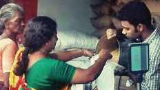

### பொது வழங்கல் முறை

தேசிய உணவுப் பாதுகாப்புச் சட்டம் (National Food Security Act) இந்திய நாடாளுமன்றத்தால் 2013இல் நிறைவேற்றப்பட்டது. இச்சட்டம் 50% நகர்ப்புற குடும்பங்களையும் 75% கிராமப்புற குடும்பங்களையும் உள்ளடக்கியதாகும். இந்த குடும்பங்கள் ஒரு குறிப்பிட்ட அளவுகோலின் அடிப்படையில் அடையாளம் காணப்பட்டு முன்னுரிமைக் குடும்பங்கள் (Priority Households) என அழைக்கப்படுகின்றன.

### தமிழ்நாட்டில் தேசிய உணவுப் பாதுகாப்புச் சட்டம்

இந்தியாவில் தேசிய உணவுப் பாதுகாப்புச் சட்டம் தொடங்கி மூன்று ஆண்டுகளுக்குப் பின்னர், இச்சட்டம் தமிழ்நாட்டில் நவம்பர் 1, 2016 அன்று தொடங்கப்பட்டது.

### உணவுப் பாதுகாப்பில் நுகர்வோர் கூட்டுறவின் பங்கு

பொதுவாக மக்களுக்கு குறைவான விலையில் தரமான பொருள்களை வழங்குவதில் நுகர்வோர் கூட்டுறவு முக்கியப் பங்கு வகிக்கிறது. இந்தியாவில் மூன்று அடுக்கு அமைப்புகளில் நுகர்வோர் கூட்டுறவு சங்கங்கள் அமைக்கப்பட்டுள்ளன. அவை, முதன்மை நுகர்வோர் கூட்டுறவு சங்கங்கள், மத்திய நுகர்வோர் கூட்டுறவுக் கடைகள் மற்றும் மாநில அளவிலான நுகர்வோர் கூட்டமைப்புகள் ஆகும். கிராமப்புறங்களில் நுகர்வோர் பொருள்களை வழங்குவதில் 50,000க்கும் மேற்பட்ட கிராம அளவிலான சங்கங்கள் ஈடுபட்டுள்ளன. இந்தியாவில் உணவுப் பாதுகாப்பில் இந்த திட்டம் முக்கியப் பங்கினை வகிக்கிறது. உதாரணமாக, தமிழ்நாட்டில் இயங்கும் அனைத்து நியாய விலைக் கடைகளில், சுமார் 94% கூட்டுறவு நிறுவனங்களால் நடத்தப்படுகின்றன.

### சேமிப்புக் கிடங்கு (Buffer Stock)

உபரி உற்பத்தி இருக்கும் மாநிலங்களில் விவசாயிகளிடமிருந்து கோதுமை மற்றும் அரிசி இந்திய உணவுக் கழகத்தின் (FCI) மூலம் கொள்முதல் செய்யப்படுகிறது. விவசாயிகளுக்கு அவர்களின் பயிர்களுக்கு முன்பே அறிவிக்கப்பட்ட விலை வழங்கப்படுகிறது. இந்த விலை குறைந்தபட்ச ஆதரவு விலை (Minimum Support Price) என்று அழைக்கப்படுகிறது. இந்தப் பயிர்களின் உற்பத்தியை உயர்த்துவதற்காக விவசாயிகளுக்கு ஊக்கத்தொகைவழங்குவதற்காக விதைப்பு பருவத்திற்கு முன்னர் ஒவ்வொரு ஆண்டும் குறைந்தபட்ச ஆதரவு விலை (MSP) அரசாங்கத்தால் அறிவிக்கப்படுகிறது. கொள்முதல் செய்யப்பட்ட உணவு தானியங்கள் கிடங்குகளில் சேமிக்கப்படுகின்றன.

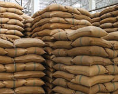

## 3.3 வாங்கும் திறன்

வாங்கும் திறன் என்பது "ஒரு அலகு பணம் மூலம் வாங்கக் கூடிய பொருள்கள் அல்லது சேவைகளின் அளவின் அடிப்படையில் வெளிப்படுத்தப்படும் நாணயத்தின் மதிப்பு" ஆகும். விலை ஏறும் போது வாங்கும் திறன் குறைகிறது. விலை குறையும் போது வாங்கும் திறன் அதிகரிக்கிறது.

### வாங்கும் திறனைப் பாதிக்கும் காரணிகள்

1. அதிகரிப்பு மக்கள் தொகை இந்தியாவில் மக்கள் தொகை வளர்ச்சி விகிதம் 1000க்கு 1.7 ஆக உள்ளது. அதிக மக்கள் தொகை அதிக தேவைக்கு வழிவகுக்கிறது. ஆனால், அளிப்பு தேவைக்கு சமமாக இல்லை. எனவே , சாதாரண விலை நிலை அதிகமாக இருக்கும். எனவே , இது குறிப்பாக கிராமப்புற மக்களின் வாங்கும் சக்தியை பாதிக்கிறது.

2. அத்தியாவசிய பொருள்களின் விலை அதிகரித்தல் மொத்த உள்நாட்டு உற்பத்தியில் நிலையான வளர்ச்சியும், இந்தியப் பொருளாதாரத்தில் வளர்ச்சி வாய்ப்புகளும் இருந்த போதிலும், அத்தியாவசியப் பொருள்களின் விலையில் நிலையான அதிகரிப்பு ஏற்பட்டுள்ளது. விலைகளின் தொடர்ச்சியான உயர்வானது வாங்கும் சக்தியை சுரண்டி, ஏழை மக்களை பெரிதும் பாதிக்கிறது.

3. பொருள்களுக்கான தேவை பொருள்களுக்கான தேவைஅதிகரிக்கும் போது, பொருள்களின் விலையும் அதிகரிக்கிறது. அதனால் வாங்கும் சக்தி பாதிக்கப்படுகிறது.

4. பொருள்களின் விலை நாணய மதிப்பைப் பாதிக்கிறது விலை அதிகரிக்கும் போது, வாங்கும் திறன் குறைந்து இறுதியாக நாணயத்தின் மதிப்புக் குறைகிறது.

5. பொருள்களின் உற்பத்தியும் அளிப்பும் பொருள்களின் உற்பத்தியும் அளிப்பும் குறையும் பொழுது, பொருள்களின் விலை அதிகரிக்கிறது. ஆகையால் வாங்கும் திறன் பாதிக்கப்படுகிறது.

### வாங்கும் சக்தி சமநிலை (Purchasing Power Parity)

வாங்கும் சக்தி சமநிலை (PPP) என்பது வாங்கும் சக்தி தொடர்பான ஒரு கருத்தாகும். இது ஒரு பொருளாதாரக் கோட்பாடாகும். ஒரு பொருளின் விலையுடன் சரி செய்யப்பட வேண்டிய தொகையை மதிப்பிடுகிறது.

நாடுகளின் வருமான நிலைகள் மற்றும் வாழ்க்கைச் செலவு தொடர்பான பிற தொடர்புடைய பொருளாதாரத் தரவு அல்லது பணவீக்கம் மற்றும் பணவாட்டத்தின் சாத்தியமான விகிதங்களை ஒப்பிடுவதற்கு வாங்கும் சக்தி சமநிலையை பயன்படுத்தலாம். சமீபத்தில் வாங்கும் சக்தி சமநிலையின் அடிப்படையில் இந்தியா மூன்றாவது பெரிய பொருளாதாரமாக மாறியுள்ளது. சீனா மிகப்பெரிய பொருளாதாரமாக மாறி, அமெரிக்காவை இரண்டாவது இடத்திற்கு தள்ளியுள்ளது.

27 27.4 2019 PPP-GDP கெபய ெபாளாதார (Int $ Tn)

னா அெமகாஇயா ஜபா ரயாெஜம

6. வறுமை மற்றும் சமத்துவமின்மை இந்தியப் பொருளாதாரத்தில் ஒரு மிகப் பெரிய ஏற்றதாழ்வு உள்ளது. 10% இந்தியர்களுக்கு சொந்தமான வருமானம் மற்றும் சொத்துக்களின் விகிதம் அதிகரித்து வருகிறது. இது சமுதாயத்தில் வறுமை நிலையை அதிகரிக்க வழிவகுக்கிறது. வறுமையாலும் செல்வத்தின் சமமற்ற வழங்குதலாலும் பொதுவாக வாங்கும் திறன் பாதிக்கப்படுகிறது.

## 3.4 இந்தியாவின் வேளாண்கொள்கை

வேளாண் பொருள்களின் ஏற்றுமதியை அடிப்படையாகக் கொண்ட புதிய விவசாயக் கொள்கை 2018இல் மத்திய அரசால் அறிவிக்கப்பட்டது. இந்தக் கொள்கை பெரும்பாலான இயற்கை வேளாண்மை மற்றும் பதப்படுத்தப் பட்ட வேளாண் பொருள்களுக்கு ஏற்றுமதிக் கட்டுப்பாடுகளை நீக்க அரசாங்கம் முடிவு செய்துள்ளதாக அறிவித்தது.

ஒரு நாட்டின் விவசாயக் கொள்கையானது பெரும்பாலும் விவசாய உற்பத்தி மற்றும் உற்பத்தித் திறனை உயர்த்துவதற்கும், ஒரு குறிப்பிட்ட கால எல்லைக்குள் விவசாயிகளின் வருமான நிலை மற்றும் வாழ்க்கைத் தரத்தை உயர்த்துவதற்கும் அரசாங்கத்தால் வடிவமைக்கப்பட்டதாகும். இந்தக் கொள்கை விவசாயத்துறையின் அனைத்து வட்டங்களிலும், விரிவான வளர்ச்சிக்காக வடிவமைக்கப்பட்டுள்ளது .

இந்தியாவின் புதிய வேளாண் கொள்கையின் முக்கியமான குறிக்கோள்கள் பின்வருமாறு.

1. வேளாண் உற்பத்தித்திறனை உயர்த்துதல் இந்தியாவின் வேளாண் கொள்கையின் முக்கிய நோக்கமானது வீரியரக விதைகள், உரங்கள், பூச்சிக்கொல்லிகள், நீர்ப்பாசனம் போன்ற திட்டங்கள் மூலம் உற்பத்தித் திறனை மேம்படுத்துவதாகும்.

2. ஒரு ஹெக்டேருக்கு மதிப்புக் கூட்டப்பட்டவை வேளாண் கொள்கையானது சிறு மற்றும் குறு விவசாயிகள் ஒரு ஹெக்டேருக்கு மதிப்புக் கூட்டப்பட்ட உற்பத்தியை விட அதிக உற்பத்தித் திறனை அதிகரிப்பதாகும்.

3. ஏழை விவசாயிகளின் நலன்களைப் பாதுகாத்தல் ஏழை விவசாயிகளுக்கு நிறுவனக் கடன் ஆதரவை விரிவுபடுத்துதல், நிலச் சீர்திருத்தங்கள் செய்தல், இடைத்தரகர்களை ஒழித்தல் போன்றவற்றின் மூலம் ஏழை மற்றும் குறு விவசாயிகளின் நலனைப் பாதுகாப்பதே வேளாண் கொள்கையாகும்.

4. விவசாயத் துறையை நவீனமயமாக்குதல் வேளாண் நடவடிக்கைகளில் நவீன தொழில்நுட்பத்தை அறிமுகப்படுத்துதல் மற்றும் உயர் ரக விதைகள் (HYV), உரங்கள் போன்ற மேம்பட்ட வேளாண் உத்திகளைப் பயன்படுத்துதல் ஆகியவை அடங்கும்.

5. சுற்றுச்சூழல் சீர்கேடு இந்தியாவின் வேளாண் கொள்கை இந்திய வேளாண்மையின் அடித்தளத்தின் சுற்றுச்சூழல் சீர்கேட்டை சரி செய்யும் மற்றொரு நோக்கத்தையும் கொண்டுள்ளது.

6. அதிகாரத்துவ தடைகளை நீக்குதல் வேளாண் கூட்டுறவுச் சங்கங்கள் மற்றும் சுய உதவி நிறுவனங்கள் மீதான அதிகாரத்துவ தடைகளை நீக்குவதற்கு இந்தக் கொள்கை மற்றொரு குறிக்கோளை அமைத்துள்ளது, இதனால் அவர்கள் சுதந்திரமாகச் செயல்பட முடியும்.

## 3.5 வறுமையின் பல பரிமாணத்தின் இயல்பு (Multi-dimensional Nature of Poverty)

பல பரிமாண வறுமை குறியீடு (MPI) ஆனது ஐக்கிய நாடுகளின் மேம்பாட்டுத் திட்டம் (United Nations Development Programme) மற்றும் ஆக்ஸஸ்போர்டு வறுமை மற்றும் மனித மேம்பாட்டு முனைவு (Oxford Poverty and Human Development Initiative) ஆகியவற்றால் 2010ஆம் ஆண்டு தொடங்கப்பட்டது. பல பரிமாண வறுமைக் குறியீட்டின் அடிப்படைத் த்துவமும், முக்கியத்துவமும் என்னவென்றால், வறுமை என்பது ஒற்றை பரிமாணமல்ல, அது பல பரிமாணங்களைக் கொண்டது என்ற கருத்தை அடிப்படையாகக் கொண்டது.

உடல் நலம், கல்வி, வாழ்க்கைத் தரம், வருமானம், அதிகாரமின்மை, பணியின் தரம் மற்றும் வன்முறையினால் அச்சுறுத்தப்படுதல் போன்ற ஏழை மக்களின் அனுபவத்தை இழக்கும் பல காரணிகளால் பல பரிமாண வறுமை உருவாகிறது.

### தமிழ்நாட்டின் பல பரிமாண வறுமைக் குறியீடு (MPT) அறிக்கை-2022-2023

கடந்த பத்து ஆண்டுகளாக, வறுமைக் குறைப்பில் தமிழ்நாடு குறிப்பிடத்தக்க முன்னேற்றம் அடைந்துள்ளது. தமிழ்நாட்டில் உள்ள மாவட்டங்கள் மூன்று வகைகளாக வகைப்படுத்தப்பட்டுள்ளன. அவை உயர் வறுமை மாவட்டங்கள் (வறுமைக் கோட்டிற்கு கீழ் வாழும்

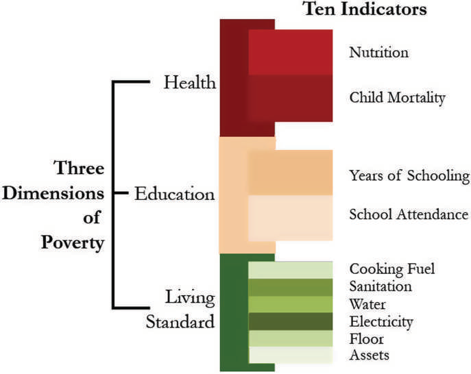

### சுகாதாரம்

### வறுமையின்

கல்வி

### மூன்று பரிமாணங்கள்

வாழ்க்கைத்தரம்

### பல-பரிமாண வறுமைக் குறியீடு

மக்கள் தொகையில் 40% க்கும் அதிகமானோர்), மிதமான ஏழை மாவட்டங்கள் (30% முதல் 40% வரை) மற்றும் குறைந்த அளவிலான வறுமை மாவட்டங்கள் (30%க்கும் குறைவு) ஆகும்.

1994க்குப் பிறகு, தமிழ்நாட்டின் கிராமப்புறத்திலும் நகர்ப்புறங்களிலும் வறுமை படிப்படியாகக் குறைந்துள்ளது, மற்றும் இந்தியாவில் அதன் மக்கள் தொகையுடன் ஒப்பிடும் போது சிறிய ஏழ்மைப் பங்கினைக் கொண்டுள்ளது. 2005க்குப் பிறகு, இந்தியாவில் பல மாநிலங்களை விட வறுமைக் குறைப்பு தமிழ்நாட்டில் வேகமாக உள்ளது. 2014-2017 வரையிலான காலங்களில் வறுமை ஒழிப்புத் திட்டங்களில் தமிழ்நாடு முன்னிலை வகிக்கிறது. தற்போது, இந்திய அரசு வறுமையை ஒழிக்க பல கொள்கைகளையும், திட்டங்களையும் செயல்படுத்துகிறது.

### தமிழ்நாட்டின் அதிக மற்றும் குறைவான

### MPI மாவட்டங்கள்

| முதல் ஐந்து மாவட்டங்கள் | கடைசி ஐந்து மாவட்டங்கள் |
|---|---|
| காஞ்சிபுரம் | ருமபுரி |
| சென்னை | பெரம்பலூர் |
| கடலூர் | இராமநாதபுரம் |
| கோயம்புத்தூர் | விருதுநகர் |
| ாகப்பட்டினம் | அரியலூர் |

### நாகப்பட்டினம்அரியலூர்குறைந்த எடையுள்ள

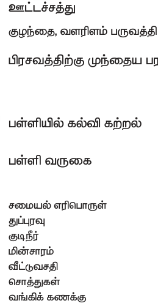

இந்த கொள்கைகள் மற்றும் திட்டங்கள் தொடர்ந்து இருந்தால் மாநிலத்தின் வறுமையை முற்றிலுமாக ஒழிக்கலாம். எதிர்காலத்தில் தமிழ்நாடு இந்தியாவின் ஒரு மாதிரி மாநிலமாக மாற வாய்ப்புள்ளது.

## 3.6 ஊட்டச்சத்தும் சுகாதார நிலையும்

### ஊட்டச்சத்தின் நிலை

உணவுப் பாதுகாப்பில் ஊட்டச்சத்தும் பாதுகாப்பும் அடங்கும் என்பதை நாம் முன்னரே அறிந்தோம். நமது நாடு உணவு உற்பத்தியில் தன்னிறைவு அடைந்திருந்தாலும், மக்களின் ஊட்டச்சத்து நிலையில் முன்னேற்றங்களை அடையவில்லை. 2015-2016 ஆம் ஆண்டில், 27% கிராமப்புறப் பெண்களும் 16% நகர்ப்புற பெண்களும் (15-49 வயதுக்குட்பட்டவர்கள்) ஊட்டச்சத்துக் குறைபாடு உடையவர்கள் அல்லது நீண்டகால ஆற்றல் குறைபாடு உடையவர்கள் என தேசிய குடும்ப சுகாதார கணக்கெடுப்பின் மூலம் கண்டறியப்பட்டது.

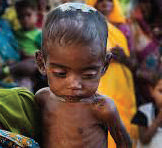

### குழந்தை

இந்தியாவில் கிராமப்புற மற்றும் நகர்ப்புற (15-49 வயது) வயதுக் குழுவில் பாதிக்கும் மேற்பட்ட பெண்கள் இரத்த சோகைக்கு ஆளானார்கள். 2015-2016 ஆம் ஆண்டில் குழந்தைகளைப் பொறுத்தவரை கிராமப்புறங்களில் 60% மற்றும் நகர்ப்புறங்களில் (6-59 மாதங்கள்) 56% இரத்த சோகை உடையவர்கள் எனக் கருதப்பட்டனர். கிராமப்புறங்களில் சுமார் 41% மற்றும் நகர்ப்புறங்களில் 31% குழந்தைகள் வளர்ச்சி குன்றியிருக்கின்றனர். அதாவது அவர்களின் வயதுக்கு ஏற்பத் தேவையான உயரத்தை கொண்டிருக்கவில்லை. ஊட்டச்சத்தின் குறைபாட்டினால் மற்றொரு குறியீடாக குழந்தைகளிடையே வயது தொடர்பான எடையை விட “எடை குறைவாக” உள்ளனர். இந்தியாவில் 2015-2016 ஆம் ஆண்டில் சுமார் 20% குழந்தைகள் (6-59 மாத வயதுக்குட்பட்டவர்கள்) எடை குறைவாக இருப்பதாக மதிப்பிடப்பட்டுள்ளது.

### தமிழ் நாட்டில் ஊட்டச்சத்து மற்றும் ஆரோக்கியத்தின் நிலை

மனித ஆரோக்கியத்திலும், நலவாழ்விலும் ஊட்டச்சத்து முக்கியப் பங்கு வகிக்கிறது. தேசிய அளவில் அதிகப் பொருளாதார வளர்ச்சி இருந்த போதிலும், ஊட்டச்சத்து அளவுகள் போன்ற மனித வளர்ச்சி குறிகாட்டிகளில் மேம்பாடுகள் ஏற்றுக்கொள்ள முடியாத அளவிற்கு மெதுவாகவேஉள்ளன. ஏராளமான இந்தியக் குழந்தைகள் வளர்ச்சி குன்றியிருக்கிறார்கள். கணிசமான எண்ணிக்கையிலான இந்தியக் குழந்தைகள் மற்றும் பெண்கள் எடை குறைவாகவும், இரத்த சோகை மற்றும் நுண்ணூட்டச் சத்து குறைபாடுகளாலும் பாதிக்கப்படுகின்றனர். இந்தப் பிரச்சனைகளை நீக்குவதற்காக மத்திய மற்றும் மாநில அரசுகள் பல்வேறு சுகாதார மற்றும் ஊட்டச்சத்துத் திட்டங்களான ஒருங்கிணைந்த குழந்தைகள் மேம்பாட்டு சேவைகள் (Integrated Child Development Services), மதிய உணவுத் திட்டம், குழந்தைகள் சுகாதாரத் திட்டங்கள் (Reproductive and Child Health Programmes), மற்றும் தேசிய கிராமப்புற சுகாதாரப் பணி (National Rural Health Mission) போன்ற பல திட்டங்களில் கவனம் செலுத்தி வருகின்றன. எவ்வாறாயினும், நாட்டின் ஊட்டச்சத்து குறைவான நிகழ்வுகளைத் தணிக்க இந்த முயற்சிகளைத் திறம்பட செயல்படுத்துவது அவசியமாகும்.

ஆறு வயதிற்குட்பட்ட குழந்தைகள், கர்ப்பிணிப் பெண்கள், பாலூட்டும் தாய்மார்கள் மற்றும் இளம் பருவப் பெண்கள் ஆகியோரின் உடல்நலம் மற்றும் ஊட்டச்சத்து நிலைகளில் குறிப்பிடத்தக்க மாற்றங்களைக் கொண்டுவருவதில் தமிழ்நாடு ஒரு முன்னோடி பங்கைக் கொண்டுள்ளது. ஊட்டச்சத்து மற்றும் ஆரோக்கியத்திற்கான தமிழ்நாடு அரசின் ஒவ்வொரு ஆண்டு வரவு- செலவுத் திட்ட செலவினங்கள் நாட்டிலேயே மிக அதிகமாகும். ICDS திட்டம் மற்றும் தமிழ்நாட்டில் உள்ள புரட்சித் தலைவர் எம்.ஜி.ஆர் சத்துணவுத் திட்டம் ஆகியவற்றின் செயல்திறன் நாட்டின் மிகச் சிறந்த ஒன்றாகக் கருதப்படுகின்றது.

ஊட்டச்சத்துக் குறைபாடு இல்லாத தமிழ்நாடு' என்ற தமிழ்நாட்டின் கொள்கை, ஊட்டச்சத்துக் குறைபாட்டை அகற்றுவதற்காக மாநிலத்தின் நீண்டகால பல துறைக் கொள்கைகளை செயல்படுத்துகிறது. “தமிழ்நாட்டில் அனைத்து, 434 குழந்தைகள் மேம்பாட்டுத் தொகுதிகளில் (385 கிராமப்புறம், 47 நகர்ப்புறம் மற்றும் 2 பழங்குடியினர்) 54,439 குழந்தை மையங்கள் (49,499 அங்கன்வாடி மையங்கள் மற்றும் 4,940 சிறு அங்கன்வாடி மையங்கள்) மூலம் ICDS செயல்படுத்தப்படுகிறது.

அணுகப்படாத பகுதிகளுக்கு நிலையான விரிவாக்கம், ஓரங்கட்டப்பட்ட குழுக்களின் பாதுகாப்பு, மேம்பட்ட ஒதுக்கீடுகள் மற்றும் சேவைகளின் விரிவாக்கம் ஆகியவற்றுடன், ICDS இப்போது உலகின் மிகப்பெரிய திட்டங்களில் ஒன்றாகக் கருதப்படுகிறது.

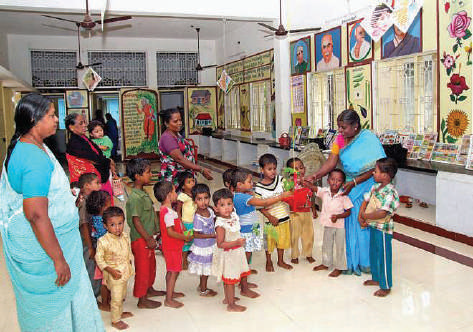

### ICDS திட்டம்

புரட்சித் தலைவர் எம்.ஜி.ஆர் சத்துணவுத் திட்டம் குழந்தைகளிடையே ஊட்டச்சத்துக் குறைபாட்டை எதிர்த்துப் போராடுவதற்கும், பள்ளிகளில் சேர்க்கையை அதிகரிப்பதற்கும், இடைநிற்றல் விகிதங்களைக் குறைப்பதற்கும் நாட்டின் மிகப்பெரிய மதிய உணவுத் திட்டமாகக் கருதப்படுகிறது. நாட்டின் பிற மாநிலங்கள், தமிழ்நாட்டின் முன்னோடி முயற்சிகளின் படி மதிய உணவுத் திட்டங்களை வடிவமைத்துள்ளன.

### தமிழ்நாட்டில் செயல்படும் முக்கியமான திட்டங்கள்

1. டாக்டர் முத்துலட்சுமி ரெட்டி மகப்பேறு நலத் திட்டத்தின் (Dr. Muthulakshmi Reddy Maternity Benefit Scheme) கீழ், ஏழை கர்ப்பிணிப் பெண்களுக்கு ` 12,000/- நிதியுதவி வழங்கப்படுகிறது.

2. முதலமைச்சரின் விரிவான சுகாதாரக் காப்பீடு திட்டம் (Chief Minister’s Comprehensive Health Insurance Scheme) 2011-12 ஆம் ஆண்டில் தொடங்கப்பட்டது. இதன் நோக்கம் அனைவருக்கும் உடல் நலம் வழங்கும் நோக்கில் அரசாங்கத்தால் இலவச மருத்துவ மற்றும் அறுவை சிகிச்சை வழங்குவதாகும்

3. தமிழ்நாடு சுகாதார அமைப்புத் திட்டங்கள் (Tamil Nadu Health Systems Projects) கட்டணமில்லாத ஆம்புலன்ஸ் சேவைகளை அறிமுகப்படுத்தியுள்ளது. (108 அவசர ஆம்புலன்ஸ் சேவை ).

4. ‘பள்ளி சுகாதார திட்டம்’ (School Health Programme) விரிவான சுகாதார சேவையை அரசு மற்றும் அரசு உதவிபெறும் பள்ளிகளில் படிக்கும் அனைத்து மாணவர்களுக்கும் வழங்குவதை வலியுறுத்துகிறது.

5. தேசிய தொழுநோய் ஒழிப்பு திட்டத்தின் (National Leprosy Eradication Programme) மூலம் அனைத்து தொழுநோயாளிகளையும் கண்டறிந்து தொடர்ச்சியாக சிகிச்சை அளிப்பதை நோக்கமாகக் கொண்டு மாநிலத்தில் செயல்படுத்தப்படுகிறது. பள்ளி சுகாதார திட்டம்

### தமிழ்நாட்டில் சில ஊட்டச்சத்துத் திட்டங்கள்

1. புரட்சித் தலைவர் எம்.ஜி.ஆர் ஊட்டச்சத்து உணவுத்திட்டம்.

2. ஆரம்பக் கல்விக்கு தேசிய ஊட்டச்சத்து ஆதரவுத் திட்டம்.

3. பொது ICDS திட்டங்கள் மற்றும் உலக வங்கி உதவியுடன் ஒருங்கிணைந்த குழந்தைகள் மேம்பாட்டுச் சேவைகள் (General ICDS Projects and World Bank Assisted Integrated Child Development Services).

4. பிரதம மந்திரி கிராமோதயா யோஜனா திட்டம்.

5. தமிழ்நாடு ஒருங்கிணைந்த ஊட்டச்சத்துத் திட்டம்.

6. காலை உணவுத் திட்டம்.

### பாடச்சுருக்கம்

உணவு மற்றும் ஊட்டச்சத்து பாதுகாப்பின் மூன்று அடிப்படைக் கூறுகளை உள்ளடக்குவதற்காக இந்த சொல் விரிவுபடுத்தப்பட்டது. அவை கிடைத்தல், அணுகல் மற்றும் உறிஞ்சுதல். பசுமைப் புரட்சி உணவு தானியங்களில் தன்னிறைவு பெற வழி வகுத்தது. தேசிய உணவுப் பாதுகாப்புச் சட்டம் இந்திய பாராளுமன்றத்தால் 2013இல் நிறைவேற்றப்பட்டது. விவசாய பொருள்களின் ஏற்றுமதி அடிப்படையில் புதிய வேளாண் கொள்கையை 2018இல் நடுவண் அரசால் அறிவிக்கப்பட்டது. மனிதவள மேம்பாட்டில் சுகாதாரத்திற்கு முக்கியப் பங்கு உண்டு.

## கலைச் சொற்கள்

| எளிதில் கிடைக்கூடிய தன்மை | Availability | that which can be used, attainable |
|---|---|---|
| அணுகுமுறை | Accessibility | right to enter |
| ாங்கும் திறன் | Affordability | ability to be afforded |

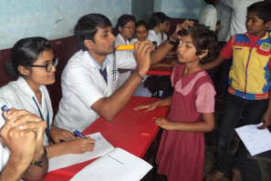

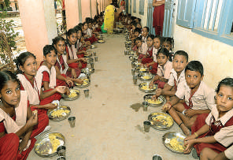

| போதுமான | Sufficient | enough |
|---|---|---|
| பொருள்கள் வாங்கும் திறன் | Purchasing power | the financial ability to buy produce |
| உற்பத்தி செய்யும் ஆற்றல் | Productivity | power of producing |
| மதிப்புக் குறைவு | Degradation | to reduce to a lower rank |
| ஒரு பரிமாணம் | Unidimensional | having one direction |
| ஊட்டச்சத்தின்மை | Malnourished | lack of proper nutrition |

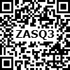

### பயிற்சி

**I சரியான விடையை தேர்ந்தெடுத்து எழுதுக**

1. சேமிப்புக் கிடங்கு என்பது உணவு தானியங்களான கோதுமை மற்றும் அரிசியை நிறுவனம் மூலம் அரசாங்கம் கொள்முதல் செய்கிறது.

அ) FCI ஆ) நுகர்வோர் கூட்டுறவு இ) ICICI ஈ) IFCI

2. எது சரியானது?

i) HYV – அதிக விளைச்சல் தரும் வகைகள் ii) MSP – குறைந்தபட்ச ஆதரவு விலை iii) PDS – பொது விநியோக முறை iv) FCI – இந்திய உணவுக் கழகம் அ) i மற்றும் ii சரியானவை ஆ) iii மற்றும் iv சரியானவை இ) ii மற்றும் iii சரியானவை ஈ) மேற்கூறிய அனைத்தும் சரி.

3. நீட்டிக்கப்பட்ட உதவிப் பொதுச் சட்டம் 480-ஐ கொண்டு வந்த நாடு .

அ) அமெரிக்கா ஆ) இந்தியா இ) சிங்கப்பூர் ஈ) இங்கிலாந்து

4. இந்தியாவில் தோன்றியதால் உணவு தானிய உற்பத்தியில் தன்னிறைவு பெற வழி வகுத்தது.

அ) நீலப் புரட்சி ஆ) வெள்ளைப் புரட்சி இ) பசுமைப் புரட்சி ஈ) சாம்பல் புரட்சி

5. உலகளாவிய பொது வழங்கல் முறையை ஏற்றுக் கொண்ட ஒரே மாநிலம் .

அ) கேரளா ஆ) ஆந்திரபிரதேசம் இ) தமிழ்நாடு ஈ) கர்நாடகா

6. என்பது உடல் நலம் மற்றும் வளர்ச்சிக்குத் தேவையான உணவை வழங்கும் அல்லது பெறும் செயல்முறையாகும்.

அ) ஆரோக்கியம் ஆ) ஊட்டச்சத்து இ) சுகாதாரம் ஈ) பாதுகாப்பு

### II கோடிட்ட இடங்களை நிரப்புக

1. ஊட்டச்சத்து குறைபாட்டின் முக்கியமான குறியீடாகும்.

2. ஆம் ஆண்டில் தேசிய உணவு பாதுகாப்புச் சட்டம் இந்திய நாடாளுமன்றத்தால் நிறைவேற்றப்பட்டது.

3. மக்களுக்கு பொறுப்பான விலையில் தரமான பொருள்களை வழங்குவதில் முக்கியப் பங்கு வகிக்கிறது.

### III பின்வருவனவற்றைப் பொருத்துக

1. நுகர்வோர் கூட்டுறவு - மானிய விகிதங்கள்

2. பொது விநியோக முறை - 2013

3. UNDP - தரமான பொருள்களை வழங்குதல்

4. தேசிய உணவுப் பாதுகாப்புச் சட்டம் - ஐக்கிய நாடுகள் சபை வளர்ச்சித் திட்டம்

### IV சரியான கூற்றை தெரிவு செய்க

1. கூற்று: விலை குறைந்தால் வாங்கும் சக்தி அதிகரிக்கிறது மற்றும் இது நேர்மாறானது. காரணம்: பொருள்களின் உற்பத்தி குறைந்து, விலை அதிகரிப்பதால் வாங்கும் திறன் பாதிக்கப்படுகிறது.

அ) கூற்று சரியானது, காரணம் தவறானது ஆ) கூற்று மற்றும் காரணம் இரண்டும் தவறானது இ) கூற்று சரியானது, ஆனால் காரணம் சரியான விளக்கம் அல்ல ஈ) கூற்று சரியானது, காரணம் கூற்றின் சரியான விளக்கம்

### V குறுகிய விடையளிக்கவும்

1. FAO வின்படி உணவுப் பாதுகாப்பை வரையறு.

2. உணவு மற்றும் ஊட்டச்சத்து பாதுகாப்பின் மூன்று அடிப்படைக் கூறுகள் யாவை?

3. பசுமைப் புரட்சியில் இந்திய உணவுக் கழகத்தின் (FCI) யின் பங்கு என்ன?

4. பசுமைப் புரட்சியின் விளைவுகள் என்ன?

5. தமிழ்நாட்டிலுள்ள சில ஊட்டச்சத்துத் திட்டங்களின் பெயரை எழுதுக.

### VI கீழ்க்காணும் வினாக்களுக்கு விரிவான விடையளி

1. பசுமைப் புரட்சி ஏன் தோன்றியது என்பதைப் பற்றி விவரி.

2. குறைந்த பட்ச ஆதரவு விலையை விளக்குக.

3. பொது விநியோக முறையை விவரிக்கவும்.

4. வாங்கும் திறனைப் பாதிக்கும் காரணிகள் யாவை? அவற்றை விளக்குக.

5. புதிய வேளாண் கொள்கைக்கான முக்கியக் குறிக்கோள்கள் யாவை?

## இணையச் செயல்பாடு உணவுப் பாதுகாப்பும் ஊட்டச்சத்தும்

படி – 1 URL அல்லது QR குறியீட்டினைப் பயன்படுத்தி இச்செயல்பாட்டிற்கான இணையப் பக்கத்திற்கு செல்க படி – 2 மெனுவின் இடது பக்கத்தில் உள்ள ’ Minimum Support Price of Paddy, Wheat and Coarse grain’ என்பதை சொடுக்கவும் படி – 3 தோன்றும் புள்ளி விவரத்தொகுப்பினை ஒவ்வொன்றாகத் தேர்ந்தெடுத்து அதற்கான விளக்கத்தைப் பார்க்கவும்.

உரலி: http://fci.gov.in/procurements.php?view=51

### VII செய்முறைகளும் செயல்பாடுகளும்

1. அருகிலுள்ள “உழவர் சந்தையை” பார்வையிட்டு சந்தை செயல்பாடுகளின் தகவல்களை சேகரிக்கவும்.

2. உங்கள் இடத்திற்கு அருகிலுள்ள சுகாதார மையத்தின் செயல்பாடு பற்றி தகவல்கள் சேகரிக்கவும்.

### மேற்கோள் நூல்கள்

1. Dr.S. சங்கரன் – இந்தியப் பொருளாதாரம், இந்தியா.

2. Ministry of Agriculture & Farmers Welfare.

3. Annual report 2016–17.

3. Nutrition & Food Security. UN India.

4. Pratiyogita Darpan–Indian Economy.

5. Economic Survey 2017–18.

6. The Gazette of India–“The National Food Security Act 2013”.

### இணையதள வளங்கள்

1. www.agricoop.nic.in

2. www.fci.gov.in

3. www.statistics.com

