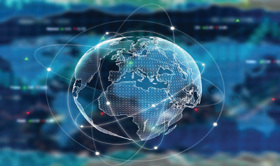
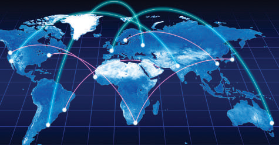
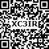
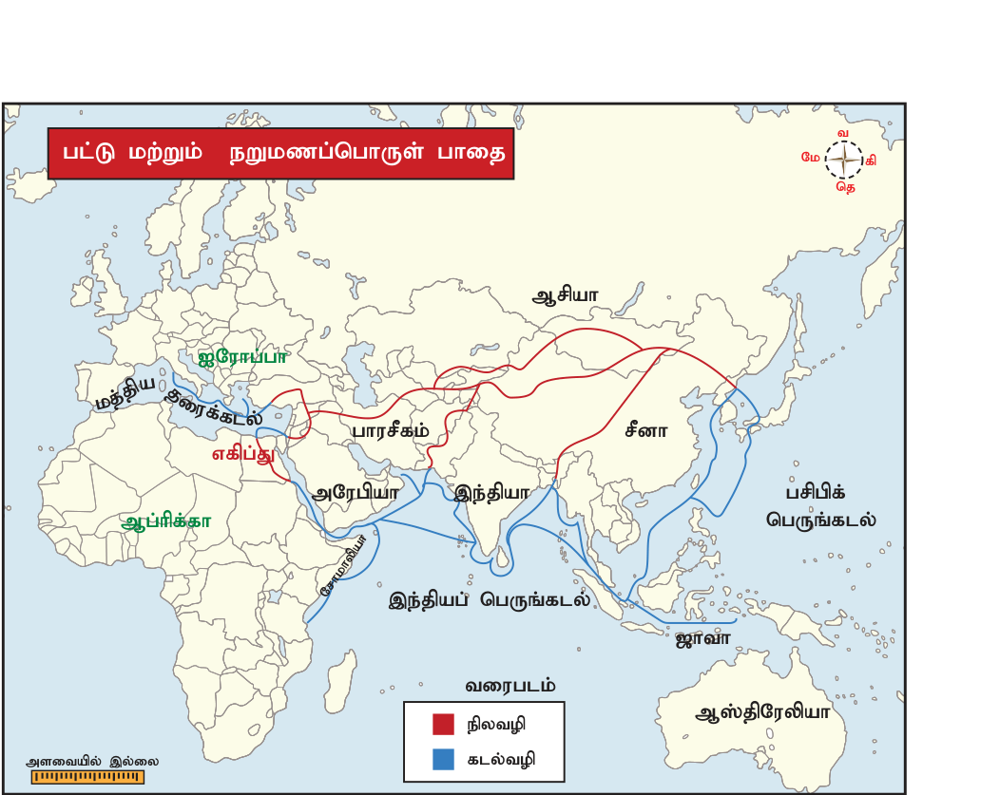
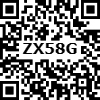
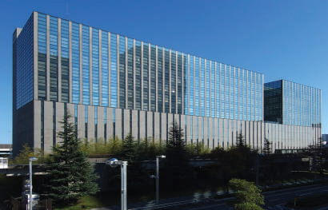
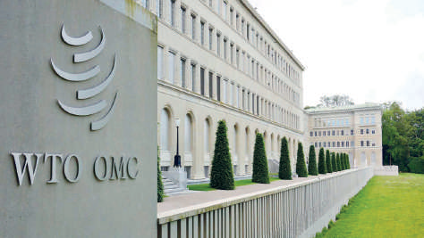
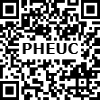

# பொருளியல் அலகு 2: உலகமயமாதல் மற்றும் வர்த்தகம்

## கற்றலின் நோக்கங்கள்

- உலகமயமாதலின் பொருள் மற்றும் வரலாறு பற்றி அறிந்துகொள்ளுதல்

- பன்னாட்டு நிறுவனங்களின் (MNC) பரிமாண வளர்ச்சியை புரிந்துகொள்ளுதல்

- தென்னிந்திய வரலாற்று முன்னோக்கில், வர்த்தகம் மற்றும் வணிகர்கள் பற்றி அறிந்துகொள்ளுதல்

- நியாயமான வர்த்தக நடைமுறைகள் மற்றும் உலக வர்த்தக அமைப்பைப் பற்றி அறிந்துகொள்ளுதல்

- உலக மயமாதலின் தாக்கத்தையும், சவால்களையும் புரிந்துகொள்ளுதல்

## அறிமுகம்

தற்காலத்தில் அரசியல்வாதிகள், பொருளியல் ல்லுநர்கள் மற்றும் தொழிலதிபர்களிடையே அதிகமாக பேசக்கூடிய கருத்துகளாக தாராளமயமாக்கல், தனியார்மயமாக்கல் மற்றும் உலகமயமாக்கல் (LPG) இருக்கின்றன. நமது அரசாங்கம் 1991ஆம் ஆண்டு இவற்றை நடைமுறைப்படுத்தியது.

## 2.1 உலகமயமாக்கல்

உலகமயமாக்கல் என்பது உலகப் பொருளாதாரத்துவநாடுகளை ஒருங்கிணைப்பதாகும். அடிப்படையில் உலகமயமாக்கல், சர்வதேசமயமாக்கல் மற்றும் தாராளமயமாக்கல் செயல்முறையை குறிக்கிறது.

### உலகமயமாதல்

## 2.2 உலகமயமாக்கலின் வரலாறு

உலகமயமாக்கல் என்ற சொல் பேராசிரியர் தியோடோர் லெவிட் என்பரால் அறிமுகப்படுத்தப்பட்டது. உலகமயமாக்கல் ரலாற்றுப் பின்னணியில் மூன்று நிலைகளில் விவாதிக்கப்பட்டது.

நிலை 1 - தொன்மையான உலகமயமாக்கல் நிலை 2 - இடைப்பட்ட உலகமயமாக்கல்உலகமயமாக்கலின்

### வரலாறு

நிலை 3 - நவீன உலகமயமாக்கல்

### தொன்மையான உலகமயமாக்கல்

சுமேரிய மற்றும் சிந்து சமவெளி நாகரிகங்களுக்கு இடைேயான ர்த்தக உறவுகள் உலகமயமாக்கல் என்ற ஒரு வடிவத்தை (பொ.ஆ.மு) மூன்றாம் நூற்றாண்டுகளிலேயே உருவாக்கியது என்று ஆண்ட்ரே குந்தர் ஃபிராங்க் வாதிட்டார். உலகமயமாக்கப்பட்ட பொருளாதாரம் மற்றும் கலாச்சாரத்தின் ஆரம்ப டிவத்தை தொன்மையான உலகமயமாக்கல் என்று கிரேக்க காலத்தில் (Hellenistic Period) அழைக்கப்பட்டது. ரோம் பேரரசுக்கும் பார்த்தியன் பேரரசுக்கும் மற்றும் ஹான் வம்சத்துக்கும் இடையேயான வர்த்தக தொடர்பே உலகமயமாக்கலின் ஆரம்ப வடிவம்.

இந்த பேரரசுகளுக்கு இடையேயான ணிக உறவுகள் பட்டு சாலையின் (Silk Route) வளர்ச்சியை ஊக்கப்படுத்தியது.

இஸ்லாமிய காலமும் உலகமயமாக்கலில் ஒரு முக்கிய ஆரம்பகட்டமாக இருந்து வந்தது. மங்கோலிய பேரரசின் வருகை, மத்திய கிழக்கு மற்றும் சீனாவின் ர்த்தக மையங்களுக்கு உறுதியற்றதாக இருந்தாலும் பட்டு சாலை வழியாக பயணிக்க வசதியாக இருந்தது. இந்த நவீனத்திற்கு முந்தைய காலக் கட்டத்தில் நடந்த உலக பரிமாற்றம் சில நேரங்களில் தொன்மையான உலகமயமாக்கல் என்றழைக்கப்படுகிறது.

### இடைப்பட்ட உலகமயமாக்கல்

உலகமயமாக்கலின் அடுத்த கட்டம் இடைப்பட்ட உலகமயமாக்கல் ஆகும். 16 மற்றும் 17ஆம் நூற்றாண்டுகளில், ஐரோப்பிய பேரரசுகளின் எழுச்சியால் முதலில் போர்ச்சுகீசியர்கள், ஸ்பானியர்கள், டச்சுக்காரர்கள் மற்றும் ஆங்கிலேயர்கள் கடல் வழி வாணிபம் மேற்கொண்டனர். உலகமயமாக்கல், 17ஆம் நூற்றாண்டில், பிரிட்டிஷ் கிழக்கிந்திய நிறுவனம் தனியார் வணிக நிறுவனம் போன்று உருவாக்கப்பட்டது. அதுவே முதல் பன்னாட்டு நிறுவனம் என அழைக்கப்பட்டது.

### நவீன உலகமயமாக்கல்

19ஆம் நூற்றாண்டில் உலகமயமாக்கல் நவீன டிவத்தின் தொடக்கமாயிற்று. 19 மற்றும் 20ஆம் நூற்றாண்டுகளுக்கு இடையே நடைபெற்ற உலகமயமாக்கல் குறிப்பிடத்தக்க வேறுபாடுகளை கொண்டிருந்தது. அவை, அந்த நூற்றாண்டுகளில் நடைபெற்ற உலகளாவிய ர்த்தக பொருளாதாரத்தில் மூலதனம் மற்றும் முதலீடு செய்யப்பட்டதும், 20ஆம் நூற்றாண்டில் ணிக உற்பத்தியில் அதிகப் பங்கினை பெற்றிருந்ததுடன், சேவைகள், வர்த்தகம் மற்றும் பன்னாட்டு நிறுவனங்களின் உற்பத்தி வணிகத்தில் எழுச்சியுற்றிருந்ததும் ஆகும்.

## 2.3 வரலாற்றுப் பார்வையில் தென் இந்தியாவில் வர்த்தகம் மற்றும் வணிகர்கள்

ர்த்தக நடவடிக்கைகளை ஒழுங்கமைக்கவும், விரிவுபடுத்தவும் ணிகர்கள் தென்னிந்திய ர்த்தகக் குழுக்களை உருவாக்கினர். இந்திய கலாச்சாரத்தை மற்ற நாடுகளுக்கு ஏற்றுமதி செய்யப்படும் ழிகளாக ர்த்தகக் குழுக்கள் இருந்தன.

### ஆரம்பகால வர்த்தகர்கள்

கி.பி. (பொ.ஆ.) 1053இல் கலிங்க வர்த்தகர்கள் (ஒடிசா) சிவப்பு ண்ணகல் அலங்கார பொருள்களை வர்த்தகத்திற்கு கொண்டு வந்தனர். மேலும், ஆரம்ப நாள்களில் பருத்தி ஆடைகளைதென்கிழக்கு ஆசியாவிற்கு கொண்டு ந்து ர்த்தகம் செய்தனர்.

### ஐரோப்பிய வணிகர்கள்

இந்த காலத்தில் இந்தியாவிற்கு பல்வேறு ஐரோப்பிய நிறுவனங்கள் வருவதற்கு வர்த்தக நடவடிக்கைகள் காரணமாக இருந்தன. வாஸ்கோ -டா-காமாவால் ஐரோப்பாவிலிருந்து இந்தியாவிற்கு நன்னம்பிக்கை முனை வழியாக புதிய கடல் வழி கண்டுபிடிக்கப்பட்டது. அது நாகரிக உலகத்தின் மீது பல விளைவுகளை ஏற்படுத்தியது..

### போர்ச்சுகீசியர்கள்

வாஸ்கோ -டா-காமாவின் தலைமையின் கீழ் போர்ச்சுகீசியர்கள் மே 1498இல் வாணிபத்திற்காக கள்ளிக்கோட்டைக்கு ந்தனர். வாஸ்கோ -டா-காமாவால் போர்ச்சுக்கல்லுக்கு கொண்டு செல்லப்பட்ட பொருள்களின் மதிப்பானது, இந்தியா முழுவதும் பயணம் செய்த செலவைவிட 60 மடங்காகும். மேலும், 1502இல், வாஸ்கோ -டா-காமாவின் இரண்டாது பயணம் இந்தியாவில் கள்ளிக்கோட்டை, கொச்சின் மற்றும் கண்ணனூர் ஆகிய இடங்களில் ர்த்தக நிறுவனங்கள் நிறுவுவதற்கு ழிவகுத்தது. ஆரம்பத்தில் இந்தியாவில் போர்ச்சுகீசியர்களின் தலைநகரமாக கொச்சின் இருந்தது.

### டச்சுக்காரர்கள்

1596இல் டச்சுக்காரர்கள் பல பயணங்கள் மேற்கொண்டு, டச்சு கிழக்கு இந்திய நிறுவனத்தை 1602இல் உருவாக்கினர். 1605இல் அட்மிரல் வான் டெர் ஹகேன் என்பரால் டச்சு நிறுவனம் மசூலிப்பட்டினம், பெத்தபோலி (நிஜாம்பட்டினம்), தேவனாம்பட்டினம் ஆகிய இடங்களில் நிறுவப்பட்டது. 1610ஆம் ஆண்டில் சந்திரகிரி ராஜாவுடன் பேச்சுவார்த்தை நடத்தி பழவேற்காடு என்னுமிடத்தில் மற்றொரு தொழிற்சாலையை நிறுவினர். இண்டிகோ மற்றும் வங்க கச்சா பட்டு போன்ற இதர பொருள்கள் டச்சுக்காரர்களால் ஏற்றுமதி செய்யப்பட்டது. இந்தியாவில்

### டச்சுக்காரர்களின் தலைமையிடமாக பழவேற்காடு இருந்தது. ஆங்கிலேயர்கள்

டிசம்பர் 31, 1600 அன்று, கிழக்கிந்திய கம்பெனி நிறுவனம் தொடங்குவதற்கு எலிசபெத் ராணியால் பட்டயம் வழங்கப்பட்டது. தென் கிழக்கு கடற்கரையில், ஆங்கிலேயர்கள் 1611இல் மசூலிப்பட்டினத்திலும், 1626இல் பழவேற்காட்டிற்கு அருகிலும் நிறுவினர். கோல்கொண்டாவின் சுல்தான், ஆங்கிலேயர்களுக்கு “கோல்டன் ஃபயர்மேன்“ என்ற பட்டத்தை வழங்கி, 1632ல் அவர்களை தங்கள் “ராஜ்ய துறைமுகங்களில்“ இலவசமாக வர்த்தகம் செய்யவும் அனுமதி வழங்கினார். 1639ஆம் ஆண்டில் ஆங்கிலேயர்களால் சென்னையில் ஒரு வலுவான கோட்டை கட்டப்பட்டது. பின்பு அது செயின்ட் ஜார்ஜ் கோட்டை என அழைக்கப்பட்டது. டேனிஷ்காரர்கள் டேனிஷ்காரர்கள், 1616ஆம் ஆண்டில் இந்தியாவிற்கு வருகை புரிந்து டேனிஷ் கிழக்கு இந்திய நிறுவனம் ஒன்றை உருவாக்கினர். 1620ஆம் ஆண்டில் இந்தியாவில் டேனிஷ் குடியேற்றங்களால் டிராங்குபார் (தரங்கம்பாடி, தமிழ்நாடு) தலைமையிடமாக நிறுவப்பட்டது. 1845இல் தங்கள் செல்வாக்கை நிலை நாட்ட இயலாத காரணத்தால் தங்களது ணிகமையங்களை ஆங்கிலேயர்களுக்கு விற்று விட்டனர்.

### பிரெஞ்சுக்காரர்கள்

இந்தியாவில் பிரெஞ்சுக்காரர்கள் 1668ஆம் ஆண்டில் கோல்கொண்டாவின் சுல்தானிடம் அனுமதி பெற்று, முதல் பிரெஞ்சு தொழிற்சாலைய நிறுவினர். 1693ஆம் ஆண்டு டச்சுக்காரர்கள் பாண்டிச்சேரியைக் கைப்பற்றி மீண்டும் பிரெஞ்சுக்காரர்களிடமே ஒப்படைத்தனர். 1701இல் பாண்டிச்சேரி பிரெஞ்சுக்காரர்களின் தலைமையிடமாக மாறியது.

## 2.4 இந்தியாவில் உலகமயமாக்கல்

இந்தியாவில் 1980-81க்கு பிறகு 1990-91களில் நடைபெற்ற வளைகுடா போரின் காரணமாக எண்ணெய் விலை அதிகரிப்பு மற்றும் மேற்கு ஆசியாவின் மேற்கு ஆசிய நாடுகளுக்கு இடையேயான பகைமை ஆகியவற்றின் காரணமாக கடுமையான அயல்நாட்டு வாணிபச் செலுத்து சமநிலையில் ஏற்பட்ட சிக்கல்கள் குறிப்பிடத்தக்கது.

புதிய அரசு ஜூன் 1991இல் பொறுப்பு ஏற்றவுடன் இந்தியா அயல்நாட்டு செலுத்து சமநிலையில் முன் எப்போதும் இல்லாத நெருக்கடியை சந்தித்தது.

சில சர்வதேச நிறுவனங்களால் இந்தியாவின் கடன் மதிப்பீடு குறைந்ததுடன், இங்கிருந்து அதிகமான மூலதனமும் வெளியே சென்றது. இந்தியா சர்வதேச சந்தையில் தனது கடன் தரும் தகுதியை இழந்தால், இங்கிலாந்து வங்கியில் (Bank of England) 40டன் தங்கத்தை அடமானம் வைத்தது. இந்த சூழ்நிலையில், ஜூலை 1991இல் அரசாங்கம் தனது வரவு செலவுத் திட்டத்தை தாராளமயமாக்கல், தனியார்மயமாக்கல் மற்றும் உலகமயமாக்கல் (LPG) ஆகியவற்றின் தொடர்ச்சியான கொள்கை மாற்றங்களுடன் வழங்கியது. இந்த கொள்கைகள் இந்தியாவில் 1994ஆம் ஆண்டில் “டங்கல் வரைவு” கையெழுத்திட்ட போது பலப்படுத்தப்பட்டது.

### உலகமயமாக்கல் சார்ந்த சீர்திருத்தங்கள் (இந்தியாவில் புதிய பொருளாதாரக் கொள்கை)

1. சில தொழிற்சாலைகளைத் தவிர, தொழில் உரிமம் பெறுவதை நீக்கியது. 2. பொதுத்துறை நிறுவனத்திற்காக ஒதுக்கப்பட்ட தொழிற்சாலைகளின் எண்ணிக்கை குறைக்கப்பட்டது. 3. இந்தியாவின் பொருள்களின் ஏற்றுமதி பரிமாற்றத்தில் நிலையான பணத்தின் மாற்று வீத்தை சரி செய்தது. 4. வெளிநாட்டு தனியார் துறை நடப்பு கணக்கில் இறக்குமதி வரியை குறைப்பதன் மூலம் ர்த்தகத்தில் ரூபாய் மாற்றத்தை உருவாக்கியது. 5. அயல்நாட்டு செலவாணி ஒழுங்குமுறை பொருத்தமாக திருத்தப்பட்டது. 6. இந்திய ரிசர்வ் ங்கியால் வழங்கப்பட்ட சட்ட ரீதியான நீர்மை விகிதம்(SLR) அதிகரிக்கப்பட்டது.

## 2.5 பன்னாட்டு நிறுவனம் (MNC)

## (Multinational Corporation)

பன்னாட்டு நிறுவனம் என்பது நாட்டில் பண்டங்களையும் அல்லது பணிகளையும் உற்பத்தி செய்யும் அல்லது கட்டுப்படுத்தும் ஒரு பெருநிறுவனமாகும்.

### MNC யின் பரிமாண வளர்ச்சி

கிழக்கிந்திய நிறுவனம், ஒரு ர்த்தக நிறுவனமாக இந்தியாவிற்கு வந்தது. அதன் பிறகு அரசியல் ரீதியாக நாடெங்கிலும் பரவலாக ஆதிக்கம் செலுத்தியது. 1920களில் பன்னாட்டு நிறுவனங்கள் முதலில் பிரித்தெடுக்கப்பட்ட தொழில்களில் அல்லது தொழில் நடத்தும் நாடுகளின் மூலப்பொருள்களை கட்டுப்படுத்தி மெதுவாக இந்தியாவினுள் நுழைந்தன. 1950களுக்கு பிறகு உற்பத்தி மற்றும் பணிகள் துறையிலும் ஈடுபட்டது. தற்போது, இந்தியாவில் நான்கு பெரிய ஏற்றுமதி நாடுகளான அமெரிக்கா, இங்கிலாந்து, பிரான்ஸ் மற்றும் ஜெர்மனி போன்ற நாடுகளுக்கு சொந்தமான பன்னாட்டு நிறுவனங்கள் பெரும்பான்மையாக உள்ளன. இவற்றில் அதிகமானது அமெரிக்காவினுடையது ஆகும். இந்தியாவிலுள்ள 15 பெரிய பன்னாட்டு நிறுவனங்களில், 11 அமெரிக்காவை சேர்ந்த்தாகும்.

### இந்தியாவில் பன்னாட்டு நிறுவனங்களின் வளர்ச்சி

இந்திய தொழிற்துறையில் பன்னாட்டு நிறுவனம் ஒரு பொதுவான வடிவத்துடன், இந்திய தொழிலதிபர்களின் ஒத்துழைப்புடன் நுழைந்தது. 1980களில் தாராளமயமாக்கலின் போக்குகள் வெளிநாட்டு ஒத்துழைப்புக்கு கணிசமான பங்கினை அளித்தன. 1948 - 1988ஆம் ஆண்டுகளுக்கு இடையில் கையெழுத்தான 12,760 மொத்த வெளிநாட்டு ஒத்துழைப்பு ஒப்பந்தங்களில் இருந்து இது தெளிவாகிறது. 1991இல் அறிவிக்கப்பட்ட தாராளமயமாக்கப்பட்ட வெளிநாட்டு முதலீட்டுக் கொள்கையினால் (FIP) வெளிநாட்டு ஒத்துழைப்புகள் அதிகரித்து வெளிநாட்டு நேரடி முதலீடும் (FDI) அதிகரித்துள்ளது.

பன்னாட்டு நிறுவனம் MNC யின் வளர்ச்சிக்கான காரணங்கள்:

1. சந்தை நிலப்பரப்பின் விரிவாக்கம் பெரிய அளவிலான நிறுவனங்கள் விரிவடைந்து வருவதால், அந்த நிறுவனம் உள்ள நாட்டின் புவியியல் எல்லைகளுக்கு அப்பால் அதன் செயல்பாடுகளை மேலும் விரிவாக்குகிறது.

2. சந்தைப்படுத்தும் மேன்மைஒரு பன்னாட்டு நிறுவனம், தேசிய நிறுவனங்களின் மீது சந்தைப்படுத்தும் மேன்மையைக் கொண்டுள்ளது. இது சந்தை மதிப்பினைப் பெற்று, அதன் தயாரிப்புகளை விற்பனை செய்வதில் குறைவான சிரமங்களை எதிர்க் கொள்கிறது. மேலும், பயனுள்ள விளம்பர மற்றும் விற்பனை ஊக்குவிப்பு தொழில்நுட்பங்களை ஏற்றுக் கொள்கிறது.

| வெளிநாட்டிலுள்ள இந்தியாவின் சில பன்னாட்டு நிறுவனங்கள் |  |  |  |
|---|---|---|---|
| நிறுவனம் | தலைமையகம் | தொழிலின் வகை | நிறுவனம் இயங்கும் நாடுகள் |
| ஹீரோ மோட்டோ கார்ப் | புதுடில்லி | வாகன தொழிலகம் | கொலம்பியா, பங்களாதேஷ், ஆப்பிரிக்கா |
| பஜாஜ் | பூனா | வாகன தொழிலகம் | ஐக்கிய அரபு நாடுகள், பங்களாதேஷ் |
| டி.வி.எஸ்(TVS) | சென்னை | வாகன தொழிலகம் | பிரேசில், சிலி, கொலம்பியா, மெக்ஸிகோ, பெரு |
| பாரத ஸ்டேட் வங்கி | மும்பை | ங்கி | ஆஸ்திரேலியா, பங்களாதேஷ், பெல்ஜியம் |
| பாரத் ஏர்டெல் | புதுடில்லி | தகவல் தொடர்பு | தெற்கு ஆசியா, ஆப்பிரிக்கா |

3. நிதி மேன்மைஇதில் நிதி ளங்களும், உயர்நிதி பயன்பாடுகளும் உள்ளன. இதனால், வெளிப்புற மூலதன சந்தைகளை எளிதில் அணுகமுடியும் மற்றும் அதன் சர்வதேச புகழ் காரணமாக ளங்களை அதிகரிக்கவும் முடியும்.

### இந்தியாவின் மிகப்பெரிய பன்னாட்டு

### நிறுவனங்களைக் கண்டறிக

4. தொழில்நுட்ப மேன்மைபின்தங்கிய நாடுகளில் பன்னாட்டு நிறுவனங்கள் பங்கேற்க, ஊக்கமளித்தற்கான முக்கியக் காரணம் பன்னாட்டு நிறுவனங்கள் தொழில் வளர்ச்சியில் தொழில்நுட்ப மேம்பாட்டுடன் காணப்படுவதேயாகும்.

5. பண்டங்களின் கண்டுபிடிப்புகள் பன்னாட்டு நிறுவனங்கள், புதிய தயாரிப்புகள் மற்றும் ஏற்கனவே உற்பத்தி செய்யப்பட்ட பொருள்களை மேம்பட்ட டிவமைப்புகளாக உருவாக்குவதற்கான பணியில் ஆராய்ச்சியில் ஈடுபட்டுள்ளன.

### MNC யின் நன்மைகள்

1. பன்னாட்டு நிறுவனங்கள் குறைந்த விலையில் பொருள்களை தரமாகவும் பரிவர்த்தனை செலவு இல்லாமலும் உற்பத்தி செய்கிறது .

2. பன்னாட்டு நிறுவனங்கள் விலைகளை குறைப்பதால் உலகளாவிய நுகர்வோரின் வாங்கும் சக்தி அதிகரிக்கிறது.

3. பன்னாட்டு நிறுவனங்கள் வரி மாறுபாட்டை பயன்படுத்திக் கொள்ளமுடியும். 4. பன்னாட்டு நிறுவனங்கள் உள்ளூர் பொருளாதாரத்தில் வேலைவாய்ப்பினை ஊக்குவிக்கின்றன.

### பன்னாட்டு நிறுவனங்களின் தீமைகள்

1. பன்னாட்டு நிறுவனங்கள் முற்றுரிமையை (சில தயாரிப்புகளுக்கு) வளர்ப்பதற்கான ஒரு ழியாகும். 2. பன்னாட்டு நிறுவனங்கள் சுற்றுச்சூழலில் தீங்கினை உருவாக்க வாய்ப்புள்ளது. 3. ஒரு நாட்டின் பொருளாதாரத்தில் பன்னாட்டு நிறுவனத்தின் அறிமுகம் சிறிய உள்ளூர் வணிக வீழ்ச்சிக்கு வழிவகுக்கும். 4. பன்னாட்டு நிறுவனங்கள் ஒழுக்க நெறிமுறைகளைமீறுவதோடு, தார்மீக சட்டங்களை அவர்கள் குற்றம் சாட்டி, மூலதனத்துடன் தங்கள் வணிக செயல்பாட்டினை திருப்பிக் கொள்வதற்கும் முனைவர்.

## 2.6 சுதந்திரமான வர்த்தக நடைமுறைகள் மற்றும் உலக வர்த்தக அமைப்பு (WTO)

சுதந்திரமான ர்த்தகமானது, சிறு விவசாயிகளை உலகளாவிய சந்தையில் முழு ஈடுபாட்டுடன் பங்கு கொள்ள நுகர்வோருக்கு அதிகாரம் அளிக்கவும், கொள்முதல் செய்யவும், அவர்களின் மதிப்பை ஆதரிக்கவும் நோக்கமாகக் கொள்ளும்  ஒரு வழி முறையாகும். அவைகள்,

- சிறிய அளவிலான விவசாயிகள், பண்ணை தொழிலாளர்கள் மற்றும் கைவினைஞர்களின் ருமானத்தை உயர்த்துவது மற்றும் உறுதிப்படுத்துவது.

- பொருள்கள் உற்பத்தி மற்றும் விற்பனையுடன் தொடர்புடைய பொருளாதார இலாபங்கள், வாய்ப்புகள் மற்றும் இடர்பாடுகளை சமமாக்குதல்.

- உற்பத்தியாளர் குழுக்களின் நிறுவன மற்றும் ர்த்தக திறன்களை அதிகரித்தல்.

- தொழிலாளர் உரிமைகளை மேம்படுத்துதல் மற்றும் தொழிலாளர்களை சரியான முறையில் ஒருங்கிணைக்க ஏற்பாடு செய்தல்.

- பாதுகாப்பான மற்றும் நிலையான விவசாய முறைகள் மற்றும் பணி நிலைமைகளை ஊக்குவித்தல்.

நியாயமான வணிகம் என்பது விவசாயிகள் மற்றும் தொழிலாளர்களுக்கு சரியான விலை, கன்னியமிக்க பனிச்சூழலை அளித்தல் மற்றும் ர்த்தகம் தொடர்பான நியாயமான விதிமுறைகளைஅளிப்பதாகும்.

### நியாயமான வர்த்தக அமைப்பின் கோட்பாடுகள்

பொருளாதார ரீதியில் பின்தங்கிய உற்பத்தியாளர்களுக்கான வாய்ப்புகளை உருவாக்குதல்.

- வெளிப்படைத்தன்மை மற்றும் பொறுப்புணர்வு.

நியாயமான ர்த்தக/ நடைமுறைகள் மற்றும் நியாயமான விலையில் கொடுப்பது.

குழந்தைத் தொழிலாளர் மற்றும் கட்டாயத் தொழிலாளர் இல்லை என்பதை உறுதிப்படுத்துகிறது.

பாகுபாடின்மை, பாலின சமத்துவம், சமபங்கு மற்றும் கூட்டமைப்பு சுதந்திரம் ஆகியவற்றுக்கு அர்ப்பணித்தல்.

திறனைளர்த்தல் மற்றும் நியாயமான அமைப்பினை மேம்படுத்துதல்.

- சுற்றுச்சூழலுக்கு மதிப்பளித்தல் ஆகியனவாகும்.

சுங்கவரி, வாணிபம் குறித்த பொது உடன்பாடு: GATT (காட்) (General Agreement on Tariffs and Trade)

1947இல் 23 நாடுகள் காட் (GATT) ஒப்பந்த்தில் கையெழுத்திட்டன. காட்டின் (GATT) நிறுவன உறுப்பினர்களில் இந்தியாவும் ஒன்றாக இருந்தது. இதன் இயக்குநர் ஜெனரல் ஆர்தர் டங்கல் கொண்டு வந்த இறுதி சட்ட/ ஒப்பந்த வரைவு “டங்கல் வரைவு” என்று அழைக்கப்பட்டது. காட்டின் (GATT) முக்கிய நோக்கம், அர்த்தமுள்ள விதிமுறைகளை பின்பற்றி பலவிதமான கட்டணங்களையும், ஒதுக்கீடுகளையும், மானியங்களையும் குறைப்பதன் மூலம் சர்வதேச வர்த்தகத்தை அதிகரிப்பது ஆகும்.

காட்டின் (GATT) சுற்றுகள் • I வது ஜெனிவா (சுவிசர்லாந்து) - 1947 • II வது அன்னிசி (பிரான்ஸ்) - 1949 • III வது டார்க்குவே (இங்கிலாந்து) - 1950-51 • IV, V மற்றும் VI ஜெனிவா (சுவிட்சர்லாந்து) - 1956, 1960-61, 1964-67 • VII வது டோக்கியோ (ஜப்பான்) - 1973-79 • 1986-1994இல் VIII வது மற்றும் இறுதிச் சுற்று பன்டாடெல் எஸ் டீ (உருகுவே). இதை “உருகுவே சுற்று” என அழைத்தனர்.

உலக வர்த்தக அமைப்பு (WTO):

1994ஆம் ஆண்டு ஏப்ரல் மாதம் உலக ர்த்தக அமைப்பை (WTO) அமைப்பதற்கு காட் உறுப்பு நாடுகள் உருகுவே சுற்றின் போது இறுதி ஒப்பந்த்தில் கையெழுத்திட்டன. இந்த ஒப்பந்த்தை நடைமுறைப்படுத்திட 104 உறுப்பினர்களால் கையெழுத்திடப்பட்டது. WTO உடன்படிக்கை ஜனவரி 1, 1995 முதல் நடைமுறைக்கு வந்தது.

உலக வர்த்தக அமைப்பு (WTO)

உலக வர்த்தக அமைப்பு (World Trade Organisation) தலைமையகம் : ஜெனிவா, சுவிட்சர்லாந்துநோக்கம் : வணிகத்தினை கட்டுப்படுத்தல், அயல்நாட்டு வாணிபம்உறுப்பினர்கள்: தலைமை இயக்குநர், துணை தலைமை இயக்குநர்-4 மற்றும் 80 உறுப்பு நாடுகளிலிருந்து தேர்ந்தெடுக்கப்பட்ட 600 அலுவலக ஊழியர்கள் உலக வர்த்தக அமைப்பின் குறிக்கோள்கள்:

- அயல் நாட்டு வாணிபத்திற்கான விதிகள் அமைத்தல் மற்றும் செயல்படுத்தல்.

ர்த்தக தாராளமயமாக்கலுக்கான பேச்சு வார்த்தை மற்றும் கண்காணிப்பதற்கான ஒரு மன்றத்தை வழங்குதல். ர்த்தக தகராறுகளைக் கையாளுதல்.

- நிலையான முன்னேற்றம் மற்றும் சுற்றுச்சூழல் ஆகிய இரண்டையும் ஒன்றிணைத்து அறிமுகம் செய்தல்.

- உலக ர்த்தகத்தில் ளர்ந்துவரும் நாடுகளின் ஒரு சிறந்த ளர்ச்சிக்கு பாதுகாப்பாக இருத்தல்.

- முடிவெடுக்கும் செயல்களின் வெளிப்படைத் தன்மையை அதிகரித்தல்.

- முழு வேலை வாய்ப்பை உறுதிப்படுத்துதல் மற்றும் பயனுள்ள தேவையை அதிகரித்தல்.

அறிவுசார் சொத்துரிமை தொடர்பான வர்த்தக உரிமைகள் (TRIPS-Trade-Related Aspects of Intellectual Property Rights)

அறிவுசார் பண்டங்களின் உரிமைகள் என்பது “ஒரு ணிக மதிப்புடன் கூடிய தகவல்” என வரையறுக்கலாம். TRIPS ன் கீழ், பண்டங்கள் அல்லது செயல்முறைகள், அனைத்து துறைகளின் தொழில் நுட்பங்களில், எந்தவொரு கண்டுபிடிப்புக்கும் காப்புரிமை வழங்குகிறது. TRIPS ஒப்பந்த்தில் ஏழு பகுதிகள் அறிவார்ந்த்த சொத்து உரிமைகளை உள்ளடக்கியுள்ளது.

## 2.7 உலகமயமாக்கலின் தாக்கமும் சவால்களும்

### நேர்மறைத் தாக்கம்

- ஒரு சிறந்த பொருளாதாரம், மூலதன சந்தையின் விரைவான ளர்ச்சியை அறிமுகப்படுத்துகிறது.

- வாழ்க்கைத் தரம் அதிகரித்துள்ளது.

- உலகமயமாக்கல் வர்த்தகத்தை வேகமாக அதிகரித்து, அதிக மக்களுக்கு வேலைவாய்ப்புகள் அளிக்கப்படுகிறது.

- புதிய தொழில்நுட்பங்கள் மற்றும் புதிய அறிவியல் ஆராய்ச்சி முறைகள் அறிமுகப்படுத்தப்பட்டன.

- உலகமயமாக்கல் ஒரு நாட்டின் மொத்த உள்நாட்டு உற்பத்தியை அதிகரிக்கும்

- இது பண்டங்களை தடையற்றதாகவும் தாராளமாக அதிகரிக்கவும், வெளிநாட்டு நேரடி முதலீடுகளை (FDI) அதிகரிக்கவும் உதவுகிறது.

### எதிர்மறைத் தாக்கம்

- நாடுகளுக்கிடையே மிக அதிகமான மூலதனமானது நியாயமற்ற மற்றும் ஒழுக்கமற்ற விநியோகிப்பாளர்களை அறிமுகப்படுத்துகிறது.

- தேசிய ஒருமைப்பாட்டை இழந்து வருவதோடு, மிக அதிகமான ர்த்தக பரிமாற்றம் இருப்பதால், சுதந்திரமான உள்நாட்டுக் கொள்கைகள் இழக்கப்படுகின்றன என்பது அச்சத்திற்குரியதாகும்.

- முக்கிய உள்கட்டமைப்பும் ளங்களை பிரித்தெடுத்தலும் ஒரு பொருளாதாரத்தின் விரைவான வளர்ச்சிக்கு தேவை என்றாலும், இது எதிர்மறை சுற்றுச்சூழலையும் சமூக செலவுகளையும் அதிகரிக்கும்.

- அந்நிய செலாவணியை பெறுவதற்காக, இயற்கை வளங்கள் மிக அதிகமாக விரைவாக சுரண்டப்படுகிறன்றன.

- சுற்றுச்சூழல் பற்றிய தரங்களும், கட்டுப்பாடுகளும் தளர்த்தப்பட்டுள்ளன.

### உலகமயமாக்கலின் சவால்கள்

- உலகமயமாக்கலின் நன்மைகள் அனைத்து நாடுகளுக்கும் தானாக கிடைப்பதில்லை.

ளர்ந்து வரும் உலகில் உலகமயமாக்கல், உறுதியற்ற தன்மைக்கு வழிவகுக்கும் என்பது அச்சத்திற்குரியதாகும்.

- உலகமயமாக்கலினால் உலகளாவிய போட்டி அதிகரித்த தொழில்துறை உலகில், ஊதியங்கள், தொழிலாளர் உரிமைகள், வேலைவாய்ப்பு நடைமுறைகள் ஆகியவற்றை அடிமட்டத்திற்குக் கொண்டு செல்ல இது ழிவகுக்கும்.

- இது உலகளாவிய சமத்துவமின்மைக்கு ழிவகுக்கிறது.

- உலகமயமாக்கலால் குழந்தைத் தொழிலாளர் முறை மற்றும் அடிமைத்தனம் போன்ற நடவடிக்கைகள் அதிகரித்துள்ளது.

- அதிக மக்கள் துரித உணவுகளைஉட்கொள்கிறார்கள். இதனால் உடல்நலக் குறைவு மற்றும் நோய் பரவுதலுக்கு இது ழிவகுக்கிறது.

- உலகமயமாக்கல் சுற்றுச்சூழல் பாதிப்பை ஏற்படுத்துகிறது.

## பாடச்சுருக்கம்

- உலகமயமாக்கல் என்பது ஒரு நாட்டை உலகப் பொருளாதாரத்துடன் ஒருங்கிணைப்பதாகும்.

- உலகமயமாக்களின் மூன்று நிலைகள்: தொன்மையான உலகமயமாக்கல், இடைப்பட்ட உலகமயமாக்கல், நவீன உலகமயமாக்கல்

- LPG – தாராளமயமாக்கல் (Liberalization), தனியார்மயமாக்கல் (Privatization) மற்றும் உலகமயமாக்கல்

(Globalization).

- பன்னாட்டு நிறுவனமானது அதன் சொந்த நாட்டிற்கும் வெளியே குறைந்தபட்சம் வேறு ஒரு நாட்டில் பண்டங்களையும் அல்லது பணிகளையும் உற்பத்தி செய்யும் அல்லது கட்டுப்படுத்தும் ஒரு பெருநிறுவனமாகும்.

- பன்னாட்டு நிறுவனங்களை சர்வதேச நிறுவனங்கள் அல்லது பன்னாட்டு அமைப்பு என்றும் அழைக்கலாம்.

- 1947இல் 23 நாடுகள் காட் (GATT) ஒப்பந்த்தில் கையெழுத்திட்டன. காட்டின் (GATT) நிறுவன உறுப்பினர்களில் இந்தியாவும் ஒன்றாக இருந்தது.

### கலைச்சொற்கள்

| உலகமயமாக்கல் | globalization | the process by which businesses or other organizations develop international influence or start operating on an international scale. |
|---|---|---|
| தொன்மையான | archaic | of an early period of art or culture, especially the 7th–6th centuries BC in Greece. |
| பரிணாம வளர்ச்சி | evolution | the gradual development of something |
| அடமானம் வைக்கப்பட்ட | mortgaged | expose to future risk or constraint for the sake of immediate advantage. |
| உடனடியாக (திடீர்) | spurt | cause to gush out suddenly. |
| சீரழிவான | detrimental | tending to cause harm |
| வெற்றிகரமான | thriving | prosperous and growing; flourishing. |

### பயிற்சி

### I சரியான விடையைத் தேர்ந்தெடுக்கவும்

1. உலக வர்த்தக அமைப்பின் (WTO) தலைவர் யார்?

அ) அமைச்சரவை ஆ) தலைமை இயக்குநர் இ) துணை தலைமை இயக்குநர் ஈ) இவற்றில் எதுவுமில்லை

2. இந்தியாவில் காலனியாதிக்க வருகை அ) போர்ச்சுகீசியர், டச்சு, ஆங்கிலேயர், டேனிஷ், பிரெஞ்சு ஆ) டச்சு, ஆங்கிலேயர், டேனிஷ், பிரெஞ்சு இ) போர்ச்சுகீசியர், டேனிஷ், டச்சு, பிரெஞ்சு, ஆங்கிலேயர் ஈ) டேனிஷ், போர்ச்சுகீசியர், பிரெஞ்சு, ஆங்கிலேயர், டச்சு

3. காட் (GATT)-இன் முதல் சுற்று நடைபெற்ற இடம் அ) டோக்கியோ ஆ) உருகுவே இ) டார்குவே ஈ) ஜெனீவா

4. இந்தியா எப்போது டங்கல் திட்டத்தில் கையெழுத்திட்டது?

அ) 1984 ஆ) 1976 இ) 1950 ஈ) 1994

5. 1632இல் ஆங்கிலேயர்களுக்கு “கோல்டன் ஃபயர்மான்” வழங்கியவர் யார்?

அ) ஜஹாங்கீர் ஆ) கோல்கொண்டா சுல்தான் இ) அக்பர் ஈ) ஔரங்கசீப்

6. வெளிநாட்டு முதலீட்டுக் கொள்கை (FIP) அறிவித்த ஆண்டு அ) ஜூன் 1991 ஆ) ஜூலை 1991 இ) ஜூலை-ஆகஸ்ட் 1991 ஈ) ஆகஸ்ட் 1991

**II கோடிட்ட இடத்தை நிரப்புக.**

1. ஒரு நல்ல பொருளாதாரம் ன் விரைவான ளர்ச்சிக்காக அறிமுகப்படுத்தப்படுகிறது.

2. உலக வர்த்தக அமைப்பு ஒப்பந்தம் ஆம் ஆண்டு நடைமுறைக்கு வந்தது.

3. ஆல் உலகமயமாக்கல் என்ற பதம் கண்டுபிடிக்கப்பட்டது.

### III பொருத்துக

| 1. | இந்தியாவில் பன்னாட்டு நிறுவனம் | - | 1947 |
|---|---|---|---|
| 2. 3. | பன்னாட்டு நிறுவனம் (MNC) GATT ஒப்பந்தம் | - - | அயல்நாட்டு வாணிபத்தை செயல்படுத்தல்உற்பத்தி செலவு |
|  |  |  | குறைத்தல் |
| 4. | உலக வர்த்அமைப்பு (WTO) | - | இன்ஃபோசிஸ் |

### IV கீழ்க்காணும் வினாக்களுக்கு குறுகிய

### விடையளி

1. உலகமயமாக்கல் என்றால் என்ன?

2. உலகமயமாக்கலின் வகைகளை எழுதுக.

3. பன்னாட்டு நிறுவனங்கள் பற்றி சிறுகுறிப்பு எழுதுக.

4. உலகமயமாக்கலை சார்ந்த்த சீர்திருத்தங்கள் ஏதேனும் இரண்டினை எழுதுக?

5. நியாயமான வர்த்தகம் என்றால் என்ன?

6. “நியாயமான ர்த்தக நடைமுறைகளின்” ஏதாவது இரு கோட்பாடுகளை எழுதுக.

7. உலகமயமாக்கலின் நேர்மறையான தாக்கங்கள் இரண்டினை எழுதுக.

### V கீழ்க்காணும் வினாக்களுக்கு விரிவான விடையளி

1. பன்னாட்டு நிறுவனங்களின் (MNC) நன்மைகள் மற்றும் தீமைகளை சுருக்கமாக எழுதுக.

2. ‘உலக வர்த்தக அமைப்பு’ பற்றி எழுதுக.

3. உலகமயமாக்கலின் சவால்களை எழுதுக.

### VI செய்முறைகளும் செயல்பாடுகளும்

1. ஆசிரியர்களும் மாணர்களும் உலகமயமாக்கல் பற்றி விவாதித்தல்.

2. உலகமயமாக்கல் பற்றிய படங்களை மாணர்கள் சேகரித்து படத் தொகுப்பினை உருவாக்குதல்

(தென்னிந்திய ர்த்தகம், ர்த்தகர்கள் படங்கள், பட்டு ழிப்பாதை வரைபடம், நறுமணப் பொருள்கள் வழி வரைபடம் மற்றும் கலிங்க வர்த்தக வரைபடம் முதலியன)

3. மாணர்கள் இந்தியாவிலுள்ள பல்வேறு பன்னாட்டு நிறுவனங்களின் படங்கள் மற்றும் விவரங்களை சேகரித்தல்.

### மேற்கோள் நூல்கள்

1. Dr. S. Shankaran [2007], “Indian Economy” [Problem, Policies and Development]

2. Dutt and Sundharam's “Indian Economy”

3. History of Tamil Nadu [Social and Culture]

4. S.K. Misra and V.K. Puri “Indian Economy”

### இணையதள வளங்கள்

### www.gateway for india.com

### http://en.wikipedia.org

### http://www.investopedia.com

