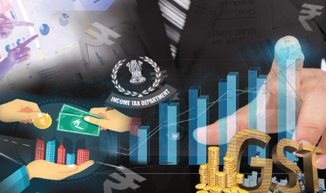

# பொருளியல் அலகு 4: அரசாங்கமும் வரிகளும்

## கற்றலின் நோக்கங்கள்

- வளர்ச்சிக் கொள்கைகள் மற்றும் அரசாங்கத்தின் பங்கு பற்றி புரிந்துகொள்ளுதல்

- வரி மற்றும் அதன் வகைகளைப் பற்றிய அறிவைப்பெறுதல்

- வரி எவ்வாறு விதிக்கப்படுகிறது என்பதைப் பற்றிப்படித்தல்

- கருப்பு பணத்திற்கும், வரி ஏய்ப்பிற்கும் உள்ள நோக்கத்திற்கான அறிவைப்பெறுதல்

- வரிக்கும், மற்ற கட்டணத்திற்கும் உள்ள வேறுபாட்டை தெரிந்துகொள்ளுதல்

- வரிகளும் அவற்றின் முன்னேற்றம் பற்றியும் புரிந்துகொள்ளுதல்

## அறிமுகம்

ஒரு நாட்டின் பொருளாதாரத்தை முன்னேற்றம் அடையச் செய்வதற்கு அரசாங்கத்தால் வரி விதிக்கப்படுகிறது. அரசின் வருமானம் நேர்முக மற்றும் மறைமுக வரிகளைச் சார்ந்து உள்ளது. நேர்முக வரியானது தனி நபரின் வருமானத்திலும், மறைமுக வரியானது பண்டங்கள் மற்றும் பணிகள் மீதும் விதிக்கப்படுகின்றன. இதன் மூலம் அரசாங்கம் அதன் “நிதி ஆதாரங்களை” திரட்டுகிறது.

## 4.1 வளர்ச்சிக் கொள்கைகளில் அரசாங்கத்தின் பங்கு

1. பாதுகாப்பு (அ) இராணுவம் எதிரிகளிடமிருந்து நாட்டைப் பாதுகாப்பது இராணுவத்தின் அத்தியாவசியப் பணியாகக் கருதப்படுகிறது. பாதுகாப்புப் படைகளைஉருவாக்குவதற்கும், பராமரிப்பதற்கும் நடுவண் அரசாங்கமே பொறுப்பாகும்.

2. அயல்நாட்டுக் கொள்கை இன்றைய உலகில் நாம் அனைத்து உலக நாடுகளுடனும் நட்பான உறவைப் பராமரித்தல் அவசியமானதாகும். ஏற்றுமதி மற்றும் இறக்குமதி செய்வதன் மூலமும், மூலதனம் மற்றும் உழைப்பைப் பரிமாற்றம் செய்வதன் மூலமும் நாம் நல்ல பொருளாதார உறவினை பராமரிக்க முடியும். இந்த சேவையை நடுவண் அரசாங்கம் வழங்குகிறது.

3. குறிப்பிட்ட கால இடைவெளிகளில் தேர்தல்களை நடத்துதல் இந்தியா ஒரு ஜனநாயக நாடு. நாம் நாடாளுமன்றத்திற்கும் சட்டமன்றத்திற்கும் பிரதிநிதிகளை தேர்ந்தெடுக்கின்றோம். இதேபோல், மாநில அரசுகள் உள்ளாட்சி மன்றங்களுக்குத் தேர்தலை மாநிலத்திற்குள் நடத்துகிறது. 4. சட்டம் மற்றும் ஒழுங்குநடுவண் மற்றும் மாநில அரசுகள் நமது உரிமைகள், சொத்துக்களைப் பாதுகாப்பதற்கும், நமது பொருளாதாரம் மற்றும் சமூகத்தை ஒழுங்குபடுத்துவதற்கும் ஏராளமான சட்டங்களை இயற்றுகின்றன. பிரச்சனைகளைத் தீர்ப்பதற்காக நீதிமன்றங்களை அமைத்துள்ளன. மேலும், அந்தந்த மாநிலங்களில் காவல் துறையை நிருவகிக்கும் பொறுப்பை மாநில அரசுகள் ஏற்றுக் கொள்கின்றன. 5. பொது நிருவாகம் மற்றும் பொதுப்பண்டங்களை வழங்குதல் அரசாங்கம் பொதுவாக பல்வேறு துறைகள் மூலம் பொருளாதாரத்தையும் சமூகத்தையும் நிருவகிக்கிறது. வருவாய்த் துறை, பள்ளிகள், மருத்துவமனைகள், கிராம வளர்ச்சி மற்றும் நகர்ப்புற வளர்ச்சி போன்றவைகள் எடுத்துக்காட்டுகளாகும். உள்ளூர் அரசாங்கங்கள், உள்ளூர் சாலைகள், வடிகால், குடிநீர், குப்பை சேகரிப்பு மற்றும் அகற்றல் போன்ற பொதுப்பணிகளை வழங்குகின்றன. 6. வருமான மறுபகிர்வும் வறுமை ஒழிப்பும்முன்னதாக குறிப்பிடப்பட்ட பல்வேறு நடவடிக்கைகளுக்கு நிதியளிக்க அரசாங்கங்கள் பல்வேறான வரிகளை வசூலிக்கின்றன. அதிக வருமானம் உடையவர்கள் ஏழைகளை விட அரசாங்கத்திற்கு அதிகவரி செலுத்தக்கூடிய வகையில் வரி வசூலிக்கப்படுகிறது. சில அடிப்படைத் தேவைகளான உணவு, தங்குமிடம், உடை, கல்வி, சுகாதாரப் பாதுகாப்பு மற்றும் மாத வருமானம் போன்றவற்றினை ஏழைகளுக்கு வழங்குவதற்காக அரசாங்கம் பணத்தைச் செலவிடுகின்றது. மேலும், வறுமையைக் குறைப்பதற்கான நடவடிக்கைகளையும் செயல்படுத்துகிறது.

7. பொருளாதாரத்தை ஒழுங்குபடுத்துதல்நடுவண் அரசு, பணத்தின் அளிப்பு, வட்டி வீதம், பணவீக்கம் மற்றும் அந்நிய செலாவணி விகிதம் ஆகியவற்றை இந்திய ரிசர்வ் வங்கி மூலம் கட்டுப்படுத்துகிறது. இதன் விகிதங்களில் அதிக ஏற்ற இறக்கங்களை களைவதே மையவங்கியின் முக்கிய நோக்கமாகும். இந்தியப் பங்கு மற்றும் பரிவர்த்தனை வாரியம் (SEBI) மற்றும் இந்திய போட்டி ஆணையம் (CCI) போன்ற பல்வேறு முகமைகள் மூலமாகவும் நடுவண் அரசு பொருளாதாரத்தைக் கட்டுப்படுத்துகிறது.

### வரி அமைப்பு

ஒவ்வொரு வகையான வரியும் சில நன்மைகளையும் தீமைகளையும் பெற்றுள்ளன. நாம் கொண்டுள்ள வரி அமைப்பு, பல்வேறு வகையான வரிகளின் தொகுப்பாகும். ஆடம் ஸ்மித் முதல் பல பொருளாதார வல்லுநர்கள் வரி விதிப்புக் கொள்கைகளைக் கொடுத்துள்ளனர். அவைகளில் பொதுவான வகைகளை இங்கு நினைவு கூறுவது முக்கியமானதாகும்.

1. சமத்துவ விதி வரி ஒரு கட்டாயக் கட்டணம் என்பதால், வரி முறையை வடிவமைப்பதில் சமத்துவம் என்பது முதன்மை என்பதை அனைத்துப் பொருளாதார வல்லுநர்களும் ஒப்புக்கொள்கிறார்கள். பணக்காரர்கள் ஏழைகளை விட அரசாங்கத்திற்கு அதிக வரி வருவாயை செலுத்தவேண்டும், ஏனென்றால் ஏழைகளை விட பணக்காரர்களுக்கு அதிக வரி செலுத்தும் திறன் உள்ளது.

2. உறுதி விதி ஒவ்வொரு வரி செலுத்துவோரும் ஒரு ஆண்டில் எவ்வளவு வரித்தொகையை அரசாங்கத்திற்கு செலுத்த வேண்டும் என்பதைக் கணக்கிட ஒவ்வொரு அரசாங்கமும் வரி முறையை முன் கூட்டியே அறிவிக்க வேண்டும்.

3. சிக்கன மற்றும் வசதி விதி வரி எளிமையானதாக இருந்ததால், வரி வசூலிப்பதற்கான செலவு (வரி செலுத்துவோர் செலவு + வரி வசூலிப்போர் செலவு) மிகக் குறைவாக இருக்கும். மேலும், ஒரு நபருக்கு வரி செலுத்தப் போதுமான பணம் கிடைக்கும் நேரத்தில் வரி வசூலிக்கப்பட வேண்டும். இது வசதிக்கான வரி என்று அழைக்கப்படுகிறது. ஒரு வசதியான வரி, வரி வசூலிக்கும் செலவை குறைக்கிறது.

4. உற்பத்தித் திறன் மற்றும் நெகிழ்ச்சி வரி அரசாங்கம் போதுமான வரி வருவாயைப் பெறக்கூடிய வரிகளைத் தெரிவு செய்ய வேண்டும். நிறைய வரிகளுக்குப் பதிலாக அதிக வரி வருவாயைப் பெறக் கூடிய சில வரிகளைத் தெரிவு செய்ய வேண்டும். இது உற்பத்தித் திறன் வரியாகும். மக்கள் தங்கள் வருமானத்திலிருந்து வரி செலுத்துகிறார்கள். எனவே , மக்கள் வருமானம் அதிகரித்ததால் தானாகவே அதிக வரி வருவாயை செலுத்தும் வகையில் வரி அமைப்பு வடிவமைக்கப்பட வேண்டும். இது நெகிழ்ச்சி வரி எனப்படுகிறது.

இந்தியாவில் உள்ள அனைத்து அரசாங்க நிறுவனங்கள் மற்றும் பொதுத்துறை நிறுவனங்கள் மலிவுவிலையில் அத்தியாவசியமான பொருள்களையும் சேவைகளையும் மக்களுக்கு வழங்குகின்றன.

## 4.2 வரி

என்ற சொல் "வரிவிதிப்பு" என்பதிலிருந்து உருவானது. இதன் பொருள் மதிப்பீடு என்பதாகும்.

### வ வ வ வ வ வ

வரி விதிப்பு என்பது அரசாங்கம் தனது செலவினங்களுக்காகப் பொது மக்களிடமும், பெரு நிறுவனங்களிடமும் வரிகளை விதித்து வருவாயை உருவாக்கும் ஒரு வழிமுறையாகும். அரசுக் கட்டமைப்பின் செயல்பாட்டிற்காக வரியின் மூலம் நிதி திரட்டுவது வரிவிதிப்பின் முக்கிய நோக்கமாகும். வரிவிதிப்பு முறை “நல அரசு” என்ற கருத்தை மையமாகக் கொண்டு செயல்படுகிறது. வரிகள் என்பவை எந்த வித எதிர்பார்ப்பும் இன்றி நேரடியாக அரசாங்கத்திற்கு செலுத்துகின்ற கட்டாய கட்டணமேயாகும். பேராசிரியர் செலிக்மேன் கருத்துப்படி, “வரி என்பது ஒரு குடிமகன் அரசுக்குக் கட்டாயமாக செலுத்தும் செலுத்துகையாகும். அரசிடமிருந்து எந்தவித நேரடி நன்மையும் எதிர்பார்க்காமல் கட்டாயமாகச் செலுத்த வேண்டியதே வரி" என வரையறை கூறுகிறார். வரிகள் ஏன் விதிக்கப்படுகிறன்றன?

வரலாற்றுக் காலத்திலிருந்ததே நாடுகளும் அதற்கு இணையாக செயல்படும் அரசுகளும் வரிவிதிப்பின் மூலம் பெற்ற நிதியிலிருந்ததே பல செயல்களை நிறைவேற்றியிருக்கின்றன. அவைகளில் சில பொருளாதார உள்கட்டமைப்புச் செலவுகள், (போக்குவரத்து, சுகாதாரம், பொதுப் பாதுகாப்பு, கல்வி, உடல்நலம்) இராணுவம், அறிவியல் ஆராய்ச்சி, கலாச்சாரம், கலைகள், பொதுப்பணிகள், பொதுக் காப்பீடுகள் மற்றும் அரசாங்க செயல்பாடுகள் போன்றவைகளாகும். வரிகளை உயர்த்துவதற்கான அரசாங்கத்தின் திறன் ‘நிதித் திறன்’ என்று கூறப்படுகிறது.

செலவானது, வரி வருவாயைவிட அதிகமாக இருக்கும்போது ஒரு அரசாங்கம் கடனைத் திரட்டுகிறது. வரிகளின் ஒரு பகுதி கடந்த காலப் பணிகளுக்கான கடன்களுக்குப் பயன்படுத்தப்படலாம். அரசாங்கம் மக்களின் நலனிற்கும் பொதுச் சேவைகளுக்கும் வரிகளைப் பயன்படுத்தலாம்.

இந்தச் சேவைகளில் கல்வி முறைகள், முதியோருக்கான ஓய்வூதியம், வேலையின்மை சலுகைகள் மற்றும் பொதுப் போக்குவரத்து ஆகியவை அடங்கும். ஆற்றல், நீர் மற்றும் கழிவு மேலாண்மை ஆகியவைமக்களுக்கான பயன்பாடுகளாகும்.

## 4.3 வரிகளின் வகைகள்

### நேர்முக வரிகள்

நேர்முக வரி என்பது ஒரு தனிநபர் அல்லது நிறுவனத்தின் மீது நேரடியாக விதிக்கப்படுவதாகும். இவ்வரியை மற்றவர் மீது மாற்ற முடியாது. பேராசிரியர் ஜே.எஸ். மில்லின் கருத்துப்படி, நேர்முக வரி என்பது “யார் மீது வரி விதிக்கப்பட்டதோ அவரே அவ்வரியை செலுத்துவதாகும். வரி செலுத்துபவரே வரிச்சுமையை ஏற்க வேண்டும்”. சில நேர்முக வரிகள்: வருமான வரி, சொத்து வரி மற்றும் நிறுவன வரி ஆகியனவாகும்.

இந்தியாவில் முதன்முதலாக வருமானவரி 1860ஆம் ஆண்டு சர் ஜேம்ஸ் வில்சன் என்பவரால் அறிமுகப்படுத்தப்பட்டது. 1857ஆம் ஆண்டு புரட்சியின் மூலம் ஏற்பட்ட இழப்புகளை ஈடுகட்ட அரசாங்கத்தின் மூலம் போடப்பட்ட ஆணையே வரி விதிப்பாகும்.

### வருமான வரி

வருமான வரி இந்தியாவில் விதிக்கப்படுகின்ற நேர்முக வரிகளில் மிக முக்கியமான வரியாகும். இவ்வரி தனிநபர் பெறுகின்ற வருமானத்தின் அடிப்படையில் விதிக்கப்படுகின்றது. இவ்வரி வசூலிக்கப்படும் விகிதம் வருமான அளவைப் பொறுத்து மாறுபடக்கூடியதாகும்.

வருமான வரி வலைதளத்தின் மூலம் நடப்பு ஆண்டிற்கான வருமான வரி அறிக்கையினைமாணவர்களை அறிந்து கொள்ளக் கூறுதல்.

### நிறுவன வரி

இந்த வரி தங்கள் பங்குதாரர்களிடமிருந்து தனி நிறுவனங்களாக இருக்கும் நிறுவனங்களுக்கு விதிக்கப்படுகிறது. இது இந்தியாவில் அமைந்துள்ள சிறப்பு உரிமைகளில், மூலதன சொத்துகளின் விற்பனையிலிருந்து வரும் வட்டி இலாபங்கள், தொழில் நுட்ப சேவைகள் மற்றும் ஈவுத் தொகைகளுக்கான கட்டணம் போன்றவற்றிலிருந்து வசூலிக்கப்படுகிறது. இந்த வரி வெளிநாட்டு நிறுவனங்கள் பெரும் வருமானத்தின் மீது விதிக்கப்படுகிறது.

| வருமானம் | இந்திய நிறுவனங்கள் | அயல்நாட்டு நிறுவனங்கள் |
|---|---|---|
| ` 50 கோ>ோடிக்குள் | 25% | 40% |
| ` 50 கோ>ோடிக்கு மேல் | 30% | 40% |

### சொத்து வரி அல்லது செல்வ வரி

சொத்து வரி (அ) செல்வ வரி என்பது தனது சொத்திலிருந்து பெறப்பட்ட நன்மைகளுக்காக சொத்தின் உரிமையாளருக்கு விதிக்கப்படுகின்ற வரியாகும். ஒவ்வொரு ஆண்டும் சொத்தின் நடப்பு சந்தை மதிப்பின் அடிப்படையில் விதிக்கப்படுகிறது. இவ்வரி தனிநபர்கள் மற்றும் நிறுவனங்களின் மீது விதிக்கப்படும்.

இந்தியாவில் அரசாங்கத்தினால் மூன்று அடுக்குகள் வரி வசூலிக்கப்படுகிறது. நடுவண் அரசால் எளிதில் வசூலிக்கக்கூடிய வரிகள் உள்ளன. இந்தியாவில் கிட்டத்தட்ட அனைத்து நேரடி வரிகளும் நடுவண் அரசால் வசூலிக்கப்படுகின்றன. பொருள்கள் மற்றும் சேவைகளுக்கான வரி நடுவண் மற்றும் மாநில அரசாங்கங்களால் வசூலிக்கப்படுகிறது. சொத்துகளுக்கான வரி உள்ளூர் அரசாங்கங்களால் வசூலிக்கப்படுகிறது.

இந்தியாவில் நேரடி வரிகளை விட மறைமுக வரி மூலம் அதிக வருவாய் வசூலிக் கப்படுகின்றது. இந்தியாவின் முக்கிய மறைமுக வரி சுங்க வரியும் பண்டங்கள் மற்றும் பணிகள் வரியும் (GST) ஆகும்.

### மறைமுக வரிகள்

ஒருவர் மீது விதிக்கப்பட்ட வரிச்சுமை மற்றொருவருக்கு மாற்றப்பட்டால் அது "மறைமுகவரி" எனப்படும். வரி விதிக்கப்பட்டவர் ஒருவர், வரிச் சுமையை சுமப்பவர் வேறு ஒருவராவார். ஆகையால், மறைமுகவரியில் வரியைச் செலுத்துபவர் வரிச் சுமையை சுமப்பவர் அல்லர்.

சில மறைமுக வரிகளாவன: முத்திரைத் தாள் வரி, பொழுதுபோக்கு வரி, சுங்கத் தீர்வை மற்றும் பண்டங்கள் மற்றும் பணிகள் (GST) மீதான வரிகளாகும். முத்திரைத்தாள் வரி முத்திரைத்தாள் வரி என்பது அரசாங்க ஆவணங்களான திருமணப் பதிவு அல்லது சொத்து தொடர்பான ஆவணங்கள் மற்றும் சில ஒப்பந்தப் பத்திரங்கள் போன்றவைகள் மீது விதிக்கப்படுவதாகும். பொழுதுபோக்கு வரி எந்தவொரு பொழுதுபோக்கு மூலமாக இருந்தாலும், அதன் மீது அரசாங்கத்தால் விதிக்கப்படுகின்ற வரி பொழுதுபோக்கு வரியாகும். உதாரணமாக திரைப்படங்கள் பார்ப்பதற்காக விதிக்கப்படுகின்ற கட்டணம், பொழுது போக்குப் பூங்காக்கள், பொருட்காட்சி, விளையாட்டு அரங்கம், விளையாட்டு நிகழ்ச்சிகள் ஆகியவற்றைப் பார்ப்பதற்காக விதிக்கப்படுகின்ற வரி போன்றவையாகும்.

சுங்கத் தீர்வை அல்லது கலால் வரிசுங்கத் தீர்வை என்பது விற்பனையை விட, உற்பத்தியின் இயக்கத்தில் உள்ள எந்தவொரு உற்பத்திப் பொருட்களின் மீதும் விதிக்கப்படும் வரியாகும். இவ்வரி பொதுவாக விற்பனை வரி போன்ற மறைமுக வரிகளுக்குக் கூடுதலாக விதிக்கப்படுகிறது.

### பண்டங்கள் மற்றும் பணிகள் வரி (GST - Goods and Service Tax)

பண்டங்கள் மற்றும் பணிகள் வரி என்பது மறைமுக வரிகளில் ஒன்றாகும். இவ்வரி இந்தியப் பாராளுமன்றத்தில் மார்ச் 29, 2017ஆம் ஆண்டு நிறைவேற்றப்பட்டது. மேலும், ஜூலை 1, 2017 முதல் செயல்பட்டு வருகிறது. இதன் குறிக்கோள் "ஒரு நாடு- ஒரு அங்காடி-ஒரு வரி" என்பதாகும். இது மதிப்புக் கூட்டப்பட்ட வரி (VAT) போன்று ‘பல முனை வரி’ இல்லாமல் இது 'ஒரு முனை வரி' ஆகும்.

பண்டங்கள் மற்றும் பணிகள் வரியின் அமைப்பு (GST) மாநில பண்டங்கள் மற்றும் பணிகள் வரி (SGST): (மாநிலத்திற்குள்)

மதிப்புக் கூட்டு வரி (VAT) / விற்பனை வரி, கொள்முதல் வரி, பொழுதுபோக்கு வரி, ஆடம்பர வரி, பரிசுச்சீட்டு வரி, மற்றும் மாநிலக் கூடுதல் கட்டணம் மற்றும் வரிகள்.

### மத்திய பண்டங்கள் மற்றும் பணிகள் வரி (CGST): (மாநிலத்திற்குள்)

மத்திய சுங்கத்தீர்வை, சேவைவரி, ஈடுசெய்வரி, கூடுதல் ஆயத்தீர்வை, கூடுதல் கட்டணம், கல்விக் கட்டணம் (இடைநிலைக் கல்வி மற்றும் மேல்நிலைக் கல்வி வரி).

### ஒருங்கிணைந்த பண்டங்கள் மற்றும் பணிகள் வரி (IGST): (மாநிலங்களுக்கு இடையே )

நான்கு முக்கிய GST விகிதங்கள் உள்ளன. (5%, 12%, 18% மற்றும் 28%) காய்கறிகள் மற்றும் உணவு தானியங்கள் போன்ற வாழ்க்கைக்குத் தேவையான அத்தியாவசியப் பண்டங்களுக்கும் இந்த வரியிலிருந்து விலக்கு அளிக்கப்படுகின்றன.

1954ஆம் ஆண்டு முதன்முதலில் பண்டங்கள் மற்றும் பணிகள் வரியைக் கொண்டு வந்த நாடு பிரான்ஸ் ஆகும்.

## 4.4 வரி எவ்வாறு விதிக்கப்படுகிறது?

வளர்வீத வரி விதிப்பு முறை, விகித வரி விதிப்பு முறை மற்றும் தேய்வுவீத வரி விதிப்பு முறை என அரசாங்கம் வரிகளை விதிக்கின்றது.

### வளர்வீத வரி விதிப்பு முறை

வளர்வீத வரி விதிப்பு முறையில் வரியின் அடிப்படைத் தளம் அதிகரிக்கும்போது (பெருக்கப்படும்) வரி விகிதமும் (பெருகி) அதிகரிக்கிறது. ஒரு வளர்வீத வரியைப் பொறுத்த வரையில் வருமானம் அதிகரிக்கும் போது, வரி விகிதமும் அதிகரிக்கிறது. எடுத்துக்காட்டு

| வரி அடிப்படை | வரி விகிதம் | வரி அளவு |
|---|---|---|
| `10,000 | 10% | `1000 |
| `20,000 | 15% | `3000 |
| `30,000 | 25% | `7500 |

### விகித வரி விதிப்பு முறை அல்லது விகிதாச்சார வரி விதிப்பு முறை

ஒரு நிலையான அளவில் பண்டங்கள் மற்றும் பணிகளுக்கு விதிக்கப்படும் வரி, விகித வரி விதிப்பு முறை எனப்படுகிறது. அனைத்து வரி செலுத்துவோரும், தங்கள் வருமானத்தில் அதே விகித்தில் பங்களிப்பு செய்கின்றனர்.

### எடுத்துக்காட்டு

| வரி அடிப்படை | வரி விகிதம் | வரி அளவு |
|---|---|---|
| `10,000 | 10% | `1000 |
| `20,000 | 10% | `2000 |
| `30,000 | 10% | `3000 |

### தேய்வுவீத வரி விதிப்பு முறை

இது அதிக வருமானம் ஈட்டுபவர்களை விட, குறைந்த வருமானம் ஈட்டுபவர்களிடம் அதிகவரி விகிதம் விதிப்பதைக் குறிக்கிறது. இது வளர்வீத வரி விதிப்பு முறைக்கு எதிரானதாகும்.

| வளர்வீத வரி விதிப்பு | விகித வரி விதிப்பு | தேய்வுவீத வரி விதிப்பு |
|---|---|---|
| வருமான அதிகரிப்பு | வருமான அதிகரிப்பு | வருமான மாற்றம் |
| வரியும் அதிகரிக்கும் | வரி குறையும் | எப்போதும் ஒரே வரி |
| எ.கா. வருமான வரி | எ.கா. நிறுவன வரி | எ.கா. விற்பனை வரி |

## 4.5 கருப்புப் பணம் (Black Money)

### கருப்புப் பணம்

கருப்புப் பணம் என்பது, கருப்பு சந்தையில் ஈட்டப்பட்ட வருமானம் மற்றும் செலுத்தப்படாத வரிப் பணமாகும். வரி நிர்வாகியிடமிருந்து மறைக்கப்பட்ட, கணக்கிடப்படாத பணம் "கருப்புப் பணம்" என்று அழைக்கப்படுகிறது. கருப்புப் பணத்திற்கான காரணங்கள் கருப்புப் பணத்திற்கு பல காரணங்கள் உள்ளன. அவை 1. பண்டங்கள் பற்றாக்குறை 2. உரிமம் பெறும் முறை 3. தொழில் துறையின் பங்கு 4. கடத்தல் 5. வரியின் அமைப்பு

## 4.6 வரி ஏய்ப்பு (Tax Evasion)

தனிநபர்கள், நிறுவனங்கள் மற்றும் அறக்கட்டளைகள் ஆகியவை சட்ட விரோதமாக வரி செலுத்தாமல் இருப்பது வரி ஏய்ப்பு எனப்படும். வரி ஏய்ப்பு நடவடிக்கைகளில் சேர்க்கப்பட்டுள்ளவை

- வருமானத்தை குறைத்து மதிப்பிடுதல்

- விலக்குகள் அல்லது செலவுகளைஉயர்த்துவது.

- மறைக்கப்பட்ட பணம்.

- கடல் கடந்த கணக்குகளில் விவரங்களை மறைத்தல்.

### வரி ஏய்ப்பும், அபராதமும்

1. ஒரு நபர் வரி ஏய்ப்பு செயலைத் தெரிந்ததே செய்ததால், அவர் ஐந்து ஆண்டுகள் வரை சிறைத் தண்டனையும், கடுமையான குற்றச்சாட்டுகளை சந்திக்கவும் அதிக அளவு அபராதமும் செலுத்த நேரிடும்.

2. பிரதிவாதிகள், வழக்கு விசாரணைக்கான செலவுகளைச் செலுத்த உத்தரவிடப்படலாம்.

3. வரிஏய்ப்பிற்கான அபராதம், குற்றத்தின் தன்மை, மற்றும் அதன் தீவிரத்தினைப் பொறுத்து கடுமையானதாக இருக்கும்.

## 4.7 வரிகளும் முன்னேற்றமும்

பொருளாதாரத்தை முன்னேற்றுவதில் வரி விதிப்பின் பங்கு பின்வருமாறு. 1. வளங்களைத் திரட்டுதல் வரிவிதிப்பு அரசாங்கத்திற்கு கணிசமான அளவிற்கு வருவாய் திரட்டுவதற்கு உதவுகிறது. குறிப்பாக நேர்முக வரிகளான தனிநபர் வருமானவரி, நிறுவனவரி மற்றும் மறைமுக வரிகளான ஆயத்தீர்வை, சுங்கவரி ஆகியவற்றின் மூலமாக வருவாய் திரட்டப்படுகிறது.

2. வருமான ஏற்றதாழ்வுகளை குறைத்தல்வரியின் மூலம் சமத்துவமுறையை உருவாக்கலாம். குறிப்பாக, நேர்முக வரியில் வளர்வீத வரி முறை பின்பற்றப்படுகிறது. அதேபோல சில மறைமுக வரியான ஆடம்பரப் பண்டங்களின் மீது விதிக்கப்படும் வரி வளர்வீத வரியின் தன்மையுடையதாகும்.

3. சமூக நலன்வரி விதிப்பு சமூக நலனை உருவாக்குகிறது. சில விரும்பத்தகாத பொருள்களான மதுபானங்கள் போன்ற பொருள்களின் மீது அதிகமாக வரி விதிப்பதன் மூலம் சமூக நலன் பாதுகாக்கப்படுகிறது.

4. அந்நியச் செலாவணிவரிவிதிப்பு ஏற்றுமதியை ஊக்குவிப்பதுடன் இறக்குமதியைத் தடுக்கிறது. பொதுவாக, வளரும் நாடுகளும் வளர்ந்த்த நாடுகளும் ஏற்றுமதி பொருள்களுக்கு வரி விதிப்பதில்லை.

### வரிக்கும் கட்டணத்திற்கும் உள்ள வேறுபாடுகள்

| வரி (Tax) | கட்டணம் (Payment) |
|---|---|
| வரி என்பது எந்தவித பிரதிபலனும் எதிர்பார்க்காமல் அரசாங்கத்திற்குக் கட்டாயமாக செலுத்துகின்ற செலுத்துகையாகும். | கட்டணம் என்பது பணிகளைப் பயன்படுத்துவதற்காக செலுத்துவதாகும். |
| பொதுவாக அரசாங்கத்தின் வருமான இனங்களில் ஒன்றாக வரி மேலோங்கியுள்ளது. | கட்டணம் என்பது ஒரு குறிப்பிட்ட நன்மைகளுக்கான தனிச் சலுகைகளைப் பெற்றிருந்தாலும், பொது நல ஒழுங்கு முறையின் சிறப்பான முதன்மை நோக்கமாகும். |
| வரி என்பது கட்டாய செலுத்துகை ஆகும். | கட்டணம் (Fee) என்பது தன்னார்வமாக செலுத்துவதாகும் |
| ஒரு தனிப்பட்ட நபரின் மீது வரி விதிக்கப்பட்டால், அதனை அவர் செலுத்த வேண்டும். இல்லையெனில் அவர் தண்டிக்கப்படுவார். | மாறாக, பணிகளைப் பெற விருப்பமில்லை எனில் கட்டணம் செலுத் தேவையில்லை. |
| வரி செலுத்துபவர்கள் நேரடியாக எவ்வித சலுகைகளையும் எதிர்பார்க்க முடியாது. உதாரணம்: வருமான வரி, அன்பளிப்பு வரி, சொத்து வரி மற்றும் மதிப்புக் கூட்டு வரி (VAT). | கட்டணம் செலுத்துவதன் மூலம் நுகர்வோர்கள், நேரடியாக சலுகைகளைப் பெறுகின்றனர். உதாரணம்: முத்திரை வரி, ஓட்டுநர் உரிமக் கட்டணம், அரசாங்க பதிவுக் கட்டணம். |

### பாடச்சுருக்கம்

- நேர்முக வரி என்பது நடுவிண் அரசுக்கு அல்லது மாநில அரசுக்கு அல்லது உள்ளாட்சி அமைப்புகளுக்கு நேரடியாகச் செலுத்தும் வரியாகும். இதில் வருமான வரி, சொத்துவரி ஆகியன அடங்கும்.

- வருமான வரி தனி நபர்கள் மற்றும் தொழில் செய்பவர்களால் ஈட்டப்பட்ட மற்றும் ஈட்டப்படாத வருமானங்களின் அடிப்படையில் விதிக்கப்படுகிறது.

- உள்ளூர் வரி என்பது உள்ளாட்சி அமைப்பு அல்லது அரசின் மூலம் ஒரு நகரம் அல்லது ஒரு நாட்டின் எல்லைக்குள் விதிக்கப்படுகின்ற வரியாகும்.

5. வட்டார முன்னேற்றம் வட்டார வளர்ச்சியில் வரி விதிப்பு முக்கியப் பங்கு வகிக்கிறது. பின் தங்கிய பகுதிகளில் தொழில் நிறுவனங்கள் அமைப்பதற்காக வரிச் சலுகையையும், வரி விலக்குகளையும் அளிப்பதன் மூலம், அப்பகுதிகளில் தொழிற்சாலைகளை அமைப்பதற்கு வணிக நிறுவனங்களைத் தூண்டுகிறது.

6. பணவீக்கத்தைக் கட்டுப்படுத்தல் வரி என்பது பணவீக்கத்தைக் கட்டுப்படுத்தும் கருவிகளுள் ஒன்றாக பயன்படுத்தப்படுகிறது. அரசாங்கம் பண்டங்கள் மீதான வரி விகித்ததை குறைப்பதன் மூலம் பணவீக்கத்தைக் கட்டுப்படுத்த முடியும்.

### கலைச்சொற்கள்

| வரி (விதிப்பு) | Levied | To impose taxes |
|---|---|---|
| ஏற்ற இறக்கம் | Fluctuation | To change |
| ெசலவை ஈடுகட்ட | Defray | Meet the expenses |
| ெகாள்கை ெமாழிேவார் | Proponents | Person who advocates theory |
| வளர்வீத வரி | Progressive Tax | Happening or developing gradually or in stages |
| குறைவீத வரி | Regressive Tax | Taking a proportionally greater amount from those on lower incomes. |
| ஒரேவீத வரி | Proportionate Tax | (of a variable quantity) having a constant ratio to another quantity. |
| ஏய்ப்பு | Evasion | The action of evading something |

### பயிற்சி

### I சரியான விடையைதேர்ந்தெடுத்து எழுதுக

1. இந்தியாவிலுள்ள மூன்று நிலைகளான அரசுகள் அ) நடுவண், மாநில மற்றும் உள்ளாட்சி ஆ) நடுவண், மாநில மற்றும் கிராம இ) நடுவண், நகராட்சி மற்றும் பஞ்சாயத்து ஈ) ஏதுமில்லை

2. இந்தியாவில் உள்ள வரிகள் அ) நேர்முக வரிகள் ஆ) மறைமுக வரிகள் இ) இரண்டும் (அ) மற்றும் (ஆ)

ஈ) ஏதுமில்லை

3. வளர்ச்சிக் கொள்கையில் அரசாங்கத்தின் பங்கு எது ?

அ) பாதுகாப்பு ஆ) வெளிநாட்டுக் கொள்கை இ) பொருளாதாரத்தை கட்டுப்படுத்தல் ஈ) மேற்கூறிய அனைத்தும்

4. இந்தியாவில் தனி நபர்களின் மேல் விதிக்கப்படுகின்ற பொதுவான மற்றும் மிக முக்கியமான வரி அ) சேவை வரி ஆ) கலால் வரி இ) வருமான வரி ஈ) மத்திய விற்பனை வரி

5. ஒரு நாடு, ஒரே மாதிரியான வரி என்பதை எந்த வரி உறுதிப்படுத்துகிறது?

அ) மதிப்புக் கூட்டு வரி (VAT)

ஆ) வருமான வரி இ) பண்டங்கள் மற்றும் பணிகள் வரி ஈ) விற்பனை வரி

6. இந்தியாவில் வருமான வரிச்சட்டம் முதன் முதலில் ஆம் ஆண்டு அறிமுகப்படுத்தப்பட்டது.

அ) 1860 ஆ) 1870 இ) 1880 ஈ) 1850

7. சொத்து உரிமையிலிருந்து பெறப்பட்ட நன்மைகளுக்கு வரி விதிக்கப்படுகிறது.

அ) வருமான வரி ஆ) சொத்து வரி இ) நிறுவன வரி ஈ) கலால் வரி

8. கருப்புப் பணத்திற்கான காரணங்கள் எனக் கண்டறியப்பட்ட அடையாளம் எது?

அ) பண்டங்களின் பற்றாக்குறை ஆ) அதிக வரி விகிதம் இ) கடத்தல் ஈ) மேற்கூறிய அனைத்தும்

### II கோடிட்ட இடங்களை நிரப்புக

1. மாநிலங்களின் பொருளாதார வளர்ச்சிக்காக அரசால் விதிக்கப்படுகிறது.

2. “வரி” என்ற சொல் சொல்லிலிருந்து பெறப்பட்டது.

3. வரியில் வரியின் சுமையை மற்றவர்களுக்கு மாற்ற முடியாது.

4. பண்டங்கள் மற்றும் பணிகள் வரி ஆண்டு முதல் நடைமுறைக்கு வந்தது.

5. வரி நிருவாகியிடமிருந்து மறைக்கப்பட்ட, கணக்கிடப்படாத பணம் என்று அழைக்கப்படுகிறது.

### III சரியான கூற்றைத் தேர்ந்தெடுக்கவும்

1. GST பற்றி கீழ்க்காணும் கூற்றுகளில் எது சரியானது?

i) GST ‘ஒரு முனைவரி’ ii) இது மத்திய மற்றும் மாநில அரசாங்கங்களால் பொருட்கள் மற்றும் சேவைகளுக்கு விதிக்கப்படும் அனைத்து நேரடி வரிகளையும் மாற்றுவதை நோக்கமாகக் கொண்டுள்ளது iii) இது ஜூலை 1, 2017 முதல் நாடு முழுவதும் அமுல்படுத்தப்பட்டது.

iv) இது இந்தியாவில் வரி கட்டமைப்பை ஒன்றிணைக்கும்.

அ) (i) மற்றும் (ii) சரி ஆ) (ii), (iii) மற்றும் (iv) சரி இ) (i), (iii) மற்றும் (iv) சரி ஈ) மேற்கூறிய அனைத்தும் சரியானவை .

### IV பொருத்துக

1. வருமான வரி - மதிப்புக் கூட்டு வரி

2. ஆயத்தீர்வை - ஜூலை 1, 2017

3. VAT - கடத்துதல்

4. GST - நேர்முக வரி

5. கருப்புப் பணம் - மறைமுக வரி

### V கீழ்க்காணும் வினாக்களுக்கு குறுகிய விடையளி

1. வரி வரையறுக்க.

2. அரசுக்கு ஏன் வரி செலுத்த வேண்டும்?

3. வரிகளின் வகைகள் யாவை? எடுத்துக்காட்டு தருக.

4. பண்டங்கள் மற்றும் பணிகள் வரி – சிறு குறிப்பு வரைக.

5. வளர்வீத வரி என்றால் என்ன?

6. கருப்புப் பணம் என்பதன் பொருள் என்ன?

7. வரி ஏய்ப்பு என்றால் என்ன?

8. வரிக்கும் கட்டணத்திற்கும் இடையே உள்ள இரண்டு வேறுபாடுகளைப் பட்டியலிடுக.

### VI கீழ்க்காணும் வினாக்களுக்கு விரிவான விடையளி

1. சில நேர்முக மற்றும் மறைமுக வரிகளை விளக்குக.

2. GST யின் அமைப்பை எழுதுக.

3. கருப்புப் பணம் என்றால் என்ன? அதற்கான காரணங்களைக் கூறுக.

### VII செய்முறைகளும் செயல்பாடுகளும்

1. உள்ளூரில் விதிக்கப்படும் வரிகளைப் பற்றிய விவரங்களை சேகரிக்கவும். (குடிநீர், மின்சாரம், வீட்டுவரிகள் போன்றவைகள்).

2. மாணவர்கள் சில புத்தகங்களை அங்காடிகளில் வாங்கும்படி கூறுதல். ஆசிரியர் மற்றும் மாணவர்கள் அப்புத்தகங்களின் அதிகபட்ச சில்லரை விலையையும், வாங்கும் விலை அல்லது GST பற்றி அறிதல்.

### மேற்கோள் நூல்கள்

1. நிதியியல் பொருளாதாரம் - சங்கரன்

2. பொது நிதியியல் - H.L. பாட்டியா

3. வரிவிதிப்பும் வரிச் சட்டங்களும் - T சிவகுமார்

4. இந்தியப் பொதுநிதியியல் பிரச்சனைகள் - D.K. ஸ்ரீ வஸ்தவா

### இணையதள வளங்கள்

1. உலக வங்கி அறிக்கை 2018

2. www.GST.in

