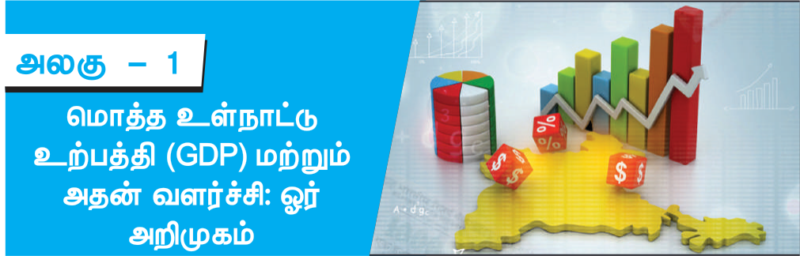
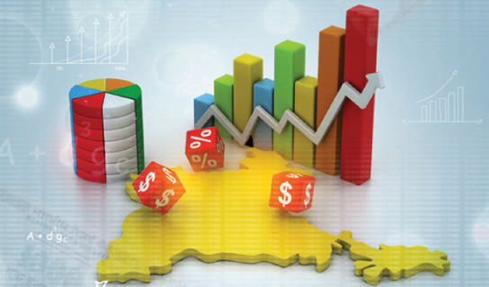
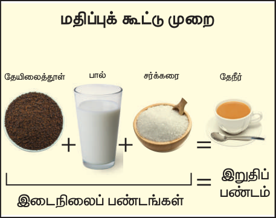
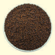
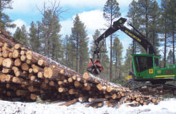
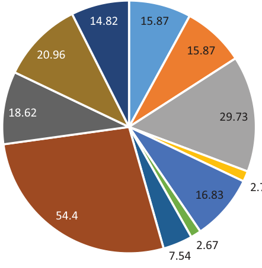
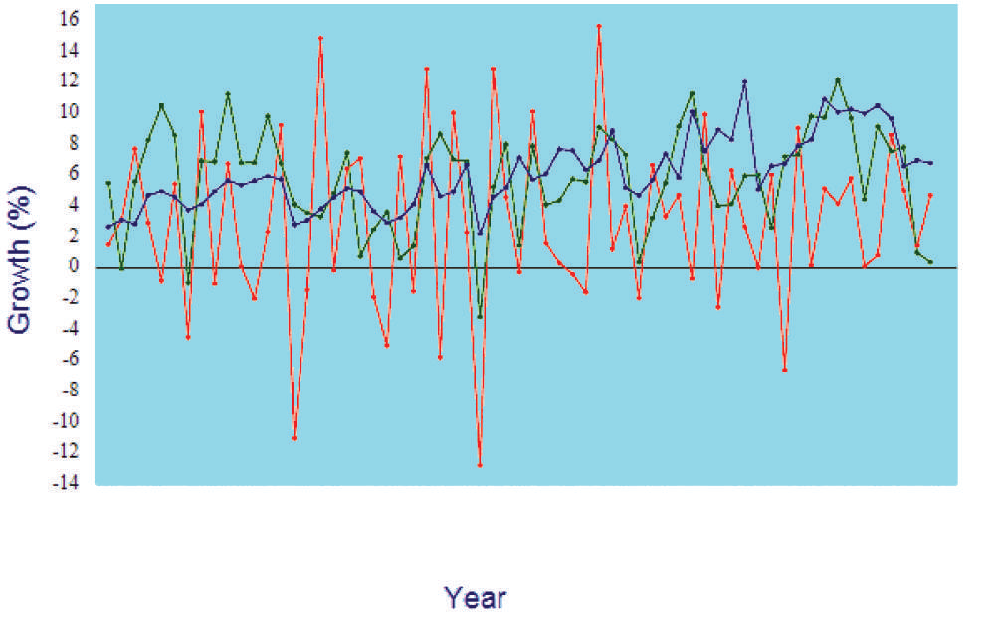
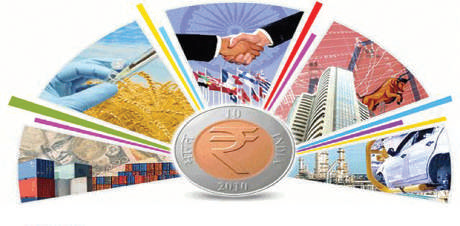

# பொருளியல் அலகு 1: மொத்த உள்நாட்டு உற்பத்தி (GDP) மற்றும் அதன் வளர்ச்சி: ஓர் அறிமுகம்

## கற்றலின் நோக்கங்கள்

- மொத்த உள்நாட்டு உற்பத்தியைப் பற்றி தெரிந்துகொள்ளுதல்

- நாட்டு வருமானத்தின் பல்வேறு நடவடிக்கைகளை புரிந்துகொள்ளுதல்

- மொத்த உள்நாட்டு உற்பத்தியின் அமைப்பை புரிந்துகொள்ளுதல்

- மொத்த உள்நாட்டு உற்பத்தியில் பல்வேறு துறைகளின் பங்களிப்பை தெரிந்துகொள்ளுதல்

- பொருளாதார வளர்ச்சி, முன்னேற்றம் மற்றும் அதன் வேறுபாடுகள் பற்றி அறிந்துகொள்ளுதல்

- மொத்த உள்நாட்டு உற்பத்தி மற்றும் வேலைவாய்ப்பு அடிப்படையில் வளர்ச்சி பாதைப் பற்றி தெரிந்துகொள்ளுதல்

- மொத்த உள்நாட்டு உற்பத்தி மற்றும் பொருளாதார கொள்கைகளின் வளர்ச்சிப் பற்றி புரிந்துகொள்ளுதல்

## அறிமுகம்

இந்தியப் பொருளாதாரம் எவ்வாறு செயல்படுகிறது என்பதனை மொத்த உள்நாட்டு உற்பத்தி (GDP- Gross Domestic Product) விளக்குகிறது. அதனால், GDP என்றால் என்னஎன்பதைப் பற்றி முதலில் நீங்கள் புரிந்துக் கொள்ள வேண்டும்.

ஒரு உணவகத்தில் என்னநடக்கிறது என்பதை கற்பனை செய்க. இரண்டு இட்டிலிகள் மற்றும் ஒரு கோப்பை தேநீருக்கு நீங்கள் உத்தரவு இடுகிறீர்கள். இட்டிலி மற்றும் தேநீரை யாரோ ஒருவர் உற்பத்தி செய்யலாம் மற்றும் யாராவது கூட அதை உங்களுக்கு சேவையாக செய்யலாம்.

வெளிப்படையாக இட்டிலி மற்றும் தேநீர் உற்பத்தி செய்யப்பட்டு இருக்கிறது. அவைகளைநீங்கள் தொடக்கூடியவை, பார்க்கக்கூடியவை மற்றும் தொட்டு உணரக்கூடியவைகளாகும் . தொடக்கூடிய பொருள்களை “பண்டங்கள்” என்று பொருளியல் அறிஞர்கள் அழைக்கின்றனர். இந்த பண்டங்கள் இலவசம் அல்ல, ஏனெனில் அதற்கு பணம் செலுத்த வேண்டும்.

தொடக்கூடிய பொருள்களை, பண்டங்கள் என்று அழைத்தாலும், சமையல்காரர்கள் செய்து

பமாபவ கேவா படக முடித்த வேலை மற்றும் அந்த உணவைப் பரிமாறும் மக்கள், சமையல் மற்றும் சேவை நடவடிக்கைகளை பண்டங்கள் போல் யாரும் தொட்டு உணரக் கூடியது அல்ல. ஆனால், நீங்கள் உணவினை உண்டு அனுபவிக்கலாம்.பொருளியல் ல்லுநர்கள் இந்த நடவடிக்கையை “பணிகள்” என்று அழைக்கின்றனர்.

ஒவ்வொரு நாளும் உணவகத்தில் என்னநடக்கிறதோ அதே போல் நாடு முழுவதும் நடக்கிறது. பண்டங்கள் மற்றும் பணிகள் உற்பத்தி செய்யப்பட்டு அதனை நாம் பணம் செலுத்திப் பெறுகின்றோம். இவற்றையே மொத்த உள்நாட்டு உற்பத்தி (GDP) அளவிடுகிறது.

### GDPயின் வரையறை / இலக்கணம்

ஒரு குறிப்பிட்ட காலத்தில் ஒரு நாட்டில் உற்பத்திச் செய்யப்படுகின்ற அனைத்துப் பண்டங்கள் மற்றும் பணிகளின் அங்காடி மதிப்பை மொத்த உள்நாட்டு உற்பத்தி (GDP) என்கிறோம்.

GDP = C + I + G + (X - M)

C – நுகர்வோர்   I – முதலீட்டாளர்

G – அரசு செலவுகள்  (X-M) ஏற்றுமதி – இறக்குமதி.

இந்த வரையறையில் ஒவ்வொரு பகுதியும் முக்கியமானதாகும்.

பண்டங்கள் மற்றும் பணிகள்: பண்டங்கள் என்பவை தொடக் கூடிய பொருளும், பணிகள் என்பவை தொட்டு உணர முடியாததுமான நடவடிக்கைகள் என்று இப்போது உங்களுக்கு தெரியும்.

அங்காடி மதிப்பு: அங்காடியில் விற்கக் கூடிய பண்டங்கள் மற்றும் பணிகளின் விலை. இறுதி நிலைப் பண்டங்கள் மற்றும் பணிகள்

“இறுதி நிலைப் பண்டங்கள் மற்றும் பணிகள்” என்பது நுகர்வுக்காக அல்லது பயன்பாட்டுக்காக உள்ள பண்டங்கள் மற்றும் பணிகள் ஆகும். எந்தப் பண்டங்கள் மற்றும் பணிகள் மற்றொரு பண்டப் பணிகளை உற்பத்தி செய்யப் பயன்படுகிறதோ மற்றும் மற்ற பண்டப் பணிகளைஉற்பத்தி செய்ய ஒரு பகுதியாகிறதோ அதை “இடை நிலை பண்டங்கள்” என்று டைலர் கோவன், அலெக்ஸ் டாபர்ராக் போன்ற பொருளியல் ல்லுநர்கள் கூறுகின்றனர்.

மொத்த உள்நாட்டு உற்பத்தியில் இறுதிநிலைப் பண்டங்கள் மட்டும் சேர்க்கப்படுகிறது. மொத்த உள்நாட்டு உற்பத்தி கணக்கிட இடைநிலைப் பண்டங்களை கணக்கில் எடுப்பதில்லை. ஏனெனில் அவற்றின் மதிப்பு இறுதிநிலைப் பண்டத்தில் சேர்க்கப்படுகிறது. ஆகவே, இடை நிலைப் பண்டத்தின் மதிப்பை மொத்த உள்நாட்டு உற்பத்தியில் சேர்த்ததால், அதன் விளைவு “இரு முறை கணக்கிடுதல்” எனப்படுகிறது.

எடுத்துக்காட்டாக, உணவகத்தில் வாங்கும் ஒரு கோப்பை தேநீர்(Tea) இறுதிநிலைப் பண்டமாகும். ஏனெனில் இது நுகரப்படக்கூடியது. வேறு எந்தப் பொருளின் பகுதியாக இருக்காது. ஆகவே, ஒரு கோப்பை தேநீரின் அங்காடி மதிப்பு இறுதிப் பண்டமாக இருப்பதால் அதை மொத்த உள்நாட்டு உற்பத்தியில் சேர்த்துள்ளனர். தேநீரில் கலக்கப்பட்ட சர்க்கரை ஒரு இடைநிலை பண்டம். இது தேநீர் உற்பத்தி செய்யப் பயன்படுத்தப்பட்டு தேநீரின் ஒரு பகுதியாக இருக்கிறது. ஒருகோப்பை தேநீரின் விலை ` 10/- என்றால் அதில் சர்க்கரையின் மதிப்பு ` 2/-. ஆகவே ஒரு கோப்பை தேநீரின் விலையில், ஒரு தேக்கரண்டி சர்க்கரையின் விலை ` 2/- சேர்க்கப்பட்டுள்ளது. சர்க்கரையின் மதிப்பை GDPயில் கூட்டினால் ஒரு தேக்கரண்டி சர்க்கரை, மீண்டும் ஒரு கோப்பை தேநீர் என இரு முறை கணக்கிடப்படும். இதை “இரு முறை கணக்கிடுதல்” என்பர். இதை தவிர்ப்பதற்கு இடைநிலை பண்டமான சர்க்கரையை GDPயில் சேர்ப்பதில்லை.

## 1.1 நாட்டு வருமானம்

நாட்டு வருமானம் என்பது ”ஒரு நாட்டில் ஓர் ஆண்டில் உற்பத்தி செய்யப்பட்ட பண்டங்கள் மற்றும் பணிகளின் மொத்த மதிப்பாகும்”. பொதுவாக நாட்டு ருமானம் மொத்த நாட்டு உற்பத்தி (GNP) அல்லது நாட்டு வருமான ஈவு எனப்படுகிறது.

### நாட்டு வருமானத்தை அளவிடத் தொடர்புடைய பல்வேறு கருத்துகள்

1. மொத்த நாட்டு உற்பத்தி (GNP)

மொத்த நாட்டு உற்பத்தி என்பது, ”அந்த நாட்டு மக்களால் ஒரு வருடத்தில் (ஈட்டிய வருமானம்) உற்பத்தி செய்யப்பட்ட வெளியீடுகளின் (பண்டங்கள் + பணிகள்) மதிப்பைக் குறிக்கும்”. வெளிநாட்டு முதலீடு மூலம் ஈட்டிய இலாபமும் இதில் அடங்கும்.

### GNP = C + I + G + (X - M) + NFIA

C - நுகர்வோர் I - முதலீட்டாளர் G - அரசு செலவுகள் X - M - ஏற்றுமதி - இறக்குமதி NFIA - வெளிநாட்டிலிருந்து ஈட்டப்பட்ட நிகர ருமானம். 2. மொத்த உள்நாட்டு உற்பத்தி (GDP)

”ஓர் ஆண்டில் நாட்டின் புவியியல் எல்லைக்குள் உள்ள உற்பத்தி காரணிகளினால் உற்பத்தி செய்யப்பட்ட வெளியீடு (பண்டங்கள் + பணிகள்) களின் மொத்த மதிப்பே மொத்த உள்நாட்டு உற்பத்தியாகும்”.

3. நிகர நாட்டு உற்பத்தி (NNP)

மொத்த நாட்டு உற்பத்தியிலிருந்து மூலதன தேய்மானத்தின் மதிப்பை நீக்கிய பின் கிடைக்கும் பண மதிப்பு நிகர நாட்டு உற்பத்தியாகும்.

நிகர நாட்டு உற்பத்தி (NNP) = மொத்த நாட்டு உற்பத்தி (GNP) - தேய்மானம். 4. நிகர உள்நாட்டு உற்பத்தி (NDP)

நிகர உள்நாட்டு உற்பத்தி என்பது மொத்த உள்நாட்டு உற்பத்தியின் ஒரு பகுதியாகும். மொத்த உள்நாட்டு உற்பத்தியிலிருந்து தேய்மானத்தைக் (தேய்மான செலவின் அளவு) கழித்து பின் கிடைப்பது நிகர உள்நாட்டு உற்பத்தியாகும்.

நிகர உள்நாட்டு உற்பத்தி (NDP) = மொத்த உள்நாட்டு உற்பத்தி (GDP) – தேய்மானம்.

5. தலா வருமானம் (PCI)

தலா வருமானம் என்பது மக்களின் வாழ்க்கைத் தரத்தை உணர்த்தும் ஒரு கருவியாகும். நாட்டு ருமானத்தை மக்கள் தொகையால் வகுப்பதன் மூலம் தலா வருமானம் பெறப்படுகிறது.

நாட்டு வருமானம் தலா வருமானம் = மக்கள் தொகை

1867-68இல் முதன் முதலாக தாதாபாய் நௌரோஜி ’இந்தியாவில் வறுமையும் பிரிட்டிஷ் தன்மையற்ற ஆட்சியும்’ (Poverty and Un - British Rule in India) என்ற தனது புத்தகத்தில் தனி நபர் வருமானத்தைப் பற்றி கூறியுள்ளார்.

6. தனிப்பட்ட வருமானம் (PI)

நேர்முக வரிவிதிப்பிற்கு முன் தனி நபர்கள் மற்றும் ஒரு நாட்டின் குடும்பங்களின் மூலம் அனைத்து ஆதாரங்களிலிருந்து பெறப்படுகின்ற மொத்த பண ருமானத்தை தனிப்பட்ட வருமானம் எனலாம்.

7. செலவிடத் தகுதியான வருமானம் (DI)

தனி நபர்கள் மற்றும் குடும்பங்களின் உண்மையான ருமானத்தில் நுகர்வுக்கு செலவிடப்படுகின்ற ருமானம் செலவிடத் தகுதியான வருமானம் எனப்படுகிறது.

இதனை இவ்வாறு அழைக்கலாம்.

DPI = தனிப்பட்ட வருமானம் – நேர்முகவரி

(நுகர்வு முறையில் DI = நுகர்வுச் செலவு + சேமிப்பு)

## 1.2 மொத்த உள்நாட்டு உற்பத்தி (GDP)

### நாட்டில் உற்பத்தி செய்யப்பட்டது

இந்தியாவில் உற்பத்தி செய்யப்படுகின்ற பண்டங்கள் மற்றும் பணிகளின் அங்காடி மதிப்பே இந்தியாவின் GDP என அழைக்கப்படுகிறது.

எடுத்துக்காட்டாக காஷ்மீர் இந்தியாவில் உள்ளதால், காஷ்மீரில் உற்பத்தி செய்யப்பட்ட ஆப்பிளின் அங்காடி மதிப்பு GDPயில் சேர்க்கப்பட்டுள்ளது. கலிபோர்னியாவில் உற்பத்தி செய்யப்பட்ட ஆப்பிளின் அங்காடி மதிப்பு, இந்தியாவின் அங்காடியில் விற்பனை செய்தாலும், அதை GDPயில் சேர்ப்பதில்லை, ஏனெனில் கலிபோர்னியா அமெரிக்காவில் உள்ளது. ஒரு காலக்கட்டத்தில் உற்பத்தி செய்யப்பட்டது ஒரு குறிப்பிட்ட காலத்தில் ஒரு நாட்டில் உற்பத்தி செய்யப்பட்ட பண்டம் மற்றும் பணிகளின் அங்காடி மதிப்பே, ஒரு நாட்டின் GDP யாகும். முந்தைய காலங்களில் உற்பத்தி செய்யப்பட்ட பண்டப் பணிகளை சேர்த்துக் கொள்வதில்லை.

1934ஆம் ஆண்டில் சைமன் குஸ்நட் என்பரால் GDPயின் நவீன கருத்து முதன் முதலில் உருவாக்கப்பட்டது.

மொத்த உள்நாட்டு உற்பத்தியின் கணக்கீட்டு முறைகள் 1. செலவின முறை இந்த முறையில் மொத்த உள்நாட்டு உற்பத்தி என்பது ஒரு குறிப்பிட்ட காலத்தில் ஒரு நாட்டில் உற்பத்தி செய்த அனைத்து இறுதிப் பண்ட பணிகளுக்கு மேற்க்கொள்ளும் செலவுகளின் கூட்டுத் தொகையேயாகும்.

### Y = C + I +G + (X - M) 2. வருமான முறை

பண்டங்கள் மற்றும் பணிகளை உற்பத்தி செய்வதில் ஈடுபட்டுள்ள ஆண்கள் மற்றும் பெண்களின் வருமானத்தை கணக்கிட்டு மொத்த உள்நாட்டு உற்பத்தியை இந்த முறை கூறுகிறது. ருமான முறையில் GDPஐ கணக்கிடும்போது ருமானம் = கூலி + வாடகை + வட்டி + லாபம்.

3. மதிப்புக் கூட்டு முறை

“இறுதிப்பண்டம்” என்பது உணவகத்தில் ஒரு கோப்பை தேநீர் (Tea) உங்களுக்கு வழங்கப்படுவதாகும். அதைத் தயாரிக்க பயன்படுத்தப்படும் தேயிலைத்தூள், பால் மற்றும் சர்க்கரை “இடைநிலைப் பண்டங்கள்” ஆகும். ஒரு கோப்பை தேநீர் இறுதிப் பண்டமாக மாறுவதற்கு இவைகள் ஒரு பகுதியாக அமைகிறது. ஒரு கோப்பை தேநீர் தயாரிக்க பயன்படுத்திய ஒவ்வொரு இடைநிலைப் பண்டத்தின் மதிப்பைக் கூட்டினால், தேநீரின் சந்தை மதிப்பை அளவிடலாம். உற்பத்தியில் பயன்படுத்தப்பட்ட

அனைத்து இடைநிலை பண்டங்களின் மதிப்பை சேர்க்கும்பொழுது, பொருளாதாரத்தில் உற்பத்தி செய்யப்பட்ட இறுதிப் பண்டங்களின் மொத்த மதிப்பு கிடைக்கிறது .

மதிப்புக் கூட்டு முறை தேயிலைத்தூள் + பால் + சர்க்கரை = தேநீர் இடைநிலைப் பண்டங்களின் மொத்த மதிப்பு = இறுதிப் பண்டத்தின் மொத்த மதிப்பு மொத்த உள்நாட்டு உற்பத்தியின் முக்கியத்துவம் 1. பொருளாதார ளர்ச்சிப் பற்றி அறிய உதவுகிறது. 2. பணவீக்கம் மற்றும் பணவாட்டத்தின் சிக்கல்கள் பற்றி அறிய உதவுகிறது. 3. உலகின் வளர்ந்த்த நாடுகளுடன் ஒப்பீடு செய்வதற்கு பயன்படுகிறது. 4. வாங்கும் திறனை மதிப்பீடு செய்வதற்கு உதவுகிறது. 5. பொதுத் துறை பற்றி அறிய உதவுகிறது. 6. பொருளாதார திட்டமிட வழிக்காட்டியாகவும் பயன்படுகிறது. மொத்த உள்நாட்டு உற்பத்தியின் குறைபாடுகள்

1. GDPயில் பல முக்கியப் பண்டங்கள் மற்றும் பணிகள் சேர்க்கப்படவில்லைசந்தையில் விற்கப்படும் பண்டங்கள் மற்றும் பணிகளின் மதிப்பு மட்டுமே மொத்த உள்நாட்டு உற்பத்தியில் அடங்கும். பெற்றோர்கள் அவர்களுடைய குழந்தைகளுக்கு செய்யும் பணிகள் / சேவைகள் மிக முக்கியமானது. ஆனால், அதை மொத்த உள்நாட்டு உற்பத்தியில் சேர்க்கப்படுவதில்லை. ஏனெனில், அது சந்தையில் விற்பனை செய்யப்படவில்லை. இது போலவே, சுத்தமான காற்று, ஆரோக்கியமான

வாழ்க்கைக்கு முக்கியமானது. இதற்கு சந்தை மதிப்பு இல்லை. ஆகவே, இவை மொத்த உள்நாட்டு உற்பத்தியின் வரம்புக்கு வருவதில்லை.

2. GDP அளவை மட்டும் அளவிடுகிறது; தரத்தை அல்ல

1970களில் பள்ளிகள் மற்றும் வங்கிகளில் பந்துமுனை பேனாக்கள் பயன்படுத்த அனுமதிக்கவில்லை. ஏனென்றால், இந்தியாவில் கிடைக்கக்கூடிய மிக தரமற்ற பொருளாக இருந்தது. அதன் பின்னர், இந்தியாவில் தயாரிக்கப்பட்ட பந்துமுனை பேனாக்களின் தரம் மேம்படுத்தப்பட்டதால், அவற்றின் உற்பத்தியும் குறிப்பிடத்தக்க அளவு அதிகரித்தது. எனவே, பண்டத்தினுடைய தரம் என்பது மிக முக்கியமானதாகும். ஆனால், அது மொத்த உள்நாட்டு உற்பத்தியில் பின்பற்றப்படுவதில்லை.

3. GDP யில் நாட்டு வருமான பகிர்ந்தளிப்பு பற்றி கூறவில்லை ஒரு நாட்டில் மொத்த உள்நாட்டு உற்பத்தி விரைவாக வளரலாம். ஆனால் வருமானம் சமனற்ற நிலையில் பகிர்ந்த்தளிக்கப்படுகிறது. இதனால் ஒரு சிறிய சதவீத மக்களே பயன் அடைகிறார்கள்.

4. GDP மக்கள் வாழும் வாழ்க்கை முறையைப் பற்றி கூறவில்லை

GDP, மிகக் குறைந்த சுகாதார நிலை, மக்கள் ஜனநாயகமற்ற அரசியல் அமைப்பு, தற்கொலை விகிதம் ஆகியவற்றைக் கருத்தில் கொள்ளாமல் மொத்த உள்நாட்டு உற்பத்தியில் உயர்மட்ட தனிநபர் வருமானத்துடன் கைகோர்த்து செல்கிறது.

### GDPயின் மதிப்பீடு

மத்திய புள்ளியியல் துறையின் கீழேயுள்ள மத்திய புள்ளியியல் நிறுவனம் (CSO), GDP சம்பந்தப்பட்ட ஆவணங்களை பாதுகாக்கிறது. தொழிற்துறையின் உற்பத்தியை வருடாந்திர கணக்கெடுப்பு நடத்தி தொழில்துறை உற்பத்தி குறியீடு (IIP), நுகர்வோர் விலை குறியீடு (CPI) போன்ற குறியீடுகளை வெளியிடுகிறது.

## 1.3 மொத்த உள்நாட்டு உற்பத்தியின் இயைபு

இந்தியப் பொருளாதாரம் பரவலாக மூன்று துறைகளாகப் பிரிக்கப்படுகிறது.

1. முதன்மைத் துறை (வேளாண்துறை)

வேளாண்மைத் துறையை முதன்மைத் துறை எனவும் அழைக்கலாம். இதில் வேளாண் டவடிக்கைகள் மற்றும் வேளாண் சார்ந்த்த நடவடிக்கைகள் அடங்கும். எ.கா. கால்நடைப் பண்ணைகள், மீன் பிடித்தல், சுரங்கங்கள், காடுகள் வளர்த்தல், நிலக்கரி போன்ற மூலப் பொருள்களை உற்பத்தி செய்தல்.

### காடுகள்

2. இரண்டாம் துறை (தொழில்துறை)

தொழில் துறையை இரண்டாம் துறை எனவும் அழைக்கலாம். மூலப்பொருள்களை மாற்றியமைப்பதன் மூலம் பண்டங்கள் மற்றும் பணிகள் உற்பத்தி செய்யப்படுகின்றன. எ.கா. இரும்பு மற்றும் எஃகு தொழில், ஜவுளித் தொழில், சணல், சர்க்கரை, சிமெண்ட், காகிதம், பெட்ரோலியம், வாகன தொழிலகம் மற்றும் பிற சிறுதொழில்கள் ஆகும்.

### தொழிற்சாலை

3. மூன்றாம் துறை (பணிகள் துறை)

மூன்றாம் துறையை பணிகள் துறை எனவும் அழைக்கலாம். அவைகள் அறிவியல் ஆராய்ச்சி, போக்குவரத்து, வர்த்தகம், அஞ்சல் வங்கி, கல்வி, இந்தியாவில் GDPயின் துறை வாரியான பங்களிப்பு-அட்டவணை.

| ஆண்டு | விவசாயம் % | தொழில்கள் | பணிகள் % |
|---|---|---|---|
| 1950-51 | 51.81 | 14.16 | 33.25 |
| 1960-61 | 42.56 | 19.30 | 38.25 |
| 1970-71 | 41.95 | 20.48 | 37.22 |
| 1980-81 | 35.39 | 24.29 | 39.92 |
| 1990-91 | 29.02 | 26.49 | 44.18 |
| 2000-01 | 23.02 | 26.00 | 50.98 |
| 2010-11 | 18.21 | 27.16 | 54.64 |
| 2011-12 | 17.86 | 27.22 | 54.91 |
| 2012-13 | 17.52 | 26.21 | 56.27 |
| 2013-14 | 18.20 | 24.77 | 57.03 |
| 2015-16 | 17.07 | 29.08 | 52.05 |
| 2016-17 | 17.09 | 29.03 | 52.08 |
| 2017-18 | 17.01 | 29.01 | 53.09 |
| ஆதாரம்: Central Statistics Organisation |  |  |  |

பொழுதுபோக்கு, சுகாதாரம் மற்றும் தகவல் தொழில் நுட்பம் போன்றவைகளாகும். 20 ஆம் நூற்றாண்டில் பொருளாதார நிபுணர்கள் பாரம்பரிய மூன்றாம் நிலைப் பணிகளை “நான்காம் நிலை” மற்றும் “ஐந்தாம் நிலை” பணிகள் துறைகளிலிருந்து மேலும் வேறுபடுத்திட முடியும் என்றனர்.

### அஞ்சல் துறை

## 1.4 இந்தியாவில் மொத்த உள்நாட்டு உற்பத்தியில் வெவ்வேறு துறைகளின் பங்களிப்பு

இந்தியாவில் பணிகள் துறை மிகப்பெரிய துறையாகும். நடப்பு விலையில் மொத்த மதிப்பு கூடுதலில் (GVA) பணிகள் துறைகள் 2018-2019ல் 92.26 லட்சம் கோடி என மதிப்பிடப்பட்டுள்ளன.

வேளாண் பொருள்களின் உற்பத்தியில் இந்தியா இரண்டது பெரிய நாடாகும். உலகின் மொத்த வேளாண் பொருள்களின் உற்பத்தியில் இந்தியாவின் பங்கு 7.39% ஆகும்.

உலகில் இந்தியா தொழில்துறையில் ஆறாவது இடத்திலும், பணிகள் துறையில் எட்டது இடத்திலும் உள்ளது.

## GDP ைற வாயான பக (2018-19) (% ப)

ஆதாரம் : Statisticstimes.com குறிப்பு: 2018-2019 ஆம் ஆண்டில் இந்தியாவில் GDPயில் துறை வாரியான பங்களிப்பை காட்டும் வரைபடம்.

### இந்தியாவில் துறைவாரியான GDP வளர்ச்சி (1950-2018)

பணிகள் (நீல நிறம்) விவசாயம் (பச்சை நிறம்) தொழில்கள் (ஆரஞ்சு நிறம்)

ளர்ச்சி (%)

ஆண்டு

### ஆதாரம்: Statistics times.com

ேவளாைம ைற வசாய, காக ம த ெதாைற ரக ம வா சார, எவா€, ‚ƒ வழக – ற பய பா† ேசைவக க†மான பˆக ைற வƒதக, ேஹா†டக, ேபா‹வர, தகவ ெதாடƒŒ ம ஒ‘பர’Œ ெதாடƒபான ேசைவக.

”, ய எ•ேட† – ெதா–ைற ேசைவக.

ெபா ”—வாக, பாகா’Œ – றபˆக.

### இந்தியாவில் மொத்த உள்நாட்டு உற்பத்தியில்

### வெவ்வேறு துறைகளின் பங்களிப்பு

இந்தியப் பொருளாதாரத்தில் விவசாய துறையின் பங்களிப்பு, உலக சராசரி 6.4% விட அதிகமாக உள்ளது. ஆனால்,தொழில்துறை மற்றும் பணிகள் துறைகளின் பங்களிப்பு, உலக சராசரியை விட 30% தொழில் துறையிலும் மற்றும் 63% பணிகள் துறையிலும் குறைவாகவுள்ளன.

### மொத்த மதிப்புக் கூடுதல்

மொத்த மதிப்புக் கூட்டல் (GVA) என்பது பொருளாதாரத்தின் ஒரு குறிப்பிட்ட பகுதியில் தொழில் துறையில் உற்பத்தி செய்யப்படும் பொருள்கள் மற்றும் சேவைகளின் மதிப்பின் அளவுகோல் ஆகும். GVA = GDP + மானியம் – வரிகள் (நேர்முக வரி, விற்பனை வரி).

## 1.5 பொருளாதார வளர்ச்சி மற்றும் முன்னேற்றம்

பொருளியல் அறிஞர் அமர்த்தியா சென் கருத்துப்படி, பொருளாதார ளர்ச்சி என்பது பொருளாதார முன்னேற்றத்தின் ஓர் அம்சமாகும். ஐக்கிய நாடுகளின் பார்வையில் பொருளாதார வளர்ச்சி என்பது மனிதனின் பொருள்சார் தேவைக்கு மட்டும் கவனம் செலுத்துவது மட்டும் அல்லாமல், மக்களின் வாழ்க்கைத் தரத்தை உயர்த்துதல் அல்லது ஒட்டுமொத்த வளர்ச்சியில் கவனம் செலுத்துதல் என்பதாகும்.

### பொருளாதார வளர்ச்சி

ஒரு நாட்டின் பொருளாதார வளர்ச்சியை கணக்கிட மொத்த உள்நாட்டு உற்பத்தி (GDP) மற்றும் மொத்த நிகர உற்பத்தி (GNP) ஆகியவை முக்கிய அளவுகோல்களாகும் இது பொருளாதாரத்தின் உண்மையான மதிப்பீட்டை கணக்கிட உதவுகிறது.

### பொருளாதார முன்னேற்றம்

பொருளாதார மேம்பாடு என்பது ஒரு பொருளாதாரத்தின் ஒரு பரந்த உருவத்தை திட்டமிடுகிறது, இது ஒரு பொருளாதாரத்தின் உற்பத்தி நிலை அல்லது உற்பத்தியின் அதிகரிப்பு மற்றும் அதன் குடிமக்களின் வாழ்க்கைத் தரத்தில் முன்னேற்றம் ஆகியவற்றைக் கணக்கில் எடுத்துக்கொள்கிறது. இது உற்பத்தியில் வெறும் அளவு அதிகரிப்பதை விட சமூக பொருளாதார காரணிகளில் அதிக கவனம் செலுத்துகிறது. பொருளாதார மேம்பாடு என்பது தொழில்நுட்பத்தில் முன்னேற்றம், தொழிலாளர் சீர்திருத்தங்கள், வாழ்க்கைத் தரம் உயர்வு, பொருளாதாரத்தில் பரந்த நிறுவன மாற்றங்கள் ஆகியவற்றை அளவிடும் ஒரு தரமான நடவடிக்கையாகும்.

ஒரு பொருளாதாரத்தின் உண்மையான முன்னேற்றத்தை அளப்பதற்கு மனிதவள மேம்பாடு குறியீடு (HDI) சரியானதாகும்.

## 1.6 வளர்ச்சிப் பாதையில் GDP மற்றும் வேலைவாய்ப்பு

இந்தியா தனது வளர்ச்சிப் பாதையில் முதலாவதாக நெருக்கமான ர்த்தகக் கொள்கையை எடுத்துக் கொண்டது. இது உள்நாட்டு தொழில்களுக்கு ஒரு உந்துதலையும், வெளிநாட்டு பொருள்களையும், நிறுவனங்களையும் சார்ந்திருத்தலைக் குறைக்கும் நிலையையும் ஏற்படுத்தியது. இந்தியா எல்லைகளைத் திறந்த வர்த்தகத்தை ஏற்க முடிவு செய்து, அதன் பொருளாதாரம் தாராளமயமாக்கப்பட்டு, வெளிநாட்டு நிறுவனங்களை இந்திய பொருளாதாரத்திற்குள் அனுமதிப்பதன் மூலம் 1991 ஆம் ஆண்டு வரை இந்த பார்வை தொடர்ந்து.

ஐந்தாண்டுத் திட்டத்தின் கீழ் வேலை வாய்ப்பு உருவாக்கத்திற்கு ஒரு உந்துதல் வழங்கப்பட்டது. இவை அதிகரித்து வரும் மக்கள் தொகைக்கு ஏற்ப, வேலைவாய்ப்பினை அதிகரித்து அதன் மூலம் வேலை வாய்ப்பு பற்றாக்குறையை நீக்குதல் ஆகியவற்றை மேற்க்கொண்டது. வறுமை ஒழிப்பு மற்றும் கிராமப்புற வளர்ச்சி ஆகியவை இந்திய ளர்ச்சிப் பாதையின் ஒரு பகுதியாகும்.

பொதுத் துறைக்கு குறிப்பிடத்தக்க முக்கியத்துவம் கொடுக்கப்பட்டது. தனியார் நிறுவனங்கள் மற்றும் தொழிற்சாலைகள் கடுமையான ஒழுங்குமுறை மற்றும் தரநிலைக்கு உட்பட்டவை ஆயின. அரசாங்கமானது மக்களின்

### பொருளாதார வளர்ச்சிக்கும், பொருளாதார முன்னேற்றத்திற்கும் இடையே உள்ள வேறுபாடு

| பொருளாதார வளர்ச்சி பொருளாதார முன்னேற்றம் ஒப்பீடு | பொருளாதார வளர்ச்சி | பொருளாதார முன்னேற்றம் |
|---|---|---|
| வரையறை / பொருள் | ஒரு குறிப்பிட்டகாலத்தில் பொருளாதாரத்தில் உற்பத்தியில் நேர்மறை அளவு மாற்றத்தைக் கொடுக்கும். | இது பொருளாதாரத்தில் உற்பத்தியில் ளர்ச்சியைக் கருத்தில் கொண்டு, HDIயின் குறியீட்டின் முன்னேற்றம் வாழ்க்கைக் தரத்தில் உயர்வு, தொழில் நுட்ப முன்னேற்றம் மற்றும் ஒரு நாட்டின் ஒட்டு மொத்த மகிழ்ச்சி குறியீட்டைக் குறிக்கிறது. |
| கருத்து | பொருளாதார வளர்ச்சி ஒரு குறுகிய கருத்து | பொருளாதார முன்னேற்றம் ஒரு “பரந்த ருத்து” |
| அணுகுமுறை இயல்பு | அளவின் இயல்பு | தரத்தின் இயல்பு |
| நோக்கம் | GDP, GNP, FDI, FII, போன்ற அளவுகள் அதிகரிக்கும் | சாரசரி ஆயுட்காலம், குழந்தை எழுத்தறிவு மற்றும் குழந்தை இறப்பு விகிதம் குறைதல் ஆகியவற்றில் முன்னேற்றம். |
| கால வரம்பு | இயற்கையில் குறுகிய காலத்தை உடையது | இயற்கையில் நீண்ட காலத்தை உடையது |
| பொருந்தும் தன்மை | ளர்ந்த்த நாடுகள் | ளர்ந்து வருகின்ற நாடுகள் |
| அளவீட்டு நுட்பங்கள் | நாட்டு வருமானத்தை அதிகரித்தல் | உண்மையான நாட்டு வருமானத்தை அதிகரித்தல் அதாவது, தனிநபர் வருமானம் போன்றவை |
| நிகழ்வின் அதிர்வெண் | ஒரு குறிப்பிட்ட காலம் | தொடர்ச்சியான செயல்முறை |
| அரசாங்க உதவி | இது ஒரு தன்னிச்சையான செயல்முறையாகும். எனவே, அரசாங்க உதவி/ ஆதரவு அல்லது தலையீடு தேவைப்படாது | அரசாங்கத்தை சார்ந்துள்ளது. இது பரந்த கொள்கை மாற்றங்களை உள்ளடக்கியுள்ளது. |

ஒரே பாதுகாப்பாளராகவும் சமூக நலத்திற்காகவும் செயல்படும் என்றும் நம்பப்பட்டது.

இந்தியாவில் கடந்த இரண்டு சகாப்தங்களாக GDP யின் நிலையான அதிக வளர்ச்சியால் தனிநபர் ருமானம் அதிகரித்தும், முழு வறுமை குறைந்தும் காணப்படுகின்றன. 12 ஆண்டுகளில் தனிநபர் ருமானம் இரண்டு மடங்காக உயர்ந்துள்ளது. இந்தியா தனி நபர் வருமானத்தில் நடுத்தர வருவாய் நாடுகளின் பிரிவில் இடம் பெறுகிறது.

பிறப்பின் போது எதிர்ப்பார்க்கப்பட்ட ஆயுட்காலம் 65 ஆண்டுகள் மற்றும் 5 வயதுக்குட்பட்ட 44% குழந்தைகள் ஊட்டச்சத்து குறைபாடுடன் உள்ளனர். 15 வயதும் அதற்கு மேலும் உள்ள மக்கள் தொகையில் 63 % பேர் கல்வியறிவு பெற்றர்களாக உள்ளனர். இது ஒப்பீட்டளவில் குறைந்த நடுத்தர ருவாய் நாடுகளில் 71% ஆகும்.

மற்ற பிற நாடுகளை விட, இந்தியா வெவ்வேறான வளர்ச்சிப் பாதையை பின்பற்றுகிறது.

### இந்தியாவின் முன்னேற்றத்தை ஊக்குவிக்கும் காரணிகள்

இந்தியாவில் 35 யதிற்கு உட்பட்ட உழைக்கும் வயதில் வேகமாக வளரும் மக்கள் தொகையில் 700 மில்லியன் பேர் உள்ளனர். அடுத்த இருபது ஆண்டுகளில் இந்தியாவின் வளர்ச்சிக்கான மக்கள் தொகை குறைவாக உள்ளது. இந்தியாவில் மக்கள் தொகை மாற்றத்தில், கடந்த இரண்டு சகாப்தங்களாக உழைக்கும் வயது மக்களின் பங்கு 58% லிருந்து 64% ஆக உயர்ந்துள்ளது.

### மனித வள மேம்பாட்டுக் குறியீடு (HDI)

மனித வள மேம்பாட்டுக் குறியீடு என்பது 1990ம் ஆண்டு பாகிஸ்தானின் முகஹப் – உல் ஹக் என்ற பொருளியல் அறிஞரால் அறிமுகப்படுத்தப்பட்டது. பிறப்பின் போது வாழ்நாள் எதிர்பார்ப்பு, யது வந்தோரின் கல்வியறிவு மற்றும் வாழ்க்கைத் தரம், GDPயின் மடக்கை செயல்பாடு எனக் கணக்கிடப்பட்டு, வாங்கும் சக்தி சமநிலைக்கு (PPP) சரி செய்யப்படுகிறது.

UNDPயில் வெளியிடப்பட்ட சமீபத்தில் மனித வளர்ச்சி மதிப்பீடுகளில் இந்தியா 189 நாடுகளில் 130 வது இடத்திற்கு உயர்ந்துள்ளது என வெளியிட்டுள்ளது. 1990 – 2017 ன் இடைப்பட்ட காலத்தில் இந்தியாவின் HDI யின் மதிப்பு 0.427 லிருந்து 0.640 ஆக உயர்ந்த்தது. இது கிட்டத்திட்ட 50 சதவீதம் அதிகரித்து, மில்லியன் மக்களின் வறுமையை போக்கி நாட்டின் குறிப்பிடத்தக்க குறியீடாக உள்ளது.

இந்தியா முறையான சட்டதிட்டங்களையும், ஆங்கில மொழி பேசும் பெரும்பான்மை மக்களையும் கொண்டுள்ளது. மேலும், தகவல் தொழில் நுட்பத்தில் நிபுணத்துவம் வாய்ந்ததாகவும் இருப்பதால் நிறுவனங்களிடமிருந்து அதிகமானமுதலீடுகளைஈர்க்கிறது. எடுத்துக்காட்டாக உலகளாவிய மென்பொருள் வணிகங்களுக்கான ஒரு மையமாக பெங்களூரின் விரைவானமுன்னேற்றம் முன்மாதிரியாக உள்ளது.

### மொத்த தேசிய மகிழ்ச்சி (GNH)

‘GNH’ என்ற வார்த்தையை 1972ல் உருவாக்கியவர் ஜிக்மே சிங்க்யே வாங்சுக் என்ற பூட்டான் அரசர் ஆவார். அவர் பம்பாய் விமான நிலையத்தில் 'பைனான்சியல் டைம்ஸ்' என்ற பத்திரிக்கைக்கு பிரிட்டிஷ் பத்திரிக்கையாளரின் நேர்காணலில் GNP ஐ விட GNH மிக முக்கியமானது என்ற ஒரு கருத்தை முன்வைத்தார்

2011ல் ஐக்கிய நாடுகள் சபை “மகிழ்ச்சி : வளர்ச்சிக்கான ஒரு முழுமையான அணுகுமுறையை நோக்கி” என்ற தீர்மானத்தை நிறைவேற்றியது. அப்போது உறுப்பு நாடுகள், மகிழ்ச்சி மற்றும் நல்வாழ்வை அளவிட அடிப்படை மனித இலக்காக பூடானை ஒரு முன்மாதிரியாக பின்பற்ற வலியுறுத்தியது.

GNHயின் 4 தூண்கள்

1. நிலையான மற்றும் சமமான சமூக பொருளாதார வளர்ச்சி

2. சுற்றுச்சூழல் பாதுகாப்பு

3. கலாச்சாரத்தை பாதுகாப்பதும் மேம்படுத்துவதும்

4. நல்ல ஆட்சித் திறன் உளவியல் நலன், உடல் நலம், நேரப் பயன்பாடு, கல்வி, கலாச்சார பன்முகத் தன்மை, நல்ல ஆட்சித் திறன், சமூகத்தின் உயர்வு, சுற்றுச் சூழல் பன்முகத் தன்மை, வாழ்க்கைத் தரம் ஆகியவை GNH இன் 9 களங்களாகக் கருதப்படுகிறது.

## 1.7 GDPயின் வளர்ச்சி மற்றும் பொருளாதார கொள்கைகள்

பொருளாதார வளர்ச்சி மற்றும் பொருளாதார முன்னேற்றத்தை அதிகரிப்பதற்கு சுதந்திரம் பெற்றதிலிருந்து இந்திய அரசு பல பொருளாதார கொள்கைகளை உருவாக்கியுள்ளது. முக்கியமான பொருளாதார கொள்கைகள் பின்வருமாறு:

1. வேளாண் கொள்கை உள்நாட்டு வேளாண்மை மற்றும் வெளிநாட்டு வேளாண்மை இறக்குமதி பொருள்கள் பற்றிய அரசின் முடிவுகளையும், நடவடிக்கைகளையும் பற்றியது வேளாண் கொள்கையாகும். சில பரவலான கருப்பொருள்கள், இடர் மேலாண்மை மற்றும் சரிசெய்தல், பொருளாதார நிலைத் தன்மை, இயற்கை ளங்கள், சுற்றுச்சூழல் நிலைத் தன்மையின் ஆராய்ச்சி மற்றும் மேம்பாடு, உள்நாட்டு பொருள்களுக்கான சந்தை அணுகல் ஆகியவை வேளாண் கொள்கையில் அடங்கும்.

சில வேளாண் கொள்கைகள்:- விலைக் கொள்கை நில சீர்திருத்த கொள்கை, பசுமைப் புரட்சி, பாசனக் கொள்கை, உணவுக் கொள்கை, விவசாய தொழிலாளர் கொள்கை மற்றும் கூட்டுறவு கொள்கை போன்றவைகளாகும்.

2. தொழில்துறைக் கொள்கை தொழில்துறை முன்னேற்றம் எந்த ஒரு பொருளாதாரத்திற்கும் முக்கியமான அம்சமாகும். இது வேலைவாய்ப்பை உருவாக்குகிறது. ஆராய்ச்சி மற்றும் மேம்பாட்டை ஊக்குவிக்கிறது.

இதனால் நவீனமயமாக்கலுக்கு வழிவகுக்கப்பட்டு இறுதியில் பொருளாதாரம் தன்னிறைவு அடைகிறது. உண்மையில், தொழில் துறைவளர்ச்சி, வேளாண்மைத்துறை (புதிய வேளாண் பண்ணை தொழில் நுட்பம்) மற்றும் பணிகள் துறை போன்ற துறைகளை ஊக்குவிக்கின்றன. இது பொருளாதார வர்த்தக வளர்ச்சிக்கு முக்கிய பங்கு வகிக்கிறது.

1948லிருந்து பல தொழில் துறை கொள்கைகள் பெரிய அளவிலான தொழிற்சாலைகளுக்காக ஏற்படுத்தப்பட்டன. எடுத்துக்காட்டாக, சில தொழில் துறை கொள்கைகள்: ஜவுளித் தொழில் கொள்கை, சர்க்கரைத் தொழில் கொள்கை, தொழில் துறை ளர்ச்சி விலைக் கொள்கை, சிறு தொழில்

## பாடச்சுருக்கம்

- ஓர் ஆண்டில் ஒரு நாட்டில் உற்பத்தி செய்யப்படுகின்ற பண்டங்கள் மற்றும் பணிகளின் மொத்த மதிப்பே மொத்த உள்நாட்டு உற்பத்தி (GDP)

- இந்தியப் பொருளாதாரத்தை மூன்று துறைகளாக வகைப்படுத்தலாம். அவை வேளாண்துறை தொழில்கள் துறை மற்றும் பணிகள் துறை.

- தேய்மானம் : அதிக பயன்பாட்டின் காரணமாக பொருள்கள் தேய்மானம் அடைதல் அல்லது பழமையாதல் போன்றவைகளால் சொத்தின் பணமதிப்பு குறைவதாகும்.

ருமானம் : ஒரு குறிப்பிட்ட காலத்திற்குள் சம்பாதித்த அல்லது சம்பாதிக்காத பணம் அல்லது பிற ருவாய்களாகும்.

- மொத்த மதிப்புக் கூடுதல் (GVA): ஒரு பொருளாதாரத்தில் தொழில் அல்லது சேவைத் துறையில் உற்பத்தி செய்யப்பட்ட பண்டங்கள் மற்றும் பணிகளின் மதிப்பாகும்.

### கலைச்சொற்கள்

| தேய்மானம் | Depreciation | The process of lossing value |
|---|---|---|
| இடைநிலை | Intermediate | Being between two other related things |
| சந்தை விலை | Market Price | A price that is likely to be paid for something |
| இறுதிப் பொருள்கள் | Final Goods | A consumer good or final good is any commodity that is produced or consumed by the consumer to satisfy current wants or needs |
| லவை | Composition | the nature of something's ingredients or constituents; the way in which a whole or mixture is made up |
| பங்களிப்பு | Contribution | a gift or payment to a common fund or collection. |
| தடுமாற்றத்தினை | Staggering | continue in existence or operation uncertainly or precariously. |

தொழிற்கொள்கை மற்றும் தொழில் துறை தொழிலாளர் கொள்கை போன்றவைகளாகும்.

3. புதிய பொருளாதாரக் கொள்கை

1990களின் ஆரம்பத்தில் இந்தியாவின் பொருளாதாரம் கணிசமான கொள்கை மாற்றங்களுக்கு உட்பட்டது. இந்த புதிய பொருளாதார சீர்திருத்தம் பொதுவாக, LPG அல்லது தாராளமயமாக்கல், தனியார் மயமாக்கல் மற்றும் உலகமயமாக்கல் என அழைக்கப்படுகிறது. இந்த பொருளாதார சீர்திருத்தங்கள், நாட்டின் ஒட்டு மொத்த பொருளாதார வளர்ச்சியை ஒரு குறிப்பிடத் தக்க வகையில் முன்னேற்றமடையச் செய்தது.

### பயிற்சி

### I சரியான விடையைத் தேர்ந்தெடுக்கவும்

1. GNP யின் சமம் அ) பணவீக்கத்திற்காக சரிசெய்யப்பட்ட NNP ஆ) பணவீக்கத்திற்காக சரிசெய்யப்பட்ட GDP இ) GDP மற்றும் வெளிநாட்டில் ஈட்டப்பட்ட நிகர சொத்து வருமானம் ஈ) NNP மற்றும் வெளிநாட்டில் ஈட்டப்பட்ட நிகர சொத்து வருமானம்

2. நாட்டு வருமானம் அளவிடுவது அ) பணத்தின் மொத்தமதிப்பு ஆ) உற்பத்தியாளர் பண்டத்தின் மொத்த மதிப்பு இ) நுகர்வு பண்டத்தின் மொத்த மதிப்பு ஈ) பண்டங்கள் மற்றும் பணிகளின் மொத்த மதிப்பு

3. முதன்மைத் துறை இதனை உள்ளடக்கியது அ) வேளாண்மை ஆ) தானியங்கிகள் இ) வர்த்தகம் ஈ) வங்கி

4. ________ முறையில் ஒவ்வொரு இடைநிலை பண்டத்தின் மதிப்பை கூட்டும்போது, இறுதிப் பண்டத்தின் மதிப்பை கணக்கிடலாம். அ) செலவு முறை ஆ) மதிப்பு கூட்டு முறை இ) வருமான முறை ஈ) நாட்டு வருமானம்

5. பணிகள் துறையில் நடப்பு விலையில் மொத்த மதிப்பு கூடுதல் 2018 - 19இல் ________ லட்சம் கோடி என மதிப்பிடப்பட்டுள்ளது. அ) 91.06 ஆ) 92.26 இ) 80.07 ஈ) 98.29

6. வேளாண் பண்டங்களின் உற்பத்தியில் இந்தியா ________ பெரிய உற்பத்தியாளர் ஆகும். அ) 1 வது ஆ) 3 வது இ) 4 வது ஈ) 2வது

7. இந்தியாவில் சாரசரி ஆயுட்காலம் ________ ஆண்டுகள் ஆகும்.

அ) 65 ஆ) 60 இ) 70 ஈ) 55 8. கீழ்க்காண்பற்றில் எது வர்த்தக கொள்கை? அ) நீர்பாசன கொள்கை ஆ) இறக்குமதி மற்றும் ஏற்றுமதி கொள்கை இ) நிலச் சீர்திருத்தக் கொள்கை ஈ) கூலிக் கொள்கை

### II கோடிட்ட இடங்களை நிரப்புக

1. இந்தியாவில் ________ துறை முதன்மை துறையாகும்.

2. ________ மக்களின் வாழ்க்கைத் தரத்தை உணர்த்தும் ஒரு கருவியாகும்

3. இரண்டாம் துறையை வேறுவிதமான ________ துறை என அழைக்கலாம். III பொருத்துக

| 1. | மின்சாரம் / எரிவாயு மற்றும் நீர் | - | நாட்டு வருமானம் / மக்கள் தொகை |
|---|---|---|---|
| 2. | விலைக் கொள்கை | - | மொத்த உள்நாட்டு உற்பத்தி |
| 3. | GST | - | தொழில் துறை |
| 4. | தலா ருமானம் | - | வேளாண்மை |
| 5. | C+I+G+(X-M) | - | பண்டம் மற்றும் பணிகள் மீதானவரி |

### IV கீழ்க்காணும் வினாக்களுக்கு குறுகிய விடையளி

1. நாட்டு வருமானம் - வரையறு.

2. மொத்த உள்நாட்டு உற்பத்தி என்றால் என்ன ?

3. GDPயின் முக்கியத்துவத்தை எழுதுக

4. தனி நபர் வருமானம் என்றால் என்ன ?

5. மதிப்புக் கூட்டுமுறையை எடுத்துக்காட்டுடன் வரையறு

6. இந்தியாவின் பொருளாதாரக் கொள்கைகளின் பெயர்களை எழுதுக.

7. சிறு குறிப்பு வரைக.

1) மொத்த தேசிய மகிழ்ச்சி (GNH) 2) மனித மேம்பாட்டுக் குறியீடு (HDI) V கீழ்க்காணும் வினாக்களுக்கு விரிவான விடையளி 1. நாட்டு ருமானத்தை கணக்கிடுவதற்கு தொடர்புடைய பல்வேறு கருத்துக்களை விவரி. 2. GDPஐ கணக்கிடும் முறைகள் யாவை? அவைகளை விவரி. 3. பொருளாதார ளர்ச்சிக்கும், முன்னேற்றத்திற்கும் இடையேயுள்ள ஏதேனும் ஐந்து வேறுபாடுகளைக் கூறுக.

4. கீழ்க்காணும் பொருளாதாரக் கொள்கைகளை விவரி. 1) வேளாண் கொள்கை 2) தொழிற் கொள்கை 3) புதிய பொருளாதாரக் கொள்கை

### VI செய்முறைகளும் செயல்பாடுகளும்

1. தமிழ்நாட்டின் GDP புள்ளி விவரங்களை சேகரித்து கர்நாடகா மற்றும் கேரளா மாநிலங்களுடன் ஒப்பிடுக.

2. தமிழ்நாட்டின் வேலை வாய்ப்பு வளர்ச்சிப் பற்றிய புள்ளி விவரங்களை சேகரிக்கக் கூறுக.

### மேற்கோள் நூல்கள்

1. Sankaran Indian Economy (problems, policies, and development).

2. Ramesh Singh Indian Economy (10th Edition).

3. Ministry of Statistics and Implementation Planning Commission. Government of India.

### இணையதள வளங்கள்

1. http://en.wikipedia.org

2. http://www.statisticstimes.com

## இணையச் செயல்பாடு செயல்முறை

கீழ்க்காணும் உரலி / விரைவுக் குறியீட்டைப் பயன்படுத்தி இச்செயல்பாட்டிற்கான இணையப் பக்கத்திற்க்குச் செல்லவும்.

லது பக்கம் கொடுக்கப்பட்டுள்ள ‘Real GDP Growth’ உள்ளே சென்று ‘ India’ வை சொடுக்கி இந்தியாவின் மொத்த உள்நாட்டு உற்பத்தியின் வளர்ச்சி பற்றி தெரிந்துகொள்ளலாம்.

### உரலி: https://www.imf.org/external/datamapper/datasets/WEO/1

