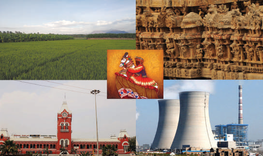
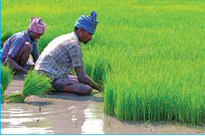
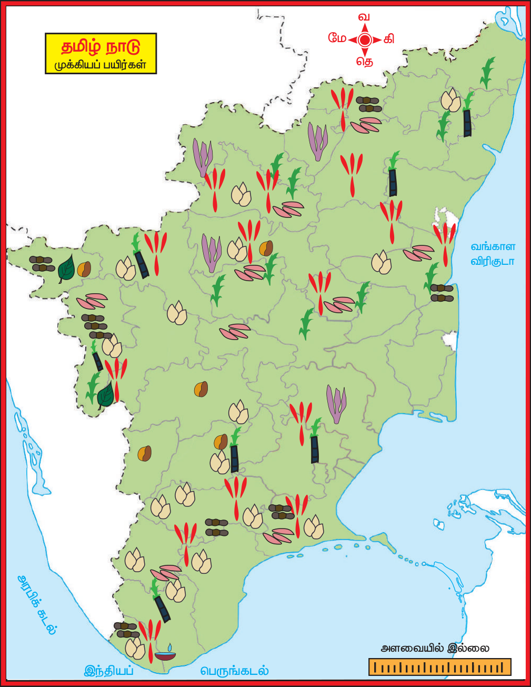
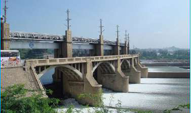
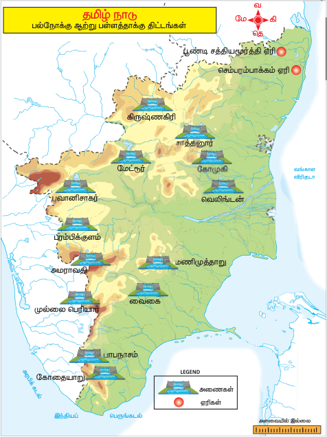
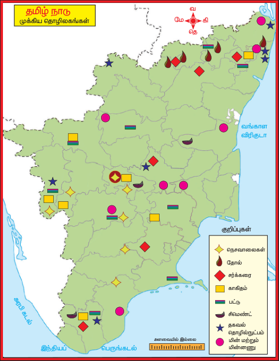
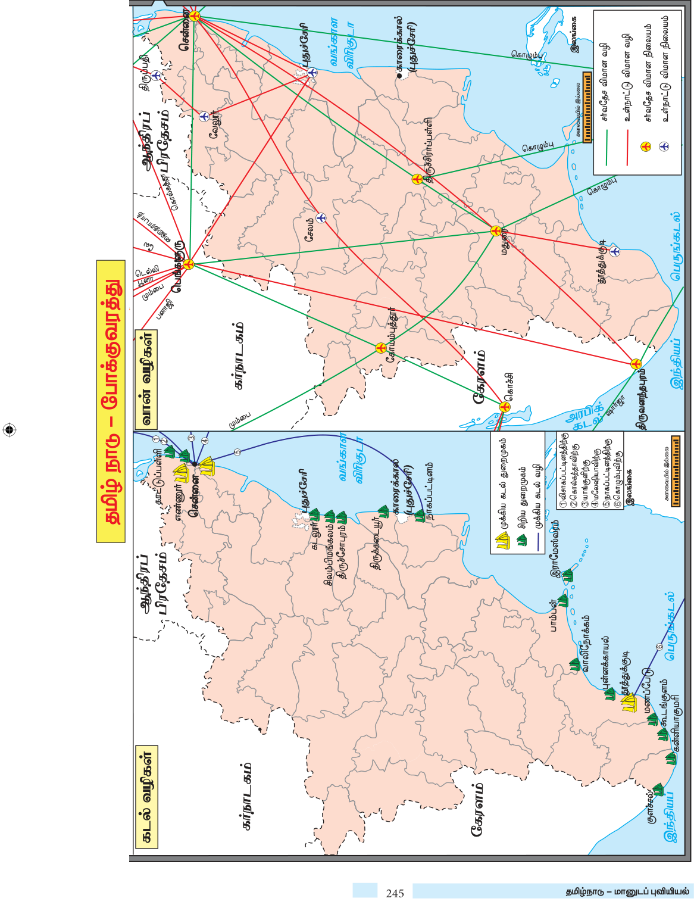

# புவியியல் அலகு 7: தமிழ்நாடு - மானுடப் புவியியல்

## கற்றலின் நோக்கங்கள்

தமிழ்நாட்டின் வேளாண் காரணிகள், முக்கியப் பயிர்கள் மற்றும் அவற்றின் பரவலைப் புரிந்துகொள்ளல்தமிழ்நாட்டின் நீர் வளங்களைப் பற்றி தெரிந்துகொள்ளல்தமிழ்நாட்டின் கனிம மற்றும் தொழிலக வளங்கள் பற்றி கற்றிதல்தமிழ்நாட்டின் மக்கள் தொகை மற்றும் அதன் கூறுகள் பற்றி பகுப்பாய்வு செய்தல்தமிழ்நாட்டின் - மனிதனால் உருவாக்கப்பட்ட பேரிடரைப் பற்றி தெரிந்துகொள்ளல்

## அறிமுகம்

மானுடப் புவியியல் என்பது மனித சமுதாயம் வளர்ச்சி பெற்ற வழிமுறைகள் மற்றும் இயற்கை சூழலுடனான செயல்பாடுகள் குறித்துக் கற்றிதல் ஆகும். தமிழ்நாட்டில் காணப்படும் பல்வேறு வளப்பரவல்கள், பண்புகள் மற்றும் பயன்பாடுகள் பற்றி இப்பாடப்பகுதி விளக்குகிறது. புவியானது, பல்வேறு வகையான இயற்கை வளங்களாகிய நிலப்பகுதிகள், ஆறுகள், மண்வகைகள், இயற்கை தாவரங்கள், நீர் மற்றும் வன வளங்கள் ஆகியவற்றை வழங்கியுள்ளது என்பதை முன்னரே கற்றுள்ளோம். மேற்கண்டவற்றை பயன்படுத்தினால் மட்டுமே அவை பயனுள்ள வளங்களாகும். மனிதர்கள் தங்கள் அறிவு கூர்மை மற்றும் திறன்களால் பல வளங்களைப் பயன்படுத்துகின்றனர். எனவே , புவியில் காணப்படும் வளங்களில் மனித வளமே மிகச் சிறந்த வளமாகும். மனிதர்கள் தங்களது திறன்கள் மூலம் இயற்கை வளங்களைப் பயன்படுத்தக் கூடிய பொருள்களாக மாற்றுகின்றனர்.

## 7.1 வேளாண்மை

"அக்ரிகல்சர்" என்ற சொல் இலத்தீன் வார்த்தைகளான "அகர்" மற்றும் "கல்சரா" என்பதிலிருந்து பெறப்பட்டது. இதன் பொருள் நிலம் மற்றும் வளர்த்தல் என்பதாகும். வேளாண்மை

என்பது விவசாய நடைமுறைகளான பயிர்கள் சாகுபடி, கால்நடை வளர்த்தல், பறவைகள் வளர்த்தல், காடுகள் வளர்த்தல், மீன்பிடித்தல் மற்றும் அவற்றோடு தொடர்புடைய நடவடிக்கைகளை உள்ளடக்கியதாகும். தமிழ்நாட்டின் முக்கியமான தொழில் வேளாண்மையாகும். இந்தியா சுதந்திரமடைந்திலிருந்து 65%க்கும் மேற்பட்ட மக்கள் வாழ்வாதாரத்திற்கு வேளாண் துறையைச் சார்ந்துள்ளனர். மாநிலத்தின் பொருளாதாரத்தில் வேளாண்மையே பிரதானமாக இருந்து வருகிறது. வேளாண்மை, கிராமப்புற மக்களுக்கு பெருமளவில் வேலை வாய்ப்பை அளிக்கிறது. வேளாண்மைக்கும் பொருளாதார வளர்ச்சிக்கும் இடையே ஒரு வலுவான தொடர்பு உள்ளது. நெல், தினைவகைகள் மற்றும் பருப்பு வகைகள் மாநிலத்தின் முதன்மை உணவுப் பயிர்களாகும். கரும்பு, பருத்தி, சூரியகாந்தி, தென்னை, முந்திரி, மிளகாய், எள், நிலக்கடலை, தேயிலை, காபி, ஏலக்காய் மற்றும் ரப்பர் ஆகியவை முக்கிய வணிகப் பயிர்களாகும்.

## 7.2 வேளாண்மையைத் தீர்மானிக்கும் புவியியல் காரணிகள்

நிலத்தோற்றம், காலநிலை, மண் மற்றும் நீர்ப்பாசனம் ஆகியவை வேளாண்மை வளர்ச்சியை தீர்மானிக்கும் முக்கிய புவியியல் காரணிகளாகும்.

### நிலத்தோற்றம்

தமிழ்நாடானது மலைகள், பீடபூமிகள் மற்றும் சமவெளிகள் ஆகிய பல்வேறுபட்ட நில அமைப்புகளைக் கொண்டுள்ளது. மேற்கண்டவற்றுள் சமவெளிகள் வேளாண் உற்பத்திக்கு ஏற்ற வளமான வண்டல் மண்ணைக் கொண்டுள்ளதால் சமவெளிப் பகுதிகள் வேளாண் தொழிலுக்கு ஏற்றதாக உள்ளது. எ.கா. வண்டல் மண் நிறைந்துள்ள காவிரிச் சமவெளி தமிழ்நாட்டின் குறிப்பிடத்தக்க வேளாண் பகுதியாகும். பீடபூமி, வேளாண்மைக்கு ஓரளவிற்கு ஏற்றதாகவும், மலைப் பிரதேசங்களில் வேளாண் நடவடிக்கைகள் மிகக்குறைந்த அளவிலும் உள்ளன. காலநிலை தமிழ்நாடு பூமத்தியரேகைக்கு அருகிலும், வெப்ப மண்டலத்திலும் அமைந்துள்ளதால் வெப்ப மண்டலக் காலநிலையைப் பெறுகிறது. ஆகையால் தமிழ்நாட்டின் வெப்பநிலை ஆண்டு முழுவதும் அதிகமாக உள்ளது. எனவேவெப்பமண்டலப் பயிர்கள் மட்டுமே பயிரிடப்படுகின்றன. நீர், வேளாண்மையைக் கட்டுப்படுத்தும் முக்கியக் காரணியாகும். வடகிழக்குப் பருவக்காற்று தமிழ்நாட்டிற்கான முக்கிய நீர்ஆதாரமாக உள்ளதால், பயிரிடப்படும் முக்கிய காலம் இப்பருவத்தில் தொடங்குகிறது. இப்பருவத்தில் பெறும் மழையின் அளவு மற்றும் நீர்ப்பாசன வசதி போன்றவை வேளாண்மையை மிக அதிக அளவில் பாதிக்கிறது. மண் வேளாண்மையின் மிக முக்கியமான கூறுகளுள் ஒன்று மண் ஆகும். இது பயிர்கள் மற்றும் தாவரங்களின் வளர்ச்சிக்குத் தேவையான கனிமசத்துக்கள் மற்றும் ஊட்டச்சத்துக்களை அளிக்கிறது. ஆற்றுப்பள்ளத்தாக்குகள் மற்றும் கடற்கரைச் சமவெளிப் பகுதிகளில் வளமான வண்டல் மண் நிறைந்துள்ளதால் இப்பகுதிகள் மாநில வேளாண் உற்பத்தியில் முக்கிய பங்காற்றுகின்றன. நீர்ப்பாசனம் மாநிலத்தின் பருவமழை சமச்சீரற்ற நிலையில் உள்ளது. மேலும் இவை பருவகாலத்தில்

### தமிழ்நாட்டின் வேளாண் முறைகளின் வகைகள் மற்றும் பகுதிகள்

| வேளாண் வகை | யிரிடப்படும் பகுதிகள் |
|---|---|
| தீவிர தன்னிறைவு வேளாண்மை | தமிழ்நாட்டில் சில பகுதிகள் தவிர்த்து அனைத்துப் பகுதிகளிலும் பின்பற்றப்படுகிறது |
| தோட்ட வேளாண்மை | மேற்கு மற்றும் கிழக்குத் தொடர்ச்சி மலைச்சரிவுகள் |
| கலப்பு வேளாண்மை | காவிரி மற்றும் தென்பெண்னை ஆற்றுப்படுகைகள் |

மட்டுமே பொழிகிறது. எனவே , மாநிலத்தில் பயிர் சாகுபடி சிறப்பாக நடைபெற நீர்ப்பாசனம் மிகவும் இன்றியமையாததாகும். வறண்ட பிரதேசங்களில் மானாவாரிப் பயிர்கள் பயிரிடப்படுகிறது.

## 7.3 தமிழ்நாட்டின் வேளாண் பருவகாலங்கள்

வெப்பநிலை மற்றும் மண்ணின் ஈரப்பத்தை அடிப்படையாகக் கொண்டு விவசாயிகள் பருவகாலத்திற்கு ஏற்ற பல்வேறு வகையான பயிர்களைப் பயிரிடுகிறார்கள். மாநிலத்தின் வேளாண் பருவகாலங்கள் பின்வருமாறு:

| ருவம் | விதைக்கும் காலம் | அறுவடை காலம் | முக்கிய யிர்கள் |
|---|---|---|---|
| சொர்ணவாரி (சித்திரைப் ட்டம்) | ஏப்ரல் - மே | ஆகஸ்டு - செப்டம்பர் | ருத்தி மற்றும் தினை வகைகள் |
| சம்பா (ஆடிபட்டம்) | ஜூலை - ஆகஸ்டு | ஜனவரி - பிப்ரவரி | நெல் மற்றும் கரும்பு |
| வரை | வம்பர் - டிசம்பர் | பிப்ரவரி - மார்ச் | ழங்கள், காய்கறிகள், வெள்ளரி, தர்பூசணி |

## 7.4 தமிழ்நாட்டின் முக்கிய பயிர்களின் பரவல்

### நெல்

தமிழ்நாட்டின் முக்கியமான உணவுப்பயிர் நெல் ஆகும். பொன்னி மற்றும் கிச்சடி சம்பா தமிழகத்தில் பயிரிடப்படும் முக்கிய நெல் வகைகளாகும். இப்பயிர்

### நெல் பயிர் சாகுபடி

தமிழகம் முழுவதும் பயிரிடப்பட்டாலும் தஞ்சாவூர், திருவாரூர், திருவள்ளூர், காஞ்சிபுரம், விழுப்புரம், கடலூர், தென்காசி மற்றும் திருநெல்வேலி மாவட்டங்களில் அதிகளவில் பயிரிடப்படுகிறது. நெல் உற்பத்தி செய்யும் இந்திய மாநிலங்களில் தமிழகம் மூன்றாம் இடத்தை வகிக்கிறது. தமிழ்நாட்டில் காவிரி டெல்டா பகுதி அதிக நெல் உற்பத்தி செய்யும் பகுதியாகும். (பிரிக்கப்படாத தஞ்சாவூர்) எனவே , இப்பகுதி தமிழ்நாட்டின் "நெற்களஞ்சியம்" என்றழைக்கப்படுகிறது.

தமிழ்நாடு வேளாண் பல்கலைக் கழகத்தின் (TNAU) கீழ் செயல்பட்டுவரும் தமிழ்நாடு நெல் ஆராய்ச்சி நிறுவனம் (TRRI) நெல் ஆராய்ச்சியை மேற்கொள்ளும் ஓர் இந்திய நிறுவனமாகும். இது தஞ்சாவூர் மாவட்டத்தில் ஆடுதுறை என்னுமிடத்தில் 1985ஆம் ஆண்டு ஏப்ரல் மாதம் தொடங்கப்பட்டது. இந்நிறுவனம் இப்பகுதியிலுள்ள வேளாண் கல்லூரிகள் மற்றும் ஆராய்ச்சி நிறுவனங்களுக்கு நெல் சாகுபடி மற்றும் உற்பத்தி முறை குறித்த ஆராய்ச்சிகளுக்கு தேவையான உதவிகளைச் செய்து வருகிறது.

### தினை வகைகள்

தமிழ்நாட்டின் மக்கள் தொகையில் ஏறக்குறைய மூன்றில் ஒரு பங்கு மக்களின் முக்கியமான உணவு தினை வகைளாகும். சோளம், கேழ்வரகு மற்றும் கம்பு ஆகியன முக்கிய தினைப் பயிர்களாகும். இவ்வகை பயிர்கள் வறண்ட பிரதேசங்களில் மட்டுமல்லாமல் கடற்கரைச் சமவெளிகளிலும் விளைகின்றன. கோயம்புத்தூர் பீடபூமியிலும், கம்பம் பள்ளத்தாக்கிலும் சோளம் பயிரிடப்படுகின்றன. கோயம்புத்தூர், தருமபுரி, வேலூர் மற்றும் கடலூர் மாவட்டங்களில் கேழ்வரகு பயிரிடப்படுகிறது. இராமநாதபுரம், திருநெல்வேலி, தென்காசி, கரூர், பெரம்பலூர் மற்றும் சேலம் மாவட்டங்களில் கம்பு பயிரிடப்படுகிறது.

இந்தியா, 2018ஆம் ஆண்டை தினைப்  பயிர்களின் தேசிய ஆண்டாக அனுசரித்தது. உலக உணவு மற்றும் வேளாண்மைக் கழகம் (FAO), 2023ஆம் ஆண்டை சர்வதேச தினைப்பயிர்கள் ஆண்டாக அனுசரிக்கத் தீர்மானித்துள்ளது.

### பருப்பு வகைகள்

பருப்பு வகைகள் புரதச்சத்தின் முக்கிய ஆதாரமாக உள்ளன. கொண்டைக்கடலை, உளுந்து, பச்சைப்பயறு, துவரம்பருப்பு, தட்டைப்பயறு மற்றும் கொள்ளு ஆகியன தமிழ்நாட்டில் விளையும் முக்கிய பருப்பு வகைகளாகும். பருப்பு வகைகள் காலநிலைக்கு ஏற்றாற் போல் பரவலாகப் பயிரிடப்படுகின்றன. வறண்ட நிலப்பகுதிகளில் நீர்ப்பாசன வசதியுடனோ அல்லது நீர்பாசனமின்றியோ பயிரிடப்படுகின்றன. மிதமான குளிர்காலநிலை மற்றும் குறைந்த மழைப்பொழிவு இங்கு பயிரிட உகந்த சூழல்களாகும். பருப்பு வகைகள் கால்நடைகளுக்கு மிகச்சிறந்த தீவனமாக உள்ளன. சென்னை, நீலகிரி மற்றும் கன்னியாகுமரி மாவட்டங்களைத் தவிர்த்து மற்ற மாவட்டங்களில் பருப்பு வகைகள் பயிரிடப்படுகின்றன. கோயம்புத்தூர் மாவட்டம் கொண்டக்கடலை உற்பத்தியில் மாநிலத்தில் முதன்நிலை வகிக்கிறது. வேலூர் மற்றும் சேலம் மாவட்டங்களில் துவரம் பருப்பு உற்பத்தி செய்யப்படுகின்றன. திருவாரூர், நாகப்பட்டினம், மயிலாடுதுறை மற்றும் தூத்துக்குடி மாவட்டங்கள் அதிக அளவில் பச்சைப் பயறு மற்றும் உளுந்து ஆகியவற்றை உற்பத்தி செய்கின்றன. தருமபுரி மற்றும் கிருஷ்ணகிரி மாவட்டங்களில் கொள்ளுப் பயிர் பரவலாக பயிரிடப்படுகிறது.

### எண்ணெய் வித்துக்கள்

நிலக்கடலை, எள், ஆமணக்கு, தென்னை, சூரியகாந்தி மற்றும் கடுகு ஆகியன தமிழ்நாட்டில் பயிரிடப்படும் முக்கிய எண்ணெய் வித்துகள் ஆகும். உணவுப் பயன்பாட்டிற்கு மட்டுமல்லாமல் தொழிலகங்களில் மசகு எண்ணெய், மெருகு எண்ணெய் பொருள்கள், சோப்பு, மெழுகுவர்த்தி, அழகுசாதனப் பொருள்கள் மற்றும் மருந்துப் பொருள்கள் ஆகியவற்றின் உற்பத்திக்கும் இவைப் பயன்படுகின்றன. நிலக்கடலை மாநிலத்தின் முக்கிய எண்ணெய் வித்துப் பயிராகும். வேலூர், திருவண்ணாமலை, விழுப்புரம், கள்ளக்குறிச்சி, சேலம் மற்றும் புதுக்கோட்டை மாவட்டங்களில் நிலக்கடலை உற்பத்தியானது செறிந்து காணப்படுகிறது. தருமபுரி, கடலூர், பெரம்பலூர், இரண்டாவது பசுமைப்புரட்சி (இயற்கை வேளாண்மை அல்லது கரிம வேளாண்மை):

இயற்கை வேளாண்மையில் செயற்கை உரங்கள், பூச்சிகொல்லிகள், தாவர வளர்ச்சி சீராக்கிகள் (செயற்கை இரசாயனம்) கால்நடை தீவனக் கலப்புகள் பயன்படுத்துவதில்லை. இவ்வகை விவசாயம், பயிர்சுழற்சி, பயிர் கழிவுகள், விலங்குகளின் கழிவுகள், விவசாயம் அல்லாத கரிம கழிவுகள், உயிரியல் பூச்சிக்கொல்லிகள் ஆகியனவற்றை மண்வளப் பாதுகாப்பிற்கு நம்பியுள்ளனர். குறைவான விவசாயிகளே இம்முறையினைப் பின்பற்றுகின்றனர்.

க ேகவர ப எெண க ைனவைக ேதைல கா ரப ப வைக மதுரை, ஈரோடு, இராமநாதபுரம், சிவகங்கை மற்றும் விருதுநகர் ஆகிய மாவட்டங்களில் இவை சிறிய அளவில் பயிரிடப்படுகிறது. கோயம்புத்தூர், தஞ்சாவூர் மற்றும் கன்னியாகுமரி மாவட்டங்களில் தென்னை மரங்கள் அதிகம் காணப்படுகின்றன.

### கரும்பு

கரும்பு தமிழ்நாட்டின் முக்கியமான வாணிபப் பயிராகும். இது ஓராண்டு பயிராகும். இதற்கு அதிக வெப்பநிலை மற்றும் அதிகமழைப் பொழிவும் தேவைப்படுகிறது. இது வெப்பமண்டல பிரதேசங்களில் நன்கு வளரக்கூடியவை. திருவள்ளூர், காஞ்சிபுரம், செங்கல்பட்டு, வேலூர், ராணிப்பேட்டை, திருப்பத்தூர், கடலூர், திருச்சிராப்பள்ளி, திருநெல்வேலி, தென்காசி, கோயம்புத்தூர் மற்றும் ஈரோடு ஆகியன கரும்பு பயிரிடும் மாவட்டங்களாகும்.

பருத்திபருத்தி ஓர் இழைப்பயிர் மற்றும் வாணிபப் பயிராகும். கரிசல்மண், நீண்ட பனிப்பொழிவற்ற காலம், மிதவெப்பம் மற்றும் ஈரப்பத வானிலை ஆகியவை பருத்தி பயிரிடுவதற்கு உகந்தவையாகும். பருத்தி வளரும் காலத்தில் ஈரப்பத காலநிலையும், அறுவடை காலத்தில் வறண்ட காலநிலையும் பயிருக்கு ஏற்றதாகும். கோயம்புத்தூர் பீடபூமி பகுதியிலும், வைகை மற்றும் வைப்பாறு ஆற்றுவடிநிலப் பகுதிகளிலும் பருத்தி பயிரிடப்படுகின்றது. மதுரை, இராமநாதபுரம், விருதுநகர், திருநெல்வேலி, தூத்துக்குடி, சேலம் மற்றும் தருமபுரி ஆகிய மாவட்டங்களிலும் இவைப் பயிரிடப்படுகின்றது.

### தோட்டப்பயிர்கள்

தேயிலை, காபி, ரப்பர், மிளகு மற்றும் முந்திரி ஆகியன மாநிலத்தின் முக்கிய தோட்டப் இயற்கை வேளாண்மையை மேம்படுத்தும் நோக்கத்தோடு மத்திய அரசானது தேசிய இயற்கை கரிம வேளாண்மைத் திட்டத்தை அறிமுகப்படுத்தியுள்ளது. விழிப்புணர்வு ஏற்படுத்துதல், இயற்கை உரங்களை மேம்படுத்துதல், பயிற்சியளித்தல் போன்றவற்றை இத்திட்டம் செயல்படுத்துகிறது. மேலும், கரிமப் பொருள்களை மறுசுழற்சி செய்யவும், தொழிற்கூடங்கள், உயிரிஉரங்கள், உயிரி பூச்சிகொல்லிகள் உற்பத்தி செய்யவும் தொழிற்கூடங்களுக்கு மாநிலத்தில் நிதி உதவி அளித்தல், தரமேம்பாட்டு வளர்ச்சி மற்றும் அதனை நடைமுறைப்படுத்தும் குழுமத்தின் மனிதவளத்தை மேம்படுத்துதல் போன்றவை இத்திட்டத்தின் மூலம் செயல்படுத்தப்படுகிறது.

டான்  டீ (TANTEA) இந்நிறுவனம் இந்தியாவில் கருப்பு வகை தேயிலை உற்பத்தியிலும், கலப்பு வகை தேயிலை உற்பத்தியிலும் முன்னி வகிக்கும் நிறுவனங்களுள் ஒன்றாகும். (தமிழ்நாடு தேயிலைத் தோட்டக் கழகம்) இந்நிறுவனத்தின் தேயிலை பயிரிடும் பரப்பு ஏறத்தாழ 4,500 ஹெக்டேர் ஆகும்.

பயிர்களாகும். இந்தியாவில் அசாம் மாநிலத்திற்கு அடுத்தபடியாக தமிழ்நாடு தேயிலை பயிரிடும் பரப்பளவு மற்றும் உற்பத்தியில் இரண்டாமிடம் வகிக்கிறது. நீலகிரி மலைகள் மற்றும் கோயம்புத்தூர் மாவட்டத்தில் உள்ள மலைகளில் தேயிலைத் தோட்டங்கள் காணப்படுகின்றன. சேலம், நாமக்கல், திண்டுக்கல், மதுரை மற்றும் தேனி மாவட்டங்களிலுள்ள மலைச் சரிவுகளிலும் காபி பயிரிடப்படுகின்றது. ஏற்காடு, கொல்லிமலை மற்றும் கொடைக்கானல் பகுதிகளில் காப்பி நன்கு விளைகின்றன. காபி உற்பத்தியில் கர்நாடகா மாநிலத்திற்கு அடுத்து தமிழ்நாடு இரண்டாமிடம் வகிக்கிறது. ரப்பர் தோட்டங்கள் கன்னியாகுமரியில் அதிகமாகப் பயிரிடப்படுகின்றன. தமிழ்நாட்டிலுள்ள, மேற்குத் தொடர்ச்சி மலை மற்றும் கிழக்குத் தொடர்ச்சிமலைகளின் சரிவுகளில் மிதவெப்பம் மற்றும் ஈரமான காலநிலை உள்ள பகுதிகளில் மிளகு விளைகின்றது. கடலூர் மாவட்டத்தில் பெரும் பகுதிகளில் முந்திரி பயிரிடப்படுகின்றன.

## 7.5 கால்நடை வளர்ப்பு

கால்நடை வளர்ப்பு என்பது ஊரக மக்களின் சமூகப் பொருளாதாரத்தின் ஓர் ஒருங்கிணைந்த அங்கமாகும்.

### வெள்ளாடுகள்

இந்தியாவில் வெள்ளாடுகள் ’ஏழை மக்களின் பசு’ என்றழைக்கப்படுகிறது. இது ஒரு புன்செய் வேளாண் அமைப்பின் மிக முக்கிய அங்கமாகும். கால்நடை வகைகளான பசு மற்றும் எருமை வளர்ப்பிற்கு ஏற்க முடியாத இடங்களான நில விளிம்புப் பகுதிகள் மற்றும் மேடு பள்ளங்கள் நிறைந்த நிலத்தோற்றப் பகுதிகளில் வெள்ளாடு தமிழ்நாடு பால் வளர்ச்சிக் கழகம் என்ற அமைப்பானது தமிழ்நாடு பால் உற்பத்தியாளர்கள் கூட்டுறவு சங்கம் என்ற புதிய அமைப்பாக பதிவு மாற்றம் செய்யப்பட்டுள்ளது. இது பிரபலமாக ஆவின் என்று அழைக்கப்படுகிறது வளர்ப்பு ஒரு மாற்றாக உள்ளது. மிகக் குறைந்த முதலீட்டில் அதிக இலாபம் ஈட்டப்படுவதால் சிறு மற்றும் குறு விவசாயிகள் வெள்ளாடு வளர்ப்பினை மேற்கொள்கின்றனர்.

### செம்மறியாடுகள்

செம்மறியாடுகள், கம்பளி, இறைச்சி, பால், தோல் மற்றும் உரம் போன்ற பல்வேறு பயனுள்ள பொருள்களை அளிப்பதால் தமிழ்நாட்டின் மலைப்பகுதிகள், வறண்ட மற்றும் அரை வறண்ட பகுதிகளில் உள்ள ஊரகப் பொருளாதாரத்தில் இவை முக்கிய பங்காற்றுகிறது. செம்மறியாடுகள் மற்றும் அவற்றின் உரோமம் அதன் உடைமையாளர்களுக்கு முக்கிய வருவாய் ஆதாரமாக உள்ளன.

### மீன் பிடித்தல்

தமிழ்நாடு ஒரு கடற்கரை மாநிலமாதலால் மீன்பிடித்தல் இங்கு முக்கியமான தொழில்களில் ஒன்றாகும். உள்நாட்டு மீன் பிடித்தல் என்பது பரந்த அளவில் காணப்படும் நீர்த்ததேக்கங்கள் மற்றும் ஆறுகளில் கணிசமான அளவு நடைபெறுகின்றது. கடல் மீன் பிடிப்பு தமிழ்நாட்டு கடற்கரையின் நீளம் 906.9 கிலோமீட்டராகும். ஏறத்தாழ 41,412 சதுர கிலோமீட்டர் பரப்பளவு 'கண்டத்திட்டு' உள்ளதால் கடற்கரை மீன்பிடிப்புக்கு சாதகமாக உள்ளது. தமிழ்நாடு 'கடல் மீன்' உற்பத்தியில் முதன்மையான மாநிலங்களுள் ஒன்றாக உள்ளது. மீன்பிடித்தலுக்கு பெரிய மற்றும் இயந்திரப் படகுகள் பயன்படுத்தப்படுகின்றன.

பெருங்கடல் அல்லது கடற்கரையில் இருந்து சில கிலோமீட்டர் தூரம் வரை மீன்பிடித்தல் ’கடலோர மீன்பிடிப்பு’ என அழைக்கப்படுகிறது. கடற்கரையில் இருந்து பொதுவாக 20 முதல் 30 மைல்கள் தூரம் வரையிலும், 100 அல்லது 1000க்கும் மேற்பட்ட அடிகள் ஆழத்தில் மீன்பிடித்தல் நடக்கிறது. இது ’ஆழ்கடல் மீன்பிடிப்பு’ என அழைக்கப்படுகிறது. சுறா, பறவை மீன், சங்கு மீன், கெளுத்தி, வெள்ளி வயிறு மீன் போன்ற மீன் வகைகள் மற்றும் நண்டு வகைகள் இங்குப் பிடிக்கப்படுகின்றன. சென்னை, கன்னியாகுமரி, திருநெல்வேலி, நாகப்பட்டினம் மற்றும் இராமநாதபுரம் ஆகிய மாவட்டங்கள் மாநிலத்தின் கடல் மீன் உற்பத்தியில் ஏறத்தாழ 40% சதவிகிதம் பங்களிப்பைத் தருகின்றன. கடற்கரையின் அமைவிடம் இப்பகுதிகளில் மீன் பிடித்தலுக்கு சாதகமாக உள்ளன. உள்நாட்டு மீன்பிடிப்பு ஏரிகள், ஆறுகள், குளங்கள், கழிமுகங்கள், காயல்கள் மற்றும் சதுப்புநிலப்பகுதி போன்ற நீர் நிலைகளில் உள்நாட்டு மீன் பிடித்தல் நடைபெறுகிறது. சிப்பிகள் மற்றும் இறால்கள் மீன் பண்ணைகளில் வளர்க்கப்படுகின்றன. கட்டுமரம், டீசல் படகுகள் மற்றும் மீன் வலைகளைப் பயன்படுத்தி மீன்பிடித்தல் நடைபெறுகிறது. மீன்பிடித்தலை மேம்படுத்துவதற்காக தமிழ்நாடு மீன் வளத்துறை பல திட்டங்களை அறிமுகப்படுத்தியுள்ளது. மாநில உள்நாட்டு மீன் உற்பத்தியில் வேலூர் மாவட்டம் 10 சதவிகித உற்பத்தியுடன் முன்னிலையில் உள்ளது. கடலூர், சிவகங்கை மற்றும் விருதுநகர் மாவட்டங்கள் தலா 9 சதவிகிதம் உள்நாட்டு மீன் உற்பத்தி செய்து மாநிலத்தில் இரண்டாம் இடத்தில் உள்ளன.

## 7.6 நீர் வளம்

மனித குலத்திற்கும் புவியில் வாழும் இலட்சக்கணக்கான உயிரினங்களுக்கும் நீர் இயற்கையின் ஒரு விலைமதிப்பற்ற பரிசாகும்.

### தமிழ்நாட்டின் நீர் வளங்கள்

இந்தியப் பரப்பளவில் 4 சதவிகித்தையும் மக்கள் தொகையில் 6 சதவிகித்தையும் கொண்டுள்ள தமிழ்நாடு, இந்திய நீர் வளத்தில் 2.5 சதவிகித்தை மட்டுமே பெற்றுள்ளது. தமிழ்நாட்டின் மேற்பரப்பு நீரில் 95 சதவிகித்திற்கு அதிகமாகவும் மற்றும் நிலத்தடி நீரில் 80 சதவிகித்திற்கு அதிகமாகவும் ஏற்கனவே பயன்பாட்டிலிருந்து வருகிறது. தமிழ்நாட்டில் உள்ள நீர்வள ஆதாரங்கள்

| மேற்பரப்பு நீர்வள ஆதாரங்கள் | எண்ணிக்கை |
|---|---|
| ஆற்று வடிநிலம் | 17 |
| நீர்த்ததேக்கங்கள் | 81 |
| ஏரிகள் | 41,127 |
| ஆழ்துளைக் கிணறுகள் மற்றும் மற்ற கிணறுகள் | 4,98,644 |
| திறந்தவெளிக் கிணறுகள் | 15,06,919 |
| மொத்தம் | 20,46,788 மி.க.மீ |
| (ஆதாரம்-2017 தமிழ்நாடு புள்ளியியல் கையேடு) |  |

தமிழ்நாட்டின் பல்நோக்கு ஆற்றுப் பள்ளத்தாக்குத் திட்டங்கள்:

பல்நோக்கு ஆற்றுப் பள்ளத்தாக்கு திட்டங்கள், அடிப்படையில் வேளாண் நீர்ப்பாசன மேம்பாட்டிற்காகவும் மற்றும் நீர் மின்சக்தி உற்பத்திக்காகவும் மேற்கொள்ளப்படுகின்றன. இருப்பினும் இவை வேறு பல நோக்கங்களுக்காகவும் பயன்படுத்தப்படுகின்றன.

### மேட்டூர் அணை

காவிரி ஆறு சமவெளியில் நுழையும் இடத்திற்கு முன்னுள்ள மலையிடுக்குப் பகுதியில் மேட்டூர் அணை கட்டப்பட்டுள்ளது. இது இந்தியாவின் மிகப் பழமையான அணைகளில் ஒன்றாகும். இது சேலம், ஈரோடு, கரூர், திருச்சிராப்பள்ளி, தஞ்சாவூர், திருவாரூர் மற்றும் நாகப்பட்டினம் ஆகிய மாவட்டங்களிலுள்ள விளை நிலத்திற்கு நீர்ப்பாசன வசதியை அளிக்கிறது.

### மேட்டூர் அணைபவானி சாகர் அணை

ஈரோடு மாவட்டத்தில் அமைந்துள்ள பவானி சாகர் அணை, கோயம்புத்தூர் நகரிலிருந்து ஏறத்தாழ 80 கி.மீ தொலைவில் அமைந்துள்ளது. இது பவானி ஆற்றின் குறுக்கே கட்டப்பட்டுள்ளது. இந்த அணை நாட்டின் மண்-கல் கலவையால் கட்டப்பட்ட மிகப்பெரிய அணைகளுள் ஒன்றாகும்.

### அமராவதி அணை

அமராவதி அணை, திருப்பூர் மாவட்டத்தில் உடுமலைப் பேட்டையில் இருந்து ஏறத்தாழ 25 கி.மீ தொலைவில் அமைந்துள்ளது. இவ்வணை காவிரியின் துணையாறான அமராவதி ஆற்றின் குறுக்கே கட்டப்பட்டுள்ளது. இவ்வணை நீர்ப்பாசனம் மற்றும் வெள்ளக் கட்டுப்பாட்டை முதன்மை நோக்கமாகக் கொண்டது. அண்மையில் ஒரு சிறிய நீர் மின் நிலையமும் இங்கு நிறுவப்பட்டுள்ளது.

### கிருஷ்ணகிரி அணை

கிருஷ்ணகிரி அணை, கிருஷ்ணகிரியிலிருந்து 7 கி.மீ தொலைவில் தர்மபுரிக்கு செல்லும் வழியில் அமைந்துள்ளது.

### சாத்தனூர் அணை

சாத்தனூர் அணை செங்கம் தாலுகாவில் தென்பெண்ணை ஆற்றின் குறுக்கே கட்டப்பட்டுள்ளது. இது சென்னகேசவ மலையின் நடுவேஅமைந்துள்ளது. தண்டராம்பட்டு மற்றும் திருவண்ணாமலை ஒன்றியங்கள் இதன்மூலம் நீர்ப்பாசன வசதி பெறுகின்றன.

இங்கு பெரிய முதலைப்பண்ணையும் வண்ணமீன் பண்ணையும் அமைந்துள்ளன. சுற்றுலாப் பயணிகளுக்காக அணையின் உள்ளே பூங்காக்கள் பராமரிக்கப்பட்டு வருகிறது. இங்குள்ள பூங்காக்கள் திரைப்படப் படப்பிடிப்புக்குப் பயன்படுத்தப்படுகின்றன.

### முல்லைப்பெரியாறு அணை

முல்லைப்பெரியாறு அணை 1895ஆம் ஆண்டு ஆங்கிலேய நிருவாகத்தால் கட்டப்பட்டது. கேரளாவில், தேக்கடி மலையில் உருவாகும் பெரியாறு ஆற்றின் குறுக்கே கட்டப்பட்டுள்ளது. தமிழ்நாட்டில் நிரந்தரமாக வறட்சிக்குள்ளாகும் சில வேளாண் நிலங்களுக்கு நீர்ப்பாசனம் அளிப்பதற்காக இது கட்டப்பட்டது.

### வைகை அணை

ஆண்டிப்பட்டிக்கு அருகே வைகை ஆற்றின் குறுக்கே கட்டப்பட்டுள்ளது. 111 அடி உயரம் கொண்ட இவ்வணையில் 71 அடி உயரம் மட்டுமே நீரை சேமிக்க முடியும். இவ்வணை மதுரையிலிருந்து 70 கி.மீ தூரத்திலும் ஆண்டிப்பட்டியிலிருந்து 7 கி.மீ தூரத்திலும் அமைந்துள்ளது. இவ்வணை 1959 ஆம் ஆண்டு ஜனவரி 21ஆம் நாள் திறக்கப்பட்டது.

### மணிமுத்தாறு அணை

திருநெல்வேலி நகரிலிருந்து ஏறத்தாழ 47கி.மீ தொலைவில் மணிமுத்தாறு அணை கட்டப்பட்டுள்ளது.

### பாபநாசம் அணை

திருநெல்வேலியிலிருந்து 49கி.மீ தொலைவில் அமைந்துள்ள பாபநாசம் அணை ‘காரையார் அணை’ என்றும் அழைக்கப்படுகிறது. திருநெல்வேலி மற்றும் தூத்துக்குடி மாவட்டங்களில் உள்ள நிலங்கள் இதன் மூலம் பாசன வசதியைப் பெறுகின்றன.

### பரம்பிக்குளம் ஆழியாறு திட்டம்

இது தமிழ்நாடு மற்றும் கேரளா மாநிலங்களின் கூட்டு முயற்சியால் உருவாக்கப்பட்டது. பரம்பிக்குளம் மற்றும் ஆழியாறு பகுதியில் உள்ள ஏழு ஆறுகளின் நீரினைப் பெற்று அங்குள்ள ஏழு நீர்த்ததேக்கங்களையும் ஒன்றோடொன்று இணைக்கும் எதிர்கால நோக்கத்தின் விளைவாக உருவானத் திட்டமாகும்.

பரப்பலாறு திட்டம் ஒட்டன்சத்திரம் அருகே அமைந்துள்ளது. இதன் நீர் கொள்ளவுத் திறன் 167 மில்லியன் கன அடிகளாகும். பழனி தாலுகாவில் அமைந்துள்ள இவ்வணை மதுரையிலிருந்து 75 கி.மீ தொலைவில் அமைந்துள்ளது.

### நீர்வள மேலாண்மை

நீர்வள மேலாண்மை என்பது திட்டமிடல், செயல்படுத்துதல், நீர்வளத்தைப் பெருக்குதல், விநியோகித்தல் மற்றும் நீர்வளங்களின் உகந்த பயன்பாட்டை நிர்வகிப்பதற்கான நடவடிக்கையை மேற்கொள்வதாகும். தமிழ்நாட்டில் மக்கள் தொகை அதிகரிப்பு, பொருளாதார வளர்ச்சி மற்றும் தனிநபரின் நுகர்வு காரணமாக நீரின் தேவை மிகவும் அதிகரித்துள்ளது. மக்களின் நீர்ப் பயன்பாடு, தொழில் துறைக்கான தேவைகள் மற்றும் இதர தேவைகளுக்கான பயன்பாடு குறிப்பிடத்தக்க அளவில் அதிகரித்து வருகின்றது. மாநிலமானது நீர் தேவைக்கு பருவமழையைப் பெரிதும் சார்ந்துள்ளது. பருவ மழை பொய்ப்பதால் கடுமையான நீர் பற்றாக்குறை ஏற்பட்டு, வறட்சிக்கு வழி வகுக்கின்றது. எனவே , நீர் சேமிப்பது நமக்கும் வருங்கால சந்தியினருக்கும் பயனுள்ளதாக அமையும்.

## 7.7 தமிழ்நாட்டின் கனிம வளங்கள்

வெர்மிகுலைட், மேக்னடைட், டுனைட், ரூட்டைல், செம்மணிக்கல், மாலிப்படினம் மற்றும் இல்மனைட் ஆகிய வளங்களில் தமிழ்நாடு முன்னணி உற்பத்தியாளராக உள்ளது. நெய்வேலி, மிகப்பெரிய பழுப்பு நிலக்கரி வளங்களைக் கொண்டுள்ளது. இராமநாதபுரம் பகுதிகளில் நிலக்கரி படிமங்கள் காணப்படுகின்றன. காவிரி வடிநிலப் பகுதியில் எண்ணெய் மற்றும் இயற்கைவாயு படிவுகள் காணப்படுகின்றன.

சேலம் மாவட்டத்தில் உள்ள கஞ்சமலையிலும் திருவண்ணாமலை மாவட்டத்தில் உள்ள கவுதி மலை மற்றும் வேடியப்பன் மலையிலும் இரும்புத்தாது படிவுகள் காணப்படுகின்றன. சேர்வராயன் குன்றுகள், கோத்தகிரி, உதகமண்டலம், பழனிமலை மற்றும் கொல்லிமலைப் பகுதிகளில் பாக்சைட் தாதுகள் காணப்படுகின்றன. திருச்சிராப்பள்ளி, திருநெல்வேலி, தூத்துக்குடி மற்றும் விருதுநகர் மாவட்டங்களில் ஜிப்சம் கிடைக்கிறது. கன்னியாகுமரி கடற்கரை மணல் பரப்புகளில் இல்மனைட் மற்றும் ரூட்டைல் காணப்படுகிறது. கோயம்புத்தூர், கடலூர், திண்டுக்கல், காஞ்சிபுரம், கரூர், மதுரை, நாகப்பட்டினம், நாமக்கல், பெரம்பலூர், இராமநாதபுரம், சேலம் மற்றும் திருவள்ளூர் மாவட்டங்களில் சுண்ணாம்புக்கல் கிடைக்கிறது. கோயம்புத்தூர், தருமபுரி, கரூர், நாமக்கல், நீலகிரி, சேலம், திருச்சிராப்பள்ளி, திருநெல்வேலி, தென்காசி, திருப்பத்தூர் மற்றும் வேலூர் மாவட்டங்களில் மேக்னசைட் கிடைக்கிறது. பெல்ட்ஸஸ்பார்க், படிகக்கல், தாமிரம் மற்றும் காரீயம் ஆகியவை மாநிலத்தின் சில பகுதிகளில் காணப்படுகின்றன.

## 7.8 தொழிலகங்கள்

மூலப்பொருள்களை இயந்திரங்களின் மூலம் உற்பத்திப் பொருள்களாகவோ அல்லது பயன்படுத்தக்கூடிய பொருள்களாகவோ மாற்றப்படும் இடமே தொழிலகங்களாகும். பருத்தி நெசவாலை, சர்க்கரை ஆலை, காகித ஆலை, தோல் தொழிலகம், சிமெண்ட் ஆலை, மின்சாதனப் பொருள்கள் உற்பத்தி ஆலை, வாகன உற்பத்தி, வாகன உதிரிபாகங்கள், தகவல் தொழில்நுட்பம் மற்றும் சுற்றுலாத் துறை ஆகியன தமிழ்நாட்டின் முக்கிய தொழிலகங்கள் ஆகும்.

### பருத்தி நெசவாலைகள்

பருத்தி நெசவாலைகள் தமிழ்நாட்டின் பாரம்பரியமிக்க நன்கு வளர்ந்த்த ஒரு தொழிலகமாகும். பருத்தி நெசவாலைகள் கோயம்புத்தூர், திருப்பூர், சேலம், பல்லடம், கரூர், திண்டுக்கல், விருதுநகர், திருநெல்வேலி, தூத்துக்குடி, மதுரை மற்றும் ஈரோடு ஆகிய பகுதிகளில் செறிந்து காணப்படுகின்றன. தமிழ்நாட்டில் உள்ள ஈரோடு கைத்தறி, விசைத்தறி மற்றும் ஆயத்த ஆடைகளின் விற்பனைக்கு புகழ்பெற்றது. கோயம்புத்தூர் 'தென்னிந்தியாவின் மான்செஸ்டர்' என்று அழைக்கப்படுகிறது. கோயம்புத்தூர், திருப்பூர், ஈரோடு, கரூர் மற்றும் சேலம் மாவட்டங்கள் நெசவுத்தொழில் மூலம் மாநிலப் பொருளாதாரத்திற்கு முக்கிய பங்களிப்பை அளிக்கின்றன. எனவே , இப்பகுதி 'தமிழ்நாட்டின் ஜவுளிப் பள்ளத்தாக்கு' எனக் குறிப்பிட்டப்படுகிறது.

### பருத்தி நெசவாலைபட்டு நெசவுஆலைகள்

நாட்டின் பட்டு உற்பத்தியில் தமிழ்நாடு நான்காவது இடத்தை வகிக்கிறது. 'காஞ்சிபுரம் பட்டு' என்பது அதன் தனித்தன்மை, தரம் மற்றும் பாரம்பரிய மதிப்பு ஆகியவற்றால் உலகம் முழுவதும் அறியப்படுகிறது. காஞ்சிபுரம், ஆரணி, கும்பகோணம், சேலம், கோயம்புத்தூர், மதுரை மற்றும் திருநெல்வேலி ஆகியவை தமிழ்நாட்டின் முக்கிய பட்டு நெசவு மையங்களாகும். இராமநாதபுரத்தின் சில பகுதிகளில் செயற்கைப் பட்டுத் துணிகள் உற்பத்தி செய்யப்படுகின்றன.

### தோல் பதனிடும் தொழிலகங்கள்

இந்தியாவில், தோல் பதனிடும் தொழிலகங்களில் தமிழ்நாடு 60% உற்பத்தியையும் காலணிகள், தோல் ஆடைகள், மற்றும் தோல் உபொருள்கள் உற்பத்தியில் 38% பங்களிப்பையும் அளிக்கிறது. வேலூர் மற்றும் அதனைச் சுற்றியுள்ள இராணிப்பேட்டை, ஆம்பூர் மற்றும் வாணியம்பாடி நகரங்களில் நூற்றுக்கணக்கான தோல் பதனிடும் தொழிலகங்கள் அமைந்துள்ளன. நாட்டின் தோல் பொருட்கள் ஏற்றுமதியில் வேலூர் மாவட்டம் முதன்மையாக விளங்குகிறது. அறிவியல் மற்றும் தொழில் ஆராய்ச்சி நிறுவனத்தின் (CSIR) கீழ் உள்ள மத்திய தோல் ஆராய்ச்சி நிறுவனம் மற்றும் ஆய்வகம் (CLRI) சென்னையில் அமைந்துள்ளது.

### காகித தொழிலகம்

கரூர் மாவட்டம் காகிதபுரத்தில் தமிழக அரசு நிறுவனமான தமிழ்நாடு செய்தித்தாள் மற்றும் காகித நிறுவனம் (TNPL) அமைந்துள்ளன. இது செய்தித்தாள், அச்சுக் காகிதம் மற்றும் எழுதப் பயன்படும் காகிதம் ஆகியவற்றை உற்பத்தி செய்கின்றது. தமிழ்நாடு செய்தித்தாள் மற்றும் காகித நிறுவனம் உலகளவில் திறன்படைத்த ஆலைகளில் ஒன்றாகும். இவ்வாலை கரும்புச்சக்கை மற்றும் மரக்கூழிலிருந்து பலவகையான காகிதங்களை சிறந்த தரத்துடன் உற்பத்தி செய்கின்றன.

### புவியியல் குறியீடு (GI Tag)

புவியியல் குறியீடு என்பது ஒரு குறிப்பிட்ட புவியியல் பிரதேசத்தில் தயாரிக்கப்படும் பொருள்களின் மீது பயன்படுத்தப்படும் குறிப்பாகும். இது உற்பத்தி செய்யும் உரிமையாளர்களுக்கு உரிமைகள் மற்றும் பாதுகாப்பை வழங்குகிறது.

சில முக்கியப் புவியியல் குறியீடுகள்:

| இடம் | உற்பத்திப் பொருள்கள் |
|---|---|
| ஆரணி | ட்டு |
| காஞ்சிபுரம் | ட்டு |
| கோயம்புத்தூர் | மாவு அரைக்கும் இயந்திரம், கோரா பட்டு சேலை |
| தஞ்சாவூர் | ஓவியங்கள், கலைநயம் மிக்க தட்டுகள், தலையாட்டி பொம்மைகள், வீணை |
| ாகர்கோவில் | கோயில் நகைகள் |
| ஈரோடு | மஞ்சள் |
| சேலம் | வெண்பட்டு ( சேலம் பட்டு ) |
| வானி | போர்வைகள் |
| மதுரை | சுங்கடி சேலை |
| சுவாமிமலை | வெண்கலச் சிலைகள் |
| ாச்சியார்கோவில் | குத்துவிளக்கு |
| த்தமடை | ாய் |
| நீலகிரி | ாரம்பரிய பூ தையல் |
| மகாபலிபுரம் | கற்சிற்பங்கள் |
| சிறுமலை | மலை வாழை |
| ஈத்தாமொழி | தேங்காய் |

புக்காதுரை, பவானிசாகர், பள்ளிபாளையம், பரமத்தி வேலூர், கோயம்புத்தூர், உடுமலைப்பேட்டை, தொப்பம்பட்டி, நிலக்கோட்டை மற்றும் சேரன்மாதேவி ஆகிய இடங்களில் காகித ஆலைகள் உள்ளன.

### சிமெண்ட் தொழிலகம்

சிமெண்ட் தொழிலகம் பொருளாதார மந்த நிலையிலும் உற்பத்தி மற்றும் நுகர்வில் தொடர்ந்து வளர்ச்சி அடைந்து வந்துள்ளது. இந்தியா மிகப்பெரிய சிமெண்ட் உற்பத்தி செய்யும் நாடுகளில் ஒன்றாகவும், 181 மில்லியன் டன்கள் வருடாந்திர உற்பத்தியுடன் உலகில் இரண்டாவது இடத்தை வகிக்கும் நாடாகவும் உள்ளது. தமிழ்நாட்டின் முக்கிய சிமெண்ட் உற்பத்தியாளர்களில், தமிழ்நாடு சிமெண்ட் கழகமும் (TANCEM) ஒன்றாக உள்ளது.

அரியலூர் மற்றும் ஆலங்குளம் ஆகிய இடங்களில் சிமெண்ட் உற்பத்தி ஆலைகள் இயங்குகின்றன. சங்கர் சிமெண்ட், ஜூவாரி சிமெண்ட், அல்ட்ராடெக் சிமெண்ட், மதராஸ் சிமெண்ட் மற்றும் டால்மியா சிமெண்ட் ஆகியன தமிழ்நாட்டின் முக்கிய தனியார் சிமெண்ட் உற்பத்தி நிறுவனங்களாகும்.

## 7.9 தகவல் தொழில்நுட்பம்

தேசிய மென்பொருள் மற்றும் சேவைகள் நிறுவன கூட்டமைப்பின்படி (NAASCOM) இந்தியாவின் மொத்த மென்பொருள் ஏற்றுமதியில் தென் மாநிலங்கள் தொடர்ந்து மேலானப் பங்களிப்பை செய்து வருகின்றன. தமிழ்நாடு மற்றும் ஆந்திரப்பிரதேச மாநிலங்கள் இணைந்து இந்தியாவின் மொத்த மென்பொருள் ஏற்றுமதியில் 59.6%ஐ செய்கின்றன. நாட்டின் மென்பொருள் ஏற்றுமதியில் கர்நாடகாவுக்கு அடுத்ததாக தமிழ்நாடு இரண்டாவது பெரிய ஏற்றுமதி செய்யும் மாநிலமாக உள்ளது.

### சிறப்புப் பொருளாதார மண்டலம்

சிறப்புப் பொருளாதார மண்டலங்கள் சர்வதேச அளவில் மிகச்சிறந்த பகுதிகளாகவும் ஏற்றுமதியை ஊக்குவிக்கக்கூடிய சூழலைப் பெற்றதாகவும் உள்ளது. இம்மண்டலம் பல உற்பத்திப் பொருள்களை அளிப்பதுடன் பல்வேறு சேவைகளையும் அளிக்கிறது. நாங்குநேரி, எண்ணூர், ஓசூர் மற்றும் பெரம்பலூரில் சிறப்புப் பொருளாதார மண்டலங்கள் அமைந்துள்ளன. தகவல் தொழில்நுட்பம் மற்றும் தகவல் தொழில்நுட்ப சிறப்புப் பொருளாதார மண்டலங்களான - டைடல் பூங்கா-2, டைடல் பூங்கா-3 மற்றும் உயிரி மருந்தகம் போன்றவை சென்னையிலும் டைடல் பூங்கா-4 கோயம்புத்தூரிலும் அமைந்துள்ளன.

### தமிழ்நாட்டில் உள்ள முக்கியத் தகவல்

### தொழில்நுட்ப பூங்காக்கள்

டைடல் பூங்கா, அசெண்டாஸ், தகவல் தொழில்நுட்பம் மற்றும் தகவல் தொழில்நுட்பம் சார்ந்த்த சேவைகளுக்கான மகேந்திரா உலக நகரம், சிறப்பு பொருளாதார மண்டலம்-டைடல் பூங்கா II மற்றும் டைடல் பூங்கா III, கோயம்புத்தூர் சிறப்பு பொருளாதார மண்டலம்-டைடல் பூங்கா ஆகியனவாகும்.

### பொறியியல் உற்பத்தி தொழிலகங்கள்

உற்பத்தித் தொழில் என்பது மாநிலப் பொருளாதாரத்தின் துடிப்பான துறைகளில் ஒன்றாகும். இது பொறியியல் உற்பத்தி தொழில்துறையில் ஒரு குறிப்பிடத்தக்க பங்களிப்பை அளிக்கிறது. இயந்திரங்கள் மற்றும் உதிரிபாகங்கள் உற்பத்தி, வாகன உற்பத்தி, மூல உலோகம் மற்றும் உலோகக் கலவைத் தொழில்கள், உலோகப் பொருள்கள் மற்றும் பழுதுபார்க்கும் கருவிகள் ஆகியவற்றை உற்பத்தி செய்கின்றன.

### வாகனத் தொழிலகங்கள்

இந்தியாவில் உற்பத்தி செய்யப்படும் வாகனத் தொழில்களில் 21% பயணிகள் மகிழுந்து, 33% வணிக வாகனங்கள் மற்றும் 35% வாகன உதிரிபாகங்கள் ஆகியன தமிழ்நாட்டின் அதிகமான பங்களிப்பாகும். போர்டு, ஹூண்டாய், எச் எம் மிட்சுபிஷி, அசோக் லைலாண்ட் மற்றும் வேளாண் கருவிகள் நிறுவனம் (TAFE) (இழுவை இயந்திரம்) (Tractor), ஆகியவற்றின் உற்பத்திக் தளங்கள் தமிழ்நாட்டில் அமைந்துள்ளன.

### கைத்தறி மற்றும் விசைத்தறி

கைத்தறித் துறையானது மாநிலத்தில் மிகப்பெரிய குடிசைத் தொழிலாகும். இது கிராமப்புற மக்களுக்கு வாழ்வாதாரத்தையும் ஏற்றுமதி வருவாயையும் அளிக்கின்றன. நெசவாளர் சங்கங்கள், ’பள்ளிக் குழந்தைகளுக்கு விலையில்லா சீருடையும், விலையில்லா வேட்டி மற்றும் சேலை’ திட்டத்திற்கு தேவையான துணிகளையும் உற்பத்தி செய்கின்றன.

### சர்க்கரைத் தொழிலகம்

தமிழ்நாட்டில் சர்க்கரைத் தொழிலகம் ஒரு வேளாண்சார்ந்த்த தொழிலகமாகும். கிராமப்புற பகுதிகள் மாநிலத்தின் பொருளாதார வளர்ச்சிக்கு முக்கியப் பங்கினை வகிக்கிறது. சர்க்கரைத் தொழிலகங்கள் பல ஆயிரம் மக்களுக்கு நேரடி வேலைவாய்ப்பையும், கரும்பு பயிர்சாகுபடி, அறுவடை, போக்குவரத்து மற்றும் இதரப் பணிகளில் ஈடுபட்டுள்ள விவசாயிகள் மற்றும் வேளாண் தொழிலாளர்கள் போன்ற பல இலட்சம் மக்களுக்கு மறைமுக வேலை வாய்ப்பையும் வழங்குகின்றன.

### சுற்றுலாத்துறை

சுற்றுலாத்துறை ஒரு தொழிலகமாகக் கருதப்படுகிறது. ஏனெனில் இதில் ஏராளமான மக்களுக்கு வேலைவாய்ப்பை உருவாக்குவதில் முக்கியப்பங்கு வகிக்கின்றன. சமீப காலங்களில் உள்நாட்டு மற்றும் வெளிநாட்டு சுற்றுலாப் பயணிகளுக்கு முன்னணித் தலங்களில் ஒன்றாக தமிழகம் உருவாகிக் கொண்டிருக்கிறது. தமிழகத்தில் சுற்றுலாத்துறை, தமிழ்நாடு சுற்றுலா மேம்பாட்டுக் கழகத்தால் (TTDC) ஊக்குவிக்கப்படுகிறது. பழங்கால நினைவுச் சின்னங்கள், புனித்தலங்கள், மலைவாழிடங்கள், பலவகையான இயற்கை நிலத்தோற்றங்கள், நீண்ட கடற்கரை, கலாச்சாரம் மற்றும் பாரம்பரியம் ஆகியவற்றுடன் தமிழ்நாடு சுற்றுலாப் பயணிகளுக்கு மிகச் சிறந்த மாநிலமாக உள்ளது.

## 7.10 மக்கள் தொகை

ஒரு நாட்டின் வரையறுக்கப்பட்ட பகுதியில் வாழும் மக்களின் எண்ணிக்கையே மக்கள் தொகை எனப்படுகிறது. மக்கள்தொகைப் பண்புகள் பற்றிய புள்ளிவிவர ஆய்வுகள் ‘மக்கட்தொகையியல்’ என அழைக்கப்படுகின்றது.

### அதிக மக்கள் தொகையைக் கொண்ட பகுதிகள்

கோவை, சென்னை, திருவள்ளூர், காஞ்சிபுரம், விழுப்புரம், தர்மபுரி, சேலம், மதுரை மற்றும் திருநெல்வேலி ஆகியவை தமிழ்நாட்டில் அதிக மக்கள் தொகையைக் கொண்ட மாவட்டங்களாகும். இம்மாவட்டங்களில் அதிக அளவிலான மக்கள் தொகை இருப்பதற்குக் காரணம் விவசாயம் மற்றும் தொழில்துறை மேம்பாடு ஆகும்.

### மிதமான மக்கள் தொகையைக் கொண்ட பகுதிகள்

திருவண்ணாமலை, கடலூர், திருச்சி மற்றும் தஞ்சாவூர் ஆகிய மாவட்டங்கள் 30 - 35 இலட்சம் மக்கள்தொகையைப் பெற்றுள்ளன. வேலூர், திண்டுக்கல், விருதுநகர் மற்றும் தூத்துக்குடி மாவட்டங்கள் ஒவ்வொன்றும் 15 - 20 இலட்சம் மக்கள்தொகையைக் கொண்டுள்ளன. விவசாயம், சிறிய அளவிலான தொழில்கள் தவிர கடலோரப் பகுதிகளில் மீன்பிடித்தல் ஆகியவை இம்மாவட்டங்களின் முக்கியத் தொழில்களாகும்.

### குறைவான மக்கள் தொகையைக் கொண்ட பகுதிகள்

கடலோர மாவட்டங்களான நாகப்பட்டினம், திருவாரூர், புதுக்கோட்டை, இராமநாதபுரம் மற்றும் சிவகங்கை ஆகியவை 15 இலட்சத்திற்கும் குறைவான மக்கள் தொகையைப் பெற்றுள்ளன. நீலகிரி மாவட்டம் 10 இலட்சத்திற்கும் குறைவான மக்கள்தொகையைக் கொண்டுள்ளது.

### மக்களடர்த்தி

இந்தியாவின் மக்களடர்த்தியில் நமது மாநிலம் 12வது இடத்தில் உள்ளது. 2011ஆம் ஆண்டு மக்கள்தொகைக் கணக்கெடுப்பின்படி தேசிய சராசரி மக்களடர்த்தி 382 ஆகும். சென்னை ஒரு சதுர கிலோ மீட்டருக்கு 26,553 மக்களடர்த்தி கொண்ட மாவட்டமாகும். இதையடுத்து கன்னியாகுமரி, திருவள்ளூர், காஞ்சிபுரம், மதுரை, கோயம்புத்தூர், கடலூர், தஞ்சாவூர், நாகப்பட்டினம், சேலம், வேலூர் மற்றும் திருச்சிராப்பள்ளி ஆகிய மாவட்டங்கள் அதிக மக்களடர்த்தி கொண்ட மாவட்டங்களாகும். நீலகிரி மாவட்டத்தில் குறைந்த அளவு மக்களடர்த்தி (288ச.கி.மீ) பதிவாகியுள்ளது. மற்ற மாவட்டங்கள் மிதமான மக்களடர்த்தியைக் கொண்டுள்ளன.

### மதங்கள்

இந்து, கிறித்தவம் மற்றும் இஸ்லாம் நமது மாநிலத்தின் முக்கிய மதங்களாகும். நமது மாநிலத்தின் மொத்த மக்கள் தொகையில் இந்துக்கள் அதிகமாகவும் அதனைத் தொடர்ந்து கிறித்தவர்கள், இஸ்லாமியர்கள், சமணர்கள், சீக்கிய மத்தினர் மற்றும் புத்த மத்தினரும் பிற மதங்களைச் சார்ந்த்தவர்களும் உள்ளனர்.

### பாலின விகிதம்

பாலின விகிதம் என்பது 1,000 ஆண்களுக்கு இணையாக உள்ள பெண்களின் எண்ணிக்கையைக் குறிக்கிறது. பாலின விகிதம் அதிகம் கொண்ட மாவட்டங்களாக நீலகிரியும் (1,042) அதைத் தொடர்ந்து தஞ்சாவூர் மாவட்டமும் (1,035) காணப்படுகின்றன. குறைவான பாலின விகிதம் கொண்ட மாவட்டங்களாகத் தருமபுரியும் (946) அதனைத் தொடர்ந்து சேலமும் (954) உள்ளன.

### கல்வியறிவு விகிதம்

கன்னியாகுமரி மாவட்டம் மிகஅதிக அளவில் கல்வியறிவு விகிதம் கொண்ட மாவட்டமாகவும், தர்மபுரி மாவட்டம் மிகக் குறைந்த கல்வியறிவு கொண்ட மாவட்டமாகவும் உள்ளது. மேலும் அதிக கல்வியறிவு கொண்ட மாவட்டங்களாக சென்னை, தூத்துக்குடி, நீலகிரி மற்றும் காஞ்சிபுரம் மாவட்டங்கள் உள்ளன.

## 7.11 போக்குவரத்து மற்றும் தகவல் தொடர்பு

### சாலை போக்குவரத்து

மாநிலத்தின் மொத்த சாலைகளின் நீளம் 1,67,000 கிலோமீட்டர் ஆகும். இதில் 60,628 கிலோமீட்டர் மாநில நெடுஞ்சாலை துறை மூலம் பராமரிக்கப்படுகிறது. பொதுத்துறை மற்றும் தனியார்துறை கூட்டணி இயக்கத் திட்டத்தின் கீழ் (PPP) மொத்த சாலைத் திட்டங்களில் 20% பங்களிப்புடன் இந்தியாவில் இரண்டாவது இடத்தில் உள்ளது.

### இரயில்வே போக்குவரத்து

தெற்கு இரயில்வேயின் தலைமையகம் சென்னையில் அமைந்துள்ளது. தற்போது தெற்கு இரயில்வேயின் வலைப்பின்னல் இந்தியாவின் தென் தீபகற்பப் பகுதிகளான தமிழ்நாடு, கேரளா, புதுச்சேரி, கர்நாடகா மற்றும் ஆந்திரப் பிரதேசத்தின் சில பகுதிகளுக்கும் நீட்டிக்கப்பட்டுள்ளது. சென்னையில் புறநகர் இரயில் போக்குவரத்து மற்றும் பறக்கும் தொடருந்துத் திட்டம் ஆகியவை நன்கு வளர்ச்சியடைந்துள்ளன. மெட்ரோ இரயில்வே அமைப்பு, மே 2017 முதல் பாதாள இரயில் இயக்கத்துடன் இப்போக்குவரத்தை விரிவாக்கம் செய்து வருகிறது.

### வான்வழி போக்குவரத்து

தமிழ்நாட்டில் 4 முக்கிய சர்வதேச விமான நிலையங்கள் உள்ளன. சென்னை சர்வதேச விமானநிலையமானது மும்பை மற்றும் புது டெல்லிக்கு அடுத்ததாக இந்தியாவின் மூன்றாவது பெரிய விமான நிலையமாக உள்ளது. கோயம்புத்தூர், மதுரை மற்றும் திருச்சிராப்பள்ளி ஆகியன நாட்டில் பிற பன்னாட்டு விமானநிலையங்கள் ஆகும். தூத்துக்குடி மற்றும் சேலம் ஆகியவை உள்நாட்டு விமானநிலையங்கள் ஆகும்.

தமிழ்நாட்டின் மிக நீளமான தேசிய நெடுஞ்சாலை எண் 44–ஐ உடையதாகும். இது ஓசூரிலிருந்து தருமபுரி , சேலம், கரூர், திண்டுக்கல், மதுரை, திருநெல்வேலி வழியாக கன்னியாகுமரி வரை 627.2 கிலோமீட்டர் தூரம் செல்கிறது. தமிழ்நாட்டின் மிகக் குறைவான நீளங்கொண்ட தேசிய நெடுஞ்சாலை எண்785-ஐக் கொண்டதாகும். இது மதுரையிலிருந்து துவரங்குறிச்சி வரை செல்கிறது.

### நீர்வழி போக்குவரத்து

சென்னை, எண்ணூர் மற்றும் தூத்துக்குடி ஆகியவை தமிழ்நாட்டின் மூன்று முக்கிய துறைமுகங்களாகும். நாகப்பட்டினத்தில் இடைநிலை துறைமுகமும் பிற பகுதிகளில் 15 சிறிய துறைமுகங்களும் இம்மாநிலத்தில் உள்ளன. தமிழ்நாட்டில் உள்ள அனைத்து சிறு துறைமுகங்களும் தமிழ்நாட்டின் கடல்சார் வாரியத்தால் நிர்வகிக்கப்படுகிறது. சென்னை துறைமுகம் செயற்கைத் துறைமுகமாகும். இது சரக்குப் பெட்டகங்களைக் கையாளும் நாட்டின் துறைமுகங்களில் இரண்டாவது பெரிய துறைமுகமாகும்.

## 7.12 தகவல் தொடர்பு

தகவல் தொடர்பு என்பது இலத்தீன் வார்த்தையான 'கம்யூனிகேர்' என்பதிலிருந்து பெறப்பட்டது. இது 'பகிர்தல்' எனப் பொருள்படும். தகவல்கள், எண்ணங்கள் மற்றும் எண்ணங்களின் பரிமாற்றத்தை தகவல் தொடர்பு என்கிறோம்.

தகவல் தொடர்புகள் இரு பிரிவுகளாகப் பிரிக்கப்படுகின்றன. அவை:

1. தனிமனித தகவல் தொடர்பு

2. பொதுத்தகவல் தொடர்பு

### தமிழ்நாட்டின் அஞ்சலக மாவட்டங்கள் மற்றும் தலைமையகம்

| மண்டலம் / மாவட்டங்கள் | தலைமையகம் |
|---|---|
| சென்னை | சென்னை |
| மேற்கு மண்டலம் | கோயம்புத்தூர் |
| மத்திய மண்டலம் | திருச்சிராப்பள்ளி |
| தெற்கு மண்டலம் | மதுரை |

## தமிழ் நாடு - போக்குவரத்து

அளைவ இைல அளைவ இைல

## 7.13 வணிகம்

ஏற்றுமதி மற்றும் இறக்குமதி ஆகியவை வணிகத்தின் இரு கூறுகளாகும். ஏற்றுமதி என்பது பொருள்கள் மற்றும் சேவைகளை வெளிநாட்டுப் பணத்திற்கு விற்பதாகும் இந்தியாவின் ஏற்றுமதியில் தமிழகத்தின் பங்களிப்பு 12.2 சதவிகிதம் ஆகும். இறக்குமதி என்பது பண்டங்கள் மற்றும் சேவைகளை வெளிநாட்டு உற்பத்தியாளர்களிடமிருந்து வாங்குவதாகும். தமிழ்நாடு பல பொருள்களை வெளியில் இருந்து இறக்குமதி செய்கிறது. ஏற்றுமதி மற்றும் இறக்குமதி

| தமிழ்நாட்டின் முக்கிய ஏற்றுமதிகள் |  |
|---|---|
| வேளாண் பொருள்கள் | புகையிலை, தானியங்கள், பருத்தி, கரும்பு, நெல், நிலக்கடலை, வாசனைப் பொருள்கள் மற்றும் காய்கறிகள் |
| தோல் பொருள்கள் | சிறுதோல் பைகள், ணப்பைகள், கைப்பைகள், இடுப்பு கச்சை, காலணிகள் மற்றும் கையுறைகள் |
| இரத்தின கற்கள் மற்றும் நகைகள் | விலை மதிப்பு மிக்க கற்கள், முத்துக்கள், தங்க நகைகள், கலை மற்றும் அலங்காரம் பொருள்கள். |
| இரசாயன மற்றும் இரசாயனம் சார்ந்த்த பொருள்கள் | காகிதம், இரசாயனங்கள், இரப்பர் மற்றும் கண்ணாடி |

மேலே விவாதிக்கப்பட்ட கருத்துகளின் மூலம் தமிழகமானது பரப்பு, மக்கள்தொகை, வளம் மற்றும் பொருளாதார வளர்ச்சியின் அடிப்படையில் ஒரு முக்கிய மாநிலம் என்பது தெளிவாகிறது. இம்மாநிலத்தில் மக்கள் பாதுகாப்பாக உள்ளனர். தமிழ்நாட்டு அரசால் அவ்வப்போது அறிமுகப்படுத்தப்படும் திட்டங்களின் மூலம் இம்மாநிலமானது அனைத்து துறைகளிலும் ஒரு குறிப்பிடத்தக்க முன்னேற்றத்தை அடைந்து வருகிறது.

பாடச்சுருக்கம்மானுடவியல் என்பது மனிதர்களின் செயல்பாடுகள் எவ்வாறு இயற்கையின் தாக்கத்திற்கு உள்ளாகின்றன அல்லது கட்டுப்படுத்தப்படுகின்றன என்பது பற்றிய புவியியலின் ஒரு பகுதியாகும் அயனமண்டலப் பயிர்களான நெல், தினை வகைகள், பருப்பு வகைகள், எண்ணெய் வித்துக்கள் மற்றும் தோட்டப் பயிர்களான தேயிலை, காபி, முந்திரி, ரப்பர் ஆகியன தமிழ்நாட்டின் முக்கியப் பயிர் வகைகளாகும்.

### பயிற்சி

### I சரியான விடையைத் தேர்ந்தெடுத்து எழுதுக

1. தென்னிந்தியாவின் நெற்களஞ்சியம் என்று அழைக்கப்படும் டெல்டா அ) காவிரி டெல்டா ஆ) மகாநதி டெல்டா இ) கோதாவரி டெல்டா ஈ) கிருஷ்ணா டெல்டா மதிப்பிற்கு இடையேயான வேறுபாடு 'வர்த்தக சமநிலை' என அழைக்கப்படுகிறது.

## 7.14 தமிழ்நாட்டின் இறக்குமதிகள்

இயந்திரக் கருவிகளான போக்குவரத்து சாதனங்கள், இயந்திர உபகரணங்கள், மின்சாதனமல்லா இயந்திரங்கள், மின்சாதன பொருள்கள், மருந்துப் பொருள்கள், பெட்ரோலியம், உரங்கள் மற்றும் செய்தித்தாள் ஆகியவை முக்கிய இறக்குமதிகளாகும். நாட்டின் வணிகத்தில் தமிழ்நாட்டின் முக்கிய துறைமுகங்கள் 10.94% பங்களிப்பைச் செய்கின்றன.

2. தமிழ்நாட்டு மக்களின் இரண்டாவது முக்கிய உணவுப் பயிர் அ) பருப்பு வகைகள் ஆ) சிறுதானியங்கள் இ) எண்ணெய் வித்துக்கள் ஈ) நெல்

3. தமிழ்நாட்டின் மிகப் பெரிய நீர்மின்சக்தி திட்டம் அ) மேட்டூர் ஆ) பாபநாசம் இ) சாத்தனூர் ஈ) துங்கபத்ரா

4. தமிழ்நாட்டிலுள்ள பெரிய மற்றும் சிறிய துறைமுகங்களின் எண்ணிக்கை அ) 3 மற்றும் 15 ஆ) 4 மற்றும் 16 இ) 3 மற்றும் 16 ஈ) 4 மற்றும் 15

### II கோடிட்ட இடங்களை நிரப்புக

1. தமிழ்நாட்டின் பொருளாதாரத்தில் வேளாண்மை துறையின் பங்கு சதவிகித்தை வகிக்கிறது.

2. சாத்தனூர் அணை ஆற்றின் குறுக்கே கட்டப்பட்டுள்ளது.

3. மும்பை மற்றும் டில்லியை அடுத்த இந்தியாவின் மூன்றாவது பெரிய விமான நிலையம் ஆகும்.

4. இறக்குமதி மற்றும் ஏற்றுமதி மதிப்புகளுக்கு இடையிலுள்ள வேறுபாடு என அழைக்கப்படுகிறது.

### III பொருத்துக

1. பாக்சைட் -  சேலம்

2 ஜிப்சம் -  சேர்வராயன் மலை

3. இரும்பு தாது -  கோயம்புத்தூர்

4. சுண்ணாம்புக்கல் -  திருச்சிராப்பள்ளி

### IV சரியான கூற்றினை கண்டுபிடி

1. கூற்று: கோயம்புத்தூர், திருப்பூர் மற்றும் ஈரோடு மண்டலம் தமிழ்நாட்டின் ஜவுளி பள்ளத்தாக்கு என அழைக்கப்படுகிறது.

காரணம்: இவைகள் நெசவாலைகள் மூலம் நாட்டின் பொருளாதாரத்திற்கு முக்கிய பங்களிப்பை அளிக்கின்றன.

அ) கூற்று மற்றும் காரணம் இரண்டும் சரி.

காரணம், கூற்றுக்கான சரியான விளக்கம் ஆகும்.

ஆ) கூற்று மற்றும் காரணம் இரண்டும் சரி.

ஆனால், காரணம் கூற்றின் சரியான விளக்கம் அல்ல.

இ) கூற்று சரி ஆனால் காரணம் தவறு.

ஈ) கூற்று தவறு ஆனால் காரணம் சரி.

2. கூற்று: நீலகிரி தமிழ்நாட்டின் குறைந்த மக்கள்தொகை கொண்ட மாவட்டம்.

காரணம்: இது தமிழ்நாட்டின் மேற்கு பகுதியில் அமைந்துள்ளது.

அ)  கூற்று மற்றும் காரணம் இரண்டும் சரி.

காரணம், கூற்றை விளக்குகிறது.

ஆ) கூற்று மற்றும் காரணம் சரி. ஆனால், காரணம் கூற்றுக்கான சரியான விளக்கம் அல்ல.

இ) கூற்று சரி. ஆனால், காரணம் தவறு.

ஈ) கூற்று தவறு. ஆனால், காரணம் சரி.

### V சுருக்கமாக விடையளிக்கவும்

1. தமிழ்நாட்டின் வேளாண் பருவக்காலங்களை எழுதுக.

2. கோயம்புத்தூர் ஏன் தெனிந்தியாவின்

'மான்செஸ்டர்' என அழைக்கப்படுகிறது?

3. தமிழ்நாட்டின் முக்கிய பல்நோக்குத் திட்டங்களின் பெயர்களை எழுதுக.

4. பறக்கும் தொடருந்துத் திட்டம் (MRTS) என்றால் என்ன?

5. தமிழ்நாட்டின் விமான நிலையங்கள் மற்றும் துறைமுகங்களைப் பட்டியலிடுக.

**VI வேறுபடுத்துக.**

1. கடல் மீன்பிடித்தல் மற்றும் உள்நாட்டு மீன் பிடித்தல்.

2. உணவுப் பயிர்கள் மற்றும் வாணிபப் பயிர்கள்.

3. மேற்பரப்பு நீர் மற்றும் நிலத்தடி நீர்.

### VII கீழ்க்காண்பவற்றிற்குக் காரணம் கூறுக

1. விவசாயிகள் இரசாயன வேளாண்மையிலிருந்து கரிம (இயற்கை) வேளாண்மைக்கு மாறுகிறார்கள்.

2. கிராமங்களைவிட பெருநகரங்களில் மக்கள் தொகை நெருக்கம் அதிகம்.

### VIII பத்தி அளவில் விடையளிக்கவும்

1. தமிழ்நாட்டின் தோட்ட வேளாண்மை பற்றி விளக்குக.

2. தமிழ்நாட்டின் நீர் ஆதாரங்களைப் பற்றி எழுதவும்.

3. தமிழ்நாட்டின் கனிம பரவலை விவரி.

4. தமிழ்நாட்டின் பல்வேறு போக்குவரத்து முறைகளை விவரி.

### IX நில வரைபடப் பயிற்சி

1. முக்கிய பயிர் விளையும் பகுதிகள், தாதுக்கள், விமான நிலையங்கள் மற்றும் துறைமுகங்களைத் தமிழ்நாடு வரைபடத்தில் குறிக்கவும்.

### மேற்கோள் நூல்கள்

1. Geography of Tamil Nadu by Kumarasamy (2018), Varthamana Publication, T. Nagar, Chennai

2. Kumaraswamy, S.V. (2014). Geography of Tamil Nadu (Tamil Version), Sakthi Abirami Pathipagam, Coimbatore.

3. Statistical Hand Book of Tamil Nadu (2016). Department of Economics and Statistics, Government of Tamil Nadu, Chennai.

4. Mathew, M. (2018). Manorama Yearbook – 2018 (English Version), Manorama Company Ltd., Kottayam.

### இணையதள வளங்கள்

1. http://www.tn.gov.in/ta/Tamil Nadustate

2. http://www.environment.tn.nic.in/

3. http://agritech.tnau.ac.in/

4. http://www.fisheries.tn.gov.in/

5. https://www.census2011.co.in/census/state/tamil+nadu.html

### கலைச்சொற்கள்

காயல்கள் அல்லது உப்பங்கழிகள் (Back waters) : ஆற்றின் முகத்துவாரத்தில் ஆற்றுநீர் கடல் அலைகளால் தடுக்கப்பட்டு கடலில் கலக்காமல் தேங்கி இருப்பது.

கிளை ஆறு (Distributary): முதன்மை ஆறானது அதன் கடைப்பகுதியில் பல கிளைகளாகப் பிரிந்து கடலில் கலப்பது.

ஆற்றிடைச் சமவெளி (Doab): இரு ஆறுகளுக்கு இடைப்பட்ட வளமான சமவெளி.

கழிமுகம் (Estuary): ஆறு அதன் கடைப்பகுதியில் பல கிளைகளாகப் பிரியாமல் ஒரே ஆறாக கடலில் கலக்கும் பகுதி.

வற்றாத ஆறுகள் (Perennial Rivers): ஆறுகள் ஆண்டு முழுவதும் நீரோட்டத்துடனும் நிலையான நீர் பிடிப்பு பகுதியையும் கொண்டிருப்பது.

கணவாய் (Pass): இரு மலைத்தொடர்களின் ஊடாகசெல்லும் குறுகிய பாதை.

தீபகற்பம் (Peninsula): மூன்று புறங்களிலும் நீரால் சூழப்பட்ட நிலப்பகுதி.

துணைக்கண்டம் (Subcontinent): ஒரு கண்டத்திற்குரிய அனைத்து பண்புகளையும் கொண்டுள்ள மிகபரந்த நிலப்பரப்பு துணைக்கண்டம் என அழைக்கப்படுகிறது.

திட்ட நேரம் (Standard Time): ஒரு நாட்டின் மைய தீர்க்கத்தின் தலநேரத்தை திட்ட நேரம் என்கிறோம்.

துணையாறு (Tributary): ஒரு சிற்றோடைஅல்லது ஆறானது முதன்மை ஆற்றுடன் ஒன்று சேர்வது.

காலநிலை (Climate): ஒரு பகுதியின் நீண்ட கால வானிலை சராசரியே காலநிலையாகும்.

வானிலையியல் (Meteorology): வானிலையின் பல்வேறு கூறுகளைப் பற்றி, குறிப்பாக வானிலை முன்னறிவிப்பு பற்றிய ஒரு அறிவியல் பிரிவு .

பருவ காலங்கள் (Seasons): ஒரு வருடத்தின் நன்கு வரையறுக்கப்பட்ட நான்கு பருவங்கள் (வசந்தகாலம்,கோடைக்காலம், இலையுதிர்க் காலம் மற்றும் குளிர்க்காலம்)

வானிலை (Weather): ஓர் இடத்தின் குறுகிய கால வளிமண்டலத்தின் நிலையைக் குறிப்பது.(வெப்பம், மேகமூட்டம், வறட்சி, சூரிய ஒளி, காற்று மற்றும் மழை)

வன உயிரினங்கள் (Wildlife): ஓர் இடத்தின் வனவிலங்கினங்கள் மற்றும் இயற்கைத் தாவரங்களின் தொகுப்பு.

மண் (Soil): மண் என்பது கனிமங்களின் கூட்டுப் பொருள்கள், மட்கிய தாவரங்கள், விலங்கினப் பொருள்கள், காற்று மற்றும் நீர் ஆகியவற்றை உள்ளடக்கிய புவியின் மேற்பரப்பில் காணப்படும் ஒரு அடுக்காகும்.

காதர் (Khadar): ஆற்றுச் சமவெளியில் காணப்படும் புதிய வண்டல் மண் பாங்கர் (Bhangar): வண்டல் சமவெளியில் 30மீட்டருக்கு மேல் உள்ள உயர் பகுதிகளில் காணப்படும் பழைய வண்டல் மண்.

மண் அரிப்பு (Soil erosion): புவிப்பரப்பின் மேல் அடுக்கு மண் அகற்றப்படுதல்.

மண்வளப் பாதுகாப்பு (Soil Conservation): மண்ணரிப்பை தடுத்து, மண் வளத்தை பேணிக் காத்தல்.

நீர்ப்பாசனம் (Irrigation): செயற்கை முறையில் தாவரங்களுக்கு நீர் பாய்ச்சுதல்.

பல்நோக்குத் திட்டம் (Multipurpose project): பல்வேறு நோக்கங்களுக்காக ஆற்றின் குறுக்கே அணை கட்டுதல்.

வேளாண்மை (Agriculture): பயிரிடல் மற்றும் அவை சார்ந்த்த கால்நடை வளர்ப்பு.

உயிரி எரிசக்தி (Biogas Eanargy): தாவரங்கள் மற்றும் விலங்கின கழிவுகளில் இருந்து உற்பத்தி செய்யப்படும் மீத்தேன் மற்றும் கார்பன்- டை- ஆக்சைடையே உயிரி எரிசக்தி என்கிறோம்.

புதைப்படிவ எரிபொருள்கள் (Fossil fuel): இயற்கையில் கிடைக்கும் கரிம அல்லது நீரக கரிம பொருள்களான நிலக்கரி, பெட்ரோலியம் மற்றும் இயற்கை எரிவாயு ஆகும்.

தாது (Ore): புவியின் மேலோட்டில் படிந்துள்ள ஒன்று அல்லது அதற்கு மேற்ப்பட்ட கனிமக் கலவை தாதுக்களாகும்.

சூரிய சக்தி (Solar Power): சூரிய வெப்பக் கதிர்வீச்சை மின் சக்தியாக மாற்றுதல்.

அனல் மின் நிலையம் (Thermal power station): பெட்ரோலியம் மற்றும் நிலக்கரியை எரித்து மின் உற்பத்தி செய்யும் நிலையங்கள் ஆகும்.

பண்டமாற்று முறை (Barter System): இரண்டு நபர்கள் அல்லது குழுக்களுக்கிடையே நேரடியாக பொருள்களை பரிமாறிக்கொள்வது. இவ்வணிகத்தில் பணம் பங்கு பெறுவதில்லை.

அந்நியச் செலாவணி (Foreign Exchange): அந்நியச் செலாவணி என்பது இரு நாடுகளுக்கு இடையேயான பண பரிவர்த்தனையில், அந்நாடுகளின் தேசிய மதிப்பு முறை கையாளப்படுகிறது. இவற்றில் நாணயம், தங்கம் போன்றவை நேரடியாக பரிமாறிக் கொள்ளப்படுவதில்லை.

கப்பல்துறை (Harbour): கடற்கரைக்கு அருகில் அமைந்துள்ள விரிவான, ஆழமான நீர் பரப்பு கொண்ட கப்பல்கள் மற்றும் படகுகள் பாதுகாப்பாக நங்கூரமிடக் கூடிய ஒரு இடமாகும். இவை சரக்குகள் ஏற்றுமதி மற்றும் இறக்குமதிக்கு பயன்படுத்தப்படுகிறது.

துறைமுகம் (Port): ஏற்றுமதி மற்றும் இறக்குமதி செய்வதற்காக சரக்குகளை ஏற்றவும், இறக்கவும், சேமித்து வைக்கவும் வசதி கொண்ட கப்பல்துறையின் விரிவாக்கப் பகுதி.

விரிகுடா (Bay): பரந்த கடல் நீரின் ஒரு பகுதி, குறுகிய ஒரு வளைவான நிலப்பகுதிக்குள் உட்புகுதலால் மூன்று புறங்களிலும் நீரால் சூழப்பட்ட பகுதி.

கடற்கரை (Beach): மணல் அல்லது கூழங்கற்களாலான, கடற்கரையை ஒட்டிய பகுதி வணிகப் பயிர்கள் (Commercial Crops): இலாப நோக்கோடு, விற்பனைக்காகப் பயிரிடப்படும் வேளாண் பயிர்கள்.

புயல் / சூறாவளி (Cyclone): சூறாவளி அல்லது புயல் என்பது ஒரு தீவிர, குறைந்த காற்றழுத் தாழ்வுப்பகுதியைச் சுற்றி உருவாகும் பெரும் காற்றுத் தொகுதி.

அணைகள் (Dams): அணைகள் என்பன, நீரைத் தேக்கி, நீர்த்ததேக்கங்களை உருவாக்கி, அதன் மூலம், நீர் மின்சக்தி உற்பத்தி, நீரளிப்பு மற்றும் இதரப் பயன்பாடுகளுக்காக ஆற்றின் குறுக்கே கட்டப்படுபவை .

டெல்டா (Delta): ஆற்றின் முகத்துவாரத்தில் காணப்படும் முக்கோண வடிவிலான வண்டல் படிவுகள்.

மக்களடர்த்தி (Density of Population): ஒரு சதுர கிலோமீட்டர் பரப்பளவில் வாழும் மக்களின் எண்ணிக்கை.

வறட்சி (Drought): வறட்சி என்பது ஒரு குறிப்பிட்ட பகுதியில், சராசரி மழையளவிற்கும் குறைவான மழைப்பொழிவினால் உண்டாகும் நீர் பற்றாக் குறையினால் ஏற்படும் இயற்கைப் பேரிடராகும்.

மூழ்குதல் (Drowning): நீரில் மூழ்குதலால், சுவாசிக்க முடியாமல் உயிர் இழப்பு ஏற்படுதல்.

பொருளாதார நடவடிக்கைகள் (Economic activities): ஒரு சமுதாயத்தில் அனைத்து நிலைகளிலும் நடைபெறும் உற்பத்தி, பகிர்வு மற்றும் நுகர்தல் போன்ற நடவடிக்கைகள்.

தனிச்சிறப்பு உயிரிகள் (Endemism): தீவுகள் மற்றும் ஒரு நாட்டின் வரையறுக்கப்பட்ட புவியியல் நிலப்பகுதியில் மட்டுமே காணப்படும் உயிரின வகைகளின் சூழல்.

ஏற்றுமதி (Exports): பொருள்கள் மற்றும் சேவைகளை வெளிநாடுகளுக்கு விற்பது.

வெள்ளப்பெருக்கு (Floods): ஆற்றில் இருந்து அதிக அளவிலான நீர் பெருக்கெடுத்துப் பரவுதல்.

இறக்குமதி (Import): பொருள்கள் மற்றும் சேவைகளை வெளிநாடுகளில் இருந்து வாங்குவது.

நிலச்சரிவு (Land slide): மலைச்சரிவுகளில், பெரும் அளவிலான பாறைகள் மற்றும் மண் ஆகியவற்றின் திடீர் சரிவு.

கல்வியறிவு பெற்றோர் (Literates): மக்களில் எழுதப் படிக்கத் தெரிந்தோர்.

கசிதல்/ஊடுருவுதல் (Leaching): மழைக் காலங்களில், வழிந்தோடும் நீரினால் மண்ணிலுள்ள கரையும் தன்மையுள்ள தாதுக்கள் கரைக்கப்பட்டு, அடித்துச் செல்லப்படுவதால் மண் செழிப்பற்றதாக உருவாகும் நிலை.

அட்சம் (Latitude): புவி மாதிரியில் கிழக்கு மேற்காக வரையப்பட்ட கற்பனைக்கோடுகள்.

தீர்க்கம் (Longitude): வடக்கு தெற்காக கற்பனையாக வரையப்பட்ட செங்குத்துக் கோடுகள்.

சதுப்புநிலத் தாவரங்கள் (Mangroves): அயன மற்றும் உப அயன கடற்கரைப் பகுதிகளில், உள்ள உள்நிலப்பகுதியில் உவர் நீரில் வாழக்கூடிய பசுமைமாறா தாவரங்கள்.

மான்செஸ்டர் (Manchester): பருத்தி மற்றும் லினன் துணிகளினால் ஆன விரிப்புகள், தலையணை உறைகள், மேசை விரிப்புகள் ஆகியவற்றின் தயாரிப்புக்கு பெயர்பெற்ற இங்கிலாந்தின் தென்மேற்குப் பகுதியில் அமைந்துள்ள ஒரு பெரிய நகரம்.

வானிலையியல் (Meteorology): வானிலைக் கூறுகளைப் பற்றிய அறிவியல் பூர்வமான படிப்பு.

கலப்பு விவசாயம் (Mixed Farming): ஒரு சிறு நிலப்பகுதியில், பயிர் சாகுபடி மற்றும் கால்நடை வளர்த்தல் ஆகிய இரண்டையும் ஒரே சமயத்தில் மேற்கொள்வது.

மான்சூன் (Monsoon): பருவக்காலம் இயற்கை வளங்கள் (Natural Resources): பொருளாதார வளர்ச்சிக்குப் பயன்படும் இயற்கையில் உருவாகும் அனைத்து பொருள்களும் இயற்கை வளங்கள் எனப்படும்.

திறந்தவெளிக் காடுகள் (Open Forest): 10 முதல் 40 சதவிகித தாவர அடர்த்தியைக் கொண்டுள்ள நிலப்பகுதி மற்றும் காடுகளால் சூழப்பட்ட பகுதி.

தோட்டப்பயிர்கள் (Plantation Crops): ஒரு பெரிய நிலப்பரப்பில், அறிவியல் முறைப்படி, ஒரே பயிரை அதிக அளவில் பயிரிடுவது. இது அதிக முதலீடு கொண்ட விவசாய முறை. தேயிலை, காபி மற்றும் ரப்பர் ஆகியவை முக்கிய தோட்டப்பயிர்கள்.

பீடபூமி (Plateau): சமவெளிப் பகுதியில் இருந்து சற்றே உயரமான மேட்டுநிலம்.

மக்கள்தொகை (Population): ஒரு நாடு, பகுதி அல்லது ஓர் இடத்தில் வசிக்கும் அனைத்து மக்களின் கூட்டுத்தொகை.

மக்கள்தொகை கணக்கெடுப்பு (Population Census): ஒரு குறிப்பிட்ட கால இடைவெளியில் அங்குள்ள மக்களின் பொருளாதார, சமூக கூறுகளுடன் எண்ணிக்கை குறித்தான அதிகாரப்பூர்வமானக் கணக்கெடுப்பு.

பாதுகாக்கப்பட்ட காடுகள் (Protected Forests): இந்திய வனச்சட்டம் மற்றும் மாநில வனச் சட்டங்களின் மூலம் பாதுகாக்கப்பட வேண்டிய பகுதிகளாகக் கண்டறியப்பட்டு பாதுகாக்கப்படும் காடுகள். இக்காடுகளில் அனுமதிக்கப்பட்ட செயல்பாடுகளைத் தவிர மற்ற அனைத்து செயல்பாடுகளுக்கும் தடை செய்யப்பட்ட பகுதி.

மண்டலங்கள் / பகுதிகள் (Regions): வரையறுக்கப்பட்ட பண்புகளைக் கொண்ட ஆனால் எப்பொழுதும் குறிப்பிட்ட எல்லைகளைக் கொண்டிராத உலகின் அல்லது ஒரு நாட்டின் ஒரு பகுதி.

காப்புக் காடுகள் (Reserved Forests): இந்திய வனச்சட்டம் மற்றும் மாநில வனச் சட்டங்களின் மூலம் முழுவதுமாகப் பாதுகாக்கப்பட்ட காடுகளின் பகுதிகள். இக்காட்டுப்பகுதிகளில் அனுமதியற்ற அனைத்து செயல்பாடுகளும் தடைசெய்யப்பட்டுள்ளன.

நீர்த்தேக்கங்கள் (Resrvoirs): இயற்கை அல்லது செயற்கையாக உருவாக்கப்பட்ட நீரின் ஆதாரமாக உள்ள பெரிய ஏரிகள் அல்லது அணைகள்.

படிவுப்பாறைகள் (Sedimentary Rocks): படிவுகள் இறுகுவதால் உருவாகும் பாறைகள்.

பாலின விகிதம் (Sex Ratio): 1000 ஆண்களுக்கு பெண்களின் விகிதாசாரம்.

கூட்டநெரிசல் (Stempede): ஒரு பெரிய அளவிலான விலங்கு கூட்டம் அல்லது மனித கூட்டம், கட்டுப்பாடற்ற நிலையில் ஒரே சமயத்தில், ஒரே திசையை நோக்கி ஓடுவதால் கூட்ட நெரிசலில் ஏற்படும் உயிரிழப்பு மற்றும் உடல் ஊனம் ஏற்படும் நிலை.

நீர்சந்தி (Strait): இரண்டு கடல்கள் அல்லது இரண்டு பெரிய நீர்ப்பரப்பினை இணைக்கும் ஒரு குறுகிய நீர்ப்பகுதி.

தீவிர தன்னிறைவு வேளாண்மை (Subsistence Intensive Farming): குடும்பத் தேவைக்காக மட்டும் ஒரு சிறிய நிலப்பரப்பில் உற்பத்தி செய்யும் சாகுபடி. இது குறைந்த அளவேவணிகத்திற்கு செல்கிறது.

வரையறுக்கப்படாத காடுகள் (Unclassed Forest): வரையறுக்கப்பட்ட அல்லது ஒதுக்கப்பட்ட காடுகளுக்குட்படாத ஆனால் காடுகளாகக் கண்டறியப்பட்டப் பகுதிகள்.

ஐக்கிய நாடுகளின் கல்வி, அறிவியல் மற்றும் பண்பாட்டு நிறுவனத்தின் உலக பண்பாட்டுத்தலம் (UNESCO World Heritage Site): புவிக்கோளில் உள்ள உயிரின வளங்களின் சுற்றுச்சூழல் பாதுகாக்கப்பட வேண்டியவை, அவைகளைப் பற்றிய ஆராய்ச்சி, பயிற்சி மற்றும் கண்காணிக்கப்பட வேண்டிய இடங்கள்.

## குடிமையியல்

