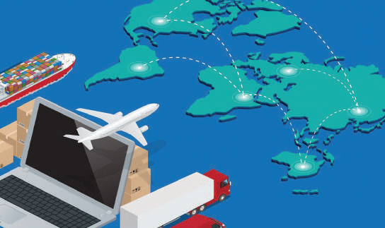
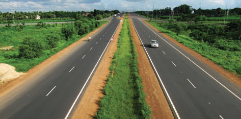
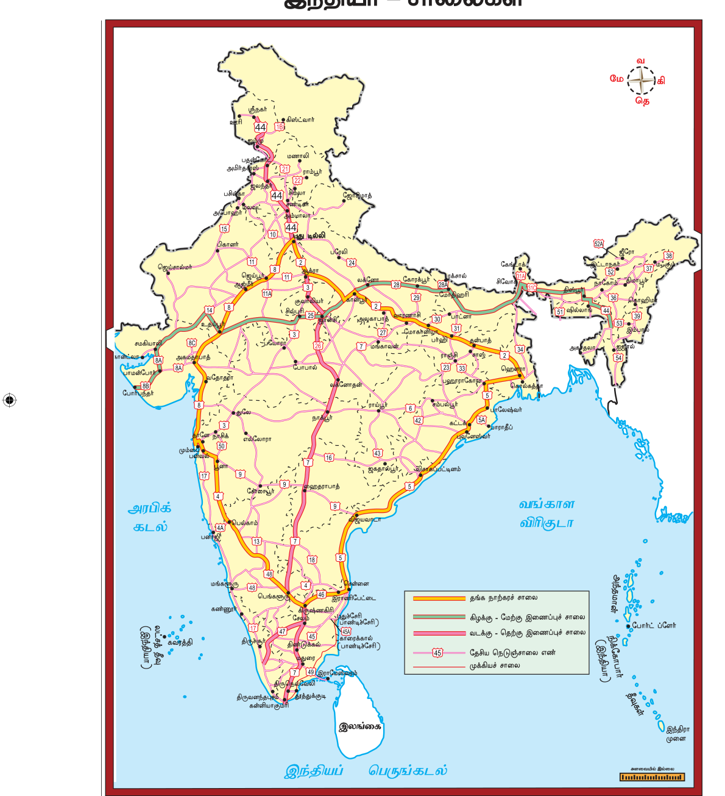
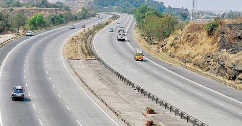
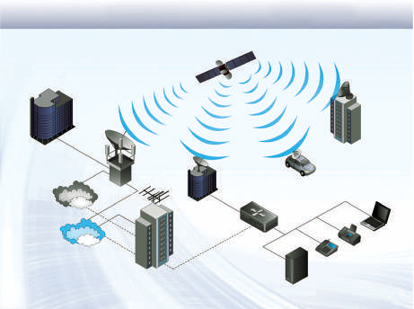

# புவியியல் அலகு 5: இந்தியா – மக்கள் தொகை, போக்குவரத்து, தகவல் தொடர்பு மற்றும் வணிகம்

## கற்றலின் நோக்கங்கள்

- இந்தியாவின் மக்கள்தொகை வளர்ச்சி மற்றும் பரவலை புரிந்துகொள்ளல்

- இந்தியாவின் மனிதவள மேம்பாடு பற்றி தெரிந்துகொள்ளல்

- இந்தியாவின் போக்குவரத்து அமைப்புகள் பற்றி கற்றிதல்

- இந்தியாவின் தகவல்தொடர்பு அமைப்புகள் பற்றி புரிந்துகொள்ளல்

- இந்தியாவின் வணிகத்தின் தன்மையை மதிப்பீடு செய்தல்

## அறிமுகம்

மக்கள் தொகையைப் பற்றி கற்றல் என்பது ஒரு பிரதேச புவியியலைப் படிப்பதில் உள்ள முக்கிய அம்சங்களில் ஒன்றாகும். மக்கள் தொகை பல கூறுகளை உள்ளடக்கியது. இதில் மிக அடிப்படையானது, அதன் எண்ணிக்கை, கலவை, பரவல் மற்றும் அடர்த்தி ஆகும். எனவே, மக்கள் தொகைக்கூறுகள் பற்றி படித்தல் அவசியமான ஒன்று. இந்த அம்சங்களைப் பற்றிய ஆய்வு நாட்டின் மனித சக்தியைப் பற்றி வெளிப்படுத்துவதாக அமைகிறது.

## 5.1 மக்கள் தொகை

ஒரு குறிப்பிட்ட காலப்பகுதியில் ஒரு நாட்டில் வசிக்கின்ற மொத்த மக்களின் எண்ணிக்கையே ஒரு நாட்டின் மக்கள் தொகை என்று அழைக்கப்படுகிறது. உலகில் அதிக மக்கள்தொகை கொண்ட நாடாக இந்தியா உள்ளது. உலகின் மொத்த நிலப்பரப்பில் இந்தியா 2.4 சதவிகித்தை மட்டுமே கொண்டுள்ளது. ஆனால், உலக மக்கள் தொகையில் சுமார் 17.5 சதவிகித்தை கொண்டுள்ளது. இந்திய மக்கள் தொகை விகிதம் அதன் பரப்பு விகித்தை விட மிக அதிகமாக உள்ளதை இது காட்டுகிறது. உலகில் உள்ள ஆறு நபர்களில் ஒருவர் இந்தியராக உள்ளார்.

### மக்கள் தொகைக் கணக்கெடுப்பு

மக்கள் தொகைக் கணக்கெடுப்பு என்பது ஒரு நாட்டின் வரையறுக்கப்பட்ட பகுதி அல்லது முழுப்பகுதியில் ஒரு குறிப்பிட்ட காலத்தில் உள்ள மக்களின் பொருளாதார மற்றும் சமூக புள்ளி விவரங்களை சேகரித்து, தொகுத்து மற்றும் பகுப்பாய்வு செய்து மக்களியல் பற்றிய விவரங்களை அளித்தல் ஆகும். இந்த கணக்கெடுப்பு பத்து ஆண்டுகளுக்கு ஒருமுறை நடத்தப்படுகிறது. மக்கள் தொகை கணக்கெடுப்பின் மூலம் சேகரிக்கப்பட்ட தரவுகள், நிருவாகம், திட்டமிடல், கொள்கைகள் உருவாக்குதல், அரசாங்கத்தின் பல்வேறு திட்ட மேலாண்மை மற்றும் மதிப்பீடு செய்தலுக்கு பயன்படுத்தப்படுகிறது.

இந்தியாவின் முதல் மக்கள் தொகைக் கணக்கெடுப்பு 1872ஆம் ஆண்டு மேற்க்கொள்ளப்பட்டது. முழுமையான முதல் மக்கள் தொகைக் கணக்கெடுப்பு 1881ஆம் ஆண்டு மேற்க்கொள்ளப்பட்டது. நாட்டின் 15 வது மக்கள் தொகைக் கணக்கெடுப்பு 2011ஆம்ஆண்டு நடைபெற்றது.

### மக்கள் தொகை அடர்த்தி மற்றும் பரவல்

’மக்கள் தொகை பரவல்’ என்பது புவியின் மேற்பரப்பில் மக்கள் எவ்விடைவெளியில் உள்ளனர் என்பதைக் குறிக்கிறது. இந்திய மக்கள் தொகை பரவலானது வளங்களின் பரவலுக்கேற்ப சீரற்று காணப்படுகிறது. தொழில் மையங்கள் மற்றும் செழிப்பான வேளாண் பிரதேசங்கள் மக்கள் தொகை செறிவுமிக்கதாகக் காணப்படுகிறது. அதே சமயம் மலைப்பிரதேசங்கள் வறண்ட நிலப்பகுதிகள், வனப்பகுதிகள், தொலைதூரப் பகுதிகள் போன்ற பகுதிகளில் மக்கள் தொகைக் குறைவாகவும் மற்றும் சில பகுதிகள் மக்களற்றும் காணப்படுகிறது. நிலப்பரப்பு, காலநிலை, மண், நீர் பரப்புகள், கனிம வளங்கள், தொழிலகங்கள், போக்குவரத்து மற்றும் நகரமயமாக்கல் ஆகியவை நாட்டின் மக்கள் தொகைப் பரவலைப் பாதிக்கும் முக்கிய காரணிகளாகும்.

199.5 மில்லியன் மக்கள்தொகையைக் கொண்ட உத்தரப்பிரதேச மாநிலம் இந்தியாவில் அதிக மக்கள்தொகை கொண்ட மாநிலமாகும். இதனைத் தொடர்ந்து மகாராஷ்டிரா (112.3 மில்லியன்), பீகார் (103.8 மில்லியன்), மேற்கு வங்காளம் (91.3 மில்லியன்) மற்றும் ஒருங்கிணைந்த ஆந்திரப்பிரதேசம் (84.6 மில்லியன்) ஆகிய ஐந்து மாநிலங்கள் நாட்டின் மக்கள் தொகையில் பாதியைக் கொண்டுள்ளன. இந்தியாவில் மிகக்குறைந்த மக்கள் தொகை கொண்ட மாநிலம் சிக்கிம் (0.61 மில்லியன்) ஆகும். புதுடெல்லி (16.75 மில்லியன்) மக்கள்தொகையுடன் யூனியன் பிரதேசங்களிடையே முதலிடம் வகிக்கிறது.

நாட்டின் மக்கள்தொகை பரவல் சீரற்று காணப்படுவதற்கு பெளதீக, சமூக-பொருளாதார மற்றும் வரலாற்று காரணிகள் முக்கியப் பங்கு வகிக்கின்றன. பெளதீக காரணிகள் என்பது நிலத்தோற்றம், காலநிலை, நீர், இயற்கைத் தாவரங்கள், கனிமங்கள் மற்றும் ஆற்றல் வளங்களை உள்ளடக்கியது. மதம், கலாச்சாரம், அரசியல் பிரச்சினைகள், பொருளாதாரம், மனித குடியிருப்புகள், போக்குவரத்து வலைப்பின்னல், கீழ்க்காணும் கோட்டுப்படம் 1901ஆம் ஆண்டு முதல் 2011 ஆம் ஆண்டு வரையான பத்தாண்டுகள் மக்கள் தொகை வளர்ச்சி விகித்தைக் காண்பிக்கிறது.

|  |  |  |  |  |  |  |  |  |  |  |  |  |  |  |  |  |  |  |  |  |  |  |  |  |  |  |  |  |  |  |  |  | 5 |  |  |  |  |  |  |  |  |  | 9 |  |  |  |  |  |  |  |  |  |  |  |  |  |  |  |  |  |  |  |  |  |  |  |  |  |  |  |  |  |  |  |  |  |  |  |  |  |  |  |  |  |  |  |  |  |  |  |  |  |  |  |  |  |  |  |  |  |  |  |  |  |  |  |
|---|---|---|---|---|---|---|---|---|---|---|---|---|---|---|---|---|---|---|---|---|---|---|---|---|---|---|---|---|---|---|---|---|---|---|---|---|---|---|---|---|---|---|---|---|---|---|---|---|---|---|---|---|---|---|---|---|---|---|---|---|---|---|---|---|---|---|---|---|---|---|---|---|---|---|---|---|---|---|---|---|---|---|---|---|---|---|---|---|---|---|---|---|---|---|---|---|---|---|---|---|---|---|---|---|---|---|
|  |  |  |  |  |  |  |  |  |  |  |  |  |  |  |  |  |  |  |  |  |  |  |  |  |  |  |  |  |  |  |  |  | , |  |  |  |  |  |  |  |  |  | 0 |  |  |  |  |  |  |  |  |  |  |  |  |  |  |  |  |  |  |  |  |  |  |  |  |  |  |  |  |  |  |  |  |  |  |  |  |  |  |  |  |  |  |  |  |  |  |  |  |  |  |  |  |  |  |  |  |  |  |  |  |  |  |  |
|  |  |  |  |  |  |  |  |  |  |  |  |  |  |  |  |  |  |  |  |  |  |  | ) |  |  |  |  |  |  |  |  |  | 0 |  |  |  |  |  |  |  |  |  | , |  |  |  |  |  |  |  |  |  |  |  |  |  |  |  |  |  |  |  |  |  |  |  |  |  |  |  |  |  |  |  |  |  |  |  |  |  |  |  |  |  |  |  |  |  |  |  |  |  |  |  |  |  |  |  |  |  |  |  |  |  |  |  |
|  |  |  |  |  |  |  |  |  |  |  |  |  |  |  |  |  |  |  |  |  |  |  | 8 |  |  |  |  |  |  |  |  |  | ,6 |  |  |  |  |  |  |  |  |  | 8 |  |  |  |  |  |  |  |  |  |  |  |  |  |  |  |  |  |  |  |  |  |  |  |  |  |  |  |  |  |  |  |  |  |  |  |  |  |  |  |  |  |  |  |  |  |  |  |  |  |  |  |  |  |  |  |  |  |  |  |  |  |  |  |
|  |  |  |  |  |  |  |  |  |  |  |  |  |  |  |  |  |  |  |  |  |  |  | 3 |  |  |  |  |  |  |  |  |  | 6 |  |  |  |  |  |  |  |  |  | ,8 |  |  |  |  |  |  |  |  |  |  |  |  |  |  |  |  |  |  |  |  |  |  |  |  |  |  |  |  |  |  |  |  |  |  |  |  |  |  |  |  |  |  |  |  |  |  |  |  |  |  |  |  |  |  |  |  |  |  |  |  |  |  |  |
|  |  |  |  |  |  |  |  |  |  |  |  |  |  |  |  |  |  |  |  |  |  |  | 2 |  |  |  |  |  |  |  |  |  | 8 |  |  |  |  |  |  |  |  |  | 0 |  |  |  |  |  |  |  |  |  |  |  |  |  |  |  |  |  |  |  |  |  |  |  |  |  |  |  |  |  |  |  |  |  |  |  |  |  |  |  |  |  |  |  |  |  |  |  |  |  |  |  |  |  |  |  |  |  |  |  |  |  |  |  |
|  |  |  |  |  |  |  |  |  |  |  |  |  |  |  |  |  |  |  |  |  |  |  | 7, |  |  |  |  |  |  |  |  |  | 1, |  |  |  |  |  |  |  |  |  | 1 |  |  |  |  |  |  |  |  |  |  |  |  |  |  |  |  |  |  |  |  |  |  |  |  |  |  |  |  |  |  |  |  |  |  |  |  |  |  |  |  |  |  |  |  |  |  |  |  |  |  |  |  |  |  |  |  |  |  |  |  |  |  |  |
|  |  |  |  |  |  | ) |  |  |  |  |  |  |  |  |  |  |  |  |  |  |  |  | 7 |  |  |  |  |  |  |  |  |  | 3 |  |  |  |  |  |  |  |  |  | 6, |  |  |  |  |  |  |  |  |  |  |  |  |  |  |  |  |  |  |  |  |  |  |  |  |  |  |  |  |  |  |  |  |  |  |  |  |  |  |  |  |  |  |  |  |  |  |  |  |  |  |  |  |  |  |  |  |  |  |  |  |  |  |  |
|  |  |  |  |  |  | 0 |  |  |  |  |  |  |  |  |  |  |  |  |  |  |  |  | , |  |  |  |  |  |  |  |  |  | ( |  |  |  |  |  |  |  |  |  | 3 |  |  |  |  |  |  |  |  |  |  |  |  |  |  |  |  |  |  |  |  |  |  |  |  |  |  |  |  |  |  |  |  |  |  |  |  |  |  |  |  |  |  |  |  |  |  |  |  |  |  |  |  |  |  |  |  |  |  |  |  |  |  |  |
|  |  |  |  |  |  | 9 |  |  |  |  |  |  |  |  |  |  |  |  |  |  |  |  | 9 |  |  |  |  |  |  |  |  |  | % |  |  |  |  |  |  |  |  |  | ( |  |  |  |  |  |  |  |  |  |  |  |  |  |  |  |  |  |  |  |  |  |  |  |  |  |  |  |  |  |  |  |  |  |  |  |  |  |  |  |  |  |  |  |  |  |  |  |  |  |  |  |  |  |  |  |  |  |  |  |  |  |  |  |
|  |  |  |  |  |  | ,3 |  |  |  |  |  |  |  |  |  |  |  |  |  |  |  |  | 8 |  |  |  |  |  |  |  |  |  |  |  |  |  |  |  |  |  |  |  | % |  |  |  |  |  |  |  |  |  |  |  |  |  |  |  |  |  |  |  |  |  |  |  |  |  |  |  |  |  |  |  |  |  |  |  |  |  |  |  |  |  |  |  |  |  |  | ) |  |  |  |  |  |  |  |  | ) |  |  |  |  |  |  |  |
|  |  |  |  |  |  | 3 |  |  |  |  |  |  |  | ) |  |  |  |  |  |  |  |  | 7, |  |  |  |  |  |  |  |  |  | 2 |  |  |  |  |  |  |  |  |  |  |  |  |  |  |  |  |  |  |  |  |  |  |  |  |  |  |  |  |  |  |  |  |  |  |  |  |  |  |  |  |  |  |  |  |  |  |  |  |  |  |  |  |  |  |  |  | 7 |  |  |  |  |  |  |  |  | 2 |  |  |  |  |  |  |  |
|  |  |  |  |  |  | 9 |  |  |  |  |  |  |  | 0 |  |  |  |  |  |  |  |  | 2 |  |  |  |  |  |  |  |  |  | .2 |  |  |  |  |  |  |  |  |  | 1 |  |  |  |  |  |  |  | ) |  |  |  |  |  |  |  |  |  | ) |  |  |  |  |  |  |  |  |  | ) |  |  |  |  |  |  |  |  |  | ) |  |  |  |  |  |  |  |  | 4 |  |  |  |  |  |  |  |  | 2 |  |  |  |  |  |  |  |
|  |  |  |  |  |  | 0, |  |  |  |  |  |  |  | 9 |  |  |  |  |  |  |  |  | ( |  |  |  |  |  |  |  |  |  | 4 |  |  |  |  |  |  |  |  |  | .3 |  |  |  |  |  |  |  | 1 |  |  |  |  |  |  |  |  |  | 2 |  |  |  |  |  |  |  |  |  | 7 |  |  |  |  |  |  |  |  |  | 8 |  |  |  |  |  |  |  |  | 2 |  |  |  |  |  |  |  |  | 4 |  |  |  |  |  |  |  |
| ) |  |  |  |  |  | 2 |  |  |  |  |  |  |  | 3 |  |  |  |  |  |  |  |  | % |  |  |  |  |  |  |  |  |  | 1 |  |  |  |  |  |  |  |  |  | 3 |  |  |  |  |  |  |  | 7 |  |  |  |  |  |  |  |  |  | 5 |  |  |  |  |  |  |  |  |  | 9 |  |  |  |  |  |  |  |  |  | 8 |  |  |  |  |  |  |  |  | , |  |  |  |  |  |  |  |  | , |  |  |  |  |  |  |  |
| 7 |  |  |  |  |  | , |  |  |  |  |  |  |  | 3, |  |  |  |  |  |  |  |  |  |  |  |  |  |  |  |  |  |  |  |  |  |  |  |  |  |  |  |  | 1 |  |  |  |  |  |  |  | ,7 |  |  |  |  |  |  |  |  |  | ,6 |  |  |  |  |  |  |  |  |  | ,0 |  |  |  |  |  |  |  |  |  | ,8 |  |  |  |  |  |  |  |  | 5 |  |  |  |  |  |  |  |  | 3 |  |  |  |  |  |  |  |
| 23 |  |  |  |  |  | 5 |  |  |  |  |  |  |  | 9 |  |  |  |  |  |  |  |  | 1 |  |  |  |  |  |  |  |  |  |  |  |  |  |  |  |  |  |  |  |  |  |  |  |  |  |  |  | 4 |  |  |  |  |  |  |  |  |  | 9 |  |  |  |  |  |  |  |  |  | 9 |  |  |  |  |  |  |  |  |  | 7 |  |  |  |  |  |  |  |  | ,1 |  |  |  |  |  |  |  |  | ,9 |  |  |  |  |  |  |  |
| , |  |  |  |  |  | 2 |  |  |  |  |  |  |  | , |  |  |  |  |  |  |  |  | 1 |  |  |  |  |  |  |  |  |  |  |  |  |  |  |  |  |  |  |  |  |  |  |  |  |  |  |  | 3 |  |  |  |  |  |  |  |  |  | 5 |  |  |  |  |  |  |  |  |  | 2 |  |  |  |  |  |  |  |  |  | 8 |  |  |  |  |  |  |  |  | 0 |  |  |  |  |  |  |  |  | 1 |  |  |  |  |  |  |  |
| 6 |  |  |  |  |  | ( |  |  |  |  |  |  |  | 0 |  |  |  |  |  |  |  |  |  |  |  |  |  |  |  |  |  |  |  |  |  |  |  |  |  |  |  |  |  |  |  |  |  |  |  |  | 2, |  |  |  |  |  |  |  |  |  | 1, |  |  |  |  |  |  |  |  |  | 3, |  |  |  |  |  |  |  |  |  | 3, |  |  |  |  |  |  |  |  | 7 |  |  |  |  |  |  |  |  | 0 |  |  |  |  |  |  |  |
| 9 |  |  |  |  |  | % |  |  |  |  |  |  |  | 2 |  |  |  |  |  |  |  |  |  |  |  |  |  |  |  |  |  |  |  |  |  |  |  |  |  |  |  |  |  |  |  |  |  |  |  |  | 9 |  |  |  |  |  |  |  |  |  | 8 |  |  |  |  |  |  |  |  |  | 3 |  |  |  |  |  |  |  |  |  | 3 |  |  |  |  |  |  |  |  | 2, |  |  |  |  |  |  |  |  | 1, |  |  |  |  |  |  |  |
| 9, |  |  |  |  |  | 5 |  |  |  |  |  |  |  | 5, |  |  |  |  |  |  |  |  |  |  |  |  |  |  |  |  |  |  |  |  |  |  |  |  |  |  |  |  |  |  |  |  |  |  |  |  | , |  |  |  |  |  |  |  |  |  | , |  |  |  |  |  |  |  |  |  | , |  |  |  |  |  |  |  |  |  | , |  |  |  |  |  |  |  |  | 0 |  |  |  |  |  |  |  |  | 2 |  |  |  |  |  |  |  |
| 8 |  |  |  |  |  | 7 |  |  |  |  |  |  |  | 2 |  |  |  |  |  |  |  |  |  |  |  |  |  |  |  |  |  |  |  |  |  |  |  |  |  |  |  |  |  |  |  |  |  |  |  |  | 3 |  |  |  |  |  |  |  |  |  | 4 |  |  |  |  |  |  |  |  |  | 8 |  |  |  |  |  |  |  |  |  | 4 |  |  |  |  |  |  |  |  | , |  |  |  |  |  |  |  |  | , |  |  |  |  |  |  |  |
| , |  |  |  |  |  | . |  |  |  |  |  |  |  | ( |  |  |  |  |  |  |  |  |  |  |  |  |  |  |  |  |  |  |  |  |  |  |  |  |  |  |  |  |  |  |  |  |  |  |  |  | 4 |  |  |  |  |  |  |  |  |  | 5 |  |  |  |  |  |  |  |  |  | 6 |  |  |  |  |  |  |  |  |  | 8 |  |  |  |  |  |  |  |  | 1 |  |  |  |  |  |  |  |  | 1 |  |  |  |  |  |  |  |
| 3 |  |  |  |  |  | 5 |  |  |  |  |  |  |  | % |  |  |  |  |  |  |  |  |  |  |  |  |  |  |  |  |  |  |  |  |  |  |  |  |  |  |  |  |  |  |  |  |  |  |  |  | ( |  |  |  |  |  |  |  |  |  | ( |  |  |  |  |  |  |  |  |  | ( |  |  |  |  |  |  |  |  |  | ( |  |  |  |  |  |  |  |  | ( |  |  |  |  |  |  |  |  | ( |  |  |  |  |  |  |  |
| (2 |  |  |  |  |  |  |  |  |  |  |  |  |  |  |  |  |  |  |  |  |  |  |  |  |  |  |  |  |  |  |  |  |  |  |  |  |  |  |  |  |  |  |  |  |  |  |  |  |  |  | % |  |  |  |  |  |  |  |  |  | % |  |  |  |  |  |  |  |  |  | % |  |  |  |  |  |  |  |  |  | % |  |  |  |  |  |  |  |  | % |  |  |  |  |  |  |  |  | % |  |  |  |  |  |  |  |
|  |  |  |  |  |  |  |  |  |  |  |  |  |  | 31 |  |  |  |  |  |  |  |  |  |  |  |  |  |  |  |  |  |  |  |  |  |  |  |  |  |  |  |  |  |  |  |  |  |  |  |  | 4 |  |  |  |  |  |  |  |  |  | 0 |  |  |  |  |  |  |  |  |  | 6 |  |  |  |  |  |  |  |  |  | 7 |  |  |  |  |  |  |  |  | 4 |  |  |  |  |  |  |  |  | 4 |  |  |  |  |  |  |  |
| % |  |  |  |  |  |  |  |  |  |  |  |  |  | . |  |  |  |  |  |  |  |  |  |  |  |  |  |  |  |  |  |  |  |  |  |  |  |  |  |  |  |  |  |  |  |  |  |  |  |  | 6 |  |  |  |  |  |  |  |  |  | 8 |  |  |  |  |  |  |  |  |  | 6 |  |  |  |  |  |  |  |  |  | 8 |  |  |  |  |  |  |  |  | 5 |  |  |  |  |  |  |  |  | 6 |  |  |  |  |  |  |  |
| 0 |  |  |  |  |  |  |  |  |  |  |  |  |  | 0 |  |  |  |  |  |  |  |  |  |  |  |  |  |  |  |  |  |  |  |  |  |  |  |  |  |  |  |  |  |  |  |  |  |  |  |  | . |  |  |  |  |  |  |  |  |  | . |  |  |  |  |  |  |  |  |  | . |  |  |  |  |  |  |  |  |  | . |  |  |  |  |  |  |  |  | . |  |  |  |  |  |  |  |  | . |  |  |  |  |  |  |  |
|  |  |  |  |  |  |  |  |  |  |  |  |  |  | - |  |  |  |  |  |  |  |  |  |  |  |  |  |  |  |  |  |  |  |  |  |  |  |  |  |  |  |  |  |  |  |  |  |  |  |  | 1 |  |  |  |  |  |  |  |  |  | 4 |  |  |  |  |  |  |  |  |  | 4 |  |  |  |  |  |  |  |  |  | 3 |  |  |  |  |  |  |  |  | 1 |  |  |  |  |  |  |  |  | 7 |  |  |  |  |  |  |  |
|  |  |  |  |  |  |  |  |  |  |  |  |  |  |  |  |  |  |  |  |  |  |  |  |  |  |  |  |  |  |  |  |  |  |  |  |  |  |  |  |  |  |  |  |  |  |  |  |  |  |  | 2 |  |  |  |  |  |  |  |  |  | 2 |  |  |  |  |  |  |  |  |  | 2 |  |  |  |  |  |  |  |  |  | 2 |  |  |  |  |  |  |  |  | 2 |  |  |  |  |  |  |  |  | 1 |  |  |  |  |  |  |  |

தொழில்மயமாக்கல், நகரமயமாதல், வேலை வாய்ப்புகள் போன்றவை முக்கிய சமூக பொருளாதாரக் காரணிகளாகும்.

### மக்கள் தொகை அடர்த்தி

இது சராசரியாக ஒரு சதுர கிலோ மீட்டர் பரப்பளவில் வசிக்கும் மக்களின் எண்ணிக்கையைக் குறிப்பிடுகிறது. 2011ஆம் ஆண்டின் மக்கள் தொகைக் கணக்கெடுப்பின்படி இந்தியாவின் சராசரி மக்கள் அடர்த்தி ஒரு சதுர கிலோ மீட்டருக்கு 382 ஆகும். உலகின் மக்களடர்த்தி மிகுந்த பத்து நாடுகளில் இந்தியாவும் ஒன்று. இந்தியாவில் மிக அதிக மக்களடர்த்தியைக் கொண்ட மாநிலமாக பீகாரும் மிகக் குறைந்த மக்கள் அடர்த்தியைக் கொண்ட மாநிலமாக அருணாச்சலப் பிரதேசமும் உள்ளது. யூனியன் பிரதேசங்களில் புதுடெல்லி 11,297/ச.கீமி அதிக மக்களடர்த்தியைக் கொண்டதாகவும், அந்தமான் நிக்கோபார் தீவுகள் குறைந்த மக்களடர்த்தியைக் கொண்டதாகவும் உள்ளன.

### மக்கள் தொகை வளர்ச்சி மற்றும் மாற்றம்

### மக்கள் தொகை மாற்றம்

மக்கள் தொகை மாற்றம் என்பது ஒரு குறிப்பிட்ட காலப் பகுதியிலிருந்து மற்றொரு காலப்பகுதிக்கு இடைப்பட்ட காலத்தில் மக்கள் தொகை அதிகரிப்பதையோ அல்லது குறைவதையோ குறிப்பிடுவதாகும். பிறப்பு விகிதம், இறப்பு விகிதம் மற்றும் இடப்பெயர்வு ஆகியவை மக்கள் தொகை வளர்ச்சியைத் தீர்மானிக்கிறது. மேலும், இவை மூன்றும் மக்கள் தொகையில் மாற்றத்தை ஏற்படுத்துகின்றன.

பிறப்பு விகிதம் என்பது ஒரு ஆண்டிற்கு 1000 மக்கள் எண்ணிக்கையில் உயிருடன் பிறந்த குழந்தைகளின் எண்ணிக்கையாகும். இறப்பு விகிதம் எனப்படுவது ஓர் ஆண்டில் 1000 மக்கள் தொகையில் இறந்தவர்களின் எண்ணிக்கையைக் குறிப்பதாகும். இந்தியாவில் இறப்பு விகித்தின் விரைவான சரிவு மக்கள் தொகையின் துரித வளர்ச்சிக்கு முக்கியக் காரணமாகும்.

## 5.2 இடப் பெயர்வு

இடப்பெயர்வு என்பது ஒரு பகுதியிலிருந்து மற்றொரு பகுதிக்கு மக்கள் இடம் பெயர்ந்து செல்வதாகும். இது உள்நாட்டு இடப்பெயர்வு (ஒரு நாட்டின் எல்லைக்குள்) மற்றும் சர்வதேச இடப்பெயர்வு (நாடுகளுக்கு இடையே) என இருவகைப்படும். உள்நாட்டு இடப்பெயர்வு நாட்டின் மக்கள் தொகையில் மாற்றத்தை ஏற்படுத்தாது. ஆனால், ஒரு நாட்டின் மக்கள் தொகை பரவல் மாற்றத்திற்குக் காரணமாக அமைகிறது. இடப்பெயர்வானது மக்கள் தொகை பரவல் மற்றும் கலவையின் மாற்றத்தை ஏற்படுத்தும் காரணியாக அமைகிறது. இந்தியாவில் இடப்பெயர்வு கிராமப்புறத்திலிருந்து நகர்புறத்தை நோக்கி பெருந்திரளாக காணப்படுகிறது. கிராமப்புறங்களில் வேலைவாய்ப்பின்மை மற்றும் தகுதிக்கேற்ப வேலையின்மை ஆகியவை இடப்பெயர்வுக்கு உந்து காரணிகளாக உள்ளன. நகர்புற பகுதிகளில் தொழில்துறை வளர்ச்சியின் காரணமாக அதிக வேலைவாய்ப்பு மற்றும் அதிக ஊதியம் புலம்பெயர்தலுக்கு இழுகாரணிகளாக உள்ளன.

### மக்கள் தொகைக் கலவை

மக்கள் தொகைக் கலவை என்பது பல்வேறு பண்புகளான வயது, பாலினம், திருமணநிலை, சாதி, மதம், மொழி, கல்வி, தொழில் போன்றவற்றை உள்ளடக்கியது. மக்கள் தொகைக் கலவை பற்றி கற்பது சமூக-பொருளாதார மற்றும் மக்கள் தொகையின் அமைப்பை அறிய உதவுகிறது.

### வயதுக் கலவை

வயதுக் கலவை என்பது ஒரு நாட்டின் மக்கள் தொகையில் உள்ள பல்வேறு வயது பிரிவினர் எண்ணிக்கையை குறிக்கிறது. நாட்டின் மக்கள் தொகை வயதின் அடிப்படையில் மூன்று பிரிவுகளாக பிரிக்கப்படுகிறது. இந்தியாவில் 15 வயதிற்கும் குறைவானவர்கள் 29.5 சதவிகிதமும், 60 வயதிற்கு மேற்பட்டவர்கள் 8 சதவிகிதமும் உள்ளனர். ஆதலால் பிறரை சார்ந்து வாழும் மக்கள் தொகை மொத்த மக்கள் தொகையில் 37.5 சதவிகிதமாக உள்ளது. மீதமுள்ள (16 - 59 வருடங்கள்) 62.5 சதவிகிதம் உழைக்கும் மக்கள் தொகையாக உள்ளது.

### பாலின விகிதம்

பாலின விகிதம் என்பது மக்கள் தொகையில் ஆயிரம் ஆண்களுக்கு உள்ள பெண்களின் எண்ணிக்கையை குறிப்பதாகும்.

நம் நாட்டில் பாலின விகிதம் எப்பொழுதும் பெண்களுக்கு சாதகமாக இருப்பதில்லை ஏன்?

2011 மக்கள் தொகைக் கணக்கெடுப்பின்படி இந்தியாவின் பாலின விகிதம் 1000 ஆண்களுக்கு 940 பெண்களாக உள்ளது. இது மக்கள் தொகையில் பெண்களின் எண்ணிக்கை ஆண்களை விட குறைவாக இருப்பதைக் காட்டுகிறது. கேரளாவில் 1084 பெண்களும், புதுச்சேரியில் 1038 பெண்களும், ஹரியானாவில் 879 பெண்களும் உள்ளனர். ஆனால், யூனியன் பிரதேசமான டையூ டாமனில் குறைந்த பாலின விகிதம் (618) பதிவாகியுள்ளது.

### எழுத்தறிவு விகிதம்

மக்களில் எவர் ஒருவர் ஏதாவதொரு மொழியைப் புரிந்துகொண்டு எழுதப் படிக்க தெரிந்ததால் அவர் எழுத்தறிவு பெற்றவர் ஆவார். இது மக்களின் தரத்தை அறியும் முக்கிய அளவு கோலாகும். மொத்த மக்கள் தொகையில் எழுத்தறிவு பெற்ற மக்களின் எண்ணிக்கையே எழுத்தறிவு விகிதம் எனப்படும். இந்தியாவில் கல்வியறிவு வளர்ச்சியில் தொடர்ச்சியான முன்னேற்றம் காணப்படுகின்றது. 2011 மக்கள் தொகைக் கணக்கெடுப்பின் படி இந்திய மக்கள் தொகையின் எழுத்தறிவு விகிதம் 74.04% ஆகும். இவற்றில் ஆண்களின் எழுத்தறிவு விகிதம் 82.14% ஆகவும் மற்றும் பெண்களின் எழுத்தறிவு விகிதம் 65.46% ஆகவும் உள்ளது. இது ஆண் மற்றும் பெண் எழுத்தறிவு விகித்தில் பெரும் வித்தியாசம் இருப்பதைக் காட்டுகிறது (16.68%). கேரள மாநிலம் எழுத்தறிவில் 93.91% பெற்று இந்தியாவின் முதல் மாநிலமாகவும், இலட்சத்தீவுகள் 92.28% இரண்டவதாகவும் உள்ளது. குறைந்த எழுத்தறிவு பெற்ற மாநிலமாக பீகார் (63.82%) உள்ளது. குறைந்த எழுத்தறிவு பெற்ற யுனியன் பிரதேசமாக தாத்ரா நாகர்வேலி (77.24%) உள்ளது.

### தொழில்சார் கட்டமைப்பு

மக்கள் தொகைக் கணக்கெடுப்பின் மூலம் பெறப்படும் தகவலின் அடிப்படையில் பொருளாதார நடவடிக்கையில் பங்கு பெறுபவர்களை தொழிலாளர்கள் என்கிறோம். தொழிலாளர்கள் மூன்று பிரிவுகளாகப் பிரிக்கப்படுகின்றனர். அவை முதன்மை தொழிலாளர்கள், பகுதி நேர தொழிலாளர்கள் மற்றும் தொழிலாளர் அல்லாதோர். மக்கள் தொகைக் கணக்கெடுப்பின்படி ஓர் ஆண்டின் பெரும் பகுதி நாள்களில் பணியாற்றுபவர்கள் முதன்மைத் தொழிலாளர்கள் எனப்படுவர் (குறைந்த பட்சம் வருடத்தில் 6 மாதம் அல்லது 183 நாள்கள்).

ஓர் ஆண்டில் 6 மாதங்களுக்குக் குறைவாக வேலை செய்பவர்கள் பகுதி நேரத் தொழிலாளர்கள் எனப்படுவர். வேலை செய்யாத மக்கள் தொழிலாளர் அல்லாதோர் எனப்படுவர்.

### மக்கள் தொகை இயக்கவியல்

மக்கள் தொகை இயக்கவியல் என்பது மக்கள் தொகை அளவு மற்றும் அதன் பண்பு மாற்றங்கள் தொடர்பான காரணிகள் குறித்து கற்கும் ஒரு துறையாகும். எதிர் நோக்கும் மக்கள் தொகை மாற்றங்கள் பற்றி படிப்பது மக்கள் தொகை ஆய்வின் ஒரு முக்கிய அம்சமாகும்.

### அதிக மக்கள் தொகையால் ஏற்படும் பிரச்சனைகள்

இந்திய நாட்டில் அதிகரித்து வரும் மக்கள் தொகையானது சமூகம், பொருளாதாரம், கலாச்சாரம், அரசியல் மற்றும் சுற்றுச்சூழலில் பெரும் சவால்களை ஏற்படுத்துகின்றன. மக்கள் தொகை பிரச்சனையானது இடம் மற்றும் காலம் பிரதேசத்திற்கு ஏற்ப மாறுபடுகிறது. மக்கள் தொகை அதிகரிப்பால் மக்கள் நெருக்கடி, வேலைவாய்ப்பின்மை மற்றும் திறனுக்கேற்ற வேலைவாய்ப்பின்மை, குறைந்த வாழ்க்கை தரம், ஊட்டச்சத்தின்மை, இயற்கை மற்றும் வேளாண் வளங்களை தவறாக நிருவகித்தல் ஆரோக்கியமற்ற சுற்றுச் சூழல் போன்ற பெரும் பிரச்சனைகளை ஏற்படுத்துகின்றன.

## 5.3 நகரமயமாக்கம்

கிராமப்புற சமுதாயம் நகர்புற சமுதாயமாக மாற்றமடைவதையே நகரமயமாக்கம் என்கிறோம்.

### இந்திய நகரமயமாக்கம்

நகர்புற மக்கள் தொகை சதவிகித்தின் அடிப்படையிலேயே நகரமயமாக்கம் அளவிடப்படுகிறது.

இந்தியாவில் கோவா மாநிலம் மிகுந்த நகரமயமாக்கப்பட்ட பகுதியாக உள்ளது. இமாச்சல பிரதேசம் குறைந்த நகரமயமாக்கப்பட்ட பகுதியாக உள்ளது. யூனியன் பிரதேசங்களுக்கிடையில் புதுடெல்லி மற்றும் சண்டிகர் மிகுந்த நகரமயமாக்கப்பட்ட பகுதிகளாக உள்ளன. மாநிலங்களுள் மிகுந்த நகரமயமாக்கப்பட்ட மாநிலங்களில் இரண்டாவதாக தமிழ்நாடும் அதைத்தொடர்ந்து கேரளா மற்றும் மகராஷ்டிராவும் உள்ளன.

### நகரமயமாக்களின் தாக்கங்கள்

நகரமயமாக்கலும் மக்கள் தொகை அடர்த்தியும் ஒன்றோடொ� ொன்று நெருங்கிய தொடர்புடையவை. கிராமத்திலிருந்து நகரங்களுக்கு இடப்பெயர்தல் நகர்பகுதிகளில் மக்கள் தொகை பெருக்கத்திற்கு வழிவகுக்கிறது. மும்பை, கொல்கத்தா, புதுடெல்லி போன்ற பெருநகரங்கள் தங்கள் கொள்ளவை விட அதிகமான மக்கள் தொகையுடன் காணப்படுகின்றன.

இந்தியாவில் நகரமயமாக்கலால் ஏற்படும் பிரச்சனைகள்:

- நகர விரிவாக்கத்தை ஏற்படுத்துகிறது.

- நகர்புறங்களில் மக்கள் நெரிசல் ஏற்பட வழிவகுக்கிறது.

- நகர்புறங்களில் குடியிருப்புகளின் பற்றாக்குறையை உருவாக்குகிறது.

- குடிசைப் பகுதிகள் தோன்ற காரணமாக உள்ளது.

- போக்குவரத்து நெரிசலை அதிகப்படுத்துகிறது.

- குடிநீர் பற்றாக்குறையை ஏற்படுத்துகிறது.

- வடிகால் பிரச்சனைகள் உண்டாகின்றன.

- திடக்கழிவு மேலாண்மையை சிக்கலாக்குகிறது.

- குற்றங்கள் அதிகரிக்க காரணமாகின்றன.

## 5.4 போக்குவரத்து

போக்குவரத்து என்பது பயணிகள் மற்றும் சரக்குகளை ஓரிடத்திலிருந்து மற்றொரு இடத்திற்கு எடுத்துச் செல்வதாகும். போக்குவரத்து அமைப்பு ஒரு நாட்டின் உயிர் நாடியாக கருதப்படுகிறது. பண்டைய காலத்தில் மனிதன் கால்நடையாகவோ அல்லது விலங்குகளையோ போக்குவரத்திற்கு பயன்படுத்தி வந்தான். சக்கரம் கண்டுபிடிக்கப்பட்டதன் மூலம் போக்குவரத்து எளிமையாக்கப்பட்டது மற்றும் படிப்படியாக பல்வேறுபட்ட போக்குவரத்து முறைகள் உருவாயின. உலகின் பிரதான மூன்று போக்குவரத்து வகைகள் பின்வருமாறு:

போக்குவரத்து வகைகள் நிலம்நீர்வான்வெளி உள்நாட்டு வான்வெளி, சாலை வழி, இரயில்வே, குழாய்வழி போக்குவரத்து உள்நாட்டு நீர் வழி, கடல் வழி பன்னாட்டு வான்வெளி

### சாலை வழி

சாலை வழி குறுகிய, மத்திய மற்றும் நீண்ட தூரத்திற்கு பயணிகள் மற்றும் சரக்குகளை கொண்டு செல்வதில் முக்கிய பங்கு வகிக்கிறது. இது குறுகிய தூர சேவைகளுக்கு பொருத்தமானதாக உள்ளது. சாலைகளை அமைப்பது மற்றும் பராமரிப்பு செய்வது மற்ற போக்குவரத்து முறைகளை ஒப்பிடும் பொழுது மலிவானதாகும். சாலைப் போக்குவரத்து அமைப்பு மூலம் பண்ணைகள், தொழிற்சாலைகள் மற்றும் சந்தைகள் ஆகியவற்றிக்கிடையில் எளிதில் தொடர்பை ஏற்படுத்த முடியும். இது சமுதாயத்தின் அனைத்துப் பிரிவு மக்களாலும் பயன்படுத்தக் கூடிய மலிவான போக்குவரத்தாகும்.

இந்தியாவில் சாலைகள் அமைப்பதற்கு மிக எளிதாக இருக்கும் வட இந்திய பெரும் சமவெளிகளில் அடர்த்தியான சாலை அமைப்பு காணப்படுகிறது. மலைப்பாங்கான பகுதிகளில் சாலைகள் அமைக்க கடினமாக உள்ளது. கேரளாவில் சாலைகளின் அடர்த்தி மிக அதிகமாகவும் ஜம்மு-காஷ்மீர், லடாக் பகுதிகளில் மிகக் குறைவாகவும் உள்ளது.

சாலை அமைத்தல் மற்றும் பராமரிப்பு நோக்கத்திற்காக இந்திய சாலைகள், தேசிய நெடுஞ்சாலைகள் (NH), மாநில நெடுஞ்சாலைகள் (SH) மாவட்ட சாலைகள், கிராமப்புறச்சாலைகள், எல்லையோர சாலைகள் மற்றும் பன்னாட்டு நெடுஞ்சாலைகள் என வகைப்படுத்தப்பட்டுள்ளன.

### இந்திய சாலைகளின் வகைகள்

### அ. தேசிய நெடுஞ்சாலைகள் (NH)

தேசிய நெடுஞ்சாலைகள் இந்திய சாலைப் போக்குவரத்தின் மிகமுக்கியமான அமைப்பாகும். இத்தேசிய நெடுஞ்சாலைகள் வடக்கு-தெற்கு, கிழக்கு-மேற்காக நாட்டின் எல்லைகளையும், மாநிலங்களின் தலைநகரங்கள், முக்கியத் துறைமுகங்கள், இரயில் நிலையங்கள், முக்கிய சுற்றுலா மையங்கள், தொழில் மையங்கள் ஷெர்சா சூர் தன்னுடைய பேரரசை பலப்படுத்தவும் ஒருங்கிணைக்கவும் சாஹி (ராயல்) சாலையை சிந்து பள்ளத்தாக்கிலிருந்து மேற்கு வங்காளத்தில் உள்ள சோனார் பள்ளத்தாக்கு வரை அமைத்தார். கொல்கத்தாவிலிருந்து பெஷாவர் வரை உள்ள இச்சாலை ஆங்கிலேயர் ஆட்சி காலத்தில் கிராண்ட் ட்ரங்க்சாலை என பெயர் மாற்றம் செய்யப்பட்டது. தற்போது இச்சாலை அமிர்தரசிலிருந்து கொல்கத்தாவரை நீட்டிப்பு செய்யப்பட்டுள்ளது.

ஆகியவற்றை இணைக்கின்றன. இந்தியாவின் தேசிய நெடுஞ்சாலைகளை மேம்படுத்துவதற்கும் பராமரிப்பதற்கும் இந்திய அரசின் தரைவழி மற்றும் நெடுஞ்சாலைத் துறை அமைச்சகம் பொறுப்பாகும். இந்தியாவில் மிக நீளமான தேசிய நெடுஞ்சாலை NH 44 ஆகும். இது ஜம்மு காஷ்மீரில் உள்ள ஸ்ரீநகரிலிருந்து தமிழ்நாட்டில் உள்ள கன்னியாகுமரி வரை 4,076 கி.மீ நீளத்தைக் கொண்டதாகும். குறைவான நீளமுடைய தேசிய நெடுஞ்சாலை NH 47 A ஆகும். இது குண்டணூர் வரை 6 கி.மீ தொலைவைக் கொண்ட கொச்சின் துறைமுகத்தை (வில்லிங்டன் தீவு) இணைக்கிறது.

இந்தியாவின் தேசிய நெடுஞ்சாலை ஆணையம் (NHAI) 1995இல் நிறுவப்பட்டது. இது தரைவழி போக்குவரத்து அமைச்சகத்தின் கீழ் இயங்கும் தன்னாட்சி பெற்ற அமைப்பாகும்.

இந்திய நிலவரைபடத்தில் முக்கிய தேசிய நெடுஞ்சாலைகளைக் குறிக்கவும்

### ஆ. மாநில நெடுஞ்சாலைகள்

மாநில நெடுஞ்சாலைகள் பொதுவாக மாநிலத்திலுள்ள முக்கிய மாநகரங்கள், நகரங்கள் மற்றும் மாவட்ட தலைநகரங்களை, மாநில தலைநகரத்துடனும் தேசிய நெடுஞ்சாலைகளுடனும் அண்டை மாநில நெடுஞ்சாலைகளுடனும் இணைக்கின்றன. இந்தச் சாலைகள் மாநில அரசால் அமைக்கப்பட்டு பராமரிக்கப்படுகிறது.

### இ. மாவட்டச் சாலைகள்

மாவட்டச் சாலைகள் மாநில நெடுஞ்சாலைகள் மற்றும் தேசிய நெடுஞ்சாலைகளுடன் மாவட்ட மற்றும் வட்டார தலைமை இடங்களை இணைக்கின்றன. மாவட்ட சாலைகள் மாநிலத்தின் பொதுப் பணித்துறையால் அமைக்கப்பட்டு பராமரிக்கப்படுகிறது.

## இந்தியா - சாலைகள்

### ஈ. ஊரகப் பகுதி சாலைகள் (கிராமச் சாலைகள்)

இச்சாலைகள் கிராமப்புறங்களை இணைப்பதில் முக்கிய பங்காற்றுகின்றன. இவை பல்வேறு கிராமங்களை அவற்றிற்கு அருகில் உள்ள நகரங்களுடன் இணைக்கின்றன. இவை கிராம பஞ்சாயத்துகளால் பராமரிக்கப்படுகின்றன.

### உ. எல்லைப்புறச் சாலைகள்

எல்லைப்புறச் சாலைகள் நாட்டின் எல்லைப்பகுதிகளில் அமைந்துள்ள முக்கியத்துவம் வாய்ந்த ஒரு சாலை வகைகளாகும். இவைகள் எல்லைப்புறச் சாலைகள் நிறுவனத்தால் அமைக்கப்பட்டு பராமரிக்கப்பட்டு வருகின்றன. இவ்வமைப்பு 1960இல் நிறுவப்பட்டது. இச்சாலைகள் வடக்கு மற்றும் வடகிழக்கு எல்லைப் பகுதிகளில் மிகவும் முக்கியத்துவம் வாய்ந்தஒன்றாகும். எல்லைப்புறச் சாலை நிறுவனம் உலகிலேயே உயரமான எல்லைப்புறச் சாலையை லடாக்கில் உள்ள லேவில் இருந்து சண்டிகர் வரை அமைக்கப்பட்டுள்ளது. இச்சாலை கடல் மட்டத்திலிருந்து சராசரியாக 4,270 மீட்டர் உயரத்தில் உள்ளது.

### ஊ. தங்க நாற்கரச் சாலைகள்

இது 5,846 கி.மீ நீளத்தையும் 4 முதல் 6 வழிகளைக் கொண்டதாகவும் உள்ளது. இது வடக்கு தெற்காக இந்தியாவின் நான்கு பெரு நகரங்களான புதுடெல்லி – கொல்கத்தா - சென்னை – மும்பை – புதுடெல்லி ஆகியவைகளை இணைக்கிறது. இத்திட்டம் 1999ஆம் ஆண்டு தொடங்கப்பட்டது.

தங்க நாற்கரச் சாலையின் சிறப்பம்சங்கள் மற்றும் பயன்களைக் கூறுக.

### எ. வட - தென் மற்றும் கிழக்கு – மேற்கு

### பகுதிகளை இணைக்கும் சாலைகள்

வட - தென் பகுதிகளை இணைக்கும் சாலைகளின் நோக்கம் ஜம்மு-காஷ்மீரில் உள்ள ஸ்ரீநகரையும் தமிழ்நாட்டில் உள்ள கன்னியாகுமரியையும் 4,076 கி.மீ நீளத்தைக் கொண்ட சாலை மூலம் இணைப்பதாகும். (கொச்சின், சேலம் உள்பட) கிழக்கு-மேற்கு பகுதிகளை இணைக்கும் சாலைகள் அசாம் மாநிலத்தில் சில்சரையும் குஜராத்தில் உள்ள துறைமுக நகரான போர்பந்தரையும் இணைக்கும் வகையில் 3,640 கி.மீ நீளத்திற்கு அமைக்கப்பட்டுள்ளது. இந்த இரண்டு சாலைகளும் ஜான்சியில் சந்திக்கின்றன.

### ஏ. விரைவுச் சாலைகள்

விரைவுச் சாலைகள் என்பன நன்கு மேம்படுத்தப்பட்ட தரமான பல்வழிப் பாதைகளைக் கொண்ட அதிவேக போக்குவரத்திற்கான சாலைகள் ஆகும். முக்கியமான சில விரைவுச் சாலைகள் 1) மும்பை – பூனா விரைவுச் சாலை 2) கொல்கத்தா டம்டம் விமான நிலைய விரைவுச்சாலை 3) துர்காப்பூர் கொல்கத்தா விரைவுச்சாலை 4) புதுடெல்லி மற்றும் ஆக்ரா இடையேயான யமுனா விரைவுச்சாலை.

மும்பை – பூனா விரைவுச் சாலை

### ஐ. பன்னாட்டு நெடுஞ்சாலைகள்

இந்தியா அதன் அண்டை நாடுகளுடன் இணக்கமான உறவை மேம்படுத்தும் நோக்கத்துடன் இணைக்கப்பட்டுள்ள சாலைகள் பன்னாட்டு நெடுஞ்சாலைகள் ஆகும். இச்சாலைகள் ஆசிய மற்றும் பசிபிக் பகுதிகளுக்கான பொருளாதார மற்றும் சமூக ஆணையம் (ESCHP) உடன்படிக்கையின் கீழ் உலக வங்கி நிதியுதவியின் மூலம் அமைக்கப்பட்டுள்ளன. இச்சாலைகள் பாகிஸ்தான், நேபாளம், பூடான், வங்கதேசம் மற்றும் மியான்மர் ஆகிய அண்டை நாடுகளை இந்திய தேசிய நெடுஞ்சாலைகளுடன் இணைக்கின்றன.

### இரயில் போக்குவரத்து

இந்திய இரயில்வே அமைப்பு நாட்டினுடைய உள்நாட்டு போக்குவரத்திற்கான முக்கிய உயிர் நாடியாக அமைந்துள்ளது. மிக அதிக அளவிலான பயணிகள் மற்றும் சரக்கு போக்குவரத்தின் தேவையை பூர்த்தி செய்வதன் மூலம் பொருளாதார வளர்ச்சிக்கான பங்களிப்பை இரயில்வே அளித்துவருகிறது. மேலும், இந்திய தரைவழிப் போக்குவரத்து அமைப்பின் முதுகெலும்பாக கருதப்படுகிறது. இது மக்களை ஒன்றிணைப்பதன் மூலம் தேசிய ஒருமைப்பாட்டை வளர்க்கிறது. வணிகம், சுற்றுலா, கல்வி போன்றவற்றையும் ஊக்குவிக்கிறது. வேளாண்துறையில் எளிதில் அழுகக்கூடிய பொருள்களை வர்த்தகம் செய்ய விரைவான போக்குவரத்தை அளித்து உதவி புரிகிறது. மூலப்பொருள்களைத் தொழிற்சாலைக்கும் தயாரிக்கப்பட்ட தொழிலக பொருள்களைச் சந்தைகளுக்கும் கொண்டு செல்லும் இரயில்வேயின் பணி மதிப்பிட முடியாத ஒன்று. இந்திய இரயில் போக்குவரத்து உலக அளவில் நான்காவது பெரிய அமைப்பு ஆகும்.

இரயில்களின் இயக்கம் மற்றும் மேலாண்மைக்காக, இந்திய இரயில்வே துறை 17 இரயில்வே மண்டலங்களாகப் பிரிக்கப்பட்டுள்ளது. அவை.

| வ. எண். | மண்டலங்கள் | தலைமையிடம் |
|---|---|---|
| 1 2 3 4 5 6 7 8 9 10 11 12 13 14 15 16 17 | வடக்கு இரயில்வே வடமேற்கு இரயில்வே வட மத்திய இரயில்வே வடகிழக்கு இரயில்வே வடகிழக்கு எல்லை இரயில்வே கிழக்கு இரயில்வேகிழக்கு கடற்கரை இரயில்வே கிழக்கு மத்திய இரயில்வேமேற்கு மத்திய இரயில்வே மத்திய இரயில்வே மேற்கு இரயில்வே. தெற்கு இரயில்வே தென் மத்திய இரயில்வே தென் கிழக்கு இரயில்வே தென்மேற்கு இரயில்வே தென் கிழக்கு மத்திய இரயில்வே கொங்கன் இரயில்வே | புதுடெல்லி ஜெய்ப்பூர் அலகாபாத் கோரக்பூர்கௌகாத்தி கொல்கத்தா புவனேஸ்வர்ஹஜிப்பூர்ஜபல்பூர் மும்பை (சத்ரபதி சிவாஜி முனையம்) மும்பை (சர்ச்கேட்) சென்னைசெகந்தராபாத்கொல்கத்தாஹுப்ளிபிலாஸ்பூர்நவி மும்பை |

இந்திய இரயில்வே துறை இருப்புப்பாதையின் அகலத்தை அடிப்படையாகக் கொண்டு நான்கு வகைகளாகப் பிரிக்கப்படுகிறது. அவை

1. அகலப்பாதை (1.676 மீ அகலம்)

இந்தியாவின் முதல் புறநகர் இரயில் போக்குவரத்து மும்பையில் 1925இல் தொடங்கப்பட்டது. காதிமென் (GATHIMAN) அதிவிரைவு வண்டி இந்தியாவின் மிக அதிகவேக இரயில்வண்டி ஆகும். இந்த இரயில்வண்டி மணிக்கு 160கி.மீ வேகத்தில் புதுடெல்லியையும் ஆக்ராவையும் இணைக்கிறது.

2. மீட்டர் பாதை (1.00 மீ அகலம்)

3. குறுகிய பாதை (0.762 மீ. அகலம்) மற்றும்

4. குறுகிய தூக்குப் பாதை (0.610. அகலம்) ஆகியவையாகும்.

### அ. இந்திய மெட்ரோ இரயில் போக்குவரத்து

இந்தியாவில் 8 பெரு நகரங்களில் மெட்ரோ இரயில்சேவை வழங்கப்படுகிறது. அவைகள் கொல்கத்தா (மேற்கு வங்காளம்) சென்னை (தமிழ்நாடு) புதுடெல்லி, பெங்களூரு (கர்நாடகா) குர்கயோன் (ஹரியானா) மும்பை (மகாராஷ்டிரா) ஜெய்ப்பூர் (இராஜஸ்தான்) மற்றும் கொச்சி (கேரளா) ஆகும். இந்தியாவில் இந்த இரயில் சேவை முதன் முதலில் கொல்கத்தாவில் தொடங்கப்பட்டது. இது பறக்கும் தொடருந்து திட்டம் என அழைக்கப்படுகிறது. இது அதிக மக்களை விரைவாக ஏற்றிச் செல்லும் அமைப்பாகக் கருதப்படுகிறது. MRTS நவம்பர் 2022இன்படி இந்தியாவில் 810 கி.மீ நீள மெட்ரோ இருப்பு பாதைகள் 381 இரயில் நிலையங்களுடன் இயங்கிவருகிறது.

### குழாய் வழிபோக்குவரத்து

எண்ணெய் மற்றும் இயற்கை எரிவாயு வயல்களையும், எண்ணெய் சுத்திகரிப்பு நிலையங்களையும் அவற்றின் சந்தைப் பகுதிகளோடு இணைப்பதற்கு எளிதான மற்றும் சிறந்த போக்குவரத்ததாக குழாய் போக்குவரத்து செயல்பட்டு வருகிறது. முன்னதாக இவை நகரங்களுக்கும் தொழிற்சாலைகளுக்கும் தண்ணீர் வழங்குவதற்கு பயன்படுத்தப்பட்டது. தற்பொழுது திடப் பொருள்களும் குழம்பாக்குதல் மூலம் குழாய் வழியே கொண்டு செல்லப்படுகிறது. குழாய் போக்குவரத்து அமைப்பதற்கு ஆரம்பகால செலவுகள் அதிகம். ஆனால், பின்னர் இதனை பராமரிப்பதற்கான செலவு மிகவும் குறைவு. இவற்றை கடினமான நிலப்பகுதிகளிலும், நீருக்கு அடியிலும் அமைக்க இயலும். இது தடங்கலற்ற, குறைந்த செலவுடைய, காலதாமதமற்ற மற்றும் ஆவியாதல் மூலம் ஏற்படும் இழப்பின்மை போன்றவற்றை உறுதி செய்கிறது. மேல்

## இந்தியா - இருப்புப்பாதைகள்

| அளைவ இைல |  | A |  |
|---|---|---|---|
|  | அளைவ இைல | A |  |

அசாமில் உள்ள எண்ணெய் வயலில் இருந்து கான்பூர் வரையிலும், குஜராத்தில் உள்ளசலாயா பகுதியிலிருந்து பஞ்சாபிலுள்ள ஜலந்தர் வரையிலும், குஜராத்தில் உள்ள ஹஜிராவிலிருந்து உத்தரப்பிரதேசத்தில் உள்ள ஜெகதீஷ்பூர் வரை செல்லும் குழாய் போக்குவரத்துகள் இந்தியாவின் முக்கிய குழாய் போக்குவரத்து அமைப்புகளாகும்.

### நீர்வழிப் போக்குவரத்து

நீர்வழிப் போக்குவரத்து இந்தியாவில் பயணிகள் மற்றும் சரக்குகள் போக்குவரத்திற்கு முக்கியமான ஒன்றாகும். இது பழமையான மற்றும் மலிவான ஒரு போக்குவரத்து முறையாகும். கனமான மற்றும் அதிக அளவிலான சரக்குகளை ஒரு நாட்டிலிருந்து மற்றொரு நாட்டிற்கு எடுத்துச் செல்ல மிகவும் ஏற்றது நீர்வழிப் போக்குவரத்தாகும். இது சுற்றுச் சூழல் பாதுகாப்பு மற்றும் குறைந்த எரிபொருள் செலவின போக்குவரத்து முறையாகும். நீர்வழிப் போக்குவரத்து இரண்டு வகைகளாகப் பிரிக்கப்படுகிறது. அவை

1. உள்நாட்டு நீர்வழிப் போக்குவரத்து

2. கடல் வழிப்போக்குவரத்து

1. உள்நாட்டு நீர்வழிப் போக்குவரத்து இந்திய உள்நாட்டு நீர்வழிப் போக்குவரத்து ஆறுகள், கால்வாய்கள், ஏரிகள் மற்றும் காயல்களைக் கொண்ட மிகப்பெரிய வலைப்பின்னல் அமைப்புடன் நடைபெற்றுவருகிறது. நீர்வழிப் போக்குவரத்து நீரின்ஆழம், அகலம் மற்றும் தொடர் நீரோட்டத்தைப் பொறுத்து அமைகிறது. உள்நாட்டு போக்குவரத்து வளர்ச்சி, பராமரிப்பு மற்றும் ஒழுங்குபடுத்துவதற்காக 1986இல் உள்நாட்டு நீர் வழிப்போக்குவரத்து ஆணையம் தொடங்கப்பட்டது.

இந்தியாவின் முக்கிய தேசிய நீர்வழிப் போக்குவரத்துகள்

1. தேசிய நீர்வழிப்போக்குவரத்து எண்.1 இது ஹால்தியா மற்றும் அலகாபாத் இடையே 1620 கி.மீ நீளத்தை கொண்டு, கங்கை-பாகிரதி – ஹுக்ளி ஆறுகளுடன் இணைந்து செயல்படுகிறது.

2. தேசிய நீர்வழிப்போக்குவரத்து எண். 2 இது பிரம்மபுத்ரா ஆற்றில் துபிரி மற்றும் சைதியாவிற்கு இடையே சுமார் 891 கி.மீ நீளத்தைக் கொண்டுள்ளது.

3. தேசிய நீர்வழிப்போக்குவரத்து எண். 3 இந்த நீர்வழி கேரளா மாநிலத்தின் கொல்லம் மற்றும் கோட்டாபுரம் இடையே உள்ளது. 24 மணி நேரமும் செயல்பட்டு 205 கி.மீ தொலைவிற்கு போக்குவரத்து வசதியை அளிக்கக்கூடிய இந்தியாவின் முதல் தேசிய நீர்வழி போக்குவரத்து இதுவாகும்.

2. கடல் வழிப் போக்குவரத்து கடல்வழி போக்குவரத்து இந்தியப் பொருளாதாரத்தில் முக்கியப் பங்கு வகிக்கிறது. இந்தியாவின் வெளிநாட்டு வர்த்தகத்தில் சுமார் 95 சதவிகித அளவுக்கு 70 சதவிகித மதிப்புள்ள சரக்குகள் கடல்வழிப்போக்குவரத்து மூலமாக நடைபெறுகிறது. இந்தியாவின் கனரக பொருள்கள் மற்றும் அதிக அளவிலான சரக்குகளை கையாளுவதில் கப்பல் போக்குவரத்து முக்கிய பங்காற்றுகிறது. இது மிகவும் சிக்கனமான போக்குவரத்து மட்டுமல்லாமல் சுற்றுச்சூழலுக்கும் ஏற்ற ஒன்றாகும். கடல் மற்றும் பெருங்கடல் வழிகள் பெரும்பாலும் சர்வதேச வணிகத்திற்காக பயன்படுத்தப்படுகின்றன. இவ்வழிகள் துறைமுகங்கள் மூலம் இணைக்கப்படுகின்றன. இந்தியாவில் 13 பெரிய துறைமுகங்களும், 200 நடுத்தர மற்றும் சிறிய துறைமுகங்களும் உள்ளன. பெரிய துறைமுகங்களை மத்திய அரசாங்கமும் சிறிய மற்றும் நடுத்தர துறைமுகங்களை அந்தந்த மாநில அரசுகளும் நிருவாகம் செய்கின்றன. கிழக்கு இந்தியக் கடற்கரையில் அமைந்துள்ள முக்கிய துறைமுகங்கள் கொல்கத்தா, ஹால்தியா, பாரதீப், விசாகப்பட்டினம், சென்னை, எண்ணூர் மற்றும் தூத்துக்குடி ஆகும். மேற்கு இந்திய கடற்கரையில் அமைந்துள்ள முக்கிய துறைமுகங்கள் காண்ட்லா, மும்பை, நவசேவா(ஜவகர்லால் நேரு துறைமுகம்), மர்மகோவா, நியூமங்களூரு மற்றும் கொச்சின் ஆகும்.

இந்தியாவில் நான்கு முக்கிய கப்பல் கட்டும் தளங்கள்

1. இந்துஸ்தான் கப்பல் கட்டும் தளம் விசாகப்பட்டினம் 2. கார்டன் ரீச் கப்பல் கட்டும் தொழிற்சாலை - கொல்கத்தா 3. மசாகான் கப்பல் கட்டும் தொழிற்சாலை - மும்பை 4. கொச்சி கப்பல் கட்டும் தளம் - கொச்சி இந்தியா கப்பல் கட்டும் தொழிலில் ஆசியாவில் இரண்டாவது இடத்தையும் உலக அளவில் 16வது இடத்தையும் பெற்றுள்ளது.

### வான்வழி போக்குவரத்து

வான்வழிப் போக்குவரத்து விரைவான, பயணசெலவு மிகுந்த, நவீன மற்றும் வசதியான போக்குவரத்தாகும். விமான போக்குவரத்து தேசிய, பிராந்திய மற்றும் சர்வதேச அளவிலான இணைப்பு வசதியை வழங்குகிறது. உயர்ந்த மலைகள், பாலைவனங்கள் மற்றும் அடர்ந்தகாடுகள் மற்றும் கடினமான நிலப்பரப்புகள் போன்ற பகுதிகளை எளிதில் இணைக்கவல்லது. இப்போக்குவரத்து பயணிகள், சரக்குகள், அஞ்சல்கள் ஆகியவற்றைக் கொண்டு செல்கின்றன. அவசரகால நேரங்கள், இயற்கை மற்றும் செயற்கை பேரிடர்களான வெள்ளம், பஞ்சம், தொற்றுநோய்கள், போர்கள் போன்ற நிகழ்வுகளின்போதும் வான்வழிப்போக்குவரத்து முக்கிய பங்காற்றுகிறது. முதல் இந்திய விமானப் போக்குவரத்து பிப்ரவரி 1918இல் ஹென்றி பிக்யூர் என்பவரால் அலகாபாத்திலிருந்து நைனிக் என்ற இடத்திற்கு கடிதங்கள் கொண்டு செல்லப்பட்டதன் மூலம் ஆரம்பமானது. 1953ஆம் ஆண்டு நாட்டில் செயல்பட்டு வந்த 8 பல்வேறு விமான நிறுவனங்கள் ஒன்றிணைக்கப்பட்டு அவைகள் தேசியமயமாக்கப்பட்டன.

உள்நாட்டு வான் வழிப்போக்குவரத்து ஒரு நாட்டினுடைய எல்லைக்குள்ளும் பன்னாட்டு வான்வழிபோக்குவரத்து உலகின் முக்கிய நகரங்களையும் இணைக்கிறது. இந்திய அரசாங்கம் ஏர் இந்தியா என்ற விமான சேவையை வழங்குகிறது. இந்தியன் ஏர்லைன்ஸ் உள்நாட்டு போக்குவரத்து சேவையையும், ஏர் இந்தியா நிறுவனம் வெளிநாட்டு போக்குவரத்து சேவையையும் வழங்குகின்றன. இந்தியாவில் தற்பொழுது 19 சர்வதேச விமான நிலையங்கள் உள்ளன.

வடகிழக்கு இந்திய மாநிலங்களில் விமானப் பயணம் ஏன் விரும்பத்தக்கதாக உள்ளது?

### பவன் – ஹான்ஸ் வானுலங்கு ஊர்தி (ஹெலிகாப்டர்) நிறுவனம்

பவன் ஹான்ஸ் வானுலங்கு ஊர்தி நிறுவனம் (ஹெலிகாப்டர்) பெட்ரோலிய நிறுவனங்களான ONGC எண்ணெய் மற்றும் இயற்கை எரிவாயு நிறுவனம் மற்றும் கடல்சார்ந்தபணிகளுக்கு வானுலங்கு சேவையை அளிக்கிறது. இது புதுடெல்லியை தலைமையிடமாகக் கொண்ட பொதுத்துறை நிறுவனமாகும். இது மும்பையின் மேற்கு வில்பார்லேவில் உள்ள ஜூகு விமான நிலையத்தைத் தளமாகக் கொண்டு இயங்குகிறது. பவன் ஹான்ஸ் நிறுவனம் ஒரு மினி – ரத்னா – I பிரிவின் கீழ் இயங்கும் ஒரு பொதுத்துறை நிறுவனமாகும். இந்நிறுவனம் பல்வேறு இந்திய மாநில அரசுகளுக்கு குறிப்பாக வட கிழக்கு இந்திய மாநிலங்கள் மற்றும் தீவுகளுக்கு இடையே சேவையை அளிக்கிறது. இது அந்தமான் நிக்கோபார் தீவுகளுக்கும் இலட்சத்தீவுகளுக்கும் பயணப் படகுச் சேவையையும் வழங்குகிறது.

### இந்திய விமான நிலையப் பொறுப்பு ஆணையம் (AAI)

இந்திய விமான நிலையப் பொறுப்பு ஆணையம் 1995இல் ஆரம்பிக்கப்பட்டது. இது இந்திய விமான நிலையங்களுக்கு பாதுகாப்பை அளிக்கிறது. இந்திய குடிமை விமான போக்குவரத்து அமைச்சகத்தின் கீழ் இயங்கும் இந்திய விமான நிலைய பொறுப்பு ஆணையம், பராமரித்தல், மேம்படுத்துதல், மற்றும் நிர்வாகம் ஆகிய பணிகளை மேற்க்கொள்கிறது.

## 5.5 தகவல் தொடர்பு

தகவல்கள், எண்ணங்கள் மற்றும் கருத்துக்களின் பரிமாற்றத்தையே தகவல் தொடர்பு என்கிறோம். தகவல் தொடர்பு துறையில் தொழில்நுட்பம் வியக்கத்தக்க வகையில் உள்ளது.

தகவல் தொடர்புகள் இரு பிரிவுகளாக வகைப்படுத்தப்படுகின்றன.

1. தனிமனித தகவல் தொடர்பு

2. பொதுத்தகவல் தொடர்பு

### தனிமனித தகவல் தொடர்பு

தனி நபர்களுக்கிடையேயான தகவல் பரிமாற்றம் தனிமனித தகவல் தொடர்பு என அழைக்கப்படுகிறது. இது அஞ்சல் சேவை, தொலைப்பேசி, கைப்பேசி, குறுந்தகவல் தொலைநகல், இணையதளம் மற்றும் மின் அஞ்சல் போன்றவைகளை உள்ளடக்கியது. தனி மனித தகவல் தொடர்பு அமைப்பு பயனாளிகளுடன் நேரடி தொடர்பை ஏற்படுத்துகிறது. உலக அளவில் மிகப்பெரிய வலைப்பின்னல் அமைப்பு கொண்ட இந்திய அஞ்சல் துறை 1,55,000 அஞ்சல் நிலையங்களைக் கொண்டுள்ளது. இவற்றில் 1,39,000ற்கும் மேற்பட்ட தபால் நிலையங்கள் கிராமப் புறங்களில் அமைந்துள்ளன. இந்திய அஞ்சல் சேவை பொதுமக்களின் பயன்பாட்டிற்காக 1837ஆம் ஆண்டு தொடங்கப்பட்டது.

இந்தியாவின் முதல் அஞ்சல் வில்லை 1852 ஆம் ஆண்டு கராச்சியில் வெளியிடப்பட்டது. அஞ்சல்களை சேகரித்தல் மற்றும் விநியோகம் செய்வது இந்திய அஞ்சல் துறையின் முக்கிய பணியாகும். இத்துறை விரைவு அஞ்சல் சேவையை 1975இல் அறிமுகம் செய்தது. 1972ஆம் ஆண்டில் அறிமுகப்படுத்தப்பட்ட அஞ்சல் குறியீட்டு எண்ணை அடிப்படையாகக்

|  | A |
|---|---|
|  | A |

### அளைவ இைல அளைவ இைல

கொண்டு விரைவு தபால் சேவை செயல்படுகிறது. பண அஞ்சல், மின்னு பண அஞ்சல், விரைவு தபால், விரைவு சிப்பஅஞ்சல், வணிக அஞ்சல், ஊடக அஞ்சல், செயற்கைக் கோள் வழி அஞ்சல், சில்லறை அஞ்சல், வாழ்த்து அட்டைகள், தகவல் அஞ்சல், துரித சேவை மற்றும் விரைவான கடவுச்சீட்டு சேவைகளை அஞ்சல்துறை வழங்கி வருகிறது.

ஆசியாவிலேயே மிகப்பெரிய தொலைதொடர்பு வலைப்பின்னல் அமைப்பை கொண்டுள்ள நாடுகளுள் இந்தியாவும் ஒன்று. நகர்ப்புற பகுதிகள் மட்டும் அல்லாமல் கிராமப்புறப் பகுதிகளிலும் STD (உள்நாட்டு சந்தாதாரர் அழைப்பு) தொலைப்பேசி வசதி செய்யப்பட்டுள்ளது.

வெளி நாட்டில் உள்ளவர்களோடு தொடர்பு கொள்ள ISD முறை (சர்வதேச சந்தாதாரர் அழைப்பு) பயன்படுத்தப்படுகிறது. உள்நாட்டு சந்தாதாரர் அழைப்பிற்கு நாடு முழுவதும் ஒரு சீரான அழைப்பு கட்டணமுறை நடைமுறையில் உள்ளது. தொலைப்பேசி என்பது வாய்மொழி தகவல்பரிமாற்ற முறையாகும். வணிக வளர்ச்சிக்கு இது மிகவும் உதவிக்கரமாக உள்ளது. இது உடனடி தகவல் தொடர்பை வழங்குவதால் மக்களால் முன்னுரிமை அளிக்கப்படும் துறையாக விளங்குகிறது. கைபேசி, தொலைநகல் மற்றும் இணையதளம் போன்றவை நாட்டில் பயன்படுத்தப்படும் மற்ற தனி மனித தகவல் தொடர்பு சாதனங்களாகும்.

### பொதுத் தகவல் தொடர்பு அமைப்பு

பொதுத் தகவல் தொடர்பு என்பது ஒரே நேரத்தில் லட்சக்கணக்கான மக்கள் தகவல்களை பெறுவதாகும். இது கல்வி மற்றும் பொழுதுபோக்கு அம்சங்களை வழங்கும் சிறந்தவழியாகும். பல்வேறு தேசியக் கொள்கைகள் மற்றும் திட்டங்களைப் பற்றி மக்கள் மத்தியில் விழிப்புணர்வை உருவாக்க பொதுத் தகவல் தொடர்பு பயன்படுகிறது. பொதுத் தகவல் தொடர்பு அமைப்பானது அச்சு ஊடகங்கள் மற்றும் மின்னு ஊடகங்கள் என்னும் இரண்டு முறைகளில் மக்களுக்கு தகவல்களை வழங்குகிறது.

### மின்னு ஊடகங்கள்

இந்திய வானொலி ஒளிபரப்பு சேவை, மும்பை வானொலி சங்கம் மூலமாக 1923ஆம் ஆண்டு தொடங்கப்பட்டது. அன்றிலிருந்து மக்களின் சமூக கலாச்சார வாழ்க்கை முறை மாற்றங்களுக்கு காரணமாக விளங்கி மக்களிடையே பெரும் வரவேற்பை பெற்றுள்ளது. இது 1936ஆம் ஆண்டு அகில இந்திய வானொலி என்றும் 1957ஆம் ஆண்டு முதல் “ஆகாச வாணி” எனவும் பெயர் மாற்றம் செய்து அழைக்கப்பட்டு வருகிறது. இது கல்வி, செய்திகள் மற்றும் பொழுதுபோக்கு தொடர்பான பல்வேறு நிகழ்ச்சிகளை ஒளிபரப்புகிறது. சட்டமன்ற மற்றும் பாராளுமன்ற கூட்டத்தொடர் நிகழ்வுகள் மற்றும் சிறப்பு விழாக்கள் தொடர்பான நிகழ்வுகளையும் சிறப்பு செய்திகளாக ஒளிபரப்புகிறது.

### தொலைக்காட்சி

தொலைக்காட்சி ஒளிபரப்பு ஊடகம் மக்களுக்கு மிகவும் பயனுள்ள பல்வேறு தகவல்களை ஒளி–ஒலி காட்சி மூலமாக வழங்கும் சிறந்த ஊடகமாக உருவெடுத்துள்ளது. இந்தியாவில் தொலைக்காட்சி வலையமைப்பு “தூர்தர்ஷஎன அழைக்கப்படுகிறது. இது பொதுவான தேசிய திட்ட சேவைகளை வழங்க தொடங்கிய பின்பு இச்சேவை பின்தங்கிய மற்றும் தொலைதூர கிராமப்புறங்களுக்கு விரிவடைய செய்யப்பட்டது.

### இணையம்

இணையம் என்பது வலையமைப்பு நெறிமுறைகளைபயன்படுத்தும் கணினி மூலம் இணைக்கப்பட்ட உலகளாவிய ஒரு தகவல் பரிமாற்ற வலையமைப்பு ஆகும். செய்தி உருவாக்கம், எண்ணங்கள், வேலைவாய்ப்பு மற்றும் இதர செய்திகளை நேரடியாக பகிர்ந்து கொள்ள பயன்படும் ஒரு சமூக ஊடகமாகவும் பயன்படுகிறது.

### அச்சு ஊடகங்கள்

செய்தித்தாள் எல்லோராலும் பயன்படுத்தப்படும் சக்தி வாய்ந்த அச்சு ஊடகத்தின் கீழ்வரும் ஒரு தகவல் தொடர்பு சாதனமாகும். இந்தியாவில் உள்ளூர், தேசிய மற்றும் சர்வதேச அளவில் செய்திகளை அளிக்கக்கூடிய பல செய்திதாள்கள் உள்ளன.

### செயற்கைக்கோள் தகவல் தொடர்பு

### PSTN

செயற்கைக்கோளானது தொடர்ச்சியாக மிகப்பெரும் பரப்பிலான பதிமம் மற்றும் தகவல்களை அளிப்பதன் மூலம் மிகவும் முக்கியத்துவம் வாய்ந்தஒரு தகவல் தொடர்பு சாதனமாக இந்தியாவில் விளங்குகிறது. செயற்கைக்கோள் பதிமங்களைப் பயன்படுத்தி வானிலை ஆய்வு, வானிலை முன் அறிவிப்பு, இயற்கை பேரழிவு கண்காணிப்பு, எல்லைப் பகுதி கண்காணிப்பு போன்ற முக்கிய பணிகள் மேற்க்கொள்ளப்படுகின்றன. 1969ஆம் ஆண்டு இந்திய வின்வெளி ஆராய்ச்சி மையம் நிறுவப்பட்ட பின்னர் தொலைத்தொடர்பு பரிமாற்றத்தில் செயற்கைக் கோள்கள் ஒரு புதிய சகாப்த்தை ஏற்படுத்தியுள்ளன.

இந்தியாவில் செயற்கைக்கோள் தகவல் தொடர்பு அமைப்பு இரண்டு பிரிவுகளைக் கொண்டது.

1. இந்திய தேசிய செயற்கைக்கோள் அமைப்பு (INSAT)

2. இந்திய தொலையுணர்வு செயற்கைகோள் அமைப்பு (IRS)

1983இல் நிறுவப்பட்ட இந்திய தேசிய செயற்கைக்கோள் அமைப்பு தொலைத்தொடர்பு, வானியல் ஆய்வு மற்றும் பல்வேறு திட்டங்களை உள்ளடக்கிய ஒரு பல்நோக்கு திட்ட அமைப்பாக உள்ளது.

இன்சாட் வரிசை செயற்கைக்கோள், கைபேசி, தொலைப்பேசி, வானொலி மற்றும் தொலைக்காட்சிகளுக்கு சமிக்கைகளை அனுப்பப் பயன்படுகிறது. மேலும், இது வானிலையை கண்டறியவும், இராணுவப் பயன்பாட்டிற்கும் பயன்படுத்தப்படுகிறது.

இன்சாட் வரிசை, ஜி-சாட் வரிசை, கல்பனா 1, ஹேம்சாட், எஜுசாட் (Edusat) போன்றவை தகவல் தொடர்பிற்காக பயன்படுத்தப்படும் முக்கிய செயற்கைக்கோள்களாகும். டிசம்பர் 19, 2018ஆம் ஆண்டு ஏவப்பட்ட ஜிசாட் 7A தகவல் தொடர்புக்காக சமீப காலத்தில் ஏவப்பட்ட ஒரு செயற்கைக்கோள் ஆகும். ஆகஸ்ட் 30, 1983ஆம் ஆண்டு ஏவப்பட்ட இன்சாட் 1B தகவல் தொடர்பிற்காக ஏவப்பட்ட முதல் இன்சாட் வரிசை செயற்கைக்கோள் ஆகும்.

## 5.6 வணிகம்

வணிகம் என்பது ஒரு நாட்டின் பொருளாதார வளர்ச்சியை நிர்ணயிக்கும் ஒரு முக்கிய காரணியாகும். வணிகம் என்பது பொருள்கள் மற்றும் சேவைகளை வாங்குவதும் விற்பதும் அல்லது பரிமாற்றம் செய்து கொள்ளும் செயலாகும். பழங்காலத்தில் வணிகமுறையானது பண்டமாற்று முறை என்று அழைக்கப்பட்டது. (ஒரு பொருளுக்கு ஈடாக மற்றொரு பொருள் பரிமாற்றம் செய்யப்பட்டது) பின்னர் பொருள்களை வாங்குவதற்கும் விற்பதற்கும் பணம் அளவுகோளாக எடுத்துக் கொள்ளப்பட்டது. ஏற்றுமதி மற்றும் இறக்குமதி மதிப்பிற்கு இடையே உள்ள வேறுபாடு வணிகச் சமநிலை (Blance of Trade) எனப்படும். ஏற்றுமதியாகும் பொருள்களின் மதிப்பு இறக்குமதியாகும் பொருள்களின் மதிப்பை விட அதிகமாக இருந்ததால் அதனை சாதகமான வணிகச் சமநிலை என்றும் இதற்கு எதிர் மாறான நிலையை பாதகமான வணிகச் சமநிலை எனவும் அழைக்கிறோம்.

### வணிக வகைகள்

பொதுவாக வணிகம் இருவகைப்படும் அவை 1. உள்நாட்டு வணிகம் 2. பன்னாட்டு வணிகம் அல்லது அயல் நாட்டு வணிகம்ஒரு நாட்டின் எல்லைக்குள் நடைபெறும் வணிகம் உள்நாட்டு வணிகம் (Internal trade) எனவும் உள்ளூர் வணிகம் (Local Trade) எனவும் அழைக்கப்படுகிறது. உள்நாட்டு வணிகத்தில் நிலவழிப் போக்குவரத்து முக்கியப் பங்காற்றுகிறது. (குறிப்பாக சாலை மற்றும் இரயில் வழி) இவ்வணிக முறையில் உள்நாட்டு நாணயம் பயன்படுத்தப்படுகிறது. இவ்வணிகமுறை நாட்டின் பிரதேச சமச்சீர் வளர்ச்சியை மேம்படுத்துகிறது.

இரண்டு அல்லது அதற்கு மேற்பட்ட நாடுகளுக்கிடையே நடைபெறும் வணிகம் பன்னாட்டு வணிகம் அல்லது அயல்நாட்டு வணிகம் என அழைக்கப்படுகிறது. ஏற்றுமதி மற்றும் இறக்குமதி ஆகியன பன்னாட்டு வணிகத்தின் இரு கூறுகள் ஆகும். பொருள்கள் மற்றும் சேவைகள் அந்நிய நாடுகளுக்கு விற்பது ஏற்றுமதி எனப்படும். அந்நிய நாடுகளிலிருந்து பொருள்களையும், சேவைகளையும் பெறுவது இறக்குமதி எனப்படும்.

பன்னாட்டு வணிகத்தில் நீர்வழி மற்றும் வான்வழி போக்குவரத்து முக்கிய பங்கு வகிக்கிறது. இதில் அந்நிய நாட்டு பணம் பயன்படுத்தப்படுகிறது. வணிகம் இரண்டு நாடுகளுக்கு இடையே நடைபெற்றால் அவை இருதரப்பு வணிகம் (Bilateral Trade) என்றும், வணிகம் இரண்டிற்கும் மேற்பட்ட நாடுகளுக்கிடையே நடை பெற்றால் அது பல்தரப்பு வணிகம்( Multilateral Trade) என்றும் அழைக்கப்படுகிறது.

### ஏற்றுமதிப் பொருள்கள்

காபி, தேயிலை, கடல்சார் பொருள்கள், தாதுக்கள், கனிமங்கள், தோல் பொருள்கள், நவரத்தின கற்கள் மற்றும் ஆபரணங்கள், விளையாட்டு பொருட்கள், இரசாயனம் மற்றும் இரசாயனம் சார்ந்த பொருள்கள், நெகிழிகள், இரப்பர்

### செயல்பாடு

இந்தியாவுடன் வர்த்தகம் செய்யும் நாடுகளைக் கண்டறிக.

பொருள்கள், கல்வேலைபாட்டு பொருள்கள், சாந்துப் பொருள்கள், சிமெண்ட் ஆஸ்பெஸ்ட்டாஸ், மைக்கா, கண்ணாடி பொருள்கள், உலோகக்கலவைகள், மருந்துகள், அறுவை சிகிச்சை உபகரணங்கள், மின்சாதன பொருள்கள், இயந்திரங்கள், அலுவலக

### பாடச்சுருக்கம்

- ஒரு குறிப்பிட்ட காலத்தில் ஒரு நாட்டில் வாழக்கூடிய மக்களின் மொத்த எண்ணிக்கை மக்கள் தொகை ஆகும்.

- மக்கள் தொகை வளர்ச்சியானது பிறப்பு விகிதம், இறப்பு விகிதம் மற்றும் மக்களின் இடப் பெயர்தலால் நிர்ணயிக்கப்படுகிறது.

- கிராமப்புற சமூகம் நகர்புற சமூகமாக மாறும் நிலை நகரமயமாக்கம் எனப்படுகிறது.

- தகவல்தொடர்பானது தனிநபர் மற்றும் பொதுத் தகவல் தொடர்பு என இரண்டாக வகைப்படுத்தப்படுகிறது.

- வணிகம் என்பது பொருள்கள் மற்றும் சேவைகளின் பரிமாற்றமாகும். இது உள்நாட்டு வணிகம் மற்றும் பன்னாட்டு வணிகம் என இருவகைப்படும். ஏற்றுமதி மற்றும் இறக்குமதி சர்வதேச வணிகத்தின் முக்கிய கூறுகள் ஆகும்.

### பயிற்சி

### I சரியான விடையைத்

### தெரிவு செய்து எழுதுக

1. மக்கள் தொகையின் பல்வேறு அம்சங்கள் பற்றிய அறிவியல் பூர்வமான படிப்பு அ) வரைபடவியல் ஆ) மக்களியல் இ) மானுடவியல் ஈ) கல்வெட்டியல்

2. போக்குவரத்து நேரடியாக உற்பத்தியாளரையும் நுகர்வோரையும் இணைக்கிறது.

அ) இரயில்வே ஆ) சாலை இ) வான்வழி ஈ) நீர்வழி

3. இந்தியாவில் தங்க நாற்கரச் சாலையின் நீளம் அ) 5846 கி.மீ ஆ) 5942 கி.மீ இ) 5630 கி.மீ ஈ) 5800 கி.மீ

4. தேசிய தொலையுணர்வு மையம் அமைந்துள்ள இடம் அ) பெங்களூரு ஆ) சென்னை இ) புது டெல்லி ஈ) ஹைதராபாத்

5. எளிதில் செல்லமுடியாத பகுதிகளுக்கு பயன்படும் போக்குவரத்து அ) சாலைப்போக்குவரத்து ஆ) இரயில் போக்குவரத்து பயன்பாட்டுப் பொருள்கள், ஆடைகள் , கைவினைப் பொருள்கள் போன்றவை இந்தியாவின் முக்கிய ஏற்றுமதி பொருள்களாகும்.

### இறக்குமதிப் பொருள்கள்

பெட்ரோலிய பொருள்கள், முத்துக்கள், விலையுயர்ந்த மற்றும் மிக விலையுயர்ந்த கற்கள், தங்கம் மற்றும் தொலைத்தொடர்பு சாதனங்கள் போன்றவை இந்தியாவின் முக்கிய இறக்குமதி பொருள்களாகும்.

இ) வான்வழிப் போக்குவரத்து ஈ) நீர்வழிப் போக்குவரத்து

6. கீழ்க்காண்பனவற்றுள் எவை வானுலங்கு ஊர்தியுடன் (ஹெலிகாப்டர்) தொடர்புடையது?

அ) ஏர் இந்தியா ஆ) இந்தியன் ஏர்லைன்ஸ் இ) வாயுதூத் ஈ) பவன்ஹான்ஸ்

7. இந்தியாவின் முக்கிய இறக்குமதி பொருள் அ) சிமெண்ட் ஆ) ஆபரணங்கள் இ) தேயிலை ஈ) பெட்ரோலியம்

### II பொருத்துக

1. எல்லைபுறச் சாலை - செயற்கைக்கோள் தகவல் தொடர்பு

2. INSAT (இன்சாட்) - நகரமயமாக்கலின் தாக்கம்

3. மேசகான் கப்பல்கட்டும் - 1955 தளம்

4. புறநகரப் பரவல் - மும்பை

5. NHAI - 1960 ஹைதராபாத்

### III குறுகிய விடையளி

1. இடம்பெயர்வு என்றால் என்ன? அதன் வகைகளைக் குறிப்பிடுக.

2. இரயில் போக்குவரத்தின் நன்மைகள் ஏதேனும் நான்கினை எழுதுக.

3. நம் நாட்டின் குழாய் போக்குவரத்து அமைப்பு பற்றி ஒரு குறிப்பு எழுதுக .

4. இந்தியாவின் முக்கிய உள்நாட்டு நீர்வழிப் போக்குவரத்துகளைக் குறிப்பிடுக.

5. தகவல் தொடர்பு என்றால் என்ன? அதன் வகைகள் யாவை?

6. பன்னாட்டு வணிகம் – வரையறு.

7. சாலைப் போக்குவரத்தின் சாதக அம்சங்களை குறிப்பிடுக.

### IV வேறுபடுத்துக

1. தனி நபர் தகவல் தொடர்பு மற்றும் பொதுத் தகவல் தொடர்பு

2. அச்சு ஊடகம் மற்றும் மின்னணு ஊடகம்

3. சாலை வழிபோக்குவரத்து மற்றும் இரயில் வழிபோக்குவரத்து

4. நீர்வழிப்போக்குவரத்து மற்றும் வான்வழிப் போக்குவரத்து

5. உள்நாட்டு வணிகம் மற்றும் பன்னாட்டு வணிகம்.

### V ஒரு பத்தியில் விடையளிக்கவும்

1. நகரமயமாக்கம் என்றால் என்ன? அதன் சிக்கல்கள் யாவை?

2. இந்தியாவில் செயற்கைக்கோள் தகவல் தொடர்பின் முக்கியத்துவத்தை விளக்குக.

3. இந்தியாவின் சாலைகளை வகைப்படுத்தி விளக்குக.

### VI இந்திய புறவரி நிலவரை படத்தில்

### கீழ்க்காணும் இடங்களைக் குறிக்கவும்

1. தேசிய நெடுஞ்சாலை எண். 44 (NH44)

2. இந்தியாவின் முக்கியத் துறைமுகங்கள்.

3. இந்தியாவின் முக்கிய பன்னாட்டு விமான நிலையங்கள்.

4. மக்களடர்த்தி மிகுந்த இந்திய மாநிலங்கள்.

5. இந்தியாவின் கல்வியறிவு அதிகம் பெற்ற மாநிலம்.

6. இந்திய இரயில்வே மண்டலங்கள்.

### மேற்கோள் நூல்கள்

1. D.R.Khullar (2014) India, A comprehensive Geography.

2. Surender Singh and Jitender Saroha (2014) Geography of India, New Delhi: Access publishing

3. Census of India (2011) Provisional Population Totals, “Urban Agglomerations and Cities”.

### இணையதள வளங்கள்

1. www.Commerce,gov.in

2. www.konkan Railway.com

3. www.Community.data.gov.in

