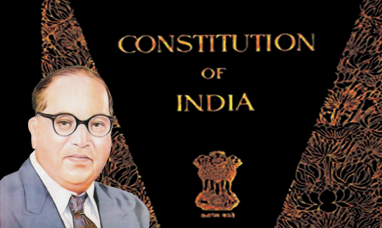
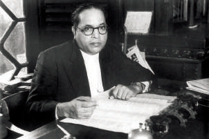
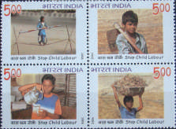

# குடிமையியல் அலகு 1: இந்திய அரசியலமைப்பு

## கற்றலின் நோக்கங்கள்

- இந்திய அரசியலமைப்பு உருவாக்கப்பட்டதை அறிதல்

- இந்திய அரசியலமைப்பின் சிறப்புக் கூறுகளை அறிதல்

- அடிப்படை உரிமைகள் மற்றும் கடமைகளைப் புரிதல்

- அரசு நெறிமுறைப்படுத்தும் கோட்பாடுகளை அறிதல்

- நடுவண், மாநில அரசுகளின் உறவுகள் மற்றும் அவசரநிலை பற்றிப் புரிதல்

## அறிமுகம்

ஒரு நாட்டின் நிருவாகமானது எந்த அடிப்படைக் கொள்கைகளைச் சார்ந்து அமைந்துள்ளது என்பதை பிரதிபலிக்கும் அடிப்படைச் சட்டமே அரசியலமைப்பு என்பதாகும். அது ஒரு நாட்டின் முன்னேற்றத்திற்கு அச்சாணி ஆகும். அரசியலமைப்பு என்ற கொள்கை முதன்முதலில் அமெரிக்க ஐக்கிய நாடுகளில் (U.S.A.) தோன்றியது.

## 1.1  அரசியலமைப்பின் அவசியம்

அனைத்து மக்களாட்சி நாடுகளும் தங்களை நிர்வகித்துக் கொள்ள ஓர் அரசியலமைப்புச் சட்டத்தை பெற்றுள்ளன. ஒரு நாட்டின் குடிமக்கள் வாழ விரும்பும் வகையில் சில அடிப்படைக் கொள்கைகளை அரசியலமைப்பு வகுத்துக் கொடுக்கிறது. நமது சமூகத்தின் அடிப்படை தன்மையை அரசியலமைப்பு நமக்குத் தெரிவிக்கிறது.

## 1.2  இந்திய அரசியலமைப்பு உருவாக்கம்

1946ஆம் ஆண்டு, அமைச்சரவை தூதுக்குழு திட்டத்தின் கீழ் உருவாக்கப்பட்ட, இந்திய அரசியல் நிர்ணய சபையால் இந்திய அரசியலமைப்பு உருவாக்கப்பட்டது. இச்சபையில் 292 மாகாணப் பிரதிநிதிகள், 93 சுதேச அரசுகளின் நியமன உறுப்பினர்கள், மாகாண முதன்மை ஆணையர்கள் சார்பில் மூவர் மற்றும் பலுசிஸ்தானின் சார்பில் ஒருவர் என மொத்தம் 389 உறுப்பினர்கள் இருந்தனர். அரசியல் நிர்ணய சபையின் முதல் கூட்டம்,

1946ஆம் ஆண்டு டிசம்பர் 9ஆம் நாள் நடைபெற்றது. இச்சபையின் தற்காலிக தலைவராக மூத்த உறுப்பினர் டாக்டர் சச்சிதானந்த சின்கா அவர்கள் தேர்ந்தெடுக்கப்பட்டார். இந்திய அரசியலமைப்பை உருவாக்க கூட்டத்தொடர் நடந்துகொண்டிருக்கும் போதே அவர் இறந்ததைத் தொடர்ந்து, டாக்டர் இராஜேந்திர பிரசாத் இந்திய அரசியலமைப்பு நிர்ணய சபையின் தலைவராகவும், H.C. முகர்ஜி மற்றும் V.T. கிருஷ்ணமாச்சாரி இருவரும் துணைத் தலைவர்களாகவும் தேர்ந்தெடுக்கப்பட்டனர். இக்கூட்டத் தொடர் 11 அமர்வுகளாக 166 நாள்கள் நடைபெற்றது. இக்கூட்டத்தின் போது 2473 திருத்தங்கள் முன்வைக்கப்பட்டன. அவற்றுள் சில ஏற்கப்பட்டன. அரசியல் நிர்ணய சபை பல்வேறு குழுக்களின் மூலம் இந்திய அரசியலமைப்பு சட்டத்தை உருவாக்கும் பணியை மேற்கொண்டது. இந்திய அரசியலமைப்பு சட்ட வரைவுக் குழுத் தலைவர் டாக்டர் B.R. அம்பேத்கர் தலைமையின் கீழ் இந்திய அரசியலமைப்புச் சட்டம் உருவாக்கப்பட்டது. எனவே அவர் "இந்திய அரசியலமைப்பின் தந்தை" என அறியப்படுகிறார்.

### டாக்டர் B.R. அம்பேத்கர்

இந்திய அரசியலமைப்புச் சட்டம் எழுதப்பட்ட பின்னர், பொதுமக்கள், பத்திரிக்கைகள், மாகாண சட்டமன்றங்கள் மற்றும் பலரால் விவாதிக்கப்பட்டது. இறுதியாக முகவுரை, 22 பாகங்கள், 395 சட்டப்பிரிவுகள் மற்றும் 8 அட்டவணைகளைக் கொண்ட இந்திய அரசியலமைப்பு, 1949ஆம் ஆண்டு நவம்பர் 26ஆம் நாள் ஏற்றுக்கொள்ளப்பட்டது. 1950ஆம் ஆண்டு ஜனவரி 26ஆம் நாள் இந்திய அரசியலமைப்புச் சட்டம் நடைமுறைக்கு வந்தது. இந்த நாளே ஒவ்வொரு ஆண்டும் இந்திய10 குடியரசு தினமாகக் கொண்டாடப்படுகிறது.

பிரேம் பெஹாரி நரேன் ரைஜடா என்பவரால் இந்திய அரசியலமைப்புச் சட்டம் இத்தாலிய பாணியில், அவரது கைப்பட எழுதப்பட்டது.

## 1.3 இந்திய அரசியலமைப்புச் சட்டத்தின் சிறப்புக் கூறுகள்

- உலகிலுள்ளஎழுதப்பட்ட, அனைத்து அரசியலமைப்புகளை விடவும் மிகவும் நீளமானது.

- இதன் பெரும்பாலான கருத்துகள் பல்வேறு நாடுகளின் அரசியலமைப்புகளிலிருந்து பெறப்பட்டவை.

- இது நெகிழாத்தன்மை கொண்டதாகவும், நெகிழும் தன்மை கொண்டதாகவும் உள்ளது.

- கூட்டாட்சி முறை அரசாங்கத்தை (நடுவண், மாநில அரசுகள்) ஏற்படுத்துகிறது.

- இந்தியாவைச் சமயச்சார்பற்ற நாடாக்குகிறது.

- சுதந்திரமான நீதித்துறையை வழங்குகிறது.

- உலகளாவிய வயது வந்தோர் வாக்குரிமையை அறிமுகப்படுத்தியதோடு 18 வயது நிரம்பிய குடிமக்கள் அனைவருக்கும் எந்த வித பாகுபாடுமின்றி வாக்குரிமையை வழங்குகிறது.

## 1.4 முகவுரை

‘முகவுரை’ (Preamble) என்ற சொல் அரசியலமைப்பிற்கு அறிமுகம் அல்லது முன்னுரை என்பதைக் குறிக்கிறது. இது அரசியலமைப்பின் அடிப்படைக் கொள்கைகள், நோக்கங்கள் மற்றும் இலட்சியங்களை உள்ளடக்கியது. இது பெரும் மதிப்புடன் "அரசியலமைப்பின் திறவுகோல்" என குறிப்பிடப்படுகிறது.

1947ஆம் ஆண்டு ஜனவரி 22ஆம் நாள் இந்திய அரசியல் நிர்ணய சபையால் ஏற்றுக்கொள்ளப்பட்ட ஜவகர்லால் நேருவின் ’குறிக்கோள் தீர்மானத்தின்’ அடிப்படையில் இந்திய அரசியலமைப்பின் முகவுரை அமைந்துள்ளது. முகவுரையானது 1976ஆம் ஆண்டு 42வது அரசியலமைப்பு சட்டத் திருத்தின்படி ஒருமுறை திருத்தப்பட்டது. அதன்படி, சமதர்மம், சமயச்சார்பின்மை, ஒருமைப்பாடு ஆகிய மூன்று புதிய சொற்கள் சேர்க்கப்பட்டன. ’இந்திய மக்களாகிய நாம்’ என்ற சொற்களுடன் இந்திய அரசியலமைப்பின் முகவுரை தொடங்குகிறது. இதிலிருந்து, இந்திய மக்களே இந்திய அரசியலமைப்பின் ஆதாரம் என நாம் அறியலாம். இந்தியா ஓர் இறையாண்மைமிக்க, சமதர்ம, சமயச்சார்பற்ற, ஜனநாயக, குடியரசு என நமது அரசியலமைப்பின் முகவுரை கூறுகிறது. இந்திய குடிமக்கள் அனைவருக்கும் சமூக, பொருளாதார, அரசியல் நீதி என அனைத்திலும் பாதுகாப்பு வழங்குவதே இதன் நோக்கமாகும்.

1789ஆம் ஆண்டு பிரெஞ்சு புரட்சியின் போது சுதந்திரம், சமத்துவம், சகோதரத்துவம் ஆகியன முக்கிய முழக்கங்களாயின. இந்திய அரசியலமைப்பின் முகவுரையில் இவற்றிற்கு முக்கியத்துவம் தரப்பட்டுள்ளது.

## 1.5 குடியுரிமை

’சிட்டிசன்’ (Citizen) எனும் சொல் ’சிவிஸ்’ (Civis) எனும் இலத்தீன் சொல்லில் இருந்து பெறப்பட்டதாகும். இதன் பொருள் ஒரு ’நகர அரசில் வசிப்பவர்’ என்பதாகும். இந்திய அரசியலமைப்பு, இந்தியா முழுவதும் ஒரே மாதிரியான ஒற்றை குடியுரிமையை வழங்குகிறது. இந்திய அரசியலமைப்பின் பகுதி II சட்டப்பிரிவுகள் 5 லிருந்து 11 வரை குடியுரிமையைப் பற்றி விளக்குகின்றன. குடியுரிமைச் சட்டம் (1955)

இந்திய அரசியலமைப்புச் சட்டம் நடைமுறைக்கு வந்தபின்பு, 1955ல் இயற்றப்பட்ட குடியுரிமைச்சட்டம், குடியுரிமை பெறுதல் மற்றும் குடியுரிமை இழத்தல் ஆகியன பற்றி விளக்குகிறது. இச்சட்டம் அரசியலமைப்பு சட்ட திருத்தால் ஒன்பது முறை திருத்தப்பட்டுள்ளது.

### குடியுரிமை பெறுதல்

குடியுரிமைச் சட்டம் 1955ன் படி ஒருவர் கீழ்க்காணும் ஏதேனும் ஒரு முறையில் குடியுரிமை பெறமுடியும்.

1. பிறப்பின் மூலம்: 1950ஆம் ஆண்டு ஜனவரி 26 அன்றோ அல்லது அதற்குப் பின்னரோ இந்தியாவில் பிறந்த அனைவரும் இந்தியக் குடிமக்களாகக் கருதப்படுவர்.

2. வம்சாவளி மூலம்: 1950ஆம் ஆண்டு ஜனவரி 26 அன்றோ அல்லது அதற்குப் பின்னரோ வெளிநாட்டில் பிறந்த ஒருவரின் தந்தை (அவர் பிறந்த போது) இந்தியக் குடிமகனாக இருக்கும் பட்சத்தில் வெளிநாட்டில் பிறந்த அவர், வம்சாவளி மூலம் இந்தியக் குடியுரிமை பெறமுடியும்.

3. பதிவின் மூலம்: ஒருவர் இந்தியக் குடியுரிமை கோரி, பொருத்தமான அங்கீகாரத்துடன் பதிவு செய்வதன் மூலம் இந்தியக் குடியுரிமை பெறலாம்.

4. இயல்புரிமை மூலம்: ஒரு வெளிநாட்டவர், இந்திய அரசிற்கு, இயல்புரிமை கோரி விண்ணப்பிப்பதன் மூலம் இந்தியக் குடியுரிமை பெறலாம்.

5. பிரதேச (நாடுகள்) இணைவின் மூலம்: பிற நாடுகள் / பகுதிகள் இந்தியாவுடன் இணையும் போது இந்திய அரசு அவ்வாறு இணையும் நாடுகளின் மக்களைத் தமது குடிமக்களாகக் கருதி அவர்களுக்குக் குடியுரிமை வழங்கலாம்.

### குடியுரிமையை இழத்தல்

குடியுரிமைச் சட்டம் 1955ன் படி, ஒருவர் தனது குடியுரிமையை, சட்டத்தின் மூலமாக பெறப்பட்டதாகவோ (அ) அரசியலமைப்பின் கீழ் முன்னுரிமையால் பெறப்பட்டதாகவோ இருக்கும்பட்சத்தில் பெற்ற குடியுரிமையைத் துறத்தல், முடிவுறச் செய்தல், இழத்தல் என்ற பின்வரும் மூன்று வழிகளில் இழப்பார்.

1. ஒரு குடிமகன் தாமாக முன்வந்து தனது குடியுரிமையை துறத்தல்.

2. வேறு ஒரு நாட்டில் குடியுரிமை பெறும்போது தாமாகவே இந்தியக் குடியுரிமை முடிவுக்கு வந்துவிடுதல்.

3. இயல்புரிமையின் மூலம் குடியுரிமை பெற்ற ஒரு குடிமகன், மோசடி செய்து குடியுரிமை பெற்றவர், தவறான பிரதிநிதித்துவம் தந்தவர் (அ) உண்மைகளை மறைத்தவர் (அ) எதிரி நாட்டுடன் வாணிகம் செய்தவர் அல்லது இரண்டாண்டு காலத்திற்கு சிறைத் தண்டனை பெற்றவர் என்பதை நடுவண் அரசு கண்டறிந்து அவர் குற்றம் புரிந்தவர் என்று திருப்திப்படும் பட்சத்தில் நடுவண் அரசு, அவரது குடியுரிமையை இழக்கச் செய்யும்.

## 1.6 அடிப்படை உரிமைகள்

இந்திய அரசியலமைப்புச் சட்டம் பகுதி (III) 12ல் இருந்து 35 வரையுள்ள சட்டப்பிரிவுகள் அடிப்படை உரிமைகள் பற்றி கூறுகின்றன. அரசியலமைப்பை உருவாக்கியவர்கள் இந்த அடிப்படை உரிமைகளை அமெரிக்க ஐக்கிய நாடுகளின் அரசியலமைப்பிலுள்ள அடிப்படை உரிமைகளின் தாக்கத்தால் உருவாக்கினார்கள். முதலில் இந்திய அரசியலமைப்பு ஏழு அடிப்படை உரிமைகளை வழங்கியது. ஆனால், தற்போது ஆறு அடிப்படை உரிமைகள் மட்டுமே உள்ளன. இந்திய அரசியலமைப்பின் பகுதி (III) ’இந்தியாவின் மகாசாசனம்’ என அழைக்கப்படுகிறது. இந்தியாவில் வசிக்கும் மக்கள் அனைவருக்கும் அடிப்படை உரிமைகள் பொதுவானது. ஆனால் இந்திய குடிமக்களுக்கு மட்டுமேயான சில அடிப்படை உரிமைகளும் உள்ளன.

### அரசியலமைப்புக்குட்பட்டு தீர்வு காணும் உரிமை (சட்டப்பிரிவு - 32)

நீதிமன்ற முத்திரையுடன், நீதிமன்றத்தால் வெளியிடப்படும் கட்டளை அல்லது ஆணை நீதிப்பேராணை எனப்படும். இது சில சட்டங்களை நிறைவேற்றாமல் தடைசெய்ய, நீதிமன்றத்தால் வெளியிடப்படும் ஆணையாகும். உச்ச நீதிமன்றம் மற்றும் உயர்நீதி மன்றங்கள் இரண்டுமே ஐந்து வகையான நீதிப்பேராணைகளை வெளியிட அதிகாரம் பெற்றுள்ளன. இது போன்ற ஆணைகளை வெளியிட்டு மக்களின் உரிமைகளைக் காப்பதினால் உச்சநீதிமன்றம் ‘அரசியலமைப்பின் பாதுகாவலன்’ என அழைக்கப்படுகிறது. டாக்டர்  B.R. அம்பேத்கரின் கூற்றுப்படி அரசியலமைப்பு சட்டப்பிரிவு 32, இந்திய அரசியலமைப்பின் ’இதயம் மற்றும் ஆன்மா’ ஆகும்.

### அ) ஆட்கொணர்வு நீதிப்பேராணை (Habeas Corpus)

சட்டத்திற்கு புறம்பாக ஒருவர் கைது செய்யப்படுவதிலிருந்து இது பாதுகாக்கிறது.

### ஆ) கட்டளையுறுத்தும் நீதிப்பேராணை (Mandamus)

மனுதாரர் சட்ட உதவியுடன் தனது மனுதொடர்பான பணியினைச் சம்மந்தப்பட்ட துறையிலிருந்து நிறைவேற்றிக் கொள்ள முடியும்

### இ) தடையுறுத்தும் நீதிப்பேராணை (Prohibition)

ஒரு கீழ்நீதிமன்றம் தனது, சட்ட எல்லையைத் தாண்டி செயல்படுவதைத் தடுக்கிறது.

### ஈ) ஆவணக் கேட்பு பேராணை (Certiorari)

உயர்நீதிமன்றம், ஆவணங்களை நியாயமான பரிசீலனைக்கு தனக்கோ அல்லது உரிய அதிகாரிக்கோ அனுப்பச் செய்ய கீழ்நீதிமன்றங்களுக்கு இடும் ஆணை ஆகும்.

### உ) தகுதிமுறை வினவும் நீதிப்பேராணை (Quo-Warranto)

இப்பேராணை சட்டத்திற்குப் புறம்பாக, தகாத முறையில் அரசு அலுவலகத்தைக் கைப்பற்றுவதை தடை செய்கிறது.

I. சமத்துவ உரிமை

பிரிவு 14 - சட்டத்தின் முன் அனைவரும் சமம். பிரிவு 15 - மதம், இனம், சாதி, பாலினம் மற்றும் பிறப்பிடம் இவற்றின் அடிப்படையில் பாகுபடுத்துவதைத் தடைசெய்தல். பிரிவு 16 - பொது வேலைவாய்ப்புகளில் சமவாய்ப்பளித்தல். பிரிவு 17 - தீண்டாமையை ஒழித்தல். பிரிவு 18 - இராணுவ மற்றும் கல்விசார் பட்டங்களைத் தவிர மற்ற பட்டங்களை நீக்குதல்.

### III. சுரண்டலுக்கெதிரான

### உரிமை

பிரிவு 23 - கட்டாய வேலை, கொத்தடிமை முறை மற்றும் மனித்தன்மையற்ற வியாபாரத்தைத் தடுத்தல். பிரிவு 24 - தொழிற்சாலைகள் மற்றும் ஆபத்தான இடங்களில் குழந்தைத் தொழிலாளர் முறையைத் தடுத்தல்.

### V. கல்வி, கலாச்சார உரிமை

பிரிவு 29 - சிறுபான்மையினரின் எழுத்து, மொழி, மற்றும் கலாச்சாரப் பாதுகாப்பு. பிரிவு 30 - சிறுபான்மையினரின் கல்வி நிறுவனங்களை நிறுவி, நிர்வகிக்கும் உரிமை.

1978ஆம் ஆண்டு, 44ஆவது அரசியலமைப்புச் சட்டத் திருத்தப்படி, அடிப்படை உரிமைகள் பட்டியலிலிருந்து சொத்துரிமை (பிரிவு 31) நீக்கப்பட்டது.

இது இந்திய அரசியலமைப்புச் சட்டம் பகுதி XII, பிரிவு 300 A வின் கீழ் ஒரு சட்ட உரிமையாக வைக்கப்பட்டுள்ளது.

II. சுதந்திர உரிமை பிரிவு 19 - பேச்சுரிமை, கருத்து தெரிவிக்கும் உரிமை, அமைதியான முறையில் கூட்டம் கூடுவதற்கு உரிமை, சங்கங்கள், அமைப்புகள் தொடங்க உரிமை, இந்திய நாட்டிற்குள் விரும்பிய இடத்தில் வசிக்கும் மற்றும் தொழில் செய்யும் உரிமை. பிரிவு 20 - குற்றஞ்சாட்டப்பட்ட நபர்களுக்கான உரிமை மற்றும் தண்டனைகளிலிருந்து பாதுகாப்பு பெறும் உரிமை. பிரிவு 21 - வாழ்க்கை மற்றும் தனிப்பட்ட சுதந்திரத்திற்குப் பாதுகாப்பு பெறும் உரிமை. பிரிவு 21 A - தொடக்கக்கல்வி பெறும் உரிமை. பிரிவு 22 - சில வழக்குகளில் கைது செய்து, தடுப்புக் காவலில் வைப்பதற்கெதிரான பாதுகாப்பு உரிமை

IV. சமயச்சார்பு உரிமைபிரிவு 25 - எந்த ஒரு சமயத்தினை

ஏற்கவும், பின்பற்றவும், பரப்பவும் உரிமை. பிரிவு 26 - சமய விவகாரங்களை நிர்வகிக்கும் உரிமை. பிரிவு 27 - எந்தவொரு மத்தையும் பரப்புவதற்காக வரி செலுத்துவதற்கெதிரான சுதந்திரம். பிரிவு 28 - மதம் சார்ந்த கல்வி நிறுவனங்களில் நடைபெறும் வழிபாடு மற்றும் அறிவுரை நிகழ்வுகளில் கலந்துகொள்ளாமலிருக்க உரிமை

### VI. அரசியலமைப்புக்குட்பட்டு

### தீர்வு காணும் உரிமை

பிரிவு 32 - தனிப்பட்டவரின், அடிப்படை உரிமைகள் பாதிக்கப்படும் போது, நீதிமன்றத்தை அணுகி உரிமையைப் பெறுதல்.

இந்த அஞ்சல் வில்லைகள் எந்த அடிப்படை உரிமைகள் மீறுதலைக் குறிப்பிடுகின்றன?

### அடிப்படை உரிமைகளை நிறுத்தி வைத்தல்

இந்திய அரசியலமைப்புச் சட்டப்பிரிவு 352ன் கீழ் குடியரசுத்தலைவரால் அவசரநிலை அறிவிக்கப்படும் பொழுது, இந்திய அரசியலமைப்புச் சட்டப்பிரிவு 19ன் கீழ் உத்திரவாதம் அளிக்கப்பட்டுள்ள சுதந்திரம் தாமாகவே நிறுத்தப்படுகிறது. மற்ற அடிப்படை உரிமைகளையும் குடியரசுத்தலைவர் சில குறிப்பிட்ட ஆணைகளைப் பிறப்பிப்பதின் மூலம் தடை செய்யலாம். குடியரசுத்தலைவரின் இந்த ஆணைகள் நாடாளுமன்றத்தால் கட்டாயம் அங்கீகரிக்கப்பட வேண்டும்.

## 1.7 அரசு நெறிமுறையுறுத்தும் கோட்பாடுகள்

அரசு நெறிமுறையுறுத்தும் கோட்பாடுகள், இந்திய அரசியலமைப்புச் சட்டம் பகுதி IV சட்டப்பிரிவு 36ல் இருந்து 51 வரை தரப்பட்டுள்ளது. அரசியலமைப்புச் சட்டம், வழிகாட்டும் நெறிமுறைகளுக்காகத் தனியாக எந்தவொரு வகைபாட்டினையும் கொண்டிருக்கவில்லை. இருப்பினும் பொருளடக்கம் மற்றும் வழிகாட்டுதல் அடிப்படையில் அவை மூன்று பெரும் பிரிவுகளாகப் பிரிக்கப்பட்டுள்ளன. அதாவது சமதர்ம, காந்திய மற்றும் தாராள-அறிவுசார்ந்தவை என்று பிரிக்கப்பட்டுள்ளன. இந்த கொள்கைகளை, நீதிமன்றத்தால் வலுக்கட்டாயமாகச் செயற்படுத்த முடியாது. ஆனால், இவை ஒரு நாட்டினை நிர்வகிக்க அவசியமானவை. சமுதாய நலனை மக்களுக்குத் தருவதே இதன் நோக்கமாகும். இந்திய அரசியலமைப்பின் ‘புதுமையான சிறப்பம்சம்’ என டாக்டர் B.R. அம்பேத்கர் இதனை விவரிக்கிறார்.

### அடிப்படை உரிமைகளுக்கும் அரசு நெறிமுறையுறுத்தும் கோட்பாடுகளுக்கும்

### இடையேயான வேறுபாடுகள்

| அடிப்படை உரிமைகள் | அரசு நெறிமுறையுறுத்தும் கோட்பாடுகள் |
|---|---|
| இவை அமெரிக்க ஐக்கிய நாடுகளின் அரசியலமைப்பிலிருந்து பெறப்பட்டவை . | இவை அயர்லாந்து நாட்டின் அரசியலமைப்பிலிருந்து பெறப்பட்டவை . |
| அரசாங்கத்தால் கூட இந்த உரிமையை சுருக்கவோ, நீக்கவோ முடியாது. | இவை அரசுக்கு வெறும் அறிவுறுத்தல்களே ஆகும். |
| இவற்றை நீதிமன்ற சட்டத்தால் செயற்படுத்த முடியும். | எந்த நீதிமன்றத்தாலும் கட்டாயப்படுத்த முடியாது |

| இவை சட்ட ஒப்புதலைப் பெற்றவை. | இவை தார்மீக மற்றும் அரசியல் ஒப்புதலைப் பெற்றவை. |
|---|---|
| இந்த உரிமைகள் நாட்டின் அரசியல் ஜனநாயகத்தை வலுப்படுத்துகின்றன . | இந்தக் கொள்கைகளைச் செயற்படுத்தும் பொழுது, சமுதாய மற்றும் பொருளாதார ஜனநாயகம் உறுதியாகிறது. |

2002ஆம் ஆண்டு மேற்கொள்ளப்பட்ட, 86வது அரசியலமைப்புச் சட்டத்திருத்தின்படி, இந்திய அரசியலமைப்பின் பிரிவு 45 திருத்தப்பட்டு, பிரிவு 21A வின் கீழ் தொடக்கக்கல்வி, அடிப்படை உரிமையாகச் சேர்க்கப்பட்டுள்ளது. இந்த் திருத்தம், மாநில அரசுகள் முன்பருவ மழலையர் கல்வியை (Early Childhood Care and Education - ECCE) 6 வயது வரையுள்ள குழந்தைகளுக்கு வழங்க அறிவுறுத்துகிறது.

## 1.8 அடிப்படைக் கடமைகள்

இந்திய அரசியலமைப்பில் அடிப்படைக் கடமைகள் என்பவை முன்னாள் சோவியத் யூனியன் (USSR) [ரஷ்யா] அரசியலமைப்பின் தாக்கத்தால் சேர்க்கப்பட்டதாகும். 1976ஆம் ஆண்டு, அமைக்கப்பட்ட சர்தார் ஸ்வரன் சிங் குழு அரசியலமைப்புச் சட்ட திருத்தம் செய்ய பரிந்துரைத்தது. அதன்படி 1976ஆம் ஆண்டு மேற்கொள்ளப்பட்ட 42வது அரசியல் அமைப்புச் சட்டதிருத்தம் நமது அரசியலமைப்பில் குடிமக்களின் பொறுப்புகள் சிலவற்றைச் சேர்த்தது. இவ்வாறு சேர்க்கப்பட்ட பொறுப்புகளே குடிமக்களின் கடமைகள் என்றழைக்கப்பட்டன. மேலும், இந்தச் சட்டத்திருத்தம், அரசியலமைப்பின் பகுதி IV A என்ற ஒரு புதிய பகுதியைச் சேர்த்தது. இந்தப் புதிய பகுதி 51 A என்ற ஒரேயொரு பிரிவை மட்டும் கொண்டது. இது குடிமக்களின் 11 அடிப்படைக் கடமைகளை விளக்கும் குறிப்பிட்ட சட்டத் தொகுப்பாக உள்ளது. அடிப்படைக் கடமைகளின் பட்டியல் அ) ஒவ்வொரு இந்தியக் குடிமகனும் அரசியலமைப்பு, அதன் கொள்கைகள், நிறுவனங்கள், தேசியக்கொடி மற்றும் தேசியகீதம் ஆகியவற்றை மதித்தல்.

ஆ) சுதந்திர போராட்டத்திற்குத் தூண்டுகோலாக அமைந்த உயரிய நோக்கங்களைப் போற்றி வளர்த்தல். இ) இந்தியாவின் இறையாண்மை, ஒற்றுமை, ஒருமைப்பாடு இவற்றைப் பேணிப் பாதுகாத்தல். ஈ) தேசப் பாதுகாப்பிற்காகத் தேவைப்படும் பொழுது தேசப்பணியாற்ற தயாராயிருத்தல். உ) சமய, மொழி மற்றும் வட்டார அல்லது பகுதி சார்ந்த வேறுபாடுகளை மறந்து, பெண்களைத் தரக்குறைவாக நடத்தும் பழக்கத்தை நிராகரித்து, பெண்களின் கண்ணியத்தைக் காக்கும் எண்ணங்களை மேம்படுத்தி, இந்திய மக்கள் அனைவரிடையேயும் சகோதரத்துவத்தை வளர்த்தல். ஊ) நமது உயர்ந்த, பாரம்பரிய கலப்பு கலாச்சாரத்தை மதித்து பாதுகாத்தல். எ) காடுகள், ஏரிகள், ஆறுகள், வனவிலங்குகள் மற்றும் உயிரினங்கள் அடங்கிய இயற்கை சுற்றுச்சூழலைப் பாதுகாத்து, மேம்படுத்தி அவை வாழும் சூழலை ஏற்படுத்துதல். ஏ) அறிவியல் கோட்பாடு, மனிதநேயம், ஆராய்ச்சி மனப்பான்மை மற்றும் சீர்திருத்தம் ஆகியவற்றை வளர்த்தல். ஐ) வன்முறையைக் கைவிட்டு பொது சொத்துக்களைப் பாதுகாத்தல். ஒ) தனிப்பட்ட மற்றும் கூட்டுசெயல்பாடுகள் என அனைத்து செயல்பாடுகளிலும் சிறந்தவற்றை நோக்கி செயல்பட்டு, தேசத்தின் நிலையான, உயர்ந்த முயற்சி மற்றும் சாதனைக்காக உழைத்தல். ஓ) 6 முதல் 14 வயது வரையுள்ள குழந்தைகள் அனைவருக்கும் கல்வி பெறும் வாய்ப்பினை வழங்குதல். (86வது அரசியலமைப்பு திருத்தச் சட்டம் 2002இன் படி 51A (k) கீழ் 11வது அடிப்படை கடமை அறிமுகப்படுத்தப்பட்டுள்ளது. இந்த பிரிவின் கீழ் அனைத்து இந்திய குடிமக்கள் அல்லது பெற்றோர்கள் 6 முதல் 14 வயதுள்ள தங்கள் குழந்தைகள் அனைவருக்கும் கல்வி பெறும் வாய்ப்பினை ஏற்படுத்தித் தர வேண்டும்). 1.9 நடுவண்-மாநில அரசுகளின்

### உறவுகள்

### சட்டமன்ற உறவுகள்

நடுவண் நாடாளுமன்றம், இந்தியா முழுவதற்கும் அல்லது இந்தியாவின் எந்த பகுதிக்கும் சட்டமியற்றும் அதிகாரம் பெற்றுள்ளது. இது இந்தியாவின் மாநிலங்களுக்கு மட்டுமின்றி யூனியன் பிரதேசங்களுக்கும் பொருந்தும். இந்திய அரசியலமைப்பின் ஏழாவது அட்டவணை, நடுவண் - மாநில அரசுகளுக்கிடையேயான அதிகாரப் பகிர்வினைப் பற்றி கூறுகிறது. அவை நடுவண் பட்டியல், மாநில பட்டியல், பொதுப்பட்டியல் என மூன்று பட்டியல்கள் முறையே 97, 66, 47 என்று அதிகாரத்தை வழங்கியுள்ளது. நடுவண் அரசுக்கு சொந்தமான பட்டியலில், சட்டமியற்றும் தனிச்சிறப்புமிக்க அதிகாரத்தை நாடாளுமன்றம் பெற்றுள்ளது. மாநில அரசுக்குச் சொந்தமான பட்டியலில் சட்டமியற்றும் தனிச்சிறப்புமிக்க அதிகாரத்தை மாநில சட்டமன்றம் பெற்றுள்ளது. நாடாளுமன்றம் மற்றும் மாநில சட்டமன்றங்கள் பொதுப்பட்டியலில் உள்ள துறைகளின் மீது சட்டமியற்ற அதிகாரம் கொண்டுள்ளன. ஆனால், நடுவண் அரசுக்கும், மாநில அரசுக்குமிடையே பொதுப்பட்டியலில் உள்ள துறைகள் குறித்து சட்டமியற்றும் பொழுது முரண்பாடு ஏற்பட்டால், நடுவண் அரசு இயற்றும் சட்டமே இறுதியானது.

தற்போது அதிகாரப் பகிர்வு என்பது நடுவண் அரசு பட்டியலில் 100 துறைகள், மாநில அரசு பட்டியலில் 61 துறைகள், மற்றும் இரண்டிற்கும் பொதுவான பொதுப்பட்டியலில் 52 துறைகள் என்றும் மாற்றப்பட்டுள்ளது. 1976ஆம் ஆண்டு மேற்கொள்ளப்பட்ட 42 வது அரசியலமைப்பு சட்டத்திருத்தம் மாநிலப்பட்டியலில் இருந்து 5 துறைகளை, பொதுப் பட்டியலுக்கு மாற்றியது. அவை, கல்வி, காடுகள், எடைகள் மற்றும் அளவுகள், பறவைகள் மற்றும் வனவிலங்குகள் பாதுகாப்பு, மற்றும் உச்சநீதிமன்றம், உயர்நீதிமன்ற அமைப்புகளைத் தவிர பிற நீதிமன்றங்களின் நீதி நிருவாகம் ஆகியனவாகும்.

### நிருவாக உறவுகள்

ஒரு மாநில அரசின் நிருவாக அதிகாரம் அதன் சொந்த மாநிலத்தில் மட்டுமே உள்ளது மற்றும் அம்மாநிலத்தில் மட்டுமே தனக்கான சட்டமியற்றும் தகுதியையும் பெற்றுள்ளது. அதே வேளையில், நடுவண் அரசும், தனிச்சிறப்புமிக்க நிருவாக அதிகாரம் பெற்றுள்ளது. அவை, அ) நாடாளுமன்றம் தொடர்பான விஷயங்களில் சட்டங்களை இயற்ற சிறப்பு அதிகாரம், ஆ) மாநில அரசுகள் செய்து கொள்ளும் உடன்படிக்கை (அ) ஒப்பந்தங்களை அங்கீகரிப்பது ஆகியனவாகும்.

### நிதி உறவுகள்

இந்திய அரசியலமைப்புச் சட்டம் பகுதி XII சட்டப்பிரிவு 268ல் இருந்து 293 வரை உள்ள பிரிவுகள் நடுவண்-மாநில அரசுகளின் நிதிசார்ந்த உறவுகளைப் பற்றி விளக்குகிறது.

நடுவண்-மாநில அரசுகள், அரசியலமைப்புச் சட்டத்தின் மூலம், பலவகையான வரிகளை விதிக்கும் அதிகாரங்களைப் பெற்றுள்ளன. இந்திய அரசியலமைப்புச் சட்டப்பிரிவு 280ன் கீழ் குடியரசுத்தலைவரால் நியமனம் செய்யப்பட்ட நிதிக்குழுவின் பரிந்துரையின் அடிப்படையில், நடுவண் அரசால் சில வரிகள் விதிக்கப்பட்டு, வசூலிக்கப்பட்டு, நடுவண் அரசாலும், மாநில அரசாலும் பிரித்துக்கொள்ளப்படுகின்றன.

நடுவண் - மாநில அரசுகளின் உறவினை விசாரிக்க மறைந்த முன்னாள் பிரதமர் திருமதி இந்திராகாந்தி அவர்கள் 1983ஆம் ஆண்டு சர்க்காரியா குழுவினை நியமித்தார். அக்குழுவின் 247 பரிந்துரைகளில் 180 பரிந்துரைகளை நடுவண் அரசு செயல்படுத்தியது.

1969இல் நடுவண்-மாநில அரசுகளின் உறவுகள் குறித்து முழுவதும் ஆராய தமிழக அரசு டாக்டர்  P . V . இராஜமன்னார் தலைமையின் கீழ் மூவர் குழு ஒன்றை நியமித்தது.

## 1.10 அலுவலக மொழிகள்

அரசியலமைப்புச் சட்டப் பகுதி XVIIஇல் 343 லிருந்து 351 வரையுள்ள சட்டப்பிரிவுகள் அலுவலக மொழிகள் பற்றி விவரிக்கின்றன. தொடக்கத்தில் 14 மொழிகள் அரசியலமைப்பின் 8வது அட்டவணையில் அங்கீகரிக்கப்பட்டிருந்தன. தற்போது 22 மொழிகள் அங்கீகரிக்கப்பட்டுள்ளன.

### செயல்பாடு

அரசியலமைப்பின் எட்டாவது அட்டவணையில் உள்ள அங்கீகரிக்கப்பட்ட மொழிகளை பட்டியலிடுக.

2004ஆம் ஆண்டு இந்திய அரசு “செம்மொழிகள்” எனும் புதிய வகைப்பாட்டினை ஏற்படுத்த தீர்மானித்தது. அதன்படி இதுவரை 6 மொழிகள் செம்மொழி தகுதியைப் பெற்றுள்ளன. அவை, தமிழ்(2004), சமஸ்கிருதம் (2005), தெலுங்கு(2008), கன்னடம்(2008), மலையாளம் (2013) மற்றும் ஒடியா(2014).

## 1.11 அவசர கால ஏற்பாடுகள்

### தேசிய அவசரநிலை (சட்டப்பிரிவு 352)

போர், வெளிநாட்டினர் ஆக்கிரமிப்பு, ஆயுதமேந்திய கிளர்ச்சி, உடனடி ஆபத்து, அச்சுறுத்தல் போன்ற காரணங்களால் இந்தியாவின் பாதுகாப்பிற்கு அச்சுறுத்தல் ஏற்பட்டால், குடியரசுத்தலைவர், அரசியலமைப்புச் சட்டப்பிரிவு 352ன் கீழ் அவசரநிலையை அறிவிக்கலாம். போர் அல்லது வெளிநாட்டினர் ஆக்கிரமிப்பின் காரணமாக அவசரநிலை அறிவிக்கப்படும் பொழுது அது ளிப்புற அவசரநிலை’ எனப்படுகிறது. ஆயுதமேந்திய கிளர்ச்சிக் காரணமாக அவசர நிலை அறிவிக்கப்படும்பொழுது அது 'உள்நாட்டு அவசர நிலை' எனப்படுகிறது. இந்த வகையான அவசரநிலைகள் 1962, 1971, 1975 ஆகிய ஆண்டுகளில் அறிவிக்கப்பட்டன.

### மாநில அவசரநிலை (சட்டப்பிரிவு 356)

ஒரு மாநிலத்தில், மாநில அரசால் கட்டுப்படுத்த முடியாத சூழல் ஏற்படும்பொழுது அரசியலமைப்பின் விதிகளுக்கேற்ப ஆளுநர் அறிக்கை அளிக்கும் பொழுது, குடியரசுத்தலைவர் அரசியலமைப்புச் சட்டப்பிரிவு 356ன் கீழ் அவசரநிலையை அறிவிக்கலாம். இந்த அவசரநிலை, சட்டப்பிரிவு 352ன் படி நடைமுறையில் இருந்தால் அல்லது தேர்தல் ஆணையம் சட்டமன்றத் தேர்தலை நடத்த உகந்த சூழல் இல்லை என்று சான்றளித்தால் மட்டுமே ஓராண்டிற்குமேல் தொடரமுடியும். அதிகபட்சமாக அவசரநிலையின் காலம் 3 ஆண்டுகள் இருக்கமுடியும். குடியரசுத்தலைவர் சார்பாக ஆளுநரால் மாநிலம் நிர்வகிக்கப்படுகிறது. இந்தியாவில் முதன்முறையாக 1951இல் பஞ்சாப் மாநிலத்தில் குடியரசுத்தலைவர் ஆட்சி நடைமுறைப் படுத்தப்பட்டது.

### நிதி சார்ந்த்த அவசரநிலை (சட்டப்பிரிவு 360)

நிதிநிலைத் தன்மை, இந்தியாவின் கடன் தன்மை மற்றும் இந்தியாவின் பகுதிகள் ஆபத்தில் இருந்தால் அரசியலமைப்புச் சட்டப்பிரிவு 360ன் கீழ் குடியரசுத்தலைவர் நிதிசார்ந்த அவசரநிலையைப் பிறப்பிக்கலாம். இந்த வகையான அவசர நிலையில் நடுவண்-மாநில அரசு ஊழியர்கள் எந்த வகுப்பினராயினும் அவர்களது ஊதியம், படிகள் மற்றும் உச்சநீதிமன்ற, உயர்நீதிமன்ற நீதிபதிகள் உட்பட அனைவரது ஊதியமும் குடியரசுத்தலைவரின் ஓர் ஆணையின் மூலம் குறைக்கப்படும். இந்த வகையான அவசரநிலை இந்தியாவில் இதுவரை அறிவிக்கப்படவில்லை.

## 1.12 அரசியலமைப்புச் சட்டத்திருத்தம்

’அமெண்ட்மெண்ட்’ (Amendment) எனும் சொல் திருத்தம் மாற்றம், மேம்படுத்துதல், மற்றும் சிறு மாறுதல் என்பதைக் குறிக்கிறது. அரசியலமைப்பின் சட்டப் பகுதி XXல் 368வது சட்டப்பிரிவு, அரசியலமைப்பினை சட்ட திருத்தம் செய்வதில் பின்பற்றப்படும் முறைகள் மற்றும் திருத்தம் செய்வதில் நாடாளுமன்றத்தின் அதிகாரங்கள் பற்றி தெரிவிக்கிறது.

### அரசியலமைப்புச் சட்டத்திருத்தம் செய்வதில் பின்பற்றப்படும் வழிமுறைகள்

நாடாளுமன்றத்தின் இரு அவைகளிலும், அரசியலமைப்புச் சட்டத்திருத்த மசோதா அறிமுகப்படுத்தப்பட வேண்டும். நாடாளுமன்றத்தின் ஒவ்வொரு அவையிலும், அவையின் ஒட்டுமொத்த உறுப்பினர்களில் பெரும்பான்மையான உறுப்பினர்கள் மற்றும் அவைக்கு வந்து, வாக்களித்தவர்களில் 3 ல் 2 பங்கிற்கு குறையாமல் மசோதாவிற்கு ஆதரவாக வாக்களித்தால் மட்டுமே, குடியரசுத்தலைவரின் ஒப்புதலுக்காக அனுப்பப்பட வேண்டும். குடியரசுத்தலைவர் ஒப்புதல் அளித்தபின் மசோதா திருத்தப்பட்டச் சொற்களுடன் அரசியலமைப்பில் ஏற்றுக்கொள்ளப்படும். நாடாளுமன்றத்தால் மட்டுமே அரசியலமைப்பு சட்டத்திருத்தைக் கொண்டுவரமுடியும். மாநில சட்ட மன்றத்தால் அரசியலமைப்பில் எந்தவொரு சட்டத்திருத்தையும் கொண்டுவர முடியாது.

### அரசியலமைப்புச் சட்ட திருத்தின் வகைகள்

அரசியலமைப்பின் 368வது சட்டப்பிரிவு மூன்று வகைகளில் அரசியலமைப்புச் சட்டத்திருத்தங்களைச் செய்ய வழிவகுக்கிறது.

### பாடச்சுருக்கம்

- அமைச்சரவை திட்டக்குழு 1946ன் கீழ் அமைக்கப்பட்ட அரசியல் நிர்ணய சபையால் இந்திய அரசியலமைப்புச் சட்டம் உருவாக்கப்பட்டது.

- இந்தியா ஒரு இறையாண்மை மிக்க, சமதர்ம, சமயச்சார்பற்ற, ஜனநாயக, குடியரசு என இந்திய அரசியலமைப்பின் முகவுரை கூறுகிறது.

- ’சிட்டிசன்’ என்ற சொல் ‘சிவிஸ்’ என்ற இலத்தீன் சொல்லிலிருந்து பெறப்பட்டது. இதன் பொருள் ஒரு நகர அரசில் வசிப்பவர் என்பதாகும்.

- டாக்டர் B.R. அம்பேத்கரின் கூற்றுப்படி 32வது சட்டப்பிரிவு 'அரசியலமைப்பின் இதயம் மற்றும் ஆன்மா' ஆகும்.

- 2004ல் இந்திய அரசு மொழிகளை வகைப்படுத்த முடிவு செய்து புதிய வகைகளாக செம்மொழிகளை அறிவித்தது.

1. நாடாளுமன்றத்தின் சாதாரணஅறுதிப் பெரும்பான்மை மூலம் திருத்தப்படுதல்.

2. நாடாளுமன்றத்தின் சிறப்பு அறுதிப் பெரும்பான்மை மூலம் திருத்தப்படுதல்.

3. நாடாளுமன்றத்தின் சிறப்பு அறுதிப் பெரும்பான்மையுடன் பாதிக்கும் மேற்பட்ட மாநில சட்டமன்றங்களின் ஒப்புதலைப் பெறுவதன் மூலம் திருத்தப்படுதல்.

அரசியலமைப்பின் 42வது சட்டத்திருத்தம் 'சிறு அரசியலமைப்பு' என அறியப்படுகிறது.

## 1.13 அரசியலமைப்பு சீர்திருத்தக் குழுக்கள்

அரசியலமைப்பு செயல்பாடு குறித்து ஆய்வு செய்ய 2000ஆம் ஆண்டில் இந்திய அரசு ஒரு தீர்மானத்தின் படி திரு M.N. வெங்கடாசலய்யா தலைமையில் அரசியலமைப்புச் சட்ட செயல்பாட்டிற்கான தேசிய சீராய்வு ஆணையம் ஒன்றை அமைத்தது. அரசின் பல்வேறு நிலைகள், அவற்றிற்கிடையேயான தொடர்பு மற்றும் பங்களிப்புகள் குறித்துப் புதிய நோக்கத்தோடு ஆராய உச்சநீதிமன்றத்தின் முன்னாள் தலைமை நீதிபதி M.M. பூஞ்சி தலைமையில் ஏப்ரல் 2007 ஆம் ஆண்டு மூன்று உறுப்பினர்களைக் கொண்ட ஒரு ஆணையத்தை அப்போதைய அரசு அமைத்தது.

### கலைச்சொற்கள்

| முகவுரை | Preamble | the introduction to the constitution of India |
|---|---|---|
| சமயச் சார்பற்ற அரசு | Secular state | a state which treats all religions equally |
| ாகுபாடு | Discrimination | unfair treatment of a person or group |
| நீதிப்பேராணை | Writ | written command of court |
| இறையாண்மை | Sovereignty | supreme power or authority |
| ாரம்பரியம் | Heritage | something handed down from one’s ancestors |
| ன்னாட்சி | Autonomy | independence in one’s thoughts or actions |
| பிரகடனம் | Proclamation | an announcement |

### பயிற்சி

**I சரியான விடையைத் தேர்ந்தெடுக்கவும்**

1. கீழ்க்காணும் வரிசையில் ’முகவுரை’ பற்றிய சரியான தொடர் எது?

அ) குடியரசு, ஜனநாயக, சமயச் சார்பற்ற, சமதர்ம, இறையாண்மை.

ஆ) இறையாண்மை, சமதர்ம, சமயச் சார்பற்ற, குடியரசு, ஜனநாயக.

இ) இறையாண்மை, குடியரசு, சமயச் சார்பற்ற, சமதர்ம, ஜனநாயக.

ஈ) இறையாண்மை, சமதர்ம, சமயச் சார்பற்ற, ஜனநாயக, குடியரசு.

2. இந்திய அரசியலமைப்பின் முகவுரை எத்தனை முறை திருத்தப்பட்டது?

அ) ஒரு முறை   ஆ) இரு முறை இ) மூன்று முறை   ஈ) எப்பொழும் இல்லை

3. ஒரு வெளிநாட்டவர், கீழ்க்காணும் எதன் மூலம் இந்திய குடியுரிமை பெறமுடியும்?

அ) வம்சாவளி ஆ) பதிவு இ) இயல்புரிமை ஈ) மேற்கண்ட அனைத்தும்.

4. மாறுபட்ட ஒன்றைக் கண்டுபிடி.

அ) சமத்துவ உரிமை ஆ) சுரண்டலுக்கெதிரான உரிமை இ) சொத்துரிமை ஈ) கல்வி மற்றும் கலாச்சார உரிமை

5. கீழ்க்காண்பவற்றில் ஒன்று, அடிப்படை உரிமையைப் பயன்படுத்துவதற்கு உதாரணம் இல்லை.

அ) கர்நாடகாவிலிருந்து, கேரளா பண்ணைகளில் வேலையாட்கள் பணிசெய்தல் ஆ) கிறித்துவ சமயக்குழு, தொடர்ச்சியாக, பள்ளிகளை அமைத்தல் இ) ஆண், பெண் இருபாலரும் அரசுப்பணிகளுக்கு சம ஊதியம் பெறுதல் ஈ) பெற்றோர்களின் பூர்வீக சொத்துகள் அவர்களது பிள்ளைகளுக்குச் செல்லுதல் 6. பின்வருவனவற்றுள் எந்த உரிமை டாக்டர் B.R. அம்பேத்கர் அவர்களால் 'இந்திய அரசியலமைப்பின் இதயம் மற்றும் ஆன்மா' என விவரிக்கப்பட்டது?

அ) சமய உரிமை ஆ) சமத்துவ உரிமை இ) அரசியலமைப்புக்குட்பட்டு தீர்வு காணும் உரிமை ஈ) சொத்துரிமை

7. அடிப்படை உரிமைகள் எவ்வாறு நிறுத்திவைக்கப்பட முடியும்?

அ) உச்ச நீதிமன்றம் விரும்பினால் ஆ) பிரதமரின் ஆணையினால் இ) தேசிய அவசரநிலையின் போது குடியரசு தலைவரின் ஆணையினால் ஈ) மேற்கண்ட அனைத்தும்

8. நமது அடிப்படைக் கடமைகளை இடமிருந்து பெற்றோம்.

அ) அமெரிக்க அரசியலமைப்பு ஆ) கனடா அரசியலமைப்பு இ) ரஷ்யா அரசியலமைப்பு ஈ) ஐரிஷ் அரசியலமைப்பு

9. எந்த பிரிவின் கீழ் நிதி அவசரநிலையை அறிவிக்க முடியும்?

அ) சட்டப்பிரிவு 352 ஆ) சட்டப்பிரிவு 356 இ) சட்டப்பிரிவு 360 ஈ) சட்டப்பிரிவு 368

10. எந்தக் குழுக்கள் / ஆணையங்கள் நடுவண்- மாநில உறவுகள் பற்றி பரிந்துரை செய்தன?

1. சர்க்காரியா குழு

2. ராஜமன்னார் குழு

3. M.N. வெங்கடாசலையா குழு கீழே கொடுக்கப்பட்டுள்ள குறியீடுகளிலிருந்து சரியான விடையைத் தேர்ந்தெடு

**II கோடிட்ட இடத்தை நிரப்புக**

1. முதன் முதலில் அரசியலமைப்பு எனும் கொள்கை இல் தோன்றியது.

2. அரசியல் நிர்ணய சபையின் தற்காலிகத் தலைவராக தேர்ந்தெடுக்கப்பட்டார்.

3. இந்திய அரசியலமைப்பு ஏற்றுக்கொள்ளப்பட்ட நாள் மற்றும் ஆண்டு

4. சட்டப்பிரிவு 32இல் குறிப்பிடப்பட்டுள்ள நீதிபேராணைகளின் எண்ணிக்கை .

5. இந்திய குடிமக்களுக்கு அடிப்படைக் கடமைகள் பிரிவின் கீழ் வழங்கப்பட்டுள்ளன.

### III பொருத்துக

1. குடியுரிமைச் சட்டம் - ஜவகர்லால் நேரு

2. முகவுரை - 42வது அரசியலமைப்புச் சட்டத்திருத்தம்

3. குறு அரசியலமைப்பு - 1955

4. செம்மொழி - 1962

5. தேசிய அவசரநிலை - தமிழ்

**IV குறுகிய விடை தருக**

1. அரசியலமைப்பு என்றால் என்ன?

2. குடியுரிமை என்பதன் பொருள் என்ன?

3. இந்திய அரசியலமைப்பால் வழங்கப்படும் அடிப்படை உரிமைகளைப் பட்டியலிடுக.

4. நீதிப்பேராணை (Writ) என்றால் என்ன?

5. நடுவண் மற்றும் மாநில அரசுகளுக்கு இடையேயான உறவுகளை மூன்று தலைப்புகளில் பட்டியலிடுக.

6. செம்மொழித் தகுதிப்பெற்ற இந்திய மொழிகள் எவை?

7. தேசிய அவசரநிலை என்றால் என்ன?

### V விரிவான விடை தருக

1. இந்திய அரசியலமைப்பின் சிறப்புக் கூறுகளை விளக்குக.

2. அடிப்படை உரிமைகளைக் குறிப்பிடுக.

3. அரசியலமைப்புக்குட்பட்டு தீர்வு காணும் உரிமை பற்றி எழுதுக.

4. அடிப்படை உரிமைகளுக்கும், அரசு நெறிமுறையுறுத்தும் கோட்பாடுகளுக்கும் இடையேயான வேறுபாடுகளைக் குறிப்பிடுக.

### VI மாணவர் செயல்பாடு

1. இந்திய அரசியலமைப்பு நிர்ணய சபையின் உறுப்பினர்கள் பற்றிய தகவல்களைச் சேகரிக்கவும்.

2. அரசியலமைப்பு வரைவுக்குழுவின் உறுப்பினர்களது படங்கள் மற்றும் அவர்களைப் பற்றிய தகவல்களைச் சேகரிக்கவும்.

### ேமற்ேகாள் நூல்கள்

1. D.D. Basu - Introduction to the Constitution of

India, S.C. Sarkar & Sons (Private) Ltd, 1982.

2. PM Bakshi - The Constitution of India, Universal Law Publishing - an imprint of LexisNexis, 2018.

### இைணயதள வளங்கள்

1. https://www.india.org

2. https://legislative.gov.in/constitution-of- india

