# வரலாறு அலகு 8: தேசியம்: காந்திய காலகட்டம்

## கற்றலின் நோக்கங்கள்

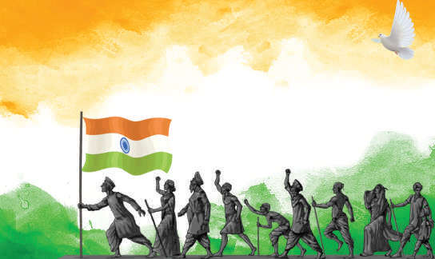

### நாம் கீழ்க்காண்பனவற்றை பற்றி அறிந்து கொள்ள

- இந்திய விடுதலைப் போராட்டத்தில் காந்திய காலகட்டம்

- இந்தியாவில் மக்களை ஒன்றிணைக்க அகிம்சை மற்றும் சத்தியாகிரகம் ஆகிய காந்தியக் கொள்கைகள் பயன்படுத்தப்பட்டு சோதிக்கப்பட்ட காலகட்டம்

- சம்பரான் மற்றும் ரௌலட் சட்டம் ஆகியவற்றுக்கு எதிரான வன்முறையற்ற போராட்டங்கள்

- ஒத்துழையாமை இயக்கம் மற்றும் அதன் வீழ்ச்சி

- தீவிரத்தன்மை கொண்டவர்களும் தீவிர தேசியவாதப் போக்கு உடையவர்களின் தோற்றமும் விடுதலைப் போராட்டத்தில் அவர்கள் ஆற்றிய பங்கும்

- சட்டமறுப்பு இயக்கத்தின் தொடக்கம்

- தனித்தொகுதிகள் குறித்த சர்ச்சை மற்றும் பூனா ஒப்பந்தம் கையெழுத்திடப்படுதல்

- மாகாணங்களில் முதலாவதாக அமைந்த காங்கிரஸ் அமைச்சரவைகள் மற்றும் வெள்ளையனேவெளியேறு இயக்கம் தோன்றுவதற்கான சூழ்நிலைகள்

- இந்தியத் துணைக்கண்டத்தை இந்தியா-பாகிஸ்தான் என இரண்டாகப் பிரிவினை செய்ய வழிவகுத்த வகுப்புவாதம்

## அறிமுகம்

மகாத்மா காந்தி, தென்னாப்பிரிக்காவில் வாழ்ந்த்த இந்தியர்களின் சமூக உரிமைகளுக்காக சுமார் 20 ஆண்டுகள் போராடிய பிறகு 1915இல் தாயகம் திரும்பினார். இந்திய அரசியலுக்கு புதிய எழுச்சியை அவர் ஏற்படுத்தினார். தென்னாப்பிரிக்காவில் அவர் ஆண்கள், பெண்கள், இளைஞர்கள், முதியோர் என அனைவரும் பின்பற்றத்தக்க ‘சத்தியாகிரகம்’ என்ற புதிய வழிமுறையை அறிமுகம் செய்தார். அடித்தட்டு வறியவர்களின் மேன்மைக்காக உறுதிபூண்ட அவரால் மக்களின் நல்லெண்ணத்தை எளிதில் பெறமுடிந்தது. இந்திய தேசிய இயக்கத்தை காந்தியடிகள் எவ்வாறு மடைமாற்றம் பெறவைத்தார் என்பதை இந்தப் பாடத்தில் நாம் காண்போம்.

## 8.1 காந்தியடிகளும் மக்கள் தேசியமும்

### (அ) காந்தியடிகள் உருவாகிறார்

குஜராத்தின் போர்பந்தரில் ஒரு வசதியான குடும்பத்தில் 1869 அக்டோபர் 2ஆம் நாள் மோகன்தாஸ் கரம்சந்த் காந்தி பிறந்தார். அவரது தந்தையார் காபா காந்தி, போர்பந்தரின் திவானாகவும் பின்னர் ராஜ்கோட்டின் திவானாகவும் பொறுப்பு வகித்தார். அவரது தாயார் புத்லிபாயின் தாக்கம் இளையவரான காந்தியின் நடவடிக்கைகளில் பெரிதும் இருந்தது. பதின்ம பள்ளிப் (Matriculation) படிப்பை முடித்த காந்தியடிகள் சட்டம் பயில்வதற்காக 1888இல் இங்கிலாந்துக்குக் கடல்பயணம் மேற்கொண்டார். 1891ஆம் ஆண்டு ஜூன் மாதம் வழக்கறிஞர் பட்டம்பெற்ற பின்பு அவர் பிரிட்டிஷாரின் நீதி மற்றும் நியாய முறையில் நம்பிக்கை கொண்டவராக இந்தியாவுக்குத் திரும்பினார்.

இந்தியா திரும்பியவுடன் பம்பாயில் வழக்குரைஞராக பணியாற்ற காந்தியடிகள் மேற்கொண்ட முயற்சி தோல்வியடைந்தது. அந்த காலகட்டத்தில்தான் தென்னாப்பிரிக்காவில் இருந்த குஜராத்தி நிறுவனம் ஒன்று சட்ட உரிமை வழக்குகள் தொடர்பாக காந்தியடிகளின் சேவையைநாடியது. இந்த வாய்ப்பை ஏற்றுக்கொண்ட காந்தியடிகள் 1893 ஏப்ரல் மாதம் தென்னாப்பிரிக்காவுக்குப் புறப்பட்டுச் சென்றார். தென்னாப்பிரிக்காவில்தான் முதன்முறையாக அவர் இனவெறியை எதிர்கொண்டார். டர்பனில் இருந்து பிரிட்டோரியாவுக்கு ரயில்பயணம் மேற்கொண்டபோது பீட்டர்மாரிட்ஸ்பர்க் ரயில் நிலையத்தில் முதல்வகுப்புப் பெட்டியிலிருந்து வலுக்கட்டாயமாக வெளியேற்றப்பட்டார். காந்தியடிகள் இதை எதிர்த்துப்போராட உறுதி பூண்டார்.

காந்தியடிகள் டிரான்ஸ்வாலில் உள்ள இந்தியர்களின் கூட்டத்தைக் கூட்டி அவர்கள் தங்களுடைய குறைகளை உறுதியுடன் வெளிப்படுத்தி களைவதற்காக ஒரு அமைப்பை ஏற்படுத்தவேண்டும் என்று அறிவுறுத்தினார். இது போன்ற கூட்டங்களைத் தொடர்ந்து நடத்திய அவர், அந்த நாட்டின் சட்டங்களை மீறும் விதமாக நடந்த அநீதிகள் தொடர்பாக நிர்வாகத்தினருக்கு மனுக்களை அளித்தார். டிரான்ஸ்வாலில் வசித்த இந்தியர்கள் தலை வரியாக 3 பவுண்டுகளை செலுத்த வேண்டியிருந்தது. அவர்களுக்கென குறிக்கப்பட்ட பகுதிகளை விடுத்து வேறு இடங்களில் அவர்கள் நிலத்தை சொந்தமாக வைத்துக்கொள்ள முடியாதநிலை இருந்தது. இரவு 9 மணிக்குப் பிறகு அனுமதியின்றி வெளியிடங்களுக்கு செல்லமுடியாத நிலையும் இருந்தது. இத்தகைய நியாயமற்ற சட்டங்களை எதிர்த்து அவர் போராட்டத்தைத் தொடங்கினார்.

காந்தியடிகளுக்கு டால்ஸ்டாய், ஜான் ரஸ்கின் ஆகியோரின் எழுத்துக்களுடன் அறிமுகம் கிடைத்தது. ‘கடவுளின் அரசாங்கம் உன்னில் உள்ளது’ (The Kingdom of God is Within You) என்ற டால்ஸ்டாயின் புத்தகம், ‘அண்டூ திஸ் லாஸ்ட்’ (Unto the Last) என்ற ஜான் ரஸ்கின் எழுதிய புத்தகம் தாரோவின் ‘சட்டமறுப்பு’ (Civil Disobedience) ஆகிய புத்தகங்களால் காந்தியடிகள் பெரும் தாக்கத்திற்குள்ளானார். ரஸ்கின் அவர்களால் பெரிதும் ஈர்க்கப்பட்ட காந்தியடிகள் ஃபீனிக்ஸ் குடியிருப்பையும் (1905) டால்ஸ்டாய் பண்ணையையும் (1910) நிறுவினார். சமத்துவம், சமூக வாழ்க்கை, செய்யும் தொழில் மீது மரியாதை ஆகிய நற்பண்புகள் இந்தக் குடியிருப்புகளில் ஊக்கப்படுத்தப்பட்டன. சத்தியாகிரகிகளுக்கு இவை பயிற்சிக் களங்களாகத் திகழ்ந்த்தன.

### தென்னாப்பிரிக்காவில் ஒரு செயல்உத்தியாக சத்தியாகிரகம்

காந்தியடிகள் உண்மையின் வடிவமாக சத்தியாகிரகத்தை மேம்படுத்தினார். நியாயமற்ற சட்டங்களுக்கு எதிராக அமைதிப் பேரணிகளை நடத்திய பரப்புரையாளர்கள் எதிர்ப்பு தெரிவிக்கும் விதமாக தாங்களாகவே முன்வந்து கைதானார்கள். குடியேற்றம் மற்றும் இனவேறுபாடு ஆகிய பிரச்சனைகளுக்காகப் போராட அவர் சத்தியாகிரக சோதனைகளை மேற்கொண்டார். குடிப்பெயர்நந்ததோரை பதிவு செய்யும் அலுவலகங்கள் முன் கூட்டங்களும் ஆர்ப்பாட்டங்களும் நடத்தப்பட்டன. காவல்துறையினர் வன்முறையை கட்டவிழ்த்துவிட்டபோதிலும் சத்தியாகிரகிகள் எந்தவித எதிர்ப்பையும் காட்டவில்லை. காந்தியடிகளும் இதர தலைவர்களும் கைதானார்கள். பெரும்பாலும், ஒப்பந்த தொழிலாளர்களாக இருந்து தெருவோர வியாபாரிகளாக மாறிய இந்தியர்கள், காவல்துறையினரின் கடுமையான நடவடிக்கையையும் பொருட்படுத்தாமல் போராட்டத்தைத் தொடர்ந்த்தனர். இறுதியாக ஒப்பந்த தொழிலாளர்கள் மீது விதிக்கப்பட்ட தலைவரி ஸ்மட்ஸ்-காந்தி ஒப்பந்த்தின்படி ரத்துசெய்யப்பட்டது.

## 8.2 இந்தியாவில் காந்தியடிகள் நடத்திய தொடக்கால சத்தியாகிரகங்கள்

முந்தைய இந்திய வருகைகளின்போது காந்தியடிகள் தான் சந்தித்த கோபால கிருஷ்ணகோகலே மீது பெரும் மரியாதை கொண்டு அவரையே தமது அரசியல் குருவாக ஏற்றார். அவரது அறிவுரையின்படி, அரசியலில் ஈடுபடுமுன் நாட்டின் அனைத்துப் பகுதிகளுக்கும் காந்தியடிகள் பயணம் மேற்கொண்டார். இதனால் மக்களின் நிலையை அவர் அறிந்துகொள்ள வழிபிறந்தது. இதுபோன்ற ஒரு பயணத்தின்போதுதான் தமிழகத்தில் தமது வழக்கமான ஆடைகளை விடுத்து சாதாரண வேட்டிக்கு அவர் மாறினார்.

### (அ) சம்பரான் சத்தியாகிரகம்

பீகாரில் உள்ள சம்பரானில் ‘தீன் காதியா’ முறை பின்பற்றப்பட்டது. இந்த சுரண்டல் முறையில் இந்திய விவசாயிகள் தங்களின் நிலத்தின் இருபதில்

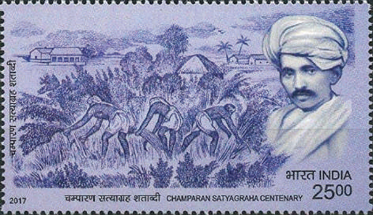

### சம்பரான் சத்தியாகிரகம்

மூன்று பங்கு பகுதியில் அவுரி (இண்டிகோ) பயிரிட வேண்டும் என்று ஐரோப்பியப் பண்ணையாளர்கள் அவர்களைக் கட்டாயப்படுத்தினர். பத்தொன்பதாம் நூற்றாண்டின் கடைசியில் ஜெர்மானிய செயற்கை சாயங்களால், இண்டிகோ எனப்படும் நீலச்சாயம் சந்தையில் விற்கப்படுவது குறைந்தது. சம்பரானில் இண்டிகோ பயிரிட்ட ஐரோப்பியப் பண்ணையாளர்கள் நீலச்சாயம் பயிரிடும் கடமையிலிருந்து விவசாயிகளை விடுவிக்கும் தேவையை உணர்ந்து அந்த நிலைமையை தங்களுக்குச் சாதகமாகப் பயன்படுத்திக்கொள்ள விரும்பினார்கள். இந்தக் கடமையிலிருந்து விவசாயிகளை விடுவிக்கும்பொருட்டு சட்டத்துக்கு புறம்பான நிலுவைத்தொகைகளை வசூலித்ததோடு வாடகையையும் அதிகரித்தார்கள். எனவே , எதிர்ப்பு வெடித்தது. இந்த வகையில் சிரமங்களைச் சந்தித்த சம்பரானைச் சேர்ந்த்த விவசாயியான ராஜ்குமார் சுக்லா, சம்பரானுக்கு வருகை புரியுமாறு காந்தியடிகளைக் கேட்டுக்கொண்டார். சம்பரானை காந்தியடிகள் சென்று சேர்ந்த்தவுடன், அங்கிருந்து உடனடியாக வெளியேறுமாறு காவல்துறையினர் அவரைக் கேட்டுக்கொண்டனர். அதற்கு அவர் மறுத்தையடுத்து வழக்கைச் சந்திக்குமாறு பணிக்கப்பட்டார். இந்தச் செய்தி காட்டுத்தீ போன்று பரவியதை அடுத்து ஆயிரக்கணக்கானோர் அந்த இடத்தில் காந்தியடிகளுக்கு ஆதரவாகக் கூடினர். ‘நாடு முதன்முதலாக ஒத்துழையாமை இயக்கச் செயல்முறைப் பாடத்தைக் கற்றுக்கொண்டதாக’ காந்தியடிகள் தெரிவித்தார். இந்தியாவின் முதலாவது குடியரசுத்தலைவராக பின்னாளில் பொறுப்பேற்ற இராஜேந்திர பிரசாத்தும் வழக்குரைஞராக தொழில் செய்த பிரஜ்கிஷோர் பிரசாத்தும் காந்தியடிகளுக்குத் துணையாக செயல்பட்டனர். அதன்பிறகு துணைநிலை ஆளுநர் ஒரு குழுவை உருவாக்கினார் காந்தியடிகள் அக்குழுவில் ஒரு உறுப்பினர் ஆனார். இண்டிகோ பண்ணையாளர்கள் விவசாயிகள் மீது நடத்திய அடக்குமுறையை முடிவுக்குக் கொண்டுவரும் வகையில் ‘தீன் காதியா’ முறையை ரத்து செய்ய அந்தக் குழு பரிந்துரைத்தது.

சம்பரான் சத்தியாகிரகத்தின் வெற்றியை அடுத்து 1918இல் அகமதாபாத் மில் வேலைநிறுத்தம், 1918இல் கேதா சத்தியாகிரகம் ஆகியன காந்தியடிகளை ஒரு மக்கள் தலைவராக உருவாக்கின. முந்தைய தலைவர்களைப் போலல்லாமல் நாட்டு மக்களை ஒன்றுதிரட்டும் பணியில் காந்தியடிகள் தம் திறமையை வெளிப்படுத்தினார்.

### (ஆ) ரௌலட் சத்தியாகிரகமும் ஜாலியன்வாலா

### பாக் படுகொலையும்

இந்தியர்களுக்கு உண்மையில் அதிகாரங்களை பரிமாற்றம் செய்யாதால் 1919ஆம் ஆண்டின் இந்திய அரசுச்சட்டம் ஏமாற்றத்தை அளித்தது. மேலும், அரசானது போர்காலக் கட்டுப்பாடுகளை நிரந்தரமாக விரிவுபடுத்தி அமல்படுத் தொடங்கியது. பிடிஉத்தரவு இல்லாமல் கைது நடவடிக்கை, விசாரணை இல்லாமல் சிறையிலடைப்பது என காவல் துறையினருக்கு அதீத அதிகாரங்களை ரௌலட் சட்டம் வழங்கியது. இந்தச் சட்டத்தை ‘கருப்புச் சட்டம்’ என்றழைத்த காந்தியடிகள் அதனை எதிர்த்து நாடு தழுவிய சத்தியாகிரகப் போராட்டத்துக்கு 1919 ஏப்ரல் 6இல் அழைப்புவிடுத்தார். இது உண்ணாவிரதமிருத்தல் மற்றும் பிரார்த்தனையுடன் கூடிய ஒரு அகிம்சை போராட்டமாக இருத்தல் வேண்டும். இது நாடு முழுவதும் பரவிய தொடக்கால காலனிய எதிர்ப்பு போராட்டமாகும். ரௌலட் சட்டத்துக்கு எதிரான போராட்டம் பஞ்சாபில் குறிப்பாக அமிர்தசரஸ் மற்றும் லாகூரில் தீவிரமடைந்தது. காந்தியடிகள் கைது செய்யப்பட்டதுடன் பஞ்சாபிற்குள் நுழையவிடாமலும் தடுக்கப்பட்டார். ஏப்ரல் 9ஆம் நாள் டாக்டர். சைஃபுதீன் கிச்லு, டாக்டர். சத்யபால் என்ற இரண்டு முக்கிய உள்ளூர் தலைவர்கள் போராட்டத்திற்கு தலைமையேற்றதால் அமிர்தசரஸில் கைது செய்யப்பட்டனர்.

### ஜெனரல் டயரின் கொடுங்கோன்மை

அமிர்தசரஸில் உள்ள ஜாலியன்வாலா பாக்கில் 1919 ஏப்ரல் 13ஆம் நாள் ஒரு பொதுக்கூட்டத்துக்கு ஏற்பாடு செய்யப்பட்டிருந்தது. பைசாகி திருநாளில் (சீக்கியர்களின் அறுவடைத்திருநாள்) இந்தக்கூட்டத்துக்கு ஏற்பாடு செய்யப்பட்டிருந்தது. ஆயிரக்கணக்கான கிராம மக்கள் அங்கு கூடியிருந்தனர். இந்தக்கூட்டம் பற்றி அறிந்தவுடன் அந்த இடத்தை பீரங்கி வண்டி மற்றும் ஆயுதமேந்திய வீரர்களுடன் ஜெனரல் ரெஜினால்டு டயர் சுற்றி வளைத்தார். உயர்ந்த்த மதில்களுடன் அமைந்த அந்த மைதானத்துக்கு இருந்த ஒரே

வாயில் பகுதியை ஆக்ரமித்த ஆயுதமேந்திய வீரர்கள் எந்தவித முன்னெச்சரிக்கையுமின்றி கண்மூடித்தனமாக சுடத்தொடங்கினார்கள். துப்பாக்கிகளில் குண்டுகள் தீரும் வரை தொடர்ந்து 10 நிமிடங்களுக்கு இந்த் துப்பாக்கிச்சூடு நிகழ்ந்த்தது. அதிகாரபூர்வ அரசு தகவல்களின் படி 379 பேர் இந்த் துப்பாக்கிச்சூட்டில் கொல்லப்பட்டனர்; ஓராயிரத்துக்கும் மேற்பட்டோர் காயம் அடைந்தனர். ஆனால் அதிகாரபூர்வமற்ற தகவல்கள் இந்த் தாக்குதலில் உயிரிழந்தோர் எண்ணிக்கையை ஓராயிரத்துக்கும் அதிகம் என்று தெரிவித்தது. இந்தச் சம்பவத்துக்குப் பிறகு படைத்துறைச்சட்டம் அறிவிக்கப்பட்டு பஞ்சாப் குறிப்பாக, அமிர்தசரஸ் மக்கள் சவுக்கடி கொடுக்கப்பட்டு தெருக்களில் ஊர்ந்து செல்ல வைக்கப்பட்டனர். இந்தக் கொடுமைகள் இந்தியர்களை கொதித்தெழச்செய்தது. இரவீந்திரநாத் தாகூர் வீரத்திருமகன் (knighthood) என்ற அரசுப் பட்டத்தை திருப்பிக் கொடுத்தார். கெய்சர்-இ-ஹிந்த் பதக்கத்தை காந்தியடிகள் திருப்பிக்கொடுத்தார்.

### (இ) கிலாபத் இயக்கம்

1918இல் முதலாவது உலகப்போர் முடிவுக்கு வந்தது. இசுலாமிய மத்தலைவர் என உலகம் முழுவதும் போற்றப்பட்ட துருக்கியின் கலிபா கடுமையாக நடத்தப்பட்டார். அவருக்கு ஆதரவாக தோற்றுவிக்கப்பட்ட இயக்கமே கிலாபத் இயக்கம் என்றழைக்கப்பட்டது. மௌலானா முகமது அலி மற்றும் மௌலானா சௌகத் அலி எனும் அலி சகோதரர்கள் தலைமையில் இவ்வியக்கம் நடந்தது. இந்த இயக்கத்துக்கு ஆதரவளித்த காந்தியடிகள் இந்த இயக்கத்தை இந்து முஸ்லீம்களை இணைக்க ஒரு வாய்ப்பாகக் கருதினார். 1919ஆம் ஆண்டு நவம்பர் மாதம் தில்லியில் நடைபெற்ற அகில இந்திய கிலாபத் இயக்க மாநாட்டிற்கு அவர் தலைமையேற்றார். அல்லாஹூ அக்பர், வந்ததே மாதரம், இந்து-முஸ்லீம் வாழ்க ஆகிய மூன்று தேசிய முழக்கங்களை முன்மொழிந்த சௌகத் அலியின் யோசனையை காந்தியடிகள் ஆதரித்தார். 1920 ஜூன் 9இல் அலகாபாத்தில் கூடிய கிலாபத் குழுவின் கூட்டம் காந்தியடிகளின் அகிம்சை மற்றும் ஒத்துழையாமை இயக்கத்தை ஏற்றுக்கொண்டது. ஒத்துழையாமை இயக்கம் 1920 ஆகஸ்டு முதல் நாள் தொடங்கியது.

## 8.3 ஒத்துழையாமை இயக்கமும் அதன் வீழ்ச்சியும்

1920 செப்டம்பர் மாதம் கல்கத்தாவில் நடைபெற்ற சிறப்பு கூட்டத்தில் (அமர்வில்) இந்திய தேசிய காங்கிரஸ் ஒத்துழையாமை இயக்கத்துக்கு அனுமதி வழங்கியது. பின்னர் 1920 டிசம்பர் மாதம் சேலம் C. விஜயராகவாச்சாரியாரின் தலைமையில் நாக்பூரில் நடந்த அமர்வில் இந்த தீர்மானம் நிறைவேற்றப்பட்டது. ஒத்துழையாமை இயக்கத் திட்டத்தின் கூறுகளாவன;

1. பட்டங்கள் மற்றும் மரியாதை நிமித்தமான பதவிகள் அனைத்தையும் திரும்ப ஒப்படைப்பது. 2. அரசின் செயல்பாடுகளில் ஒத்துழைக்காமல் இருப்பது. 3. நீதிமன்ற வழக்குகளில் வழக்குரைஞர்கள் ஆஜராகாமல் இருப்பது. நீதிமன்றத்தில் இருந்த வழக்குகளுக்கு தனியார் மத்தியஸ்தம் மூலமாகத் தீர்வு காண்பது. 4. அரசுப் பள்ளிகளை குழந்தைகளும் அவற்றின் பெற்றோர்களும் புறக்கணிப்பது. 5. 1919ஆம் ஆண்டு சட்டத்தின் கீழ் உருவாக்கப்பட்ட சட்டப்பேரவைகளை புறக்கணிப்பது. 6. அரசு விருந்து நிகழ்ச்சிகள் மற்றும் இதர அரசு விழாக்களில் பங்கேற்பதில்லை என்ற முடிவு. 7. குடிமைப்பணி (சிவில்) அல்லது இராணுவப் பதவிகளை ஏற்க மறுப்பது. 8. அந்நியப் பொருள்களின் புறக்கணிப்பு மற்றும் உள்ளூர் பொருள்களுக்கு ஊக்கம் தரும் சுதேசி இயக்கத்தின் கொள்கைகளைப் பரப்புவது.

### (அ) வரிகொடா இயக்கம் மற்றும்

### சௌரி சௌரா சம்பவம்

1922 பிப்ரவரி மாதம் பர்தோலியில் வரிகொடா இயக்க பிரச்சாரத்தை காந்தியடிகள் அறிவித்தார். இந்த இயக்கங்கள் ஒரு தேசியத் தலைவராக காந்தியடிகளின் நற்பெயரைப் பெரிதும் மேம்படுத்தின, குறிப்பாக விவசாயிகள் மத்தியில் ஒரு மாபெரும் தலைவராக அவரது மரியாதையை உயர்த்தின. காந்தியடிகள் நாடுதழுவிய சுற்றுப்பயணத்தை மேற்கொண்டார். அவர் பயணம் மேற்கொண்ட இடங்களில் எல்லாம் அந்நியத் துணிகள் குவிக்கப்பட்டு தீயிட்டுக் கொளுத்தப்பட்டன. ஆயிரக்கணக்கானவர்கள் அரசு வேலைகளைத் துறந்தனர், மாணவர்கள் பெரும் எண்ணிக்கையில் தங்கள் கல்வியைக் கைவிட்டனர், பெருமளவிலான வழக்குரைஞர்கள் தங்கள் தொழிலை கைவிட்டனர். ஆங்கிலேயப் பொருள்கள் மற்றும் நிறுவனங்கள் புறக்கணிப்புத் தீவிரமாக நடந்தது. வேல்ஸ் இளவரசரின் இந்தியப் பயணத்தை புறக்கணிப்பது வெற்றிகரமாக நடந்துமுடிந்தது.

1922 பிப்ரவரி 5ஆம் நாள் தற்போதைய உத்தரப்பிரதேசத்தில் உள்ள கோரக்பூர் அருகே சௌரி சௌரா என்ற கிராமத்தில் தேசியவாதிகள் நடத்தியப் பேரணி காவல்துறையினரின் கோபமுட்டும் நடவடிக்கைகளினால் வன்முறையாக மாறியது. தாம் குறைந்த எண்ணிக்கையில் இருப்பதை உணர்ந்த்த காவல்துறையினர் பாதுகாப்புக்காக தங்களை காவல்நிலையத்துக்குள் அடைத்துக் கொண்டனர். ஆனால் ஆத்திரம்கொண்ட கூட்டத்தினர் 22 காவலருடன் காவல்நிலையத்தை தீயிட்டுக் கொளுத்தினர். இதில் 22 காவலர்களும் உயிரிழந்தனர். காந்தியடிகள் உடனடியாக இயக்கத்தைத் திரும்பப்பெற்றார்.

### (ஆ) சுயராஜ்ஜியக் கட்சியினர்

இதனிடையே காங்கிரஸ் கட்சி மாற்றத்தை விரும்புவோர்கள் மற்றும் மாற்றத்தை விரும்பாதவர்கள் என இரண்டாகப் பிளவுபட்டது. மோதிலால் நேரு, சி.ஆர். தாஸ் ஆகியோர் தலைமையிலான காங்கிரசார் தேர்தலில் போட்டியிட்டு சட்டப்பேரவைக்குள் நுழைய வேண்டும் என்று விரும்பினார்கள். சட்டப் பேரவைகளில் பங்கேற்று பணியாற்றுவதன் மூலம் மட்டுமே தேசநலன்கள் மேம்படும் என்றும் இரட்டை ஆட்சியில் பங்கேற்பதன் மூலம்தான் காலனி ஆதிக்க அரசை பாதிப்படைய வைக்க முடியும் என்றும் அவர்கள் வாதிட்டனர். அவர்களே மாற்றத்தை விரும்புவோர்கள் என்று அழைக்கப்பட்டனர். வல்லபாய் பட்டேல், சி. ராஜாஜி உள்ளிட்ட காந்தியடிகளைத் தீவிரமாகப் பின்பற்றிய பலர் மாற்றத்தை விரும்பாதவர்களாக அரசுடன் ஒத்துழையாமை இயக்கத்தைத் தொடர விரும்பினார்கள். எதிர்ப்புக்கு இடையே மோதிலால் நேருவும் சி.ஆர். தாஸும் 1923 ஜனவரி முதல் நாள் சுயராஜ்ஜியக் கட்சியை தொடங்கினார்கள். இந்தக் கட்சி பின்னர் காங்கிரஸ் கட்சியின் சிறப்பு அமர்வில் அங்கீகரிக்கப்பட்டது. ஆங்கிலேய இந்தியாவின் பேரரசு (Imperial) சட்டப் பேரவை மற்றும் பல்வேறு மாகாண சட்டப்பேரவைகளுக்கு பெரும் எண்ணிக்கையில் சுயராஜ்ஜிய கட்சி உறுப்பினர்கள் தேர்ந்தெடுக்கப்பட்டனர். தேசியவாதக் கருத்துக்களை முன்னெடுத்துச் செல்ல அவர்கள் சட்டப்பேரவையை ஒரு மேடையாகப் பயன்படுத்தினார்கள். வங்காளத்தில்

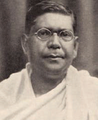

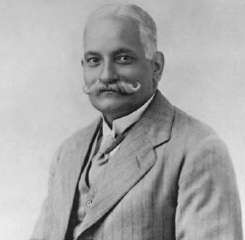

### சி.ஆர். தாஸ்மோதிலால் நேரு

அரசுடன் ஒத்துழைக்க விரும்பாதால் இந்தியர்களுக்கு என மாற்றப்பட்ட துறைகளில் பொறுப்பேற்க அவர்கள் மறுத்துவிட்டனர். காலனி அரசின் உண்மையான இயல்பை அவர்கள் வெளிக்கொணர்ந்த்தனர். எனினும் 1925இல் அக்கட்சியின் தலைவர் சி.ஆர். தாஸ் மறைந்த பிறகு சுயராஜ்ஜிய கட்சி வீழ்ச்சி காணத் தொடங்கியது.

1919ஆம் ஆண்டின் இந்திய அரசுச் சட்டம் மூலமாக இரட்டை ஆட்சி என்பது அறிமுகம் செய்யப்பட்டது. இதன் மூலம் மாகாண அரசின் அதிகாரங்கள் ஒதுக்கப்பட்ட மற்றும் மாற்றப்பட்ட துறைகள் என இரண்டு வகைகளாகப் பிரிக்கப்பட்டன. நிதி, பாதுகாப்பு, காவல்துறை, நீதித்துறை, நிலவருவாய், மற்றும் நீர்ப்பாசனம் ஆகிய துறைகள் ஆங்கிலேயர்கள் வசம் ஒதுக்கப்பட்டன. மாற்றப்பட்ட துறைகளில் உள்ளாட்சி, கல்வி, பொதுசுகாதாரம், பொதுப்பணி, வேளாண்மை, வனங்கள், மற்றும் மீன்வளத்துறை ஆகியன இந்திய அமைச்சர்களின் கட்டுப்பாட்டின் கீழ் விடப்பட்டன. 1935ஆம் ஆண்டு மாகாண சுயாட்சி அறிமுகம் செய்யப்பட்ட பிறகு இந்த முறை முடிவுக்கு வந்தது.

### (இ) காந்தியடிகளின் ஆக்கப்பூர்வத் திட்டம்

சௌரி சௌரா நிகழ்வுக்குப் பிறகு ஆர்வலர்களும் மக்களும் அகிம்சை போராட்டம் குறித்த பயிற்சியை மேற்கொள்ள வேண்டும் என்று காந்தியடிகள் உணர்ந்தார். அதன் ஒருபகுதியாக காதி இயக்க மேம்பாடு, இந்து-முஸ்லீம் ஒற்றுமை, தீண்டாமை ஒழிப்பு ஆகியவற்றில் அவர் கவனம் செலுத்தினார். ”உங்கள் மாவட்டங்களுக்குச் செல்லுங்கள். கதர், இந்து-முஸ்லீம் ஒற்றுமை, தீண்டாமை ஒழிப்பு ஆகியன பற்றிய செய்திகளைப் பரப்புங்கள். இளைஞர்களை ஒன்றுதிரட்டி அவர்களை சுயராஜ்யத்தின் உண்மையான வீரர்களாக உருமாற்றுங்கள்.” என்று காந்தியடிகள் காங்கிரசாருக்கு அறிவுறுத்தினார். காங்கிரஸ் உறுப்பினர்கள் கதர் உடுப்பதை அவர் கட்டாயமாக்கினார். அகில இந்திய நெசவாளர் அமைப்பு உருவாக்கப்பட்டது.

### (ஈ) சைமன் குழு புறக்கணிப்பு

1927 நவம்பர் 8ஆம் நாள் இந்திய அரசியல் சாசன சீர்திருத்தங்களுக்கான இந்திய சட்டபூர்வ ஆணையத்தை (Indian Statutory Commission) நியமிப்பதாக ஆங்கிலேய அரசு அறிவித்தது. சர் ஜான் சைமன் தலைமையிலான இந்தக் குழுவில் ஏழு உறுப்பினர்கள் இடம்பெற்றனர். இது ‘சைமன் குழு’ என்றே அழைக்கப்பட்டது. இந்தியர்கள் எவரும் இடம்பெறாமல் அனைவரும் வெள்ளையர்களாக இந்தக் குழுவில் இடம்பெற்றனர். இந்தியர் ஒருவர் கூட உறுப்பினராக இல்லாத காரணத்தால் இந்தியர்கள் ஆத்திரமும் அவமானமும் அடைந்தனர். தங்கள் அரசியல் சாசனத்தை நிர்ணயிக்க தங்களுக்கு உரிமை இல்லாத நிலைகண்டு கொதித்தனர். காங்கிரஸ் மற்றும் முஸ்லீம் லீக் உள்ளிட்ட அனைத்து இந்திய பிரிவுகளும் இந்த சைமன் குழுவினைப் புறக்கணிப்பது என முடிவு செய்தன. இந்தக் குழு சென்ற இடங்களில் எல்லாம் ஆர்ப்பாட்டங்களும், கருப்புக்கொடி ஏந்தியபடி ‘சைமனே திரும்பிப் போ’ எனும் முழக்கங்களும் இடம்பெற்றன. போராட்டக்காரர்கள் காவல்துறையினரால் கொடூரமாக தாக்கப்பட்டனர். அவ்வாறு நடந்த ஒரு கடுமையான தாக்குதலில் லாலா லஜபதி ராய் மிக மோசமாக காயமடைந்து பின்னர் சில நாள்களில் உயிரிழந்தார்.

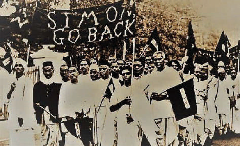

### ‘சைமனே திரும்பிப் போ’ ஆர்ப்பாட்டம்

### (உ) நேரு அறிக்கை

இந்தியாவில் இருந்த பல்வேறு அரசியல் கட்சிகளை சைமன் குழு புறக்கணிப்பு ஒன்றிணைத்தது. சைமன் குழு முன்மொழிவுகளுக்கு மாற்றாக இந்தியாவுக்கு அரசியல் சாசனம் உருவாக்குவதை குறிக்கோளாகக் கொண்டு 1928இல் அனைத்துக் கட்சி மாநாடு நடைபெற்றது. இந்த கொள்கைகளின் அடிப்படையில் அரசியல் சாசன வரைவுக்காக திட்டம் வகுக்க மோதிலால் நேரு தலைமையிலான கமிட்டி அமைக்கப்பட்டது. அந்தக் கமிட்டியின் அறிக்கை ‘நேரு அறிக்கை’ என்று அழைக்கப்பட்டது. அதில் பரிந்துரை செய்யப்பட்டவை:

- இந்தியாவுக்கு தன்னாட்சி அந்தஸ்து என்ற டொமினியன் தகுதி.

- மத்திய சட்டப் பேரவை மற்றும் மாகாண சட்டப் பேரவைகளுக்கு கூட்டு மற்றும் கலவையான வாக்காளர் தொகுதிகளுடன் தேர்தல் நடைபெறுவது.

- மத்திய சட்டப் பேரவை மற்றும் முஸ்லீம்கள் சிறுபான்மையினராக உள்ள மாகாண சட்ட பேரவைகளில் முஸ்லீம்களுக்கு இடஒதுக்கீடு அதேபோல் இந்துக்களுக்கு அவர்கள் சிறுபான்மையினராக உள்ளவடமேற்கு எல்லை மாகாணத்தில் இடஒதுக்கீடு.

- பொது வாக்களிப்பு முறையும் அடிப்படை உரிமைகளும் வழங்கப்படுவது. மத்திய சட்டப்பேரவையில் இடஒதுக்கீடு வழங்குவது குறித்து ஜின்னா சட்டத்திருத்தைக் கொண்டு வந்தார். மூன்றில் ஒருபங்கு இடங்கள் முஸ்லீம்களுக்கு ஒதுக்கப்பட வேண்டும் என்று அவர் கோரினார். அவரை ஆதரித்த தேஜ் பஹதூர் சாப்ரூ இது பெரும் மாற்றத்தைத் தராது என்று வேண்டினார். எனினும், அனைத்துக் கட்சி மாநாட்டில் இவை அனைத்தும் தோல்வி கண்டன. பின்னர், ஜின்னாவின் 14 அம்சங்கள் என்று அழைக்கப்பட்ட தீர்மானத்தை முன்மொழிந்தார். எனினும் அதுவும் நிராகரிக்கப்பட்டது. இந்து- முஸ்லீம் ஒற்றுமையின் தூதராக பாராட்டப்பட்ட ஜின்னா பின்னர் தனது நிலைப்பாட்டை மாற்றிக்கொண்டு முஸ்லீம்களுக்கு தனிநாடு என வலியுறுத்த ஆரம்பித்தார்.

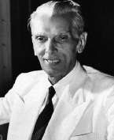

### ஜின்னா

## 8.4 முழுமையான சுயராஜ்ஜியத்துக்கான

### போராட்டம் மற்றும் சட்டமறுப்பு இயக்கத் தொடக்கம்

இதனிடையேடொமினியன் அந்தஸ்து வழங்கப்பட்டது குறித்து திருப்தி அடையாத காங்கிரசார் சிலர், முழுமையான சுதந்திரம் வேண்டி கோரிக்கை வைத்தனர். 1929இல் டிசம்பர் மாதம் லாகூரில் ஜவகர்லால் நேரு தலைமையில் காங்கிரஸ் அமர்வு நடந்தது. அதில் முழுமையான சுதந்திரம் என்பது இலக்காக அறிவிக்கப்பட்டது. வட்டமேசை மாநாட்டை புறக்கணிப்பது என்று முடிவு செய்யப்பட்டதுடன், சட்டமறுப்பு இயக்கத்தைத் தொடங்கவும் முடிவு செய்யப்பட்டது. 1930 ஜனவரி 26ஆம் நாள் சுதந்திரத் திருநாளாக அறிவிக்கப்பட்டு வரிகொடா இயக்கம் உள்ளிட்ட சட்டமறுப்பு இயக்கம் மூலமாகவும் வன்முறையற்ற முறையில் முழுமையான சுதந்திரத்தை அடைவது குறித்தும் நாடு முழுவதும் உறுதிமொழி ஏற்கப்பட்டது. இந்த இயக்கத்தைத் தொடங்க இந்திய தேசிய காங்கிரஸ் காந்தியடிகளுக்கு அங்கீகாரம் அளித்தது.

### (அ) உப்பு சத்தியாகிரகம்

1930 ஜனவரி 31ஆம் நாளுக்குள் நிறைவேற்ற வேண்டும் என்ற காலக்கெடுவுடன் அரசப்பிரதிநிதி (Viceroy) இர்வின் பிரபுவிடம் கோரிக்கைகள் அடங்கிய மனு கொடுக்கப்பட்டது. அவை கீழ்க்கண்டவையாகும்:

- இராணுவம் மற்றும் ஆட்சிப்பணி சேவைகளுக்கான செலவுகளை 50 சதவிகிதம் வரை குறைப்பது.

- பூரண மதுவிலக்கை அறிமுகம் செய்வது.

- அனைத்து அரசியல் கைதிகளையும் விடுதலை செய்வது.

- நிலவருவாயை 50 சதவிகிதமாக குறைப்பது.

- உப்பு வரியை ரத்துசெய்வது.

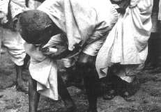

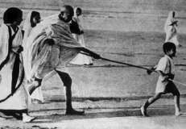

### காந்தியடிகளின் தண்டி யாத்திரை

கோரிக்கை மனுவுக்கு அரசப்பிரதிநிதி பதில் தெரிவிக்காத நிலையில் காந்தியடிகள் சட்டமறுப்பு இயக்கத்தை தொடங்கினார். உப்பு மீதான வரியை ரத்துசெய்ய வேண்டும் என்ற கோரிக்கை ஒரு அறிவுபூர்வமான முடிவாகும். காந்தியடிகள் 1930 மார்ச் மாதம் 12ஆம் நாள் 78 பேர்களுடன் சபர்மதி ஆசிரமத்திலிருந்து தனது புகழ்பெற்ற தண்டி யாத்திரையைத் தொடங்கினார். இந்த யாத்திரையில் நூற்றுக்கணக்கானோர் சேரச்சேர அது நீண்டுகொண்டே போனது. காந்தியடிகள் தனது 61 ஆவது வயதில் 24 நாள்களில் 241 மைல் தொலைவு யாத்திரையாக நடந்து சென்று 1930 ஏப்ரல் 5ஆம் நாள் மாலை தண்டி கடற்கரையை அடைந்தார். அடுத்த நாள் காலை ஒரு கைப்பிடி உப்பைக் கையில் எடுத்து உப்புச்சட்டத்தை மீறினார்.

### மாகாணங்களில் உப்பு சத்தியாகிரகம்

தமிழ்நாட்டில் திருச்சிராப்பள்ளியில் இருந்து வேதாரண்யம் வரை இதேபோன்ற ஒரு யாத்திரையை சி. ராஜாஜி மேற்கொண்டார். கேரளா, ஆந்திரா மற்றும் வங்காளத்திலும் உப்பு சத்தியாகிரக யாத்திரைகள் நடந்தன. வடமேற்கு எல்லை மாகாணத்தில் கான் அப்துல் கஃபார்கான் என்பவர் இந்த இயக்கத்திற்குத் தலைமை ஏற்றார். செஞ்சட்டைகள் என்றழைக்கப்பட்ட ‘குடை கிட்மட்கர்’ இயக்கத்தை அவர் நடத்தினார்.

காந்தியடிகள் நள்ளிரவில் கைது செய்யப்பட்டு எரவாடா சிறையில் அடைக்கப்பட்டார்.

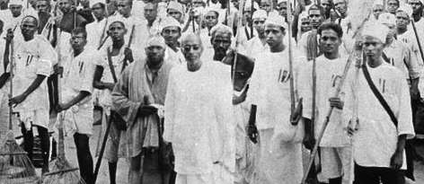

### ராஜாஜியின் வேதாரண்யம் சத்தியாகிரகம்

ஜவகர்லால் நேரு, கான் அப்துல் கஃபார் கான் மற்றும் இதர தலைவர்கள் விரைவாக கைதானார்கள். அந்நிய துணிகள் புறக்கணிப்பு, மதுக்கடைகள் முன் ஆர்ப்பாட்டங்கள், வரி கொடா இயக்கம், வனச்சட்டங்களை பின்பற்ற மறுப்பது ஆகியன உள்ளிட்ட பல ஆர்ப்பாட்ட வடிவங்கள் பின்பற்றப்பட்டன. பெண்கள், விவசாயிகள், பழங்குடியினர், மாணவர்கள் மற்றும் குழந்தைகளும் என சமூகத்தின் அனைத்துப் பிரிவு மக்களும் நாடு தழுவிய போராட்டத்தில் பங்கேற்றனர். இந்தியா சந்தித்த மக்கள் இயக்கங்களிலேயே இது மிகப் பெரியது.

ஆங்கிலேயர்கள் 1865ஆம் ஆண்டு முதலாவது வனச்சட்டத்தை நிறைவேற்றினார்கள். சுள்ளி எடுப்பது, கால்நடைத் தீவனம், தேன், விதைகள், மருத்துவ மூலிகைகள், கொட்டைகள் ஆகிய சிறிய அளவிலான வன உற்பத்திப் பொருள்களையும் வனப்பகுதிகளில் இருந்து சேகரிக்க இந்தச் சட்டம் வனத்தில் வாழ்வோருக்கு தடைவிதித்தது. 1878ஆம் ஆண்டின் இந்திய வனங்கள் சட்டத்தின் படி வனங்களின் உரிமை அரசிடம் இருந்தது. நன்செய் மற்றும் தரிசு நிலங்களும் வனங்களாக கருதப்பட்டன. பழங்குடியினர் பயன்படுத்திய சுழற்சி முறை விவசாயம் தடைசெய்யப்பட்டது. உள்ளூர் மக்களின் கட்டுப்பாட்டில் இருந்து வனப்பகுதிகளை தள்ளி வைப்பதற்கு பாதிக்கப்பட்ட ஆதிவாசிகளும் தேசியவாதிகளும் கடும் எதிர்ப்பு தெரிவித்தனர்.

பழங்குடியினர் நடத்திய தொடர் ஆர்ப்பாட்டங்களுக்கு மிக முக்கிய ஆதாரமாக ராம்பாவில் அல்லூரி சீதாராம ராஜு தலைமையிலான ஆர்ப்பாட்டத்தைக் குறிப்பிடலாம். ராம்பா பகுதி ஆதிவாசிகளின் நலன் காப்பதற்காக ஊழல் அதிகாரிகளுடன் அல்லூரி சீதாராம ராஜு போராடியதால் அவரது உயிரைக் குறிவைத்து ஆங்கிலேய அரசு நடவடிக்கை எடுக்கத் தொடங்கியது. ராம்பா ஆதிவாசிகளின் கிளர்ச்சியை அடக்குவதற்காக (1922-24) மலபார் காவல்துறையின் சிறப்புக்குழு அனுப்பி வைக்கப்பட்டது. வனவாசிகளின் நலனுக்காகப் போராடிய அல்லூரி சீதாராம ராஜு சுட்டுக் கொல்லப்பட்டார்.

### (ஆ) வட்டமேசை மாநாடு

இந்த இயக்கத்தின் மத்தியில் 1930ஆம் ஆண்டு நவம்பர் மாதம் லண்டனில் முதலாவது வட்ட மேசை மாநாடு நடந்தது. பிரிட்டிஷ் பிரதமர் ராம்சே மெக்டொனால்டு மாகாண சுயாட்சியுடன் கூடிய மத்திய அரசு பற்றிய யோசனையைஅறிவித்தார். காங்கிரசின் தலைவர்கள் சிறைகளில் அடைக்கப்பட்டிருந்ததால் இந்த வட்டமேசை மாநாட்டில் காங்கிரஸ் கட்சி கலந்து கொள்ளவில்லை. இந்தப் பிரச்சனை குறித்து எந்தவித முடிவும் எட்டப்படாமலேயே மாநாடு நிறைவடைந்தது.

### (இ) காந்தி-இர்வின் ஒப்பந்தம்

காந்தியடிகளுடன் அரசப்பிரதிநிதி இர்வின் பிரபு பேச்சுவார்த்தைகளை நடத்தியதையடுத்து 1931 மார்ச் 5ஆம் நாள் காந்தி-இர்வின் ஒப்பந்தம் ஏற்பட்டது. வன்முறையில் ஈடுபடாத அனைத்து அரசியல் கைதிகளையும் உடனடியாக விடுதலை செய்வது, கைப்பற்றப்பட்ட நிலத்தைத் திரும்பத் தருவது, பதவி விலகிய அரசு ஊழியர்கள் விஷயத்தில் நீக்குபோக்காக நடந்துகொள்வது ஆகிய கோரிக்கைகளை ஆங்கிலேய அரசு ஏற்றுக்கொண்டது. கடலோர கிராமங்களைச் சேர்ந்த்த மக்கள் தங்கள் பயன்பாட்டுக்காக உப்புக் காய்ச்சவும் வன்முறை இல்லாமல் ஆர்ப்பாட்டங்கள் செய்யவும் இந்த ஒப்பந்தம் வகைசெய்தது. சட்டமறுப்பு இயக்கத்தை ரத்து செய்துவிட்டு இரண்டாவது வட்டமேசை மாநாட்டில் கலந்துகொள்ள காங்கிரஸ் கட்சி ஒப்புக்கொண்டது. 1931 செப்டம்பர் 7ஆம் நாள் நடந்த இரண்டாவது வட்டமேசை மாநாட்டில் காந்தியடிகள் கலந்துகொண்டார். சிறுபான்மையினருக்குத் தனித்தொகுதிகள் வழங்குவதை காந்தியடிகள் ஏற்கவில்லை. இதன் விளைவாக, இரண்டாவது வட்டமேசை மாநாடு எந்தவித முடிவும் எட்டப்படாமல் முடிவடைந்தது.

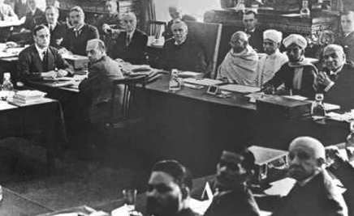

### இரண்டாம் வட்டமேசை மாநாடு

### (ஈ) சட்டமறுப்பு இயக்கத்திற்கு புத்துயிரூட்டல்

இந்தியா திரும்பிய பிறகு காந்தியடிகள் சட்டமறுப்பு இயக்கத்திற்கு மீண்டும் புத்துயிரூட்டினார்.

இந்தமுறை அரசு எதிர்ப்பை சமாளிக்க ஆயத்தமாக இருந்தது. படைத்துறைச் சட்டம் அமல்படுத்தப்பட்டு 1932 ஜனவரி 4ஆம் நாள் காந்தியடிகள் கைது செய்யப்பட்டார். விரைவில் அனைத்து காங்கிரஸ் தலைவர்களும் கைது செய்யப்பட்டனர். ஆர்ப்பாட்டங்கள் மற்றும் மறியல் செய்த மக்கள் படைகொண்டு அடக்கப்பட்டனர்.

இதனிடையே, 1932ஆம் ஆண்டு நவம்பர் 17ஆம் நாள் முதல் டிசம்பர் 24ஆம் நாள் வரை மூன்றாவது வட்டமேசை மாநாடு நடத்தப்பட்டது. சட்டமறுப்பு இயக்கத்திற்கு புத்துயிரூட்டியதால் காங்கிரஸ் கட்சி இந்த மாநாட்டில் பங்கேற்கவில்லை.

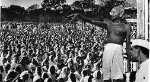

### சட்டமறுப்பு இயக்கத்துக்கு அழைப்பு

### (உ) வகுப்புவாரி ஒதுக்கீடு மற்றும் பூனா ஒப்பந்தம்

1932 ஆகஸ்டு 16ஆம் நாள் வகுப்புவாரி ஒதுக்கீட்டை ராம்சே மெக்டொனால்டு அறிவித்தார். முஸ்லீம்கள், சீக்கியர்கள், இந்திய கிறித்தவர்கள், ஆங்கிலோ இந்தியர்கள் மற்றும் பெண்கள் மற்றும் ஒடுக்கப்பட்ட மக்களின் தலைவராகிய B.R. அம்பேத்கர், தமது கருத்துப்படி தனித்தொகுதிகள் ஒடுக்கப்பட்ட மக்களுக்கு அரசியல் பிரதிநிதித்துவம் மற்றும் அதிகாரத்தை வழங்கும் என்று வாதிட்டார். 1932 செப்டம்பர் 20ஆம் நாள் காந்தியடிகள் ஒடுக்கப்பட்ட மக்களுக்கு தனித்தொகுதிகள் ஒதுக்கீட்டிற்கு எதிராக சாகும்வரை உண்ணாவிரதம் இருக்கும் போராட்டத்தை தொடங்கினார். மதன் மோகன் மாளவியா, ராஜேந்திர பிரசாத் மற்றும் பல தலைவர்கள் B.R. அம்பேத்கர் மற்றும் M.C. ராஜா மற்றும் இதர ஒடுக்கப்பட்ட வகுப்பினரின் தலைவர்களுடன் பேச்சுவார்த்தைகள் நடத்தினர். தீவிரப் பேச்சுவார்த்தைகளுக்குப் பிறகு காந்தியடிகள் மற்றும் அம்பேத்கர் இடையே ஒப்பந்தம் ஒன்று எட்டப்பட்டது. இதுவே பூனா ஒப்பந்தம் என்று அழைக்கப்பட்டது. அதன் முக்கிய விதிமுறைகள்:

- தனித்தொகுதிகள் பற்றிய கொள்கைகள் கைவிடப்பட்டன. மாறாக, ஒடுக்கப்பட்ட வகுப்பு மக்களுக்கு இடஒதுக்கீடு வழங்கும் கூட்டுத்தொகுதிகள் பற்றிய யோசனைஏற்கப்பட்டது.

- ஒடுக்கப்பட்ட வகுப்பினருக்கான இடங்கள் 71 லிருந்து 148 ஆக அதிகரிக்கப்பட்டது. மத்திய சட்டப் பேரவையில் 18 சதவிகித இடங்கள் ஒதுக்கப்பட்டன. (ஊ) தீண்டாமைக்கு எதிரான பிரச்சாரம் அடுத்த சில ஆண்டுகள் தீண்டாமையை ஒழிப்பதற்கு காந்தியடிகள் செலவிட்டார். அம்பேத்கர் உடனான அவரது தொடர்புகள் சாதி அமைப்புகள் பற்றிய காந்தியடிகளின் கருத்துக்களில் பெரிய தாக்கத்தை ஏற்படுத்தியது. அவர் தமது இருப்பிடத்தை வார்தாவில் இருந்த சத்தியாகிரக ஆசிரமத்துக்கு மாற்றினார். அரிஜனர்களுக்கான பயணம் என்ற நாடுதழுவிய பயணத்தை காந்தியடிகள் மேற்கொண்டார். அரிஜனர் சேவை சங்கத்தை அமைத்து சமூகத்தில் உள்ள பாகுபாடுகளை முழுமையாக அவர் அகற்றுவதற்குப் பணியாற்றத் தொடங்கினார். கல்வி, சுத்தம் மற்றும் சுகாதாரம் ஆகியவற்றை மேம்படுத்தவும் ஒடுக்கப்பட்ட மக்களிடையே மதுப் பழக்கத்தை கைவிடவும் அவர் பணியாற்றினார். கோயில் நுழைவுப் போராட்டம் என்பது இந்தப்பிரச்சாரத்தின் முக்கியமான பகுதியாகும். 1933 ஜனவரி 8ஆம் நாள் ‘கோவில் நுழைவு நாள்’ என அனுசரிக்கப்பட்டது.

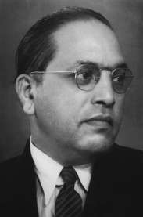

### டாக்டர் B.R. அம்பேத்கர்

## 8.5 பொதுவுடைமை (சோஷியலிஸ்ட்) இயக்கங்களின் தொடக்கங்கள்

1917ஆம் ஆண்டின் ரஷ்யப் புரட்சியால் ஈர்க்கப்பட்ட இந்திய பொதுவுடைமை (Communist) கட்சி (CPI), 1920 அக்டோபர் மாதம் உஸ்பெகிஸ்தானின் தாஷ்கண்டில் நிறுவப்பட்டது. M.N. ராய், அபானி முகர்ஜி, M.P.T. ஆச்சார்யா ஆகியோர் அதன் நிறுவன உறுப்பினர்களாவர். 1920களில் அடுத்தடுத்து வழக்குகளைத் தொடுத்து கம்யூனிச இயக்கத்தை அடக்குவதற்கு இந்தியாவில் இருந்த ஆங்கிலேய அரசு பல்வேறு முயற்சிகளை மேற்கொண்டது. மேலும், கம்யூனிசம் தொடர்பான அச்சுறுத்தலை அடக்கும் மற்றொரு முயற்சியாக M.N. ராய், S.A. டாங்கே, முசாஃபர் அஹமது, M. சிங்காரவேலர் ஆகிய தலைவர்கள் கைது செய்யப்பட்டதோடு, 1924ஆம் ஆண்டின் கான்பூர் சதித்திட்ட வழக்கிலும் விசாரிக்கப்பட்டனர்.

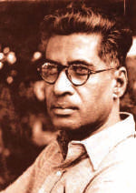

### M.N. ராய்

### (அ) பொதுவுடைமை (Communism) கட்சி நிறுவப்படுதல்

தங்கள் கருத்துக்களை பரப்பவும், ‘இந்தியாவில் ஆங்கிலேய ஆட்சியின் உண்மையான முகத்எடுத்துக்காட்டவும் பொதுவுடைமைவாதிகள் இதனை ஒரு மேடையாகப் பயன்படுத்திக் கொண்டனர். ஒரு கட்சியை ஆரம்பிக்கும் முயற்சியாக 1925ஆம் ஆண்டு கான்பூரில் அகில இந்திய பொதுவுடைமை மாநாடு நடந்தது. அதில் சிங்காரவேலர் தலைமை உரையாற்றினார். இந்திய மண்ணில் இந்திய பொதுவுடைமைக் கட்சியை ஆரம்பிக்க அது வழிவகுத்தது. பல்வேறு முயற்சிகளின் பலனாக ‘அகில இந்திய தொழிலாளர்கள் மற்றும் விவசாயிகள் கட்சி’ 1928ஆம் ஆண்டு நிறுவப்பட்டது.

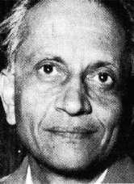

### S.A. டாங்கே

### (ஆ) புரட்சிகர நடவடிக்கைகள்

ஒத்துழையாமை இயக்கத்தை காந்தியடிகள் திடீரென திரும்பப்பெற்றதால் குழப்பமடைந்த இளைஞர்கள் வன்முறையைக் கையில் எடுத்தனர். காலனி ஆட்சியை ஆயுதக்கிளர்ச்சி மூலம் அகற்றும் நோக்கில் 1924இல் இந்துஸ்தான் குடியரசு இராணுவம் (HRA) கான்பூரில் உருவாக்கப்பட்டது. 1925ஆம் ஆண்டு ராம்பிரசாத் பிஸ்மில், அஷ்ஃபாகுல்லா கான் மற்றும் பலர் லக்னோ அருகே காகோரி என்ற கிராமத்தில் அரசுப்பணத்தை கொண்டுச்சென்ற ஒரு இரயில்வண்டியை நிறுத்திக் கொள்ளையடித்தனர். அவர்கள் காகோரி சதி வழக்கில் கைது செய்யப்பட்டு விசாரிக்கப்பட்டனர். அவர்களில் நான்கு பேருக்கு மரணதண்டனையும் மற்றவர்களுக்கு சிறைத்தண்டனையும் விதிக்கப்பட்டன.

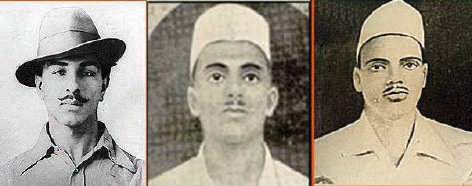

### பகத்சிங்   ராஜகுரு     சுக்தேவ்

பஞ்சாபில் பகத்சிங், சுக்ததேவ், மற்றும் அவர்களது தோழர்கள் இந்துஸ்தான் குடியரசு இராணுவத்தை மீண்டும் அமைத்தனர். பொதுவுடைமை கருத்துக்களால் ஈர்க்கப்பட்டு அந்த அமைப்புக்கு இந்துஸ்தான் பொதுவுடைமைவாத குடியரசு அமைப்பு என்று 1928இல் பெயர் மாற்றம் செய்தனர். லாலா லஜபதி ராயின் உயிரிழப்புக்குக் காரணமான தடியடியை நடத்திய ஆங்கிலேய காவல்துறை அதிகாரி சாண்டர்ஸ் படுகொலை செய்யப்பட்டார். 1929இல் மத்திய சட்டப் பேரவையில் புகைக்குண்டு ஒன்றை பகத்சிங்கும் B.K. த்தும் வீசினார்கள். அவர்கள் “இன்குலாப் ஜிந்தாபாத்” “பாட்டாளி வர்க்கம் வாழ்க” ஆகிய முழக்கங்களை எழுப்பினார்கள்.

ராஜகுருவும் பகத்சிங்கும் கைது செய்யப்பட்டு மரணதண்டனை விதிக்கப்பட்டன. பகத்சிங்கின் அசாத்தியமான துணிச்சல் இந்தியா முழுவதும் வாழ்ந்த்த இளைஞர்களின் கவனத்தை ஈர்த்தை அடுத்து அவர் இந்தியா முழுவதும் பிரபலம் அடைந்தார்.

1930 ஏப்ரலில் சிட்டகாங் ஆயுதக்கிடங்கு மீதான தாக்குதல் சூர்யா சென் மற்றும் அவரது நண்பர்களால் மேற்கொள்ளப்பட்டது. சிட்டகாங்கில் இருந்த ஆயுதக் கிடங்குகளைக் கைப்பற்றிய அவர்கள் அங்கு புரட்சிகர அரசை நிறுவினார்கள். அரசு நிறுவனங்களைக் குறிவைத்து அடுத்த மூன்று ஆண்டுகளுக்கு அவர்கள் தாக்குதல்களை நடத்தினார்கள். 1933ஆம் ஆண்டு கைது செய்யப்பட்ட சூர்யா சென் ஓராண்டுக்குப் பிறகு தூக்கிலிடப்பட்டார்.

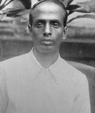

### சூர்யா சென்

### (இ) 1930களில் இடதுசாரி இயக்கங்கள்

உலகம் முழுவதும் நிலவிய பொருளாதார மந்தநிலை உருவாக்கிய பொருளாதார நெருக்கடிகளை அடுத்து, 1930களில் இந்திய பொதுவுடைமை கட்சி வலுப்பெற்றது. பிரிட்டனில் இருந்த மந்தநிலை அதன்கீழ் இருந்த காலனிகளிலும் பாதிப்புக்களை ஏற்படுத்தியது. இந்த பொருளாதார வீழ்ச்சியின் விளைவாக வர்த்தக லாபங்களிலும் வேளாண் பொருள்களின் விலைகளிலும் சரிவு ஏற்பட்டன. ஏற்கனவேசரிந்திருந்த வேளாண் பொருள்களின் ஐம்பது சதவிகித விலை வீழ்ச்சி காரணமாக கட்டாயமாக செய்யப்பட்ட அரசின் நிலவருவாய் வசூல் இருமடங்காக அதிகரித்தது.

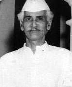

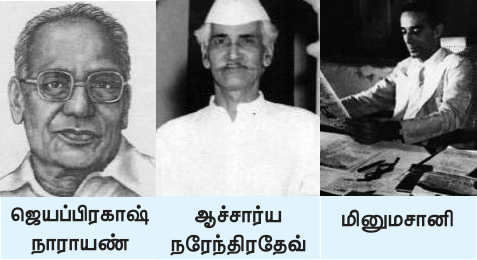

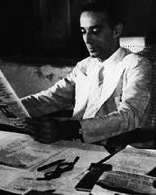

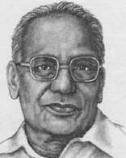

புழக்கத்தில் இருந்த பணம் திரும்பப்பெறப்படுவது, வளர்ச்சிப் பணிகளுக்கான பணியாளர்கள் எண்ணிக்கையும் செலவுகளையும் குறைப்பது ஆகியன அரசின் இதர நடவடிக்கைகளாக இருந்தன. இந்தச்சூழலில் வருவாய் மற்றும் ஊதியக்குறைபாட்டால் பாதிக்கப்பட்ட விவசாயிகள் மற்றும் தொழிலாளர்களின் நலன், வேலையில்லாத் திண்டாட்டம் ஆகியவற்றுக்காகப் போராடிய பொதுவுடைமை கட்சி முக்கியத்துவம் பெற்றதையடுத்து 1934ஆம் ஆண்டு அக்கட்சி தடைசெய்யப்பட்டது. தீவிர இடதுசாரி ஆதரவு முதல் தீவிர வலதுசாரி ஆதரவு வரையான அகன்ற அரசியல் சார்பு பெற்ற ஓர் இயக்கமாக சுயராஜ்ஜியம் என்ற குறிக்கோளுடன் காங்கிரஸ் கட்சி வலுவான அமைப்பாக உருவெடுத்தது. 1934ஆம் ஆண்டில் ஜெயப்பிரகாஷ்நாராயண், ஆச்சார்ய நரேந்திரதேவ் மற்றும் மினுமசானி ஆகியோரின் முன்முயற்சியால் காங்கிரஸ் பொதுவுடைமை (சோஷலிஷ) கட்சி உருவானது. தேசியவாதம் தான் பொதுவுடைமைக்கான பாதை என்று நம்பிய அவர்கள் அதற்காக காங்கிரசுக்குள் இருந்து உழைக்க விரும்பினார்கள்.

ஒருசிலர் அதிகாரத்துக்கு வருவதால் உண்மையான சுயராஜ்ஜியம் கிடைத்துவிடாது, ஆனால், தாங்கள் பெற்ற அதிகாரத்தை தவறாகப் பயன்படுத்தப்படும்போது நிருவாகத்தினரை எதிர்க்கும் திறனை அனைவரும் பெறச்செய்வதே சுயராஜ்ஜியமாகும்.

### - காந்தியடிகள்

## 8.6 1935ஆம் ஆண்டு இந்திய அரசுச் சட்டத்தின் கீழ் அமைந்த முதல் காங்கிரஸ் அமைச்சரவைகள்

சட்டமறுப்பு இயக்கத்தின் ஆக்கப்பூர்வ வெளிப்பாடுகளில் 1935ஆம் ஆண்டு இந்திய அரசுச் சட்டமும் ஒன்றாகும். மாகாணங்களுக்கு தன்னாட்சி அதிகாரம், மத்தியில் இரட்டையாட்சி ஆகியன இந்தச்சட்டத்தின் முக்கிய அம்சங்களாகும். அகில இந்திய கூட்டமைப்பு ஏற்பட வேண்டும் என்று இந்த சட்டம் வலியுறுத்துகிறது. அதன்படி, 11 மாகாணங்கள், 6 தலைமை ஆணையரக மாகாணங்கள் மற்றும் இந்தக் கூட்டமைப்பில் சேர விரும்பிய அனைத்து சிற்றரசுகளும் இக்கூட்டமைப்பில் இடம்பெற்றன. மாகாணங்களின் தன்னாட்சிக்கும் இந்த சட்டம் வகைசெய்தது. அனைத்து துறைகளும் இந்திய அமைச்சர்களின் கட்டுப்பாட்டிற்குள் கொண்டு வரப்பட்டன. மாகாணங்களில் நடைமுறையில் இருந்து வந்த இரட்டை ஆட்சி மத்திய அரசுக்கும் விரிவாக்கப்பட்டது. வாக்குரிமையானது சொத்தின் அடிப்படையில் நீட்டிக்கப்பட்டதால் மக்கள் தொகையில் பத்து சதவிகித மக்கள் மட்டுமே வாக்களிக்கும் தகுதிபெற்றனர். இந்தச் சட்டத்தின்படி, பர்மா இந்தியாவில் இருந்து பிரிக்கப்பட்டது.

### (அ) காங்கிரஸ் அமைச்சரவைகளும் அவற்றின் பணியும்

1937ஆம் ஆண்டு தேர்தல்கள் அறிவிக்கப்பட்டதுடன் 1935ஆம் ஆண்டின் இந்திய அரசுச் சட்டம் அமல்படுத்தப்பட்டது. சட்டமறுப்பு இயக்கத்தால் காங்கிரஸ் பெரிதும் பலன்பெற்றது. சட்டப்பேரவை புறக்கணிப்பைக் கைவிட்ட காங்கிரஸ் தேர்தல்களில் போட்டியிட்டது. பதினோரு மாகாணங்களில் போட்டியிட்டு ஏழு மாகாணங்களில் காங்கிரஸ் வெற்றிபெற்றது. மதராஸ், பம்பாய், மத்திய மாகாணங்கள், ஒடிசா, பீகார், ஐக்கிய மாகாணங்கள், வடமேற்கு எல்லை மாகாணம், சர் முஹம்மது சாதுல்லா தலைமையிலான அசாம் பள்ளத்தாக்கு முஸ்லீம் கட்சியுடன் இணைந்து கூட்டணி அரசு உட்பட எட்டு மாகாணங்களில் அது ஆட்சி அமைத்தது. காங்கிரஸ் அரசுகள் பிரபலமான அரசுகளாக செயல்பட்டன. மக்களின் தேவைகளை அவை நிறைவேற்றின. அமைச்சர்களின் ஊதியம் மாதம் ஒன்றுக்கு 2 ஆயிரம் ரூபாயில் இருந்து 500 ரூபாயாக குறைக்கப்பட்டது. தேசியவாதிகளுக்கு எதிராக எடுக்கப்பட்ட முந்தைய நடவடிக்கைகள் ரத்துசெய்யப்பட்டன. அரசிடம் அவசரகால அதிகாரங்களை தந்த சட்டங்களை அவர்கள் திரும்பப்பெற்றனர். கம்யூனிஸ்ட் கட்சி தவிர இதர கட்சிகள் மீது விதிக்கப்பட்ட தடைகளை ரத்துசெய்தனர். தேச அளவில் பத்திரிகைகள் மீது விதிக்கப்பட்டிருந்த கட்டுப்பாடுகளை அவர்கள் அகற்றிவிட்டனர். காவல்துறை அதிகாரங்கள் கட்டுப்படுத்தப்பட்டன. அரசியல் பேச்சுக்கள் பற்றி சி.ஐ.டி. சார்பாக அறிக்கை தருவது விலக்கிக் கொள்ளப்பட்டது. விவசாயிகளின் கடன்கள் குறையவும் தொழிலக தொழிலாளர்களின் பணிநிலைமை மேம்படவும் சட்டபூர்வ நடவடிக்கைகள் மேற்கொள்ளப்பட்டன. கோயில் நுழைவுச் சட்டம் நிறைவேற்றப்பட்டது. கல்வி மற்றும் பொது சுகாதாரத்துக்கு சிறப்புக் கவனம் செலுத்தப்பட்டது.

### (ஆ) காங்கிரஸ் அமைச்சரவையின் பதவி விலகல்

1939இல் இரண்டாம் உலகபோர் மூண்டது. காங்கிரஸ் அமைச்சரவைகளை ஆலோசிக்காமல் கூட்டணிப் படைகள் சார்பாக இந்த போரில் இந்தியாவின் காலனி ஆதிக்க அரசு நுழைந்தது. எனவே , அதற்கு எதிர்ப்பு தெரிவித்து காங்கிரஸ் அமைச்சரவைகள் பதவி விலகின. ஜின்னா

1940ஆம் ஆண்டு வாக்கில் முஸ்லீம்களுக்கு தனிநாடு வேண்டும் என்று வலியுறுத்தினார்.

### (இ) இரண்டாம் உலகப் போரின் போது தேசிய

### இயக்கம், 1939-45

காந்தியடிகளின் வேட்பாளரான பட்டாபி சீதாராமய்யாவை வீழ்த்தி 1939இல் சுபாஷ் சந்திர போஸ் காங்கிரஸ் தலைவரானார். காந்தியடிகள் ஒத்துழைக்க மறுத்ததை அடுத்து, சுபாஷ் சந்திர போஸ் அப்பதவியிலிருந்து விலகி பார்வர்டு பிளாக் கட்சியைத் தொடங்கினார்.

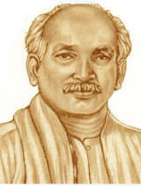

### பட்டாபி சீதாராமய்யா

## 8.7 வெள்ளையனே வெளியேறு இயக்கத்துக்கு வழிவகுத்த நடவடிக்கைகள்

### (அ) தனி நபர் சத்தியாகிரகம்

1940 ஆகஸ்டு மாதம், காங்கிரஸ் இரண்டாம் உலகப்போரின் போது இந்தியர்களின் ஆதரவைப் பெறுவதற்காக அரசப்பிரதிநிதி லின்லித்கோ ஒரு சலுகையை வழங்க முன்வந்தார். எனினும் குறிப்பிடப்படாத எதிர்காலத்தில் தன்னாட்சி (Dominion) தகுதி என்ற சலுகை, காங்கிரசுக்கு ஏற்றுக்கொள்ளக்கூடியதாக இல்லை. எனவே , வரையறைக்கு உட்பட்ட சத்தியாகிரகப் போராட்டத்தை காந்தியடிகள் அறிவித்தார் இதில் ஒருசிலர் மட்டுமே கலந்துகொண்டனர். 1940 அக்டோபர் 17ஆம் நாள் வினோபா பாவேசத்தியாகிரகப் போராட்டத்தை முதன் முதலாக ஆரம்பித்தார். அந்த ஆண்டின் இறுதிவரை சத்தியாகிரகம் தொடர்ந்த்தது. இந்த காலகட்டத்தில் 25,000க்கும் அதிகமான மக்கள் கைது செய்யப்பட்டனர்.

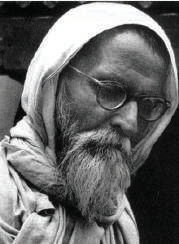

### வினோபா பாவே

### (ஆ) கிரிப்ஸ் தூதுக்குழு

1942 மார்ச் 22ஆம் நாள் அமைச்சரவை (Cabinet) அமைச்சர் சர் ஸ்டட்ராஃஃபோர்டு கிரிப்ஸ் தலைமையில் ஒரு தூதுக்குழுவை பிரிட்டிஷ் அரசு அனுப்பியது. உரிய அதிகாரத்தை உடனடியாக மாற்றித்தர பிரிட்டன் விருப்பப்படாத நிலையில் காங்கிரஸ் மற்றும் கிரிப்ஸ் தூதுக்குழு இடையேயான பேச்சுகள் தோல்வி அடைந்தன. கிரிப்ஸ் தூதுக்குழு கீழ்க்காண்பனவற்றை வழங்க முன்வந்தது.

1. போருக்குப் பிறகு தன்னாட்சி (Dominion Status) வழங்குவது.

2. பாகிஸ்தான் உருவாக்க கோரிக்கையை ஏற்கும் விதமாக இந்திய இளவரசர்கள் பிரிட்டிஷாருடன் தனி ஒப்பந்த்தைக் கையெழுத்திடலாம்.

3. போரின் போது பாதுகாப்புத் துறை பிரிட்டிஷாரின் கட்டுப்பாட்டில் இருப்பது.

காங்கிரஸ், முஸ்லீம் லீக் இரண்டுமே இந்த் திட்ட அறிக்கையை நிராகரித்து விட்டன. திவாலாகும் வங்கியில் பின் தேதியிட்ட காசோலை என காந்தியடிகள் இந்த திட்டங்களை அழைத்தார்.

### (இ) காந்தியடிகளின் “செய் அல்லது செத்து மடி”

### முழக்கம்

கிரிப்ஸ் தூதுக்குழுவின் வெளிப்பாடு மிகுந்த ஏமாற்றத்தைக் கொடுத்தது. போர்கால பற்றாக்குறைகளினால் விலைகள் பெரிதும் அதிகரித்து அதிருப்தி தீவிரமடைந்தது. பம்பாயில் 1942 ஆகஸ்டு மாதம் 8ஆம் நாள் கூடிய அகில இந்திய காங்கிரஸ் கமிட்டி வெள்ளையனேவெளியேறு தீர்மானத்திற்கு வித்திட்டதுடன் இந்தியாவில் ஆங்கிலேய ஆட்சிக்கு உடனடியாக முடிவு கட்ட கோரிக்கை வைத்தது. செய் அல்லது செத்து மடி என்ற முழக்கத்தை காந்தியடிகள் வெளியிட்டார். ”நாம் நமது முயற்சியின் விளைவாக இந்தியாவுக்கு சுதந்திரம் பெற்றுத் தருவோம், அல்லது நாம் நமது அடிமைத்தனத்தைக் காண உயிருடன் இருக்கமாட்டோம்”, என்று காந்தியடிகள் கூறினார். காந்தியடிகளின் தலைமையின் கீழ் அகிம்சையான மக்கள் போராட்டம் தொடங்கப்பட இருந்தது. ஆனால் அடுத்த நாள் காலை அதாவது 9 ஆகஸ்டு 1942 அன்று காந்தியடிகளும் காங்கிரஸ் தலைவர்கள் அனைவரும் கைது செய்யப்பட்டனர்.

### (ஈ) பொதுவுடைமைவாத (Socialism) தலைவர்களின் பங்குபணி

காந்தியடிகள் மற்றும் இதர முக்கிய காங்கிரஸ் தலைவர்கள் சிறையில் அடைபட்டதையடுத்து இந்த இயக்கத்துக்கு பொதுவுடைமைவாதிகள் தலைமை தாங்கினார்கள். சிறையில் இருந்து தப்பிய ஜெயபிரகாஷ் நாராயண், ராமாநந்த் மிஷ்ரா ஆகியோர்

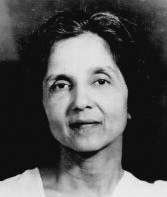

### அருணா ஆசப் அலி

திரைமறைவு வேலைகளில் ஈடுபட்டனர். அருணா ஆசப் அலி போன்ற பெண் தலைவர்கள் முக்கியப் பணி ஆற்றினார்கள். உஷா மேத்தா நிறுவிய காங்கிரஸ் வானொலி திரைமறைவில் இருந்தபடியே 1942 நவம்பர் மாதம் வரை வெற்றிகரமாகச் செயல்பட்டது.

### (ஊ) மக்களின் வெளிப்பாடு

இந்தியாவின் பல பகுதிகளுக்கும் இந்தச் செய்தி பரவியதை அடுத்து அனைத்து இடங்களிலும் ஆங்காங்கே வன்முறை ஆர்ப்பாட்டங்கள் வெடித்தன. வேலைநிறுத்தங்கள், ஆர்ப்பாட்டங்கள் மறியல் என தாங்கள் அறிந்த வகைகளில் மக்கள் போராட்டங்களை நடத்தினார்கள். இரும்புக் கரம் கொண்டு அரசு இந்த இயக்கத்தைக் கட்டுப்படுத்தியது. அரசுக் கட்டங்கள், ரயில் நிலையங்கள், தொலைபேசி மற்றும் தந்தி கம்பிகள், மற்றும் பிரிட்டிஷ் அதிகாரத்தின் அடையாளங்களாக நின்ற அனைத்தின் மீதும் மக்கள் தாக்குதல்களை நடத்தினார்கள். மதராஸில் இது முக்கியமாக தீவிரமாகப் பரவியது. சதாரா, ஒரிஸா (தற்போதைய ஒடிசா), பீகார், ஐக்கிய மாகாணங்கள், வங்காளம் ஆகிய இடங்களில் இணை அரசுகள் நிறுவப்பட்டன.

### (எ) சுபாஷ் சந்திர போஸ் மற்றும் இந்திய

### தேசிய இராணுவம்

காங்கிரசை விட்டு விலகிய சுபாஷ் சந்திர போஸ் வீட்டுக்காவலில் வைக்கப்பட்டார். பிரிட்டிஷாரின் எதிரிகளோடு கைகோர்த்து பிரிட்டிஷ் அரசுக்கு எதிராக தாக்குதல் நடத்த அவர் விரும்பினார். 1941 மார்ச் மாதம், அவர் தனது இல்லத்தில் இருந்து நாடகத்தனமாக (மாறுவேடமணிந்து) தப்பித்து ஆப்கானிஸ்தான் சென்றடைந்தார். முதலில் அவர் சோவியத் யூனியனின் ஆதரவைப் பெற விரும்பினார். ஆனால் பிரிட்டன் உள்ளிட்ட கூட்டணிப் படைகளுடன் சோவியத் யூனியன் அரசு சேர்ந்த்ததால் அவர் ஜெர்மனிக்கு சென்றார். 1943 பிப்ரவரி மாதம், நீர்மூழ்கிக் கப்பல் மூலமாக ஜப்பான் சென்ற அவர், இந்திய தேசிய இராணுவத்தின் கட்டுப்பாட்டைக் கையில் எடுத்தார். இந்தியப் போர்கைதிகளைக் கொண்டு மலாயா மற்றும் பர்மாவில் இருந்த ஜப்பானியர்களின் ஆதரவோடு இந்திய தேசிய இராணுவத்தை (ஆசாத் ஹிந்த் ஃபாஜ்) ஜெனரல் மோகன் சிங் உருவாக்கினார், அதன்பிறகு இது கேப்டன் லட்சுமி செகல் என்பவரால் நடத்தப்பட்டது. இது காந்தி பிரிகேட், நேரு பிரிகேட், பெண்கள் பிரிவாக ராணி லக்ஷமி பாய் பிரிகேட் என மூன்று படையணிகளாக சுபாஷ் சந்திர போஸ் மறுசீரமைத்தார். சுபாஷ் சந்திர போஸ், சிங்கப்பூரில்

சுதந்திர இந்தியாவின் தற்காலிக அரசாங்கத்தை நிறுவினார். ‘தில்லிக்கு புறப்படு’ (தில்லி சலோ) என்ற முழக்கத்தை சுபாஷ் வெளியிட்டார். ஜப்பானிய படைகளின் ஒரு பகுதியாக இந்திய தேசிய இராணுவம் பணியில் ஈடுபடுத்தப்பட்டது. எனினும் ஜப்பான் தோல்வி அடைந்த பிறகு இந்திய தேசிய இராணுவம் முன்னேறுவது தடைபட்டது. சுபாஷ் சந்திர போஸ் பயணம் செய்த விமானம் விபத்துக்குள்ளானதால் சுதந்திரத்துக்காக போராடிய அவரது தீவிரப்பணிகள் முடிவுக்கு வந்தன.

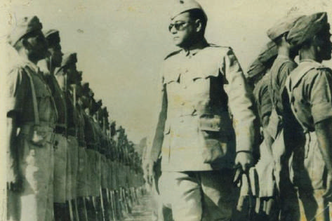

### சுபாஷ் சந்திர போஸின் இந்திய தேசிய இராணுவம்

பிரிட்டிஷ் அரசு இந்திய தேசிய இராணுவ அதிகாரிகளை கைது செய்து செங்கோட்டையில் அவர்களை விசாரணைக்காக வைத்தது. தேசியவாத பிரச்சாரத்துக்கு ஒரு மேடையாக இந்த விசாரணை அமைந்தது. காங்கிரஸ் அமைத்த பாதுகாப்புத்துறை கமிட்டி ஜவகர்லால் நேரு, தேஜ் பஹதூர் சாப்ரூ, புலாபாய் தேசாய், ஆசப் அலி ஆகியோரை உள்ளடக்கியதாக இருந்தது. இந்திய தேசிய இராணுவத்தின் அதிகாரிகளுக்கு எதிரான குற்றம் நிரூபிக்கப்பட்டாலும் பொதுமக்கள் அழுத்தம் கொடுத்தன் காரணமாக அவர்கள் விடுதலை செய்யப்பட்டனர். இந்திய தேசிய இராணுவத்தின் தாக்குதல்களும் அதனை அடுத்த வழக்கு விசாரணைகளும் இந்தியர்களுக்கு ஊக்கமாக அமைந்தது.

## 8.8 விடுதலையை நோக்கி

### (அ) ராயல் இந்திய கடற்படைக் கிளர்ச்சி

1946ஆம் ஆண்டு பிப்ரவரி மாதம் பம்பாயில் ராயல் இந்திய கடற்படை மாலுமிகள் கிளர்ச்சி செய்தனர். விரைவில் அங்கிருந்து வேறு நிலையங்களுக்கும் பரவிய இந்த கிளர்ச்சியில் சுமார் 20,000க்கும் மேற்பட்ட மாலுமிகள் ஈடுபட்டனர். இதேபோன்று ஜபல்பூரில் இருந்த இந்திய விமானப்படை, இந்திய சமிக்ஞை (Signal) படை ஆகியவற்றிலும் வேலைநிறுத்தங்கள் நடந்தன. இவ்வாறு ஆயுதப்படைகளிலும் கூட பிரிட்டிஷாரின் மேலாதிக்க கட்டுப்பாடு இல்லை.

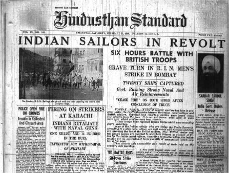

### ராயல் இந்திய கடற்படைக் கிளர்ச்சி

### (ஆ) சுதந்திரம் பற்றிய பேச்சுவார்த்தை: சிம்லா மாநாடு

1945ஆம் ஆண்டு ஜூன் 14ஆம் நாள் வேவல் திட்டம் அறிவிக்கப்பட்டது. இந்திட்டம் மூலமாக அரசப்பிரதிநிதியின் செயற்குழுவில் இந்துக்களும் முஸ்லீம்களும் சம எண்ணிக்கையில் இடம்பெற்ற ஓர் இடைக்கால அரசுக்கு வகை செய்யப்பட்டது. போர் தொடர்பான துறை தவிர்த்து அனைத்து இதர துறைகளும் இந்திய அமைச்சர்கள் வசம் கொடுக்கப்பட இருந்தன. எனினும் சிம்லா மாநாட்டில் காங்கிரசும் முஸ்லீம்லீக்கும் ஓர் ஒப்பந்த்தை எட்டமுடியவில்லை. அனைத்து முஸ்லீம் உறுப்பினர்களும் முஸ்லீம் லீக்கில் இருந்துதான் இடம்பெற வேண்டும் மற்றும் அவர்கள் அனைத்து முக்கிய விஷயங்களிலும் வீட்டோ அதிகாரங்களையும் பெறவேண்டும் என்று ஜின்னா கோரினார். 1946ஆம் ஆண்டு தொடக்கத்தில் நடந்த மாகாணத் தேர்தல்களில் பொதுத்தொகுதிகளில் பெரும்பாலானவையை காங்கிரஸ் வென்றது. முஸ்லீம்களுக்கு ஒதுக்கப்பட்ட தொகுதிகளில் முஸ்லீம் லீக் வென்று தனது கோரிக்கைக்கு வலுசேர்த்தது.

### (இ) அமைச்சரவைத் தூதுக்குழு

பிரிட்டனில் தொழிற்கட்சி மிகப்பெரிய வெற்றியை பெற்று கிளெமன்ட் அட்லி பிரதம மந்திரியாகப் பொறுப்பேற்றார். உடனடியாக ஆட்சி மாற்றம் வேண்டும் என்று விரும்பினார். அவர் பெதிக் லாரன்ஸ், சர் ஸ்டராஃபோர்ட் கிரிப்ஸ், A.V. அலெக்ஸாண்டர் ஆகியோர் அடங்கிய அமைச்சர்கள் தூதுக்குழுவை இந்தியாவுக்கு அனுப்பினார். பாகிஸ்தானை தனிநாடாக உருவாக்க வேண்டும் என்ற கோரிக்கையை நிராகரித்த அக்குழுவினர் பாதுகாப்பு, தகவல்

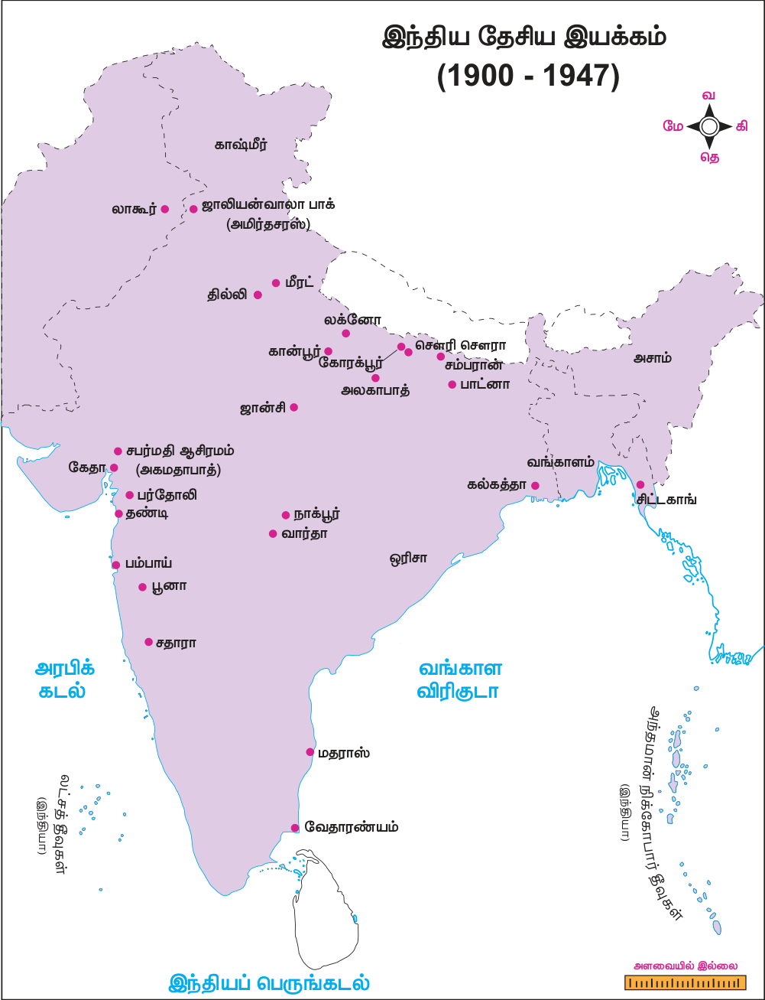

தொடர்பு மற்றும் வெளியுறவு ஆகிய துறைகளில் கட்டுப்பாட்டுடன் கூடிய மத்திய அரசை நிறுவ வகைசெய்தது. முஸ்லீம்கள் பெரும்பான்மையாக இல்லாத மாகாணங்கள், வடமேற்கில் முஸ்லீம்கள் பெரும்பான்மையாக உள்ளமாகாணங்கள், மற்றும் வடகிழக்கில் முஸ்லீம்கள் பெரும்பான்மையாக உள்ள மாகாணங்கள் என மூன்றுவகையாக மாகாணங்கள் பிரிக்கப்பட்டன. இந்திய அரசியல் சாசன நிர்ணயமன்றம் தேர்ந்தெடுக்கப்பட்டு அனைத்து சமூகங்களில் இருந்தும் பிரதிநிதித்துவம் கொண்ட இடைக்கால அரசு நிறுவப்பட வேண்டும். இந்த திட்டத்தை காங்கிரசும் முஸ்லீம் லீக்கும் ஏற்றுக்கொண்டன. எனினும் இரண்டு கட்சிகளுமே தங்களுக்கு சாதகமாக இந்த திட்டம் குறித்து விவரித்தன.

### (ஈ) நேரடி நடவடிக்கை நாளுக்கு முஸ்லீம் லீக் அழைப்பு விடுத்தல்

காங்கிரஸ் ஒரு முஸ்லீம் உறுப்பினரை நியமித்ததை அடுத்து காங்கிரஸ் மற்றும் முஸ்லீம் லீக் கட்சிகள் இடையே கருத்து வேறுபாடுகள் நிலவின. தான் மட்டுமே முஸ்லீம்களின் பிரதிநிதியாக இருக்கவேண்டும் என்று வாதிட்ட முஸ்லீம் லீக் தனது ஆதரவை விலக்கிக்கொண்டது. 1946ஆம் ஆண்டு ஆகஸ்டு 16ஆம் நாளை ‘நேரடி நடவடிக்கை நாளாக’ ஜின்னா அறிவித்தார். ஆர்ப்பாட்டங்களும் கடையடைப்பு போராட்டங்களும் நடந்தது விரைவில் அது இந்து-முஸ்லீம் மோதலாக உருவெடுத்தது. இது வங்காளத்தின் இதர மாவட்டங்களுக்கும் பரவியது. நவகாளி மாவட்டம் மிகமோசமாகப் பாதிக்கப்பட்டது.

### (உ) மவுண்ட்பேட்டன் திட்டம்

ஜவகர்லால் நேரு தலைமையில் இடைக்கால அரசு 1946ஆம் ஆண்டு செப்டம்பர் மாதம் அமைக்கப்பட்டது. சில தயக்கங்களுக்குப் பிறகு முஸ்லீம் லீக் இந்த இடைக்கால அரசில் 1946ஆம் ஆண்டு அக்டோபர் மாதம் இணைந்தது. அதன் பிரதிநிதி லியாகத் அலிகான் நிதி உறுப்பினராக ஆக்கப்பட்டார். 1948ஆம் ஆண்டு ஜூன் மாதவாக்கில் அதிகாரமாற்றம் ஏற்படும் என்று 1947ஆம் ஆண்டு பிப்ரவரி மாதம் கிளெமன்ட் அட்லி அறிவித்தார். இந்த ஆட்சி மாற்றத்தை உறுதி செய்யும் பொறுப்புடன் மவுண்ட்பேட்டன் பிரபு இந்தியாவுக்கு அரசுப் பிரதிநிதியாக அனுப்பப்பட்டார். 1947ஆம் ஆண்டு ஜூன் மாதம் 3ஆம் நாள் மவுண்ட்பேட்டன் திட்டம் அறிவிக்கப்பட்டது. கீழ்க்காண்பவை அதில் கூறப்பட்ட அம்சங்கள்:

- இந்தியா மற்றும் பாகிஸ்தானுக்கு, பிரிட்டனின் தன்னாட்சிப் பகுதி (Dominion) என்ற தகுதியுடன் அதிகாரமாற்றம் நடைபெறும்.

- சிற்றரசுகள் இந்தியா அல்லது பாகிஸ்தானில் சேரவேண்டும்.

- ராட்கிளிஃப் தலைமையில் எல்லைகளை நிர்ணயிக்கும் ஆணையம் அமைக்கப்பட்டு அதிகாரமாற்றத்துக்குப் பிறகு இந்த ஆணையத்தின் முடிவு அறிவிக்கப்படும்.

- பஞ்சாப் மற்றும் வங்காள சட்டப்பேரவைகள் அவைகள் பிரிக்கப்படவேண்டுமா என்பது பற்றி வாக்கெடுப்பு நடத்தும்.

### (ஊ) விடுதலையும் பிரிவினையும்

1947ஆம் ஆண்டு ஜூலை 18ஆம் நாள் பிரிட்டிஷ் நாடாளுமன்றம் இந்திய விடுதலைச் சட்டத்தை இயற்றியதையடுத்து மவுண்பேட்டன் திட்டத்துக்கு செயல்வடிவம் தரப்பட்டது. இந்தியாவின் மீதான ஆங்கில ஏகாதிபத்தியத்தின் இறையாண்மையை இந்தச் சட்டம் ரத்து செய்தது. இந்தியா மற்றும் பாகிஸ்தான் என இரண்டு பகுதிகளாக இந்தியா பிரிக்கப்பட்டது. 1947ஆம் ஆண்டு ஆகஸ்டு 15ஆம் நாள் இந்தியா விடுதலை அடைந்தது.

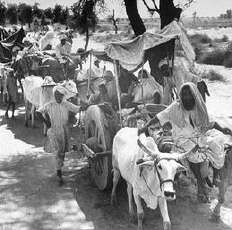

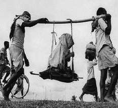

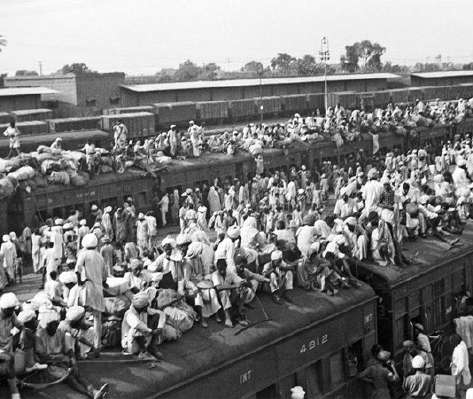

### பிரிவினையை அடுத்து அகதிகளின் வருகை

### பாடச்சுருக்கம்

- காந்தியடிகள் தென்னாப்பிரிக்காவில் உண்மை, அகிம்சை, சத்தியாகிரகம் ஆகியவற்றுடன் மேற்கொண்ட சோதனைகள் மற்றும் அவர் ஒரு மக்கள் தலைவராக உருவெடுத்தது விவரிக்கப்பட்டுள்ளது.

- ஒத்துழையாமை, சட்டமறுப்பு, வெள்ளையனே வெளியேறு ஆகிய இயக்கங்களுக்கான அவரது அழைப்பும் இந்த இயக்கங்கள் 1919ஆம் ஆண்டின் இந்திய அரசுச் சட்டம், 1935ஆம் ஆண்டின் இந்திய அரசுச் சட்டம், 1947ஆம் ஆண்டின் விடுதலைச் சட்டம் ஆகியவற்றுக்கு வழிவகுத்தது குறித்து விவரிக்கப்பட்டுள்ளது.

- பொதுவுடைமைத் தலைவர்கள் மற்றும் பகத்சிங், சுபாஷ் சந்திரபோஸ் போன்ற புரட்சிகரத் தலைவர்கள் ஆகியோரின் பங்கு, அவர்களின் செயல்பாடுகளால் ஏற்பட்ட விளைவுகள் ஆகியன விவரிக்கப்பட்டுள்ளன.

- இந்து மகா சபை மற்றும் முஸ்லீம் லீக் ஆகியவை அரசியல் காரணங்களுக்காக மத்தைப் பயன்படுத்தியதும் பிரிவினைக்கு வழிவகுத்ததும் விவரிக்கப்பட்டுள்ளன.

### கலைச்சொற்கள்

| அறப்போர், சத்தியாகிரகம் | satyagraha | passive political resistance advocated by Mahatma Gandhi |
|---|---|---|
| அரசியல் சட்ட விதிகளைப் பின்பற்றுபவர் | constitutionalist | adherent of constitutional methods |
| சாதி, கொள்கை போன்றவற்றின் அடிப்படையில் வேறுபாடு காட்டுகிற | discrimination | unjust or differential treatment of different categories of people, especially on grounds of caste, creed, etc |
| வற்புறுத்து, நற்செயலுக்கேவு | exhort | strongly encourage or urge to do something |
| வகுப்புவாதம் | communalism | allegiance to one’s own ethnic, religious or caste group rather than to wider society |
| தன்னாட்சியுரிமையுடைய குடியேற்ற நாடு | dominion | self-governing territory |
| வாக்காளர் தொகுதி | electorate | all the people in a country or area who are entitled to vote in an election |
| கடைசி அறிவிப்பு, இறுதி எச்சரிக்கை | ultimatum | a final demand or statement of terms |
| தனிமைப்படுதல் | alienation | Isolation |
| கூட்டுச்சதி செய்தல், சதித்திட்டம் | conspiracy | a secret plan by a group to do something unlawful or harmful |

### பயிற்சி

**I சரியான விடையைத் தெரிவு செய்யவும்.**

1. அமிர்தசரஸில் ரௌலட் சட்ட எதிர்ப்புப் போராட்டங்களின் போது கைது செய்யப்பட்டவர் யார்?

அ) மோதிலால் நேரு ஆ) டாக்டர். சைஃபுதீன் கிச்லு இ) முகம்மது அலி ஈ) ராஜ் குமார் சுக்லா 2. இந்திய தேசிய காங்கிரசின் எந்த அமர்வில் ஒத்துழையாமை இயக்கத்துக்கு அனுமதி வழங்கப்பட்டது?

அ) பம்பாய் ஆ) மதராஸ் இ) கல்கத்தா ஈ) லக்னோ 3. விடுதலை நாளாக கீழ்க்காண்பவற்றில் எந்த நாள் அறிவிக்கப்பட்டது?

அ) 1930 ஜனவரி 26 ஆ) 1929 டிசம்பர் 26 இ) 1946 ஜூன் 16 ஈ) 1947 ஜனவரி 15

4. முதலாவது வனங்கள் சட்டம் எந்த ஆண்டில் இயற்றப்பட்டது?

அ) 1858 ஆ) 1911 இ) 1865 ஈ) 1936 5. 1933 ஜனவரி 8 எந்த நாளாக அனுசரிக்கப்பட்டது?

அ) கோவில் நுழைவு நாள் ஆ) மீட்பு நாள் (டெலிவரன்ஸ் டே) இ) நேரடி நடவடிக்கை நாள் ஈ) சுதந்திரப் பெருநாள் 6. மாகாண தன்னாட்சியை அறிமுகம் செய்த சட்டம் எது?

அ) 1858ஆம் ஆண்டு சட்டம் ஆ) இந்திய கவுன்சில் சட்டம், 1909 இ) இந்திய அரசுச் சட்டம், 1919 ஈ) இந்திய அரசுச் சட்டம், 1935

**II கோடிட்ட இடங்களை நிரப்புக.**

1. காந்தியடிகளின் அரசியல் குரு ____________ ஆவார்.

2. கிலாபத் இயக்கத்துக்கு ____________ தலைமை ஏற்றார்.

3. 1919ஆம் ஆண்டின் இந்திய அரசுச் சட்டம் மாகாணங்களில் ____________ அறிமுகம் செய்தது.

4. வடமேற்கு எல்லை மாகாணத்தில் சட்டமறுப்பு இயக்கத்தை தலைமையேற்று நடத்தியவர் ____________

5. சிறுபான்மையினர் மற்றும் ஒடுக்கப்பட்ட வகுப்பினருக்கு தனித் தொகுதிகளை வழங்கும் ____________ ஐ ராம்சே மெக்டொனால்டு அறிவித்தார்.

6. ____________ என்பவர் வெள்ளையனேவெளியேறு இயக்கத்தின்போது காங்கிரஸ் வானொலியை திரைமறைவாக செயல்படுத்தினார்.

**III சரியான கூற்றைத் தெரிவு செய்யவும்.**

1. i) இந்திய பொதுவுடைமை கட்சி 1920ஆம் ஆண்டு தாஷ்கண்டில் தொடங்கப்பட்டது.

(ii) M. சிங்காரவேலர் கான்பூர் சதித்திட்ட வழக்கில் விசாரணைக்கு உட்படுத்தப்பட்டார்.

(iii) ஜெயப்பிரகாஷ் நாராயண், ஆச்சார்ய நரேந்திர தேவ், மினு மசானி ஆகியோர் தலைமையில் காங்கிரஸ் பொதுவுடைமை கட்சி உருவானது.

(iv) வெள்ளையனே      வெளியேறு போராட்டத்தில் பொதுவுடைமைவாதிகள் பங்கேற்கவில்லை.

அ) (i) மற்றும் (ii) சரியானது ஆ) (ii) மற்றும் (iii) சரியானது இ) (iv) சரியானது ஈ) (i) (ii) மற்றும் (iii) சரியானது

2. கூற்று: காங்கிரஸ் முதலாவது வட்டமேசை மாநாட்டில் கலந்துகொண்டது.

காரணம்: காங்கிரஸ் இரண்டாவது வட்ட மேசை மாநாட்டில் கலந்துகொள்ள காந்தி- இர்வின் ஒப்பந்தம் வழிவகை செய்தது.

அ) கூற்று மற்றும் காரணம் இரண்டும் சரியானது. ஆனால் காரணம் கூற்றுக்கான சரியான விளக்கம் இல்லை.

ஆ) கூற்று சரியானது ஆனால் காரணம் தவறானது இ) கூற்று தவறானது ஆனால் காரணம் சரியானது.

ஈ) கூற்று மற்றும் காரணம் இரண்டும் சரியானது மற்றும் காரணம் கூற்றுக்கான சரியான விளக்கம் ஆகும்.

3. கூற்று: காங்கிரஸ் அமைச்சரவைகள் 1939ஆம் ஆண்டு பதவி விலகின.

காரணம்: காங்கிரஸ் அமைச்சரவைகளை ஆலோசிக்காமல் இந்தியாவின் காலனி ஆதிக்க அரசு போரில் பங்கேற்றது.

அ) கூற்று மற்றும் காரணம் இரண்டும் சரியானது. ஆனால், காரணம் கூற்றுக்கான சரியான விளக்கம் இல்லை.

ஆ) கூற்று சரியானது. ஆனால், காரணம் தவறானது.

இ) கூற்று மற்றும் காரணம் இரண்டுமே தவறானது.

ஈ) கூற்று மற்றும் காரணம் இரண்டும் சரியானது, மற்றும் காரணம் கூற்றுக்கான சரியான விளக்கம் ஆகும்.

**IV பொருத்துக.**

1. ரௌலட் சட்டம் - பட்டங்களைத் திரும்ப ஒப்படைத்தல்

2. ஒத்துழையாமை இயக்கம் - இரட்டை ஆட்சி

3. 1919ஆம் ஆண்டின் இந்திய அரசு சட்டம் - M.N. ராய்

4. இந்திய பொதுவுடைமை கட்சி - நேரடி நடவடிக்கை நாள்

5. 16 ஆகஸ்ட் 1946 - கருப்புச் சட்டம்

**V சுருக்கமாக விடையளிக்கவும்.**

1. ஜாலியன்வாலா பாக் படுகொலை பற்றி விவரிக்கவும்.

2. கிலாபத் இயக்கம் பற்றிக் குறிப்பு வரைக.

3. ஒத்துழையாமை இயக்கத்தை ஏன் காந்தியடிகள் திரும்பப்பெற்றார்?

4. சைமன் குழு புறக்கணிக்கப்பட்டது ஏன்?

5. முழுமையான சுயராஜ்ஜியம் என்றால் என்ன?

6. பகத் சிங் பற்றி குறிப்பு வரைக.

7. பூனா ஒப்பந்த்தின் கூறுகள் யாவை?

**VI விரிவாக விடையளிக்கவும்.**

1. காந்தியடிகளை ஒரு மக்கள் தலைவராக உருமாற்றம் செய்ய உதவிய காரணிகள் என்ன என்று ஆராயவும்.

2. காந்திய இயக்கத்தின் ஒரு சிறந்த உதாரணமான சட்டமறுப்பு இயக்கம் குறித்து விரிவாக ஆராயவும்.

3. இந்தியாவின் பிரிவினைக்குப் பின்னால் இருந்த காரணங்களை விவாதிக்கவும்.

**VII செயல்பாடுகள்**

1. இந்திய வரைபடத்தில் காந்திய இயக்கத்துடன் தொடர்புடைய முக்கிய இடங்களைக் குறிப்பிடுமாறும் அங்கு என்ன நடந்தது என்று ஓரிரு வாக்கியங்கள் எழுதுமாறும் மாணவர்களைக் கேட்டுக் கொள்ளலாம்.

2. மாணவர்கள் குழுக்களாகப் பிரிக்கப்பட்டு காந்தியடிகள், ஜின்னா, B.R. அம்பேத்கர், புரட்சிகர தேசியவாத தலைவர்கள், பொதுவுடைமைவாத தலைவர்கள் ஆகியோரின் கருத்துகள் பற்றி விவாதம் நடத்துமாறு கேட்டுக்கொள்ளலாம்.

## இணையச் செயல்பாடு

படி – 1 URL அல்லது QR குறியீட்டினைப் பயன்படுத்தி இச்செயல்பாட்டிற்கான இணையப்பக்கத்திற்கு செல்க படி – 2 ‘Chronology/Time line’ என்பதை கிளிக் செய்து ‘Family tree of

Mahatma Gandhi’ என்பதை தேர்ந்தெடுக்கவும் படி – 3 இடது புற மெனுவில் உள்ள Glimpses of Gandhi’ கிளிக் செய்யவும்.

உரலி: https://www.mkgandhi.org/main.htm

### மேற்கோள் நூல்கள்

1. Bipan Chandra, History of Modern India, Orient BlackSwan, 2016.

2. Bipan Chandra, Amales Tripathi and Barun De, Freedom Struggle, NBT,1993.

3. Bipan Chandra, et al., India’s Struggle for Independence, Penguin Books, 1989.

4. Sumit Sarkar, Modern India, 1885–1947, Pearson, 2014.

5. Sekhar Bandyopadhyay, From Plassey to Partition, Orient BlackSwan, 2013.

6. B.R. Nanda, Mahatma Gandhi: A Biography, Oxford University Press, 1958.

### மேலும் வாசிக்கத்தக்க நூல்கள்

1. பா.மாணிக்கவேலு, இந்திய தேசிய இயக்கத்தின் வரலாறு, தமிழ்நாடு பாடநூல் மற்றும் கல்வியியல் பணிகள் கழகம், சென்னை (ஆவணப் பதிப்பு: ஆகஸ்ட் - 2017).

2. R.C. மஜும்தார், H.C. ராய்சௌத்ரி, K. த்தா, இந்தியாவின் சிறப்பு வரலாறு (மூன்றாம் பகுதி), தமிழாக்கம்: A. பாண்டுரங்கன், தமிழ்நாடு பாடநூல் மற்றும் கல்வியியல் பணிகள் கழகம், சென்னை (ஆவணப் பதிப்பு: ஆகஸ்ட் - 2017).

