# புவியியல் அலகு 6: தமிழ்நாடு - இயற்கைப் பிரிவுகள்

## கற்றலின் நோக்கங்கள்

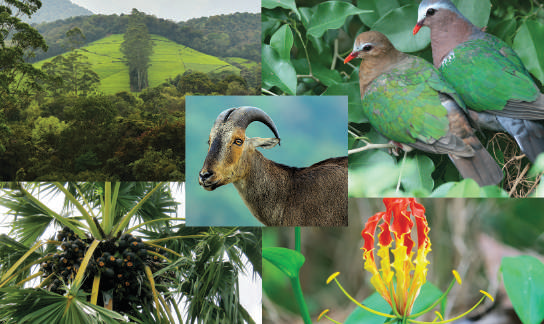

- நமது மாநிலத்தின் உருவாக்கம் பற்றிய வரலாற்றைத் தெரிந்துகொள்ளல்

- தமிழ்நாட்டின் இயற்கைப் பிரிவுகள் பற்றி கற்றிதல்

- தமிழ்நாட்டின் காலநிலை, மண் வகைகள் மற்றும் இயற்கைத் தாவரங்களின் தன்மைகளைப் புரிந்துகொள்ளல்

- மாணவர்கள் தாங்கள் வசிக்கும் இடத்தில் சுற்றுச்சூழல் மற்றும் புவியியல் கூறுகள்

### பற்றி அறிந்துகொள்ளல்

- தமிழ்நாட்டில் நிகழும் பேரிடர்கள் மற்றும் அவற்றின் தாக்கங்கள் குறித்து விழிப்புணர்வு பெறுதல்

## அறிமுகம்

புவியில் சிறந்த குடிமகனாக விளங்குவதற்கான முதல் படி, தான் வசிக்கும் பகுதியைப் பற்றி கற்றிவதேயாகும். நாம் உள்ளூர் சூழலைப் பற்றி கற்பதன் நோக்கம், நம்முடைய சுற்றுச்சூழலில் வாழ்க்கை முறையைப் புரிந்து கொள்வதாகும். முதல் 5 பாடங்களில் நம் நாட்டின் பல்வேறு புவியியல் தன்மைகளைப் பற்றி கற்றிந்தோம். இப்பாடத்திலும் பின்வரும் பாடத்திலும் தமிழ்நாட்டின் புவியியலைப் பற்றி அறிந்து கொள்ளலாம். தமிழ்மொழி பிறப்பியல், மாநில உருவாக்க வரலாறு, அமைவிடம், பரப்பளவு, இயற்கைப் பிரிவுகள், ஆறுகள், காலநிலை, மண் வகைகள் மற்றும் இயற்கை தாவரங்கள் பற்றி இப்பாடத்தில் காண்போம்.

இதன் நேர்த்தியான நில அமைப்பு மற்றும் காலநிலை நம் மாநிலத்தை இந்தியாவில் தனித்துவம் கொண்டதாக உருவாக்கியுள்ளது. இது வெப்ப மண்டல கடற்கரைகள், நீர்வீழ்ச்சிகள்,

1956ஆம் ஆண்டு மாநில மறுசீரமைப்புச் சட்டத்தின் படி, மொழியியல் அடிப்படையில் மாநிலங்களின் எல்லைகள் மறுசீரமைப்பு செய்யப்பட்டுள்ளன.

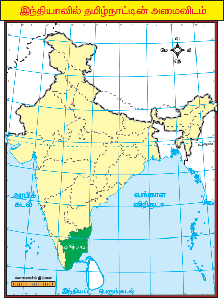

இந்தியாவில் மொழி அடிப்படையில் தோற்றுவிக்கப்பட்ட முதல் மாநிலம் எது?

தமிழ்நாட்டின் தலைநகரத்தின் பெயர் மாற்றம் செய்யப்பட்டது ஏன் ?

மலைகள், காடுகள், பல்வகை தாவரங்கள் மற்றும் விலங்கினங்களைக் கொண்டது.

## 6.1 அமைவிடம் மற்றும் பரப்பளவு

இந்தியாவின் 28 மாநிலங்களில் தமிழ்நாடும் ஒன்று. இது இந்தியாவின் தென்பகுதியில் அமைந்துள்ளது. இதன் நிலப்பரப்பு 8°4´ வட அட்சம் முதல் 13°35´ வட அட்சம் வரையிலும், 76°18´ கிழக்கு தீர்க்கம் முதல் 80°20´ கிழக்கு தீர்க்கம் வரையிலும் பரவியுள்ளது.

தமிழ்நாட்டின் கடைக்கோடிப் பகுதிகளாகிழக்கில் கோடியக்கரையும்மேற்கில் ஆனைமலையும்வடக்கில் பழவேற்காடு ஏரியும்தெற்கில் குமரிமுனையும் அமைந்துள்ளன.

தமிழ்நாட்டின் பரப்பளவு 1,30,058 சதுர கிலோமீட்டர்களாகும். இது இந்தியாவின் பதினோராவது பெரிய மாநிலமாகும். இந்தியப் பரப்பில் சுமார் 4 சதவிகித்தினைக் கொண்டுள்ளது.

### எல்லைகளும் அதன் அண்டை மாநிலங்களும்

கிழக்கே வங்காள விரிகுடாவும், மேற்கே கேரளாவும், வடக்கே ஆந்திரப் பிரதேசமும், வடமேற்கே கர்நாடகாவும், தெற்கே இந்தியப் பெருங்கடலும் தமிழ்நாட்டின் எல்லைகளாக அமைந்துள்ளன. மன்னார் வளைகுடா மற்றும் பாக் நீர்ச்சந்தி தமிழ்நாட்டையும் இந்தியாவின் தென்கிழக்கில் உள்ள இலங்கையையும் பிரிக்கின்றன. குஜராத் மற்றும் ஆந்திரப் பிரதேசத்திற்கு அடுத்தபடியாக தமிழ்நாடு 906.9 கிலோ மீட்டர் நீளமுடன் இந்தியாவின் மூன்றாவது நீளமான கடற்கரையைக் கொண்டுள்ளது.

### அரசியல் பிரிவுகள்

தமிழ்நாடு உருவான காலகட்டத்தில் 13 மாவட்டங்கள் மட்டுமே இருந்தன என்பதை முன்பே அறிந்தோம். அதன்பிறகு நிருவாக வசதிக்காக மாநிலம் பல முறை மறுசீரமைப்பு செய்யப்பட்டது.

### செயல்பாடுகள்

- நில வரைபட உதவியுடன் தமிழகக் கடலோர மாவட்டங்களைக் கண்டறிக.

- ஆந்திரப்பிரதேசம், கர்நாடகம் மற்றும் கேரளா மாநிலங்களுடன் எல்லைகளைப் பகிர்ந்து கொள்ளும் தமிழக மாவட்டங்களைத் தனித்தனியே பட்டியலிடுக.

- தமிழ் நாட்டில் உள்ள மாவட்டங்களை குறிப்பிடுக.

கண்டுபிடித்து எழுதுக:

| நிர்வாக பிரிவுகள் | எண்ணிக்கை |
|---|---|
| மாவட்டங்கள் |  |
| வருவாய்க் கோட்டங்கள் |  |
| வட்டங்கள் |  |
| பிர்காக்கள் |  |
| வருவாய் கிராமங்கள் |  |
| மாநகராட்சிகள் |  |
| நகராட்சிகள் |  |
| ஊராட்சி ஒன்றியங்கள் |  |
| பேரூராட்சிகள் |  |
| கிராம ஊராட்சிகள் |  |
| மக்களவைத் தொகுதிகள் |  |
| சட்டமன்றத் தொகுதிகள் |  |

## இயற்கை அமைப்பு

தமிழ்நாட்டின் முக்கிய இயற்கை அமைப்புகளையும் அவற்றின் சிறப்பு அம்சங்களையும் இப்பாடத்தில் காணலாம்.

தீபகற்ப பீடபூமி எனப்படும் தக்காண பீடபூமியில் தமிழ்நாடு அமைந்துள்ளது. இப்பகுதி கிரெட்டேசியஸ் காலத்தில் 135 மில்லியன் ஆண்டுகளுக்கு முன்பு பிரிந்து சென்ற கோண்ட்வானா நிலப்பகுதியிலிருந்து உருவான ஒரு பகுதியாகும். தமிழ்நாடானது நிலத்தோற்றத்தின் அடிப்படையில் மேற்குத் தொடர்ச்சி மலை, கிழக்குத் தொடர்ச்சி மலை, பீடபூமிகள், கடற்கரைச் சமவெளிகள் மற்றும் உள்நாட்டு சமவெளிகள் என ஐந்து பெரும் பிரிவுகளாகப் பிரிக்கப்படுகிறது.

## 6.2 மேற்குத் தொடர்ச்சி மலை

மேற்குத் தொடர்ச்சி மலை வடக்கே நீலகிரி முதல் தெற்கே கன்னியாகுமரி மாவட்ட சுவாமிதோப்பில் உள்ள மருந்துவாழ்மலை வரை நீண்டுள்ளது. இம்மலைத்தொடரின் உயரம் 2,000 மீட்டர் முதல் 3,000 மீட்டர் வரை வேறுபட்டுள்ளது. இது 2,500 சதுர கிலோ மீட்டர் பரப்பளவை உடையது. இம்மலைத்தொடர் தொடர்ச்சியாக இருந்தாலும் சில கணவாய்கள் காணப்படுகின்றன.

சென்னை, நீலகிரி மற்றும் கன்னியாகுமரி மாவட்டங்களைத் தவிர மற்ற மாவட்டங்கள் பல்வேறு காலகட்டங்களில் பிரித்தமைக்கப்பட்டன.

உமது பள்ளி எந்த அட்ச மற்றும் தீர்க்கரேகைக்கு இடையே அமைந்துள்ளது ?

பாலக்காட்டு கணவாய், செங்கோட்டைக் கணவாய், ஆரல்வாய்மொழி கணவாய் மற்றும் அச்சன்கோவில் கணவாய் ஆகியன இத்தொடரின் முக்கிய கணவாய்களாகும். நீலகிரி, ஆனைமலை, பழனிமலை, ஏலக்காய் மலை, வருசநாடு, ஆண்டிப்பட்டி, பொதிகை மலைகள் மற்றும் மகேந்திரகிரி மலை ஆகியன மேற்குத் தொடர்ச்சி மலையில் அமைந்துள்ள முக்கிய மலைகளாகும்.

### நீலகிரி மலை

நீலகிரி மலை தமிழ்நாட்டின் வடமேற்குப் பகுதியில் அமைந்துள்ளது. இம்மலையில் 2,000 மீட்டருக்கு மேல் உயரம் கொண்ட 24 சிகரங்கள் காணப்படுகின்றன. இம்மலையின் உயரமான சிகரம் தொட்டபெட்டா (2,637 மீட்டர்) ஆகும். முக்குருத்தி 2,554 மீட்டர் உயரம் கொண்ட மற்றுமொறு சிகரமாகும். ஊட்டி, குன்னூர் ஆகியவை இம்மலையில் அமைந்துள்ள முக்கிய மலை வாழிடங்களாகும். 2,700 க்கும் அதிகமான பூக்கும் தாவர வகைகள் மற்றும் மாநில விலங்கான நீலகிரி வரையாடு இங்கு காணப்படுகின்றன.

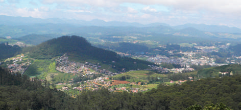

### தொட்டபெட்டாஆனைமலை

ஆனைமலை தமிழ்நாடு மற்றும் கேரள மாநிலங்களின் எல்லைப்பகுதியில் பாலக்காட்டு கணவாய்க்கு தெற்கே அமைந்துள்ளது. ஆனைமலை புலிகள் காப்பகம், ஆழியாறு பாதுகாக்கப்பட்ட காடுகள், வால்பாறை மலைவாழிடம், காடம்பாறை நீர்மின் நிலையம் போன்றவை இம்மலைப்பகுதியில் அமைந்துள்ளன. ஆழியாறு மற்றும் திருமூர்த்தி அணைகள் இம்மலையின் அடிவாரத்தில் கட்டப்பட்டுள்ளன .

### பழனி மலை

பழனி மலை, மேற்குத் தொடர்ச்சி மலையின் கிழக்குப் பகுதியாகும். மற்றவை திண்டுக்கல் மாவட்டத்தில் அமைந்துள்ளன. பழனி மலையின் மிக உயரமான சிகரம் வந்தராவ் (2,533 மீ) ஆகும். வேம்படிசோலை (2,505 மீ) இதன் இரண்டாவது உயர்ந்த சிகரமாகும். மலைவாழிடமான கொடைக்கானல் (2,150 மீ) பழனிமலையின் தென் மத்தியப் பகுதியில் அமைந்துள்ளது.

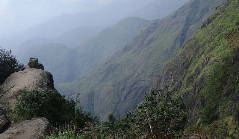

### பழனி மலைஏலக்காய் மலை

தமிழ்நாட்டின் தென்மேற்குப் பகுதியில் அமைந்துள்ள இம்மலைகள் ஏலமலைக் குன்றுகள் எனவும் அழைக்கப்படுகின்றன. இங்கு அதிகமான ஏலக்காய் பயிரிடப்படுவதால் இப்பெயர் பெற்றது. மிளகு மற்றும் காபி ஆகியன இம்மலைப்பகுதியில் பயிரிடப்படும் முக்கிய பயிர்களாகும். இவை வடமேற்கில் ஆனைமலையோடும் வடகிழக்கில் பழனி மலையோடும், தென்கிழக்கில் ஆண்டிப்பட்டி மற்றும் வருச நாடு குன்றுகளோடும் இணைகின்றன.

| மேற்குத் தொடர்ச்சி மலையிலுள்ள சிகரங்கள் | உயரம் (மீட்டரில்) |
|---|---|
| தொட்டபெட்டா | 2,637 |
| முக்குருத்தி | 2,554 |
| வந்தராவ் | 2,533 |
| பெருமாள் மலை | 2,234 |
| கோட்டை மலை | 2,019 |
| பகாசுரா | 1,918 |

### ருசநாடு மற்றும் ஆண்டிப்பட்டி மலைக்குன்றுகள்

மேற்குத் தொடர்ச்சி மலையின் கிழக்கு நோக்கிய நீட்சி வருசநாடு மற்றும் ஆண்டிப்பட்டி குன்றுகள் ஆகும். மேகமலை, கழுகுமலை, குரங்கனி மலை, சுருளி மற்றும் கும்பக்கரை அருவிகள் ஆகியவை இம்மலைகளில் காணப்படுகின்றன. இம்மலையின் தெற்கு சரிவுகளில் ஸ்ரீவில்லிபுத்தூர் ”சாம்பல்நிற அணில்கள் சரணாலயம்” விருதுநகர் மாவட்டத்தில் அமைந்துள்ளது. வைகை மற்றும் அதன் துணை ஆறுகள் இப்பகுதியில் உருவாகின்றன.

### பொதிகை மலை

இம்மலையின் பெரும்பகுதி தென்காசி மாவட்டத்திலும் இதன் தென்சரிவு கன்னியாகுமரி மாவட்டத்திலும் அமைந்துள்ளன. சிவஜோதி பர்வத், அகத்தியர் மலைகள் மற்றும் தெற்கு கைலாயம் என பல்வேறு பெயர்களில் இவை அழைக்கப்படுகின்றன.

இம் மலை மேற்குத் தொடர்ச்சி மலையின் உயிரினப்பன்மை செறிந்த ஒன்றாகத் திகழ்கிறது. இப்பகுதி வளமான பசுமை மாறாக் காடுகள், அருவிகள் மற்றும் பழமையான கோயில்கள் ஆகியவற்றிற்கு புகழ்பெற்றதாகும். களக்காடு- முண்டந்துறை 'புலிகள் காப்பகம்' இப்பகுதியில் அமைந்துள்ளது.

### மகேந்திரகிரி மலைக்குன்றுகள்

இம் மலைத்தொடர் கன்னியாகுமரி மற்றும் திருநெல்வேலி மாவட்டங்களின் எல்லைப் பகுதிகளாகவும் மேற்குத் தொடர்ச்சி மலையின் தென்பகுதியாகவும் அமைந்துள்ளது. இதன் சராசரி உயரம் 1,645 மீ ஆகும்.

## 6.3 கிழக்குத் தொடர்ச்சி மலை

மேற்குத் தொடர்ச்சி மலையைப் போலன்றி கிழக்குத் தொடர்ச்சி மலையானது ஒருதொடர்ச்சியற்ற குன்றுகளாகும். இம்மலையானது பல இடங்களில் வங்காள விரிகுடாக் கடலில் கலக்கும் ஆறுகளால் பிரிக்கப்பட்டுள்ளது. இம்மலையின் உயரம் 1,100 மீட்டர் முதல் 1,600 மீட்டர் வரை மாறுபடுகிறது. இக்குன்றுகள் பீடபூமியை சமவெளியிலிருந்து பிரிக்கின்றன. ஜவ்வாது, சேர்வராயன், கல்வராயன், கொல்லி மலை மற்றும் பச்சை மலை ஆகியவை தமிழ்நாட்டிலுள்ள கிழக்குத் தொடர்ச்சி மலையின் முக்கிய குன்றுகளாகும். இவைகள் மாநிலத்தின் வட மாவட்டங்களில் அமைந்துள்ளனஜவ்வாது மலை கிழக்குத் தொடர்ச்சி மலையின்  நீட்சியான இம்மலைகள் திருவண்ணாமலை மற்றும் வேலூர் மாவட்டங்களில் பரவியுள்ளன. இம்மலை இவ்விரண்டு மாவட்டங்களையும் பிரிக்கிறது. சுமார் 1,100 முதல் 1,150 மீட்டர் உயரம் கொண்ட பல்வேறு சிகரங்கள் இம்மலைத்தொடரில் அமைந்துள்ளன. இம்மலையின் மிக உயரமான சிகரம் மேல்பட்டு ஆகும். ஜவ்வாது மலையின் பல பகுதிகள் நீல நிற சாம்பல் கிரானைட் பாறைகளால் உருவானது. பல்வேறு பழ மரங்கள், மருத்துவ மூலிகைகள் மற்றும் சந்தன மரங்கள் போன்றவற்றிற்கு இப்பகுதி பெயர் பெற்றது. சட்டவிரோத மரம் வெட்டுதலால் தற்பொழுது இப்பகுதியின் சந்தன மரங்கள் அழிந்துவிட்டன.

### கல்வராயன் மலை

”கல்வராயன்” என்ற சொல் தற்போதுள்ள பழங்குடியினரின் பண்டைய கால பெயரான என்ற சொல்லிலிருந்து பெறப்பட்டது. தமிழ்நாட்டிலுள்ள கிழக்குத் தொடர்ச்சி மலைகளில் ஒரு முக்கிய மலை கல்வராயன்  மலையாகும். இம்மலை ஜவ்வாது மற்றும் சேர்வராயன் மலைகளுடன் இணைந்து காவிரி மற்றும் பாலாறு ஆகியவற்றின் ஆற்று வடிநிலப் பகுதியைப் பிரிக்கிறது. இம்மலைத் தொடரின் உயரம் 600 மீ முதல் 1,220 மீ வரை காணப்படுகிறது. 6.3.3 சேர்வராயன் மலை

1,200 முதல் 1,620 மீட்டர் வரையிலான உயரம் கொண்ட சேர்வராயன் மலைத் தொடர் சேலம் நகருக்கு அருகே அமைந்துள்ளது. இம்மலைத்தொடரின் பெயரானது உள்ளூர் தெய்வமான ’சேர்வராயன்’ என்ற பெயரில் இருந்து வந்தாகும். இவற்றில் அமைந்துள்ள 1,620 மீட்டர் உயரம் கொண்ட 'சோலைக்கரடு' என்பது கிழக்குத் தொடர்ச்சி மலையின் தென் பகுதியில் அமைந்துள்ள உயரமான சிகரமாகும். 'ஏழைகளின் ஊட்டி' என்று அழைக்கப்படும் ஏற்காடு மலைவாழிடம் இம்மலைத் தொடரில் அமைந்துள்ளது.

| கிழக்கு தொடர்ச்சி மலையிலுள்ள சிகரங்கள் | உயரம் (மீட்டரில்) |
|---|---|
| சோலைக்கரடு | 1,620 |
| பழமலை | 1,500 |
| உருகமலை | 1,486 |
| குட்டிராயன் | 1,395 |
| முகனூர் | 1,279 |
| வலசமலை | 1,034 |

மலைகளின் உயரம் கடல் மட்டத்திலிருந்து அளக்கப்படுவது ஏன்? ஏன் நிலப்பகுதியில் இருந்து அளவிடப்படவில்லை?

### கொல்லி மலை

கொல்லி மலை நாமக்கல் மாவட்டத்தில் அமைந்துள்ள ஒரு சிறிய மலைத்தொடராகும். இது சுமார் 2,800 சதுர கிலோமீட்டர் பரப்பளவைக் கொண்டது. 1,300 மீட்டர் வரை உயரம் கொண்ட இம்மலைத் தொடரானது, தென்னிந்தியாவின் கிழக்குக் கடற்கரைக்கு இணையாகச் செல்கிறது. அரப்பளீஸ்வரர் கோவில் இந்த மலைத்தொடரில் அமைந்துள்ள முக்கியமான புனித் தலமாகும். கிழக்குத் தொடர்ச்சி மலைகளின் பிற பகுதிகளை ஒப்பிடுகையில் இங்கு பசுமைமாறாக் காடுகள் அல்லது சோலைக் காடுகள் அதிகம் காணப்படுகின்றன. பல காபித் தோட்டங்கள், பழங்கள், பூக்கள் மற்றும் சவுக்குப் பண்ணைகள் இம்மலைப் பகுதியில் காணப்படுகின்றன.

### பச்சை மலை

திருச்சிராப்பள்ளி, பெரம்பலூர் மற்றும் சேலம் மாவட்டங்களில் உயரம் குறைந்த குன்றுத் தொடராக இது காணப்படுகின்றது. தமிழ் மொழியில் ’பச்சை’ என்பது பசுமையைக் குறிக்கிறது. இம்மலைகளில் காணப்படும் தாவரங்கள் மற்ற பகுதியை விட பசுமையாகக் காணப்படுவதால் இது பச்சைமலை என அழைக்கப்படுகிறது. இம்மலைகளில் பலாப்பழம் ஒரு குறிப்பிடத்தக்க வேளாண் பருவ விளைபொருளாக உள்ளது.

### தமிழ்நாட்டில் அமைந்துள்ள முக்கிய மலைகள்

| மாவட்டங்கள் | மலைகள் |
|---|---|
| கோயம்புத்தூர் | மருதமலை, வெள்ளியங்கிரி மற்றும் ஆனைமலை |
| ருமபுரி | தீர்த்த மலை, சித்தேரி மற்றும் வத்தல்மலை |
| திண்டுக்கல் | பழனிமலை |
| ஈரோடு | சென்னிமலை மற்றும் சிவன்மலை |
| திருப்பத்துர் | ஏலகிரிமலை |
| தென்காசி | பொதிகைமலை |
| வேலூர் | ஜவ்வாது, மற்றும் இரத்தினமலை |
| நாமக்கல் | கொல்லிமலை |
| சேலம் | சேர்வராயன்மலை, கஞ்சமலை மற்றும் சுண்ணாம்புக் குன்றுகள் |
| கள்ளக்குறிச்சி | கல்வராயன்மலை |
| விழுப்புரம் | செஞ்சிமலை |
| பெரம்பலூர் | பச்சைமலை |
| கன்னியாகுமரி | மருதுவாழ்மலை |
| திருநெல்வேலி | மகேந்திரகிரிமலை |
| நீலகிரி | நீலகிரிமலை |

## 6.4 பீடபூமிகள்

தமிழ்நாட்டிலுள்ள பீடபூமி மேற்கு தொடர்ச்சி மலைகள் மற்றும் கிழக்கு தொடர்ச்சி மலைகளுக்கு இடையே அமைந்துள்ளது. ஏறக்குறைய முக்கோண வடிவத்தில் சுமார் 60,000 சதுர கிலோமீட்டர் பரப்பளவைக் கொண்டுள்ளது.

தமிழ்நாட்டின் வடமேற்குப் பகுதியில் அமைந்திருக்கும் பாரமஹால் பீடபூமியானது மைசூர் பீடபூமியின் ஒரு பகுதியாகும். இதன் உயரம் சுமார் 350 மீட்டர் முதல் 710 மீட்டர் வரை காணப்படுகிறது. இந்தப் பீடபூமியில்  தருமபுரி மற்றும் கிருஷ்ணகிரி மாவட்டங்கள் அமைந்துள்ளன.

கோயம்புத்தூர் பீடபூமியானது நீலகிரி மற்றும் தருமபுரி மாவட்டங்களுக்கு இடையே அமைந்துள்ளது. இதன் உயரம் 150 மீட்டர் முதல் 450 மீட்டர் வரை மாறுபடுகிறது. இப்பீடபூமி சேலம், கோயம்புத்தூர் மற்றும் ஈரோடு மாவட்டங்களை உள்ளடக்கியுள்ளது. மோயர் ஆறு இப்பீடபூமியை மைசூர் பீடபூமியில் இருந்து பிரிக்கிறது.

மேற்குத் தொடர்ச்சி மலையில் உற்பத்தியாகும் பவானி, நொய்யல் மற்றும் அமராவதி ஆறுகள் இப்பீடபூமியில் பள்ளத்தாக்குகளை உருவாக்கி உள்ளன. நீலகிரி பகுதிகளில் பல மலையிடை பீடபூமிகள் காணப்படுகின்றன. சிகூர் பீடபூமி அவற்றில் குறிப்பிடத்தக்க ஒன்றாகும்.

மதுரை பீடபூமி, மதுரை மாவட்டத்தில் காணப்படுகிறது. இது மேற்குத் தொடர்ச்சி மலையின் அடிவாரம் வரை நீண்டுள்ளது.  வைகை மற்றும் தாமிரபரணி வடிநிலப் பகுதிகள் இப்பகுதியில் அமைந்துள்ளன.

## 6.5 சமவெளிகள்

தமிழ்நாட்டில் காணப்படும் சமவெளிகளை இரு பிரிவுகளாகப் பிரிக்கலாம். அவை:

1. உள்நாட்டு சமவெளிகள்

2. கடற்கரைச் சமவெளிகள் பாலாறு, பெண்ணையாறு, காவிரி மற்றும் தாமிரபரணி ஆகிய ஆறுகள் உள்நாட்டு சமவெளிகளை உருவாக்கியுள்ளது. காவிரியாற்றுச் சமவெளி தமிழ்நாட்டிலுள்ள வளமான சமவெளிகளுள் ஒன்றாகும். காவிரி சமவெளியானது சேலம், ஈரோடு, கரூர், திருச்சிராப்பள்ளி, புதுக்கோட்டை, தஞ்சாவூர், திருவாரூர் மற்றும் நாகப்பட்டினம் ஆகிய மாவட்டங்களில் பரவியுள்ளது.

தமிழ்நாட்டின் கடற்கரைச் சமவெளியானது கோரமண்டல் அல்லது சோழமண்டல சமவெளி (சோழர்கள் நிலம்) எனவும் அழைக்கப்படுகிறது. இச்சமவெளி சென்னை முதல் கன்னியாகுமரி வரை நீண்டுள்ளது. இச்சமவெளி கிழக்கு நோக்கிப் பாய்ந்து வங்காள விரிகுடாவில் கலக்கும் ஆறுகளால் உருவாக்கப்பட்டுள்ளது. சில இடங்களில் இவை 80 கிலோ மீட்டருக்கும் அதிகமான அகலத்துடன் காணப்படுகிறது.

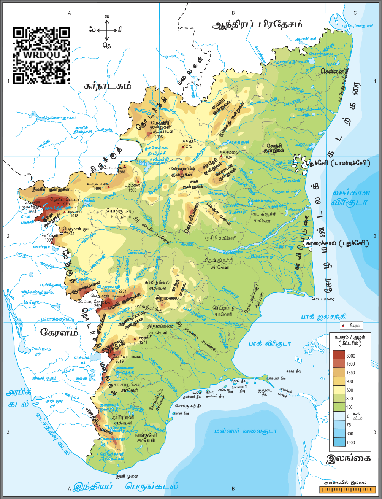

இது ஒரு உயரமான கடற்கரை என்றாலும் சில பகுதிகள் கடலில் மூழ்கி உள்ளன. இராமநாதபுரம் மற்றும் தூத்துக்குடி மாவட்டங்களில் கடற்கரையோரங்களில் உருவாக்கப்பட்ட மணற் குன்றுகள் என்று அழைக்கப்படுகிறது. கிழக்குக் கடற்கரைச் சமவெளிப் பகுதியில் உள்ள மன்னார்வளைகுடாவில் பவளப்பாறைகள் காணப்படுகின்றன.

### கடற்கரைகள்

வங்காள விரிகுடாக் கடலையொட்டிய சோழமண்டலக் கடற்கரை பல அழகான மற்றும் சிறப்புவாய்ந்த கடற்கரைகளைக் கொண்டுள்ளது. தமிழ்நாட்டில் தங்க மணல் கடற்கரை பகுதியில் பனை மரங்களும், சவுக்குத் தோப்புகளும் பரவலாகக் காணப்படுகின்றன. சென்னையின் மெரினா மற்றும் எலியட் கடற்கரைகளும் கோவளம் (காஞ்சிபுரம்) மற்றும் வெள்ளி கடற்கரை (கடலூர்) ஆகியவை புகழ்பெற்ற தமிழக கடற்கரைகளாகும்.

## 6.6 வடிகாலமைப்பு

ஆறுகள் தமிழ்நாட்டின் உயிர்நாடிகளாகும். தமிழ்நாட்டில் பல ஆறுகள் காணப்பட்டாலும் காவிரி, பாலாறு, பெண்ணை, வைகை மற்றும் தாமிரபரணி போன்ற ஆறுகள் குறிப்பிடத்தக்கவை ஆகும். தமிழ்நாட்டின் பெரும்பாலான ஆறுகள் மேற்குத் தொடர்ச்சி மலையில் உற்பத்தியாகி கிழக்கு நோக்கி பாய்ந்து வங்காள விரிகுடாவில் கலக்கின்றன. தாமிரபரணி ஆற்றைத் தவிர மற்ற ஆறுகள் அனைத்தும் வற்றும் ஆறுகளாகும். தாமிரபரணி தென்மேற்கு மற்றும் வடகிழக்கு ஆகிய இரு பருவமழை காலங்களிலும் மழைபெறுவதால் வற்றாத ஆறாக உள்ளது.

### காவிரி

காவிரி ஆறு கர்நாடகா மாநிலத்தில் கூர்க் மாவட்டத்திலுள்ள மேற்குத் தொடர்ச்சி மலையில் பிரம்மகிரி குன்றுகளில் தலைக்காவிரி என்னும் இடத்தில் உற்பத்தியாகி 800 கிலோ மீட்டர் நீளத்திற்கு பாய்கிறது. இதில் சுமார் 416 கிலோ மீட்டர் நீளத்திற்கு தமிழ்நாட்டில் பாய்கிறது. இது கர்நாடகா மற்றும் தமிழ்நாடு ஆகியவற்றிற்கு இடையே சுமார் 64 கிலோ மீட்டர் தூரத்திற்கு எல்லையாக உள்ளது. தருமபுரி மாவட்டத்தில் ஒகேனக்கல் என்னும் இடத்தில் நீர்வீழ்ச்சியை உருவாக்குகிறது. ஸ்டான்லி நீர்த்தேக்கம் என்று அழைக்கப்படும் மேட்டூர் அணை சேலம் மாவட்டத்தில் இவ்வாற்றின் குறுக்கே கட்டப்பட்டுள்ளது. மேட்டூர் நீர்த்தேக்கத்தில் இருந்து சுமார் 45 கிலோமீட்டர் தொலைவில் பவானி ஆறு இதன் துணையாறாக வலதுகரையில் காவிரியுடன் இணைகிறது. பின்னர் கிழக்கு நோக்கிப் பாய்ந்து தமிழ்நாட்டின் சமவெளிப்பகுதிக்குள் நுழைகிறது. கரூரில் இருந்து 10 கி.மீ தொலைவிலுள்ள திருமுக்கூடல் என்னும் இடத்தில் வலதுகரையில் மேலும் இரண்டு துணை ஆறுகளான அமராவதி மற்றும் நொய்யல்  ஆறுகள் இணைகின்றன. இப்பகுதியில் ஆற்றின் அகலம் அதிகமாக இருப்பதால், இது ”அகன்ற காவிரி’ என அழைக்கப்படுகிறது.

திருச்சிராப்பள்ளி மாவட்டத்தில் இந்த ஆறு இரண்டு கிளைகளாகப் பிரிகிறது. வடகிளை கொலேருன் அல்லது கொள்ளிடம் என்றும் தென்கிளை காவிரியாகவும் தொடர்கிறது. இவ்விடத்திலிருந்து காவிரி டெல்டா சமவெளி தொடங்குகிறது. சுமார் 16 கிலோ மீட்டர் தொலைவிற்கு பாய்ந்த பின் மீண்டும் இவ்விரு கிளைகள் இணைந்து ’ஸ்ரீரங்கம் தீவை ’ உருவாக்குகின்றன. ‘கிராண்ட் அணைகட்’ என்றழைக்கப்படும் கல்லணை காவிரியாற்றின் குறுக்கே கட்டப்பட்டுள்ளது. இந்த ஆறு கல்லணையைக் கடந்த பின் பல கிளைகளாகப் பிரிந்து டெல்டா பகுதி முழுவதற்கும் ஒரு வலைப்பின்னல் அமைப்பை உருவாக்கி உள்ளது. காவிரி டெல்டா பகுதிகளில் கிளை ஆறுகளால் உண்டாகியுள்ள இவ்வலைப்பின்னல் அமைப்பு ’தென்னிந்தியாவின் தோட்டம்’ என்று அழைக்கப்படுகிறது.

பாம்பன், முயல் தீவு, குருசடை, நல்லதண்ணி தீவு, புள்ளி வாசல், ஸ்ரீரங்கம், உப்புதண்ணித் தீவு, தீவுத்திடல், காட்டுப்பள்ளித் தீவு, குவிப்பில் தீவு மற்றும் விவேகானந்தர் நினைவுப் பாறை ஆகியன தமிழ்நாட்டில் உள்ள முக்கிய தீவுகள் ஆகும்.

### பாலாறு

பாலாறு கர்நாடகாவின் கோலார் மாவட்டத்தில் தலகவரா கிராமத்திற்கு அப்பால் உற்பத்தி ஆகிறது. இது சுமார் 17,871 சதுர கிலோமீட்டர் பரப்பளவில் பாய்கிறது. இதில் 57% தமிழகத்திலும் மீதிமுள்ள பகுதிகள் கர்நாடகா மற்றும் ஆந்திரப் பிரதேசத்திலும் உள்ளன.

பொன்னி, கவுண்டினியா நதி, மலட்டாறு, செய்யாறு மற்றும் கிளியாறு ஆகியன பாலாற்றின் துணை ஆறுகளாகும். இவ்வாற்றின் மொத்த நீளம் 348 கிலோமீட்டர் ஆகும். இதில் 222 கி.மீ. தொலைவு தமிழ்நாட்டில் பாய்கிறது. இது வேலூர் மற்றும் காஞ்சிபுரம் மாவட்டங்கள் வழியாகப் பாய்ந்து, கூவத்தூருக்கு அருகே வங்காள விரிகுடாவில் கலக்கிறது.

### தென்பெண்ணையாறு / தென்பொருணையாறு

இது கிழக்கு கர்நாடகாவின் நந்தி துர்கா மலைகளின் கிழக்கு சரிவுகளிலிருந்து உருவாகிறது. இதன் வடிநிலப்பரப்பு சுமார் 16,019 சதுர கிலோ மீட்டர் ஆகும். இதில் 77% தமிழ்நாட்டில் உள்ளது. கிருஷ்ணகிரி, தருமபுரி, வேலூர், திருவண்ணாமலை, கடலூர் மற்றும் விழுப்புரம் ஆகிய மாவட்டங்கள் வழியாக தென்கிழக்கு திசையில் சுமார் 247 கிலோ மீட்டர் நீளத்திற்கு இந்நதி பாய்கிறது. கெடிலம் மற்றும் பெண்ணையாறு என இரண்டு கிளைகளாக திருக்கோவிலூர் அணைக்கட்டிற்கு அருகில் பிரிகிறது.

கெடிலம் ஆறு கடலூருக்கு அருகிலும் பெண்ணையாறு புதுச்சேரி யூனியன் பிரதேசத்திற்கு அருகிலும் வங்கக் கடலில் கலக்கின்றன. சின்னாறு, மார்க்கண்ட நதி, வாணியாறு மற்றும் பாம்பா ஆறு ஆகியன முக்கிய துணை ஆறுகளாகும். இந்த ஆறு உற்பத்தியாகும் இடங்களில் கனமழை காரணமாக திடீர், குறுகியகால வெள்ளப்பெருக்கினை ஏற்படுத்துகிறது. இது தமிழ்நாட்டின் முக்கிய நீர்ப்பாசன ஆதாரமாக உள்ளது. ஆற்றின் குறுக்கே கிருஷ்ணகிரி மற்றும் சாத்தனூர் நீர்த்தேக்கங்கள் உருவாக்கப்பட்டுள்ளன.

### வைகை

வைகையாறு தமிழ்நாட்டின் மேற்குத் தொடர்ச்சி மலையிலுள்ள வருச நாட்டு குன்றுகளின் கிழக்குச் சரிவில் உற்பத்தியாகிறது. இதன் வடிநிலம் சுமார் 7,741ச.கி.மீ பரப்பளவைக் கொண்டது.

இப்பரப்பளவு முழுவதும்  தமிழ்நாட்டில் அமைந்துள்ளது. இது மதுரை, சிவகங்கை மற்றும் இராமநாதபுரம் ஆகிய மாவட்டங்களின் வழியாகப் பாய்கிறது. இதன் மொத்த நீளம் சுமார் 258 கிலோ மீட்டராகும். இவ்வாற்றின் நீரானது இராமநாதபுரத்தின் பெரிய ஏரி மற்றும் பல சிறிய ஏரிகளில் நிரப்பப்பட்டு பின் ஏரிகளிலிருந்து வெளியேறும் உபரி நீரானது இராமநாதபுரம் அருகில் உள்ள பாக் நீர்ச்சந்தியில் கலக்கிறது.

### தாமிரபரணி

தாமிரபரணி எனும் பெயர் தாமிரம் (காப்பர்) மற்றும் வருணி (சிற்றோடைகள்) என்பதிலிருந்து பெறப்பட்டது. இவ்வாறுகளில் கரைந்திருக்கும் செம்மண் துகள்கள் காரணமாக இந்நதியின் நீரானது செந்நிறத் தோற்றத்துடன் காணப்படுகிறது.

தாமிரபரணி, அம்பாசமுத்திரம் வட்டம் பாபநாசத்திலுள்ள மேற்குத் தொடர்ச்சி மலையின் பொதிகை மலை முகடுகளில் தோன்றுகிறது. திருநெல்வேலி மற்றும் தூத்துக்குடி மாவட்டங்களின் வழியே பாய்ந்து இறுதியில் தூத்துக்குடி மாவட்டத்தில் உள்ள புன்னைக்காயலுக்கு அருகே வங்கக்கடலில் கலக்கிறது. காரையாறு, சேர்வலாறு, மணிமுத்தாறு, கடனா நதி, பச்சையாறு, சிற்றாறு மற்றும் இராமநதி ஆகியன இதன் முக்கிய துணை ஆறுகளாகும். இது தென்னிந்தியாவின் ஒரே வற்றாத நதியாகும்.

### தமிழ்நாட்டின் முக்கிய அருவிகள்

| மாவட்டங்கள் | அருவிகள் |
|---|---|
| ருமபுரி | ஒகேனக்கல் |
| திருநெல்வேலி | கல்யாண தீர்த்தம் |
| தென்காசி | குற்றாலம் |
| தேனி | கும்பக்கரை மற்றும் சுருளி |
| நாமக்கல் | ஆகாய கங்கை |
| நீலகிரி | கேத்தரின், பைக்காரா |
| சேலம் | கிள்ளியூர் |
| விருதுநகர் | ஐயனார் |
| கோயம்புத்தூர் | வைதேகி, செங்குபதி, சிறுவாணி மற்றும் கோவைக் குற்றாலம் |
| திருப்பூர் | திருமூர்த்தி |
| மதுரை | குட்லாடம்பட்டி |
| கன்னியாகுமரி | திற்பரப்பு, காளிகேசம், உலக்கை மற்றும் வட்டப்பாறை |

## 6.7 காலநிலை

கடகரேகை இந்தியாவை இரு சமபாகங்களாகப் பிரிப்பதையும், தமிழ்நாடு கடகரேகைக்கு தெற்கேயும் பூமத்தியரேகைக்கு அருகாமையிலும் அமைந்துள்ளது என்பதையும் ஏற்கனவே கற்றுள்ளோம். சூரியனின் செங்குத்து கதிர்களினால் வெப்பநிலையானது ஆண்டு முழுவதும் அதிக அளவில் காணப்படுகிறது. தமிழ்நாடு வெப்பமண்டல காலநிலை மண்டலத்தில் அமைந்திருந்தாலும் கிழக்குக் கடற்கரைப்பகுதி வெப்பமண்டல கடல் காலநிலையைப் பெறுகிறது. இந்தியப் பெருங்கடல் மற்றும் வங்கக்கடல் இரண்டும் கடற்கரையோரப் பகுதிகளில் காலநிலையில் தாக்கத்தினை ஏற்படுத்துகின்றன.

கிழக்குக் கடற்கரைப் பகுதியில் வெப்பமண்டலக் கடல் ஆதிக்க காலநிலையும் அதேவேளையில் மாநிலத்தின் மேற்குப் பகுதியில் மலைப்பாங்கான காலநிலையும் நிலவுகிறது. ஆனால், தமிழகத்தின் மத்திய பகுதிகள் குறைந்த உயரமும் கடலிலிருந்து விலகியும் இருப்பதால் அதிக வெப்பநிலை மற்றும் வறண்ட காலநிலை நிலவுகிறது. சூரியனின் செங்குத்துக் கதிர்களின் இடப்பெயர்வால் தமிழகத்தில் பல்வேறு பருவகாலங்கள் உருவாகின்றன. அவை:

| தமிழ்நாட்டின் பருவகாலங்கள் |  |
|---|---|
| பருவகாலம் | காலம் |
| குளிர்காலம் | ஜனவரி – பிப்ரவரி |
| கோடைக் காலம் | மார்ச் – மே |
| தென்மேற்கு பருவக்காற்று காலம் | ஜூன் – செப்டம்பர் |
| வடகிழக்கு பருவக்காற்று காலம் | அக்டோபர் – டிசம்பர் |

### குளிர்காலம்

ஜனவரி மற்றும் பிப்ரவரி மாதங்களில் சூரியனின் கதிர்கள்  பூமத்திய ரேகைக்கும் மகர ரேகைக்கும் இடையே செங்குத்தாக விழுகிறது. இக்காலத்தில் தமிழ்நாடு உள்பட இந்தியா முழுவதும் சாய்வான சூரியக்கதிர்களைப் பெறுகின்றன. ஆதலால் இம்மாதங்களில் காலநிலை சற்று குளிராகக் காணப்படுகிறது. தமிழகத்தில் குளிர்கால வெப்பநிலையானது முதல் வரை மாறுபடுகிறது. இருந்தபோதிலும் மலைவாழிடங்களில் குளிர்கால வெப்பநிலையானது சில நேரங்களில் 5°C க்கும் குறைவாக உள்ளது. நீலகிரியில் சில பள்ளத்தாக்குகளில் வெப்பம் 0°C ஆகவும் பதிவாகிறது.

இக்குறைந்த வெப்பநிலை அடர் மூடுபனி மற்றும் மூடுபனி உருவாகக் காரணமாகிறது. இப்பருவத்தில் வறண்ட வானிலையே நிலவுகிறதுகோடைக்காலம் சூரியனின் வடக்கு நோக்கிய நகர்வு மார்ச், ஏப்ரல் மற்றும் மே மாதங்களில் நிகழ்வதால் சூரியனின் செங்குத்தாக கதிரானது தென்னிந்தியாவில் விழுகிறது. ஆகையால் பூமத்திய ரேகையிலிருந்து வெப்பநிலையானது படிப்படியாக அதிகரிக்கிறது. தமிழகம், கடகரேகைக்கு தென்பகுதியில் அமைந்திருப்பதால் அதிக வெப்பநிலையைப் பெறுகின்றது. பொதுவாக வெப்பநிலையானது லிருந்து வரை வேறுபடுகிறது. இப்பருவத்தில் குறிப்பாக மே மாத்தில் தமிழகத்தின் தென்பகுதி முன் பருவமழை (மாஞ்சாரல்) மூலமும், வெப்பச்சலனம் மூலமும் மழையைப் பெறுகிறது.

### தென்மேற்குப் பருவக்காற்றுக் காலம்

மார்ச் முதல் மே மாதம் வரை சூரியனின் கதிர்கள் செங்குத்தாக விழுவதால் வட இந்திய நிலப்பரப்பு அதிக வெப்பத்தைப் பெறுகிறது. இதனால் வட இந்திய பகுதிகளில் குறைந்த அழுத்தம் உருவாகுகிறது.

இச்சமயத்தில் காற்றானது அதிக காற்றழுத்தம் உள்ள இந்தியப் பெருங்கடலிலிருந்து வடக்கு நோக்கி வீசுகிறது. இது தென்மேற்கு பருவக்காற்று உருவாக காரணமாகிறது. இப்பருவத்தில்  அரபிக் கடலிலிருந்து வீசும் தென்மேற்கு பருவக்காற்றின் மழைமறைவுப் பிரதேசத்தில் தமிழ்நாடு அமைந்துள்ளதால் மிகக் குறைவான மழைப்பொழிவையேப் பெறுகிறது .

இப்பருவத்தின் மழைப் பதிவு மேற்கிலிருந்து கிழக்கு நோக்கி குறைகிறது. கோயம்புத்தூர் பீடபூமி சராசரியாக 50 செ.மீ மழையைப் பெறுகிறது. எனினும், கன்னியாகுமரி, திருநெல்வேலி, தென்காசி மற்றும் நீலகிரி மாவட்டங்கள் 50 முதல் 100 செ.மீ வரை மழை பெறுகின்றன. மாநிலத்தின் கிழக்குப் பகுதிகள் மிகக் குறைவான மழைஅளவைப் பெறுகின்றன.  டகிழக்குப் பருவக்காற்றுக் காலம்வடகிழக்குப் பருவக்காற்று அக்டோபர் முதல் டிசம்பர் மாத்தின் முதல் பாதி வரை நீடிக்கிறது. மத்திய ஆசியா மற்றும் வட இந்தியப் பகுதிகளில் உருவாகும் அதிக அழுத்தம், வடகிழக்குப் பருவக்காற்று உருவாக காரணமாகிறது. இப்பருவத்தில் சூரியன் கடகரேகையிலிருந்து மகர ரேகைக்குச் செல்வதால் வெப்பநிலை மற்றும் காற்றழுத்தில் பெரும் மாற்றத்தை ஏற்படுத்துகிறது. இதனால் வட இந்தியாவிலிருந்து வங்கக் கடலை நோக்கி காற்று வீசுகிறது. இக்காற்று கொரியாலிஸ் விசை காரணமாக (பூமியின் சுழற்சியால் ஏற்படும் விசை) திசை விலக்கப்பட்டு வடகிழக்கு திசையிலிருந்து வீசுகிறது. ஆகையால் இக்காற்று வடகிழக்கு பருவக் காற்று என்று அழைக்கப்படுகிறது. வடகிழக்கு பருவக் காற்றானது திரும்பிவரும் தென் மேற்கு பருவக் காற்றின் ஒரு பகுதியாதலால் இக்காற்றைப் 'பின்னடையும் பருவக்காற்று' என்றும் அழைப்பர். இப்பருவம் தமிழ்நாட்டின் மழைக்காலமாகும். தமிழ்நாட்டின் ஆண்டுசராசரி மழையளவில் 48% இப்பருவத்தில் கிடைக்கிறது. இப்பருவத்தில் கடற்கரை மாவட்டங்கள் 60 சதவீதமும் உள்மாவட்டங்கள் 40 முதல் 50 சதவீதம் வரை ஆண்டுசராசரி மழை பெறுகின்றன.

பொதுவாக இப்பருவத்தில் வெப்ப மண்டல சூறாவளிகள் உருவாகின்றன. வங்கக் கடலில் உருவாகின்ற சூறாவளிகள் தமிழ்நாட்டின் கிழக்குக் கடற்கரைப் பகுதிகளில் மிக கனத்த மழையைத் தோற்றுவிக்கின்றன. தமிழ்நாட்டின் 50 சதவிகித மழை வெப்ப மண்டல சூறாவளி மூலம் கிடைக்கிறது இப்பருவத்தில் கிழக்குக் கடற்கரைப் பகுதிகள் 100 முதல் 200 செ.மீ. வரை மழையைப் பெறுகின்றன. மத்திய மற்றும் வடமேற்கு தமிழகம் 50 முதல் 100 செ.மீ வரை மழையைப் பெறுகின்றன. இச்சூறாவளி காற்றுகள் சில நேரங்களில் பயிர்கள், உயிர் மற்றும் உடமைகளுக்கு பெருத்த சேத்தை ஏற்படுத்துகின்றன.

வால்பாறைக்கு அருகிலுள்ள சின்னக்கல்லார் தமிழ்நாட்டின் மிக அதிக மழை பெறும் பகுதியாகும், இது இந்தியாவின் மூன்றாவது அதிக மழை பெறும் பகுதியாகவும் உள்ளது.

## 6.8 தமிழ்நாட்டின் மண் வகைகள்

தமிழ்நாட்டில்  காணப்படும்  மண்வகைகளை அவற்றின்  தன்மைகளைக்  கொண்டு  ஐந்து பிரிவுகளாக வகைப்படுத்தலாம். அவை 1. வண்டல் மண் 2. கரிசல் மண் 3. செம்மண் 4. சரளை மண் மற்றும் 5. உவர் மண்.

### ண்டல் மண்

வண்டல் மண் ஆறுகளால் படிய வைக்கப்படும் நுண் படிவுகளால் உருவாகின்றன.

தமிழ்நாட்டின் ஆற்றுப் பள்ளத்தாக்குகள் மற்றும் கடற்கரையோரப் பகுதிகளில் இம்மண் காணப்படுகிறது. தஞ்சாவூர், திருவாரூர், மயிலாடுதுறை, நாகப்பட்டினம், விழுப்புரம், கள்ளக்குறிச்சி, கடலூர், திருநெல்வேலி, தென்காசி மற்றும் கன்னியாகுமரி மாவட்டங்களில் இவ்வகை மண் அதிகம் காணப்படுகிறது. சில உள் மாவட்டங்களின் ஆற்றுப் பள்ளத்தாக்குப் பகுதிகளில் சிறிய அளவில் இவை காணப்படுகிறது.

### கரிசல் மண்

தீப்பாறைகள் சிதைவடைவதன் மூலம் கரிசல் மண் உருவாகிறது. இது ரீகர் மண் (Regur soil) என்றும் அழைக்கப்படுகிறது. இம்மண்ணில் பருத்தி நன்கு வளர்வதால் பருத்தி மண் என்றும் அழைக்கப்படுகிறது. கோயம்புத்தூர், மதுரை, விருதுநகர், திருநெல்வேலி, தென்காசி மற்றும் தூத்துக்குடி மாவட்டங்களில் கரிசல் மண் பெருமளவில் காணப்படுகிறது.

### செம்மண்

தமிழ்நாட்டின் மொத்த நிலப் பரப்பளவில் சுமார் மூன்றில் இரண்டு பங்கு செம்மண் பரவியுள்ளது. இவை குறிப்பாக மாநிலத்தின் மத்திய மாவட்டங்களில் காணப்படுகின்றன. இம்மண் சிவகங்கை மற்றும் இராமநாதபுரம் மாவட்டங்களில் அதிகம் காணப்படுகின்றது.

### சரளை மண்

சரளை மண்ணானது அதில் கரைந்துள்ள சத்துக்கள் நீரினால் அடித்து செல்லப்படுவதால் உருவாகிறது. இவை ஒரு வளமற்ற மண்ணாகும். காஞ்சிபுரம், செங்கல்பட்டு, திருவள்ளூர் மற்றும் தஞ்சாவூர் மாவட்டங்களின் சில பகுதிகளிலும், நீலகிரி மலையின் சில பகுதிகளிலும் இம்மண் காணப்படுகின்றது.

### உவர் மண்

தமிழ்நாட்டின் சோழமண்டலக் கடற்கரை பகுதிகளில் மட்டுமே இம்மண்  காணப்படுகிறது. வேதாரண்யப் பகுதியில் குறிப்பிடத்தக்க அளவில் உவர் மண் காணப்படுகிறது. டிசம்பர் 26, 2004 இல் ஏற்பட்ட சுனாமி அலைகள் அதிக அளவு மணல் படிவுகளை தமிழ்நாட்டின் கடற்கரைப் பகுதிகளில் படிய வைத்துள்ளன. இதனால் கடற்கரையில் சிலபகுதிகள் பயிரிட உகந்தாக இல்லை.

## 6.9 மண் அரிப்பு

மண் ஒரு புதுப்பிக்க இயலாத வளமாகும். மண் அரிப்பு ஒரு முறை ஏற்படின் அவற்றை புதுப்பிப்பது எளிதான செயல் அல்ல . காடுகள் அழிப்பு, அதிக மேய்ப்பு, நகரமயமாக்கம், அதிக மழைப்பொழிவு ஆகியன மண் அரிப்பின் முக்கிய காரணங்களாகும். மண் அரிப்பு மண்வளத்தை குறைத்து, விளைச்சலைக் குறைக்கிறது. எனவே மண்வளத்தை பாதுகாக்க அதிகக் கவனம் செலுத்துவது அவசியமாகும்.

## 6.10 இயற்கைத் தாவரங்கள்

இயற்கைத் தாவரம் என்பது புவியில் இயற்கையாக வளரும் தாவரங்களின் தொகுப்பாகும். நிலத்தோற்றம், மண்ணின் தன்மை, வெப்பநிலை மற்றும் மழைப்பொழிவு ஆகியவை இயற்கைத் தாவரங்களின் பரவலை கட்டுப்படுத்தும் முக்கிய காரணிகளாகும்.

1988 தேசிய வனக்கொள்கையின்படி, புவிப்பரப்பில் குறைந்தபட்சம் மூன்றில் ஒரு பகுதி காடுகளால் சூழப்பட்டு இருக்க வேண்டும். தமிழ்நாட்டில் மொத்த காடுகளின் பரப்பளவு இவற்றைவிட மிக குறைவாகும். 2021ஆம் ஆண்டு மாநில வன அறிக்கையின்படி, தமிழ்நாட்டில் உள்ள காடுகளின் பரப்பளவு 26.419 ச.கி. மீட்டர்களாகும். இது மொத்த பரப்பளவில் 20.31 சதவீதமாகும். இந்தியாவில் உள்ள காடுகளில் தமிழகத்தின் பங்களிப்பு 2.99 சதவீதமாகும். ஈரப்பத பசுமைமாறா காடுகளிலிருந்து புதர் காடுகள் வரை தமிழ்நாட்டின் காடுகள் வேறுபடுகின்றன.

### காடுகளின் வகைகள்

தமிழ்நாட்டில் உள்ள காடுகள் கீழ்க்காணுமாறு ஐந்து வகைகளாகப் பிரிக்கப்பட்டுள்ளன .

### வெப்பமண்டல பசுமைமாறாக் காடுகள்

இவ்வகைக்காடுகள் அதிக மழைபெறும் பகுதிகளில் காணப்படுகின்றன. இவை அடர்ந்த மற்றும் மரக்கிளை அடுக்குகள் கொண்டதாக காணப்படுகின்றன. திருநெல்வேலி, கன்னியாகுமரி, நீலகிரி மற்றும் கோயம்புத்தூர் மாவட்டங்களில் உள்ள மேற்கு தொடர்ச்சி மலையின் சரிவுகளில் இவை காணப்படுகிறது. இலவங்க மரம், மலபார், கருங்காலி மரம், பனாசமரம், ஜாவாபிளம், ஜமுன், பலா மருது, அயனி, கிராப் மிர்ட்டல் போன்றவை இக்காடுகளில் காணப்படும் முக்கிய மர வகைகளாகும். அரை பசுமைமாறா வகைக் காடுகளானது உப அயனமண்டலக் காலநிலை நிலவும் கிழக்கு தொடர்ச்சி மலைப் பகுதிகளில் காணப்படுகிறது. சேர்வராயன் மலை, கொல்லி மலை, பச்சை மலை ஆகியன இவ்வகை காடுகள் காணப்படும் முக்கிய பகுதிகள் ஆகும். இந்திய மகோகனி, குரங்கு தேக்கு, உல்லி காசியா, பலா மற்றும் மா மரங்கள் ஆகியன இப்பகுதியில் காணப்படும் முக்கிய மரங்களாகும் .

### மித வெப்ப மண்டல மலைக்காடுகள்

இவ்வகைக் காடுகள் ஆனைமலை, நீலகிரி மற்றும் பழனி மலைகளில் சுமார் 1,000 மீட்டர் உயரமான பகுதிகளிலும் பள்ளத்தாக்குகளிலும் காணப்படுகின்றன. இவ்வகை காடுகள் சோலைக் காடுகள் (sholas) எனவும் அழைக்கப்படுகிறது. இவ்வகைக் காடுகளில் மரங்கள் பொதுவாக குறைந்த உயரத்துடன் பசுமையாகக் காணப்படுகின்றன. பொதுவாக நீலகிரி, சாம்பா, வெள்ளைலிட்சா, ரோஸ்ஆப்பிள் போன்ற மரங்கள் இக்காடுகளில் பரவலாகக் காணப்படுகின்றன.

### வெப்பமண்டல இலையுதிர்க்காடுகள்

இவ்வகைக்காடுகள் பசுமைமாறாக்காடுகள் மற்றும் அரைப் பசுமைமாறாக் காடுகளின் விளிம்புப்பகுதிகளில் காணப்படுகின்றன. இக்காடுகளில் உள்ள மரங்கள் கோடை பருவங்களில் தங்களது இலைகளை உதிர்த்து விடுகின்றன. இக்காடுகளில் உள்ள மரங்கள் 30 மீட்டர் உயரம் வரை வளரக்கூடியன. பருத்திப் பட்டு மரம், இலவம், கடம்பா, டாகத் தேக்கு, வாகை, வெக்காளி மரம் மற்றும் சிரஸ் போன்றவை இங்கு காணப்படும் முக்கிய மர வகைகளாகும். மூங்கில்களும், இக்காடுகளில் காணப்படுகிறது. இக்காடுகளில் காணப்படும் சில மரவகைகள் பொருளாதார முக்கியத்துவம் வாய்ந்தவையாகும்.

### மாங்குரோவ் காடுகள்

இவ்வகைக்காடுகள் கடலோரப்பகுதிகள், ஆற்றின் டெல்டா பகுதிகள், தீவுகளின் கடைப்பகுதிகள், மற்றும் ஆற்று முகத்துவாரங்களில் காணப்படுகின்றன. பொதுவாக இத்தாவரங்கள் பிச்சாவரம் சதுப்பு நிலக்காடு கடலூர் மாவட்டத்தில் சிதம்பரத்திற்கு அருகே அமைந்துள்ளது. இது 1,100 ஹெக்டேர் பரப்பளவுடன் (11 சதுர கிலோமீட்டர்) உலகின் இரண்டாவது மிகப் பெரிய சதுப்பு நிலக்காடாக உள்ளது. வங்கக் கடலிலிருந்து மணல் திட்டுகளால் இக்காடுகள் பிரிக்கப்பட்டுள்ளன. இது அவிசீனியா மற்றும் ரைசோபோரா போன்ற தாவர இனங்களைக் கொண்டது.

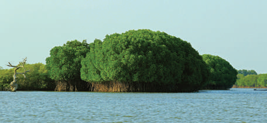

பசுமையானதாகவும் மிதமான உயரம் உடையதாகவும் தோல் போன்ற இலைகளுடனும் காணப்படுகின்றன. இவ்வகை தாவரங்கள் உவர் நிலங்கள் மற்றும் உவர் நீரில் வாழும் தன்மையுடையன. ஆசிய மாங்குரோவ், வெள்ளை மாங்குரோவ், காட்டுமல்லி இந்தியன் ப்ரிவெட் மரங்கள் போன்றவை இங்கு வளரும் குறிப்பிடத்தக்க மரங்களாகும். பிச்சாவரம், வேதாரண்யம், முத்துப்பேட்டை, சத்திரம் மற்றும் தூத்துக்குடி ஆகிய பகுதிகளில் குறிப்பிடத்தக்க அளவில் இக்காடுகள் அமைந்துள்ளன.

கடல் பாதுகாப்பு மேலாண்மையில், சதுப்புநிலத் தாவரங்களின் பங்கு: கடல் அலைகள் மற்றும் புயலால் ஏற்படும் பாதிப்பிலிருந்து கடற்கரைப் பகுதிகளைப் பாதுகாக்கின்றது. மேலும் பவளப்பாறைகளையும், கடலோர புல்வெளிகளையும் மணல் படிவுகளால் மூழ்கடிக்கப்படாமல் பாதுகாக்கின்றது.

### வெப்பமண்டல முட்புதர்க்காடுகள்

தமிழ்நாட்டில் மிகக்குறைவான மழை பெரும்பகுதிகளில் இவ்வகைக் காடுகள் காணப்படுகின்றன. இக்காடுகள் சமவெளியில் இருந்து 400 மீட்டர் உயரத்திற்கு மேல் உள்ள பகுதிகளில் காணப்படுகின்றன. பனை, வேம்பு, கருவேலம், வெள்ளைக்கருவேலம், சீமைக்கருவேலம் ஆகியவை இவற்றில் பொதுவாக காணப்படும் மரங்களாகும். இவற்றில் புதர்செடிகளும் அதிகமாக காணப்படும். தருமபுரி, இராமநாதபுரம், விருதுநகர் மற்றும் பிற மாவட்டங்களின் சில பகுதிகளில் இவ்வகைக் காடுகள் காணப்படுகின்றன.

| தமிழ்நாட்டில்  அதிகக்காடுகளைக் (பரப்பளவு) கொண்டுள்ள மாட்டங்கள் |  |
|---|---|
| மாவட்டம் | பரப்பளவு (சதுர கிலோமீட்டர்) |
| ஈரோடு | 2,295 |
| கோயம்புத்தூர் | 1,985 |
| திண்டுக்கல் | 1,877 |
| வேலூர் | 1,824 |
| நீலகிரி | 1,731 |
| ருமபுரி | 1,702 |

## 6.11 வன உயிரினங்கள்

காடுகளில் வாழும் விலங்குகள் மற்றும் பறவைகளை வனவிலங்குகள் என்கிறோம். பல்வேறு வகையான வன விலங்குகள், பறவைகள் மற்றும் ஊர்வன ஆகியன தமிழ்நாட்டில் உள்ளன. யானைகள், காட்டு எருமைகள், புலிகள், மான்கள் மற்றும் குரங்குகளுக்கு இக்காடுகள் ஒரு சிறந்த அடைக்கலமாக உள்ளன.

வனவிலங்குகளைப் பாதுகாக்க பல்வேறு வனவிலங்குகள் சரணாலயங்கள் மற்றும் தேசியப் பூங்காக்கள் மாநிலத்தில் அமைக்கப்பட்டுள்ளன.

| . எண் | தமிழ்நாட்டிலுள்ள உயிர்கக்கோகோளப் பெட்டகங்கள் |
|---|---|
| 1 | நீலகிரி உயிர்கக்கோளப் பெட்டகம் |
| 2 | மன்னார் வளைகுடா உயிர்கக்கோளப் பெட்டகம் |
| 3 | அகத்தியர் மலை உயிர்கக்கோளப் பெட்டகம் |

மாறுபட்ட காலநிலைகள், நில அமைப்புகள் மற்றும் பல்வேறு வளங்கள் ஆகியவற்றைக் கொண்ட மாநிலமாக தமிழ்நாடு திகழ்கிறது. இதனால் இந்தியாவில் தமிழ்நாடு தனித்துவம் பெற்ற மாநிலமாகத் திகழ்கிறது. இருக்கின்ற வளங்களை சிக்கனமாகப் பயன்படுத்தினால், இந்திய மாநிலங்களில் தமிழ்நாடு முதன்மையானதாகத் திகழும். எனவே, இவ்விலக்கை அடைய முயற்சி செய்வது ஒவ்வொரு குடிமகனின் கடமையாகும்.

## 6.12 இயற்கைப் பேரிடர்கள்

உயிர்களுக்கும் உடமைகளுக்கும் இயற்கையினால் ஏற்படும் பேரழிவுதான் பேரிடர் எனப்படுகிறது.

ஐக்கிய நாடுகள் சபையின் அபாய நேர்வு குறைப்பு அமைப்பின் (UNDRR), கூற்றுப்படி அபாயக் குறைப்பு (Disaster Risk Reduction) என்பது பேரிடருக்கான காரணங்களை முறையாக கண்டறிந்து பேரிடரின்போது அதன் தாக்கங்களைக் குறைப்பதாகும். இது இடர் உண்டாகும் இடங்களைத் தவிர்த்தல், மக்களின் உயிர் மற்றும் உடைமைகளின் பாதிப்பினைக் குறைப்பது, நில மேலாண்மை, சூழ்நிலை மேலாண்மை, எதிர் விளைவுகள் குறித் தயார்நிலை மற்றும் எச்சரிக்கை ஆகியவற்றை உள்ளடக்கியது.

தமிழ்நாட்டில் நிகழும் பல்வேறு பேரிடர்கள் பற்றியும், பேரிடரின் போது மற்றும் பேரிடருக்கு முன்னும் பின்னும் தேவையான நடவடிக்கைகள் பற்றி காண்போம்.

## தமிழ்நாடுவனவிலங்குகள் மற்றும் பறவைகள் சரணாலயங்கள்

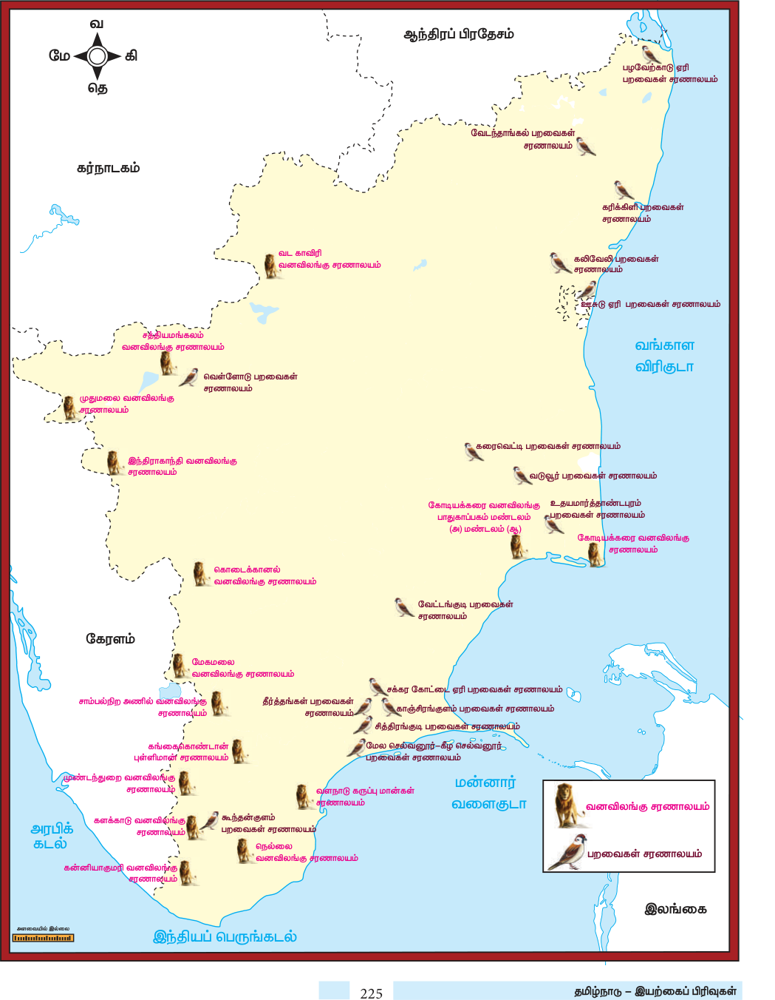

### நிலச்சரிவு

மலைகள் அல்லது குன்றுகளின் ஒரு பகுதியோ அல்லது பாறைகளோ சரிந்து வீழ்தல் நிலச்சரிவு எனப்படுகிறது. நீரானது, நிலச்சரிவுக்கு ஒரு முக்கிய காரணியாகும். தமிழ்நாட்டில் நீலகிரி மலைப்பகுதி நிலச்சரிவினால் அதிகம் பாதிக்கப்படும் பகுதியாகவும், பெரும் அச்சுறுத்தலுக்குள்ளாகும் பகுதியாகவும் கண்டறியப்பட்டுள்ளது. கோயம்புத்தூர் மற்றும் திண்டுக்கல் மாவட்டத்தில் உள்ள பழனி மலையில் அமைந்துள்ள கொடைக்கானல் நிலச்சரிவுக்கு உள்ளாகும் மற்ற பகுதிகளாகும்.

### அபாய நேர்வு குறைப்பு நடவடிக்கைகள்  நிலச்சரிவுக்கு முன்

விழிப்புணர்வு ஏற்படுத்துதல், எச்சரிக்கை மற்றும் தயார் நிலையில் இருத்தல், அன்றாட செய்திகளைக் கவனித்தல், வெளியேறுவதற்கான திட்டம், வழக்கத்திற்கு மாறான சிதைந்த பொருட்கள், உடைந்த மரங்கள் மற்றும் கூழாங்கற்களின் நகர்வுகளைக் கவனித்தல் ஆகியன முக்கிய செயல்பாடுகள் ஆகும். நிலச்சரிவு அறிகுறிகள் தென்பட்டால் அப்பகுதியை விட்டு பாதுகாப்பான இடங்களுக்குச் செல்லுதல் வேண்டும்.

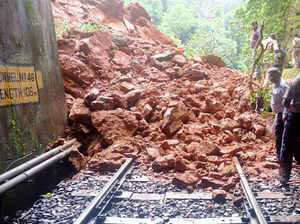

### நிலச்சரிவு

### நிலச்சரிவுக்குப் பின்

நிலச்சரிவு நிகழ்ந்த இடத்திற்கு அப்பால் இருத்தல் வேண்டும். உள்ளூர் வானொலி, தொலைக்காட்சி நிலையங்களில் அன்றைய செய்திகளைக் கேட்டல், நிலச்சரிவுக்கு பின் வெள்ளப்பெருக்கு ஏற்பட வாய்ப்பு இருப்பதால் வெள்ளம், கழிவுகளின் நகர்வு ஆகியவற்றைக் கவனித்தல், நேரடியாக நிலச்சரிவு பகுதியினுள் செல்லாமல் காயம்பட்ட மற்றும் சரிவில் சிக்கியவர்களை மீட்டல் ஆகியன நிலச்சரிவுக்குப் பின் கடைபிடிக்க வேண்டிய செயல்களாகும்.

### வெள்ளப்பெருக்கு

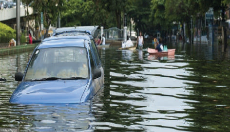

### வெள்ளப்பெருக்கு

தமிழ்நாட்டில் வடகிழக்கு பருவக்காற்றுக் காலங்களில் வெள்ளப்பெருக்கு என்பது பொதுவாக காணப்படும் ஒரு நிகழ்வாகும். 2015-ம் ஆண்டு நமது மாநிலம் வெள்ளப் பெருக்கால் பாதிக்கப்பட்டது. அபாய நேர்வு குறைப்பு நடவடிக்கைகள்வெள்ளப்பெருக்கிற்கு முன் சேவை மையங்கள் மற்றும் வெளியேறும் வழிகளைத் தெரிந்து வைத்திருத்தல், அவசரகால தொலைபேசி எண்களையும், செய்திகளையும் தெரிந்து வைத்திருத்தல், முக்கிய பொருட்களை மடித்தும் சுருட்டியும் உயரமான பகுதிகளில் வைத்தல். வெள்ளப்பெருக்கின் போது குழந்தைகள் மற்றும் வயதானவர்களை வேகமாகவும், பாதுகாப்பாகவும், வீடுகளிலிருந்து  உயரமான பகுதிகளுக்கு வெளியேற்றுவதை உறுதிசெய்தல், அனைத்து மின்சார சாதனங்கள் மற்றும் எரிவாயு சாதனங்களை அணைத்து வைத்தல், தாமதமின்றி வெளியேறுதல், நீரின் வழியாக வாகனங்களைச் செலுத்தாமலும், மின் கம்பிகள், மின் திறன் செலுத்தும் மின் வடக்கம்பிகள், வெள்ளம் ஆகியவற்றிலிருந்து தொலைவில் இருக்க வேண்டும். வெள்ளப்பெருக்கிற்குப் பின் மீண்டும் வீடுகளுக்குச் செல்வதை உறுதி செய்தல், வீட்டிற்குள் நுழையும் முன் அனைத்து மின்சார உபகரணங்களையும் அணைத்து, மீண்டும் அவற்றை உபயோகப்படுத்தும் முன் சரியாக உள்ளனவா? என உறுதி செய்ய வேண்டும். பழுதுபட்ட பொருட்களை அப்புறப்படுத்துவதற்கு முன் அதற்கேற்ற உடையினை அணிவது அவசியம் ஆகும்.

### புயல்கள்

வடகிழக்குப் பருவக்காற்று காலங்களில் வங்கக்கடலில் உருவாகும் வெப்பமண்டல சூறாவளிகள் தமிழ்நாட்டின் கடற்கரையைத் தாக்குகின்றன. வெள்ளப்பெருக்கு, உயிர் சேதம் மற்றும் பொருட்சேதம் ஆகியவை மாநிலத்தில் தொடர்ச்சியாக நடைபெறும் நிகழ்வாகும். புயல் தாக்கும் தீவிரத்தின் அடிப்படையில் தமிழ்நாடு மிக அதிக, அதிக, மிதமான, குறைந்த மற்றும் மிகக்குறைந்த என ஐந்து புயல் மண்டலங்களாகப் பிரிக்கப்பட்டுள்ளன.

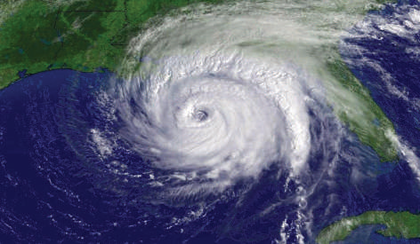

### புயல்

### அபாய நேர்வு குறைப்பு நடவடிக்கைகள்புயலுக்கு முன்

வதந்திகளை நம்பாமல் அமைதியாகவும் பதற்றமடையாமலும் இருத்தல், அலைபேசிகள் மின்னூட்டம் செய்யப்பட்டதை உறுதிசெய்து, குறுஞ்செய்திகளைப் பெறுதல், வானொலி மற்றும் காணொளிப் பெட்டிகள் மூலம் அவ்வப்போதைய வானிலை நிலைமைகளைக் கேட்டுத் தெரிந்து கொள்ளல், முக்கிய மற்றும் விலைமதிப்புள்ள பொருட்கள் மற்றும் ஆவணங்களை நீர் புகா கொள்கலன்களில் பாதுகாப்பாக வைத்திருத்தல், அத்தியாவசிய பொருட்கள் அடங்கிய அவசரகால மூட்டைத்தொகுப்பை (Luggage) தயார் நிலையில் வைத்திருத்தல், குடியிருப்பு பாதுகாப்பாக இருப்பதையும், சரி செய்வதையும் உறுதிசெய்தல், கூர்மையானப் பொருட்கள் வெளிப்பகுதிகளில் இல்லாமல், கால்நடைகள் செல்ல மற்றும் கால்நடை பாதுகாப்பிற்காக அவற்றை அவிழ்த்து விடுதல் வேண்டும். மீனவர்கள் கூடுதலான மின்சாதனங்களுடன் (Batteries) ஒரு வானொலிப்பெட்டியை வைத்திருத்தல் வேண்டும். இக்காலங்களில் கடலுக்குச் செல்வதை தவிர்த்து, படகுகளைப் பாதுகாப்பாக வைத்திருக்க வேண்டும்.

### புயலின்போது

வயதானவர்கள், குழந்தைகள் மற்றும் குடும்ப உறுப்பினர்கள் அனைவரும் வீட்டில் பாதுகாப்பாக இருக்க வேண்டிய ஏற்பாடுகளைச் செய்தல், அனைத்து மின் சாதனப் பொருட்களையும் மின் இணைப்பிலிருந்து துண்டித்தல், காலியான அறைகளில் தங்குதல், நகரக் கூடிய பொருட்களைப் பாதுகாப்பாக வைத்திருத்தல், அருகில் வசிப்பவர்களுக்கு உதவி செய்தல்

### ஆகியன புயலின்போது மேற்கொள்ள வேண்டிய நடவடிக்கைகளாகும். புயலுக்குப் பின்னர்

புயல் நிவாரண மையங்களுக்கு மாற்றப்பட்டால் மறு அறிவுரைகள் வரும் வரை அங்கேயே தங்கி இருத்தல் வேண்டும். புயலுக்குப்பின் மின்சார கம்பிகளைத் தொடுவதையும், மின்சாரத்தை பயன்படுத்துவதையும் அறவே தவிர்த்தல் வேண்டும். புயலுக்குப்பின் பாம்பு, பூச்சிகளிடமிருந்து எச்சரிக்கையாக இருத்தல் வேண்டும். கட்டங்களுக்கு அருகில் உள்ள கழிவுகளையும், விலங்குகளின் இறந்த உடல்களையும், அப்புறப்படுத்த வேண்டும். இழப்பின் உண்மையான மதிப்பினையும், அளவினையும் உரிய அதிகாரிகளிடம் தெரியப்படுத்த வேண்டும்.

### வறட்சி

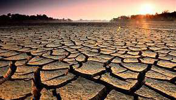

### வறட்சி

தமிழ்நாடு ஒரு நீர்ப் பற்றாக்குறை உள்ள மாநிலமாகும். இது குறிப்பிட்ட பருவத்தில் அல்லது நிரந்தரமாக காணப்படும் ஒன்று. நமது மாநிலம் நீர் தேவைக்குப் பருவ மழையையே பெரிதும் நம்பியுள்ளது. இப்பருவமழை பொய்ப்பு வறட்சியின் பேரழிவிற்கு வழிவகுக்கிறது.

நீர் பற்றாக்குறையைக் கையாளுவதற்கு அல்லது சரி செய்வதற்கு மழை நீர் சேகரிப்பு, நீர்வளப் பாதுகாப்பு முறைகளைத் தீவிர முறையில் பின்பற்ற வேண்டும்.

### நீர் சேகரிப்பதற்கான சில வழிமுறைகள்

நீர் மாசுபடுதலைத் தடுத்தல், நீர் மறுசுழற்சி, சிக்கனமான நிலத்தடி நீர் பயன்பாடு, மக்கள் தொகை கட்டுப்பாடு, மரபுவழி நீர்வளங்களைப் புதுப்பித்தல், நவீன நீர்ப்பாசன முறைகளைப் பயன்படுத்தல், காடுகளின் பரப்பளவை அதிகரித்தல், பயிரிடும் முறைகளை மாற்றுதல், வெள்ளப்பெருக்கு மேலாண்மை, புவி வெப்ப நீர் பயன்பாடு ஆகியன நீர்வளத்தை பாதுகாக்கும் சில வழிமுறைகள் ஆகும்.

### தீ விபத்து

தமிழ்நாடு ஒரு வெப்ப மண்டலத்தில் உள்ள மாநிலம். கோடைக்காலத்தில் அதிக வெப்பம் காரணமாக, இலையுதிர் மற்றும் முட்புதர் காடுகளில் அவ்வப்பொழுது காட்டுத் தீ ஏற்படுகிறது.

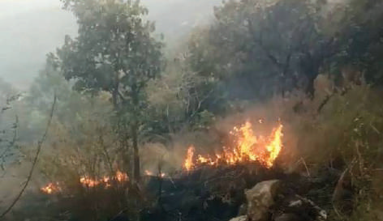

### காட்டுத்தீ

### அபாய நேர்வு குறைப்பு நடவடிக்கைகள்தீ விபத்திற்கு முன்

எளிதில் தீப்பற்றக்கூடிய தாவரங்கள் மற்றும் பொருட்களிலிருந்து போதுமான இடைவெளி விட்டு (30 அடி தூரம்) குடியிருப்புகளை ஏற்படுத்துதல், உள்ளூர் கட்ட மற்றும் தீ விதிமுறைகளைப் பின்பற்றுதல், மரங்கள் மற்றும் செடிகளின் உயரத்தைக் கட்டுப்படுத்தி வைத்திருத்தல், தீப்பிடிக்காத தர நிர்ணயம் செய்து அனுமதிக்கப்பட்ட பொருட்களைப் பயன்படுத்துதல், குடும்ப உறுப்பினர்களுடன் பாதுகாப்பான இடங்களுக்கு வெளியேறும் பல்வேறு வழிமுறைகளைத் திட்டமிடல் ஆகியன முக்கியமாக மேற்கொள்ள வேண்டியவையாகும்.

### தீ விபத்தின் போது

வானொலி, தொலைக்காட்சி மற்றும் செய்தித்தாள்களின் மூலம் அவ்வப்போதைய செய்திகளை உடனுக்குடன் தெரிந்து கொள்ளுதல், வாளிகளில் போதுமான நீரை நிரப்பி வைத்திருத்தல், புகைமூட்டம் இருக்கும் பட்சத்தில் அறையில் வெளிச்சத்தை ஏற்படுத்துதல், எரிவாயு இணைப்பினை துண்டித்தல் மற்றும் மின் சாதனங்களை மின் துண்டிப்பு செய்தல், அனைத்து குடும்ப உறுப்பினர்களும் அவ்விடத்தில் இருந்து வெளியேற வழிவகை செய்தல் போன்றவையாகும்.

### தீ விபத்திற்குப் பின்

மீண்டும் குடியிருப்புகளுக்கு திரும்பும் முன் தீயணைப்பு அதிகாரிகளின் உதவியோடு சரிபார்த்துக் கொள்ளுதல், தீயினால் எரிந்த பகுதிகளில் மீண்டும் தீ ஜுவாலைகள் தோன்ற வாய்ப்பு உள்ளதால், அப்பகுதிகளில் நுழையும் முன் போதுமான எச்சரிக்கைகளைக் கையாளுதல், அறைகளில் தீ உள்ள பகுதிகள், கூரைப் பகுதிகள், அதன் விளிம்பு பகுதிகள் மற்றும் வெளிப்பகுதிகள் ஆகியவற்றில் தீப்பொறிகள் உள்ளனவா எனச் சோதித்து அறிதல் வேண்டும். சுனாமி இந்தியாவில் சுனாமி என்பது பொதுவானதாக இல்லை என்றாலும், 2004ஆம் ஆண்டு சுனாமி நிகழ்வு இந்தியாவையும், தமிழ்நாட்டையும் எச்சரித்திருக்கிறது.

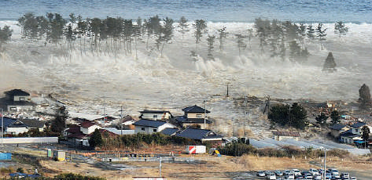

### சுனாமிஅபாய நேர்வு குறைப்பு நடவடிக்கைகள்  சுனாமிக்கு முன்

கடல் பகுதிகளுக்கு அருகாமையில் வசித்தால் சுனாமி அலையின் தாக்கங்களையும், உள்ளூர் எச்சரிக்கை தொடர்பான நடவடிக்கைகளையும் தெரிந்து வைத்திருத்தல், அவசர குடியிருப்பு மேம்பாட்டுக்கான திட்டங்களை வகுத்தல், அருகாமையில் உள்ள உயரமான நிலப்பகுதி மற்றும் அதனை எவ்வாறு அடைவது என்பதை தெரிந்து வைத்திருத்தல் வேண்டும். சுனாமியின்போது தயாராக வைத்திருக்கும் உடமைகளுடன் உடனடியாக வெளியேறுதல், ஆபத்தான பகுதிகளுக்குச் செல்லாமல் இருத்தல், உடனடியாக அருகில் உள்ள உயரமான பகுதிக்குச் செல்லுதல், கட்டங்களின் உயரமான மாடிகளில் அல்லது உயரமான மரங்களில் ஏறிக் கொள்ளுதல், மற்றும் மிதக்கும் பொருட்களைப் பற்றிக்கொள்ளுதல். மேலும், கடலோரப் பகுதிகளுக்கு சென்று சுனாமி அலைகளைப் பார்வையிடுவதைத் தவிர்த்தல், மற்றும் உள்ளூர் வானொலியின் அவசர கால நடவடிக்கைகள் பற்றிய செய்திகளைக் கேட்டறிதல் போன்றவை சுனாமியின்போது பின்பற்ற வேண்டிய நடவடிக்கைகளாகும். சுனாமிக்குப் பின் தொடர்ந்து வானொலி செய்திகளைக் கேட்டல், உரிய அதிகாரிகளிடம் இருந்து அவ்விடத்திலிருந்து செல்வதற்கான அறிவிப்பு வரும்வரை வெளியேற்றப்பட்ட இடங்களுக்கு செல்லாதிருத்தல், காயங்களைப் பற்றி சுயபரிசோதனை செய்து முதல் உதவி பெறுதல் மற்றும் மற்றவர்களுக்கு உதவி செய்தல் ஆகியன சுனாமிக்குப் பின் பின்பற்றப்பட வேண்டிய முக்கிய நடவடிக்கைகளாகும்.

### நில அதிர்வு

இந்திய நாடு ஒரு பரந்து விரிந்த நாடு. பொதுவாக வட இந்திய மற்றும் மத்திய இந்தியப்பகுதி அதிக அபாய தன்மை உள்ள மண்டலமாக உள்ளது. மிதமான அபாய தன்மை உள்ள மண்டலமாக தமிழ்நாடு உள்ளது.

மாநிலத்தின் பேரிடர் மேலாண்மை ஆணையத்துடன் கீழ்க்காணும் மீட்புப் படைகள் மற்றும் அமைப்புகள் இணைந்து செயல்படுகின்றன.

### மாநில / யூனியன் பிரதேச அமைப்புகள்

1. மாநிலப் பேரிடர் மேலாண்மை ஆணையம் (தலைவர் - முதலமைச்சர்) 2. நிவாரண / பேரிடர் மேலாண்மை துறை 3. காவல்துறை 4. வனத்துறை 5. தீ மற்றும் குடிமையியல் பாதுகாப்பு சேவைகள் 6. சுகாதார சேவைகள் 7. போக்குவரத்துத்துறை 8. பொதுப்பணித்துறை 9. கால்நடைத்துறை 10. உணவு மற்றும் வட்ட வழங்கல் துறை

### பாடச்சுருக்கம்

- இயற்கை புவியியல் என்பது பல்வேறு இயற்கை அம்சங்களான நிலத்தோற்றம், வடிகாலமைப்பு, காலநிலை, மண் மற்றும் இயற்கைத் தாவரங்களைப் பற்றிய புவியியலின் ஒரு பகுதியாகும்.

- தமிழ்நாட்டின் இயற்கைப் பிரிவுகளை மூன்று பெரும் பிரிவுகளாகப் பிரிக்கலாம். அவை மலைகள் (மேற்கு மற்றும் கிழக்குத் தொடர்ச்சி மலைகள்), பீடபூமிகள் (பாரமஹால், கோயம்புத்தூர் மற்றும் மதுரை), சமவெளிகள் (உள்நாட்டுச் சமவெளி மற்றும் கடற்கரைச் சமவெளி).

- காவிரி, வைகை, பாலாறு, தென்பெண்ணை ஆறு மற்றும் தாமிரபரணி ஆகியன தமிழ்நாட்டின் முக்கிய ஆறுகளாகும்.

- தமிழ்நாட்டில் காணப்படும் மண் வகைகள் அவற்றின் பண்புகளின் அடிப்படையில் 5 பிரிவுகளாகப் பிரிக்கப்படுகின்றன. அவை வண்டல், கரிசல், சிவப்பு, சரளை மற்றும் உவர் மண்ணாகும்.

- தமிழ்நாட்டின் பரப்பில் 20.31 சதவித்தினை காடுகள் கொண்டுள்ளது. பசுமை மாறாக்காடுகள், இலையுதிர்க் காடுகள், சதுப்புநிலக் காடுகள், முட்புதர்க் காடுகள் மற்றும் வெப்பமண்டல மலைக் காடுகள் ஆகியன முக்கிய காடுகளாகும்.

- பேரிடர் அபாய நேர்வு குறைப்பு என்பது முறையான நடவடிக்கைகளின் மூலம் அபாயத்தின் தன்மையைக் குறைப்பதாகும்.

- நிலஅதிர்வு, எரிமலை, நிலச்சரிவு, சூறாவளி, வறட்சி மற்றும் காட்டுத்தீ ஆகியன இயற்கைப் பேரிடர்களாகும்.

### அபாய நேர்வு குறைப்பு நடவடிக்கைகள்  நில அதிர்வின் போது

நில அதிர்வு முழுவதும் முடியும் வரை, கனமான மேசை அல்லது மரத்தாலான பலகைகளினால் ஆன பொருட்களின் கால்களைப் பிடித்துக்கொண்டு அதற்கு அடியில் அமர்ந்திருக்க வேண்டும்.

### நில அதிர்விற்குப் பின்

நில அதிர்வு நின்றவுடன் மிக எச்சரிக்கையுடன் செயல்படுதல் வேண்டும். நிலஅதிர்வினால் பாலங்கள், பாதைகள் போன்றவை பாதிப்படைந்திருக்க வாய்ப்பு உள்ளதால் அவற்றை கடப்பதைத் தவிர்த்தல் வேண்டும்.

### மாவட்ட அமைப்புகள் கீழ்க்காணுமாறு

1. மாவட்ட நீதிபதி (தலைவர் - மாவட்ட ஆட்சித் தலைவர்)

2. வருவாய்த்துறை

3. குடிமை பணி நிருவாகம்

4. உள்ளூர் காவல்துறை

5. குடிமை பாதுகாப்பு

6. தீயணைப்பு மற்றும் அவசர சேவைகள்

7. ஊர்க் காவல் படை (உள்ளூர், சமூகம், அரசு சாரா அமைப்பு, தன்னார்வ நிறுவனங்கள்)

### பயிற்சி

### I சரியான விடையைத்

### தேர்ந்தெடுத்து எழுதுக

1. தமிழ்நாட்டின் அட்சப் பரவல் முதல் வரை உள்ளது.

அ) 8°4´ வ முதல் 13° 35´ வ வரை ஆ) 8° 5´ தெ முதல் 13° 35´ தெ வரை இ) 8° 0´ வ முதல் 13° 05´ வ வரை ஈ) 8° 0´ தெ முதல் 13° 05´ தெ வரை

2. தமிழ்நாட்டின் தீர்க்க பரவல்முதல்வரை உள்ளது .

அ) 76°18´ கி முதல் 80°20´ கி வரை ஆ) 76°18´ மே முதல் 80°20´ மே வரை இ) 10°20´ கி முதல் 86°18´ கி வரை ஈ) 10°20´ மே முதல் 86°18´ மே வரை

3. தமிழ்நாட்டில் உள்ள மிக உயரமான சிகரம் ஆகும்.

அ) ஆனைமுடி ஆ) தொட்டபெட்டா இ) மகேந்திரகிரி ஈ) சேர்வராயன்

4. கீழ்க்காண்பவற்றில் தமிழ்நாட்டின் மேற்கு தொடர்ச்சி மலையில் அமையாத கணவாய் எது?

அ) பாலக்காடு ஆ) செங்கோட்டை இ) போர்காட் ஈ) அச்சன்கோவில்

5. கீழ்க்காண்பவற்றில் அரபிக் கடலில் கலக்கும் ஆறு எது?

அ) பெரியார் ஆ) காவிரி இ) சிற்றார் ஈ) பவானி

6. தமிழ்நாட்டில் அதிகப் பரப்பளவில் மாங்குரோவ் காடுகள் காணப்படும் மாவட்டம் எது?

அ) இராமநாதபுரம் ஆ) நாகப்பட்டினம் இ) கடலூர் ஈ) தேனி

7. பின்னடையும் பருவக்காற்றுலிருந்து ஈரப்பத்தை எடுத்துக் கொள்கிறது.

அ) அரபிக்கடல் ஆ) வங்கக் கடல் இ) இந்தியப் பெருங்கடல் ஈ) தைமுர்க்கடல்

8. தமிழ்நாட்டில் அதிக பரப்பளவில் காடுகளைக் கொண்ட மாவட்டம் அ) தருமபுரி ஆ) வேலூர் இ) திண்டுக்கல் ஈ) ஈரோடு

### II கோடிட்ட இடங்களை நிரப்புக

1. நீலகிரி மற்றும் தர்மபுரி மாவட்டங்களுக்கிடையே காணப்படும் பீடபூமி ஆகும்.

2. கிழக்குத் தொடர்ச்சி மலையின் தென் பகுதியில் உள்ள உயரமான சிகரம் ஆகும்.

3. ஆற்றுத் தீவான ஸ்ரீரங்கம்மற்றும் ஆறுகளுக்கு இடையே அமைந்துள்ளது.

4. தமிழ்நாட்டின் மாநில விலங்கு ஆகும்.

### III பொருத்துக

1. குளிர்காலம் -  முன் பருவ மழை

2. கோடைக்காலம் -  ஜூன் – செப்டம்பர்

3. தென்மேற்கு பருவக்காற்று -  மார்ச் – மே

4. வடகிழக்கு பருவக்காற்று -  ஜனவரி – பிப்ரவரி

5. மாஞ்சாரல் -  அக்டோபர் –டிசம்பர்

### IV கூற்று வகை வினா

1. கூற்று: தமிழ்நாடு தென்மேற்குப் பருவகாற்று காலங்களில் அதிக மழையைப் பெறுவதில்லை.

காரணம்: இது மேற்கு தொடர்ச்சி மலையின் மழை மறைவுப் பிரதேசத்தில் அமைந்துள்ளது அ) கூற்று, காரணம் இரண்டும் சரி. காரணம் கூற்றை விளக்குகிறது  ஆ) கூற்று, காரணம் இரண்டும் சரி. ஆனால் காரணம் கூற்றை விளக்கவில்லை  இ) கூற்று சரி. ஆனால் காரணம் தவறு ஈ)  காரணம் சரி. ஆனால் கூற்று தவறு

### V சுருக்கமாக விடையளிக்கவும்

1. தமிழ்நாட்டின் எல்லைகளைக் குறிப்பிடுக

2. ‘தேரி’ -  என்றால் என்ன?

3. கடற்கரைச்சமவெளி எவ்வாறு உருவாகிறது?

4. தமிழ்நாட்டின் முக்கிய தீவுகளைக் குறிப்பிடுக.

5. தாமிரபரணி ஆற்றின் துணை ஆறுகளின் பெயர்களை எழுதுக

6. பேரிடர் அபாய நேர்வு குறைப்பு - வரையறு.

7. புயலின்போது வானிலை மையம் மீனவர்களை எவ்வாறு எச்சரிக்கிறது.?

**VI வேறுபடுத்துக.**

1. தாமிரபரணி மற்றும் காவிரி

### VII கீழ்க்காண்பற்றிற்கு காரணம் கூறுக

1. கிழக்குத் தொடர்ச்சி மலைகள் தொடர்ச்சியற்று காணப்படுகின்றன.

2. தென்மேற்குப் பருவக்காற்று காலத்தில் தமிழ்நாடு மிகக்குறைந்த மழையைப் பெறுகிறது.

### VIII பத்தி அளவில் விடையளிக்கவும்

1. தமிழ்நாட்டின் பீடபூமி நிலதோற்றத்தின் தன்மையை விவரிக்கவும்.

2. காவிரி ஆறு குறித்து தொகுத்து எழுதுக.

3. தமிழ்நாட்டில் உள்ள மண் வகைகளின், பரவல் பற்றி விளக்குக.

4. புயலுக்கு முன்னரும் பின்னரும் மேற்கொள்ள வேண்டிய அபாய நேர்வு குறைப்பு நடவடிக்கைகளை எழுதுக

### IX நில வரைபடப் பயிற்சி

1. தமிழ்நாட்டில் உள்ள ஆறுகள், மண் பரவல் மற்றும் காடுகளின் வகைகளை வரைபடத்தில் குறிக்கவும்.

## இணையச் செயல்பாடு பேரிடர் மேலாண்மை

படி – 1 URL அல்லது QR குறியீட்டினைப் பயன்படுத்தி இச்செயல்பாட்டிற்கான இணையப்பக்கத்திற்கு செல்க படி – 2 வலைப்பக்கத்தின் மேலே சென்று மொழிவடிவத்தை தமிழாக மாற்றவும். பின்னர் நடுப்பக்க மெனுவில் ‘Media and Public Awareness’ க்குச் சென்று ‘Infographics’ என்பதைத் தேர்ந்தெடுக்கவும் படி – 3 தமிழ்நாடு அரசின் பேரிடர் மேலாண்மையால் வெளியிடப்பட்டுள்ள முன்னெச்செரிக்கை நடவடிக்கைகளைக் காண பதிவிறக்கம் (Download) செய்யவும்.

உரலி: https://tnsdma.tn.gov.in/

### மேற்கோள் நூல்கள்

1. Geography of Tamil Nadu by Kumarasamy (2018), Varthamana Publication, T. Nagar, Chennai

2. Kumaraswamy, S.V. (2014). Geography of Tamil Nadu (Tamil Version), Sakthi Abirami Pathipagam, Coimbatore.

3. Statistical Hand Book of Tamil Nadu (2016). Department of Economics and Statistics, Government of Tamil Nadu, Chennai.

4. Mathew, M. (2018). Manorama Yearbook – 2018 (English Version), Manorama Company Ltd., Kottayam.

### இணையதள வளங்கள்

1. http://www.tn.gov.in/ta/Tamil Nadustate

2. https://www.forests.tn.gov.in

3. http://www.india-wris.nrsc.gov.in/wrpinfo/ index.php?title=Major_Rivers_Flowing_ in_Tamil_Nadu

4. http://www.environment.tn.nic.in/

5. http://agritech.tnau.ac.in/

